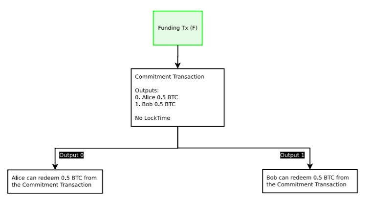
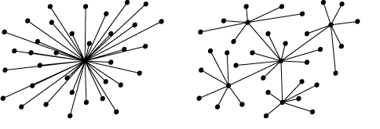

# Lightning Network for Dummies 

---
## Setting the scene 

In order for Bitcoin, or any other cryptocurrency to hold its value- **It needs value proposition**

However, currently Bitcoin  is too slow and too expensive to be a viable method of payment for everyday use. 

Note: It needs value proposition. In saying that, as a cryptocurrency, it still possess the most important feature: decentralisation. For bitcoin to succeed, the benefits of using it to buy a cup of coffee needs to outweigh those fusing status-quo payments, like cash or credit. At this point in time, bitcoin’s benefits do not outweigh cash or credit. It’s slow and more importantly, too expensive. Although decentralisation is imperative- nobody wants to wait a minimum of 10 minutes to receive 2 confirmation and pay multi dollar fees just to buy a cup of coffee. That’s why solutions to this problem have been debated for the las several years. 

---

Solutions can be boiled down to two primary components: 
1. bigger blocks 
2. Off-chain scaling 

Note: On its face- increasing the block size seems like the logical solution. It’s been done before, so why arbitrarily limit it at 1MB. Satoshi Nakamoto- Bitcoin’s creator- stated that blocks should grow as big as they need to be; and implied that blocks should increase as they approach max capacity 

---

However, the argument is: 
* Big blocks increase the cost of running full-node 
* Big blocks will lead to a centralisation in mining 

Note: If scaling takes place now, Bitcoin risks technical issues and centralization

---

## Introducing Lightning

---

* The Lightning Network (LN) mainnet reached over 1 000 active nodes for the first time in its short history
* There are currently just over 11 000 active nodes on the main Bitcoin blockchain 

Note: It remarkable is how quickly users have flocked to the LN mainnet, a clear indication that enthusiasm for this scaling technology remains high. 

---

From the whitepaper, in order to use the LN, a common-user needs to : 
1. Create the parent (funding transaction)
2. Create the children (commitment transitions and all spends from the commitment transactions)
3. Sign the children 
4. Exchange the signatures for the children 
5. Sign the parent 
6. Exchange the signatures for the parent 
7. Broadcast the parent on the blockchain 

Note: Essentially, you fund the network with a transaction on the Bitcoin Mainnet and commitment transactions re-shift the original balances. To sign the funding transaction, they need to exchange their parent signatures and broadcast them back on the mainnet. 

---

---

## Problematic Implications of the Lightning Network 

There are issues with the implentation of this type of network:

* It may not be particularly user friendly 

Note: As innovative as this idea is, questions have been raised as to how intuitive it will be for a common consumer. An overly complex user-engagement will lead users to remaining on the mainnet, bogging down the network, keeping fees high and transactions backlogged.

---

* Economics leads to centralisation 

In order to use the lightning network, and then use your Bitcoin again onchain, it requires a funding transaction, and a broadcast (or closing) transaction. Each transaction requires a fee. Unless  fees are greatly reduced, users will not be blindly opening up channels with one another.

Note: If I wanted to purchase a coffee from my local coffee shop, I might open up a payment channel with them, as I visit them often. Opening a channel with a funding transaction could potentially make economic sense if I frequently visit the coffee shop and make multiple purchases within a given period of time. However, I would still have to consider that the amount funded in the Funding Transaction will not be available to me on the Bitcoin mainnet. 

---

YOU DON’T NECESSARILY NEED TO HAVE AN OPEN CHANNEL WITH EVERYONE, IF THERE’S A ROUTE ON THE NETWORK TO THAT MERCHANT

A well-distributed Lightning Network will require substantial cooperation from the network users. 

---

Important to note:
* Lightning Network will be an open market
* A third party will be able to set their fee structure to connect end-users who wish to transact with one another
* The third party needs to possess the necessary capital to process the transaction. 

---

If Alice and Bob do not have an open channels and Alice wants to send Bob 0.5 BTC, they’ll both need to be connected to a third party (or a series of 3rd parties). Say if Charles (the third party) only possesses 0.4 BTC in his respective channels with other users, the transaction will not be able to go through that route.

---

What if a well-funded third party exists...

Note: What if Alice, Bob, Charles, Danny, Eddy, Francis and Gina are all connected to that third party? Not only will each route always possess the necessary capital, it will also be the shorted route. There will be no economic incentive for each user to open up new channels with each other. So, in practice, Lightning is more likely to look like this: There is nothing preventing such large third parties from taking form. All the economic incentives of Lightning point to this exact scenario.

---

* Such hits are likely to always be the shortest route- they can raise fees because longer routes will results in incrementally larger fees
* The lightning network will be a hub and spoke network of bi-directional payment channels
* Channels are connections between two nodes on the network, and a single transaction may travel through several channels
* Nodes will charge you to use their channels, so you end up paying fees to multiple nodes

Note: If a route has three intermediary nodes, each intermediary requires a fee. If each fee is 0.5 satoshis (totalling 1.5 satoshis), the large hop can just set their fees at 1.4999 satoshis to compete. Also, they can provide further incentive to create the scenario described, by covering mainnet funding transaction fees for all users. 

---

## Who benefits?

**Whoever runs and operates the centralised hubs**

*Thus, it seems that the Lightning Network is nothing more than shifting fees away from miners and the mainnet and- in effect centralising the network, by creating Visa and MasterCard like companies which operate Lightning hubs. Further, it is still not fully understood how ‘trustless’ these companies will be.*  

## Alt-coin solutions

### Dash 

* DASH employs a hybrid-system of Proof-of-Work (whereby transactions are mined by miners) and Proof-of-Service (similar to Proof-of-Stake, where Masternodes stake 1000 DASH but also provide network services) 
* Masternodes can instantly verify transactions on a master block
* Not every use-case requires an instant verification, but this optional service makes DASH a viable option today to buy that coffee
* DASH also has an optional privacy feature, albeit, rather limited to other privacy cryptocurrencies

+++

* DASH has agreed to incrementally test and increase the block she from 2MB blocks through 400MB blocks
* It is also funding research for dedicated hardware for miners and nodes to process increased volume. 

## Concluding Notes

1. On-boarding fees will be too expensive. Further, people will not be able to redeem their money by closing the channel if someone tries to steal it due to high fees.  
2. If fees are low, there is no reason to use LN in the first place. Obvious flaw.  
3. The above assumes that the LN routing is hard to attack.

+++

4. It is assumed that LN will be decentralized. It's highly likely that hub operators will be required to keep track of everyone using their hub and report to governments. This defeats the point of Bitcoin and disqualifies this approach as a legitimate scaling option.  
5. Nobody wants to lock up all of their Bitcoins inside of a channel for years, which is how the LN authors envision it will be used.  

+++

6. This essentially steals fees from the miners who actually support the network. It makes the network unhealthy. Any LN hub is a big fat middleman that Bitcoin was meant to prevent. Users will not use it for this reason
7. Complexity. Bitcoin is complex enough for new users. Adding another layer isn't something they will understand and be willing to use.  
8. Off line payments are not supported: clients have to be talking to each other in realtime (money is stuck at the current state of the channel, if partner has not signed- you have to constantly monitor the status of the bitcoin blockchain, to ensure private transactions are not being broadcast back to bitcoin network)

+++

9. Not good for large transactions-  the amount that you can send, is limited by how large the payment transactions are. So people needing to transact big amounts might as well open another payment channel 
10. There are limits to the amount transferred using lightning (microtransactions)
11. It is going to be difficult to be constantly monitoring the blockchain and keeping a real time connection with all of their peers- centralised hubs offering a lightning node as a service with essentially acts a hub to interact with others on the lightning network 

