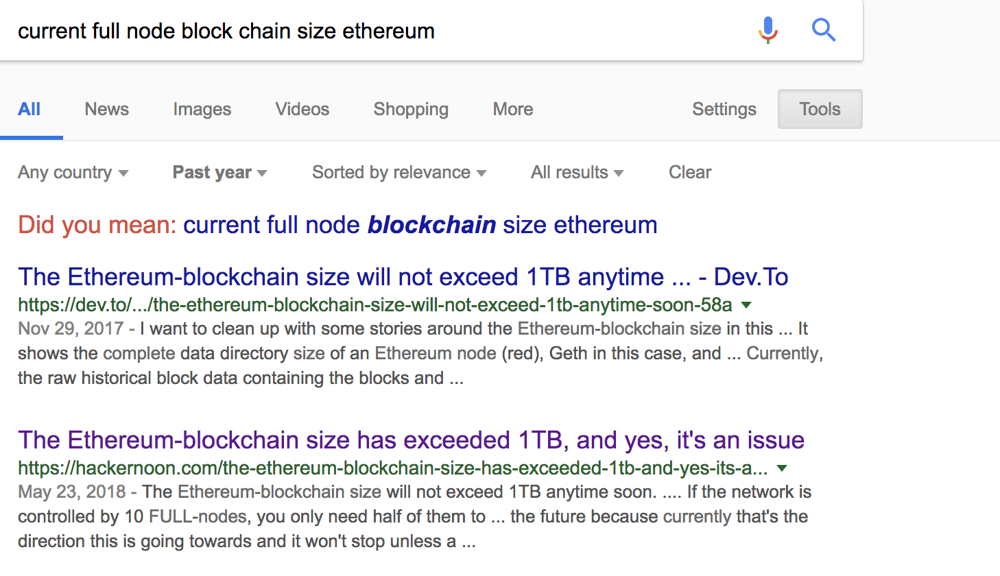
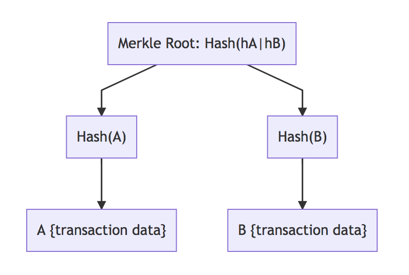
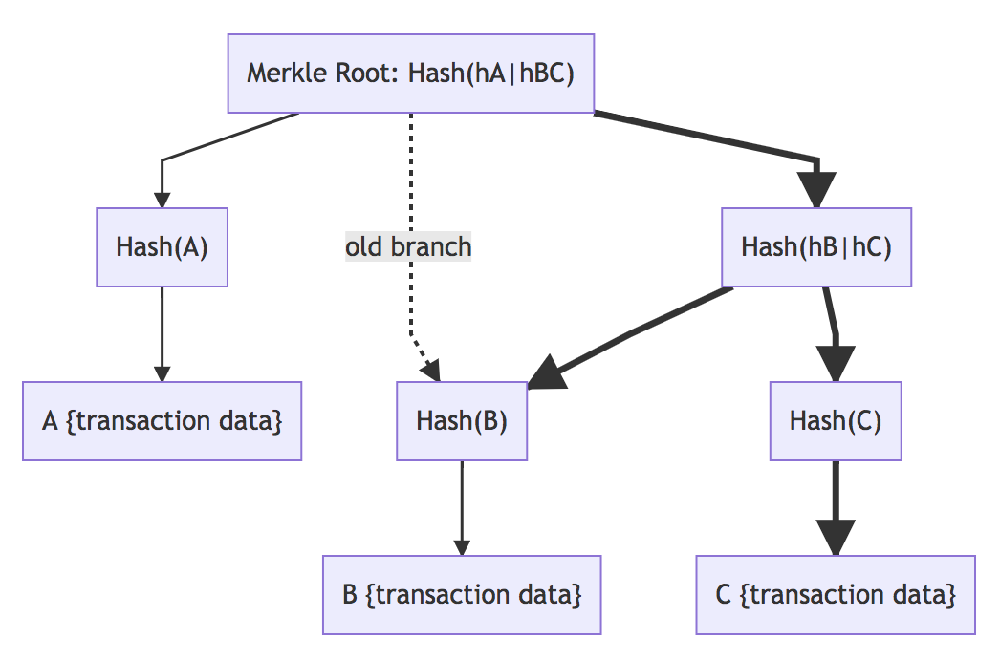
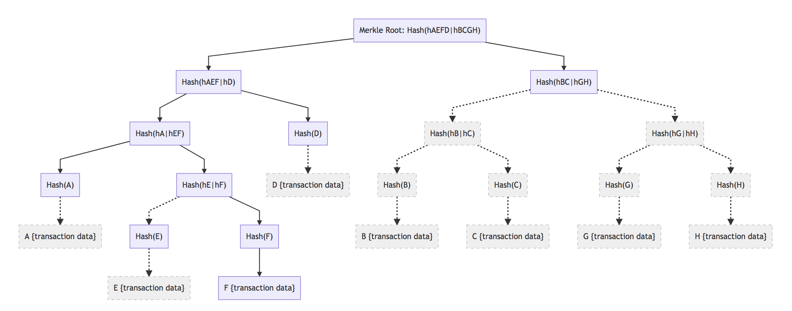
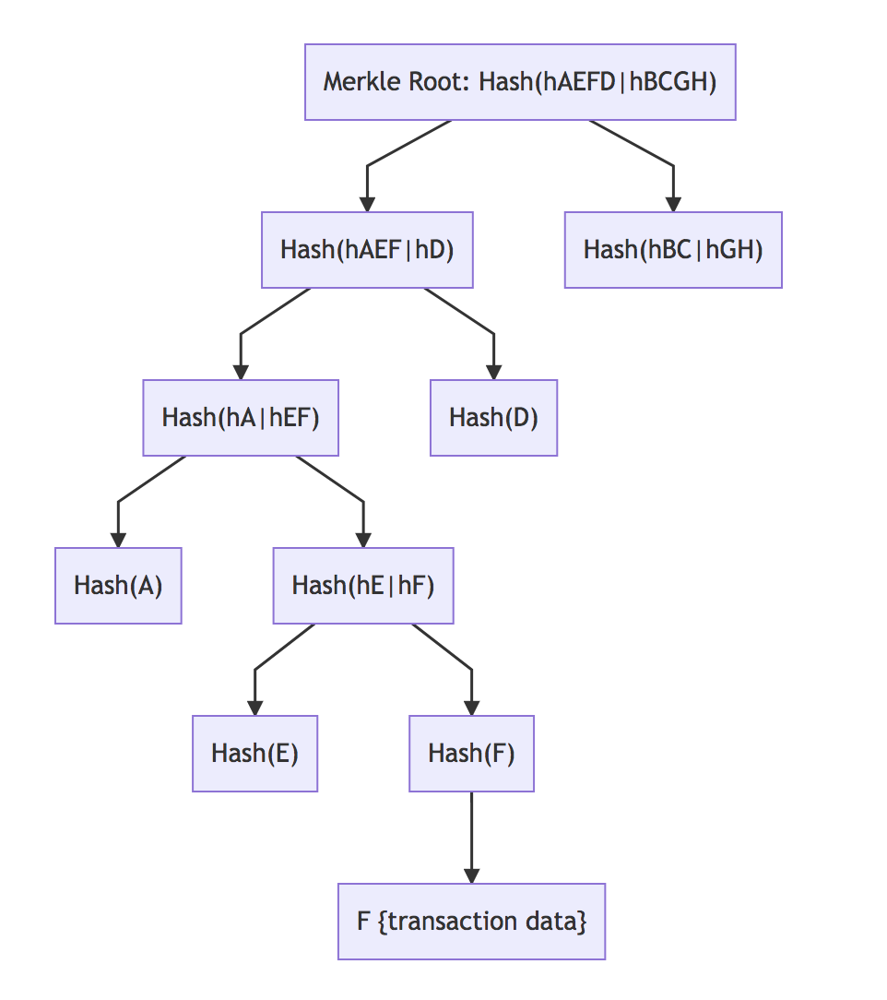
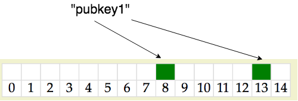
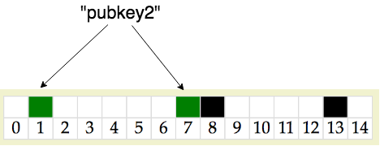

----
theme: default
paginate: true
footer: © Tari Labs, 2018-2021. (License : CC BY-NC-SA 4.0)
_class: lead
backgroundColor: #fff
----

# Introduction to Simple Payment Verification (SPV), Merkle Trees and Bloom Filters

----
# Types of Validating Nodes : Full Node
  - Stores the all blocks in the longest chain  
  - Size is a problem 

  

----

# Types of Validating Nodes: Simple Payment Verification (SPV) client
* Only have block headers and asks a full node for blocks as they are needed
* If the block is in the longest chain and 6 blocks deep, it's accepted as valid

----

# Inefficient SPV implementation
* Only store block headers
* When a transaction is needed, download the entire block
* Hash to compare it to header to determine if valid
> Do we really need the entire block to verify a single transaction?

----
# Merkle Trees (and more importantly branches)

* A binary tree structure where:
  * Data is stored in the leaf nodes
  * A non-leaf node is the hash of it's 2 descendants
* Most importantly, descendant nodes can be pruned, leaving the rest of the tree's hash integrity intact.
* This means we only need the Merkle branch with the transaction we want to verify

> Non-binary Merkle trees also exist

----
# Merkle Tree Example

[//]: # "To generate these diagrams go to https://mermaidjs.github.io/mermaid-live-editor and paste the source"

----
# Merkle Tree Example

Adding a node

----

# Merkle Tree Example

Pruning to branch

----
# Merkle Tree Example

Pruning to branch F

----
# Merkle Tree Example

Pruning to branch F

----
# SPV and Merkle Branches

* SPV client request Merkle Branch from full node for transactions. 
* SPV client checks the Merkle Root against block header
* SPV client checks that block is at correct depth

----
# Privacy Problems
* When wallets only request transactions to the addresses it owns, full nodes will become aware of the owner
* To mitigate this, Bloom Filters can be used

----
# Bloom Filters

* Provide filtering when receiving blocks
* Provides privacy

----
# Bloom Filter Implementation
* Start with empty array of _m_ bits

----

# Bloom Filter Implementation

* Hash the data to filter on (e.g. public address) using _k_ hash functions to a value between 0 and _m_
* Set those bits in the array
* In this example, _k_ = 2

----
# Bloom Filter Implementation

* Repeat for more filter criteria, or to obscure the original filter

* Then send the filter to the full node

----
# Bloom Filter Implementation

* Whenever the full node would relay a block, it uses the same _k_ hash functions and checks for an intersect on the filter.
* If there are no 0's hit, then the transaction is removed from the Merkle Tree before forwarding to the client
  * Empty blocks are not forwarded

----
# Bloom Filter Implementation

* If there are transactions that must be forwarded, the pruned Merkle Tree is forwarded
* There may be false positives included, which the client will filter out
* This hides the actual filter criteria from any full nodes

----
# Bloom Filter Implementation

- A very useful Bloom Filters interactive example:
[Bloom Filters by Example](http://llimllib.github.io/bloomfilter-tutorial/)

# Useful resources

- [Bitcoin Developer Guide](https://bitcoin.org/en/developer-guide#simplified-payment-verification-spv)
