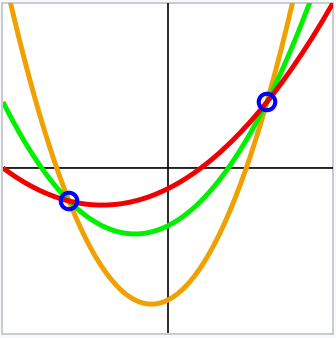

-----
theme: default
paginate: true
footer: © Tari Labs, 2018-2021. (License : CC BY-NC-SA 4.0)
_class: lead
backgroundColor: #fff
-----
<style>
section {
  font-size: 1.5em;
}
</style>

# Mimblewimble Multiparty Bulletproof UTXO
- Introduction
- Review of Bitcoin `m-of-n` Multisig
- Security Aspects
- Mimblewimble `n-of-n` Multiparty Bulletproof (BP) UTXO
  - Multiparty Funding Transaction
  - Multiparty BP Range Proof
  - Spending the Multiparty UTXO
- Shamir's Secret Sharing Scheme (SSSS)
- Pedersen Verifiable Secret Sharing
- Mimblewimble `m-of-n` Multiparty BP UTXO
  - Secret Sharing for Multiple Rounds, - How it Works, - Spending Protocol
- Conclusions
See full report [*here*](https://tlu.tarilabs.com/protocols/mimblewimble-mp-bp-utxo/MainReport.html).

----

# Introduction
Mimblewimble does not have a Bitcoin-type multisig applied to a UTXO. In Bitcoin, multisig payments 
are usually combined with P2SH to send funds to a P2SH payment address. The redeem script sets the 
conditions for the UTXOs linked to the P2SH payment address to be spent.

Mimblewimble transactions do not involve payment addresses. The UTXO can be spent if the Pedersen 
Commitment can be opened/unlocked; does not require an "owner" signature. A typical Mimblewimble 
UTXO looks like this: **08c15e94ddea81e6a0a31ed558ef5e0574e5369c4fcba92808fe992fbff68884cc**

Mimblewimble commitments are totally confidential and ownership cannot be proved. Also all senders 
receivers must interact to conclude a Tx. We need to utilize Mimblewimble in a different way to enable 
multiparty UTXO functionality.

----

# Review of Bitcoin `m-of-n` Multisig

A typical `2-of-3` Bitcoin P2SH multisig redeem script:
```
redeemScript = <OP_2> <A pubkey> <B pubkey> <C pubkey> <OP_3> OP_CHECKMULTISIG
```
The P2SH payment address:
```
redeemScriptHash = RIPEMD160(SHA256(redeemScript))
```
```
P2SHAddress = base58check.Encode("05", redeemScriptHash)
```
Generic funding transaction's output script for the P2SH payment address:
```
scriptPubKey = OP_HASH160 <redeemScriptHash> OP_EQUAL
```

----

A 2-of-3 multisig redeem transaction's input script
```
scriptSig = OP_0 <A sig> <C sig> <redeemScript>
```
The combined spending and funding transaction script:
```
validationScript = OP_0 <A sig> <C sig> <redeemScript> OP_HASH160 <redeemScriptHash> OP_EQUAL
```

----

# Security Aspects

Mimblewimble relies on Pedersen Commitments and range proofs (i.e. BP range proofs) to provide 
security. Pedersen Commitments $C(v,k) = (vH + kG)$ provide perfectly hiding and computationally 
binding commitments. 

An adversary with infinite computing power can determine alternate pairs $v ^\prime , k ^\prime$ such that 
$C(v,k) = C(v ^\prime , k ^\prime)$ in a reasonable time to open the commitment to another value when challenged (computationally binding). However, it will be impossible to determine the specific pair $v, k$ used to create 
the commitment, because there are multiple pairs that can produce the same $C$ (perfectly hiding). 

Anyone can try to spend or mess with unspent coins embedded in commitments, but BP range proofs 
assure that all values are in the range $[0,2^{64} - 1]$ and also stop third parties locking away one's funds.

----

Let $(v_1 H + k_1 G)$ be Alice' commitment that Bob tries to lock away. He knows Mimblewimble 
commitments are additionally homomorphic; he can theoretically use Alice's commitment in a Tx and 
create a new opposing output that sums to a commitment of the value of $0$, 
$$
(0H + kG) = (kG) = (\mathbf{0})
$$ 
Bob will attempt to add an additional blinding factor $k_{x}$ to the commitment:
$$
(v_1 H + (k_1 + k_x) G) - (v_1 H + k_1 G) - (v_2 H + k_2 G) + \mathrm{fee} \cdot H = (\mathbf{0})
$$

This new UTXO $(v_1 H + (k_1 + k_x) G)$ would be equally unspendable by Alice and Bob. Fortunately a 
BP range proof cannot be constructed as the values of $v_1$ and $k_1 + k_x$ must be known, so the miners 
will not accept. However, if Bob and Alice work together, it should be possible to create a BP range proof 
for a `2-of-2` multisig type Tx.

----

# Mimblewimble `n-of-n` Multiparty BP UTXO
Alice, Bob and Carol agree to set up a multiparty `3-of-3` multisig fund that they can control together. 
They decide to use a sharing hash function 
$$
val_H = \text{H}_{s}(arg)
$$
as a handshaking mechanism:

1. Send hash $val_H$ to all
2. Send value $arg$ to all
3. Verify and proceed, or stop
4. Denoted by $\text{share:}$ 


They are now ready to proceed: [Setting up the Multiparty Funding Transaction](https://tlu.tarilabs.com/protocols/mimblewimble-mp-bp-utxo/MainReport.html#setting-up-the-multiparty-funding-transaction)

----

All good so far. Alice, Bob and Carol could each keep their shared blinding factor $k_n$ secret. 
They must now use a secure method to calculate their combined BP range proof for commitment 

$$
(v_1H + (k_1 + k_2 + k_3)G)
$$
without giving up their portion of the shared blinding factor.

We will now investigate 2 alternatives to construct such a BP range proof.
1. [Utilizing Bulletproofs MPC Protocol](https://tlu.tarilabs.com/protocols/mimblewimble-mp-bp-utxo/MainReport.html#utilizing-bulletproofs-mpc-protocol)
1. [Utilizing Grin's Shared Bulletproof Computation](https://tlu.tarilabs.com/protocols/mimblewimble-mp-bp-utxo/MainReport.html#utilizing-grins-shared-bulletproof-computation)

Let us now compare these two BP range proof (RP) methods:

----

| Consideration | Dalek's BP MPC Protocol                                      | Grin's Multiparty BP                                         |
| ----------------- | -------------------------------------------------------------------------------- | -------------------------------------------------------------------------------- |
| Rounds        | Three                                                        | Two                                                          |
| Security      | Use Merlin transcripts: more secure against replay attacks.  | No specific sharing protocol suggested.                      |
| BP Size       | Logarithmic BP RP size, 672&nbsp;bytes up to 928&nbsp;bytes for 16&nbsp;range proofs. | Single BP RP size of 672&nbsp;bytes.                         |
| Colored coin  | Coins are colored, distinguishable from normal commitments in the blockchain. | Coins not colored, looks exactly like any other commitment.  |
| Wallet        | Each RP's data accessible within aggregated RP. The colored coin can be identified & wallet reconstructed (initial blinding factor seed, BP RP rewinding). | Wallet cannot be reconstructed, a single party's blinding factor cannot be distinguished from the combined RP. |
| Commitment    | Retains all hiding and binding security aspects.             | Retains all hiding and binding security aspects.             |

----

Alice, Bob and Carol had a private bet going that Carol won, and they agree to spend the multiparty 
UTXO to pay Carol her winnings, with the change being used to set up a consecutive multiparty UTXO. 
They do this as follows ([Spending the Multiparty UTXO](https://tlu.tarilabs.com/protocols/mimblewimble-mp-bp-utxo/MainReport.html#spending-the-multiparty-utxo)):

The friends have been wondering about the odd occasion that all three will not be present, so they 
now need a solution for a `2-of-3` scheme.

Mimblewimble transactions cannot utilize a smart/redeem script in the form of a P2SH, but similar 
functionality can be implemented in the users' wallets. For the `m-of-n` multiparty BP UTXO, the 
SSSS will be used to enable such Txs. 

----

# Pedersen Verifiable Secret Sharing

With the SSSS, $n$ parties carry one shard (share) $f(i)$ for $i \in \lbrace 1 , \ldots , n \rbrace$ each of a secret $s$, such 
that any $m$ can reconstruct the message. The basic idea: it is possible to draw an infinite number of 
polynomials of degree $m$ through $m$ points, whereas $m+1$ points are required to define a unique 
polynomial of degree $m$. This can be visualized on a two-dimensional plane:



The shards will be distributed according to Pedersen’s Verifiable Secret Sharing (VSS) scheme, to enable each party to verify that their shard is correct. Let us look more closely at the SSSS and Pedersen’s VSS 
definitions [here](https://tlu.tarilabs.com/protocols/mimblewimble-mp-bp-utxo/MainReport.html#appendix-b-definition-of-terms).

----

# Mimblewimble `m-of-n` Multiparty BP UTXO
Alice, Bob and Carol decide to set up a `2-of-3` scheme. They also want to be able to perform three 
rounds of spending, with the last round being the closing round. 

They will each pre-calculate $3$ private blinding factors $k_{n\text{-}i}$ and shard it according to Pedersen's 
VSS scheme. The scheme requires $3$ shard tuples $(k_{n\text{-}party\text{-}i}, b_{n\text{-}party\text{-}i})$ and $3$ vectors of 
commitments $\mathbf{C}_{2}( k_{party\text{-}1})$ for each round.

See an example of Alice's sharing shards for one private blinding factor [here](https://tlu.tarilabs.com/protocols/mimblewimble-mp-bp-utxo/MainReport.html#appendix-c-shamirs-secret-sharing-example).

----

Alice, Bob and Carol follow the protocol until they have all their information set up, ready and stored in their wallets:
| #    | Blinding<br />Factor                                         | Vectors of <br />Comm.                                 | Alice's <br />Shards                                         | Bob's <br />Shards                                           | Carol's <br />Shards                                         |
| ----- | -------------------------------------------------------------------------------- | -------------------------------------------------------------------------------- | -------------------------------------------------------------------------------- | -------------------------------------------------------------------------------- | -------------------------------------------------------------------------------- |
| 1    | A: $(k_{1\text{-}1}, b_{1\text{-}1})$ <br />B: $(k_{2\text{-}1}, b_{2\text{-}1})$ <br />C: $(k_{3\text{-}1}, b_{3\text{-}1})$ | $\mathbf{C_{2}}( k_{1\text{-}1})$ <br />$\mathbf{C_{2}}( k_{2\text{-}1})$ <br />$\mathbf{C_{2}}( k_{3\text{-}1})$ | $(k_{1\text{-}a1}, b_{1\text{-}a1})$ <br />$(k_{2\text{-}a1}, b_{2\text{-}a1})$ <br />$(k_{3\text{-}a1}, b_{3\text{-}a1})$ | $(k_{1\text{-}b1}, b_{1\text{-}b1})$ <br />$(k_{2\text{-}b1}, b_{2\text{-}b1})$ <br />$(k_{3\text{-}b1}, b_{3\text{-}b1})$ | $(k_{1\text{-}c1}, b_{1\text{-}c1})$ <br />$(k_{2\text{-}c1}, b_{2\text{-}c1})$ <br />$(k_{3\text{-}c1}, b_{3\text{-}c1})$ |
| 2    | A: $(k_{1\text{-}2}, b_{1\text{-}2})$ <br />B: $(k_{2\text{-}2}, b_{2\text{-}2})$ <br />C: $(k_{3\text{-}2}, b_{3\text{-}2})$ | $\mathbf{C_{2}}( k_{1\text{-}2})$ <br />$\mathbf{C_{2}}( k_{2\text{-}2})$ <br />$\mathbf{C_{2}}( k_{3\text{-}2})$ | $(k_{1\text{-}a2}, b_{1\text{-}a2})$ <br />$(k_{2\text{-}a2}, b_{2\text{-}a2})$ <br />$(k_{3\text{-}a2}, b_{3\text{-}a2})$ | $(k_{1\text{-}b2}, b_{1\text{-}b2})$ <br />$(k_{2\text{-}}b2, b_{2\text{-}b2})$ <br />$(k_{3\text{-}},b2 b_{3\text{-}b2})$ | $(k_{1\text{-}c2}, b_{1\text{-}c2})$ <br />$(k_{2\text{-}}c2, b_{2\text{-}c2})$ <br />$(k_{3\text{-}},c2 b_{3\text{-}c2})$ |
| 3    | A: $(k_{1\text{-}3}, b_{1\text{-}3})$ <br />B: $(k_{2\text{-}3}, b_{2\text{-}3})$ <br />C: $(k_{3\text{-}3}, b_{3\text{-}3})$ | $\mathbf{C_{2}}( k_{1\text{-}3})$ <br />$\mathbf{C_{2}}( k_{2\text{-}3})$ <br />$\mathbf{C_{2}}( k_{3\text{-}3})$ | $(k_{1\text{-}a3}, b_{1\text{-}a3})$ <br />$(k_{2\text{-}a3}, b_{2\text{-}a3})$ <br />$(k_{3\text{-}a3}, b_{3\text{-}a3})$ | $(k_{1\text{-}b3}, b_{1\text{-}b3})$ <br />$(k_{2\text{-}}b3, b_{2\text{-}b3})$ <br />$(k_{3\text{-}},b3 b_{3\text{-}b3})$ | $(k_{1\text{-}c3}, b_{1\text{-}c3})$ <br />$(k_{2\text{-}}c3, b_{2\text{-}c3})$ <br />$(k_{3\text{-}},c3 b_{3\text{-}c3})$ |

----

They set up the initial multiparty funding transaction and BP RP exactly as they did for the 
`3-of-3` case. For this, they use the private blinding factors they pre-calculated for round 1. 
Bob and Carol decide to spend funds, exactly like before, and for this they need to reconstruct 
Alice's private blinding factor for round 1 and round 2. Because Alice did not win anything, she 
does not need to be present. Bob and Carol consequently share the shards Alice gave them.

They can reconstruct the blinding factors and verify the original commitments:

Reconstruct: $(k_{1\text{-}1}, b_{1\text{-}1}), (k_{1\text{-}2}, b_{1\text{-}2})$ 
Verify: $C(k_{1\text{-}1}, b_{1\text{-}1})_{shared} \overset{?}{=} (k_{1\text{-}1}H + b_{1\text{-}1}G)$ 
Verify: $C(k_{1\text{-}2}, b_{1\text{-}2})_{shared} \overset{?}{=} (k_{1\text{-}2}H + b_{1\text{-}2}G)$ 

----

Bob will play Alice's part to conclude the transaction as Bob has Alice's private blinding factors 
$k_{1\text{-}1}$ and $k_{1\text{-}2}$. 

When constructing the signature on Alice's behalf, he chooses a private nonce $r^{'}_n$ she does not know, 
as it will only be used to construct the signature and then never again. 

Bob and Carol conclude the transaction, let Alice know this and inform her that a consecutive 
multi-spend needs to start at round 2.

The next time two of our friends want to spend some or all of the remainder of their multiparty 
UTXO, they will just repeat these steps, starting at round 2. 

----

## Spending Protocol
- All parties must always know who shared shards and who played the missing party's role for each round.
- The spend is aborted if any verification step does not complete successfully.
- To recommence, the parties have to cancel all unused shards, calculate new shards for the remainder and start again.
- No party may play the role of an absent party twice in a row.

----

# Conclusions
Comparison to Bitcoin
- Miner Validation (less)
- `m-of-n`(similar)
- Security (less)
- Complexity (more)
General
- Bulletproof Range Proof (choose MPC)
- Practicality (can be done)
- Information Sharing Protocol (more work needed)
- Generalization (possible)
