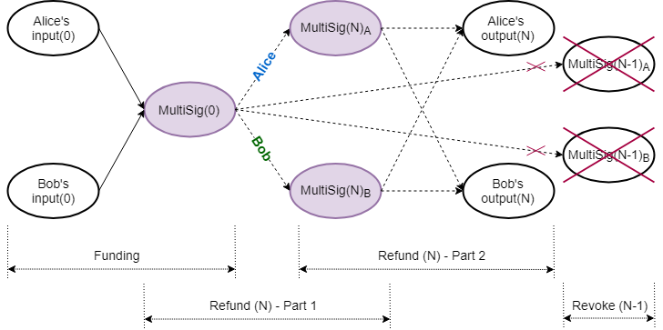
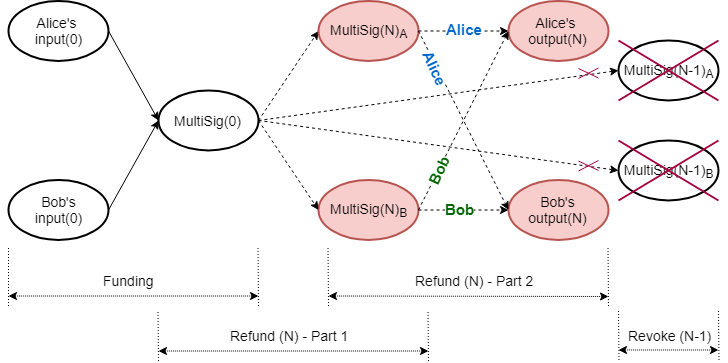

-----
theme: default
paginate: true
footer: © Tari Labs, 2018-2021. (License : CC BY-NC-SA 4.0)
_class: lead
backgroundColor: #fff
-----

## Laser Beam

- Introduction
- Lightning Network
- Laser Beam Overview
- Multiparty UTXO, Pedersen Commitment Trick
- Funding Tx
- Refund Procedure
- Revoke Previous Refund
- Punishment!
See full report [*here*](https://tlu.tarilabs.com/scaling/laser-beam/MainReport.html).

----

## Introduction

PoW blockchains:

- Notoriously slow
- Txs need to be a number of blocks in the past to be confirmed
- Have poor scalability properties

Payment channels: 

- 2(+) parties can make multiple blockchain Txs off-chain
- Only some Txs committed to the blockchain
- Final payout committed back to the blockchain

----

----

## Lightning Network

2nd-layer payment protocol originally designed for Bitcoin

Dispute mechanism requires all users to constantly watch the blockchain for fraud

----

## Laser Beam Overview

- Laser Beam (still WIP) is an adaptation of the Lightning Network for [Mimblewimble](https://tlu.tarilabs.com/protocols/mimblewimble-1/MainReport.html) 

- Created by The Beam Team for Beam

- Currently demonstrates off-chain transactions in a single channel between two parties

- Plans to implement routing across different payment channels in the Lightning Network style

----

## Multiparty UTXO, Pedersen Commitment Trick

Remember...
**08c15e94ddea81e6a0a31ed558ef5e0574e5369c4fcba92808fe992fbff68884cc**

 
Normal Pedersen commitment: 

$$
C(v,k)=\Big(vH+kG\Big)
$$

MultiSig Pedersen commitment between 2 parties:

$$
C(v,k_{1}+k_{2})=\Big(vH+(k_{1}+k_{2})G\Big)
$$

Indistinguishable on the blockchain!

----

## Laser Beam - Funding Tx

----

**Initial funding Tx:**

$$
\begin{aligned}
-\text{Inputs}(0)+\text{MultiSig}(0)&+\text{fee} = \text{Excess}(0) \\
-\Big((v_{a}H+k_{a}G)+(v_{b}H+k_{b}G)\Big)&+\Big(v_{0}H+
    (k_{0_{a}}+k_{0_{b}})G\Big)+fH = \mathcal{X}_{0}
\end{aligned}
$$

----

## Laser Beam - Refund Procedure Part 1

----

**Alice Part 1:**

$$
\begin{aligned}
-\text{MultiSig}(0) &+ \text{MultiSig}(N)_{A} + \text{fee} = \text{Excess}(N)_{A1} \\
-\Big(v_{0}H+(k_{0_{a}}+k_{0_{b}})G\Big) &+ \Big((v_{0}-f)H + (\hat{k}_{N_{a}}+k_{N_{b}})G\Big) + fH 
  = \mathcal{X}_{N_{A1}}
\end{aligned}
$$

-> _Alice gets Bob's part of the signature, but keeps her part secret!_

**Bob Part 1:**

$$
\begin{aligned}
-\text{MultiSig}(0) &+ \text{MultiSig}(N)_{B} + \text{fee} = \text{Excess}(N)_{B1} \\
-\Big(v_{0}H+(k_{0_{a}}+k_{0_{b}})G\Big) &+ \Big((v_{0}-f)H+(k_{N_{a}}+\hat{k}_{N_{b}})G\Big) + fH 
  = \mathcal{X}_{N_{B1}}
\end{aligned}
$$

-> _Bob gets Alice's part of the signature, but keeps his part secret!_

----

## Laser Beam - Refund Procedure Part 2

----

**Alice Part 2:**

$$
\begin{aligned}
-\text{MultiSig}(N)_{A}&+\text{Outputs}(N)+\text{fee} =\text{Excess}(N)_{A2} \\
-\Big((v_{0}-f)H+(\hat{k}_{N_{a}}+k_{N_{b}})G\Big)&+\Big((v_{N_{a}}^{\prime}H+k_{N_{a}}^{\prime}G)+(v_{N_{b}}^
  {\prime}H+k_{N_{b}}^{\prime}G)\Big)+fH =\mathcal{X}_{N_{A2}}
\end{aligned}
$$

-> _Has relative time lock, Alice shares her part of the signature with Bob_

**Bob Part 2:**

$$
\begin{aligned}
-\text{MultiSig}(N)_{B}&+\text{Outputs}(N)+\text{fee} =\text{Excess}(N)_{B2} \\
-\Big((v_{0}-f)H+(k_{N_{a}}+\hat{k}_{N_{b}})G\Big)&+\Big((v_{N_{a}}^{\prime}H+k_{N_{a}}^{\prime}G)+(v_{N_{b}}^
  {\prime}H+k_{N_{b}}^{\prime}G)\Big)+fH =\mathcal{X}_{N_{B2}}
\end{aligned}
$$

-> _Has relative time lock, Bob shares his part of the signature with Alice_

----

## Laser Beam - Revoke Previous Refund

----

**Alice:**

$$
\begin{aligned}
\text{MultiSig}(N-1)_{A}:\ \ (v_{0}-f)H+(\hat{k}_{(N-1)_{a}}+k_{(N-1)_{b}})G \ \  
  &\lbrace\text{Alice's commitment}\rbrace \\
\hat{k}_{(N-1)_{a}} \ \  
  &\lbrace\text{Alice shares with Bob}\rbrace \\
(v_{0}-f)H+(\hat{k}_{(N-1)_{a}}+k_{(N-1)_{b}})G \overset{?}{=} C(v_{0}-f,\ \hat{k}_{(N-1)_{a}}+k_{(N-1)_{b}}) \ \  
  &\lbrace\text{Bob verifies}\rbrace 
\end{aligned}
$$

**Bob:**

$$
\begin{aligned}
\text{MultiSig}(N-1)_{B}:\ \ (v_{0}-f)H+(k_{(N-1)_{a}}+\hat{k}_{(N-1)_{b}})G \ \  
  &\lbrace\text{Bob's commitment}\rbrace \\
\hat{k}_{(N-1)_{b}} \ \  
  &\lbrace\text{Bob shares with Alice}\rbrace \\
(v_{0}-f)H+(k_{(N-1)_{a}}+\hat{k}_{(N-1)_{b}})G \overset{?}{=} C(v_{0}-f,\ k_{(N-1)_{a}}+\hat{k}_{(N-1)_{b}}) \ \ 
  &\lbrace\text{Alice verifies}\rbrace 
\end{aligned}
$$

----

## Laser Beam - Punishment!

- Must monitor to detect foul play

- Race against time!

- Alice tries her luck and post a previous favourable refund Tx:
$$
\begin{aligned}
-\text{MultiSig}(0) + \text{MultiSig}(N-m)_{A} + \text{fee} &= \text{Excess}(N-m)_{A1} \\
-\text{MultiSig}(N-m)_{A} + \text{Outputs}(N-m)+\text{fee} &= \text{Excess}(N-m)_{A2} \ \ \lbrace\text{Locked}\rbrace
\end{aligned}
$$
- Bob jumps and claim all the funds before the relative lock expires!
$$
\begin{aligned}
-\text{MultiSig}(N-m)_{A} + \text{Outputs}(N)_{Bob} + \text{fee} = \text{Excess}(N)_{Bob}
\end{aligned}
$$
