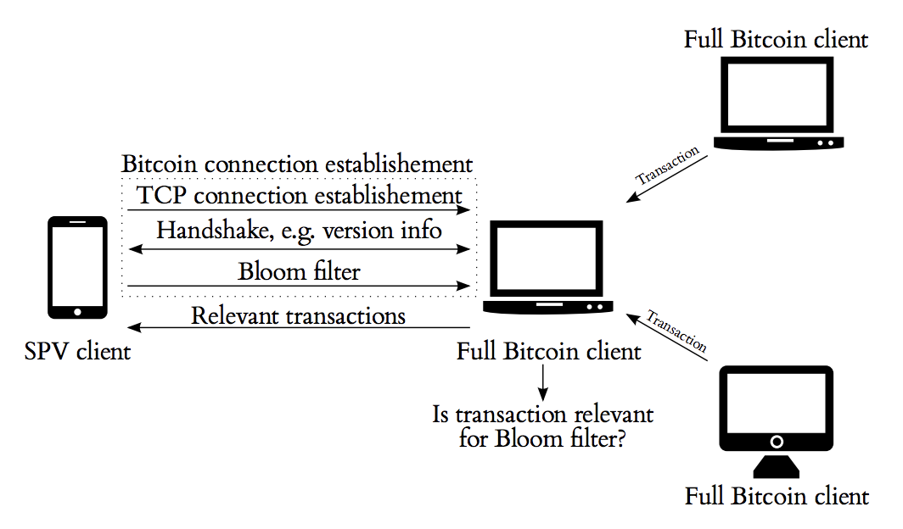

# Fraud Proofs - easier said than done?

## Background
The Bitcoin blockchain is, as of June 2018, approximately 173 Gigabytes in size [1]. This makes it nearly impossible for everyone to run a full Bitcoin node. Lightweight clients will have to be used by users since not everyone can run full nodes due to the computational power and cost needed to run a full Bitcoin node. 

Courtesy:MIT Bitcoin Expo 2016 Day 1

SPV clients will believe everything miners or nodes tell them, as evidenced by Peter Todd in the screenshot above showing an Android client showing millions of bitcoin. The wallet was sent a transaction 2.1 million BTC outputs[17] 

In the original Bitcoin whitepaper, Satoshi recognised this and introduced the concept of a Simplified Payment Verification (SPV) [2], in which he describes a technique that allows verification of payments using a lightweight client that doesn't need to download the entire Bitcoin blockchain, but rather by only downloading block headers with the longest proof-of-work chain [3]. 

Courtesy: Bitcoin: A Peer-to-Peer Electronic Cash System

In this system, the full nodes would need to provide an alert (known as a fraud proof) to SPV clients when an invalid block is detected [2].

An invalid block need not be of malicious intent, but could be as a result of any of the following[6]:
* **Bad Txn** (invalid txn, doublespent txn, or repeat txn).
* **Missing block data** (unknown and undiscoverable Merkle trees – this could be intentional or accidental).
* **Bad Block** (Other) (misplaced coinbase, wrong version, witness data missing, (drivechain) most updates to Escrow_DB/Withdrawal_DB)
* **Bad Accumulation** (the infamous blocksize/SigOps limits, the coinbase txn fees (which must balance total fees paid by the block’s txns), (drivechain) sidechain outputs – the “CTIP” field of “Escrow DB”)

# What is a fraud proof?

Fraud proofs are a way to improve the security of SPV clients [5] by providing a mechanism for full nodes to prove that a chain is invalid irrespective of the amount of proof of work it has[5]. Fraud proofs could also help with the Bitcoin scaling debate as SPV clients are easier to run and could thus help with Bitcoin scalability issues[6][18].

A full Bitcoin node contains the following details:
  * every transaction that is currently being broadcast around the network
  * every transaction that has ever been sent
  * all the unspent transaction outputs (UTXOs) [4]
  
An SPV client, such as a mobile device, would not have the ability to process all that information and thus only needs to download block headers.
These SPV client make use of Bloom filters to receive transactions that are relevant to the user[7]. Bloom filters are probalistic data structures used to check the existence of an element in a set quicker by respond with a boolean answer[9]

Courtesy: On the Privacy Provisions of Bloom Filters in Lightweight
Bitcoin Clients [7]

In addition to Bloom filters, SPV clients rely on Merkle trees - binary structures that have a list of all the hashes between the block (apex) and the transaction (leaf). With Merkle trees, one only needs to check a small part of the block, called a Merkle root, to prove that the transaction has been accepted in the network[8].

Fraud proofs are integral to the security of SPV clients, however, the other components in SPV clients are not without issues. 

## Security and privacy issues with SPV clients
* **weak bloom filters and merkle tree designs**

In August 2017, a weakness in the Bitcoin Merkle tree design was found to reduce the security of SPV clients which could allow an attacker to simulate a payment of arbitrary amount to a victim using a SPV wallet, and trick the victim into accepting it as valid[10]. The bitcoin Merkle tree makes no distinction between inner and leaf nodes and could thus be manipulated by an attack that could re-interpret transactions as nodes and nodes as transactions[11]. This weakness is due to inner nodes having no format and only requiring the length to be 64 bytes.
This brute force attack particularly affects systems that automatically accept SPV proofs and could be carried out with an investment of approximately $3 million[11].
One proposed solution is to ensure that no internal, 64-bit node is ever accepted as a valid transaction by SPV wallets/clients[11].

The BIP37 SPV[13] Bloom filters don't have relevant privacy features[7] and leak information such as determining if multiple address belong to a single owner, as well as leaking of IP addresses of the user[12] (if TOR or VPNs aren't used).
Furthermore, SPV clients pose the risk of a denial of service attack against full nodes due to processing load (80Gig disk reads) when SPV clients sync and full nodes themselves can cause a denial of service against SPV clients by returning NULL filter responses to requests[14]. Peter Todd's Bloom-io-attack aptly demonstrates the risk of SPV denial of service[15].

To address this, a new concept called committed bloom filters was introduced to improve the performance and security of SPV clients. In this concept, which can be used in lieu of BIP37[16], a Bloom filer digest (BFD) of every blocks inputs, outputs and transactions is created with a filter that consists of a small size of the overall block size[14]. A second Bloom filter is created with all transactions and a binary comparison is made to determine matching transactions. This BFD allows the caching of filters by SPV clients without the need to re-compute[16] and also introduces semi-trusted oracles to improve the security and privacy of SPV clients by allowing SPV clients to download block data via any out of band method.[14]

## fraud proof implementations in other blockchains

Similar to how fraud proofs could potentially help with scalability via SPV clients on Bitcoin, Truebit and Ethereum's Plasma (which aims to improve scalability on Ethereum) have their implementation of fraud proofs where penalties are imposed and invalid blocks are rolled back when proof of fraud is submitted to the root chain[19]. On the Plasma blockchain, consensus is enforced by fraud proofs on the root chain.

Courtesy:Plasma: Scalable Autonomous Smart Contracts

## Conclusions, Observations, Recommendations

## References

[1] Size of the Bitcoin blockchain from 2010 to 2018, by quarter (in megabytes),https://www.statista.com/statistics/647523/worldwide-bitcoin-blockchain-size/, Date accessed: 2018-09-10.

[2] Bitcoin: A Peer-to-Peer Electronic Cash System, https://www.bitcoin.com/bitcoin.pdf, Date accessed: 2018-09-10.

[3] Simple Payment Verification, http://docs.electrum.org/en/latest/spv.html , Date accessed: 2018-09-10.

[4] SPV, Bloom filters and checkpoints, https://multibit.org/hd0.4/how-spv-works.html, Date accessed: 2018-09-10.

[5] Improving the ability of SPV clients to detect invalid chains
,https://gist.github.com/justusranvier/451616fa4697b5f25f60, Date accessed: 2018-09-10.

[6] Meditations on Fraud Proofs,http://www.truthcoin.info/blog/fraud-proofs/, Dated accessed: 2018-09-10.

[7] On the Privacy Provisions of Bloom Filters in Lightweight
Bitcoin Clients, https://eprint.iacr.org/2014/763.pdf, Date accessed: 2018-09-10.

[8]SPV, Bloom filters and checkpoints, https://multibit.org/hd0.4/how-spv-works.html, Date accessed: 2018-09-10.

[9] A Case of False Positives in Bloom Filters, https://medium.com/blockchain-musings/a-case-of-false-positives-in-bloom-filters-da09ec487ff0, Date accessed: 2018-09-11.

[10] The Design Of Bitcoin Merkle Trees Reduces The Security Of SPV Clients,https://media.rsk.co/the-design-of-bitcoin-merkle-trees-reduces-the-security-of-spv-clients/, Date accessed: 2018-09-11.

[11] Leaf-Node weakness in Bitcoin Merkle Tree Design, https://bitslog.wordpress.com/2018/06/09/leaf-node-weakness-in-bitcoin-merkle-tree-design/, Date accessed: 2018-09-11.

[12] Privacy in bitsquare,https://bisq.network/blog/privacy-in-bitsquare/, Date accessed: 2018-09-11.

[13] bip-0037.mediawiki,https://github.com/bitcoin/bips/blob/master/bip-0037.mediawiki, Date accessed: 2018-09-11.

[14] Committed bloom filters for improved wallet performance and SPV security,https://lists.linuxfoundation.org/pipermail/bitcoin-dev/2016-May/012636.html, Date accessed: 2018-09-11.

[15] Bloom-io-attack, https://github.com/petertodd/bloom-io-attack, Date accessed: 2018-09-11.

[16] Committed Bloom Filters Versus BIP37 SPV,https://www.newsbtc.com/2016/05/10/developers-introduce-bloom-filters-improve-bitcoin-wallet-security/, Date accessed: 2018-09-12.

[17] Fraud Proofs,https://www.linkedin.com/pulse/peter-todds-fraud-proofs-talk-mit-bitcoin-expo-2016-mark-morris/, Date accessed: 2018-09-12.

[18] New Satoshi Nakamoto E-mails Revealed
, https://www.trustnodes.com/2017/08/12/new-satoshi-nakamoto-e-mails-revealed, Date accessed: 2018-09-12.

[19] Plasma: Scalable Autonomous Smart Contracts,https://plasma.io/plasma.pdf, Date accessed: 2018-09-13.

## Contributors

- [https://github.com/ksloven](https://github.com/ksloven)
