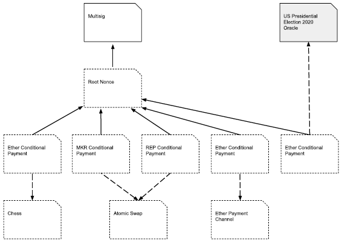
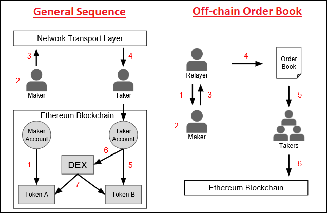

# Layer 2 Scaling Survey
## What is Layer 2 scaling?

In the block chain and cryptocurrency world, transaction processing scaling is a tough problem to solve. This is limited by the average block creation time, the block size limit and number of newer blocks needed to confirm a transaction (confirmation time). These factors make '*over the counter*' type transactions similar to Master Card or Visa nearly impossible if done on the main block chain (on-chain).

Let's postulate that block chain and cryptocurrency "takes over the world" and are responsible for all global non-cash transactions performed, i.e. 433.1 billion in 2014-2015 [[25]](https://www.worldpaymentsreport.com/download). This means 13,734 transactions per second (tx/s) on average! *(To put this into perspective, VisaNet currently processes 160 billion transactions per year [[26]](https://usa.visa.com/visa-everywhere/innovation/contactless-payments-around-the-globe.html) and is capable of handling more than 65,000 transaction messages per second [[27]](https://usa.visa.com/dam/VCOM/download/corporate/media/visanet-technology/visa-net-fact-sheet.pdf).)* This means that if all of those were simple single-input-single-output non-cash transactions and performed on...

- Segwit enabled Bitcoin 'like' block chains that can theoretically handle ~21.31 tx/s, we would need ~644 parallel versions and with a segwit transaction size of 190 bytes [[28]](https://bitcoin.stackexchange.com/questions/59408/with-100-segwit-transactions-what-would-be-the-max-number-of-transaction-confi) the combined block chain growth would be *~210 GB per day*! 

- Ethereum 'like' block chains, and taking current gas prices into account Ethereum can theoretically process ~25.4 tx/s, then ~541 parallel versions would be needed and with a transaction size of 109 bytes ([[29]](https://bitsonblocks.net/2016/10/02/a-gentle-introduction-to-ethereum/), [[30]](https://ethereum.stackexchange.com/questions/30175/what-is-the-size-bytes-of-a-simple-ethereum-transaction-versus-a-bitcoin-trans?rq=1)) the combined block chain growth would be *~120 GB per day*!

This is why we need a proper scaling solution that would not bloat the block chain.

The Open Systems Interconnection (OSI) model defines 7 layers for communication functions of a computing system. Layer 1 refers to the physical layer and Layer 2 to the data link layer. Layer 1 is never concerned with functions of Layer 2 and up, it just delivers transmission and reception of raw data. In turn Layer 2 only knows about Layer 1 and defines the protocols that deliver node-to-node data transfer. [[1]](https://en.wikipedia.org/wiki/OSI_model/)

Analogous to the OSI layers for communication, in block chain technology decentralised Layer 2 protocols, also commonly referred to as Layer 2 scaling, refers to transaction throughput scaling solutions. Decentralised Layer 2 protocols run on top of the main block chain (off-chain), while preserving the attributes of the main block chain (e.g. crypto economic consensus). Instead of each transaction only the resultant of a number of transactions are embedded on-chain. [[2]](https://cloudblogs.microsoft.com/enterprisemobility/2018/02/12/decentralized-digital-identities-and-blockchain-the-future-as-we-see-it)

Also:

- Does every transaction need every parent block chain node in the world to verify it?
- Would I be willing to have (temporary) lower security guarantees for most of my day-to-day transactions if I could get them validated (whatever we take that to mean) near-instantly?

If you can answer 'no' and 'yes', then you're looking for a Layer 2 scaling solution.

## How will this be applicable to Tari?

Tari is a high-throughput protocol that will need to handle tens of thousands of transactions per second. For example, Big Neon, the initial business application to be built on top of the Tari block chain requires high volume transactions in a short time, especially when tickets sales open and when tickets will be redeemed at an event. This will be impossible to do with parent block chain scaling solutions.

## Layer 2 scaling current initiatives
### #1 Micropayment Channels 
#### What is it?

A Micropayment Channel is a class of techniques designed to allow users to make multiple Bitcoin transactions without committing all of the transactions to the Bitcoin block chain. In a typical payment channel, only two transactions are added to the block chain but an unlimited or nearly unlimited number of payments can be made between the participants. [[11]](https://en.bitcoin.it/wiki/Payment_channels)

Several channel designs have been proposed or implemented over the years- these include:
- Nakamoto high-frequency transactions 
- Spillman-style payment channels 
- CLTV-style payment channels 
- Poon-Dryja payment channels 
- Decker-Wattenhofer duplex payment channels 
- Decker-Russell-Osuntokun eltoo Channels 
- Hashed Time-Locked Contracts (HTLCs)

With specific focus on Hashed Time-Locked Contracts:
A technique that can allow payments to be securely routed across multiple payment channels. HTlCs are integral to the design of more advanced payment channels such as those used by the [Lightning Network](https://gitpitch.com/tari-labs/tari-university/master?p=LightningNetworkForDummies#/). 

The Lightning Network is a second layer payment protocol that operates on top of a block chain. It enables instant transactions between participating nodes. It features a peer-to-peer system for making micro payments of digital cryptocurrency through a network of bidirectional payment channels without delegating custody of funds and minimising trust of third parties. [[12]](https://en.wikipedia.org/wiki/Lightning_Network) 

Normal use of the Lightning Network consists of opening a payment channel by committing a funding transaction to the relevant block chain, followed by making any number of Lightning transactions that update the tentative distribution of the channel's funds without broadcasting to the block chain, optionally followed by closing the payment channel by broadcasting the final version of the transaction to distribute the channel's funds. 

#### Who does it?
Lightning is spreading across the cryptocurrency landscape. It was originally designed for Bitcoin, however Litecoin, Zcash, Ethereum and Ripple are just a few of the many cryptocurrencies planning to implement or test some form of the network. [[13]](https://www.coindesk.com/bitcoin-isnt-crypto-adding-lightning-tech-now/)

#### Strengths

- It is one of the leading solutions that has been presented to scale Bitcoin, which does not require a change to the underlying protocol;
- Transactions are processed instantly, the account balances of the nodes are updated and the money is immediately accessible to the new owner;
- Transaction fees are a fraction of the transaction cost. [[14]](https://cryptoverze.com/what-is-bitcoin-lightning-network/) 

#### Weaknesses

- It is not suitable for making bulk payment, as the intermediate nodes in the multichannel payment network may not be loaded with money to move the funds along; 
- Recipients cannot receive money unless their node is connected and online at the time of the transaction;
- One of The Lightning Network implementations, written in C, runs into segmentation faults frequently. [[14]](https://cryptoverze.com/what-is-bitcoin-lightning-network/)

#### Opportunities for Tari 

Less than expected as Tari's ticketing use case requires many fast transactions with many parties, not many fast transactions with a single party.

#### Threats to Tari 

None.

### #2 State Channels

#### What is it?

State channels are the more general form of micropayment channels — they can be used not only for payments, but for any arbitrary “state update” on a block chain — like changes inside a smart contract. [[17]](https://medium.com/l4-media/making-sense-of-ethereums-layer-2-scaling-solutions-state-channels-plasma-and-truebit-22cb40dcc2f4)

State channels allow multiple transactions to be made within off-chain agreements with very fast processing and the final settlement on-chain. It keeps the operation mode of block chain protocol but changes the way it is used so as to deal with the challenge of scalability.

Any change of state within a state channel requires explicit cryptographic consent from all parties designated as “interested” in that part of the state. [[20]](https://l4.ventures/papers/statechannels.pdf)

#### Who does it?

<u>On Ethereum:</u>

- Raiden Network ([[17]](https://medium.com/l4-media/making-sense-of-ethereums-layer-2-scaling-solutions-state-channels-plasma-and-truebit-22cb40dcc2f4), [[21]](https://raiden.network/), [[22]](https://raiden.network/101.html))
  - Research state channel technology, define protocols and develop reference implementations;
  - Works with any ERC20 compatible token.
  - State updates between two parties are done via digitally signed and hash-locked transfers as the consensus mechanism, called balance proofs, which are also secured by a time-out. These can be settled on the Ethereum block chain at any time. Raiden Network uses HTLCs in exactly the same manner as the Lightning Network. 

- Counterfactual ([[17]](https://medium.com/l4-media/making-sense-of-ethereums-layer-2-scaling-solutions-state-channels-plasma-and-truebit-22cb40dcc2f4), [[20]](https://l4.ventures/papers/statechannels.pdf), [[32]](https://medium.com/statechannels/counterfactual-generalized-state-channels-on-ethereum-d38a36d25fc6))
  - A generalized framework for native state channels integration in Ethereum-based decentralized applications;
  - A generalized state channel generalized framework is one where state is deposited once and then be used by any application or set of applications afterwards;
  - Counterfactual instantiation means to instantiate a contract without actually deploying it on-chain and is achieved by making users sign and share commitments to the multisig wallet;
  - When a contract is counterfactually instantiated, all parties in the channel act as though it has been deployed, even though it has not;
  - A global registry is introduced, an on-chain contract that maps unique deterministic addresses for any counterfactual contract to actual on-chain deployed addresses. The hashing function used to produce the deterministic address can be any function that takes into account the bytecode, its owner (i.e. the multi-signature wallet address), and a unique identifier.

- Funfair ([[17]](https://medium.com/l4-media/making-sense-of-ethereums-layer-2-scaling-solutions-state-channels-plasma-and-truebit-22cb40dcc2f4), [[24]](https://funfair.io/state-channels-in-disguise), [[33]](https://funfair.io/wp-content/uploads/FunFair-Technical-White-Paper.pdf))
  - Decentralized slot machine gambling platform, but still using centralized server based random number generation;
  - Instantiates normal 'Raiden like' state channel (called *fate channel*) between the player and the casino, final states submitted to block chain after betting game is concluded;
  - Investigating use of threshold cryptography like Boneh–Lynn–Shacham (BLS) signature schemes to enable truly secure random number generation by a group of participants.

<u>On NEO:</u>

- Trinity ([[3]](https://www.investinblockchain.com/trinity-protocol), [[18]](https://trinity.tech), [[19]](https://trinity.tech/file/WhitePaperDraft1.pdf))
  - Trinity is an open-source network protocol based on NEP-5 smart contracts;
  - Trinity for NEO is the same as the Raiden Network for Ethereum;
  - Trinity uses the same consensus mechanism as the Raiden network;
  - A new token, TNC, is introduced to fund the Trinity network, but NEO, NEP-5 and TNC tokens are supported.

#### Strengths

- Allows payments and changes to smart contracts;
- State channels have strong privacy properties, everything is happening “inside” a channel between participants;
- State channels have instant finality, as soon as both parties sign a state update, it can be considered final.

#### Weaknesses

- State channels rely on availability, both parties must be on-line

#### Opportunities for Tari

Less than expected as Tari's ticketing use case requires many fast transactions with many parties, not many fast transactions with a single party.

#### Threats for Tari

None.

### #3 Off-chain matching engines

#### What is it?

Orders are matched off-chain in matching engine and fulfilled on-chain, allows complex orders, support cross-chain transfers, maintains public record of orders and a deterministic specification of behaviour. Makes use of token representation smart contract, that converts global assets into smart contract tokens and vice versa. [[5]](https://neonexchange.org/pdfs/whitepaper_v2.pdf)

#### Who does it?

- Neon Exchange (NEX) ( [[5]](https://neonexchange.org/pdfs/whitepaper_v2.pdf), [[36]](https://neonexchange.org/))
  - A NEO decentralized application (dApp) with tokens;
  - Initial support planned for NEO, ETH, NEP5, and ERC20 tokens;
  - Cross-chain support planned for trading BTC, LTC, and RPX on NEX;
  - The NEX off-chain matching engine will be scalable, distributed, fault-tolerant, function continuously and without downtime;
  - Consensus is achieved using cryptographically signed requests, publicly specified deterministic off-chain matching engine algorithm, public ledgers of transactions and reward for foul play. The trade method of the exchange smart contract will only accept orders signed by a private key held by the matching engine;
  - The matching engine matches the orders and submits them to the respective block chain smart contract for execution;
  - A single invocation transaction on NEO can contain many smart contract calls; batch commit of matched orders in one on-chain transaction possible.

  
- 0x ([[34]](https://0xproject.com/), [[35]](https://0xproject.com/pdfs/0x_white_paper.pdf))
  - An Ethereum ERC20 based smart contract token (ZRX)
  - Provides an open source protocol to exchange ERC20 compliant tokens on the Ethereum block chain using off-chain matching engines in the form of dApps (*Relayers*) that facilitate transactions between *Makers* and *Takers*;
  - Off-chain order relay + on-chain settlement;
  - *Maker* chooses *Relayer*, specifies token exchange rate, expiration time, fees to satisfy *Relayer’s* fee schedule and signs order with private key;
  - Consensus are governed with the publically available DEX smart contract; addresses, token balances, token exchange, fees, signatures, order status and final transfer.

  

#### Strengths

- Performance {*NEX*, *0x*}:
  - Off-chain request/order;
  - Off-chain matching.
- NEX specific:
  - Batched on-chain commits;
  - Cross-chain transfers;
  - Support of national currencies;
  - Public JavaScript Object Notation (JSON) Application Programmers Interface (API) & web extension API for third-party applications to trade tokens;
  - Development environment: ***Elixir on top of Erlang*** to enable scalable, distributed, and fault-tolerant matching engine;
  - Cure53 full security audit on web extension, NEX tokens will be regulated as registered European securities.
- 0x specific:
  - Open source protocol to enable creation of independent off-chain dApp matching engines (*Relayers*);
  - Totally transparent matching of orders with no single point of control:
    - Maker's order only enters a Relayer's order book if fee schedule is adhered to;
    - exchange can only happen if a Taker is willing to accept.
  - Consensus and settlement governed by the publically available DEX smart contract.

#### Weaknesses

- Still in development.
- NEX specific:
  - A certain level of trust is required, similar to a traditional exchange;
  - Closed liquidity pool.
- 0x specific:
  - A trusted Token Registry will be required to verify ERC20 token addresses and exchange rates;
  - Front running transactions and transaction collisions possible, more development needed ([[37]](https://blog.0xproject.com/front-running-griefing-and-the-perils-of-virtual-settlement-part-1-8554ab283e97),  [[38]](https://blog.0xproject.com/front-running-griefing-and-the-perils-of-virtual-settlement-part-2-921b00109e21));
  - Batch processing ability unknown.

#### Opportunities for Tari

- Has alignment with Tari's base requirements.

#### Threats for Tari

- None.

### #4 Masternodes
#### What is it?

A masternode (MN) is a server on a decentralised network [[7]](https://medium.com/@averagejoecrypto/masternodes-risk-vs-reward-6ca41eccfb08). It is utilised to complete unique functions in ways ordinary nodes cannot. It can be used for features like direct send/instant transactions or private transactions [[8]](https://cointelegraph.com/news/the-rise-of-masternodes-might-soon-be-followed-by-the-creation-of-servicenodes).

Because of their increased capabilities, masternodes typically require a sizeable investment in order to run. However, masternode operators are incentivised, and are rewarded by earning portions of block rewards in the cryptocurrency they are facilitating. [[8]](https://cointelegraph.com/news/the-rise-of-masternodes-might-soon-be-followed-by-the-creation-of-servicenodes)

Masternodes will get the standard return on their stakes. But will also be entitled to a portion of the transaction fees. Allowing for a greater ROI. [[10]](https://cointelegraph.com/news/the-rise-of-masternodes-might-soon-be-followed-by-the-creation-of-servicenodes)

**Dash Example**
Dash was the first cryptocurrency to implement the masternode model into its protocol.  Under what Dash calls its proof of service algorithm, a second tier network of masternodes exists alongside a first tier network of miners to achieve distributed consensus on the blockchain.  This two tiered system ensures that proof of service and proof of work preform symbiotic maintenance of Dash’s network. A masternode for Dash, for example, requires 1,000 DASH.

To set up a Masternode, you start by downloading your currency’s core wallet and use it to create a masternode.  After you set up your computer as a server, the core wallet integrates your computer as one of many nodes that supports the blockchain.  Operators can also contract a third party to run the server for them.

Once a masternode is live, it accommodates  a unique series of functions, such as instant and/or anonymous payments.  They also enable a decentralized governance system that allows node operators to vote on important developments within the blockchain.  

As compensation for their troubles, masternodes typically share an equally 45% of block rewards with the blockchain’s miners.  The other 10% goes to the blockchain’s treasury fund, and operators are in charge of voting on proposals for how these funds will be allocated to improve the network.

*_Deterministic Ordering of DASH_*

A special deterministic algorithm is used to create a pseudo-random ordering of the Masternodes. By using the hash from the proof-of-work for each block, security of this functionality will be provided by the mining network. [[31]](https://res.tuoluocaijing.cn/20180517155941-ojog.pdf)

*_Trustless Quorums_*

According to DASH, the secondary network can be used to perform highly sensitive tasks in a trustless way, where no single entity can control the outcome: N pseudo random Masternodes are selected from the total pool to perform the same task, these nodes then can act as an oracle, without having the whole network do the task. 

*_Proof of Service_*

Bad actors could also run Masternodes, but not provide any of the quality service that is required of the rest of the network. To reduce the possibility of people using the system to their advantage nodes must ping the rest of the network to ensure they remain active. 

This work is done by the Masternode network by selecting 2 quorums per block. Quorum A checks the service of Quorum B each block. Quorum A are the closest nodes to the current block hash, while Quorum B are the furtherest nodes from said hash.

All work done to check the network to prove that nodes are active is done by the Masternode network itself. Approximately 1% of the network will be checked each block. This results in the entire network being check about six times per day. In order to keep this system trustless, nodes are selected randomly via the Quorum system- a minimum of six consecutive violations result in the deactivation of a node. [[31]](https://res.tuoluocaijing.cn/20180517155941-ojog.pdf) 

#### Who does it? [[9]](https://blockonomi.com/masternode-guide/)

- Block 
- Bata
- Crown 
- Chaincoin 
- Dash 
- Diamond 
- ION 
- Monetary Unit
- Neutron 
- PIVX
- Vcash 
- XtraBytes 

#### Strengths

- Sustain and care of the ecosystem;  
- Dash Masternodes perform specialised services [[31]](http://dashmasternode.org/what-is-a-masternode): 
  * InstantSend (instant transactions);  
  * PrivateSend (anonymous transactions);
  * Decentralised Governance (masternodes govern, while the block chain funds development);
  * Dash Evolution (a decentralized payment processor).
- Dash Masternodes are given voting rights on proposals. Each masternode has a 1 vote and this vote can be used on budget proposals or important decisions [[31]](http://dashmasternode.org/what-is-a-masternode);
- Masternodes offer payouts in a way similar to staking- whether in a bear or bull market there is still a payout. [[7]](https://medium.com/@averagejoecrypto/masternodes-risk-vs-reward-6ca41eccfb08)

- Cryptoassets like Block Net and Exscudo will use masternodes to support their decentralized exchanges: Masternodes will oversee exchange transactions to facilitate cryptocurrency trading and offer fiat currency gateways.
- BOScoin integrates masternodes for its smart contracts and adopts the masternode governing system for its Congress Network.  
- Syscoin applies masternode functionality to its decentralized marketplace.  With Syscoin, users can access the blockchain equivalent of peer-run commerce sites like eBay.  Masternodes will be responsible for facilitating anonymous and instant payments on the marketplace. [[23]](https://coincentral.com/what-are-masternodes-an-introduction-and-guide/)   

Masternode application is quite flexible.  It compensates for proof of work’s limitations and behaves almost like a buffed-up version proof of stake systems.
Like proof of stake, it avoids the de-facto centralization mining pools bring to proof of work networks, and it consumes less energy than the proof of work model.  Masternodes may promise enhanced stability and network loyalty, as larger dividends and high initial investment costs make it less likely that operators will abandon their position in the network.
They can even be used to keep miners from stepping out of line.  Under Dash’s model, masternodes on the second tier network monitor the first tier proof of work network.  This gives masternodes full reign to reject or orphan blocks if their miner uses and outdated version of Dash or tries to manipulate block rewards. [[23]](https://coincentral.com/what-are-masternodes-an-introduction-and-guide/)

#### Weaknesses

- In order to get a masternode,you have to invest 1000 Dash into it- and not touch that money (if balance drops below 1000 Dash, one can lose voting rights and effectively be blocked from the Dash masternode network; 
- The maintaining of masternodes can be a long and arduous task- malfunctions are common; 
- ROI is not guaranteed and inconsistant (Your masternode only gets rewarded if it mines a block- most masternodes quote a 90% chance of getting paid- the system randomly decids if your node gets paid). [[7]](https://medium.com/@averagejoecrypto/masternodes-risk-vs-reward-6ca41eccfb08)
- Masternodes are put forth with very little to no utility (only the promise of a Whitepaper);
- By putting up a masternode, your IP address becomes publicised, and so the location of your masternode is known- node can be physically stolen. [[7]](https://medium.com/@averagejoecrypto/masternodes-risk-vs-reward-6ca41eccfb08)

#### Opportunities for Tari

A new token, such as a Tari token, by itself might not be worth very much except for speculative interest on its value proposition: what project it proposes to underlie. So it may not start with very much demand. However, if a token has MNs in its codebase, it proposes to offer additional benefits to holders of a fixed amount of tokens who run a MN. These benefits start with an extra share of all new tokens created in the regularly released blocks on the blockchain. The promise of this passive income increases demand, which increases price.

#### Threats to Tari

None

### #5 Plasma
#### What is it?

Plasma block chains are a chain within a block chain, with state transitions enforced by bonded (time to exit) fraud proofs (block header hashes) submitted on the root chain. It enables management of a tiered block chain without a full persistent record of the ledger on the root block chain and without giving custodial trust to any 3rd party. The fraud proofs enforce an interactive protocol of rapid fund withdrawals in case of foul play like block withholding, in cases where bad actors in a lower level tier want to commit blocks to the root chain without broadcasting it to the higher level tiers. [[4]](http://plasma.io/plasma.pdf)

Plasma is a framework for incentivized and enforced execution of smart contracts, scalable to a significant amount of state updates per second, enabling the root block chain to be able to represent a significant amount of dApps, each employing its own block chain in a tree format. [[4]](http://plasma.io/plasma.pdf)

Plasma relies on two key parts, namely reframing all block chain computations into a set of MapReduce functions, and an optional method to do Proof-of-Stake token bonding on top of existing block chains (enforced in an on-chain smart contract). Nakamoto Consensus incentives discourage block withholding or other Byzantine behavior. If a chain is Byzantine, it has the option of going to any of its parents (including the root block chain) to continue operation or exit with the current committed state. [[4]](http://plasma.io/plasma.pdf)

MapReduce is a programming model and an associated implementation for processing and generating large data sets. Users specify a map function that processes a key/value pair to generate a set of intermediate key/value pairs, and a reduce function that merges all intermediate values associated with the same intermediate key. [[39]](https://storage.googleapis.com/pub-tools-public-publication-data/pdf/16cb30b4b92fd4989b8619a61752a2387c6dd474.pdf) The Plasma MapReduce  includes commitments on data to computation as input in the map phase and includes a merkleized proof of state transition in the reduce step when returning the result.  [[4]](http://plasma.io/plasma.pdf)

#### Who does it?

Loom Network, using Delegated Proof of Stake (DPoS) consensus and validation, enabling scalable Application Specific Side Chains (DAppChains), running on top of Ethereum. ([[4]](http://plasma.io/plasma.pdf), [[16]](https://medium.com/loom-network/everything-you-need-to-know-about-loom-network-all-in-one-place-updated-regularly-64742bd839fe))

OMG Network (OmiseGO), using Proof of Stake (PoS) consensus and validation, a Plasma block chain scaling solution for finance running on top of Ethereum. ([[6]](https://cdn.omise.co/omg/whitepaper.pdf), [[15]](https://omisego.network/))

#### Strengths

- Not all participants need to be online to update state;
- Participants do not need a record of entry on the parent block chain to enable their participation in a Plasma block chain;
- Minimal data needed on the parent block chain to confirm transactions when constructing Plasma block chains in a tree format;
- Private block chain networks can be constructed, enforced by the root block chain. Transactions may occur on a local private block chain and have financial activity bonded by a public parent block chain;
- Rapid exit strategies in case of foul play.

#### Weaknesses

Must still be proven on other networks apart from Ethereum.

#### Opportunities for Tari

- Has alignment with Tari's base requirements.
- *Possibility to create a Tari ticketing Plasma dAppChain running of Monero without creating a Tari specific root block chain?*

#### Threats for Tari

The Loom Network's Software Development Kit (SDK) makes it extremely easy for anyone to create a new Plasma block chain. In less than a year a number of successful and diverse dAppChains have launched. *The next one can easily be for ticket sales...*

## Observations

Further investigation into the more promising layer 2 scaling solutions and technologies is required to verify alignment, applicability and use-ability.

## References

[1] OSI mode, https://en.wikipedia.org/wiki/OSI_model, Date accessed: 2018-06-07.

[2] Decentralized Digital Identities and Blockchain – The Future as We See It, https://cloudblogs.microsoft.com/enterprisemobility/2018/02/12/decentralized-digital-identities-and-blockchain-the-future-as-we-see-it, Date accessed: 2018-06-07.

[3] Trinity Protocol: The Scaling Solution of the Future?, https://www.investinblockchain.com/trinity-protocol, Date accessed: 2018-06-08.

[4] Plasma: Scalable Autonomous Smart Contracts, Poon J and Buterin V, http://plasma.io/plasma.pdf, Date accessed: 2018-06-14.

[5] NEX: A High Performance Decentralized Trade and Payment Platform, https://neonexchange.org/pdfs/whitepaper_v2.pdf, Date accessed: 2018-06-11.

[6] OmiseGO: Decentralized Exchange and Payments Platform, Poon J et. al., https://cdn.omise.co/omg/whitepaper.pdf, Date accessed: 2018-06-14.

[7] Masternodes- Risk vs. Reward, https://medium.com/@averagejoecrypto/masternodes-risk-vs-reward-6ca41eccfb08, Date accessed: 2018-06-13.

[8] The Rise of Masternodes Might Soon be Followed by the Creation of Servicenodes, https://cointelegraph.com/news/the-rise-of-masternodes-might-soon-be-followed-by-the-creation-of-servicenodes, Date accessed: 2018-06-13.

[9] What are Masternodes?- Beginner's Guide, https://blockonomi.com/masternode-guide/, Date accessed: 2018-06-14.

[10] What the Heck is a DASH Masternode and How Do I get One, https://medium.com/dash-for-newbies/what-the-heck-is-a-dash-masternode-and-how-do-i-get-one-56e24121417e, Date accessed: 2018-06-14.

[11] Payment channels, https://en.bitcoin.it/wiki/Payment_channels , Date accessed: 2018-06-14.

[12] Lightning Network, https://en.wikipedia.org/wiki/Lightning_Network, Date accessed: 2018-06-14.

[13] Bitcoin Isn't the Only Crypto Adding Lightning Tech Now, https://www.coindesk.com/bitcoin-isnt-crypto-adding-lightning-tech-now/, Date accessed: 2018-06-14.

[14] What is Bitcoin Lighning Network? And How Does it Work?, https://cryptoverze.com/what-is-bitcoin-lightning-network/, Date accessed: 2018-06-14.

[15] OmiseGO, https://omisego.network/, Date accessed: 2018-06-14.

[16] Everything You Need to Know About Loom Network, All In One Place (Updated Regularly), https://medium.com/loom-network/everything-you-need-to-know-about-loom-network-all-in-one-place-updated-regularly-64742bd839fe, Date accessed: 2018-06-14.

[17] Making Sense of Ethereum’s Layer 2 Scaling Solutions: State Channels, Plasma, and Truebit, https://medium.com/l4-media/making-sense-of-ethereums-layer-2-scaling-solutions-state-channels-plasma-and-truebit-22cb40dcc2f4, Date accessed: 2018-06-14.

[18] Trinity: Universal Off-chain Scaling Solution, https://trinity.tech, Date accessed: 2018-06-14.

[19] Trinity White Paper: An Off--chain Scaling Solution for Neo, https://trinity.tech/file/WhitePaperDraft1.pdf, Date accessed: 2018-06-14.

[20] Counterfactual: Generalized State Channels, Coleman J et. al., https://counterfactual.com/statechannels & https://l4.ventures/papers/statechannels.pdf, Date accessed: 2018-06-15.

[21] The Raiden Network, https://raiden.network/, Date accessed: 2018-06-15.

[22] What is the Raiden Network?, https://raiden.network/101.html, Date accessed: 2018-06-15.

[23] What are Masternodes?  An Introduction and Guide, https://coincentral.com/what-are-masternodes-an-introduction-and-guide/, Date accessed: 2018-06-15.

[24] State Channels in disguise?, https://funfair.io/state-channels-in-disguise, Date accessed: 2018-06-15.

[25] World Payments Report 2017, © 2017 Capgemini and BNP Paribas, https://www.worldpaymentsreport.com/download, Date accessed: 2018-06-20.

[26] VISA, https://usa.visa.com/visa-everywhere/innovation/contactless-payments-around-the-globe.html, Date accessed: 2018-06-20.

[27] VisaNet Fact Sheet 2017 Q4, https://usa.visa.com/dam/VCOM/download/corporate/media/visanet-technology/visa-net-fact-sheet.pdf, Date accessed: 2018-06-20.

[28] With 100% segwit transactions, what would be the max number of transaction confirmation possible on a block?, https://bitcoin.stackexchange.com/questions/59408/with-100-segwit-transactions-what-would-be-the-max-number-of-transaction-confi, Date accessed: 2018-06-21.

[29] A gentle introduction to Ethereum, https://bitsonblocks.net/2016/10/02/a-gentle-introduction-to-ethereum/, Date accessed: 2018-06-21.

[30] What is the size (bytes) of a simple Ethereum transaction versus a Bitcoin transaction?, https://ethereum.stackexchange.com/questions/30175/what-is-the-size-bytes-of-a-simple-ethereum-transaction-versus-a-bitcoin-trans?rq=1, Date accessed: 2018-06-21.

[31] WHAT IS A MASTERNODE?, http://dashmasternode.org/what-is-a-masternode, Date accessed: 2018-06-14.

[32] Counterfactual: Generalized State Channels on Ethereum, https://medium.com/statechannels/counterfactual-generalized-state-channels-on-ethereum-d38a36d25fc6, Date accessed: 2018-06-26.

[33] FunFair Technology Roadmap and Discussion, Longley J et. al., https://funfair.io/wp-content/uploads/FunFair-Technical-White-Paper.pdf, Date accessed: 2018-06-27.

[34] 0x protocol website, https://0xproject.com/, Date accessed: 2018-06-28.

[35] 0x:  An open protocol for decentralized exchange on the Ethereum block chain, https://0xproject.com/pdfs/0x_white_paper.pdf, Date accessed: 2018-06-28.

[36] NEX website, https://neonexchange.org/, Date accessed: 2018-06-28.

[37] Front-running, Griefing and the Perils of Virtual Settlement (Part 1), https://blog.0xproject.com/front-running-griefing-and-the-perils-of-virtual-settlement-part-1-8554ab283e97, Date accessed: 2018-06-29.

[38] Front-running, Griefing and the Perils of Virtual Settlement (Part 2), https://blog.0xproject.com/front-running-griefing-and-the-perils-of-virtual-settlement-part-2-921b00109e21, Date accessed: 2018-06-29.

[39] MapReduce: Simplied Data Processing on Large Clusters, https://storage.googleapis.com/pub-tools-public-publication-data/pdf/16cb30b4b92fd4989b8619a61752a2387c6dd474.pdf, Date accessed: 2018-07-02.

