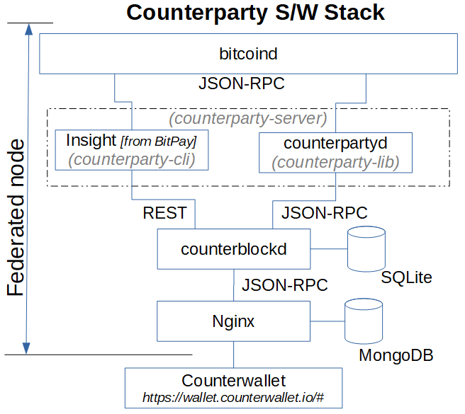

# Layer 2 Scaling Survey

This report provides a survey of TumbleBit , Counterparty, Rootstock, Drivechains, Scriptless scripts, Braiding and Directed Acyclic Graph (DAG) as layer 2 scaling alternatives.

## What is Layer 2 scaling?

See [Layer 2 Scaling Survey](https://github.com/tari-labs/tari-university/blob/master/layer2scaling/layer2scaling-landscape/layer2scaling-survey.md)

## How will this be applicable to Tari?

See [Layer 2 Scaling Survey](https://github.com/tari-labs/tari-university/blob/master/layer2scaling/layer2scaling-landscape/layer2scaling-survey.md)

## Layer 2 scaling current initiatives (updated)

### #1 TumbleBit

#### What is it?

The TumbleBit protocol was invented at the Boston University. It is a unidirectional, unlinkable payment hub that is fully compatible with the Bitcoin protocol. TumbleBit allows parties to make fast, anonymous, off-chain payments through an untrusted intermediary called the Tumbler. No-one, not even the Tumbler, can tell which payer paid which payee during a TumbleBit epoch (*i.e. time period of significance*). Two modes of operation are supported; a classic mixing/tumbling/washing mode or as a fully fledged payment hub. TumbleBit consists of two interleaved fair-exchange protocols - *RSA-Puzzle-Solver Protocol* and *Puzzle-Promise Protocol* - that relies on the  Rivest–Shamir–Adleman (RSA) cryptosystem's blinding properties to prevent bad acting from either users or Tumblers and to ensure anonymity. TumbleBit also supports anonymizing through Tor to ensure that the Tumbler server can operate as a hidden service. ([[1]](http://cs-people.bu.edu/heilman/tumblebit/), [[2]](https://eprint.iacr.org/2016/575.pdf), [[8]](https://eprint.iacr.org/2016/056.pdf), [[9]](https://www.youtube.com/watch?v=8BLWUUPfh2Q&feature=youtu.be&t=1h3m10s), [[10]](https://bitcoinmagazine.com/articles/better-bitcoin-privacy-scalability-developers-are-making-tumblebit-reality))

TumbleBit combines off-chain cryptographic computations with standard on-chain Bitcoin scripting functionalities to realize smart contracts ([[11]](https://en.bitcoin.it/wiki/Contract)) that is not dependent on Segwit. The most important Bitcoin functionality used here are hashing conditions, signing conditions, conditional execution, 2-of-2 multi signatures and timelocking. [[2]](https://eprint.iacr.org/2016/575.pdf)

#### Who does it?

The Boston University provided a proof-of-concept and reference implementation alongside the white paper [[4]](https://github.com/BUSEC/TumbleBit). NTumbleBit [[5]](https://github.com/nTumbleBit/nTumbleBit) is being developed as a C# production implementation of the TumbleBit protocol that is currently being deployed by Stratis with their Breeze implementation ([[6]](https://stratisplatform.com/2017/07/17/breeze-tumblebit-server-experimental-release), [[7]](https://stratisplatform.com/2017/09/20/breeze-wallet-with-breeze-privacy-protocol-dev-update/)), currently at alpha/experimental release level in testnet.

*"NTumbleBit will be a cross-platform framework, server and client for the TumbleBit payment scheme. TumbleBit is separated into two modes, tumbler mode and payment hub mode. The tumbler mode improves transaction fungibility and offers risk free unlinkable transactions. Payment hub mode is a way of making off-chain payments possible without requiring implementations like Segwit or the Lightning Network."* [[3]](https://medium.com/@Stratisplatform/anonymous-transactions-coming-to-stratis-fced3f5abc2e)

#### Strengths

<u>Anonymity properties</u> - TumbleBit provides unlinkability without the need to trust the Tumbler service (i.e. untrusted intermediary). [[2]](https://eprint.iacr.org/2016/575.pdf)

<u>Denial of Service (DoS) and Sybil protection</u> - "*TumbleBit uses transaction fees to resist DoS and Sybil attacks.*" [[2]](https://eprint.iacr.org/2016/575.pdf)

<u>Balance</u> - "*The system should not be exploited to print new money or steal money, even when parties collude.*"  [[2]](https://eprint.iacr.org/2016/575.pdf)

<u>As a classic tumbler</u> - TumbleBit can also be used as a classic Bitcoin tumbler. [[2]](https://eprint.iacr.org/2016/575.pdf)

<u>Bitcoin compatibility</u> - TumbleBit is fully compatible with the Bitcoin protocol. [[2]](https://eprint.iacr.org/2016/575.pdf)

<u>Scale ability</u> - Each TumbleBit user only need to interact with the Tumbler and the corresponding transaction party; this lack of coordination between all TumbleBit users makes scale ability possible for the tumbler mode. [[2]](https://eprint.iacr.org/2016/575.pdf)

<u>Batch processing</u> - TumbleBit  supports one-to-one, many-to-one, one-to-many and many-to-many transactions in payment hub mode. [[2]](https://eprint.iacr.org/2016/575.pdf)

<u>Masternode compatibility</u> - The TumbleBit protocol can be fully implemented as a service in a Masternode. "*The Breeze Wallet is now fully capable of providing enhanced privacy to bitcoin transactions through a secure connection. Utilizing Breeze Servers that are pre registered on the network using a secure, trustless registration mechanism that is resistant to manipulation and censorship.*" ([[6]](https://stratisplatform.com/2017/07/17/breeze-tumblebit-server-experimental-release), [[7]](https://stratisplatform.com/2017/09/20/breeze-wallet-with-breeze-privacy-protocol-dev-update), [[12]](https://stratisplatform.com/2017/08/10/bitcoin-privacy-tumblebit-integrated-into-breeze))

<u>Nearly production ready</u> - The NTumbleBit and Breeze implementations have gained testnet status.

#### Weaknesses

<u>Privacy not 100% proven</u> - Payees have better privacy than the payers, and theoretically collusion involving payees and the Tumbler can exist to discover the identity of the payer. [[13]](https://www.bitcoinmarketinsider.com/tumblebit-wallet-reaches-one-step-forward)

<u>Tumbler service not distributed</u> - More work needs to be done to ensure persistent transaction state in case a Tumbler server goes down.

<u>Equal denominations required</u> - The TumbleBit protocol can only support a common denominator unit value. [[2]](https://eprint.iacr.org/2016/575.pdf)

#### Opportunities for Tari

Has alignment with Tari's base requirements as a trustless Masternode matching/batch processing engine with strong privacy features.

#### Threats for Tari

None

### #2 Counterparty Eco System

#### What is it?

Counterparty is NOT a block chain. Counterparty is a protocol and network of nodes for creating smart contract applications using the Ethereum Virtual Machine and linked to the Bitcoin block chain. Counterparty uses embedded consensus and federated nodes whereby transaction meta data are written into Bitcoin transactions on the Bitcoin block chain and when read and validated by the federated nodes, executed by them. Embedded consensus means that the nodes maintain identical ledgers without using a peer-to-peer network, using the Bitcoin block chain for transaction ordering and propagation. A Counterparty federated node is a Bitcoin full node that also runs counterparty-lib software. They credit and debit account balances when executing valid protocol messages using Bitcoin addresses as “accounts”. Each federated node is running the same software to enforce protocol rules. [([30]](https://github.com/CounterpartyXCP/Documentation/blob/master/Basics/FAQ-SmartContracts.md), [[31]](https://medium.com/@droplister/counterparty-development-101-2f4d9b0c8df3), [[32]](https://counterparty.io))

All published Counterparty smart contracts “lives” at Bitcoin addresses that starts with a `C`. Counterparty is used to broadcast an `execute` transaction to call a specific function or method in the smart contract code. Once an execution transaction is confirmed by a  Bitcoin miner, the Counterparty federated nodes will receive the request and execute that method. The contract state is modified as the smart contract code executes and stored in the Counterparty database. [[32]](https://counterparty.io)

#### Who does it?

The most notable projects built on top of Counterparty is [Age of Chains](https://www.ageofchains.com), [Age of Rust](http://spacepirate.io), [Augmentors](https://www.augmentorsgame.com/), [Authparty](http://authparty.io/), [Bitcorns](https://bitcorns.com/), [Blockfreight™](http://blockfreight.com/), [Blocksafe](http://www.blocksafefoundation.com), [BTCpaymarket.com](http://btcpaymarket.com), [CoinDaddy](http://coindaddy.io), [COVAL](https://coval.readme.io), [FoldingCoin](http://foldingcoin.net/), [FootballCoin](https://www.footballcoin.io/), [GetGems](http://getgems.org/#/), [IndieBoard](https://indiesquare.me/), [LTBCoin - Letstalkbitcoin.com](https://letstalkbitcoin.com/), [Mafia Wars](https://mafiawars.io/), [NVO](https://nvo.io/), [Proof of Visit](https://proofofvisit.com/), [Rarepepe.party](http://rarepepe.party), [SaruTobi Island](http://mandelduck.com/sarutobiisland/), [Spells of Genesis](http://www.spellsofgenesis.com), [Takara](https://mandelduck.com/#portfolio), [The Scarab Experiment](https://www.thescarabexperiment.org/), [Token.FM](https://token.fm/), [Tokenly](http://tokenly.com/), [TopCoin](https://topcoin.com/) and [XCP DEX](https://XCPDEX.COM). [[32]](https://counterparty.io)

COVAL is being developed with a primary purpose of moving value using “off-chain” methods. They use their own set of node runners to manage various "off-chain" distributed ledgers and ledger assigned wallets to implement an extended transaction value system, whereby tokens as well as containers of tokens can be securely transacted. Scaling within the COVAL eco system is thus achievable because they are not only reliant on the Counterparty federated nodes to execute smart contracts. [[33]](https://coval.readme.io/docs)

#### Strengths

Counterparty provides smart contract abilities that is rooted in the Bitcoin block chain.

#### Weaknesses

- All Counterparty smart contracts and their state updates are executed and maintained off-chain in the federated nodes. If the federated nodes are compromised no evidence of any transaction within the Counterparty eco system exists.
- Counterparty is not a Layer 2 scaling solution.

#### Opportunities for Tari

None

#### Threats for Tari

None

### #3 2-Way Pegged Secondary Block Chains (*Sidechains, Drivechains, Federated Pegs*)

#### What is it?

A 2-way peg (2WP) allows the "transfer" of BTC from the main Bitcoin block chain to a secondary block chain and vice-versa at a fixed rate by making use of an appropriate security protocol. The "transfer" actually involves BTC to be locked on the main Bitcoin block chain and unlocked/made available on the secondary block chain. The 2WP promise is concluded when an equivalent amount of tokens on the secondary block chain are locked (in the secondary block chain) so that the original bitcoins can be unlocked. ([[22]](https://www.rsk.co/blog/sidechains-drivechains-and-rsk-2-way-peg-design), [[28]](https://blockstream.com/technology/sidechains.pdf))

*<u>Sidechain:</u> When the security protocol is implemented using Simplified Payment Verification (SPV) proofs - block chain transaction verification without downloading the entire block chain - the secondary block chain are referred to as a Sidechain.* [[22]](https://www.rsk.co/blog/sidechains-drivechains-and-rsk-2-way-peg-design)

*<u>Drivechain:</u> When the security protocol is implemented by giving custody of the BTC to miners - where miners vote when to unlock BTC and where to send them - the secondary block chain are referred to as a Drivechain. In this scheme the miners will sign the block header using a Dynamic Membership Multi-party Signature (DMMS).* ([[22]](https://www.rsk.co/blog/sidechains-drivechains-and-rsk-2-way-peg-design), [[28]](https://blockstream.com/technology/sidechains.pdf))

*<u>Federated Peg/Sidechain:</u> When the security protocol is implemented by having a trusted federation of mutually distrusting functionaries/notaries - the secondary block chain are referred to as a Federated Peg/Sidechain. In this scheme the DMMS is replaced with a traditional multi-signature scheme.* ([[22]](https://www.rsk.co/blog/sidechains-drivechains-and-rsk-2-way-peg-design), [[28]](https://blockstream.com/technology/sidechains.pdf))

*<u>Hybrid Sidechain-Drivechain-Federated Peg:</u> When the security protocol is implemented by SPV proofs going to the secondary block chain and dynamic mixture of miner DMMS and functionaries/notaries multi-signatures going back to the main Bitcoin block chain  - the secondary block chain are referred to as a Hybrid Sidechain-Drivechain-Federated Peg.* ([[22]](https://www.rsk.co/blog/sidechains-drivechains-and-rsk-2-way-peg-design), [[28]](https://blockstream.com/technology/sidechains.pdf), [[29]](https://blockstream.com/strong-federations.pdf))

Example of a 2WP Bitcoin secondary block chain using a Hybrid Sidechain-Drivechain-Federated Peg security protocol below [[22]](https://www.rsk.co/blog/sidechains-drivechains-and-rsk-2-way-peg-design): 

The locking of BTC on the main Bitcoin block is done by using a Pay to Script Hash (P2SH) transaction where BTC can be sent to a script hash instead of a public key hash. To unlock the BTC in the P2SH transaction, the recipient must provide a script matching the script hash and data which makes the script evaluate to true. [[23]](https://en.bitcoin.it/wiki/Pay_to_script_hash)

#### Who does it?

RSK (*formerly Rootstock*) is a 2WP Bitcoin secondary block chain using a hybrid sidechain-drivechain security protocol. RSK is scale-able up to 100 transactions per second (Tx/s) and provides a second layer scaling solution for Bitcoin as it can relieve on-chain Bitcoin transactions. ([[14]](https://www.ethnews.com/a-survey-of-second-layer-solutions-for-blockchain-scaling-part-1),  [[15]](https://lunyr.com/article/Second-Layer_Scaling), [[16]](https://www.rsk.co))

Hivemind (formerly Truthcoin) is implementing a Peer-to-Peer Oracle Protocol which absorbs accurate data into a block chain so that Bitcoin users can speculate in Prediction Markets. [[24]](http://bitcoinhivemind.com)

Blockstream is implementing a Federated Sidechain called Liquid, with the functionaries/notaries being made up of participating exchanges and Bitcoin businesses. [[29]](https://blockstream.com/strong-federations.pdf)

#### Strengths

- <u>Permissionless Innovation:</u> Anyone can create a new block chain project that uses the underlying strengths of the main Bitcoin block chain using real BTC as the currency [[20]](http://www.drivechain.info)
- <u>New Features:</u> Sidechains/Drivecahains can be used to test or implement new features without risk to the main Bitcoin block chain or without having to change its protocol, like Schnorr signatures and zero-knowledge proofs. ([[20]](http://www.drivechain.info), [[25]](http://drivechains.org/what-are-drivechains/what-does-it-enable))
- <u>Chains-as-a-Service (CaaS) :</u> It is possible to create a CaaS with a data storage 2WP secondary block chains. [[25]](http://drivechains.org/what-are-drivechains/what-does-it-enable)
- <u>Smart Contracts:</u> 2WP secondary block chains make it easier to implement smart contracts. [[25]](http://drivechains.org/what-are-drivechains/what-does-it-enable)
- <u>Scalability:</u> 2WP secondary block chains can support larger block sizes and more transactions per second, thus scaling the Bitcoin main block chain. [[25]](http://drivechains.org/what-are-drivechains/what-does-it-enable)

#### Weaknesses

- <u>Security:</u> Transferring BTC back into the main Bitcoin block chain is not secure enough and can be manipulated because Bitcoin does not support SPV from 2WP secondary block chains. [[21]](http://www.truthcoin.info/blog/drivechain)
- <u>51% attacks:</u> 2WP secondary block chains are hugely dependent on merged mining. As such, mining power centralization and 51% attacks are a real threat, as demonstrated for Namecoin and Huntercoin (See [Merged Mining Introduction](https://github.com/tari-labs/tari-university/blob/master/merged-mining/merged-mining-scene/MergedMiningIntroduction.md)).
- The DMMS provided by mining is not very secure for small systems, while the trust of the federation/notaries is riskier for large systems. [[28]](https://blockstream.com/technology/sidechains.pdf)

#### Opportunities for Tari

None, if enough functionality will be built into the main Tari block chain.

#### Threats for Tari

None

### #4 Lumino

#### What is it?

Lumino Transaction Compression Protocol (LTCP) is a technique for transaction compression that allows processing a higher volume of transactions but storing much less information. The Lumino network is a lightning-like extension of the RSK platform that uses LTCP. Delta (difference) compression of selected fields of transactions from the same owner are done by using aggregate signing of previous transactions so previous signatures can be disposed. [[17]](https://uploads.strikinglycdn.com/files/ec5278f8-218c-407a-af3c-ab71a910246d/LuminoTransactionCompressionProtocolLTCP.pdf)

Each transaction contains a set of persistent fields called the Persistent Transaction Information (PTI) and a compound record of user transaction data called the SigRec. A Lumino block stores two Merkle trees - one containing all PTIs and the other all transaction IDs (hash of the signed SigRec). This second Merkle tree is conceptually similar to the Segwit witness tree, thus forming the witness part. Docking is the process where SicRec and signature data can be pruned from the block chain if valid linked PTI information exist. [[17]](https://uploads.strikinglycdn.com/files/ec5278f8-218c-407a-af3c-ab71a910246d/LuminoTransactionCompressionProtocolLTCP.pdf)

#### Who does it?

RSK, which has been newly launched on main net in January 2018. The Lumino Network must still be launched in test net. ([[18]](https://cryptonewsmonitor.com/2017/11/11/bitcoin-based-ethereum-rival-rsk-set-to-launch-next-month), [[19]]([18] ))

#### Strengths

- The Lumino Network promises high efficiency in pruning the RSK block chain

#### Weaknesses

- The Lumino Network has not been released yet
- Details about how the Lumino Network will handle payment channels were not decisive in the white paper [[17]](https://uploads.strikinglycdn.com/files/ec5278f8-218c-407a-af3c-ab71a910246d/LuminoTransactionCompressionProtocolLTCP.pdf)

#### Opportunities for Tari

LTCP pruning may be beneficial to Tari

#### Threats for Tari

None

### #5 Scriptless scripts

#### What is it?

*Scriptless Scripts* was coined and invented by mathematician Andrew Poelstra whereby scripting functionality is offered without actual scripts on the block chain to implement smart contracts. Currently it can only work on the Mimblewimble block chain and makes use of a specific Schnorr signature scheme that allows for signature aggregation, mathematically combining several signatures into a single signature, without having to prove Knowledge of Secret Keys (KOSK). This is known as the the *plain public-key model* where the only requirement is that each potential signer has a public key. The KOSK scheme requires that users prove knowledge (or possession) of the secret key during public key registration with a certification authority, and is one way to generically prevent rogue-key attacks.

Signature aggregation properties sought here are ([[35]](https://blockstream.com/2018/01/23/musig-key-aggregation-schnorr-signatures.html), [[36]](https://eprint.iacr.org/2018/068.pdf)):

- Must be provably secure in the *plain public-key model*;
- Must satisfy the normal Schnorr equation, whereby the resulting signature can be written as a function of a combination of the public keys; 
- Must allow for Interactive Aggregate Signatures (IAS) where the signers are required to cooperate;
- Must allow for Non-interactive Aggregate Signatures (NAS) where the aggregation can to be done by anyone;
- Must allow each signer to sign the same message;
- Must allow each signer to sign their own message.

This is different to a normal multi-signature scheme where one message is signed by all.

Let's say Alice and Bob each needs to provide half a Schnorr signature for a transaction whereby Alice promises to reveal a secret to Bob in exchange for 1 crypto coin. Alice can calculate the difference between her half Schnorr signature and the Schnorr signature of the secret (adaptor signature) and hand it over to Bob. Bob then has the ability to verify the correctness of the adaptor signature without knowing the original signatures. Bob can then provide his half Schnorr signature to Alice so she can broadcast the full Schnorr signature to claim the crypto coin. By broadcasting the full Schnorr signature Bob has access to Alice's half Schnorr signature and he can then calculate the Schnorr signature of the secret because he already knows the adaptor signature, thereby claiming his prize. This is also known as Zero-Knowledge Contingent payments. ([[34]](https://bitcoinmagazine.com/articles/scriptless-scripts-how-bitcoin-can-support-smart-contracts-without-smart-contracts), [[37]](https://download.wpsoftware.net/bitcoin/wizardry/mw-slides/2017-03-mit-bitcoin-expo/slides.pdf))

Mimblewimble is being sited by Andrew Poelstra as being the ultimate *Scriptless Script*. [[37]](https://download.wpsoftware.net/bitcoin/wizardry/mw-slides/2017-03-mit-bitcoin-expo/slides.pdf)

#### Who does it?

Mimblewimble  

#### Strengths

- <u>Data savings:</u> Signature aggregation provides data compression on the block chain
- <u>Privacy:</u> Nothing about the *Scriptless Script* smart contract, other than the settlement transaction,  is ever recorded on the block chain. No one will ever know that an underlying smart contract was executed.
- <u>Multiplicity:</u> Multiple digital assets can be transferred between two parties in a single settlement transaction.
- <u>Implicit scalability:</u> Scalability on the block chain is achieved by virtue of compressing multiple transactions into a single settlement transaction. Transactions are only broadcasted to the block chain once all preconditions are met.

#### Weaknesses

In a recent work Maxwell et al. ([[35]](https://blockstream.com/2018/01/23/musig-key-aggregation-schnorr-signatures.html), [[36]](https://eprint.iacr.org/2018/068.pdf)) showed that a naive implementation of Schnorr multi-signatures that satisfies key aggregation is not secure, and that the Bellare and Neven (BN) Schnorr signature scheme loses the key aggregation property in order to gain security in the plain public-key model. They proposed a new Schnorr-based multi-signature scheme with key aggregation called MuSig, which is provably secure in the *plain public-key model*. It has the same key and signature size as standard Schnorr signatures. The joint signature can be verified exactly the same as a standard Schnorr signature with respect to a single “aggregated” public-key, which can be computed from the individual public keys of the signers. Note that the case of interactive signature aggregation where each signer signs their own message must still be proven by a complete security analysis.

#### Opportunities for Tari

Tari plans to implement the Mimblewimble  block chain and should implement the *Scriptless Script*s together with the MuSig Schnorr signature scheme. 

However, this in itself will not provide the Layer 2 scaling performance that will be required. Big Neon, the initial business application to be built on top of the Tari block chain, requires to "facilitate 500 tickets in 4 minutes", that is ~2 spectators allowed access every second, with negligible latency. 

The Mimblewimble *Scriptless Script*s could be combined with a federated node (or masternode), similar to that being developed by Counterparty. The secrets that are revealed by virtue of the Schnorr signatures can instantiate normal smart contracts inside the federated node, with the final state update being written back to the block chain after the event.

#### Threats for Tari

None

### #6 Braiding

#### What is it?

???

#### Who does it?

???

#### Strengths

- ???

#### Weaknesses

???

#### Opportunities for Tari

???

#### Threats for Tari

???

### #7 Directed Acyclic Graph (DAG)

#### What is it?

???

#### Who does it?

???

#### Strengths

- ???

#### Weaknesses

???

#### Opportunities for Tari

???

#### Threats for Tari

???

## Observations

- ???

## References

[1] TumbleBit: An Untrusted Bitcoin-Compatible Anonymous Payment Hub, http://cs-people.bu.edu/heilman/tumblebit, Date accessed: 2018-07-12.

[2] TumbleBit: An Untrusted Bitcoin-Compatible Anonymous Payment Hub, Heilman E. et. el., https://eprint.iacr.org/2016/575.pdf, Date accessed: 2018-07-08.

[3] Anonymous Transactions Coming to Stratis, [https://medium.com/@Stratisplatform/anonymous-transactions-coming-to-stratis-fced3f5abc2e](https://medium.com/@Stratisplatform/anonymous-transactions-coming-to-stratis-fced3f5abc2e), Date accessed: 2018-07-08.

[4] TumbleBit Proof of Concept GitHub Repository, https://github.com/BUSEC/TumbleBit, Date accessed: 2018-07-08.

[5] NTumbleBit GitHub Repository, https://github.com/nTumbleBit/nTumbleBit, Date accessed: 2018-07-12.

[6] Breeze Tumblebit Server Experimental Release, https://stratisplatform.com/2017/07/17/breeze-tumblebit-server-experimental-release, Date accessed: 2018-07-12.

[7] Breeze Wallet with Breeze Privacy Protocol (Dev. Update), https://stratisplatform.com/2017/09/20/breeze-wallet-with-breeze-privacy-protocol-dev-update, Date accessed: 2018-07-12.

[8] Blindly Signed Contracts - Anonymous On-chain and Off-chain Bitcoin Transactions, Heilman E. et. el., https://eprint.iacr.org/2016/056.pdf, Date accessed: 2018-07-12.

[9] Conference: Scaling Bitcoin 2016 Milan, TumbleBit: An Untrusted Bitcoin-Compatible Anonymous Payment Hub - Ethan Heilman & Leen AlShenibr - 08 October 2016, https://www.youtube.com/watch?v=8BLWUUPfh2Q&feature=youtu.be&t=1h3m10s, Date accessed: 2018-07-13.

[10] Better Bitcoin Privacy, Scalability: Developers Making TumbleBit a Reality, https://bitcoinmagazine.com/articles/better-bitcoin-privacy-scalability-developers-are-making-tumblebit-reality, Date accessed: 2018-07-13.

[11] Bitcoinwiki: Contract, https://en.bitcoin.it/wiki/Contract, Date accessed: 2018-07-13.

[12] Bitcoin Privacy is a Breeze: TumbleBit Successfully Integrated Into Breeze, https://stratisplatform.com/2017/08/10/bitcoin-privacy-tumblebit-integrated-into-breeze, Date accessed: 2018-07-13.

[13] TumbleBit Wallet Reaches One Step Forward, https://www.bitcoinmarketinsider.com/tumblebit-wallet-reaches-one-step-forward, Date accessed: 2018-07-13.

[14] A Survey Of Second Layer Solutions For Blockchain Scaling  Part 1, https://www.ethnews.com/a-survey-of-second-layer-solutions-for-blockchain-scaling-part-1, https://www.ethnews.com/a-survey-of-second-layer-solutions-for-blockchain-scaling-part-1, Date accessed: 2018-07-16.

[15] Second-Layer Scaling, https://lunyr.com/article/Second-Layer_Scaling, Date accessed: 2018-07-16.

[16] RSK website, https://www.rsk.co, Date accessed: 2018-07-16.

[17] Lumino Transaction Compression Protocol (LTCP), Lerner S. D., https://uploads.strikinglycdn.com/files/ec5278f8-218c-407a-af3c-ab71a910246d/LuminoTransactionCompressionProtocolLTCP.pdf, Date accessed: 2018-07-16.

[18] Bitcoin-Based Ethereum Rival RSK Set to Launch Next Month, https://cryptonewsmonitor.com/2017/11/11/bitcoin-based-ethereum-rival-rsk-set-to-launch-next-month, Date accessed: 2018-07-16.

[19] RSK Blog website, https://media.rsk.co/, Date accessed: 2018-07-16.

[20] Drivechain: Enabling Bitcoin Sidechain, http://www.drivechain.info, Date accessed: 2018-07-17.

[21] Drivechain - The Simple Two Way Peg, http://www.truthcoin.info/blog/drivechain, Date accessed: 2018-07-17.

[22] Sidechains, Drivechains, and RSK 2-Way peg Design, https://www.rsk.co/blog/sidechains-drivechains-and-rsk-2-way-peg-design or https://uploads.strikinglycdn.com/files/27311e59-0832-49b5-ab0e-2b0a73899561/Drivechains_Sidechains_and_Hybrid_2-way_peg_Designs_R9.pdf, Date accessed: 2018-07-18.

[23] Pay to script hash, https://en.bitcoin.it/wiki/Pay_to_script_hash, Date accessed: 2018-07-18.

[24] Hivemind website, http://bitcoinhivemind.com, Date accessed: 2018-07-18.

[25] Drivechains: What do they enable? Cloud 3.0 Services Smart Contracts and Scalability, http://drivechains.org/what-are-drivechains/what-does-it-enable, Date accessed: 2018-07-19.

[26] Bloq’s Paul Sztorc on the 4 Main Benefits of Sidechains, https://bitcoinmagazine.com/articles/bloq-s-paul-sztorc-on-the-main-benefits-of-sidechains-1463417446, Date accessed: 2018-07-19.

[27] Blockstream website, https://blockstream.com/technology, Date accessed: 2018-07-19.

[28] Enabling Blockchain Innovations with Pegged Sidechains, Back A. et al., 2014-10-22, https://blockstream.com/technology/sidechains.pdf, Date accessed: 2018-07-19.

[29] Strong Federations: An Interoperable Blockchain Solution to Centralized Third Party Risks, Dilley J. et al., https://blockstream.com/strong-federations.pdf, Date accessed: 2018-07-19.

[30] CounterpartyXCP/Documentation/Smart Contracts/EVM FAQ, https://github.com/CounterpartyXCP/Documentation/blob/master/Basics/FAQ-SmartContracts.md, Date accessed: 2018-07-23.

[31] Counterparty Development 101, [[https://medium.com/@droplister/counterparty-development-101-2f4d9b0c8df3]](https://medium.com/@droplister/counterparty-development-101-2f4d9b0c8df3), Date accessed: 2018-07-23.

[32]  Counterparty website, https://counterparty.io, Date accessed: 2018-07-24.

[33] COVAL website, https://coval.readme.io/docs, Date accessed: 2018-07-24.

[34] Scriptless Scripts: How Bitcoin Can Support Smart Contracts Without Smart Contracts, https://bitcoinmagazine.com/articles/scriptless-scripts-how-bitcoin-can-support-smart-contracts-without-smart-contracts, Date accessed: 2018-07-24.

[35] Key Aggregation for Schnorr Signatures, https://blockstream.com/2018/01/23/musig-key-aggregation-schnorr-signatures.html, Date accessed: 2018-07-24.

[36] Simple Schnorr Multi-Signatures with Applications to Bitcoin, Maxwell G. et al., 20 May 2018, https://eprint.iacr.org/2018/068.pdf, Date accessed: 2018-07-24.

[37] Scriptless Scripts, Poelstra A., 4 March 2017  https://download.wpsoftware.net/bitcoin/wizardry/mw-slides/2017-03-mit-bitcoin-expo/slides.pdf, Date accessed: 2018-07-24.

## Contributors

- [https://github.com/hansieodendaal](https://github.com/hansieodendaal)
- [https://github.com/ksloven](https://github.com/ksloven)
- ???