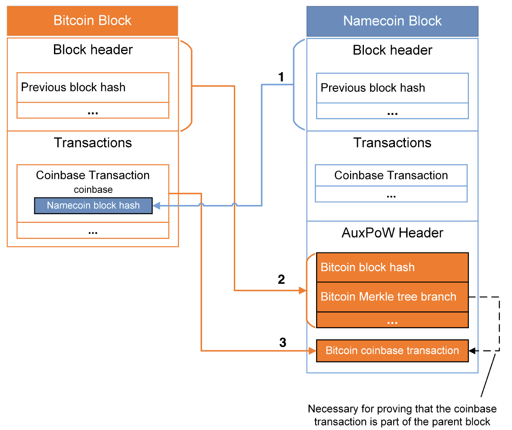
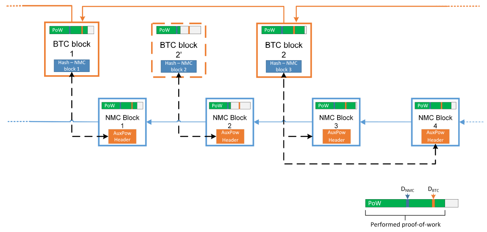
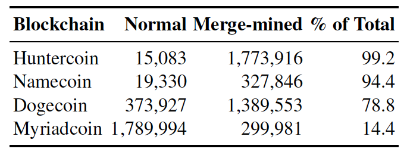
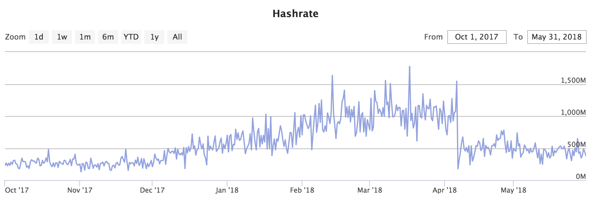
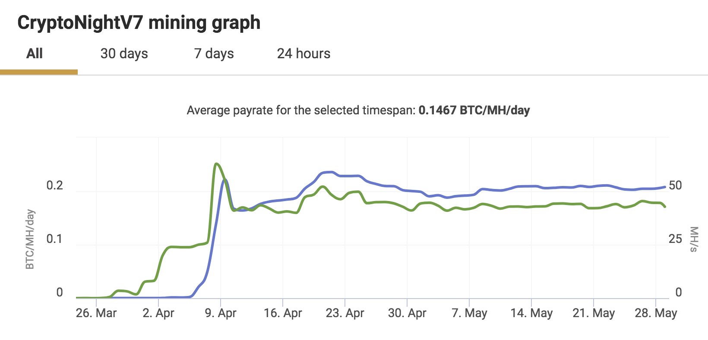
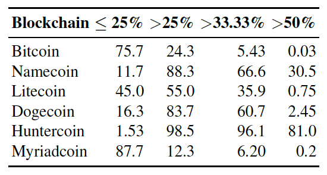

# Merged Mining Introduction

## What is merged mining? 

Merged mining is the act of using work done on another block chain (the Parent) on one or more Auxiliary block chains and to accept it as valid on its own chain, using Auxiliary Proof-of-Work (AuxPoW), which is the relationship between two block chains for one to trust the other's work as their own. The Parent block chain does not need to be aware of the AuxPoW logic as blocks submitted to it are still valid blocks. [1]

As an example the structure of merged mined blocks in Namecoin and Bitcoin is shown below. [25]



A transaction set for both block chains are assembled. The hash of the AuxPoW block header is then inserted in the 'free' bytes region (coinbase field) of the coinbase transaction and submitted to the Parent block chain's Proof-of-Work (PoW). If the merge miner solves the block at the difficulty level of either or both block chains the respective block(s) are re-assembled with the completed PoW and submitted to the correct block chain. In case of the Auxiliary block chain the Parent's block hash, Merkle tree branch and coinbase transaction are inserted in the Auxiliary block's AuxPoW header. This is to prove that enough work was done on the Parent block chain that meets the difficulty level of the Auxiliary block chain. ([1], [2], [25])

The propagation of Parent and Auxiliary blocks are totally independent and only governed by each chain's difficulty level. As an example the diagram below shows how this can play out in practice with Namecoin and Bitcoin when the Parent difficulty (D<sub>BTC</sub>) is larger than the Auxiliary difficulty (D<sub>NMC</sub>) . Note that *BTC block 2'* did not become part of the Parent block chain propagation.





## Merged mining with multiple Auxiliary chains

A miner can use a single Parent to perform merged mining on multiple Auxiliary block chains. The Merkle tree root of a Merkle tree that contains the block hashes of the Auxiliary blocks as leaves must then be inserted in the Parent's coinbase field as shown below. To prevent double spending attacks each Auxiliary block chain must specify a unique ID that can be used to derive the leave of the Merkle tree where the respective block hash must be located. [25]


## Merged mining interesting facts, case studies

### Namecoin (#307) with Bitcoin (#1)

- Namecoin, the first fork of Bitcoin, introduced merged mining with Bitcoin [1] from block 19,200 onwards [3]. Namecoin current block height is >400,500 (@ 2018/05/28) [4].
- Over the 5 day period of 23-27/05/2018 only 226 out of 752 blocks posted transaction values over and above the block reward of 25 NMC, with an average transaction value of 159.231 NMC including the block reward. [4]
- Slush Pool merged mining Namecoin with Bitcoin rewards all miners with BTC equivalent to NMC via external exchange service. [5]
- P2pool, Multipool, Slush Pool, Eligius and F2pool are cited as top Namecoin merged mining pools. [6]

| @ 2018-05-30          | Bitcoin [16] | Namecoin [16] | Ratio   |
| --------------------- | ------------ | ------------- | ------- |
| Block time target (s) | 600          | 600           | 100.00% |
| Hashrate (Ehash/s)    | 31.705       | 21.814        | 68.80%  |
| Blocks count          | 525064       | 400794        | 76.33%  |

### Dogecoin (#37) with Litecoin (#6)

- Dogecoin introduced merged mining with Litecoin [8] from block 371,337 onwards [9]. Dogecoin current block height is >2,240,000 (@ 2018/05/29) [10].
- Many in the Dogecoin user community believe merged mining with Litecoin saved Dogecoin from a 51% attack. [8]

| @ 2018-05-30          | Litecoin [16] | Dogecoin [16] | Ratio   |
| --------------------- | ------------- | ------------- | ------- |
| Block time target (s) | 150           | 60            | 40.00%  |
| Hashrate (Thash/s)    | 311.188       | 235.552       | 75.69%  |
| Blocks count          | 1430517       | 2241120       | 156.67% |

###  Huntercoin (#779) with Bitcoin (#1) or Litecoin (#6)

- Huntercoin was released as a live experimental test to see how blockchain technology could handle full on game worlds. [22]
- Huntercoin was originally designed to be supported for only 1 year, but development and support will continue. [22]
- Players are awarded coins for gaming, thus world's first human mineable cryptocurrency.
- Coin distribution: 10 coins per block, 9 for the game world and 1 for the miners. [22]

| @ 2018-06-01                      | Huntercoin     |
| --------------------------------- | -------------- |
| Block time target (s)             | 120            |
| Block chain size (GB)             | 17             |
| Pruned block chain size (GB)      | 0.5            |
| Blocks count                      | 2291060        |
| PoW Algorithm (for merged mining) | SHA256, Scrypt |

### Myriad (#510) with Bitcoin (#1) or Litecoin (#6)

- Myriad is the first currency to support 5 PoW algorithms and claims their multi PoW algorithm approach offers exceptional 51% resistance. [23]
- Myriad introduced merged mining from block 1,402,791 onwards. [24]

| @ 2018-06-01                      | Myriad                       |
| --------------------------------- | ---------------------------- |
| Block time target (s)             | 60                           |
| Block chain size (GB)             | 2.095                        |
| Blocks count                      | 2442829                      |
| PoW Algorithm (for merged mining) | SHA256d, Scrypt              |
| PoW Algorithm (others)            | Myr-Groestl, Skein, Yescrypt |

- Some solved multi-PoW block examples below:

  - 
  - 
  - 

### Monero (#12) / DigitalNote (#166) + FantomCoin (#1068)

- FantamCoin was the 1st CryptoNote based coin to develop merged mining with Monero, but was abandoned until DigitalNote developers became interested in merged mining with Monero and revived FantamCoin in the October 2016 ([17], [18], [19]).

- ```
  FantamCoin Release notes 2.0.0
  - Fantomcoin 2.0 by XDN-project, major FCN update to the latest
    cryptonotefoundation codebase 
  - New FCN+XMR merged merged mining 
  - Default block size - 100Kb
  
  DigitalNote Release notes 4.0.0-beta
  - EmPoWering XDN network security with merged mining with any CryptoNote 
    cryptocurrency
  - Second step to the PoA with the new type of PoW merged mining blocks
  ```

- DigitalNote and FantomCoin merged mining with Monero are now stuck with the recent CryptoNight based Monero forks like Monero Classic and Monero Original after Monero's recent hard fork to CryptoNight v7. (See Attack Vectors)


| @ 2018-05-31          | Monero [16] | DigitalNote [16] | Ratio   |
| --------------------- | ----------- | ---------------- | ------- |
| Block time target (s) | 120         | 240              | 200.00% |
| Hashrate (Mhash/s)    | 410.804     | 13.86            | 3.37%   |
| Blocks count          | 1583869     | 660075           | 41.67%  |

| @ 2018-05-31          | Monero [16] | FantomCoin [16] | Ratio   |
| --------------------- | ----------- | --------------- | ------- |
| Block time target (s) | 120         | 60              | 50.00%  |
| Hashrate (Mhash/s)    | 410.804     | 19.29           | 4.70%   |
| Blocks count          | 1583869     | 2126079         | 134.23% |

### Some stats

- Merge-mined blocks in some cryptocurrencies at 2017/06/18 [24]:

  

### Observations

- The Auxiliary block chain's target block times can be smaller, equal or larger than the Parent block chain.
- The Auxiliary block chain's hash rate is generally smaller but in the same order of magnitude as that of the Parent block chain.
- A multi PoW algorithm approach may further enhance 51% resistance.


## Attack Vectors

- ### 51% attacks

  - 51% attacks are real and relevant today. Bitcoin Gold (rank #28 @ 2018/05/29) and Verge (rank #33 @ 2018/05/29) suffered recent attacks with double spend transactions following. ([11], [12])
  - In a conservative analysis, successful attacks on PoW cryptocurrencies are more likely when dishonest entities control more than 25% of the total mining power. [24]
  - Tari tokens are envisaged to be merged mined with Monero [13], as such the Monero block chain security is important to the Tari block chain. 
  - Monero recently (2018-04-06) introduced a hard fork with upgraded PoW algorithm CryptoNight v7 at block height 1546000 to maintain their Application Specific Integrated Circuit (ASIC) resistance and hence guard against 51% attacks. The Monero team proposes changes to their PoW every scheduled fork (i.e. every 6 months) going forward. ([14], [15])
  - An interesting question arises what needs to happen to the Tari block chain if the Monero block chain is hard forked. Since the CryptoNight v7 hard fork the network hash rate for Monero hovers around ~500 MH/s, whereas in the two months immediately prior it was ~1,000 MH/s [20]. Thus 50% of the hash power can be ascribed to ASICS and botnet miners.
  - 
  - NiceHash statistics for CryptoNight v7 [21] shows a lag of 2 days for ~ 100,600 miners to get up to speed with providing the new hashing power after the Monero hard fork.
  -  
  - The Tari block chain will have to fork together with or just after a scheduled Monero fork. The Tari block chain will be vulnerable to ASIC miners until it has been forked.

- ### Double proof

  - A miner could cheat the PoW system by putting more than one Auxiliary block header into one Parent block [7]. 
  - Multiple Auxiliary blocks can be competing for the same PoW, and could subject your Auxiliary block chain to nothing-at-stake attacks if the chain is forked, maliciously or by accident, with consequent attempts to reverse transactions. ([7], [26])
  - More than one Auxiliary block chain will be merged mined with Monero.

- ### Analysis of Mining Power Centralisation Issues ([24], [25])

  - In Namecoin F2Pool reached and maintained a majority of the mining power for prolonged periods.
  - Litecoin has experienced slight centralisation since mid-2014, among others caused by Clevermining and F2Pool.
  - In Dogecoin F2Pool was responsible for generating more than 33% of the blocks per day for significant periods, even exceeding the 50% threshold around the end of 2016.
  - Huntercoin was instantly dominated by F2Pool and remained in this state until mid-2016.
  - Myriadcoin appears to have experienced only a moderate impact.  Multi-merge-mined blockchains allow for more than one parent cryptocurrency and have a greater chance to acquire a higher difficulty per PoW algorithm, in comparison to the respective parent blockchain.
  - Distribution of overall percentage of days below/above the centralization indicator thresholds at 2017/06/18:
    

- ### Introduction of New Attack Vectors ([24], [25])

  - Miners can generate blocks for the merge-mined child blockchains at almost no additional cost, enabling attacks without risking financial losses.
  - Merged mining as an attack vector works both ways as parent cryptocurrencies cannot easily prevent being mergemined by auxiliary block chains.
  - Merged mining can increase the hash rate of auxiliary blockchains, but it is not conclusively successful as a bootstrapping technique.
  - Empirical evidence suggests that only a small number of mining pools is involved in merged mining and those enjoy block shares beyond the desired security and decentralization goals.

## References

[1] Merged mining specification, https://en.bitcoin.it/wiki/Merged_mining_specification, Accessed: 2018-05-28.

[2] How does merged mining work?, https://bitcoin.stackexchange.com/questions/273/how-does-merged-mining-work, Accessed: 2018-05-28.

[3] Merged-Mining.mediawiki, https://github.com/namecoin/wiki/blob/master/Merged-Mining.mediawiki, Accessed: 2018-05-28.

[4] Bchain.info - Blockchain Explorer (NMC), https://bchain.info/NMC, Accessed: 2018-05-28.

[5] SlushPool merged mining, https://slushpool.com/help/first-aid/faq-merged-mining, Accessed: 2018-05-28.

[6] 5 Best Namecoin Mining Pools of 2018 (Comparison), https://www.prooworld.com/namecoin/best-namecoin-mining-pools, Accessed: 2018-05-28.

[7] Alternative chain, https://en.bitcoin.it/wiki/Alternative_chain#Protecting_against_double_proof, Accessed: 2018-05-28.

[8] Merged Mining AMA/FAQ, https://www.reddit.com/r/dogecoin/comments/22niq9/merged_mining_amafaq, Accessed: 2018-05-29.

[9] The Forkening is happening at ~9:00AM EST, https://www.reddit.com/r/dogecoin/comments/2fyxg1/the_forkening_is_happening_at_900am_est_a_couple, Accessed: 2018-05-29.

[10] Dogecoin blockchain explorer, https://dogechain.info,  Accessed: 2018-05-29.

[11] Bitcoin Gold Hit by Double Spend Attack, Exchanges Lose Millions, https://www.ccn.com/bitcoin-gold-hit-by-double-spend-attack-exchanges-lose-millions,  Accessed: 2018-05-29.

[12] Privacy Coin Verge Succumbs to 51% Attack [Again], https://www.ccn.com/privacy-coin-verge-succumbs-to-51-attack-again, Accessed: 2018-05-29.

[13] Tari official website, https://www.tari.com, Accessed: 2018-05-29.

[14] Monero Hard Forks to Maintain ASIC Resistance, But ‘Classic’ Hopes to Spoil the Party, https://www.ccn.com/monero-hard-forks-to-maintain-asic-resistance-but-classic-hopes-to-spoil-the-party/ Accessed: 2018-05-29.

[15] PoW change and key reuse, https://getmonero.org/2018/02/11/pow-change-and-key-reuse.html, Accessed: 2018-05-29.

[16] BitInfoCharts, https://bitinfocharts.com, Accessed: 2018-05-30.

[17] Merged mining with Monero, https://minergate.com/blog/merged-mining-with-monero, Accessed: 2018-05-30.

[18] ANN DigitalNote |XDN| - ICCO Announce - NEWS, https://bitcointalk.org/index.php?topic=1082745.msg16615346#msg16615346, Accessed: 2018-05-31.

[19] DigitalNote xdn-project, https://github.com/xdn-project, Accessed: 2018-05-31.

[20] Monero charts, https://chainradar.com/xmr/chart, Accessed: 2018-05-31.

[21] Nicehash statistics for CryptoNight v7, https://www.nicehash.com/algorithm/cryptonightv7, Accessed: 2018-05-31.

[22] Huntercoin: A Blockchain based Game World, http://huntercoin.org/, Accessed: 2018-06-01.

[23] Myriad: A Coin For Everyone, http://myriadcoin.org/, Accessed: 2018-06-01.

[24] Merged Mining: Curse or Cure?,  https://eprint.iacr.org/2017/791.pdf, Judmayer et. al., Data Privacy Management, Cryptocurrencies and block chain Technology: ESORICS 2017 International Workshops, DPM 2017 and CBT 2017, Oslo, Norway, September 14-15, 2017, Proceedings (pp.316-333).

[25] Merged Mining: Analysis of Effects and Implications,  http://repositum.tuwien.ac.at/obvutwhs/download/pdf/2315652, Zamyatin Alexei, MSc Thesis, Faculty of Informatics at the Technische Universität Wien.

[26] Problems - Consensus - 8. Proof of Stake, https://github.com/ethereum/wiki/wiki/Problems, Accessed: 2018-06-05.
