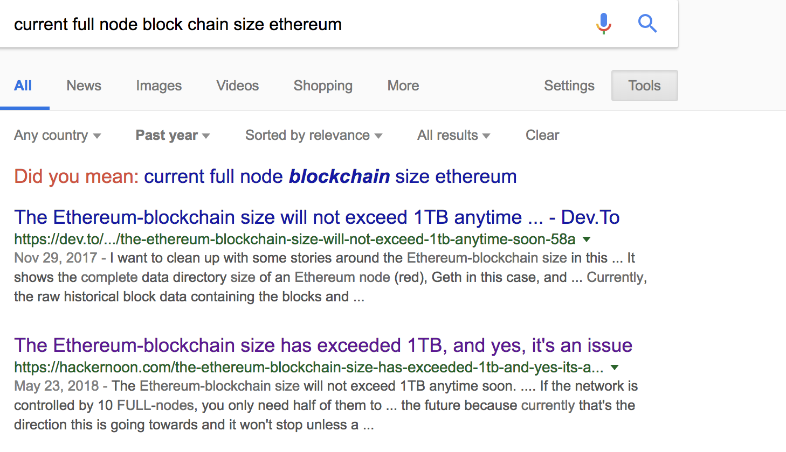

# Introduction to Simple Payment Verification (SPV), Merkle Trees and Bloom Filters

---
# Types of Validating Nodes
## Full Node
  * Stores the all blocks in the longest chain  
  * Size is a problem 

  

---

# Types of Validating Nodes
## Simple Payment Verification (SPV) client
* Examples: miner, wallets
* Only have block headers and ask network for blocks as they are needed

---

# Simple Payment Verification (SPV)
* Initially appeared in Satoshi Nakamoto's white paper.
* Miners and wallets store only the headers of the blockchain and then request blocks that they need for verification.
* If the block is in the longest chain and 6 blocks deep, it's accepted as valid 

# The Problem

To reduce the size of the blockchain initial download, miners and wallets only download the block headers (80 bytes for BTC). When a transaction needs to be validated, the node requests the blocks that have the relevant transactions (by transaction hash). 