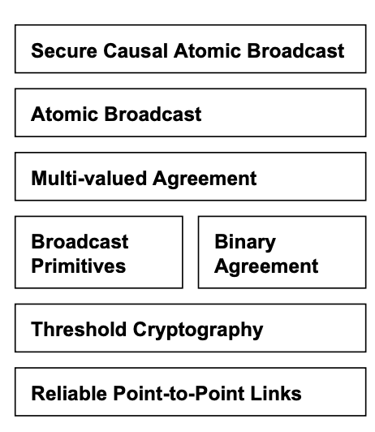

# Permissionless Byzantine Fault Tolerant Protocols (Part 1)

- [Introduction](#introduction)
  - [Paxos](#paxos)
  - [Chandra Toueg](#chandra-toueg)
  - [Raft](#raft)
  - [HashGraph](#hashgraph)
    - [The Gossip Protocol](#the-gossip-protocol)
    - [Ancestors](#ancestors)
    - [Seeing](#seeing)
    - [Strongly seeing](#strongly-seeing)
    - [The Construct of Gossiping](#the-construct-of-gossiping)
    - [Internal consenus](#internal-consensus)
    - [Criticisms](#criticisms) 
  - [SINTRA](#sintra)

## Introduction

BFT protocols face several limitations when utilized in permissionless block chains. They do not scale well with the number of participants, resulting in performance deterioration for the targeted network sizes. In addition, they are not well established in this setting, thus they are prone to security issues, e.g. Sybil attacks. Currently, there are approaches that attempt to circumvent or solve this problem. [[9]]

### Paxos 

The Paxos family of protocols includes a spectrum of trade-offs between the number of processors, number of message delays before learning the agreed value, the activity level of individual participants, number of messages sent,  and types of failures. Although the FLP theorem states that there is no deterministic fault-tolerant consensus protocol that can guarantee progress in an asynchronous network, Paxos guarantees safety (consistency), and the conditions that could prevent it from making progress are difficult to provoke [[29]].

Paxos achieves consensus as long as there are *f* failures, where _f < (n-1)/2_. These failures cannot be Byzantine (otherwise the BFT proof would be violated). Thus it is assumed that messages are never corrupted, and that nodes do not collude to subvert the system. 

Paxos proceeds through a set of negotiation rounds, with one node having 'Leadership' status. Progress will stall if the leader becomes unreliable, until a new leader is elected, or if suddenly an old leader comes back online and a dispute between two leader nodes arises.

### Chandra-Toueg

The Chandra–Toueg consensus algorithm was published by Tushar Deepak Chandra and Sam Toueg in 1996. It relies on a special node that acts as a failure detector. In essence, it pings other nodes to make sure they're still responsive.

This implies that the detector stays online and that the detector must continuously be made aware when new nodes join the network.

The algorithm itself is similar to the Paxos algorithm, which also relies on failure detectors and as such requires *f<n/2*, where n is the total number of processes. [[27]]

### Raft

Raft is a consensus algorithm designed as an alternative to Paxos. It was meant to be more understandable than Paxos by means of separation of logic, but it is also formally proven safe and offers some additional features [[28]].  

Raft achieves consensus via an elected leader. Each follower has a timeout in which it expects the heartbeat from the leader. It is thus a synchronous protocol. If the leader fails, an election is held to find a new leader. This entails nodes nominating themselves on a first-come, first-served basis. Hung votes require the election to be scrapped and restarted. This suggests that a high degree of cooperation is required by nodes and that malicious nodes could easily collude to  disrupt a leader and then prevent a new leader from being elected. Raft is a simple algorithm but is clearly unsuitable for consensus in cryptocurrency applications.

While Paxos and Raft and many other well-known protocols tolerate crash faults, Byzantine fault tolerant protocols beginning with PBFT, tolerate even arbitrary corrupted nodes. Many subsequent protocols offer improved performance, often through optimistic execution that provides excellent performance when there are no faults, clients do not contend much, and the network is well behaved, and at least some progress otherwise. 

In general, BFT systems are evaluated in deployment scenarios where latency and CPU are the bottleneck, thus the most effective protocols reduce the number of rounds and minimize expensive cryptographic operations.

Clement et al. [[40]] initiated a recent line of work by advocating improvement of the worst-case performance, providing service quality guarantees even when the system is under attack, even if this comes at the expense of performance in the optimistic case. However, although the "Robust BFT protocols in this vein gracefully tolerate comprised nodes, they still rely on timing assumptions about the underlying network".  Thus focus shifted to asynchronous networks. [[6]] 

### HashGraph

The Hashgraph consensus algorithm [[30]], was released in 2016.  It claims Byzantine fault tolerance under complete **asynchrony** assumptions, no leaders, no round robin, no proof-of-work, eventual consensus with probability one, and high speed in the absence of faults. 

It is based on the gossip protocol, which is a fairly efficient distribution strategy that entails nodes randomly sharing information with each other, similar to how human beings gossip with each other.

Nodes jointly build a hash graph reflecting all of the gossip events. This allows Byzantine agreement to be achieved through virtual voting. Alice does not send Bob a vote over the Internet. Instead, Bob calculates what vote Alice would have sent, based on his knowledge of what Alice knows.  

HashGraph uses digital signatures to prevent undetectable changes to transmitted messages.

HashGraph does not violate the FLP theorem, since it is _non-deterministic_. 

The Hash graph has some similarities to a block chain. To quote the white paper: "The HashGraph consensus algorithm is equivalent to a block chain in which the 'chain' is constantly branching, without any pruning, where no blocks are ever stale, and where each miner is allowed to mine many new blocks per second, without proof-of-work" [[30]].

Because each node keeps track of the hash graph, there is no need to have voting rounds in HashGraph; each node already knows what all of its peers will vote for and thus consensus is reached purely by analyzing the graph. 

#### The Gossip Protocol 

The gossip protocol works like this:

- Alice selects a random peer node, say Bob, and sends him _everything she knows_. She then selects another random node and repeats the process indefinitely.

- Bob, on receiving Alice's information, marks this as a gossip event and fills in any gaps in his knowledge from Alice's information. Once done, he continues gossiping with his updated information.

The basic idea behind the Gossip Protocol is the following: A node wants to share some information to the other nodes in the netwrok. Then periodically it randomly selects a node from the set of nodes and exchanges the information. The node that receives the information performs the randomly selects a node from the set of nodes and exchanges the information, and so on. The information is periodically sent to _N_ targets, where _N_ is the fanout. [[45]]

The _cycle_ is the number of rounds to spread the information. The _fanout_ is the number of nodes a node gossips with in each cycle.

With a fanout=1, $O(LogN)$ cycles are necessary for the update to reach all the nodes. 

In this way, information spreads throughout the network in an exponential fashion. [[30]]

<p align="center"></p>
<p align="center"><b>Figure 1: Gossip Protocol Directed Graph</b></p>

The gossip history can be represented as a directed graph, as in Figure 1. 

HashGraph introduces a few important concepts that are used repeatedly in later BFT consensus algorithms: famous witnesses, and strongly seeing.

#### Ancestors

If an event (_x1_) comes before another event (_x2_), and they are connected by a line; the older event is an _ancestor_ of that event.

If both events were created by the _same node_, then _x1_ is a _self-ancestor_ of _x2_. 

**Note**: The gossip protocol defines an event as being a (self-)ancestor of itself!

#### Seeing

If an event _x1_ is an ancestor of _x2_, then we say that _x1_ **sees** _x2_ as long as the node is not aware of any forks from _x2_.

So in the absence of forks, all events will _see_ all of their ancestors.

```text
     +-----> y
     |
x +--+
     |
     +-----> z
```

In the example above, _x_ is an ancestor to both y and z. However, because there is no ancestor relationship between _y_ and _z_, the _seeing_ condition fails, and so _y_ cannot see _x_, and _z_ cannot see _x_.

It may be the case that it takes time before nodes in the protocol detect the fork. For instance Bob may create _z_ and _y_; but share _z_ with Alice and _y_ with Charlie. Both Alice and Charlie will eventually learn about the deception, but until that point, Alice will believe that _y_ sees _x_, and Charlie will believe that _z_ sees _x_. 

This is where the concept of _strongly seeing_ comes in. 

#### Strongly seeing

If a node examines its hash graph and notices that an event _z_ _sees_ an event _x_, and not only that, but it can draw an ancestor relationship (usually via multiple routes) through a super-majority of peer nodes, and that a different event from each node also sees _x_; then it is said that according to this node, that _z_ _strongly sees_ _x_.

The following example comes from [[30]]:

<p align="center"></p>
<p align="center"><b>Figure 2: Illustration of Strongly-Seeing </b></p>

#### The Construct of Gossiping

The main consensus algorithm loop consists of every node (Alice), selecting a random peer node (Bob) and sharing their graph history. Now Alice and Bob have the same graph history.

Alice and Bob both create a new event with the new knowledge they have just learnt from their peer.

Alice repeats this process continuously.

#### Internal consensus

After a sync, a node will determine the order for as many events as possible, using three procedures.
The algorithm uses constant _n_ (the number of nodes) and a small constant value _c_>2.  

```text
in parallel:
    loop
      sync all known events to a random member
    end loop

    loop
      receive a sync
      create a new event
      call divideRounds
      call decideFame
      call findOrder
    end loop
```
Here we have the Swirlds HashGraph consensus algorithm. Each member runs this in parallel. Each sync brings in new events, which are then added to the hash graph. All known events are then divided into rounds. Then the first events in each round are decided as being famous or not (through purely local Byzantine agreement with virtual voting). Then the total order is found on those events for which enough information is available. If two members independently assign a position in history to an event, they are guaranteed to assign the same position, and guaranteed to never change it, even as more information comes in. Furthermore, each event is eventually assigned such a position, with probability one.[[30]] 

   ```procedure divideRounds
      for each event x
        r ← max round of parents of x ( or 1 if none exist )
        if x can strongly see more than 2/3*n round r witnesses
          x.round ← r + 1
        else
          x.round ← r
        x.witness ← ( x has no self parent ) || ( x.round > x.selfParent.round )
   ```
The above is deemed the divideRounds procedure. As soon as an event x is known, it is assigned a round number x.round, and the boolean value x.witness is calculated, indicating whether it is the first event that a member created in that round. [[30]]
    
   ```procedure decideFame
      for each event x in order from earlier rounds to later
        x.famous ← UNDECIDED
        for each event y in order from earlier rounds to later
          if x.witness and y.witness and y.round > x.round
            d ← y.round - x.round
            s ← the set of witness events in round y.round-1 that y can strongly see
            v ← majority vote in s ( is TRUE for a tie )
            t ← number of events in s with a vote of v
            if d = 1 // first round of the election
              y.vote ← can y see x ?
            else if d mod c > 0 // this is a normal round
                if t > 2* n /3 // if supermajority, then decide
                  x.famous ← v
                  y.vote ← v
                  break // y loop
                else // else, just vote
                  y.vote ← v
            else if t > 2* n /3 // this is a coin round
              y.vote ← v
            else // else flip a coin
              y.vote ← middle bit of y.signature
```
This is the decideFame procedure. For each witness event (i.e., an event x where x.witness is true), decide whether it is famous (i.e., assign a boolean to x.famous). This decision is done by a Byzantine agreement protocol based on virtual voting. Each member runs it locally, on their own copy of the hashgraph, with no additional communication. It treats the events in the hashgraph as if they were sending votes to each other, though the calculation is purely local to a member’s computer. The member assigns votes to the witnesses of each round, for several rounds, until more than 2/3 of the population agrees. [[30]]

#### Criticisms

An attempt to address some of these criticisms has been presented. [[31]], 
- The HashGraph protocol is patented and is not open source.
- In addition, the HashGraph white paper assumes that _n_, the number of nodes in the network, is constant. In practice, _n_ can increase, but performance likely degrades badly as _n_ becomes large. [[32]]
- HashGraph is not as "fair" as claimed in their paper, with at least one attack being proposed. [[33]]

### SINTRA

SINTRA is a Secure Intrusion-Tolerant Replication Architecture used for the coordination in asynchronous networks subject to Byzantine faults. It consists of a collection of protocols and are implemented in Java, providing secure replication and coordination among a group of servers connected by a wide-area network, such as the Internet. For a group consisting of _n_ servers, it tolerates up to $t<n/3$ servers failing in arbitrary, malicious ways, which is optimal for the given model. The servers are connected only by asynchronous point-to-point communication links. Thus, SINTRA automatically tolerates timing failures as well as attacks that exploit timing. The SINTRA group model is static, which means that failed servers must be recovered by mechanisms outside of SINTRA, and the group must be initialized by a trusted process.

The protocols exploit randomization, which is needed to solve Byzantine agreement in such asynchronous distributed systems. Randomization is provided by a threshold-cryptographic pseudorandom generator, a coin-tossing protocol based on the Diffie-Hellman problem. Threshold cryptography is a fundamental concept in SINTRA as it allows the group to perform a common cryptographic operation for which the secret key is shared among the servers in such a way that no single server or small coalition of corrupted servers can obtain useful information about it. SINTRA provides threshold-cryptographic schemes for digital signatures, public-key encryption, and unpredictable pseudo-random number generation (coin-tossing). It contains broadcast primitives for reliable and consistent broadcasts, which provide agreement on individual messages sent by distinguished senders. However, these primitives cannot guarantee a total order for a stream of multiple messages delivered by the system, which is needed to build fault-tolerant services using the state machine replication paradigm. This is the problem of atomic broadcast and requires more expensive protocols based on Byzantine agreement. SINTRA provides multiple randomized Byzantine agreement protocols, for binary and multi-valued agreement, and implements an atomic broadcast channel on top of agreement. An atomic broadcast that also maintains a causal order in the presence of Byzantine faults is provided by the secure causal atomic broadcast channel.[[51]]

SINTRA is designed in a modular way as shown in Figure 1. Modularity greatly simplifies the construction
and analysis of the complex protocols needed to tolerate Byzantine faults.

<p align="center"></p>
<p align="center"><b>Figure 2: The Design of SINTRA </b></p>

[9]: http://conferences.inf.ed.ac.uk/EuroDW2018/papers/eurodw18-Rusch.pdf
"High-Performance Consensus Mechanisms for Blockchains,
Rusch"

[29]: https://en.wikipedia.org/wiki/Paxos_(computer_science)
"Paxos, Wikipedia"

[27]: https://en.wikipedia.org/wiki/Chandra%E2%80%93Toueg_consensus_algorithm
"Chandra-Toueg Consensus Algorithm, Wikipedia"

[28]: https://en.wikipedia.org/wiki/Raft_(computer_science)
"Raft, Wikipedia"

[40]: https://www.usenix.org/legacy/event/nsdi09/tech/full_papers/clement/clement.pdf
"Making Byzantine fault Tolerant Systems Tolerate Byzantine Faults , 
Clement et al."

[6]: https://eprint.iacr.org/2016/199.pdf
"The Honey Badger of BFT Protocols WhitePaper,
Miller  et al."

[30]: https://www.swirlds.com/downloads/SWIRLDS-TR-2016-01.pdf 
"Hashgraph WhitePaper, Baird"

[45]: https://managementfromscratch.wordpress.com/2016/04/01/introduction-to-gossip/
"Introduction to Gossip" 

[31]: http://www.swirlds.com/downloads/Swirlds-and-Sybil-Attacks.pdf 
"Swirlds and Sybil Attacks, Baird"

[32]: https://hackernoon.com/demystifying-hashgraph-benefits-and-challenges-d605e5c0cee5
"Demystifying HashGraph"

[33]: https://medium.com/opentoken/hashgraph-a-whitepaper-review-f7dfe2b24647
"HashGraph: A WhitePaper Review"

[51]: https://cachin.com/cc/papers/sintra.pdf
"Secure Intrusion-tolerant Replication 
on the Internet, Cachin et al."
