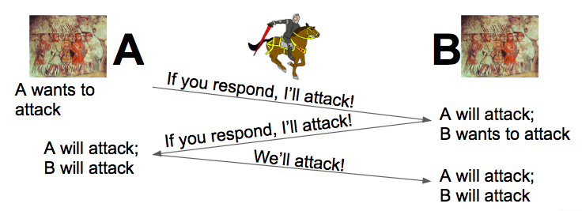
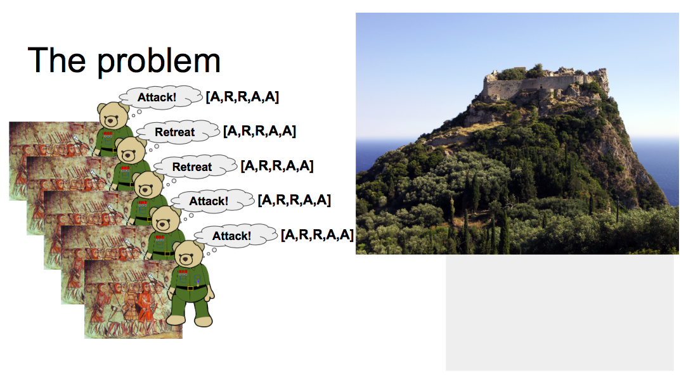

# Byzantine Fault Tolerance and Consensus Mechanisms

- Consensus as a concept in cryptocurrency protocols
- How it is implemented in different cryptocurrency protocols

<!-- Note: In this presentation we will look at the concept of consensus and how it is implemented in different cryptocurrency protocols. -->

---

## [Byzantine Fault Tolerance](https://www.youtube.com/watch?v=_e4wNoTV3Gw)

<!-- Note: When considering the concept of consensus in cryptocurrency and cryptographic protocols, the Byzantine Generals Problem is often referenced - where a protocol is described as being byzantine fault tolerant (or BFT). This stems from an analogy, as a means to understand the problem of distributed consensus. -->

---

### The Design Challenge

How can you design and build a distributed system that can survive the worst possible failures of that system?

- Traitor sends conflicting messages

The cause:

- Flaky node(s)
- Malicious node(s)

<!-- Note: To classify Byzantine failure: we say that some node in your system, which is exhibiting Byzantine failure is a traitor node. The traitor can send conflicting messages, leading to an incorrect result of the calculation that your distributed system is trying to perform where the cause is a flaky or malicious node. -->

---

### The Two Generals Problem

- The two generals problem is an example of a consensus problem
- A consensus problem is where two nodes in our distributed system simply have to agree

---

### The Two Generals Problem

The two generals problem is an example of a consensus problem that helps us reason about an opponent. A consensus problem is where two nodes in our distributed system must agree.

For example: There are two allied armies, A and B, each led by a general. Together, they could defeat their common enemy Army C, but individually they are outnumbered. They must agree on the decision "Are we going to attack Army C in the morning or are we going to retreat?"; If both Army A and B launch an attack in the morning, then they will win, if they both retreat then they survive to fight another day. However, if either Army A or Army B choses to attack alone, they will lose. The limitations: The generals of Army A and B can only communicate through messengers; These messengers ride horses through the territory of Army C - so they may or may not make it to the opposing general. So a protocol needs to be designed: what messages should the generals send between each other, so that they are in consensus and agree to attack or retreat in the morning?

---

#### Two Generals Problem: Solved?

- But there is a problem here, because if this third message is lost, A is committed to attack and B is not yet committed ==> so we haven't solved the problem
- It can be proved that there is no way of solving the two generals problem ==> there is no perfect solution

---

#### Two Generals Problem: Solved?

If general A decides they want to attack, they send a message to general B, saying "if you respond I'll attack"; If this message gets lost, it's no problem, because A is not going to attack if they don't get a response from B. If B gets this message, and B is now 'okay, I now know that A is going to attack tomorrow morning if I respond, I am going to respond, so A will attack, I want to attack, I send a message back saying 'If you respond, I'll attack too'; Again, if this message gets lost, it's no problem, because B hasn't committed to attack and neither has A; A receives the second message, and when A gets the second message, it is now committed to attack, because it has now sent out it's challenge and received it's response. Then A responds with sending a message’ okay, I know I'm going to attack for sure, B you should attack for sure as well'But there is a problem here, because if this third message is lost, A is committed to attack and B is not yet committed ==> so we haven't solved the problem. Maybe we could add another message to this protocol, the problem is, no matter what message we come up with and no matter how many messages we add to this protocol, there is always going to be the problem of having an inconsistent state until that one last message gets through. It can be proved that there is no way of solving the two generals problem ==> there is no perfect solution.

---

#### Take aways

- In this situation, the network is our byzantine opponent.

- The Two General's Problem demonstrates that if your byzantine failure results in the failure of your entire communication network, there is no way that you can get consensus between your nodes in your distributed system.

- We can look at this problem differently if we flip that around ==> the Byzantine Generals Problem

<!-- Note: In this situation, the network is our byzantine opponent-- how do you work around the two generals problem in practice? In practice, you assume that your enemy, is not perfectly byzantine (maybe it will statistically lose messages, as opposed to always doing the worst possible thing to you and if you make that assumption you can design a protocol like, in general A wants to attack, so a hundred messengers must be sent to general B, all saying we are going to attack tomorrow, and if any of them get through to B, then B attacks, as long as one of the hundred messengers gets through, the problem is solved... not ideal, but it works. The Two General's Problem demonstrates that if your byzantine failure results in the failure of your entire communication network, there is no way that you can get consensus between your nodes in your distributed system. We can look at this problem differently if we flip that around; What if the individual nodes in your system can get corrupted? and we assume that the network works, then we have the Byzantine Generals Problem -->

---

### The Byzantine Generals Problem

- The Byzantine Generals Problem, Leslie Lamport Robert Shoestack and Marshall Peace. ACM TOPLAS 4.3, 1982

Answers

- How many Byzantine nodes failures can a system survive?
- How might you build such a system?

<!-- Note: The Byzantine Generals Problem is a seminal paper in computer science and distributed systems, published in 1982 by Leslie Lamport Robert Shoestack and Marshall Peace. It was originally called the Albanian Generals Problem, but the name was changed to prevent people getting offended. It provides answers to many questions; like how many Byzantine nodes failures can a system survive and how might you build such a system. -->

---

- A Byzantine army is trying to attack an enemy
- There are five generals who are leading armies to attack a fortress
- They need to decide what they are going to do tomorrow morning: attack or retreat
- The votes that generals come up with are Attack, Retreat, Retreat, Attack, Attack
- Majority rules, so they see that they will attack, as a consensus is reached

---

## Note: And that is the goal of this problem-- Make sure that all the generals are in consensus

- What if one of the generals is a traitor--> that traitor's mission is to disrupt consensus such that the generals do not agree on what they intend to do tomorrow morning
- What the traitor decides is negated, however what needs to be considered is what the other generals think the traitor said

<!-- Note: We basically need to ensure that they all agree on what the traitor said. -->

---

- In this case, they currently all think the traitor said attack (or ret
- It would be bad if half of loyal generals thought that the traitor said attack and half thought the traitor said retreat
- If that were to happen, the traitor would be happy because his mission of creating chaos and corrupting consensus would be achieved

<!-- Note: or it would be just as valid if they all thought that the traitor said retreat, because they would still be in consensus and all do the same thing. -->

---

#### Take aways

The Byzantine Generals Problem in particular is the problem of communicating one decision from one general to all the other generals.

We are simply trying to get the loyal generals to agree, come to consensus on a single fact

<!-- Note: The Byzantine Generals Problem in particular is the problem of communicating one decision from one general to all the other generals. We are simply trying to get the loyal generals to agree, come to consensus on a single fact therein lies the problem-- when you have people distributed in that way, how do those people come to consensus, and agree on something. In reality it revolves around getting 51% of the people to agree on something and all move forward with that strategy. (in the case of the blockchain, all move forward with a certain set of rules, and a certain view on history i.e. what is in the blockchain) -->

---

## What is a blockchain?

It is a distributed ledger- a source of truth for history

<!-- Note: Because we have thousands of people using this ledger, how do we get them all to agree on something-- even worse, how to we make sure that someone with a bad agenda (a bad actor) doesn't come in and try to rewrite history -->

---

## [Understanding of the Principle](https://medium.com/the-daily-bit/9-types-of-consensus-mechanisms-that-you-didnt-know-about-49ec365179da)

- Consensus mechanisms are ways to guarantee a mutual agreement on a data point and the state.

<!-- Note: With blockchains, consensus mechanisms ensure that each player in the network has a copy of the same ledger. Different consensus mechanisms impact the security and the economic framework of the overarching cryptographic protocol (code of conduct) in varying ways. -->

Creating consensus mechanisms involves the study of mechanism design, which is a two-step process:

1. Consider the desired outcome
2. Work backward to create a game that incentivises players to fulfil that outcome

---

## [Brief history on decentralised systems](https://thecontrol.co/cryptoeconomics-101-e5c883e9a8ff)

<!-- Note: Decentralised P2P systems based on cryptography were not new in 2009 (examples include Kazaa and Bittorrent). What these earlier decentralised systems lacked was economic incentives, and the lack of baked in economic incentives is arguably what stifled these early P2P systems from persisting and thriving over time. -->

Satoshi added economic incentives to P2P systems when he created Bitcoin in 2009. It was actually previously believed to be impossible to achieve consensus among nodes (the Byzantine General’s Problem)

---

## [The need for consensus mechanisms](https://cointelegraph.com/news/why-blockchain-needs-proof-of-authority-instead-of-proof-of-stake)

The purpose of a consensus algorithm in a public blockchain network is to make sure that the network’s participants agree on the current state of the blockchain without the need to trust each other or to have a central authority.

<!-- Note: The cryptocurrency world is maturing and the debate over the right long-term consensus protocol is intensifying.This is where Proof of Work comes in -->

---

### Proof of Work

- Concept developed in the early 1990s as a proposal for how of to get around something called the denial of service attack
- One of the first implementations of this and where Bitcoin is routed in is called Hash Cash.

Proof of Work is essentially a piece of data that very time consuming and computationally expensive to produce- but at the same time it has to be very simple for someone on the other side to verify that a person did that proof of work

<!-- Note: Concept developed in the early 1990s as a proposal for how of to get around something called the denial of service attack. DoS attack is simply a network connection or a system being flooded with requests that it has to serve back, and the system cannot detect whether these requests are true or not. One of the first implementations of this and where Bitcoin is routed in is called Hash Cash. It was developed by Adam Back (he is now a Bitcoin Core developer) in 1997. Proof of Work is essentially a piece of data that very time consuming and computationally expensive to produce- but at the same time it has to be very simple for someone on the other side to verify that a person did that proof of work. -->

---

#### How does this help with the Byzantine Generals Problem?

- It makes it expensive to become a bad actor to try an attack the network

<!-- Note: Now in the case of Hash Cash- what it was actually being used for was a way to deter spam email. You would have to perform a amount of proof of work- which would take a while on a regular computer, and attach that in the header of the email you were sending. When the user on the other end would receive that email, they would check for that header, and be able to verify whether you put some work into that before you sent it. And the theory here is that a spammer would not go out of their way and spend thousands or hundreds of thousands of dollars creating all of this proof of work to send emails-- it became more expensive to send spam. In bitcoin's case, it makes the proof of work the miners responsibility -->

---

##### The Miners

- The miners are the people we are entrusting to be able to write history- they are the generals in this case.
- Bitcoin automatically adjusts the difficulty of generating this proof of work.
- POW also acts as a way to mint the coins -Adding the incentive

So proof of work mining and the way it solves this distributed consensus problem is really one of the chief innovations in bitcoin and what made it successful- because it is very hard problem to solve

<!-- Note: The miners are the people we are entrusting to be able to write history- they are the generals in this case. Bitcoin automatically adjusts the difficulty of generating this proof of work. So it works out at roughly ten minutes for somebody to find a solution, amongst all the miners out there- (that's how we get to the ten minute block time- you have thousands of miners out there all trying to generate this proof of work, and in about ten minutes someone comes up with the solution, and is hence trusted to write to history (because they have put so much time and effort and energy into generating that- essentially making it very costly for anyone to attack that network and do something dishonest. In Bitcoin's current state, it also acts as a way to mint the coins- so every miner, when they solve a block is actually rewarded with new coins, that have been minted into the network- so that adds extra incentive - 'I should be have because I will be rewarded for all this work I'm doing to secure the network and write that immutable history'. So proof of work mining and the way it solves this distributed consensus problem is really one of the chief innovations in bitcoin and what made it successful- because it is very hard problem to solve -->

---

##### The Drawbacks

1. It is inefficient and does not really solve anything
2. It is wasteful and costly from an electricity perspective
3. Because the chief resource that you a putting into securing this network is expensive hardware, it actually creates an arms race amongst the miners to try and buy up the most expensive, powerful and advanced mining hardware

All this adds to the problem of centralisation.

<!-- Note: But this is not to say that Proof of Work is the be all and end all- it does have some drawbacks: 1. It is inefficient and does not really solve anything (those millions and trillions of hashes that are being generated in trying to find a solution- they do not contribute back to society) 2. It is wasteful and costly from an electricity perspective (some estimates say that it costs half a billion dollars every year just to secure the network through mining, all the people running server farms with mining equipment- just for bitcoin- there is a lot more electricity going into all the other cryptocurrencies 3. Because the chief resource that you a putting into securing this network is expensive hardware, it actually creates an arms race amongst the miners to try and buy up the most expensive, powerful and advanced mining hardware. Due to that arms race we have seen a lot of proprietary technology being developed- ASICs (applications specific integrated circuit) and really it is just a special computer solely designed to mine bitcoin, or whatever hashing algorithm it is designed for). -->

---

They are super efficient- but often the technology is close-sourced and expensive to procure. All this adds to the problem of centralisation. So you have all the research and development into these ASICs being done over in China-those people are not going to sell their technology which they can use to make lots of money mining bitcoin- they are going to keep it to themselves, and they are going to mine and profit of bitcoin-- as a result we have around 70% of the mining power on bitcoin in the hands of a few miners over in China.

- No single miner holds over 51% of the hashing power over in China

However if a couple of those parties came together and formed a cartel- then it blows away a solution the Byzantine Generals Problem- because it means that just two generals could collude and be able to write history as they see fit.

<!-- Note: So just a few years after Bitcoin was initially released in 2009, people started getting more vocal about these criticisms, these drawbacks of Bitcoin's proof of work consensus system . As a result a lot of proposals started coming up as a solution to this distributed consensus problem- that wasn't potentially centralised. The one that has made the most ground is called proof of stake... -->

---

### Proof of Stake

- Proof of stake popped up in 2011- on a bitcoin talk thread
- 'Mining' is referred to as forging or minting
- People are randomly or pseudo-randomly selected to commit the block based on their stake

<!-- Note: People said, what if the resource we are putting in isn't external, i.e. mining hardware- but actually internal to the cryptocurrency-- what people meant by that, was what if we can trust people based on the number of coins they currently hold, i.e. their stake in their network-- like proof of work, there is a mining process- but they prefer to call it forging or minting. The difference is that it is kind of like a lottery system - where people are randomly or pseudo-randomly selected to be the person who is trusted to commit the block every x number of seconds or minutes. This pseudo random selection is actually based or weighted towards the people that hold the most unspent coins on the network. Those people have a lot invested in the network if they hold millions and millions of coins and hence have a lot to lose if something goes wrong. Often proof of stake systems will also look at the age of those coins (i.e. how long ago did the person procure those coins-- really as a way to determine 'are they heavily invested for the long term in the future of this network- the implication here, is since they have a lot at stake, it could be implied that they are more trustworthy, or more likely to behave in a more positive way rather than trying to attack the network. -->

- PPcoin first implemented PoS in 2012
- Distribution issues, as the only way to get coins was to buy them off somebody
- No minting

Some coins have adopted a joint proof of work and proof of stake system, so they have that minting with the proof of work, but then they switch over to proof of take for the blockchain security.

<!-- Note: Proof of stake is not something new. The first implementation- which was originally called PPcoin- which was later renamed to peer coin- came out in 2012, and was ground breaking at the time, because the resources that the miners or the forgers were putting in were not expensive pieces of mining hardware, they were the number of coins they held in the network. Typically these coins allocate all the coins that are ever going to be created, at the genesis of the network, and this can actually lead to some distribution issues, because the only way to get coins is off somebody who already has coins. There is no minting, like there is with bitcoin every ten minutes. Some coins have adopted a joint proof of work and proof of stake system, so they have that minting with the proof of work, but then they switch over to proof of take for the blockchain security. -->

---

#### Benefits to PoS

1. Energy saving
2. No expensive mining hardware or high electricity costs
3. Attacks become more and more expensive

<!-- Note: There are a lot of benefits to proof of stake which take aim at all those drawbacks mentioned about proof of work. 1. Energy saving: people are chosen pseudo-randomly by the network to be trusted to commit to history, there is no proof of work, where people are competing every ten minutes, 2. and hence no expensive mining hardware or high electricity costs-- and as a result of there being no proof of work mining there is no arms race to develop this special ASIC hardware-- the technology can be run on any kind of consumer grade computer or server3. Attacks become more and more expensive-- say i wanted to buy 51% of the coins to attack the network, but my increased demand and the limited supply makes it more and more expensive in fiat currency for me to mount an attack on the network. And even if I bought 51% of the coins on a network, why would I then do something bad to that network, that is where all my money is invested. So you can start to see the crypto-economics of how incentives align in a proof of stake system. This is not to say that proof of stake is the perfect solution to the consensus problem. -->

---

#### The Drawbacks

- Nothing of Stake Problem
- Mining on multiple chains, submitting multiple blocks
- Own more that 51% of the historical or old coins

- At PP coin they actually hard code check points into the software that stop people from doing these rewrite attacks.
- Ethereum's development of Casper, punisher= Slasher

<!-- Note: There is actually a big problem with proof of stake... and some people call it the nothing at stake problem
so with bitcoin, With PoW I am incentivised to continue mining the longest chain, the most popular chain, because that's where I'll get rewarded with those block rewards and over time I will be able to sell that to USD. As a result miners are pointing all their expensive hardware at a single blockchain and trying to secure that... with Proof of stake because the right to forge a new block pseudo-random and there is basically no computational cost on me for doing so, there is no real incentive to stop me from mining on multiple proof of stake chains, and if i as a proof of stake miner are voting on multiple chains, it means that consensus can be very hard to resolve or come to in the end. Because of this, an abusive miner can actually mine on multiple proof of stake chains, submit multiple blocks, in a way to double spend or rewrite history. an example of an attack vector here is that i might go out and try and buy the private keys of people, who no longer have money in their accounts but did at some point in time, and there is no economic incentive for those people not to sell those private keys because there is no money in them any more. -->

<!-- That abusive miner can actually start re-mining from the very beginning of the blockchain and own more than 51% of the historical or old coins (there are many attack vectors that tie into the nothing at stake problem) there is a real issue that most proof of stake implementations have tried to tackle in some way or another. PP coin they actually hard code check points into the software that stop people from doing these rewrite attacks, They basically say as of this date, everything before here is written in stone, and that's in the software itself. Some people are a little dubious about this because it is writing check points about history in the software itself rather than relying on consensus. It is a little bit centralised because the developers could write in any check point that they want. Ethereum is moving to a proof of stake system due to some of the concerns of proof of work mining. And it is a non trivial problem to try and deal with a nothing at stake problem in the proof of stake world. They are developing something called casper, which is their proof of stake implementation, and they will be actually implementing something called star slasher, which essentially punishers people who try to sign on two different chains. In a nutshell the miners have to put down a security deposit in Ethereum to even be eligible to be selected to randomly mine that proof of stake block, and if that user is deemed by the protocol to be a bad actor, having signed on two different blockchains, then they will lose that security deposit- so you can see how the incentives are them, for them to actually behave and only sign the one blockchain- essentially you have to play by the rules, otherwise you get punished-- this is a really good crypto-economic incentive system to stop people from trying to manipulate or game the protocol. -->

---

### Delegated Proof of Stake

- Bitshares uses DPoS
- Elected delegates have dedicated nodes that forge the blocks

<!-- Note: A similar technology or approach that is being used is delegated proof of stake and this is being used in things like bitshares. It is essentially the same as proof of stake but the mining or forging is done by these elected delegates who have dedicated nodes that forge the blocks. So the thousands of millions of holders of the coins have to appoint or select a delegate who will then do the forging on their node. This slightly helps with the nothing at stake problem because those delegates are trusted and the mining is kind of centralised, so that just those delegates can do it. There are about a hundred or so delegates in the bitshares ecosystem and those delegates are actually paid for the work that they are doing as well. This semi centralisation is still distributed or some what federated because of the delegation process- it really enables the network to be a lot faster-- in the case of bitshares, they have a 10 second block time and their throughput is a lot higher than bitcoin in terms of transaction capability-- but it goes against bitcoin's proof of work ethos, and the whole nature of any body being able to take part and produce blocks if they want to. Some may argue that it is not totally decentralised, others may argue that it is a compromise, that actually results in a more secure faster network.So outside of proof of work and proof of stake there have been other protocols or suggestions of how we might solve the consensus problem... -->

---

### Proof of Space/Capacity/Retrievability

- This is all related to providing file storage or access to files as a way of doing the work
- It is similar to proof of work- but it is highly memory bound, because you are using the disk storage of somebody.
- The work is valuable

Loss of speed and ease of use

---

<!-- Note: There are a couple of proposals out there: Spacemint, permacoin that are trying to do this thing, based on thh disk capacity of file storage that you are willing to give the network, that acts as your proof of work. There is another interesting project called Storj- they are using proof of retrievability which is similar, but it means that you are able to retrieve your files at any point in time, if so that node, that person providing that storage is trustworthy. Now the one obvious advantage here is that the proof of work, the storage you are providing is actually useful to people, it creates a decentralised dropboxbox.net service and others would argue that storage is essentially commodity at this point- that there is no way you can create ASICs or have that arms race. But there are drawbacks, even if it is not an arms race, there are already a lot of people with huge amounts of cloud storage that they could throw at something like that, so from the very beginning the small guys really don't have a chance and ultimately this will lead to centralisation, again those people with the big server farms are going to have the most storage available to the network and they will be the ones trusted with securing the blockchain...The one other problem, and this happens with everything decentralised, be it file storage, messaging, social media etc. as you decentralise a network to are basically giving away speed and ease of use in exchange for security and decentralisation. It is very unlikely that its ever going to get to a point where it is faster or more efficient to get your files to a decentralised group of commodity pieces of hardware versus a box that is sitting in an amazon datacenter somewhere that was purpose built and connected to the internet for that purpose... now that is not to say that decentralised file storage is isn’t a good idea... it is just a compromise... and you actually get some other benefits like the distribution like the fault tolerance (if the Amazon datacenter is gone up in flames, you data is lost but if your files are distributed across millions of different devices across the world then they are harder to lose. -->

---

So again decentralisation is always a bit of a compromise and must be kept be kept in mind.

<!-- Note: Proof of work and proof of stake are two very interesting approaches to dealing with distributed consensus. There may be skepticism towards proof of stake, because while there are systems that have not been broken or attacked that currently implement proof of stake, there is a worry about its future and its centralisation. Proof of work is a way to come to distributed consensus and is one of the most innovative things that bitcoin brought to the table, and that's why its had this longevity, and while it is having scaling issues and the consensus of block size etc. its a pretty resilient solution to the byzantine generals problem -->
