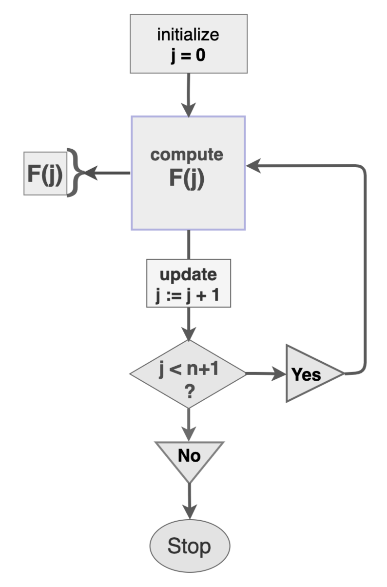
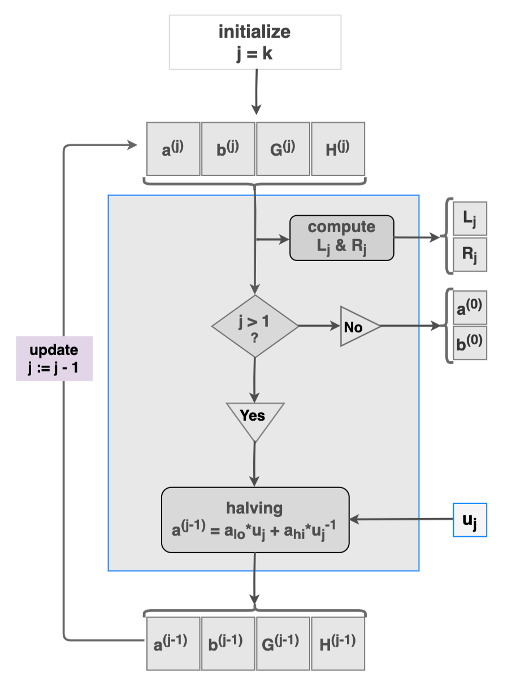
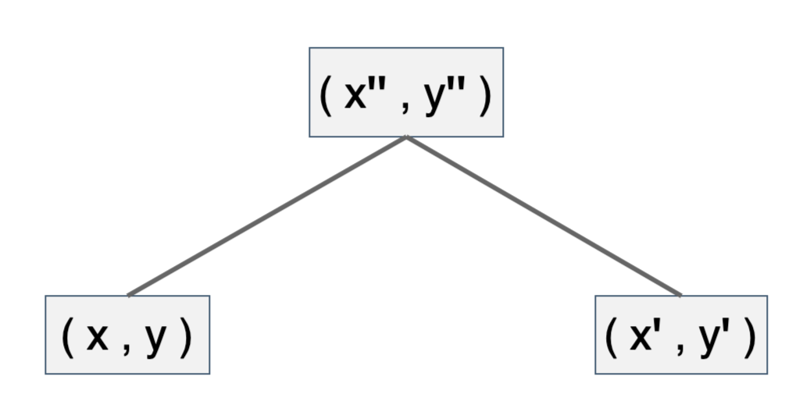

# Amortization of Bulletproofs Inner-product Proof 

- [Introduction](#introduction) 
- [Notation and Assumptions](#notation-and-assumptions)
- [Zero-knowledge Proofs](#zero-knowledge-proofs) 
- [Bulletproofs Range Proofs](#bulletproofs-range-proofs)
- [What is Recursive Proof Composition?](#what-is-recursive-proof-composition)
  - [Recursive Functions](#recursive-functions)
  - [Recursion in Bulletproofs Inner-product Proof](#recursion-in-bulletproofs-inner-product-proof)
  - [Inductive Proofs](#inductive-proofs) 
- [Verification Amortization Strategies](#verification-amortization-strategies)
  - [Application of Verifiable Computation](#application-of-verifiable-computation)
  - [Incrementally Verifiable Computation](#incrementally-verifiable-computation)
  - [Nested Amortization](#nested-amortization)
- [Amortized Inner-product Proof](#amortized-inner-product-proof) 
  - [Bulletproofs Inner-product Proof Verification](#bulletproofs-inner-product-proof-verification)
  - [Verifiable Computation](#verifiable-computation)
    - [Application 1 - Delegating Inversion of Verifier's Challenges](#application-1---delegating-inversion-of-verifiers-challenges)
    - [Application 2 - Delegating Computation of $G_i$'s Coefficients](#application-2---delegating-computation-of-g_is-coefficients)
  - [Verifier's Test of $G_i$'s Coefficients](#verifiers-test-of-g_is-coefficients)
    - [Properties of $G_i$'s Coefficients](#properties-of-g_is-coefficients)
    - [Test of $G_i$'s Coefficients](#test-of-g_is-coefficients)
  - [Optimizing Prover's Computation of $G_i$'s Coefficients](#optimizing-provers-computation-of-g_is-coefficients)
    - [Naive Algorithm](#naive-algorithm)
    - [Optimized Algorithms](#optimized-algorithms)
  - [Concluding Amortized Inner-product Proof](#concluding-amortized-inner-product-proof) 
- [Application to Tari Blockchain](#application-to-tari-blockchain) 
- [References](#references)
- [Appendices](#appendices)
  - [Appendix A: Optimized Algorithms](#appendix-a-optimized-algorithms) 
    - [Basic Approach](#basic-approach)
    - [Defining Optimized Algorithms](#defining-optimized-algorithms)
      - [Algorithm 1](#algorithm-1)
      - [Algorithm 2](#algorithm-2)
      - [Algorithm 3](#algorithm-3)
      - [Algorithm 4](#algorithm-4)
      - [Example 1 (Algorithm 1 or [A1])](#example-1-algorithm-1-or-a1) 
  - [Appendix B: Proof of Theorem 1 and its Preliminaries](#appendix-b-proof-of-theorem-1-and-its-preliminaries) 
    - [Notation and Definitions](#notation-and-definitions) 
    - [Preliminary Lemmas and Corollaries](#preliminary-lemmas-and-corollaries) 
    - [Proof of Theorem 1](#proof-of-theorem-1) 
- [Contributors](#contributors)

## Introduction 

One of the main attractions of blockchains is the idea of trustlessness. It is aiming at building a network that 
allows every participant to run their own validation should they be in doubt about any given set of transactions. 
Well, this is currently an ideal, especially for blockchains with confidential transactions. One of the reasons for this 
is the current sizes of zero-knowledge proofs. Although much research has focused on reducing the sizes of zero-knowledge 
proofs, seen in the form of zero-knowledge Succinct Non-interactive Argument of Knowledge (zk-SNARKs) [[1]] and 
Bulletproofs [[2]], scalability remains a big challenge. 

Recent efforts in minimizing verification costs have gone the route of recursive proofs. Sean Bowe et al. [[14]] lead 
the pack on recursive proof composition without a trusted setup, with the Halo protocol. Other applications of recursive 
proof composition still rely on some kind of a trusted setup [[3]]. For example, Coda [[4]] and Sonic [[5]] use a Common 
Reference String (CRS) and an updatable structured reference string, respectively. 

Coindesk previously commented that "In essence, Bowe and Co. discovered a new method of proving the validity of 
transactions, while masked, by compressing computational data to the bare minimum" [[6]]. 

For blockchains with confidential transactions such as Mimblewimble, Bulletproofs range proofs are the most crucial 
zero-knowledge proofs involved in validation of blockchain transactions. The bulk of computations in these range proofs 
take place in the Inner-product Proof (IPP).

This report investigates how the innovative amortization strategies of the Halo protocol can be used to 
enhance the Bulletproofs IPP. 

## Notation and Assumptions

The settings and notations used in this report follow the Bulletproofs framework as in the Dalek notes [[7]]. This 
includes the underlying field  $\mathbb{F}_p$, elliptic curve, elliptic curve group, and generators $G$ and $H$. The 
details are not included here, as they have been covered in other Tari Labs University (TLU) reports. 
Note that properties such as completeness, soundness or public coin, and discrete log difficulty, are assumed here. 

Since the Ristretto implementation of the curve25519 is used in the Bulletproofs setting, unless otherwise stated, all 
vectors of size $n$ refer to $n$ 32 bytes. 

## Zero-knowledge Proofs

There are two parties in a zero-knowledge proof: the prover and the verifier. The prover seeks to convince the verifier 
that he or she has knowledge of a secret value $w$, called the *witness*, without disclosing any more information about 
$w$ to the verifier. How does this work?

The prover receives a challenge $x$ from the verifier and:

- makes a commitment $P$ of the witness, which hides the value of $w$; then 
- creates a proof $\pi$ that attests knowledge of the correct $w$. 

The prover sends these two to the verifier, who checks correctness of the proof $\pi$. This means that 
the verifier tests if some particular relation $\mathcal{R}$ between $w$ and $x$ holds true. The proof $\pi$ is deemed 
correct if $\mathcal{R}(x,w) = 1$ and incorrect if $\mathcal{R}(x,w) = 0$. Since the verifier does not know $w$, they 
use some verification algorithm $\mathcal{V}$ such that $\mathcal{V}(x, \pi) = \mathcal{R}(x,w)$. 

The entire research on scalability is in pursuit of such an algorithm $\mathcal{V}$ that is most efficient and secure. 

## Bulletproofs Range Proofs 

The Bulletproofs system provides a framework for building non-interactive zero-knowledge proofs without any need for a 
trusted setup. Also, according to Cathie Yun, "it allows for proving a much wider class of statements than just 
range proofs" [[8]]. 

The Bulletproofs framework uses the *Pedersen commitment scheme*, which is known for its hiding and binding properties. 

A *Pedersen commitment* of a value $v$ is given by $Com(v) = v \cdot B + \tilde{v} \cdot \tilde{B}$, where $B$ and 
$\tilde{B}$ are the generators of the elliptic curve group, and $\tilde{v}$ is a blinding factor [[7]]. 

In a Bulletproofs range proof - 

- A prover, given a challenge $x$ from the verifier: 
  - makes a commitment to a value $v$;
  - creates a proof $\pi$ that attests to the statement that $v \in [0, 2^n)$; 
  - sends the proof $\pi$ to the verifier, without revealing any other information about $v$.  
- A verifier checks if indeed $v$ is non-negative and falls within the interval $v \in [0, 2^n )$. 

The Bulletproofs range proof achieves its goal by rewriting the statement $v \in [0, 2^n)$ in terms of its binary 
vectors, as well as expressing it as a single inner product $t(x) = \langle \mathbf{l}(x), \mathbf{r}(x) \rangle$ 
of specially defined binary polynomial vectors $\mathbf{l}(x)$ and $\mathbf{r}(x)$.

Thus a so-called *vector Pedersen commitment* is also used in these types of proofs, and is defined as follows: 

A *vector Pedersen commitment* of vectors 
 $\mathbf{a}_L$ and $\mathbf{a}_R$ is given by 
 $ Com(\mathbf{a}_L , \mathbf{a}_R ) = \langle \mathbf{a}_L 
  \mathbf{G} \rangle + \langle \mathbf{a}_R , \mathbf{H} \rangle + \tilde{a} \tilde{B} $ 
where $\mathbf{G}$ and $\mathbf{H}$ are vectors of generators of the elliptic curve group [[7]]. 

The major component of a Bulletproofs range proof is no doubt its IPP. This became even more 
apparent when Bootle et al. introduced an IPP that requires only $2log_2(n) + 2$ proof elements instead of $2n$ in [[9]]. 
Henry de Valence of Interstellar puts it this way: 

"The inner-product proof allows the prover to convince a verifier that some scalar is the inner-product of two length-$n$
vectors using $\mathcal{O}(log(n))$ steps, and it’s the reason that Bulletproofs are compact" [[10]]. 

No wonder the Halo creators also looked at the IPP in their amortization strategies, particularly taking advantage of its 
recursive nature. Close attention is therefore given to the IPP as described by Bootle et al. [[9]]. 

## What is Recursive Proof Composition? 

The aim of Recursive Proof Composition is to construct "proofs that verify other proofs" or "proofs that are capable of 
verifying other instances of themselves" [[6]]. These take advantage of the recursive nature of some components of known 
zero-knowledge proofs. 

Before discussing recursive proofs or proof recursion, the recursive function concept and the efficiency of recursive 
algorithms are briefly discussed. The IPP, as used in a Bulletproofs range proof, is given as an example of a 
recursive algorithm. [Figure&nbsp;1](#fig_brf) shows the recursive nature of the IPP, 
and will later be helpful in explaining some of Halo's amortization strategies. 

### Recursive Functions 

Recursion is used to define functions or sequences of values that depict a consistent pattern. When written as a formula, 
it becomes apparent that a $(j-1)$-th member of such a sequence is needed in computing the $j$-th member of the same 
sequence. 

A function $F(x)$ that yields a sequence of values $ F(0) , F(1), ... , F(n)$ for some positive integer $ n $ is a 
recursive function if $F(k) = F(k - 1) + g(k)$ for all  $0 < k \leq n$, where $g(x)$ is some function of $ x $, an 
indeterminate. 

A typical recursive function $F(j)$ for $j \in \\{ 0 , 1 , ... , n \\} $ can be represented in terms of a flow chart, as
shown in [Figure&nbsp;1](#fig_brf), depicting how values of the sequence $F(0) , F(1), ... , F(n)$ are computed. 

<p align="center"><a name="fig_brf"> </a></p>
<div align="center"><b>Figure 1: Recursive Function Flow Chart</b></div> 

In computer programming, algorithms that involve recursive functions are efficiently executed by the use of "for-loops" 
and "while-loops". One can say that computers were made and designed to specifically carry out repetitive computation 
without much error. However, although recursive proof composition is pointedly applicable to recursive algorithms, 
there's more to it than just recursiveness. Proof recursion is not defined by recursiveness, but rather takes advantage 
of it. 

### Recursion in Bulletproofs Inner-product Proof

In Bulletproofs range proofs, a prover commits to a value $v$ and seeks to construct an IPP to the fact 
that $v \in  [ 0 , 2^n ) $. Pedersen commitments are used to keep the value of $v$ confidential, and are expressed as 
inner-products. 

The main recursive part of a range proof is the IPP. The inner-product of two vectors $\mathbf{a}$, $\mathbf{b}$ and the 
associated Pedersen commitment can be expressed as: 

$$
P_k = \langle \mathbf{a} , \mathbf{G} \rangle + \langle \mathbf{b} , \mathbf{H} \rangle + \langle \mathbf{a} ,\mathbf{b} \rangle \cdot Q 
$$

where $\mathbf{a}$ and $\mathbf{b}$ are size-$n$ vectors of scalars in the field $\mathbb{F}_p$, while $\mathbf{G}$ and 
$\mathbf{H}$ are vectors of points in an elliptic curve $\mathbb{E} ( \mathbb{F}_p)$ and $k = log_2(n)$; refer to [[11]]. 

Recursion is seen in a $k-$round non-interactive IPP argument, where these commitments are written in terms of 
challenges $u_k$ sent by the verifier: 

$$
P_{k - 1} = P_k + L_k \cdot u_k^{2} + R_k \cdot u_k^{-2}
$$

where $ L_k $ and $ R_k $ are specifically defined as linear combinations of inner-products of vectors that are half the 
size of vectors in the $k - 1$ round. 

In the IP proof, the prover convinces the verifier of the veracity of the commitment $P_k$ by sending only $k = log(n)$ 
pairs of values $L_j$ and $R_j$, where $j \in \\{ 1, 2, 3, ... , k \\}$.  
It is due to this recursion that Bootle et al. [[9]] reduced the previous complexity of zero-knowledge proofs from 
$O(\sqrt{n})$ to $O(log(n))$. 

Refer to [Figure&nbsp;2](#fig_ipprs) for an overview of the prover's side of the IPP. 

The input to the IPP is the quadruple of size $ n = 2^k $ vectors 

$$
\big( \mathbf{a}^{(j)} , \mathbf{b}^{(j)} , \mathbf{G}^{(j)} , \mathbf{H}^{(j)} \big)​
$$

which is initially 

$$
\big( \mathbf{a} , \mathbf{b} , \mathbf{G} , \mathbf{H} \big) ​
$$

However, when $j < k$, the input is updated to 

$$
\big(\mathbf{a}^{(j-1)}, \mathbf{b}^{(j-1)}, \mathbf{G}^{(j-1)},\mathbf{H}^{(j-1)} \big)​
$$

quadruple vectors each of size $2^{k-1}$, where 

$$
\mathbf{a}^{(j-1)} = \mathbf{a}\_{lo} \cdot u\_j + \mathbf{a}\_{hi} \cdot u\_j^{-1} ​\\\\ 
\mathbf{b}^{(j-1)} = \mathbf{b}\_{lo} \cdot u\_j^{-1} + \mathbf{b}\_{hi} \cdot u\_j​ \\\\
\mathbf{G}^{(j-1)} = \mathbf{G}\_{lo} \cdot u\_j^{-1} + \mathbf{G}\_{hi} \cdot u\_j​ \\\\ 
\mathbf{H}^{(j-1)} = \mathbf{H}\_{lo} \cdot u\_j  + \mathbf{H}\_{hi} \cdot u\_j^{-1} \\\\ 
$$

and $u_k$ is the verifier's challenge. The vectors

$$
\mathbf{a}\_{lo}, \mathbf{b}\_{lo}, \mathbf{G}\_{lo}, \mathbf{H}\_{lo}​ \\\\
\mathbf{a}\_{hi}, \mathbf{b}\_{hi}, \mathbf{G}_{hi}, \mathbf{H}\_{hi} ​
$$

are the left and the right halves of the vectors

$$
\mathbf{a}, \mathbf{b}, \mathbf{G}, \mathbf{H}​
$$

respectively. 

<p align="center"><a name="fig_ipprs"> </a></p>
<div align="center"><b>Figure 2: Inner-product Proof - Prover Side </b></div> 

[Figure&nbsp;2](#fig_ipprs) is included here not only to display the recursive nature of 
the IPP, but will also be handy and pivotal in understanding amortization strategies that will be applied to the IPP. 

### Inductive Proofs 

As noted earlier, "for-loops" and "while-loops" are powerful in efficiently executing repetitive computations. However, 
they are not sufficient to reach the level of scalability needed in blockchains. The basic reason for this is that the 
iterative executions compute each instance of the recursive function. This is very expensive and clearly undesirable, 
because the aim in blockchain validation is not to compute every instance, but to prove that the current instance was 
correctly executed. 

[Figure&nbsp;3](#fig_rfrb) shows how instances of a recursive function are linked, the same way each block in a blockchain 
is linked to the previous block via hash values. 

<p align="center"><a name="fig_rfrb"> </a></p>
<div align="center"><b>Figure 3: Recursive Function Resembles Blockchain </b></div> 

The amortization strategy used by recursive proof composition or proof recursion is based on the old but powerful 
mathematical tool called the *Principle of Mathematical Induction*, which dates back to the sixteenth century [[12]]. 

Suppose one has to prove that a given sequence of values $ F(0) , F(1), ... , F(n)$ are correct instances of a recursive 
function $F(n) = F(n - 1) + g(n)$ for all positive integer $ n $ and $g(n)$ some function. 

According to the *Principle of Mathematical Induction*, it is sufficient to prove the above statement in the following 
two steps: 

- (Base step): Prove that the first possible instance $F(0)$ is correct. 

- (Inductive step): For any integer $ k > 0 $, prove that "if the previous instance $F(k - 1)$ is correct, then the 
current instance $F(k)$ is also correct", i.e. prove that  "$F(k - 1)$ is correct" implies "$F(k)$ is also correct". 

These two steps together are sufficient to form a complete proof for the verifier to be convinced. Such a proof is valid 
even if the current instance is the zillionth. This saves the verifier the trouble of checking every instance of the 
function  $F(n)$. 

Michael Straka describes a similar inductive proof, which he refers to as "proof recursion" [[13]]. His explanation of 
the simplest case that a recursive proof will prove a relation $\mathcal{R}$ inductively, is as follows: 

The verifier has: 

- a “base” proof $\pi_0$, which attests to the prover knowing some input $( x_0 , w_0 )$, such that 
  $\mathcal{R}( x_0 ,w_0 ) = 1$. 
- the proof $\pi_n$ for any $n>0$ will then prove that the prover knows $( x_n , w_n )$, such that 
  $\mathcal{R}(x_n , w_n ) = 1$ and that a proof $\pi_{n-1}$ was produced, attesting to the knowledge of 
  $(x_{n−1} , w_{n−1})$. 

[Figure&nbsp;4](#fig_prms) illustrates the above proof: 

<p align="center"><a name="fig_prms"> </a></p>
<div align="center"><b>Figure 4: Proof Recursion Diagram [<a href="https://www.michaelstraka.com/posts/recursivesnarks/" title="Recursive Zero-knowledge 
Proofs: A Comprehensive Primer">13</a>] </b></div>


Straka continues to explain how an arithmetic circuit for the verifier could be built in order to carry out the above 
proof. Such a circuit $\mathcal{C}$ would either verify $\mathcal{R}( x_0 , w_0 ) = 1$ (for the base case) or 
verify $\mathcal{R}( x_i , w_i ) = 1$ and then check $\mathcal{V}( x_{i - 1} , π_{i−1} ) = 1$ [[13]].

Proof systems that use this type of inductive proof for verification solve the blockchain's distributed validation 
problem. A participant in the blockchain network only needs to download the current state of the network as well as a 
single proof that this state is correct.

Recursive proof composition is described in [[14]] as "proofs that can feasibly attest to the correctness of other 
instances of themselves". 

## Verification Amortization Strategies 

Only a few amortization strategies in the literature are used to achieve proper recursive proof composition. This report
focuses on those that Bowe et al. [[14]] used in the Halo protocol. 

### Application of Verifiable Computation

Verifiable computation is used for the delegation of computations to an untrusted third party (or at times, the prover) 
who returns: 

- the result $z$ of the computation; and 
- a cryptographic proof $\pi_z$ that the result is correct. 

The ideal property of such a proof $\pi_z$ is *succinctness*, which means the proof $\pi_z$ must be asymptotically 
smaller and less expensive to check than the delegated computation itself [[14]].  

### Incrementally Verifiable Computation

The idea here is to attest to the validity of a previous proof in addition to application of verifiable computation. The 
best thing about this amortization strategy is that one proof can be used to inductively demonstrate the correctness of 
many previous proofs. 

Then, any participator in a blockchain network who wishes to validate the current state of the chain, need only 
download two things: 

- the current state of the chain network; and 
- a single proof that this state is correct.  

Any further proofs of state changes in a blockchain can be constructed with the latest proof alone, allowing active 
participants to prune old state changes [[14]]. 

Thus, with incrementally verifiable computation, a large and virtually unbounded amount of computation can be verified 
with a single proof, and with this proof alone, the computation can be extended to further proofs. 

Due to this strategy, by "allowing a single proof to inductively demonstrate the correctness of many previous proofs" 
[[14]], Halo achieves better scalability than most known SNARKs constructions.

### Nested Amortization 

This strategy can be used as part of the above two amortization strategies. 

Whenever the verifier has to compute an expensive fixed operation $F$ that is invoked with some input $x$, the prover is 
allowed to witness $y = F(x)$ and send the pair $(x, y)$ to the verifier. The verification circuit takes $(x, y)$
as a public input. "The circuit can then proceed under the assumption that $y$ is correct, delegating the responsibility 
of checking the correctness of $y$ to the verifier of the proof" [[14]]. 

Now, increasing instances of $( x , y )$ will accumulate as proofs are continually composed, simply because the 
verification circuit will not check these proofs, but rather continually delegate the checking to its verifier. 
The problem here is that computational cost will escalate. 

It is here that the amortization strategy of *collapsing computations* is needed: 

- given instances $( x , y )$ and $( x′ , y′ )$, the prover will provide a non-interactive proof $\pi_{y,y'}$ that 
$y = F(x)$ and $y' = F(x')$ as a witness to the verification circuit; and 
- the verification circuit will check  $\pi_{y,y'}$ proof.

If the cost of checking the correctness of $\pi_{y,y'}$ is equivalent to invoking the operation $F$, then the verifier 
will have collapsed the two instances $( x , y )$ and $( x' , y' )$ into a single fresh instance $( x'' , y'' )$, as 
shown in [Figure&nbsp;5](#fig_cc). This is how the cost of invoking $F$ can be amortized. 

<p align="center"><a name="fig_cc"> </a></p>
<div align="center"><b>Figure 5: Collapsing Computations </b></div>

Therefore, a nested amortization is achieved on the instances of a binary tree of accumulated instances, helping to 
reduce verification costs of the final single proof from linear time to sub-linear marginal verification time. 

As mentioned above, the aim of Recursive Proof Compositions is two-pronged: construction of "proofs that verify other 
proofs" and construction of "proofs that are capable of verifying other instances of themselves" [[6]]. The discussion 
in this report focuses on the latter, while the former will be part of forthcoming reports, as it 
requires delving into understanding cycles of elliptic curves. 

## Amortized Inner-product Proof

One application of the amortization strategies discussed thus far, is the Bulletproofs IPP. The aim here is to 
investigate how much significance these strategies bring to this powerful and pervasive proof, especially in blockchain 
technology, where efficiency of zero-knowledge proof is pursued.

### Bulletproofs Inner-product Proof Verification

Consider the Bulletproofs IPP, originally described by Bootle et al. [[9]], but following the Dalek's Bulletproofs 
settings [[11]]. The IPP is no doubt recursive in the way in which it is executed. 
[Figure&nbsp;2](#fig_ipprs) and [Figure&nbsp;6](#fig_bpippvs) make this apparent. It is therefore the most relevant case study in amortizing verification 
costs, especially in the context of recursive proofs. 

Figure 6 shows a naive implementation of the verifier's side of the Bulletproofs IPP.  

<p align="center"><a name="fig_bpippvs"> </a></p>
<div align="center"><b>Figure 6: Bulletproofs Inner-product Proof - Verifier Side </b></div>

### Verifiable Computation

#### Application 1 - Delegating Inversion of Verifier's Challenges

One of the details omitted from [Figure&nbsp;6](#fig_bpippvs) is the computation of inverses 
of the verifier's challenges $u_j$ needed to complete verification. The verifier, for example, needs $u_j^{-2}$ in order 
to compute $- L_j \cdot u_j^2 - R_j \cdot u^{-2}$. Verifiable computation strategy is therefore applicable to the IPP, 
where the verifier delegates inversion of challenges to the prover. 

As Bowe et al. [[14]] proposed, in arithmetic circuits where a field inversion of a variable $u$ can be computed, i.e. 
$u^{p−2}$, which would normally require $log(p)$ multiplication constraints, the prover could witness $v = u^{− 1}$ 
instead [[3]]. The verifier could then simply check if $uv = 1$, taking only a single multiplication constraint. 
Thus one trades $log(p)$ multiplication constraints for only one. 

Therefore, to amortize some verification costs, the prover in the Bulletproofs IPP is requested to compute each $u_j^{- 1}$ 
and send it to the verifier. That is in addition to values $L_j$ and $R_j$ for $j \in \\{ 1, 2 , ... , log_2(n) \\}$. 

Worth noting is that the prover will have computed these inverses anyway, because they need them in "halving" of the 
input vectors to the IPP. The delegation of inversion therefore comes with *no extra cost* to the prover. 

This amortization strategy has huge savings on verification costs in the form of the number of multiplications by the 
verifier. Instead of a verification cost of $(log(p))\*(log_2(n))$ multiplication constraints on inversion alone, it will 
now only cost $log_2(n)$ multiplication constraints for a single IPP. The savings are huge considering the fact that 
$n$, which is the size of the initial input vectors to the IPP, is typically very small compared to $p$, the prime order 
of the elliptic curve group. 

As noted earlier, this amortization strategy reduces the verification costs by factor of $log(p)$. 

#### Application 2 - Delegating Computation of $G_i$'s Coefficients

Consider the vector of group-generators $\mathbf{G} = ( G_0 , G_1 , G_2 , ... , G_{n-1} )$, one of the four initial 
input vectors to the IPP. In verifying the prover's IPP, the verifier has to compute the vector 
$\mathbf{s} = ( s_0 , s_1 , s_2 , ... , s_{(n-1)} )$, where each $s_i = \prod\limits_{j = 1}^k u_j^{b(i,j)}$ is the 
so-called coefficient of $G_i$, while $j \in \\{ 1 , 2 , 3 , ... , k \\}$  with  $k = log_2(n)$. Refer to 
[Figure&nbsp;6](#fig_bpippvs). Note that

$$
b(i,j) = \begin{cases} {-1} & {\text{if}\ \  (i\ \ mod\ \ 2^j) < 2^{j-1}}  \\\  {+1} & {\text{if}\ \ (i\ \ mod\ \ 2^j) \geq  2^{j-1}} \end{cases}
$$

determines whether the factor multiplied into  $s_i$  is the verifier's challenge $u_j$ or its inverse.  

Computations of these coefficients can be delegated to the prover or some third party called the "helper". In this application these coefficients are delegated to the helper, and this means the verifier will need a way to test if the values the helper sends are correct. Thus a verifiable computation is created in the next subsection. Since each of these coefficients is a product of field elements, they have strong algebraic 
properties that can be exploited in two ways:

- Firstly, the verifier can use these properties to check if the $s_i$'s were correctly computed by the helper.
- Secondly, they can be used to minimize the prover's computational costs. 

### Verifier's Test of $G_i$'s Coefficients

#### Properties of $G_i$'s Coefficients

Note that the verifier has to compute the values $u_j^2$  and $u_j^{-2}$ for all $j \in \\{ 1, 2, 3, ... , k \\}$. 

The 
idea here is to use a verifier's test that involves these squares of the challenges and their inverses. The next theorem 
describes such relationships between these squares and the coefficients $s_i$. 

**Theorem 1 (Some properties of the set of coefficients $\{ s_i \}$)** 

Let $n = 2^k$ and $s_i = \prod\limits_{j = 1}^k u_j^{b(i,j)}$ for all $j \in \\{ 1, 2, 3, ... , k \\}$, where each $G_i$ 
is the $i-$th component of the initial input vector $\mathbf{G} = ( G_0 , G_1 , G_2 , ... , G_{n-1})$, then: 

1.	$\ \ s_i \cdot s_{(n-1) - i} = 1_{\mathbb{F}\_p}$ for all  $i \in  \\{ 0, 1, 2, ... , n-1 \\}$.

1.	$\ \ s_{2^{(j-1)}} \cdot s_{n-1} = u\_j^2 $ for all  $j \in \\{ 1, 2, 3, ... , k \\}$.

1.	$\ \ s_0 \cdot s_{(n-1) - 2^{(j-1)}} = u\_j^{-2} $ for all  $j \in \\{ 1, 2, 3, ... , k \\}$. 

The proof of Part (1) of Theorem 1 follows by induction on the size $n$ of the initial input vector 
$\mathbf{G} = ( G_0 , G_1 , G_2 , ... , G_{n-1} )$ to the IPP, while parts (2) and (3) follow by induction on $k$. 
[Appendix B](#appendix-b-proof-of-theorem-1-and-its-preliminaries) contains full details of the proof.


#### Test of $G_i$'s Coefficients

The verifier tests the correctness of the coefficients $s_i$ with the following statement: 

$$
(s_{1} \cdot s_{n-1}  = u_1^2) \land (s_{2} \cdot s_{n-1} = u_2^2) \land (s_{4} \cdot s_{n-1}  = u_3^2) \land\ \dots \ \land (s_{2^{(k-1)}} \cdot s_{n-1}  = u_k^2) \land \\\\ 
(s_0 \cdot s_{(n-1) - 2^{(0)}}  = u_1^{-2}) \land (s_0 \cdot s_{(n-1) - 2^{(1)}}  = u_2^{-2}) \land\ \dots \ \land (s_0 \cdot s_{(n-1) - 2^{(k-1)}}  = u_k^{-2})  \land \\\\ 
( s_{r_1} \cdot s_{(n-1) - {r_1}}  = 1_{\mathbb{F}\_p} ) \land (s_{r_2} \cdot s_{(n-1) - {r_2}}  = 1_{\mathbb{F}\_p}) \land (s_{r_3} \cdot s_{(n-1) - {r_3}}  = 1_{\mathbb{F}\_p}) \land\ \dots \ \land (s_{r_k} \cdot s_{(n-1) - r_k}  = 1_{\mathbb{F}\_p})  
$$

for randomly sampled values $ \\{r_1, r_2, ... , r_k \\} \subset \\{0, 1, 2, ... , n-1 \\} $ where $k = log_2(n)$. 

The multiplication cost of the *Test of $G_i$'s Coefficients* as stated above is sub-linear with respect to $n$, costing the verifier only $3log(n)$ multiplications. That's because all three parts of Theorem 1 are tested. However, it would still suffice for the verifier to test only two out of the three parts of Theorem 1, reducing the cost to $2log(n)$. 

Note that the values of the coefficients $s_i$ and the squares $u_j^2$ and $u_j^{-2}$ do not exist by default nor are they automatically computed in the Bulletproofs system. In fact, according to Dalek's internal documents on the Inner-product Proof [[7]], specifically under [Verification equation](https://doc-internal.dalek.rs/bulletproofs/inner_product_proof/index.html#verification-equation), these values can be provided by the system. Either way, these values need to be computed. The next subsection therefore focuses on optimising the computations of the $s_i$'s. 

### Optimizing Prover's Computation of $G_i$'s Coefficients

#### Naive Algorithm

The naively implemented computation of the coefficients $s_i$, as depicted in 
[Figure&nbsp;6](#fig_bpippvs), is very expensive in terms of the number of multiplications. 

The naive algorithm codes computation of the coefficients $s_i = \prod\limits_{j = 1}^k u_j^{b(i,j)}$ 
by cumulatively multiplying the correct factor $u_j^{b(i,j)}$ in each $j-$th IPP round, running from $k = log_2(n)$ down 
to $1$. 

That is, although recursive according to the nature of the IPP, the naive implementation strictly follows the definition
without any attempt to optimize.  

```text
**Naive Algorithm**

%initialize
s[n] = [1,1,1, ... ,1];
k = log_2(n);
%running inside IPP
int main() {
​     for (j = k; j > 0; j--) {
​        for (i = 0; i < n; i++) {
​            s[i] = s[i]*(u_j)^{b(i,j)};
​        }
​    }

return = 0; 
}
```

Using the naive algorithm, an input vector $\mathbf{G}$ to the IPP of size $n$, costs the verifier $n*\[ log_2(n) - 1 \]$ 
multiplications. If $n = 256$, the cost is $1,792$. This is rather expensive irrespective of whether the $s_i$'s are computed by a third party or by the proof system.  

#### Optimized Algorithms 

At least four competing algorithms optimize computation of the coefficients $\{ s_i \}$. Each one is far much better than 
the naive algorithm. 

The basic optimization strategy is based on the observation that every coefficient has at least one common factor with 
$2^{k-1}- 1$ other coefficients, two common factors with $2^{k-2}-1$ other coefficients, three common factors with 
$2^{k-3}- 1$ other coefficients, and so on. It is therefore cost-effective in terms of the number of multiplications to 
aim at computing these common factors and only form the required coefficients later.

```text
**Typical Optimized Algorithm**

%initialize
s[n] = [1,1,1, ... ,1];
k = log_2(n);
%running inside IPP 
int main() {
    s[0] = u_k^{-1};  s[2^{k-1}] = u_k;
​    s[2^{k-2}] = s[0]; s[2^{k-1} + 2^{k-2}] = s[2^{k-1}];
​    for (j = k - 1; j > t; j--) {
​        for (i = 0; i < n; i++) {
​            if (i mod 2^j == 0) {
​                s[i] = s[i]*(u_j)^{b(i,j)};
​                l = i + 2^(j-1);
                s[l] = s[l]*(u_j^{b(l,j)};
​            }
​        }
​    }
    return = 0;
}
```


The value t in the first for-loop can be varied in order to form either products of two or three or four, and so on. 
The optimization of these algorithms depends on whether they only form "doubles" or "triples" or "quadruples", and how 
they form them. Unlike the naive algorithm, which keeps spending multiplication disregarding the existence of common 
factors among the coefficients $s_i$, the optimized algorithms use multiplication only if the new product formed is 
unique. 

Since the multiplication cost of the naive algorithm is ludicrously expensive, it will not be used as a point of reference. No programmer would implement the computation of the $s_i$'s using the naive algorithm. So instead, a minimally optimized algorithm called **Algorithm 0** or [A0] will henceforth be the yardstick. 

In terms of the pseudo-code of a *Typical Optimized Algorithm* given above, algorithm [A0] is defined by setting 't = 0'. That means, [A0] aims at computing the largest possible and distinct products as soon as the new challenge $u_j$ is received from the verifier. 

[Table 1](#tab_cmc) gives the multiplication cost of [A0] together with 
other four optimised algorithms. [Appendix A](#appendix-a-optimized-algorithms) contains full descriptions of these algorithms, which 
are simply referred to as Algorithm 1 or [A1], Algorithm 2 or [A2], Algorithm 3 or [A3] and 
Algorithm 4 or [A4]. 

<div align="center"><a name="tab_cmc"> </a><b>Table 1: Comparison of Multiplication Costs </b></div>  

| Vector Size $n$ | [A0]   | [A1]   | [A2]   | [A3]   | [A4]   | Best Algo & <br> Savings % <br> Relative to [A0]   |
|--:--------------|--:-----|--:-----|--:-----|--:-----|--:-----|--:-----------------------------------------------|
| $n = 4$         | $4$    | $4$    | $4$    | $4$    | $4$    | [All]  0%                                        |
| $n = 8$         | $12$   | $12$   | $12$   | $12$   | $12$   | [All]  0%                                        |
| $n = 16$        | $28$   | $28$   | $28$   | $24$   | $24$   | [A3,A4] 14.29%                                   |
| $n = 32$        | $60$   | $48$   | $60$   | $48$   | $56$   | [A1,A3] 20%                                      |
| $n = 64$        | $124$  | $88$   | $96$   | $92$   | $92$   | [A1] 29.03%                                      |
| $n = 128$       | $252$  | $168$  | $168$  | $164$  | $164$  | [A3, A4] 34.92%                                  |
| $n = 256$       | $508$  | $316$  | $312$  | $304$  | $304$  | [A3, A4] 40.16%                                  |
| $n = 512$       | $1020$ | $612$  | $600$  | $584$  | $816$  | [A3] 42.75%                                      |
| $n = 1024$      | $2044$ | $1140$ | $1144$ | $1140$ | $1332$ | [A1,A3] 44.23%                                   |
| $n = 2048$      | $4092$ | $2184$ | $2244$ | $2234$ | $2364$ | [A1] 46.63%                                      |
| $n = 4096$      | $8188$ | $4272$ | $4436$ | $4424$ | $4424$ | [A1] 47.83%                                      |


All four optimized algorithms, [A1], [A2], [A3] and [A4], are fairly competent in saving multiplication costs, showing more than 
20\% savings for vectors of sizes 64 and above. 

The above results indicate that algorithm [A1] is the best of the four for several reasons: 

- It is the second most frequent winner in all 11 cases investigated, with a score of 7 out of 11.

- In order to account for the other four cases; it takes second place twice and third place twice. 

- It has the best savings percentage of 47.83\% relative to [A0].   

- The only three cases in which it is on par with the minimally optimized algorithm [A0] is when all other algorithms are on par; i.e. when 
$n = 4$ and $n = 8$; as well as when the best optimized algorithm saves a mere $4$ multiplications. 

### Concluding Amortized Inner-product Proof

The amortization strategies herein applied to the Bulletproofs IPP are tangible and significantly enhance the proof. 
With the above amortization of the IPP, the prover sends $3log_2(n)$ IPP elements, i.e. the set of all $log_2(n)$ 
triples $L_j$, $R_j$ and $u^{-1}$. The $n$ coefficients $s_i$'s will either be sent by the third-party helper or provided by the system according to Dalek's internal documents. See IPP's [Verification equation](https://doc-internal.dalek.rs/bulletproofs/inner_product_proof/index.html#verification-equation) in [[7]]. 

The given verifier's test of the $G_i$'s coefficients and the optimization of their computations solidify the proposed 
amortization of the IPP. Given the Bulletproofs setting, that a vector of size $n$ refers to $n$ number of 32-byte 
values, even seemingly small savings are significant. 

## Application to Tari Blockchain 

This report not only explains the often obscured parts of the IPP mechanism, but also succeeds in bringing this powerful 
proof as close as possible to practicality.  

The amortized IPP as discussed above does not veer off the Dalek's Bulletproofs setting, which is preferred for the Tari 
blockchain. 

These amortization strategies, though minimal in the changes they bring into the IPP to which we are accustomed, have 
huge savings for the verification costs, cutting down on the number of multiplications by a factor of $log(p)$, where 
the prime $p$ is deliberately chosen to be very large. 

The amortized IPP lends itself to implementations of any zero-knowledge proof that involves inner-products, especially 
in the Bulletproofs framework. 

## References 

[[1]] H. Wu, W. Zheng, A. Chiesa, R. A. Popa and I. Stoica, "DIZK: A Distributed Zero Knowledge Proof System", 
UC Berkeley [online]. Available: <https://www.usenix.org/system/files/conference/usenixsecurity18/sec18-wu.pdf>. 
Date accessed: 2019&#8209;12&#8209;07. 

[1]: https://www.usenix.org/system/files/conference/usenixsecurity18/sec18-wu.pdf "DIZK: A Distributed 
Zero Knowledge Proof System"

[[2]] B. Bünz, J. Bootle, D. Boneh, A. Poelstra, P. Wuille and G. Maxwell, "Bulletproofs: Short Proofs for Confidential 
Transactions and More" [online]. Blockchain Protocol Analysis and Security Engineering 2018. 
Available: <http://web.stanford.edu/~buenz/pubs/bulletproofs.pdf>. Date accessed: 2020&#8209;04&#8209;21. 

[2]: &lt;http://web.stanford.edu/~buenz/pubs/bulletproofs.pdf&gt; "Bulletproofs: Short Proofs for 
Confidential Transactions and More"

[[3]] ECC Posts, "Halo: Recursive Proof Composition without a Trusted Setup" [online]. Electric Coin Co., September 2019.
Available: <https://electriccoin.co/blog/halo-recursive-proof-composition-without-a-trusted-setup/>. Date accessed: 2020&#8209;04&#8209;24. 

[3]: https://electriccoin.co/blog/halo-recursive-proof-composition-without-a-trusted-setup/ "Halo: Recursive Proof 
Composition without 
a Trusted Setup"

[[4]] I. Meckler and E. Shapiro, "Coda: Decentralized Cryptocurrency at Scale" [online]. O(1) Labs, 2018&#8209;05&#8209;10. 
Available: <https://cdn.codaprotocol.com/v2/static/coda-whitepaper-05-10-2018-0.pdf>. Date accessed: 2020&#8209;04&#8209;27. 

[4]: https://cdn.codaprotocol.com/v2/static/coda-whitepaper-05-10-2018-0.pdf "Coda: Decentralized Cryptocurrency at 
Scale"

[[5]] M. Maller, S. Bowe, M. Kohlweiss and S. Meiklejohn, "Sonic: Zero-knowledge SNARKs from Linear-size Universal and 
Updatable Structured Reference Strings" [online]. Proceedings of the 2019 ACM SIGSAC Conference on Computer and 
Communications, 2019. Available: <https://eprint.iacr.org/2019/099.pdf>. Date accessed: 2020&#8209;04&#8209;27. 

[5]: https://eprint.iacr.org/2019/099.pdf "Sonic: Zero-knowledge SNARKs 
from Linear-size Universal 
and Updatable Structured Reference Strings"

[[6]] W. Foxley, "You Can Now Prove a Whole Blockchain With One Math Problem – Really" [online]. Coindesk, 2019. 
Available: <https://www.coindesk.com/you-can-now-prove-a-whole-blockchain-with-one-math-problem-really>. Date accessed: 2020&#8209;04&#8209;27. 

[6]: https://www.coindesk.com/you-can-now-prove-a-whole-blockchain-with-one-math-problem-really "You Can Now Prove 
a Whole Blockchain With 
One Math Problem – Really"

[[7]] Dalek's Bulletproofs documents, "Module Bulletproofs::notes ::index" [online]. 
Available: <https://doc-internal.dalek.rs/bulletproofs/inner_product_proof/index.html>. Date accessed: 2020&#8209;05&#8209;01.

[7]: https://doc-internal.dalek.rs/bulletproofs/inner_product_proof/index.html "Module Bulletproofs::notes ::index"

[[8]] C. Yun, "Building on Bulletproofs" [online]. Available: <https://medium.com/@cathieyun/building-on-bulletproofs-2faa58af0ba8>.
Date accessed: 2020&#8209;04&#8209;27.

[8]: https://medium.com/@cathieyun/building-on-bulletproofs-2faa58af0ba8 "Building on Bulletproofs"

[[9]] J. Bootle, A. Cerulli, P. Chaidos, J. Groth and C. Petit, "Efficient Zero-knowledge Arguments for Arithmetic 
Circuits in the Discrete Log Setting" [online]. Annual International Conference on the Theory and Applications of 
Cryptographic Techniques, pp. 327&#8209;357. Springer, 2016. Available: <https://eprint.iacr.org/2016/263.pdf>. 
Date accessed: 2019&#8209;12&#8209;21. 

[9]: https://eprint.iacr.org/2016/263.pdf "Efficient Zero-knowledge Arguments 
for Arithmetic Circuits in 
the Discrete Log Setting"

[[10]] H. de Valence, "Merlin: Flexible, Composable Transcripts for Zero-knowledge Proofs" [online]. Available: 
<https://medium.com/@hdevalence/merlin-flexible-composable-transcripts-for-zero-knowledge-proofs-28d9fda22d9a>. 
Date accessed: 2019&#8209;12&#8209;21. 

[10]: https://medium.com/@hdevalence/merlin-flexible-composable-transcripts-for-zero-knowledge-proofs-28d9fda22d9a "Merlin: Flexible, Composable 
Transcripts for 
Zero-knowledge Proofs"

[[11]] Dalek's Bulletproofs documents, "Module Bulletproofs:: notes :: index" [online]. Available: 
<https://doc-internal.dalek.rs/bulletproofs/notes/inner_product_proof/index.html>. Date accessed: 2020&#8209;04&#8209;27. 

[11]: https://doc-internal.dalek.rs/bulletproofs/notes/inner_product_proof/index.html "Module Bulletproofs:: notes :: inner-product-proof"

[[12]] History of Science and Mathematics Beta, "Who Introduced the Principle of Mathematical Induction for the First 
Time?" [online]. Available: <https://hsm.stackexchange.com/questions/524/who-introduced-the-principle-of-mathematical-induction-for-the-first-time>. 
Date accessed: 2020&#8209;04&#8209;30. 

[12]: https://hsm.stackexchange.com/questions/524/who-introduced-the-principle-of-mathematical-induction-for-the-first-time "Who Introduced the Principle 
of Mathematical Induction 
for the First Time?"

[[13]] M. Straka, "Recursive Zero-knowledge Proofs: A Comprehensive Primer" [online], 2019&#8209;12&#8209;08. Available: 
<https://www.michaelstraka.com/posts/recursivesnarks/>. Date accessed: 2020&#8209;04&#8209;30. 

[13]: https://www.michaelstraka.com/posts/recursivesnarks/ "Recursive Zero-knowledge 
Proofs: A Comprehensive Primer"

[[14]] S. Bowe, J. Grigg and D. Hopwood, "Recursive Proof Composition without a Trusted Setup" [online]. Electric Coin 
Company, 2019. Available: <https://eprint.iacr.org/2019/1021.pdf>. Date accessed: 2020&#8209;04&#8209;24. 

[14]: https://eprint.iacr.org/2019/1021.pdf "Recursive Proof Composition 
without a Trusted Setup"

# Appendices

## Appendix A: Optimized Algorithms 

The naive algorithm codes computation of the coefficients $s_i = \prod\limits_{j = 1}^k u_j^{b(i,j)}$ 
by cumulatively multiplying the correct factor $u_j^{b(i,j)}$ in each $j-$th round of the IPP, running from 
$k = log_2(n)$ to $1$. 


This appendix contains details of the algorithms investigated to optimize computations of the coefficients 
$\{ s_i \}$ of $G_i$ the component of the vector input to the IPP, $\mathbf{G} = (G_0 , G_1 , G_2 , ... , G_{n-1})$. 

#### Basic Approach

The basic approach to the formulation of efficient and cost-saving algorithms is as follows: 

- Each algorithm aims at reducing verification costs in terms of the number of multiplications. 

- Each algorithm takes advantage of the fact that each coefficient has common sub-products with other $2^{k-2}$ 
  coefficients. 

- The intermediate values of the coefficients are not used anywhere in the IPP. Only the final values made up of all 
$k$ factors $u_j^{b(i,j)}$. Hence their sub-products can be separately computed and only put together at the end of the 
IPP's $k-$th round. 

- Due to the algebraic structure of the sets of coefficients, they can be systematically computed. Note specifically 
  that each 
  
  $$
  s_i\ \ =\ \ \prod\limits_{j = 1}^k u_j^{b(i,j)}\ \ =\ \ u_k^{b(i,k)} \cdot u_{k-1}^{b(i,k-1)} \cdot\ \ ...\ \ \cdot u_2^{b(i,2)} \cdot u_1^{b(i,1)}
  $$
  
  corresponds to a $k-$tuple of field elements
  
  $$
  \Big( u_k^{b(i,k)}, u_{k-1}^{b(i,k-1)}, ... , u_2^{b(i,2)}, u_1^{b(i,1)}\Big)\ \ \in\ \ \mathbb{F}_p^k
  $$

Hence sub-products such as $\ \ u_4^{b(i,4)} \cdot u_{3}^{b(i,3)} \ \ $ or 
$\ \ u_{10}^{b(i,10)} \cdot u_{9}^{b(i,9)} \cdot u_{8}^{b(i,8)}\ \ $ or 
$\ \ u_{4}^{b(i,4)} \cdot u_{3}^{b(i,3)} \cdot u_{2}^{b(i,2)} \cdot u_{1}^{b(i,1)}\ \ $ are herein referred to as "doubles" or 
"triples" or "quadruples", respectively.

#### Defining Optimized Algorithms

Since the main strategy in using these algorithms is to avoid insisting on immediate updates of the values $s_i$, they 
differ in their scheduling of when "doubles" or "triples" or "quadruples" are computed. Note that "distinct" 
sub-products refers to those sub-products with no common factor. 

##### Algorithm 1

This algorithm computes new distinct doubles as soon as it is possible to do so. These new doubles are 
turned into triples in the next immediate IPP round. This process is repeated until all IPP rounds are completed. Only 
then are next larger-sized sub-products computed, but consumption of the smallest existing "tuples" is given priority. 

```text
**Algorithm 1 or [A1]**

%initialize
s[n] = [1,1,1, ... ,1];
k = log_2(n);
%running inside IPP
int main() { 
  ​  s[0] = u_k^{-1};
    s[2^{k-1}] = u_k;
​    s[2^{k-2}] = s[0]; 
    s[3*2^{k-2}] = s[2^{k-1}];
​    t = k-3;
​    for (j = k - 1; j > t; j--) {
    ​    for (i = 0; i < n; i++) {
    ​        if ( i mod 2^j == 0 ) {
          ​      s[i] = s[i]*(u_j)^{b(i,j)};
           ​     l = i + 2^(j-1); 
           ​     s[l] = s[l]*(u_j^{b(l,j)};
         ​   } 
        } 
    } 
    %if k-3 > 0, then the program proceeds as follows:
​    s[1] = u_{k-3}^{-1}; 
    s[1+2^{k-4}] = u_{k-3}; 
​    s[1+2^{k-1}] = s[1]; 
    s[(1+2^{k-4})+2^{k-1}] = s[1+2^{k-4}]; 
    %if k-4 > 0, then the program proceeds as follows:
​    t = k-6; 
​    for (j = k-4; j > t; j--) {
​        for (i = 0; i < n; i++) {
​            if (i mod (1+2^(k-1)) == 0) { 
​                s[i] = s[i]*(u_j)^{b(i,j)}; 
​                l = i + 2^j;
​                s[l] = s[l]*(u_j^{b(l,j)};
​            }
        }
    }
    % program continues forming new and distinct triples until k=1
    % after which all (2^k) "legal" k-tuples are formed
    return = 0;
}
```

##### Algorithm 2

This algorithm starts exactly like Algorithm 1, by forming only new and distinct doubles and turning them into triples 
in the next immediate IPP round, but goes beyond the triples by immediately forming the next possible quadruples.

```text
**Algorithm 2 or [A2]**

%initialize
s[n] = [1,1,1, ... ,1];
k = log_2(n) 
%running inside IPP
int main() { 
​    s[0] = u_k^{-1};
    s[2^{k-1}] = u_k;
​    s[2^{k-2}] = s[0];
    s[3*2^{k-2}] = s[2^{k-1}];
​    t = k-4;
​    for (j = k - 1; j > t; j--) {
​        for (i = 0; i < n; i++) {
​            if ( i mod 2^j == 0 ) {
​                s[i] = s[i]*(u_j)^{b(i,j)};
​                l = i + 2^(j-1);
​                s[l] = s[l]*(u_j^{b(l,j)};
​            }
        }
    }
    %if k-4 > 0, then the program proceeds as follows:  
    ​s[1] = u_{k-4}^{-1};
    s[1+2^{k-4}] = u_{k-4};
    s[1+2^{k-1}] = s[1];
    s[(1+2^{k-4})+(2^{k-1})] = s[1+2^{k-4}];
    %if k-5 > 0, then the program proceeds as follows:  
    ​t = k-8; 
    ​for (j = k-5; j > t; j--) {
​        for (i = 0; i < n; i++) {
​            if ( i mod (1+2^(k-1) == 0 ) {
​                s[i] = s[i]*(u_j)^{b(i,j)};
​                l = i + 2^j;
​                s[l] = s[l]*(u_j^{b(l,j)};
​            }
        }
    }
    ​% program continues forming new and distinct quadruples until k=1
    ​% after which all (2^k) "legal" k-tuples are formed
    return = 0;  
}
```

##### Algorithm 3

This algorithm computes new distinct doubles as soon as it is possible to do so, until the end of the 
IPP rounds. The program then forms any possible triples. Larger-sized sub-products are then computed by firstly 
consuming the smallest existing "tuples". 

```text
**Algorithm 3 or [A3]**

%initialize
s[n] = [1,1,1, ... ,1];
k = log_2(n);
%running inside IPP
int main() {
​    s[0] = u_k^{-1};
    s[2^{k-1}] = u_k;
​    s[2^{k-2}] = s[0];
    s[2^{k-1} + 2^{k-2}] = s[2^{k-1}];
​    t = k-2;
​    for (j = k - 1; j > t; j--) {
​        for (i = 0; i < n; i++) {
​            if ( i mod 2^j == 0 ) {
​                s[i] = s[i]*(u_j)^{b(i,j)};
​                l = i + 2^(j-1);
​                s[l] = s[l]*(u_j^{b(l,j)};
​            } 
        } 
    } 
    %if k-2 > 0, then program proceeds as follows:  
    ​s[1] = u_{k-2}^{-1};
    s[1+2^{k-1}] = u_{k-2};
    ​s[1+2^{k-2}] = s[1];
    s[1+3*(2^{k-2})] = s[1+2^{k-1}];
    %if k-3 > 0, then the program proceeds as follows:
    ​t = k-3; 
    ​for (j = k-3; j > t; j--) {
​        for (i = 0; i < n; i++) {
​            if ( i mod 1+2^(k-1) == 0 ) {
​                s[i] = s[i]*(u_j)^{b(i,j)};
​                l = i + 2^j;
​                s[l] = s[l]*(u_j^{b(l,j)};
​            }
        }
    }
    % program continues forming new and distinct doubles until k=1 
    % after which all (2^k) "legal" k-tuples are formed 
    return = 0;  
}
```

##### Algorithm 4

This algorithm is the same as Algorithm 3 throughout the IPP rounds. However, at the end of the IPP rounds, the program 
gives preference to the formation of all possible distinct quadruples. Larger-sized sub-products are then computed by 
firstly consuming the largest existing "tuples". 

```text
**Algorithm 4 or [A4]**

The same pseudocode used for Algorithm 3 applies to Algorithm 4
```
##### Example 1 (Algorithm 1 or [A1]) 

Let $n = 32$ so that $k = 5$. The coefficients $s_i$ for $i \in \\{0, 1, 2, ... , 15 \\}$ are $32$ quintets: 

$$
u_5^{b(i,5)} * u_4^{b(i,4)} * u_3^{b(i,3)} * u_2^{b(i,2)} * u_1^{b(i,1)}
$$

The number of multiplications per IPP round is given at the bottom of each column. The vector of coefficients is 
initialized to $\mathbf{s} = ( s_0 = 1, s_1 = 1, s_2 = 1, ... , s\_{n-1} = 1 )$. 
Table 2 only displays the updated and computed values $s_i$ since the initialization of $\mathbf{s}$.  

<div align="center"><b>Table 2: Sub-products and their Multiplication Costs using Algorithm 1  </b></div>  

| [A1] $\text{ for }$ $ n=2^5$ | j = 5      | j = 4                  | j = 3                              | j = 2      | j = 1                  |
|------------------------------|------------|------------------------|------------------------------------|------------|------------------------|
| $s_0$                        | $u_5^{-1}$ | $u_5^{-1} \* u_4^{-1}$ | $u_5^{-1} \* u_4^{-1} \* u_3^{-1}$ |            |                        |
| $s_1$                        |            |                        |                                    | $u_2^{-1}$ | $u_2^{-1} \* u_1$      |
| $s_2$                        |            |                        |                                    |            |                        |
| $s_3$                        |            |                        |                                    | $u_2$      | $u_2 \* u_1^{-1}$      |
| $s_4$                        |            |                        | $u_5^{-1} \* u_4^{-1} \* u_3$      |            |                        |
| $s_5$                        |            |                        |                                    |            |                        |
| $s_6$                        |            |                        |                                    |            |                        |
| $s_7$                        |            |                        |                                    |            |                        |
| $s_8$                        | $u_5^{-1}$ | $u_5^{-1} \* u_4$      | $u_5^{-1} \* u_4 \* u_3^{-1}$      |            |                        |
| $s_9$                        |            |                        |                                    |            |                        |
| $s\_{10}$                    |            |                        |                                    |            |                        |
| $s\_{11}$                    |            |                        |                                    |            |                        |
| $s\_{12}$                    |            |                        | $u_5^{-1} \* u_4 \* u_3$           |            |                        |
| $s\_{13}$                    |            |                        |                                    |            |                        |
| $s\_{14}$                    |            |                        |                                    |            |                        |
| $s\_{15}$                    |            |                        |                                    |            |                        |
| $s\_{16}$                    | $u_5$      | $u_5 \* u_4^{-1}$      | $u_5 \* u_4^{-1} \* u_3^{-1} $     |            |                        |
| $s \_{17}$                   |            |                        |                                    | $u_2^{-1}$ | $u_2^{-1} \* u_1^{-1}$ |
| $s\_{18}$                    |            |                        |                                    |            |                        |
| $s\_{19}$                    |            |                        |                                    | $u_2$      | $u_2 \* u_1$           |
| $s\_{20}$                    |            |                        | $ u_5 \* u_4^{-1} \* u_3$          |            |                        |
| $s\_{21}$                    |            |                        |                                    |            |                        |
| $s\_{22}$                    |            |                        |                                    |            |                        |
| $s\_{23}$                    |            |                        |                                    |            |                        |
| $s\_{24}$                    | $u_5$      | $u_5 \* u_4 $          | $u_5 * u_4 * u_3^{-1} $            |            |                        |
| $s\_{25}$                    |            |                        |                                    |            |                        |
| $s\_{26}$                    |            |                        |                                    |            |                        |
| $s\_{27}$                    |            |                        |                                    |            |                        |
| $ s\_{28} $                  |            |                        | $u_5 * u_4 * u_3 $                 |            |                        |
| $s\_{29}$                    |            |                        |                                    |            |                        |
| $s\_{30}$                    |            |                        |                                    |            |                        |
| $s\_{31}$                    |            |                        |                                    |            |                        |
| mult. cost                   | $0$        | $4$                    | $8$                                | $0$        | $4$                    |

At the end of the $k$ IPP rounds, there are $eight$ distinct triples and $four$ distinct doubles. These are sufficient 
to form all the required $32$ quintets, and it takes exactly $32$ multiplications to form them all. 

The **total cost** of computing the coefficients for $n = 32$ using *Algorithm 1* is $\mathbf{4 + 8 + 4 + 32 = 48}$.  


## Appendix B: Proof of Theorem 1 and its Preliminaries 

The proof of **Theorem 1** makes use of a few basic properties of the parity values $b(i,j)​$, which are described in 
this appendix.

### Notation and Definitions

The letters $j$, $k$ and $l$ denote non-negative integers, unless otherwise stated. In addition: 
$n = 2^k$, $i \in \\{ 0, 1, 2, ... , n-1 \\}$ and $j \in \\{ 1, 2, ... , k \\}$. 

The multiplicative identity of the field  $\mathbb{F}\_p$  is denoted by $1\_{\mathbb{F}\_p}$. 

The IPP verifier's $j-$th challenge is denoted by $u_j$ and its parity exponent is defined by 
$b(i,j) = \begin{cases} {-1} & {\text{if}\ \ (i\ \ mod\ \ 2^j) < 2^{j-1}} \\\ {+1} & {\text{if}\ \ (i\ \ mod\ \ 2^j) \geq 2^{j-1}} \end{cases} $  

### Preliminary Lemmas and Corollaries 

Details of preliminary results needed to complete the proof of Theorem 1 are provided here in the form of lemmas and 
corollaries. 

Proofs of these lemmas and their corollaries follow readily from the definition of the parity exponent $b(i,j)$ of 
verifier challenges and their multiplicative inverses. 

The next lemma is a well-known fact contained in undergraduate mathematics text books, mostly in tables of formulas.  

**Lemma 1**

For an indeterminate $x$, we have 

$ \ \ x^k - 1 = (x - 1)(x^{k-1} + x^{k-2} + ... + x + 1)
​$ 

**Corollary 1**

1. $ \ \ 2^k - 1\ \ =\ \ 2^{k-1} + 2^{k-2} + \dots + 2 + 1$

1. $ \ \ 2^k - 1\ \ \geq\ \ 2^{k-1}\ \ $ for all $ k \geq 1$

1. $ \ \ (2^l - 1) \text{ mod } 2^j = 2^{j-1} + 2^{j-2} + \dots +  2 + 1\ \ $ for any $l \geq j$

1. $ \ \ ((n - 1) - 2^{j-1}) \text{ mod } 2^j = 2^{j-2} + 2^{j-3} + \dots +  2 + 1 $

1. $ \ \ i\ \  =\ \ c_{l-1} \cdot 2^{l-1} + c_{l-2} \cdot 2^{l-2} + \dots + c_1 \cdot 2 + c_0\ \ $ for  $ l < k $ 
and some $ c_{l-i} \in \\{ 0 , 1 \\}$

**Lemma 2**

1. $ \ \ b(0,j) = -1 $

1. $ \ \ b(1,1) = +1 $

1. $ \ \ b(n-2,1) = -1 $

1. $ \ \ b(1,j) = -1 ,\ \ \forall\ \ j > 1 $

1. $ \ \ b(n-1,j) = +1 $

1. $ \ \ b(n-2,j) = +1 ,\ \ \forall\ \ j > 1 $

1. $ \ \ b( 2^j , j ) = -1  $

1. $ \ \ b( 2^{j-1} , j ) = +1 $

1. $ \ \ b(2^l,j) = -1,\ \ \forall\ \ l < j-1 $

1. $  \ \ b(2^l,j) = -1,\ \ \forall\ \ l > j $

1. $ \ \ b((n-1)-2^{j-1}, j) = -1 $


**Corollary 2** 

1. $ \ \ b(0,j) = (-1) \cdot b(n-1,j),\ \ \forall\ \ j $

1. $ \ \ b(i,j)  = (-1) \cdot b( (n-1)-i , j ),\ \ \forall\ \ i\ \ \text{and}\ \ \forall\ \ j $

1. $ \ \ b( 2^{j-1} , j ) = b(n-1,j),\ \ \forall\ \ j $

1. $ \ \ b(0,j) = b((n-1)-2^{j-1}, j),\ \ \forall\ \ j $

**Proof of Corollary 2, Part (2)**

By induction on  $k$, where $j \in \\{ 1, 2, 3, \dots , k \\} $. 

For  $j = 1$,  where  $ i $  is *even*: Note that  $ i \text{ mod } 2^1  = 0 < 2^0 = 1 $, and thus $ b(i,1) = -1 $. 
On the other hand, $ ((n-1)-i)$ is *odd*, hence $ ((n-1)-i) \text{ mod } 2^1 = 1 = 2^0 $, so that $ b((n-1)-i, j) = +1 $.

For $j = 1$, where  $ i $  is *odd*:  Similarly, $ i \text{ mod } 2^1 = 1 = 2^0 $ and $ b(i,1) = +1 $. 
Since $ ((n-1)-i) $ is *even*, $ ((n-1)-i) \text{ mod } 2^1 = 0 < 2^0 $, and therefore $ b((n-1)-i, j) = -1 $. 

This proves the base case, i.e. $ b(i,1) = (-1) \cdot b((n-1)-i, j) $. 

Now for $j > 1$\: Note that by Part (5) of Corollary 1, 

$\ \ i  \text{ mod } 2^j  = c_{j-1} \cdot 2^{j-1} + c_{j-2} \cdot 2^{j-2} + \dots + c_1 \cdot 2 + c_0  
$  and 

$ ((n-1)-i) \text{ mod } 2^j = (2^{j-1} + 2^{j-2} + \dots +  2 + 1) - (c_{j-1} \cdot 2^{j-1} + c_{j-2} \cdot 2^{j-2} + \dots + c_1 \cdot 2 + c_0)
$. 

Suppose that 
$ b(i, j) = +1 $. Then  $ c_{j-1} \cdot 2^{j-1} + c_{j-2} \cdot 2^{j-2} + \dots + c_1 \cdot 2 + c_0 \geq 2^{j-1}$, 
which means  $ c_{j-1}  =  1$. This implies  
$ ((n-1)-i) \text{ mod } 2^j = (2^{j-2} + 2^{j-3} + \dots +  2 + 1) - (c_{j-2} \cdot 2^{j-2} + c_{j-3} \cdot 2^{j-3} + \dots + c_1 \cdot 2 + c_0) < 2^{j-1} $. 
Yielding  $ b((n-1)-i) = -1 $. The converse argument is the same. 

Suppose that 
$  b(i, j) = -1 $. Then  $ c_{j-1} \cdot 2^{j-1} + c_{j-2} \cdot 2^{j-2} + \dots + c_1 \cdot 2 + c_0 < 2^{j-1} $, 
which means  $ c_{j-1}  = 0 $. This also implies $  ((n-1)-i) \text{ mod } 2^j \geq 2^{j-1} $.  Hence  $ b((n-1)-i) = +1 $. 
Again, the converse argument here follows the reverse argument. 

The above two cases prove the inductive step, i.e. $  b(i, j) = (-1) \cdot b((n-1)-i) $.


### Proof of Theorem 1


**Theorem 1 (Some properties of the set of coefficients $\{ s_i \}$)** 

Let  $s_i = \prod\limits_{j = 1}^k u_j^{b(i,j)}$  be the coefficient of  $G_i$,  the $i-$th component of the initial IPP
input vector $\mathbf{G} = ( G_0 , G_1 , G_2 , ... , G_{n-1})$.  
Then, 

1.	$\ \ s_i \cdot s_{(n-1) - i} = 1_{\mathbb{F}_p}\ \ $ for all $i \in \\{ 0, 1, 2, ... , n-1 \\}$

1.	$\ \ s_{2^{(j-1)}} \cdot s_{n-1} = u_j^2\ \ $ for all $j \in \\{ 1, 2, 3, ... , k \\}$

1.	$\ \ s_0 \cdot s_{(n-1) - 2^{(j-1)}} = u_j^{-2}\ \ $ for all $j \in \\{ 1, 2, 3, ... , k \\}$


**Proof** 

1. By induction on  $n$ , where  $ i \in \\{ 0, 1, 2, \dots , n-1 \\} $.

   For  $ i = 0 $. By Part (1)  of  Corollary 2,  $\ \ b(0,j) = (-1) \cdot b(n-1,j)\ \ \text{ for all } j $ . 
   But this holds true *if, and only if*  $ \  \  u_j^{b(0,j)} = \Big( u_j^{b(n-1,j)} \Big)^{-1} $. 
   And hence 
   $ s_0 \cdot s_{n-1}  =  1_{\mathbb{F}_p} $, proving the base case. 

   The inductive step: Suppose 
   $ s\_{i-1} \cdot s\_{(n-1) - (i-1)}  =  1\_{\mathbb{F}_p}  .\ \ $  
   And now,  $$ s_i \cdot s\_{(n-1)-i} = \big( s\_{i-1} \cdot s\_{(n-1) - (i-1)} \big) \cdot u_j^{b(i,j)} \cdot u_j^{b((n-1)-i,j)} .$$  

   By the inductive step, this yields,  $$ s_i \cdot s_{(n-1)-i} = 1_{\mathbb{F}_p} \cdot u_j^{b(i,j)} \cdot u_j^{b((n-1)-i,j)} .$$ 

   According to Part (2) of Corollary 2,  $b(i,j) = (-1) \cdot b((n-1)-i,j)$. Which holds true *if, and only if* 
   $\ \  u_j^{b(i,j)} = \Big( u_j^{b((n-1)-i,j)} \Big)^{-1} .$  It therefore follows that 
   $  s\_i \cdot s\_{(n-1)-i} = 1\_{\mathbb{F}_p} \cdot u_j^{b(i,j)} \cdot u\_j^{b((n-1)-i,j)} = 1\_{\mathbb{F}\_p} \cdot 1\_{\mathbb{F}\_p} = 1\_{\mathbb{F}_p}$. 

1. This part follows readily from  Part (3)  of  Corollary 2.      

1. This part also follows readily from  Part (4)  of  Corollary 2.


## Contributors

- <https://github.com/empiech007>
- <https://github.com/hansieodendaal>
- <https://github.com/anselld> 
