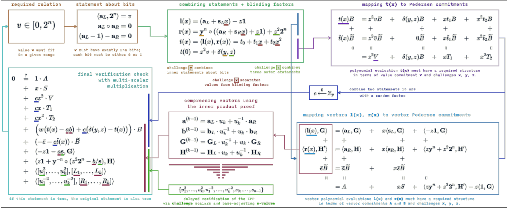

# Building on Bulletproofs

  

    
  

  

      
    &nbsp;&nbsp;&nbsp;&nbsp;<strong>Cathie Yun</strong> 
    &nbsp;&nbsp;&nbsp;&nbsp;Cryptographer
      
  

## Summary

In [this post](https://medium.com/@cathieyun/building-on-bulletproofs-2faa58af0ba8) Cathie explains the basics of the Bulletproofs zero knowledge proof protocol. She then goes further to 
explain specific applications built on top of Bulletproofs, which can be used for range proofs or constraint system 
proofs. The constraint system proof protocol was used to build a confidential assets scheme called Cloak and a 
confidential smart contract language called ZkVM.

