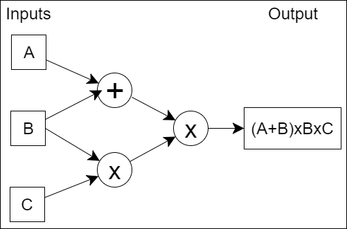

# Bulletproofs and Mimblewimble

- [Introduction](#introduction)
  - [Bulletproofs](#bulletproofs)
  - [Mimblewimble](#mimblewimble)
- [How do Bulletproofs Work?](#how-do-bulletproofs-work)
- [Applications for Bulletproofs](#applications-for-bulletproofs)
- [Comparison to other Zero-knowledge Proof Systems](#comparison-to-other-zero-knowledge-proof-systems)
- [Interesting Bulletproofs Implementation Snippets](#interesting-bulletproofs-implementation-snippets)
  - [Current and Past Efforts](#current-and-past-efforts)
  - [Security Considerations](#security-considerations)
  - [Wallet Reconstruction and Switch Commitment - Grin](#wallet-reconstruction-and-switch-commitment---grin)
    - [Initial Implementation](#initial-implementation)
    - [Improved Implementation](#improved-implementation)
    - [GitHub Extracts](#github-extracts)
- [Conclusions, Observations and Recommendations](#conclusions-observations-and-recommendations)
- [References](#references)
- [Appendices](#appendices)
  - [Appendix A: Definition of Terms](#appendix-a-definition-of-terms)
  - [Appendix B: Notation Used](#appendix-b-notation-used)
- [Contributors](#contributors)

## Introduction

### Bulletproofs

Bulletproofs form part of the family of distinct *Zero-knowledge Proof*[def][zk~] systems, such as Zero-Knowledge 
Succinct Non-Interactive ARguments of Knowledge (zk-SNARK); Succinct Transparent ARgument of Knowledge (STARK); and Zero 
Knowledge Prover and Verifier for Boolean Circuits (ZKBoo). Zero-knowledge proofs are designed so that a *prover* is 
able to indirectly verify that a statement is true without having to provide any information beyond the verification of 
the statement, e.g. to prove that a number is found that solves a cryptographic puzzle and fits the hash value 
without having to reveal the *Nonce*[def][nonce~] ([[2]], [[4]]).

The Bulletproofs technology is a Non-interactive Zero-knowledge (NIZK) proof protocol for general *Arithmetic Circuits*[def][ac~] with very short proofs (*Arguments of Knowledge Systems*[def][afs~]) and without requiring a trusted setup. They rely on the *Discrete Logarithm*[def][dlp~] (DL) assumption and are made non-interactive using the *Fiat-Shamir Heuristic*[def][fsh~]. The name "Bulletproof" originated from a 
non-technical summary from one of the original authors of the scheme's properties: "<i>Short like a bullet with 
bulletproof security assumptions</i>" ([[1]], [[29]]).

Bulletproofs also implement a Multi-party Computation (MPC) protocol, whereby distributed proofs of multiple *provers* 
with secret committed values are aggregated into a single proof before the Fiat-Shamir challenge is calculated and sent 
to the *verifier*, thereby minimizing rounds of communication. Secret committed values will stay secret ([[1]], [[6]]).

The essence of Bulletproofs is its inner-product algorithm originally presented by Groth [[13]] and then further refined 
by Bootle et al. [[12]]. The latter development provided a proof (argument of knowledge) for two independent (not 
related) *binding*[def][cs~] vector *Pedersen Commitments*[def][ecpc~] that satisfied the given inner-product relation. Bulletproofs build on these techniques, which yield communication-efficient, zero-knowledge 
proofs, but offer a further replacement for the inner product argument that reduces overall communication by a factor of 
three ([[1]], [[29]]).

### Mimblewimble

[Mimblewimble](../../protocols/mimblewimble-1/MainReport.md) is a blockchain protocol designed for confidential 
transactions. The essence is that a Pedersen Commitment to $ 0 $ can be viewed as an Elliptic Curve Digital Signature 
Algorithm (ECDSA) public key, and that for a valid confidential transaction, the difference between outputs, inputs and transaction fees must be $ 0 ​$. A *prover* constructing a confidential transaction can therefore sign the transaction 
with the difference of the outputs and inputs as the public key. This enables a greatly simplified blockchain in which 
all spent transactions can be pruned, and new nodes can efficiently validate the entire blockchain without downloading 
any old and spent transactions. The blockchain consists only of block-headers, remaining Unspent Transaction Outputs 
(UTXO) with their range proofs and an unprunable transaction kernel per transaction. Mimblewimble also allows 
transactions to be aggregated before being committed to the blockchain ([[1]], [[20]]).

## How do Bulletproofs Work?

The basis of confidential transactions is to replace the input and output amounts with *Pedersen Commitments*[def][ecpc~]. It is then publicly verifiable that the transactions balance (the sum of the 
committed inputs is greater than the sum of the committed outputs, and all outputs are positive), while keeping the 
specific committed amounts hidden. This makes it a zero-knowledge transaction. The transaction amounts must be encoded 
as $ integers \mod q ​$, which can overflow, but are prevented from doing so by making use of range proofs. This is where Bulletproofs come in. The essence of Bulletproofs is its ability to calculate proofs, including range proofs, from inner-products.

The *prover* must convince the *verifier* that commitment $ C(x,r) = xH + rG $ contains a number such that $ x \in 
[0,2^n - 1] $. If $ \mathbf {a} = (a_1 \mspace{3mu} , \mspace{3mu} ... \mspace{3mu} , \mspace{3mu} a_n) \in \{0,1\}^n 
$ is the vector containing the bits of $ x $, the basic idea is to hide all the bits of the amount in a single 
vector Pedersen Commitment. It must then be proven that each bit satisfies $ \omega(\omega-1) = 0 $, i.e. each 
$ \omega $ is either $ 0 $ or $ 1 $, and that they sum to $ x $. As part of the ensuing protocol, the *verifier* sends 
random linear combinations of constraints and challenges $ \in \mathbb{Z_p} $ to the *prover*. 
The *prover* is then able to construct a vectorized inner product relation containing the elements of  $ \mathbf {a} 
$, the constraints and challenges $ \in \mathbb{Z_p} $, and appropriate blinding vectors $ \in \mathbb Z_p^n $.

These inner product vectors have size $ n $ that would require many expensive exponentiations. The Pedersen Commitment 
scheme, shown in Figure&nbsp;1, allows for a vector to be cut in half, and for the two halves to be compressed together, 
each time calculating a new set of Pedersen Commitment generators. Applying the same trick repeatedly, $ \log _2 n $ 
times, produces a single value. This is applied to the inner product vectors; they are reduced interactively with a 
logarithmic number of rounds by the *prover* and *verifier* into a single multi-exponentiation of size 
$ 2n + 2 \log_2(n) + 1 $. This single multi-exponentiation can then be calculated much faster than $ n ​$ separate ones. 
All of this is made non-interactive using the Fiat-Shamir Heuristic[def][fsh~].

<b>Figure&nbsp;1: Vector Pedersen Commitment Cut and Half ([<a href=
"https://eprint.iacr.org/2016/263.pdf" title="Efficient zero-knowledge arguments for arithmetic 
circuits in the discrete log setting, Bootle J et al.">12</a>], 
[<a href="https://www.benthamsgaze.org/2016/10/25/how-to-do-zero-knowledge-from-discrete-logs-in-under-7kb/" 
title="How to do Zero-Knowledge from Discrete-Logs 
in under 7kB, Bootle J.">63</a>])</b>

Bulletproofs only rely on the discrete logarithm assumption. In practice, this means that Bulletproofs are 
compatible with any secure elliptic curve, making them extremely versatile. The proof sizes are short; only 
$ [2 \log_2(n) + 9] $ elements are required for the range proofs and $ [\log_2(n) + 13] $ elements for arithmetic 
circuit proofs, with $ n $ denoting the multiplicative complexity. Additionally, the logarithmic proof size enables the *prover* to aggregate multiple range proofs into a single short proof, as well as to aggregate multiple range proofs from different parties into one proof (refer to Figure&nbsp;2) ([[1]], [[3]], [[5]]).

<b>Figure&nbsp;2: Logarithmic Aggregate Bulletproofs Proof Sizes 
[<a href="https://drive.google.com/file/d/18OTVGX7COgvnZ7T0ke-ajhMWwOHOWfKV/view" title="Bullet Proofs (Slides), 
Bitcoin Milan Meetup 2018-02-02, 
Andrew Poelstra">3</a>]</b>

If all Bitcoin transactions were confidential, approximately 50 million UTXOs from approximately 22 million transactions 
would result in roughly 160GB range proof data, when using current/linear proof systems and assuming use of 52&nbsp;bits 
to represent any value from 1 satoshi up to 21 million bitcoins. Aggregated Bulletproofs would reduce the data storage requirement to < 17GB [[1]].

In Mimblewimble, the blockchain grows with the size of the UTXO set. Using Bulletproofs as a drop-in replacement for 
range proofs in confidential transactions, the size of the blockchain would only grow with the number of transactions 
that have unspent outputs. This is much smaller than the size of the UTXO set [[1]].

The recent implementation of Bulletproofs in Monero on 18 October 2018 saw the average data size on the blockchain per payment reduce by ~73% and the average USD-based fees reduce by ~94.5% for the period 30 August 2018 to 28 November 2018 
(refer to Figure&nbsp;3).

<b>Figure&nbsp;3: Monero Payment, Block and Data Size Statistics</b>

## Applications for Bulletproofs

Bulletproofs were designed for range proofs. However, they also generalize to arbitrary arithmetic circuits. In 
practice, this means that Bulletproofs have wide application and can be efficiently used for many types of proofs. Use 
cases of Bulletproofs are listed in this section, but this list may not be exhaustive, as use cases for Bulletproofs 
continue to evolve ([[1]], [[2]], [[3]], [[5]], [[6]], [[59]]). 

1. Range proofs

   Range proofs are proofs that a secret value, which has been encrypted or committed to, lies in a certain interval. 
   It prevents any numbers coming near the magnitude of a large prime, say $ 2^{256} $, that can cause wraparound when 
   adding a small number, e.g. proof that  $ x \in [0,2^{52} - 1] $.

2. Merkle proofs

   Hash preimages in a Merkle tree [[7]] can be leveraged to create zero-knowledge Merkle proofs using Bulletproofs, to 
   create efficient proofs of inclusion in massive data sets.

3. Proof of solvency

   Proofs of solvency are a specialized application of Merkle proofs; coins can be added into a giant Merkle tree. It 
   can then be proven that some outputs are in the Merkle tree and that those outputs add up to some amount that the cryptocurrency exchange claims they have control over without revealing any private information. A Bitcoin exchange 
   with 2 million customers needs approximately 18GB to prove solvency in a confidential manner using the Provisions 
   protocol [[58]]. Using Bulletproofs and its variant protocols proposed in [[1]], this size could be reduced to 
   approximately 62MB.

4. Multi-signatures with deterministic nonces

   With Bulletproofs, every signatory can prove that their nonce was generated deterministically. A SHA256 arithmetic 
   circuit could be used in a deterministic way to show that the de-randomized nonces were generated deterministically. 
   This would still work if one signatory were to leave the conversation and rejoin later, with no memory of interacting 
   with the other parties they were previously interacting with.

5. Scriptless scripts

   Scriptless scripts is a way to do smart contracts exploiting the linear property of Schnorr signatures, using an 
   older form of zero-knowledge proofs called a Sigma protocol. This can all be done with Bulletproofs, which could be 
   extended to allow assets that are functions of other assets, i.e. crypto derivatives.

6. Smart contracts and crypto derivatives

   Traditionally, a new trusted setup is needed for each smart contract when verifying privacy-preserving smart 
   contracts, but with Bulletproofs, no trusted setup is needed. Verification time, however, is linear, and it might be 
   too complex to prove every step in a smart contract. The Refereed Delegation Model [[33]] has been proposed as an 
   efficient protocol to verify smart contracts with public verifiability in the off-line stage, by making use of a 
   specific verification circuit linked to a smart contract.

   A *challenger* will input the proof to the verification circuit and get a binary response as to the validity of the 
   proof. The *challenger* can then complain to the smart contract, claim the proof is invalid and send the proof, 
   together with the output from a chosen gate in the verification circuit, to the smart contract. Interactive binary 
   searches are then used to identify the gate where the proof turns invalid. Hence the smart contract must only 
   check a single gate in the verification procedure to decide whether the *challenger* or *prover* was correct. The 
   cost is logarithmic in the number of rounds and amount of communications, with the smart contract only doing one computation. A Bulletproof can be calculated as a short proof for the arbitrary computation in the smart contract, 
   thereby creating privacy-preserving smart contracts (refer to Figure&nbsp;4). 

  

  
<b>Figure&nbsp;4: Bulletproofs for Refereed Delegation Model 
  [<a href="https://cyber.stanford.edu/sites/default/files/bpase18.pptx" 
  title="Bulletproofs: Short Proofs for Confidential Transactions 
  and More (Slides), Blockchain Protocol Analysis and 
  Security Engineering 2018, 
  Bünz B. et al">5</a>]</b>

7. Verifiable shuffles

   Alice has some computation and wants to prove to Bob that she has done it correctly and has some secret inputs to 
   this computation. It is possible to create a complex function that either evaluates to 1 if all secret inputs are 
   correct and to 0 otherwise. Such a function can be encoded in an arithmetic circuit and can be implemented with 
   Bulletproofs to proof that the transaction is valid.

   When a proof is needed that one list of values $[x_1, ... , x_n]$ is a permutation of a second list of values
   $[y_1, ... , y_n]$, it is called a verifiable shuffle. It has many applications, e.g. voting, blind signatures 
   for untraceable payments and solvency proofs. Currently, the most efficient shuffle has size $O \sqrt{n}$. 
   Bulletproofs can be used very efficiently to prove verifiable shuffles of size $O \log(n)$, as shown in Figure&nbsp;5.

   Another potential use case is to verify that two nodes executed the same list of independent instructions 
   $ [x1,x4,x3,x2] $ and $ [x1,x2,x3,x4] $, which may be in different order, to arrive at the same next state $ N ​$. The 
   nodes do not need to share the actual instructions with a *Verifier*, but the *Verifier* can show that they executed 
   the same set without having knowledge of the instructions.

  

  
<b>Figure&nbsp;5: Bulletproofs for Verifiable Shuffles [<a href="https://cyber.stanford.edu/sites/default/files/bpase18.pptx" 
  title="Bulletproofs: Short Proofs for Confidential Transactions 
  and More (Slides), Blockchain Protocol Analysis and 
  Security Engineering 2018, 
  Bünz B. et al">5</a>]</b>

8. Batch verifications

   Batch verifications can be done using one of the Bulletproofs derivative protocols. This has application where the *Verifier* needs to verify multiple (separate) range proofs at once, e.g. a blockchain full node receiving a 
   block of transactions needs to verify all transactions as well as range proofs. This batch verification is then 
   implemented as one large multi-exponentiation; it is applied to reduce the number of expensive exponentiations.

## Comparison to other Zero-knowledge Proof Systems

Table&nbsp;1 ([[2]], [[5]]) shows a high-level comparison between Sigma protocols (i.e. interactive public-coin 
protocols) and the different Zero-knowledge proof systems mentioned in this report. (The most desirable outcomes for 
each measurement are shown in ***bold italics***.) The aim will be to have a proof system that is not interactive, has 
short proof sizes, has linear *Prover* runtime scalability, has efficient (sub-linear) *Verifier* runtime scalability, 
has no trusted setup, is practical and is at least DL secure. Bulletproofs are unique in that they are not interactive, 
have a short proof size, do not require a trusted setup, have very fast execution times and are practical to implement. 
These attributes make Bulletproofs extremely desirable to use as range proofs in cryptocurrencies.

<b>Table 1: Comparison to other Zero-knowledge Proof Systems</b>

| Proof System                        | Sigma Protocols | zk-SNARK                                | STARK                                                        | ZKBoo                   | Bulletproofs |
| ----------------------------------- | --------------- | --------------------------------------- | ------------------------------------------------------------ | ----------------------- | ------------ |
| <b>Interactive</b>                  | yes             | ***no***                                | ***no***                                                     | ***no***                | ***no***     |
| <b>Proof Size</b>                   | long            | ***short***                             | shortish                                                     | long                    | ***short***  |
| <b>Prover Runtime Scalability</b>   | ***linear***    | quasilinear                             | quasilinear (big memory requirement)                         | ***linear***            | ***linear*** |
| <b>Verifier Runtime Scalability</b> | linear          | *efficient*                             | ***efficient* (*poly-logarithmically*)**                     | ***efficient***         | linear       |
| <b>Trusted Setup</b>                | ***no***        | required                                | ***no***                                                     | ***no***                | ***no***     |
| <b>Practical</b>                    | ***yes***       | ***yes***                               | not   quite                                                  | somewhat                | ***yes***    |
| <b>Security Assumptions</b>         | ***DL***        | non-falsifiable, but not on par with DL | ***quantum secure One-way Function ([OWF][owf]) [[50]], which is better than DL*** | ***similar to STARKs*** | ***DL***     |

[owf]: #owf
"A one-way function is a function that is easy to 
compute on every input, but hard to invert 
given the image of a random input."

## Interesting Bulletproofs Implementation Snippets

Bulletproofs development is currently still evolving, as can be seen when following the different community development projects. Different implementations of Bulletproofs also offer different levels of efficiency, security and functionality. 
This section describes some of these aspects.

### Current and Past Efforts

The initial prototype Bulletproofs' implementation was done by [Benedikt Bünz](https://github.com/bbuenz) in Java 
located at `GitHub:bbuenz/BulletProofLib` [[27]].

The initial work that provided cryptographic support for a Mimblewimble implementation was mainly done by 
[Pieter Wuille](https://github.com/sipa), [Gregory Maxwell](https://github.com/gmaxwell) and 
[Andrew Poelstra](https://github.com/apoelstra) in C located at `GitHub:ElementsProject/secp256k1-zkp` [[25]]. 
This effort was forked as `GitHub:apoelstra/secp256k1-mw` [[26]] with main contributors being 
[Andrew Poelstra](https://github.com/apoelstra), [Pieter Wuille](https://github.com/sipa), and 
[Gregory Maxwell](https://github.com/gmaxwell) where Mimblewimble primitives and support for many of the Bulletproof 
protocols (e.g. zero knowledge proofs, range proofs and arithmetic circuits) were added. Current effort also involves 
MuSig [[48]] support.

The Grin project (an open source Mimblewimble implementation in Rust) subsequently forked `GitHub:ElementsProject/secp256k1-zkp` [[25]] as `GitHub:mimblewimble/secp256k1-zkp` [[30]] and has added Rust 
wrappers to it as `mimblewimble/rust-secp256k1-zkp` [[45]] for use in its blockchain. The Beam project (another open source Mimblewimble implementation in C++) links directly to `GitHub:ElementsProject/secp256k1-zkp` [[25]] as its 
cryptographic sub-module. Refer to [Mimblewimble-Grin Blockchain Protocol Overview](../../protocols/grin-protocol-overview/MainReport.md) 
and [Grin vs. BEAM, a Comparison](../../protocols/grin-beam-comparison/MainReport.md) for more information about the Mimblewimble implementation of Grin and Beam.

An independent implementation for Bulletproof range proofs was done for the Monero project (an open source CryptoNote implementation in C++) by [Sarang Noether](https://github.com/SarangNoether) [[49]] in Java as the precursor and [moneromooo-monero](https://github.com/moneromooo-monero) [[46]] in C++ as the final implementation. Its implementation supports single and aggregate range proofs. 

Adjoint, Inc. has also done an independent open source implementation of Bulletproofs in Haskell at `GitHub: adjoint-io/bulletproofs` [[29]]. It has an open source implementation of a private permissioned blockchain with 
multiparty workflow aimed at the financial industry.

Chain/Interstellar has done another independent open source implementation of Bulletproofs in Rust from the ground up at `GitHub:dalek-cryptography/bulletproofs` [[28]]. It has implemented parallel Edwards formulas [[39]] using Intel® 
Advanced Vector Extensions 2 (AVX2) to accelerate curve operations. Initial testing suggests approximately 50% speedup 
(twice as fast) over the original `libsecp256k1`-based Bulletproofs implementation.

### Security Considerations

Real-world implementation of Elliptic-curve Cryptography (ECC) is largely based on official standards that govern the 
selection of curves in order to try and make the Elliptic-curve Discrete-logarithm Problem (ECDLP) hard to solve, i.e. 
finding an ECC user's secret key given the user's public key. Many attacks break real-world ECC without solving ECDLP 
due to problems in ECC security, where implementations can produce incorrect results and also leak secret data. Some implementation considerations also favor efficiency over security. Secure implementations of the standards-based curves 
are theoretically possible, but highly unlikely ([[14]], [[32]]).

Grin, Beam and Adjoint use ECC curve secp256k1 [[24]] for their Bulletproofs implementation, which fails one out of the 
four ECDLP security criteria and three out of the four ECC security criteria. Monero and Chain/Interstellar use the 
ECC curve Curve25519 [[38]] for their Bulletproofs implementation, which passes all ECDLP and ECC security criteria [[32]].

Chain/Interstellar goes one step further with its use of Ristretto, a technique for constructing prime order elliptic 
curve groups with non-malleable encodings, which allows an existing Curve25519 library to implement a prime-order group 
with only a thin abstraction layer. This makes it possible for systems using Ed25519 signatures to be safely extended 
with zero-knowledge protocols, with no additional cryptographic assumptions and minimal code changes [[31]].

The Monero project has also had security audits done on its Bulletproofs' implementation, which resulted in a number of 
serious and critical bug fixes as well as some other code improvements  ([[8]], [[9]], [[11]]).

### Wallet Reconstruction and Switch Commitment - Grin

Grin implemented a switch commitment [[43]] as part of a transaction output to be ready for the age of quantum 
adversaries and to pose as a defense mechanism. It had an original implementation that was discarded (completely 
removed) due to it being complex, using a lot of space in the blockchain and allowing inclusion of arbitrary data. Grin 
also employed a complex scheme to embed the transaction amount inside a Bulletproof range proof for wallet 
reconstruction, which was linked to the original switch commitment hash implementation. The latest implementation 
improved on all those aspects and uses a much simpler method to regain the transaction amount from a Bulletproof range proof. 

#### Initial Implementation

The initial Grin implementation ([[21]], [[34]]. [[35]], [[54]]) hides two things in the Bulletproof range proof: a 
transaction amount for wallet reconstruction and an optional switch commitment hash to make the transaction perfectly *binding*[def][cs~] later on, as opposed to currently being perfectly *hiding*[def][cs~]. 
*Perfect* in this sense means that a quantum adversary (an attacker with infinite computing power) cannot tell what 
amount has been committed to and is also unable to produce fake commitments. *Computational* means that no efficient 
algorithm running in a practical amount of time can reveal the commitment amount or produce fake commitments, except 
with small probability. The Bulletproof range proofs are stored in the transaction kernel and will thus remain 
persistent in the blockchain.

In this implementation, a Grin transaction output contains the original (Elliptic Curve) *Pedersen Commitment*[def][ecpc~] as well as the optional switch commitment hash. The switch commitment hash takes the resultant blinding factor $ b $, a third cyclic group random generator $ J $ and a wallet-seed derived random 
value $ r $ as input. The transaction output has the following form:

$$
(vG + bH \mspace{3mu} , \mspace{3mu} \mathrm{H_{B2}}(bJ \mspace{3mu} , \mspace{3mu} r))
$$

where $ \mathrm{H_{B2}} ​$ is the BL,AKE2 hash function [[44]] and $  \mathrm{H_{B2}}(bJ \mspace{3mu} , \mspace{3mu} r)  ​$ the switch commitment hash. In order for such an amount to be spent, the owner needs to reveal $ b , r ​$ so that the 
*Verifier* can check the opening of $ \mathrm{H_{B2}}(bJ \mspace{3mu} , \mspace{3mu} r) ​$ by confirming that it matches 
the value stored in the switch commitment hash portion of the transaction output. Grin implemented the BLAKE2 hash 
function, which outperforms all mainstream hash function implementations in terms of hashing speed with similar 
security to the latest Secure Hash Algorithm 3 (SHA-3) standard [[44]].

In the event of quantum adversaries, the owner of an output can choose to stay anonymous and not claim ownership or 
reveal $ bJ $ and $ r ​$, whereupon the amount can be moved to the then hopefully forked quantum resistant blockchain.

In the Bulletproof range proof protocol, two 32-byte scalar nonces $ \tau_1 , \alpha ​$ (*not important to know what they are*) are generated with a secure random number generator. If the seed for the random number generator is known, the 
scalar values $ \tau_1 , \alpha ​$ can be recalculated when needed. Sixty-four (64) bytes worth of message space (out of 
674 bytes worth of range proof) are made available by embedding a message into those variables using a logic 
$ \mathrm{XOR} ​$ gate. This message space is used for the transaction amount for wallet reconstruction.

To ensure that the transaction amount of the output cannot be spent by only opening the (Elliptic Curve) Pedersen 
Commitment $ vG + bH $, the switch commitment hash and embedded message are woven into the Bulletproof range proof 
calculation. The initial part is done by seeding the random number generator used to calculate $ \tau_1 , \alpha $ with 
the output from a seed function $ \mathrm S $ that uses as input a nonce $ \eta $ (which may be equal to the original 
blinding factor $ b $), the (Elliptic Curve) Pedersen Commitment[def][ecpc~] $ P $ and the switch commitment 
hash

$$
\mathrm S (\eta \mspace{3mu} , \mspace{3mu} P \mspace{3mu} ,  \mspace{3mu} \mathrm{H_{B2}}(bJ \mspace{3mu} , 
\mspace{3mu} r) ) = \eta \mspace{3mu} \Vert \mspace{3mu} \mathrm{H_{S256}}(P \mspace{3mu} \Vert \mspace{3mu} \mathrm{H_{B2}}(bJ \mspace{3mu} , \mspace{3mu} r) )
$$

where $ \mathrm{H_{S256}}$ is the SHA256 hash function. The Bulletproof range proof is then calculated with an adapted 
pair $ \tilde{\alpha} , \tilde{\tau_1} $, using the original $ \tau_1 , \alpha $ and two 32-byte words $m_{w1} $ and 
$m_{w2} $ that make up the 64-byte embedded message as follows:

$$
\tilde{\alpha} = \mathrm {XOR} ( \alpha \mspace{3mu} , \mspace{3mu} m_{w1}) \mspace{12mu} \mathrm{and} \mspace{12mu} \tilde{\tau_1} = \mathrm {XOR} ( \tau_1 \mspace{3mu} , \mspace{3mu} m_{w2} )
$$

To retrieve the embedded message, the process is simply inverted. Note that the owner of an output needs to keep record 
of the blinding factor $ b $, the nonce $ \eta $ if not equal to the blinding factor $ b $, as well as the wallet-seed 
derived random value $ r $ to be able to claim such an output.

#### Improved Implementation

The latter Grin implementation ([[56]], [[57]]) uses Bulletproof range proof rewinding so that wallets can recognize 
their own transaction outputs. This negated the requirement to remember the wallet-seed derived random value $ r ​$, 
nonce $ \eta ​$ for the seed function $ \mathrm S ​$ and use of the adapted pair $ \tilde{\alpha} , \tilde{\tau_1} 
​$ in the Bulletproof range proof calculation.

In this implementation, it is not necessary to remember a hash of the switch commitment as part of the transaction output 
set and for it to be passed around during a transaction. The switch commitment looks exactly like the original 
(Elliptic Curve) Pedersen Commitment $ vG + bH $, but in this instance the blinding factor $ b $ is tweaked to be 
$$
b = b^\prime + \mathrm{H_{B2}} ( vG + b^\prime H \mspace{3mu} , \mspace{3mu} b^\prime J )
$$
 with $ b^\prime ​$ being the user generated blinding factor. The (Elliptic Curve) Pedersen Commitment then becomes
$$
vG + b^\prime H + \mathrm{H_{B2}} ( vG + b^\prime H \mspace{3mu} , \mspace{3mu} b^\prime J ) H
$$
After activation of the switch commitment in the age of quantum adversaries, users can reveal 
$ ( vG + b^\prime H \mspace{3mu} , \mspace{3mu} b^\prime J ) $, and *Verifiers* can check if it is computed correctly and 
use it as if it were the *ElGamal Commitment*[def][egc~] $ ( vG + b H \mspace{3mu} , \mspace{3mu} b J ) $. 

#### GitHub Extracts

The following extracts of discussions depict the initial and improved implementations of the switch commitment and 
retrieving transactions amounts from Bulletproofs for wallet reconstruction.

**Bulletproofs #273** [[35]]

{**yeastplume**} "The only thing I think we're missing here from being able to use this implementation is the ability 
to store an amount within the range proof (for wallet reconstruction). From conversations with @apoelstra earlier, I 
believe it's possible to store 64 bytes worth of 'message' (not nearly as much as the current range proofs)."

{**apoelstra**} "Ok, I can get you 64 bytes without much trouble (xoring them into* `tau_1` and `alpha` which are easy to extract from `tau_x` and `mu` if you know the original seed used to produce the randomness). I think it's possible to 
get another 32 bytes into `t` but that's way more involved since `t` is a big inner-product*." 

**Message hiding in Bulletproofs #721** [[21]]

"Breaking out from #273, we need the wind a message into a bulletproof similarly to how it could be done in 'Rangeproof Classic'. This is an absolute requirement as we need to embed an output's `SwitchCommitHash` (which is otherwise not 
committed to) and embed an output amount for wallet reconstruction. We should be able to embed up to 64 bytes of message without too much difficulty, and another 32 with more difficulty (see original issue). 64 should be enough for the time 
being."

**Switch Commits/Bulletproofs - Status #734** [[34]]

"The **prove** function takes a **value**, a **secret key** (blinding factor in our case), a **nonce**, optional 
**extra_data** and a **generator** and produces a 674 byte proof. I've also modified it to optionally take a 
**message** (more about this in a bit). It creates the Pedersen **commitment** it works upon internally with these 
values."

"The **verify** function takes a **proof**, a Pedersen **commitment** and optional **extra_data** and returns true if 
**proof** demonstrates that the value within the Pedersen **commitment** is in the range [0..2^64] (and the 
**extra_data** is correct)."

"Additionally, I've added an **unwind** function which takes a **proof**, a Pedersen **commitment**, optional 
**extra_data** and a 32 bit **nonce** (which needs to be the same as the original nonce used in order to return the same message) and returns the hidden **message**."

"If you have the correct Pedersen **commitment** and **proof** and **extra_data**, and attempt to unwind a **message** 
out using the wrong **nonce**, the attempt won't fail, you'll get out gibberish or just wildly incorrect values as you 
parse back the bytes."

"The `SwitchCommitHash`  is currently a field of an output, and while it is stored in the Txo set and passed around 
during a transaction, it is not currently included in the output's hash. It is passed in as the **extra_data** field 
above, meaning that anyone validating the range proof also needs to have the correct switch commit in order to validate 
the range proof."

**Removed all switch commitment usages, including restore #841** [[55]]

{**ignopeverell**} "After some discussion with @antiochp, @yeastplume and @tromp, we decided switch commitments weren't 
worth the cost of maintaining them and their drawbacks. Removing them."

{**ignopeverell**} "For reference, switch commitments were found to:
* add a lot of complexity and assumptions
* take additional space for little benefit right now
* allow the inclusion of arbitrary data, potentially for the worst
* provide little to no advantage in case of quantamageddon (as range proofs are still a weakness)"

{**apoelstra**} "After chatting with @yeastplume on IRC, I realize that we can actually use rangeproof rewinding for 
wallets to recognize their own outputs, which even avoids the "gap" problem of just scanning for pre-generated keys. 
With that in mind, it's true that the benefit of switch commitments for MW are not spectacular."

**Switch commitment discussion #998** [[56]]

{**antiochp**} "Sounds like there is a "zero cost" way of getting switch commitments in as part of the commitment 
itself, so we would not need to store and maintain a separate "switch commitment" on each output. I saw that switch 
commitments have been removed for various reasons."

"Let me suggest a variant (idea suggested by Pieter Wuille initially): The switch commitment is (vG + bH), where 
b = b' + hash(vG + b'H,b'J). (So this "tweaks" the commitment, in a pay-to-contract / taproot style). Before the switch, 
this is just used like a normal Pedersen Commitment vG + bH. After the switch, users can reveal (vG + b'H, b'J), and 
verifiers check if it's computed correctly and use as if it were the ElGamal commitment (vG + bH, bJ)."

{**@ignopeverell**} modified the milestones: Beta / testnet3, Mainnet on 11 Jul

{**@ignopeverell**} added the must-have label on 24 Aug

## Conclusions, Observations and Recommendations

- Bulletproofs are not Bulletproofs are not Bulletproofs. This is evident by comparing the functionality, security and performance of all the current different Bulletproof implementations as well as the evolving nature of Bulletproofs.
- The security audit instigated by the Monero project on their Bulletproofs implementation as well as the resulting findings and corrective actions prove that every implementation of Bulletproofs has potential risk. This risk is due to the nature 
of confidential transactions; transacted values and token owners are not public.
- The growing number of open source Bulletproof implementations should strengthen the development of a new confidential blockchain protocol such as Tari.
- In the pure implementation of Bulletproof range proofs, a discrete-log attacker (*e.g. a bad actor employing a 
quantum computer*) would be able to exploit Bulletproofs to silently inflate any currency that used them. Bulletproofs are perfectly *hiding*[def][cs~] (*i.e. confidential*), but only computationally *binding*[def][cs~] 
(*i.e. not quantum resistant*). Unconditional soundness is lost due to the data compression being employed ([[1]], 
[[5]], [[6]] and [[10]]).
- Bulletproofs are not only about range proofs. All the different Bulletproof use cases have a potential implementation 
in a new confidential blockchain protocol such as Tari; in the base layer as well as in the probable second layer.

## References

[[1]] B. Bünz, J. Bootle, D. Boneh‡1, A. Poelstra, P. Wuille and G. Maxwell, "Bulletproofs: Short Proofs for Confidential Transactions and More", Blockchain Protocol Analysis and Security Engineering 2018 [online]. Available: <http://web.stanford.edu/~buenz/pubs/bulletproofs.pdf>. Date accessed: 2018&#8209;09&#8209;18.

[1]: http://web.stanford.edu/~buenz/pubs/bulletproofs.pdf "Bulletproofs: Short Proofs for Confidential Transactions and 
More" 

[[2]] A. Poelstra, "Bulletproofs" (Transcript), Bitcoin Milan Meetup 2018-02-02 [online]. Available: 
<https://diyhpl.us/wiki/transcripts/2018-02-02-andrew-poelstra-Bulletproofs>. Date accessed: 2018-09-10. 

[2]: https://diyhpl.us/wiki/transcripts/2018-02-02-andrew-poelstra-bulletproofs "Bulletproofs (Transcript)" 

[[3]] A. Poelstra, "Bulletproofs" (Slides), Bitcoin Milan Meetup 2018-02-02 [online]. Available: 
<https://drive.google.com/file/d/18OTVGX7COgvnZ7T0ke-ajhMWwOHOWfKV/view>. Date accessed: 2018-09-10. 

[3]: https://drive.google.com/file/d/18OTVGX7COgvnZ7T0ke-ajhMWwOHOWfKV/view "Bulletproofs (Slides)" 

[[4]] B. Feng, "Decoding zk-SNARKs" [online]. Available: 
<https://medium.com/wolverineblockchain/decoding-zk-snarks-85e73886a040>. Date accessed: 2018-09-17. 

[4]: https://medium.com/wolverineblockchain/decoding-zk-snarks-85e73886a040 "Decoding zk-SNARKs" 

[[5]] B. Bünz, J. Bootle, D. Boneh‡1, A. Poelstra, P. Wuille and G. Maxwell, "Bulletproofs: Short Proofs for 
Confidential Transactions and More" (Slides) [online]. Available: 
<https://cyber.stanford.edu/sites/default/files/bpase18.pptx>. Date accessed: 2018-09-18. 

[5]: https://cyber.stanford.edu/sites/default/files/bpase18.pptx 
"Bulletproofs: Short Proofs for Confidential Transactions and More (Slides)"

[[6]] B. Bünz, J. Bootle, D. Boneh‡1, A. Poelstra, P. Wuille and G. Maxwell, "Bulletproofs: Short Proofs for 
Confidential Transactions and More (Transcripts)" [online]. Available: 
<http://diyhpl.us/wiki/transcripts/blockchain-protocol-analysis-security-engineering/2018/Bulletproofs>. Date accessed: 
2018&#8209;09&#8209;18. 

[6]: http://diyhpl.us/wiki/transcripts/blockchain-protocol-analysis-security-engineering/2018/bulletproofs
"Bulletproofs: Short Proofs for Confidential Transactions and More (Transcripts)"

[[7]] Merkle Root and Merkle Proofs [online]. Available: 
<https://bitcoin.stackexchange.com/questions/69018/Merkle-root-and-Merkle-proofs>. Date accessed: 2018-10-10. 

[7]: https://bitcoin.stackexchange.com/questions/69018/merkle-root-and-merkle-proofs "Merkle Root and Merkle Proofs" 

[[8]] Bulletproofs Audit: Fundraising [online]. Available: 
<https://forum.getmonero.org/22/completed-tasks/90007/Bulletproofs-audit-fundraising>. Date accessed: 2018-10-23. 

[8]: https://forum.getmonero.org/22/completed-tasks/90007/bulletproofs-audit-fundraising "Bulletproofs Audit: 
Fundraising" 

[[9]] The QuarksLab and Kudelski Security Audits of Monero Bulletproofs are Complete [online]. Available: 
<https://ostif.org/the-quarkslab-and-kudelski-security-audits-of-monero-Bulletproofs-are-complete>. Date accessed: 
2018-10-23. 

[9]: https://ostif.org/the-quarkslab-and-kudelski-security-audits-of-monero-bulletproofs-are-complete "The QuarksLab and 
Kudelski Security Audits of Monero Bulletproofs are Complete" 

[[10]] A. Poelstra, Bulletproofs Presentation at Feb 2 Milan Meetup, Reddit [online]. Available: 
<https://www.reddit.com/r/Bitcoin/comments/7w72pq/Bulletproofs_presentation_at_feb_2_milan_meetup>. Date accessed: 
2018-09-10. 

[10]: https://www.reddit.com/r/Bitcoin/comments/7w72pq/bulletproofs_presentation_at_feb_2_milan_meetup "Bulletproofs 
Presentation at Feb 2 Milan Meetup" 

[[11]] The OSTIF and QuarksLab Audit of Monero Bulletproofs is Complete – Critical Bug Patched [online]. Available: 
<https://ostif.org/the-ostif-and-quarkslab-audit-of-monero-Bulletproofs-is-complete-critical-bug-patched>. Date 
accessed: 2018-10-23. 

[11]: https://ostif.org/the-ostif-and-quarkslab-audit-of-monero-bulletproofs-is-complete-critical-bug-patched/ "The 
OSTIF and QuarksLab Audit of Monero Bulletproofs is Complete – Critical Bug Patched" 

[[12]] J. Bootle, A. Cerulli1, P. Chaidos, J. Groth and C. Petit, "Efficient Zero-knowledge Arguments for Arithmetic 
Circuits in the Discrete Log Setting", Annual International Conference on the Theory and Applications of Cryptographic 
Techniques, pages 327-357. Springer, 2016 [online]. Available: <https://eprint.iacr.org/2016/263.pdf>. Date accessed: 
2018-09-21. 

[12]: https://eprint.iacr.org/2016/263.pdf "Efficient Zero-knowledge Arguments for Arithmetic Circuits in the Discrete 
Log Setting" 

[[13]] J. Groth, "Linear Algebra with Sub-linear Zero-knowledge Arguments" [online]. Available: 
<https://link.springer.com/content/pdf/10.1007%2F978-3-642-03356-8_12.pdf>. Date accessed: 2018-09-21. 

[13]: https://link.springer.com/content/pdf/10.1007%2F978-3-642-03356-8_12.pdf "Linear Algebra with Sub-linear 
Zero-knowledge Arguments" 

[[14]] T. Perrin, "The XEdDSA and VXEdDSA Signature Schemes", 2016-10-20 [online]. Available: 
<https://signal.org/docs/specifications/xeddsa> and <https://signal.org/docs/specifications/xeddsa/xeddsa.pdf>. Date 
accessed: 2018-10-23. 

[14]: https://signal.org/docs/specifications/xeddsa "The XEdDSA and VXEdDSA Signature Schemes" 

[[15]] A. Poelstra, A. Back, M. Friedenbach, G. Maxwell and P. Wuille, "Confidential Assets", Blockstream [online]. 
Available: <https://blockstream.com/bitcoin17-final41.pdf>. Date accessed: 2018-09-25. 

[15]: https://blockstream.com/bitcoin17-final41.pdf "Confidential Assets" 

[[16]] Wikipedia: "Zero-knowledge Proof" [online]. Available: <https://en.wikipedia.org/wiki/Zero-knowledge_proof>. Date 
accessed: 2018-09-18. 

[16]: https://en.wikipedia.org/wiki/Zero-knowledge_proof "Wikipedia - Zero-knowledge Proof" 

[[17]] Wikipedia: "Discrete Logarithm" [online]. Available: <https://en.wikipedia.org/wiki/Discrete_logarithm>. Date 
accessed: 2018-09-20. 

[17]: https://en.wikipedia.org/wiki/Discrete_logarithm "Wikipedia: Discrete Logarithm" 

[[18]] A. Fiat and A. Shamir, "How to Prove Yourself: Practical Solutions to Identification and Signature Problems". 
CRYPTO 1986: pp. 186-194 [online]. Available: <https://link.springer.com/content/pdf/10.1007%2F3-540-47721-7_12.pdf>. 
Date accessed: 2018-09-20. 

[18]: https://link.springer.com/content/pdf/10.1007%2F3-540-47721-7_12.pdf "How to Prove Yourself: Practical Solutions 
to Identification and Signature Problems" 

[[19]] D. Bernhard, O. Pereira and B. Warinschi, "How not to Prove Yourself: Pitfalls of the Fiat-Shamir Heuristic and 
Applications to Helios" [online]. Available: <https://link.springer.com/content/pdf/10.1007%2F978-3-642-34961-4_38.pdf>. 
Date accessed: 2018-09-20. 

[19]: https://link.springer.com/content/pdf/10.1007%2F978-3-642-34961-4_38.pdf "How not to Prove Yourself: Pitfalls of 
the Fiat-Shamir Heuristic and Applications to Helios" 

[[20]] Mimblewimble Explained [online]. Available: <https://www.weusecoins.com/mimble-wimble-andrew-poelstra/>. Date 
accessed: 2018-09-10. 

[20]: https://www.weusecoins.com/mimble-wimble-andrew-poelstra "Mimblewimble Explained" 

[[21]] Message Hiding in Bulletproofs #721 [online]. Available: <https://github.com/mimblewimble/grin/issues/721>, Date 
accessed: 2018-09-10. 

[21]: https://github.com/mimblewimble/grin/issues/721 "Message Hiding in Bulletproofs #721" 

[[22]] Pedersen-commitment: "An Implementation of Pedersen Commitment Schemes" [online]. Available: 
<https://hackage.haskell.org/package/pedersen-commitment>. Date accessed: 2018-09-25. 

[22]: https://hackage.haskell.org/package/pedersen-commitment "Pedersen-commitment: An Implementation of Pedersen 
Commitment Schemes" 

[[23]] Zero Knowledge Proof Standardization - An Open Industry/Academic Initiative [online]. Available: 
<https://zkproof.org/documents.html>. Date accessed: 2018-09-26. 

[23]: https://zkproof.org/documents.html "Zero Knowledge Proof Standardization - An Open Industry/Academic Initiative" 

[[24]] SEC 2: Recommended Elliptic Curve Domain Parameters, Standards for Efficient Cryptography, 20 September 2000 
[online]. Available: <http://safecurves.cr.yp.to/www.secg.org/SEC2-Ver-1.0.pdf>. Date accessed: 2018-09-26. 

[24]: http://safecurves.cr.yp.to/www.secg.org/SEC2-Ver-1.0.pdf "SEC 2: Recommended Elliptic Curve Domain Parameters, 
Standards for Efficient Cryptography" 

[[25]] GitHub: ElementsProject/secp256k1-zkp, Experimental Fork of libsecp256k1 with Support for Pedersen Commitments 
and Range Proofs [online]. Available: <https://github.com/ElementsProject/secp256k1-zkp>. Date accessed: 2018-09-18. 

[25]: https://github.com/ElementsProject/secp256k1-zkp "GitHub: ElementsProject/secp256k1-zkp, Experimental Fork of 
libsecp256k1 with Support for Pedersen Commitments and Range Proofs" 

[[26]] GitHub: apoelstra/secp256k1-mw, Fork of libsecp-zkp `d78f12b` to Add Support for Mimblewimble Primitives 
[online]. Available: <https://github.com/apoelstra/secp256k1-mw/tree/Bulletproofs>. Date accessed: 2018-09-18. 

[26]: https://github.com/apoelstra/secp256k1-mw/tree/bulletproofs "GitHub: apoelstra/secp256k1-mw, Fork of libsecp-zkp 
`d78f12b` to Add Support for Mimblewimble Primitives" 

[[27]] GitHub: bbuenz/BulletProofLib, Library for Generating Non-interactive Zero Knowledge Proofs without Trusted Setup 
(Bulletproofs) [online]. Available: <https://github.com/bbuenz/BulletProofLib>. Date accessed: 2018-09-18. 

[27]: https://github.com/bbuenz/BulletProofLib "GitHub: bbuenz/BulletProofLib, Library for Generating Non-interactive 
Zero Knowledge Proofs without Trusted Setup (Bulletproofs)" 

[[28]] GitHub: dalek-cryptography/Bulletproofs, A Pure-Rust Implementation of Bulletproofs using Ristretto [online]. 
Available: <https://github.com/dalek-cryptography/Bulletproofs>. Date accessed: 2018-09-18. 

[28]: https://github.com/dalek-cryptography/bulletproofs "GitHub: dalek-cryptography/Bulletproofs, A Pure-Rust 
Implementation of Bulletproofs using Ristretto" 

[[29]] GitHub: adjoint-io/Bulletproofs, Bulletproofs are Short Non-interactive Zero-knowledge Proofs that Require no 
Trusted Setup [online]. Available: <https://github.com/adjoint-io/Bulletproofs>. Date accessed: 2018-09-10. 

[29]: https://github.com/adjoint-io/bulletproofs "GitHub: adjoint-io/Bulletproofs, Bulletproofs are Short 
Non-interactive Zero-knowledge Proofs that Require no Trusted Setup" 

[[30]] GitHub: mimblewimble/secp256k1-zkp, Fork of secp256k1-zkp for the Grin/MimbleWimble project [online]. Available: 
<https://github.com/mimblewimble/secp256k1-zkp>. Date accessed: 2018-09-18. 

[30]: https://github.com/mimblewimble/secp256k1-zkp "GitHub: mimblewimble/secp256k1-zkp, Fork of secp256k1-zkp for the 
Grin/MimbleWimble project" 

[[31]] The Ristretto Group [online]. Available: <https://ristretto.group/ristretto.html>. Date accessed: 2018-10-23. 

[31]: https://ristretto.group/ristretto.html "The Ristretto Group" 

[[32]] SafeCurves: Choosing Safe Curves for Elliptic-curve Cryptography [online]. Available: 
<http://safecurves.cr.yp.to/>. Date accessed: 2018-10-23. 

[32]: http://safecurves.cr.yp.to/ "SafeCurves: Choosing Safe Curves for Elliptic-curve Cryptography" 

[[33]] R. Canetti, B. Riva and G. N. Rothblum, "Two 1-Round Protocols for Delegation of Computation" [online]. 
Available: <https://eprint.iacr.org/2011/518.pdf>, Date accessed: 2018-10-11. 

[33]: https://eprint.iacr.org/2011/518.pdf "Two 1-Round Protocols for Delegation of Computation" 

[[34]] GitHub: mimblewimble/grin, Switch Commits / Bulletproofs - Status #734 [online]. Available: 
<https://github.com/mimblewimble/grin/issues/734>. Date accessed: 2018-09-10. 

[34]: https://github.com/mimblewimble/grin/issues/734 "GitHub: mimblewimble/grin, Switch Commits / Bulletproofs - Status 
#734" 

[[35]] GitHub: mimblewimble/grin, Bulletproofs #273 [online]. Available: 
<https://github.com/mimblewimble/grin/issues/273>. Date accessed: 2018-09-10. 

[35]: https://github.com/mimblewimble/grin/issues/273 "GitHub: mimblewimble/grin, Bulletproofs #273" 

[[36]] Wikipedia: "Commitment Scheme [online]. Available: <https://en.wikipedia.org/wiki/Commitment_scheme>. Date 
accessed: 2018-09-26. 

[36]: https://en.wikipedia.org/wiki/Commitment_scheme "Wikipedia: Commitment Scheme" 

[[37]] Cryptography Wikia: Commitment Scheme [online]. Available: 
<http://cryptography.wikia.com/wiki/Commitment_scheme>. Date accessed: 2018&#8209;09&#8209;26. 

[37]: http://cryptography.wikia.com/wiki/Commitment_scheme "Cryptography Wikia: Commitment Scheme" 

[[38]] D. J. Bernstein, "Curve25519: New Diffie-Hellman Speed Records" [online]. Available: 
<https://cr.yp.to/ecdh/curve25519-20060209.pdf>. Date accessed: 2018-09-26. 

[38]: https://cr.yp.to/ecdh/curve25519-20060209.pdf "Curve25519: New Diffie-Hellman Speed Records" 

[[39]] H. Hisil, K. Koon-Ho Wong, G. Carter and E. Dawson, "Twisted Edwards Curves Revisited", Information Security 
Institute, Queensland University of Technology [online]. Available: 
<https://iacr.org/archive/asiacrypt2008/53500329/53500329.pdf>. Date accessed: 2018-09-26. 

[39]: https://iacr.org/archive/asiacrypt2008/53500329/53500329.pdf "Twisted Edwards Curves Revisited" 

[[40]] A. Sadeghi and M. Steiner, "Assumptions Related to Discrete Logarithms: Why Subtleties Make a Real 
Difference"[online]. Available: <http://www.semper.org/sirene/publ/SaSt_01.dh-et-al.long.pdf>. Date accessed: 
2018-09-24. 

[40]: http://www.semper.org/sirene/publ/SaSt_01.dh-et-al.long.pdf "Assumptions Related to Discrete Logarithms: Why 
Subtleties Make a Real Difference" 

[[41]] Crypto Wiki: "Cryptographic Nonce" [online]. Available: <http://cryptography.wikia.com/wiki/Cryptographic_nonce>. 
Date accessed: 2018-10-08. 

[41]: http://cryptography.wikia.com/wiki/Cryptographic_nonce "Crypto Wiki: Cryptographic Nonce" 

[[42]] Wikipedia: "Cryptographic Nonce" [online]. Available: <https://en.wikipedia.org/wiki/Cryptographic_nonce>. Date 
accessed: 2018-10-08. 

[42]: https://en.wikipedia.org/wiki/Cryptographic_nonce "Wikipedia: Cryptographic Nonce" 

[[43]] T. Ruffing and G. Malavolta, " Switch Commitments: A Safety Switch for Confidential Transactions", Saarland 
University [online]. Available: <https://people.mmci.uni-saarland.de/~truffing/papers/switch-commitments.pdf>. Date 
accessed: 2018-10-08. 

[43]: https://people.mmci.uni-saarland.de/~truffing/papers/switch-commitments.pdf "Switch Commitments: A Safety Switch 
for Confidential Transactions" 

[[44]] BLAKE2 — Fast Secure Hashing [online]. Available: <https://blake2.net>. Date accessed: 2018-10-08. 

[44]: https://blake2.net "BLAKE2 — Fast Secure Hashing" 

[[45]] GitHub: mimblewimble/rust-secp256k1-zkp [online]. Available: 
<https://github.com/mimblewimble/rust-secp256k1-zkp>. Date accessed: 2018&#8209;11&#8209;16. 

[45]: https://github.com/mimblewimble/rust-secp256k1-zkp "GitHub: mimblewimble/rust-secp256k1-zkp" 

[[46]] GitHub: monero-project/monero [online]. Available: 
<https://github.com/monero-project/monero/tree/master/src/ringct>. Date accessed: 2018&#8209;11&#8209;16. 

[46]: https://github.com/monero-project/monero/tree/master/src/ringct "GitHub: monero-project/monero" 

[[47]] Wikipedia: Arithmetic Circuit Complexity [online]. Available: 
<https://en.wikipedia.org/wiki/Arithmetic_circuit_complexity>. Date accessed: 2018&#8209;11&#8209;08. 

[47]: https://en.wikipedia.org/wiki/Arithmetic_circuit_complexity "Wikipedia: Arithmetic Circuit Complexity" 

[[48]] G. Maxwell, A. Poelstra1, Y. Seurin and P. Wuille, "Simple Schnorr Multi-signatures with Applications to 
Bitcoin", 20 May 2018 [online]. Available: <https://eprint.iacr.org/2018/068.pdf>. Date accessed: 2018-07-24. 

[48]: https://eprint.iacr.org/2018/068.pdf "Simple Schnorr Multi-signatures with Applications to Bitcoin" 

[[49]] GitHub: b-g-goodell/research-lab [online]. Available: 
<https://github.com/b-g-goodell/research-lab/tree/master/source-code/StringCT-java>. Date accessed: 2018-11-16. 

[49]: https://github.com/b-g-goodell/research-lab/tree/master/source-code/StringCT-java "GitHub: 
b-g-goodell/research-lab" 

[[50]] Wikipedia: "One-way Function [online]. Available: <https://en.wikipedia.org/wiki/One-way_function>. Date 
accessed: 2018-11-27. 

[50]: https://en.wikipedia.org/wiki/One-way_function "Wikipedia: One-way Function" 

[[51]] P. Sharma, A. K. Gupta and S. Sharma, "Intensified ElGamal Cryptosystem (IEC)", *International Journal of 
Advances in Engineering & Technology*, January&nbsp;2012 [online]. Available: 
<http://www.e-ijaet.org/media/58I6-IJAET0612695.pdf>. Date accessed: 2018-10-09. 

[51]: http://www.e-ijaet.org/media/58I6-IJAET0612695.pdf "Intensified ElGamal Cryptosystem (IEC)" 

[[52]] Y. Tsiounis and M Yung, "On the Security of ElGamal Based Encryption" [online]. Available: 
<https://drive.google.com/file/d/16XGAByoXse5NQl57v_GldJwzmvaQlS94/view>. Date accessed: 2018-10-09. 

[52]: https://drive.google.com/file/d/16XGAByoXse5NQl57v_GldJwzmvaQlS94/view "On the Security of ElGamal Based 
Encryption" 

[[53]] Wikipedia: "Decisional Diffie–Hellman Assumption" [online]. Available: 
<https://en.wikipedia.org/wiki/Decisional_Diffie%E2%80%93Hellman_assumption>. Date accessed: 2018-10-09. 

[53]: https://en.wikipedia.org/wiki/Decisional_Diffie%E2%80%93Hellman_assumption "Wikipedia: Decisional Diffie–Hellman 
Assumption" 

[[54]] GitHub: mimblewimble/grin, Bulletproof messages #730 [online]. Available: 
<https://github.com/mimblewimble/grin/pull/730>. Date accessed: 2018-11-29. 

[54]: https://github.com/mimblewimble/grin/pull/730 "GitHub: mimblewimble/grin, Bulletproof messages #730" 

[[55]] GitHub: mimblewimble/grin, Removed all switch commitment usages, including restore #841 [online]. Available: 
<https://github.com/mimblewimble/grin/pull/841>. Date accessed: 2018-11-29. 

[55]: https://github.com/mimblewimble/grin/pull/841 "GitHub: mimblewimble/grin, Removed all switch commitment usages, 
including restore #841" 

[[56]] GitHub: mimblewimble/grin, switch commitment discussion #998 [online]. Available: 
<https://github.com/mimblewimble/grin/issues/998>. Date accessed: 2018-11-29. 

[56]: https://github.com/mimblewimble/grin/issues/998 "GitHub: mimblewimble/grin, switch commitment discussion #998" 

[[57]] GitHub: mimblewimble/grin, [DNM] Switch commitments #2007 [online]. Available: 
<https://github.com/mimblewimble/grin/pull/2007>. Date accessed: 2018-11-29. 

[57]: https://github.com/mimblewimble/grin/pull/2007 "GitHub: mimblewimble/grin, [DNM] Switch commitments #2007" 

[[58]] G. G. Dagher, B. Bünz, J. Bonneauy, J. Clark and D. Boneh1, "Provisions: Privacy-preserving Proofs of Solvency 
for Bitcoin Exchanges", October 2015 [online]. Available: <https://eprint.iacr.org/2015/1008.pdf>. Date accessed: 
2018-11-29. 

[58]: https://eprint.iacr.org/2015/1008.pdf "Provisions: Privacy-preserving Proofs of Solvency for Bitcoin Exchanges" 

[[59]] A. Poelstra, "Bulletproofs: Faster Rangeproofs and Much More", February 2018 [online]. Available: 
<https://blockstream.com/2018/02/21/bulletproofs-faster-rangeproofs-and-much-more/>. Date accessed: 2018-11-30. 

[59]: https://blockstream.com/2018/02/21/bulletproofs-faster-rangeproofs-and-much-more/ "Bulletproofs: Faster 
Rangeproofs and Much More" 

[[60]] B. Franca, "Homomorphic Mini-blockchain Scheme", April 2015 [online]. Available: 
<http://cryptonite.info/files/HMBC.pdf>. Date accessed: 2018&#8209;11&#8209;22. 

[60]: http://cryptonite.info/files/HMBC.pdf "Homomorphic Mini-blockchain Scheme" 

[[61]] C. Franck and J. Großschädl, "Efficient Implementation of Pedersen Commitments Using Twisted Edwards Curves", 
University of Luxembourg [online]. Available: <http://orbilu.uni.lu/bitstream/10993/33705/1/MSPN2017.pdf>. Date 
accessed: 2018-11-22. 

[61]: http://orbilu.uni.lu/bitstream/10993/33705/1/MSPN2017.pdf "Efficient Implementation of Pedersen Commitments Using 
Twisted Edwards Curves" 

[[62]] A. Gibson, "An Investigation into Confidential Transactions", July 2018 [online]. Available: 
<https://github.com/AdamISZ/ConfidentialTransactionsDoc/blob/master/essayonCT.pdf>. Date accessed: 2018-11-22. 

[62]: https://github.com/AdamISZ/ConfidentialTransactionsDoc/blob/master/essayonCT.pdf "An Investigation into 
Confidential Transactions" 

[[63]] J. Bootle, "How to do Zero-knowledge from Discrete-Logs in under 7kB", October 2016 [online]. Available: 
<https://www.benthamsgaze.org/2016/10/25/how-to-do-zero-knowledge-from-discrete-logs-in-under-7kb>. Date accessed: 
2019-01-18. 

[63]: https://www.benthamsgaze.org/2016/10/25/how-to-do-zero-knowledge-from-discrete-logs-in-under-7kb "How to do 
Zero-knowledge from Discrete-Logs in under 7kB" 

## Appendices

### Appendix A: Definition of Terms

Definitions of terms presented here are high level and general in nature. Full mathematical definitions are available 
in the cited references. 

- **Arithmetic Circuits:**An arithmetic circuit $ C $ over a field $ F $ and variables 
$ (x_1, ..., x_n) $ is a directed acyclic graph whose vertices are called gates. Arithmetic circuits can alternatively be described as a list of addition and multiplication gates with a collection of linear consistency equations relating the 
inputs and outputs of the gates. The size of an arithmetic circuit is the number of gates in it, with the depth being 
the length of the longest directed path. *Upper bounding* the complexity of a polynomial $ f $ is to find any arithmetic circuit that can calculate $ f $, whereas *lower bounding* is to find the smallest arithmetic circuit that can calculate 
$ f $. An example of a simple arithmetic circuit with size six and depth two that calculates a polynomial is shown 
below ([[29]], [[47]]).

  

[ac~]: #ac
"An arithmetic circuit C over a 
field F and variables (x_1, ..., x_n) 
is a directed acyclic graph ..."

- **Argument of Knowledge System:**Proof systems with computational soundness like 
Bulletproofs are sometimes called argument systems. The terms *proof* and *argument of knowledge* have exactly the same 
meaning and can be used interchangeably [[29]].

[afs~]: #afs
"Proof systems with computational 
soundness like Bulletproofs are 
sometimes called argument systems."

- **Commitment Scheme:**A commitment scheme in a Zero-knowledge Proof[def][zk~] 
is a cryptographic primitive that allows a prover to commit to only a single chosen value/statement from a finite set 
without the ability to change it later (*binding* property) while keeping it hidden from a verifier (*hiding* property). 
Both *binding* and *hiding* properties are then further classified in increasing levels of security to be 
*computational*, *statistical* or *perfect*. No commitment scheme can at the same time be perfectly *binding* and 
perfectly *hiding* ([[36]], [[37]]).

[cs~]: #cs
"A commitment scheme in a 
zero-knowledge proof is a 
cryptographic primitive ..."

- **Discrete Logarithm/Discrete Logarithm Problem (DLP):**In the mathematics of real 
numbers, the logarithm $ \log_b^a $ is a number $ x $ such that $ b^x=a $, for given numbers $ a $ and $ b $. 
Analogously, in any group  $ G $, powers $ b^k $ can be defined for all integers $ k $, and the discrete logarithm 
$ \log_ba $ is an integer $ k $ such that $ b^k=a $. Algorithms in public-key cryptography base their security on the assumption that the discrete logarithm problem over carefully chosen cyclic finite groups and cyclic subgroups of 
elliptic curves over finite fields has no efficient solution ([[17]], [[40]]).

[dlp~]: #dlp
"In the mathematics of the real 
numbers, the logarithm log_b(a) 
is a number x such that ..."

- **Elliptic Curve Pedersen Commitment:<a name="ecpc">** </a>An efficient implementation of the Pedersen 
Commitment ([[15]], [[22]]) will use secure Elliptic Curve Cryptography (ECC), which is based on the algebraic structure 
of elliptic curves over finite (prime) fields. Elliptic curve points are used as basic mathematical objects, instead 
of numbers. Note that traditionally in elliptic curve arithmetic lower case letters are used for ordinary numbers 
(integers) and upper case letters for curve points ([[60]], [[61]], [[62]]).
  - The generalized Elliptic Curve Pedersen Commitment definition follows 
  (refer to [Appendix B: Notation Used](#appendix-b-notation-used)):
    - Let $ \mathbb F_p $ be the group of elliptic curve points, where $ p $ is a large prime.

    - Let $ G \in  \mathbb F_p $ be a random generator point (base point) and let $ H \in  \mathbb F_p $ be specially 
    chosen so that the value $ x_H $ to satisfy $ H = x_H G $ cannot be found except if the Elliptic Curve DLP (ECDLP) 
    is solved. 

    - Let $ r $ (the blinding factor) be a random value and element of $ \mathbb Z_p $.

    - The commitment to value $ x \in \mathbb Z_p $ is then determined by calculating $ C(x,r) = rH + xG $, which is 
    called the Elliptic Curve Pedersen Commitment.

  - Elliptic curve point addition is analogous to multiplication in the originally defined Pedersen Commitment. Thus 
  $ g^x $, the number $ g $ multiplied by itself $ m $ times, is analogous to $ xG $, the elliptic curve point $ G $ 
  added to itself $ x $ times. In this context $ xG $ is also a point in $ \mathbb F_p $.

  - In the Elliptic Curve context $ C(x,r) = rH + xG $ is then analogous to  $ C(x,r) = h^r g^x $.

  - The number $ H $ is what is known as a Nothing Up My Sleeve (NUMS) number. With secp256k1, the value of $ H $ is the 
  SHA256 hash of a simple encoding of the pre-specified generator point $ G $.

  - Similar to Pedersen Commitments, the Elliptic Curve Pedersen Commitments are also additionally homomorphic, such that 
  for messages $ x $, $ x_0 $ and $ x_1 $, blinding factors $ r $, $ r_0 $ and $ r_1 $ and scalar $ k $ the 
  following relation holds: $ C(x_0,r_0) + C(x_1,r_1) = C(x_0+x_1,r_0+r_1) $ and 
  $ C(k \cdot x, k \cdot r) = k \cdot C(x, r) $.

  - In secure implementations of ECC, it is as hard to guess $ x $ from $ xG $ as it is to guess $ x $ from $g^x $. 
  This is called the Elliptic Curve DLP (ECDLP).

  - Practical implementations usually consist of three algorithms: <code>Setup()</code> to set up the commitment 
  parameters; <code>Commit()</code> to commit to the message using the commitment parameters; and <code>Open()</code> 
  to open and verify the commitment.

[ecpc~]: #ecpc
"An efficient implementation of the 
Pedersen Commitment  will use secure 
Elliptic Curve Cryptography, which is ..."

- **ElGamal Commitment/Encryption:**An ElGamal commitment is a Pedersen Commitment ([[15]], 
[[22]]) with an additional commitment $ g^r $ to the randomness used. The ElGamal encryption scheme is based on the 
Decisional Diffe-Hellman (DDH) assumption and the difficulty of the DLP for finite fields. The DDH assumption states 
that it is infeasible for a Probabilistic Polynomial-time (PPT) adversary to solve the DDH problem. (**Note:** The 
ElGamal encryption scheme should not be confused with the ElGamal signature scheme.) ([[1]], [[51]], [[52]], [[53]].)

[egc~]: #egc
"An ElGamal Commitment is a 
Pedersen Commitment with
additional commitment ..."

- **Fiat–Shamir Heuristic/Transformation:**The Fiat–Shamir heuristic is a technique in 
cryptography to convert an interactive public-coin protocol (Sigma protocol) between a *prover* and a *verifier* into a one-message (non-interactive) protocol using a cryptographic hash function ([[18]], [[19]]).
  - The *prover* will use a <code>Prove()</code> algorithm to calculate a commitment $ A $ with a statement $ Y $ that 
  is shared with the *verifier* and a secret witness value $ w $ as inputs. The commitment $ A $ is then hashed to 
  obtain the challenge $ c $, which is further processed with the <code>Prove()</code> algorithm to calculate the 
  response $ f $. The single message sent to the *verifier* then contains the challenge $ c $ and response $ f $.
  - The *verifier* is then able to compute the commitment $ A $ from the shared statement $ Y $, challenge $ c $ and 
  response $ f $. The *verifier* will then use a <code>Verify()</code> algorithm to verify the combination of shared 
  statement $ Y $, commitment $ A $, challenge $ c $ and response $ f $.
  - A weak Fiat–Shamir transformation can be turned into a strong Fiat–Shamir transformation if the hashing function 
  is applied to the commitment $ A $ and shared statement $ Y $ to obtain the challenge $ c $ as opposed to only the commitment $ A $.

[fsh~]: #fsh
"The Fiat–Shamir heuristic is a 
technique in cryptography to 
convert an interactive ..."

- **Nonce:**In security engineering, ***nonce*** is an abbreviation of <i>**n**umber used 
**once**</i>. In cryptography, a nonce is an arbitrary number that can be used just once. It is often a random or pseudo-random number issued in an authentication protocol to ensure that old communications cannot be reused in replay 
attacks ([[41]], [[42]]).

[nonce~]: #nonce
"In security engineering, nonce is an 
abbreviation of number used once. 
In cryptography, a nonce is an arbitrary 
number ..."

- **Zero-knowledge Proof/Protocol:**In cryptography, a zero-knowledge proof/protocol is a 
method by which one party (the prover) can convince another party (the verifier) that a statement $ Y $ is true, 
without conveying any information apart from the fact that the prover knows the value of $ Y $. The proof system must be complete, sound and zero-knowledge ([[16]], [[23]]).
  - Complete: If the statement is true and both prover and verifier follow the protocol, the verifier will accept.

  - Sound: If the statement is false, and the verifier follows the protocol, the verifier will not be convinced.

  - Zero-knowledge: If the statement is true and the prover follows the protocol, the verifier will not learn any 
  confidential information from the interaction with the prover, apart from the fact that the statement is true.

[zk~]: #zk
"In cryptography, a zero-knowledge 
proof/protocol is a method by which 
one party (the prover) can convince ..."

### Appendix B: Notation Used

The general notation of mathematical expressions when specifically referenced are listed here, based on [[1]].

- Let  $ p $ and $ q $ be large prime numbers.
- Let $ \mathbb G $ and $ \mathbb Q $ denote cyclic groups of prime order $ p $ and $ q $ respectively.
- let $ \mathbb Z_p $ and $ \mathbb Z_q $ denote the ring of integers $ modulo \mspace{4mu} p $ and 
$ modulo \mspace{4mu} q $ respectively.
- Let generators of $ \mathbb G $ be denoted by $ g, h, v, u \in \mathbb G $. In other words, there exists a number 
$ g \in \mathbb G  $ such that $  \mathbb G  = \lbrace 1 \mspace{3mu} , \mspace{3mu} g \mspace{3mu} , \mspace{3mu} g^2 \mspace{3mu} , \mspace{3mu} g^3 \mspace{3mu} , \mspace{3mu} ... \mspace{3mu} , \mspace{3mu}  g^{p-1} \rbrace \equiv  
\mathbb Z_p $. 
Note that not every element of $ \mathbb Z_p $ is a generator of $ \mathbb G $.
- Let $ \mathbb Z_p^* $ denote $ \mathbb Z_p \setminus \lbrace 0 \rbrace $ and $ \mathbb Z_q^* $ denote 
$ \mathbb Z_q \setminus \lbrace 0 \rbrace $, that is all invertible elements of  $ \mathbb Z_p $ and $ \mathbb Z_q $ respectively. This excludes the element $ 0 $ which is not invertible.

## Contributors

- [https://github.com/hansieodendaal](https://github.com/hansieodendaal)
- [https://github.com/CjS77](https://github.com/CjS77)
- [https://github.com/SWvheerden](https://github.com/SWvheerden)
- [https://github.com/philipr-za](https://github.com/philipr-za)
- [https://github.com/neonknight64](https://github.com/neonknight64)
- [https://github.com/anselld](https://github.com/anselld)
