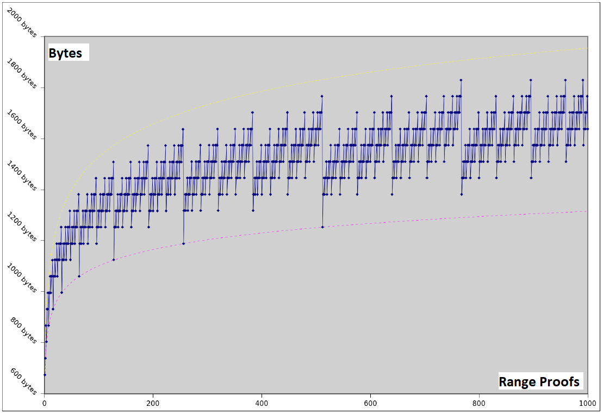

# Bulletproofs and Mimblewimble

## Introduction

Bulletproofs form part of the family of distinct Zero-knowledge Proof[def][zk~] systems, like Zero-Knowledge Succinct Non-Interactive ARguments of Knowledge (zk-SNARK), Succinct Transparent ARgument of Knowledge (STARK) and Zero Knowledge Prover and Verifier for Boolean Circuits (ZKBoo). Zero-knowledge proofs are designed so that a prover is able to indirectly verify that a statement is true without having to provide any information beyond the verification of the statement, for example to prove that a number is found that solves a cryptographic puzzle and fits the hash value without having to reveal the nonce[def][nonce~]. ([[2]], [[4]])

Bulletproofs is a Non-interactive Zero-knowledge (NIZK) proof protocol for general Arithmetic Circuits[def][ac~] with very short proofs (Arguments of Knowledge Systems[def][afs~]) and without requiring a Trusted Setup[def][ts~]. They rely on the Discrete Logarithmic[def][dlp~] assumption and are made non-interactive using the Fiat-Shamir Heuristic[def][fsh~]. The name 'Bulletproof' originated from a non-technical summary from one of the original authors of the scheme's properties: "<i>Short like a bullet with bulletproof security assumptions</i>". ([[1]], [[29]])

Bulletproofs also implements a Multi-party Computation (MCP) protocol whereby distributed proofs of multiple provers with secret committed values are aggregated into a single proof before the Fiat-Shamir challenge is calculated and sent to the verifier, thereby minimizing rounds of communication. Secret committed values will stay secret. ([[1]], [[6]])

The essence of Bulletproofs is its inner-product algorithm originally presented by Groth [[13]] and then further refined by Bootle et al. [[12]]. The algorithm provides an argument of knowledge (proof) of two binding vector Pedersen Commitments[def][pc~] that satisfy a given inner product relation, which is of independent interest (not related). Bulletproofs builds on these techniques, which yield communication efficient zero-knowledge proofs, but offer a further replacement for the inner product argument that reduces overall communication by a factor of three. ([[1]], [[29]])

Mimblewimble is a block chain designed for confidential transactions. The essence is that a Pedersen commitment to 0 can be viewed as an Elliptic Curve Digital Signature Algorithm (ECDSA) public key, and that for a valid confidential transaction the difference between outputs, inputs, and transaction fees must be 0. A prover constructing a confidential transaction can therefore sign the transaction with the difference of the outputs and inputs as the public key. This enables a greatly simplified blockchain in which all spent transactions can be pruned and new nodes can efficiently validate the entire blockchain without downloading any old and spent transactions. The block chain consists only of block-headers, remaining UTXOs with their range proofs and an unprunable transaction kernel per transaction. Mimblewimble also allows transactions to be aggregated before being committed to the block chain. [[1]]

## Contents

- [Bulletproofs and Mimblewimble](#Bulletproofs-and-mimblewimble)
  - [Introduction](#introduction)
  - [Contents](#contents)
  - [How does Bulletproofs work?](#how-does-Bulletproofs-work)
  - [Applications for Bulletproofs](#applications-for-Bulletproofs)
  - [Comparison to other Zero-knowledge Proof Systems](#comparison-to-other-zero-knowledge-proof-systems)
  - [Interesting Bulletproof Implementation Snippets](#interesting-bulletproof-implementation-snippets)
    - [Current & Past Efforts](#current--past-efforts)
    - [Wallet Reconstruction - Grin](#wallet-reconstruction---grin)
  - [Negatives](#negatives)
  - [Conclusions, Observations, Recommendations](#conclusions-observations-recommendations)
  - [Definition of Terms](#definition-of-terms)
  - [References](#references)
  - [Contributors](#contributors)

## How does Bulletproofs work?

The basis of confidential transactions are to replace the input and output amounts with Pedersen commitments. It is then publicly verifiable that the transactions balance (the sum of the committed inputs is greater than the sum of the committed outputs, and all outputs are positive) while keeping the specific committed amounts hidden, thus zero-knowledge. The transaction amounts must be encoded as $ integers \mspace{4mu} mod \mspace{4mu} q $, which can overflow, but to prevent this rangeproofs are used. Enter Bulletproofs. The essence of Bulletproofs is its ability to calculate proofs, including rangeproofs, from inner-products. The basic idea is to hide all the bits of the amount in a single vector Pedersen commitment, to prove that each bit satisfies $ x(x-1) = 0 $ and that they sum to some value $v$. These conditions are then expressed as an efficient simple inner product of small size that can work with Pedersen commitments. ([[1]], [[3]], [[5]])

Bulletproofs are made non-interactive using the Fiat-Shamir heuristic and only rely on the discrete logarithm assumption. What this means in practice is that Bulletproofs are compatible with any secure elliptic curve, which makes it extremely versatile. The proof sizes are short; only $ [2 \log_2(n) + 9] $ elements for the range proofs and $ [\log_2(n) + 13] $ elements for arithmetic circuit proofs. The logarithmic proof size additionally enables the *prover* to aggregate multiple range proofs into a single short proof, as well as to aggregate multiple range proofs from different parties into one proof (see **Figure 1**). ([[1]], [[3]], [[5]])

<b>Figure 1: Logarithmic Aggregate Bulletproofs Proof Sizes [[3]]</b>

In Bitcoin, approximately 50 million Unspent Transaction Outputs (UTXO) from approximately 22 million transactions would result in roughly 160GB of range proof data using the current systems, when using 52-bits to represent any value from 1 satoshi up to 21 million bitcoins. Aggregated Bulletproofs would reduce that data set to less than 17GB. [[1]]

In Mimblewimble the block chain grows with the size of the UTXO set. Using Bulletproofs as a drop-in replacement for range proofs in confidential transactions, the size would only grow with the number of transactions that have unspent outputs, thus much smaller than the size of the UTXO set. [[1]]

## Applications for Bulletproofs

Bulletproofs were designed for range proofs but they also generalize to arbitrary arithmetic circuits. What this means in practice is that Bulletproofs have wide application and can be efficiently used for many types of proofs.  ([[1]], [[3]], [[6]]) 

### Bulletproof Protocols

In [[1]] three protocols were suggested in using Bulletproofs (*see Appendix B for notations used*).

**Protocol 1 - Inner-product Argument ???**

Let inputs to the inner-product argument be independent generators $ g,h \in \mathbb G^n $, a scalar $ c \in \mathbb Z_p $, and $ P \in \mathbb G $. The argument lets the *prover* convince a *verifier* that the *prover* knows two vectors $ \mathbf{a}, \mathbf{b}  \in \mathbb Z^n_p $ such that $
P =g^ah^b $ and $ c = \langle \mathbf {a}, \mathbf {b} \rangle $. $ P $ is referred to as the binding vector commitment to $ \mathbf{a}, \mathbf{b} $. The inner product argument is an efficient proof system for the following relation:
$$
\{ (g,h \in \mathbb G^n \,\, , \,\, P \in \mathbb G \,\, , \,\, c \in \mathbb Z_p \,\, ; \,\,   \mathbf {a}, \mathbf {b}  \in \mathbb Z^n_p  ) \, : \,\,\, P =g^ah^b \, \wedge \, c = \langle \mathbf {a}, \mathbf {b} \rangle \} \mspace{100mu} (1)
$$

Relation (1) requires sending $ 2n $ elements to the *verifier*. In order to send only $ 2 \log 2 (n) $ elements  to the *verifier*, for a given $ P \in \mathbb G $, the *prover* proves that it has vectors $ \mathbf {a}, \mathbf {b} \in \mathbb Z^n_p $ for which $ P =g^ah^b \cdot u^{ \langle \mathbf {a}, \mathbf {b} \rangle } $. Here $ u \in \mathbb G $ is a fixed group element with an unknown discrete-log relative to $ g,h \in \mathbb G^n $. 
$$
\{ (g,h \in \mathbb G^n \,\, , \,\, u,P \in \mathbb G \,\, ; \,\, \mathbf {a}, \mathbf {b} \in \mathbb Z^n_p ) \, : \,\,\, P =g^ah^b \cdot u^{ \langle \mathbf {a}, \mathbf {b} \rangle } \} \mspace{100mu} (2)
$$

A proof system for relation (2) gives a proof system for (1) with the same complexity, thus only a proof system for relation (2) is required. Protocol 1 is then defined as the proof system for relation (2).

<b>Figure 2: Bulletproofs Protocol 1  [[1]]</b>

The element $ u $ is raised to a *verifier* chosen power $ x $ to ensure that the extracted vectors $ \mathbf {a}, \mathbf {b} $ from Protocol 2 satisfy $ c = \langle \mathbf {a}, \mathbf {b} \rangle $

**Protocol 2 - **

$ \ref{aaa} $ 

**Protocol 3 - **

**Protocol 4 - Multi-Exponentiation and Batch Verification**

### Use Cases

Some use cases of Bulletproofs are listed below, and note this list may not be exhaustive.

- Rangeproofs

  - Rangeproofs are proofs that a secret value, which has been encrypted or committed to, lies in a certain interval. It prevents any numbers coming near the magnitude of a large prime, say $ 2^{256} $, that can cause wrap around when adding a small number, e.g. proof that $ x \in [0,2^{52} - 1] $.
- Merkle proofs

  - In this context a full node (*verifier*) maintains a complete copy of the merkle tree and a thin node (*prover*) wants to be convinced that a certain transaction <code>t</code> is included in the merkle tree in some block <code>B</code> with block header <code>H</code>.  [[7]] This proof between the *verifier* and *prover* can be done with Bulletproofs as a NIZK.
- Proof of solvency

  - Proofs of solvency are a specialized application of merkle proofs; coins can be added into a giant merkle tree. It can then be proven that some outputs are in the merkle tree and that those outputs add up to some amount that the cryptocurrency exchange claims they have have control over without revealing any private information. A Bitcoin exchange with 2 million customers need approximately 18GB to prove solvency in a confidential manner using the Provisions protocol. Using Bulletproofs and its variant protocols proposed in [[1]] this size could be reduced to approximately 62MB.
- Multi-signatures with deterministic nonces

  - With Bulletproofs every signatory can prove that their nonce was generated deterministically. A sha256 arithmetic circuit could be used in a deterministic way to show that the de-randomized nonces were generated deterministically. This will still work if one signatory were to leave the conversation and rejoin later on, with no memory of interacting with the other parties they were previously interacting with.
- Scriptless Scripts

  - Scriptless scripts is a way to do smart contracts exploiting the linear property of Schnorr signatures, using an older form of zero-knowledge proofs called a sigma protocol. This can all be done with Bulletproofs, which could be extended to allow assets that are functions of other assets, i.e. crypto derivatives.
- Smart contracts and Crypto-derivatives
  - Traditionally, each privacy-preserving smart contract need a new trusted setup, but with Bulletproofs no trusted setup is needed. Verification time however is linear and it might be too complex to proof every step in a smart contract. The Refereed Delegation Model [[33]] has been proposed as an efficient protocol to verify smart contracts with pubic verifiability in the offline stage. The cost is logarithmic in the number of rounds and amount of communications, with the smart contract only doing one computation. A Bulletproof can be calculated as a short proof for the arbitrary computation in the smart contract, thereby creating privacy-preserving smart contracts. 

    

    
<b>Figure 2: Bulletproofs for Refereed Delegation Model  [[5]]</b>

  - Alice has some computation and wants to prove to Bob that she has done it correctly and has some secret inputs to this computation. It is possible to create a complex function that either evaluates to 1 if all secret inputs are correct and to 0 otherwise. Such a function can be encoded in an arithmetic circuit and can be implemented with Bulletproofs to proof that the transaction is valid.

- Verifiable shuffles

  - When a proof is needed that one list of values $[x_1, ... , x_n]$ is a permutation of a second list of values  $[y_1, ... , y_n]$ it is called a verifiable shuffle. It has many applications for example voting, blind signatures for untraceable payments, and solvency proofs. Currently the most efficient shuffle has size $O \sqrt{n}$. Bulletproofs can be used very efficiently to prove verifiable shuffles of size $O \log(n)$. 

    

    
<b>Figure 3: Bulletproofs for Verifiable Shuffles [[5]]</b>

- Batch verifications
  - Batch verifications can be done using various values and outputs from running the Bulletproofs Protocol 1 and Protocol 2. This has application where the *Verifier* needs to verify multiple (separate) range proofs at once, for example a block chain full node receiving a block of transactions needs to verify all transactions as well as range proofs. This batch verification is then implemented as one large multi-exponentiation; it is applied in order to reduce the number of expensive exponentiations.
  - 

## Comparison to other Zero-knowledge Proof Systems

The table below shows a high level comparison between Sigma Protocols (i.e. interactive public-coin protocols) and the different Zero-knowledge proof systems mentioned in this report. Bulletproofs is unique in that it is not interactive, has short proof size, does not require a trusted setup and is practical to implement. These attributes make Bulletproofs extremely desirable to use as rangeproofs in cryptocurrencies.

| Proof System         | Sigma Protocols | zk-SNARK        | STARK                                 | ZKBoo        | Bulletproofs   |
| -------------------- | --------------- | --------------- | ------------------------------------- | ------------ | -------------- |
| <b>Interactive</b>   | yes             | no              | no                                    | no           | no             |
| <b>Proof Size</b>    | long            | short           | shortish                              | long         | short          |
| <b>Prover</b>        | linear          | FFT             | FFT   (big memory requirement)        | efficient    | linear         |
| <b>Verifier</b>      | linear          | efficient       | efficient                             | efficient    | linear         |
| <b>Trusted Setup</b> | no              | required        | no                                    | no           | no             |
| <b>Practical</b>     | yes             | yes             | not   quite                           | somewhat     | yes            |
| <b>Assumptions</b>   | discrete   log  | non-falsifiable | quantum secure One-way Function (OWF) | discrete log | discrete   log |

## Interesting Bulletproof Implementation Snippets

### Current & Past Efforts

[[25]]

[[26]]

[[27]]

[[28]]

[[29]]

[[30]]

### Security Considerations

[[8]] and  [[9]] and [[11]]

[[14]] and [[31]] and [[32]]

### Wallet Reconstruction - Grin

See  [[35]]

"{**yeastplume** } Single commit bullet proofs appear to be working, which is all we need. The only think I think we're missing here from being able to use this implementation is the ability to store an amount within the rangeproof (for wallet reconstruction). From conversations with @apoelstra earlier, I believe it's possible to store 64 bytes worth of 'message' (not nearly as much as the current rangeproofs). We also need to be aware that we can't rely as much on the message hiding properties of rangeproofs when switching to bullet proofs."

- "{**yeastplume** } @apoelstra the amount, and quite possibly the switch commitment hash as well (or just a hash of the entire output) as per #207..."

"{**apoelstra**} Ok, I can get you 64 bytes without much trouble (xoring them into `tau_1` and `alpha` which are easy to extract from `tau_x` and `mu` if you know the original seed used to produce the randomness). I think it's possible to get another 32 bytes into `t` but that's way more involved since `t` is a big inner product." 

???

## Negatives

- A discrete-log attacker (*e.g. a bad actor employing a quantum computer*) would be able to exploit Bulletproofs to silently inflate any currency that used them. Bulletproofs are perfectly hiding (*i.e. confidential*), but only computationally binding (*i.e. not quantum resistant*). Unconditional soundness is lost due to the data compression being employed. ([[1]], [[5]], [[6]] and [[10]])
- 

## Conclusions, Observations, Recommendations

- Bünz B. et al [[1]] proposed that the switch commitment scheme defined by Ruffing T. et al. [[24]] can be used for Bulletproofs if doubts in the underlying cryptographic hardness (discrete log) assumption arise in future. The switch commitment scheme allows for a block chain with proofs that are currently only computationally binding to later switch to a proof system that is perfectly binding and secure against quantum adversaries, but weakening the perfectly hiding property as a drawback and slowing down all proof calculations. In this proposal all Pedersen commitments will be replaced with ElGamal Commitments[def][egc~] to move from computationally binding to perfectly binding. Bünz B. et al [[1]] also have further ideas about how the ElGamal commitments can possibly be enhanced to improve the hiding property to be statistical or perfect.
-  
- 

## References

[[1]] Bulletproofs: Short Proofs for Confidential Transactions and More, Blockchain Protocol Analysis and Security Engineering 2018, Bünz B. et al., http://web.stanford.edu/~buenz/pubs/Bulletproofs.pdf, Date accessed: 2018-09-18.

[1]: http://web.stanford.edu/~buenz/pubs/bulletproofs.pdf
"Bulletproofs: Short Proofs for Confidential Transactions 
and More, Blockchain Protocol Analysis and Security 
Engineering 2018, 
Bünz B. et al"

[[2]] Bullet Proofs (Transcript), Bitcoin Milan Meetup 2018-02-02, Andrew Poelstra, https://diyhpl.us/wiki/transcripts/2018-02-02-andrew-poelstra-Bulletproofs, Date accessed: 2018-09-10.

[2]: https://diyhpl.us/wiki/transcripts/2018-02-02-andrew-poelstra-bulletproofs
"Bullet Proofs (Transcript), 
Bitcoin Milan Meetup 2018-02-02, 
Andrew Poelstra"

[[3]] Bullet Proofs (Slides), Bitcoin Milan Meetup 2018-02-02, Andrew Poelstra, https://drive.google.com/file/d/18OTVGX7COgvnZ7T0ke-ajhMWwOHOWfKV/view, Date accessed: 2018-09-10.

[3]: https://drive.google.com/file/d/18OTVGX7COgvnZ7T0ke-ajhMWwOHOWfKV/view
"Bullet Proofs (Slides), 
Bitcoin Milan Meetup 2018-02-02, 
Andrew Poelstra"

[[4]] Decoding zk-SNARKs, https://medium.com/wolverineblockchain/decoding-zk-snarks-85e73886a040, Date accessed: 2018-09-17.

[4]: https://medium.com/wolverineblockchain/decoding-zk-snarks-85e73886a040
"Decoding zk-SNARKs" 

[[5]] Bulletproofs: Short Proofs for Confidential Transactions and More (Slides), Bünz B. et al., https://cyber.stanford.edu/sites/default/files/bpase18.pptx, Date accessed: 2018-09-18.

[5]: https://cyber.stanford.edu/sites/default/files/bpase18.pptx
"Bulletproofs: Short Proofs for Confidential Transactions 
and More (Slides), Blockchain Protocol Analysis and 
Security Engineering 2018, 
Bünz B. et al"

[[6]] Bulletproofs: Short Proofs for Confidential Transactions and More (Transcripts), Bünz B. et al., http://diyhpl.us/wiki/transcripts/blockchain-protocol-analysis-security-engineering/2018/Bulletproofs, Date accessed: 2018-09-18.

[6]: http://diyhpl.us/wiki/transcripts/blockchain-protocol-analysis-security-engineering/2018/bulletproofs
"Bulletproofs: Short Proofs for Confidential Transactions 
and More (Transcripts), Blockchain Protocol Analysis and 
Security Engineering 2018, 
Bünz B. et al"

[[7]] Merkle Root and Merkle Proofs, https://bitcoin.stackexchange.com/questions/69018/merkle-root-and-merkle-proofs, Date accessed: 2018-10-?.

[7]: https://bitcoin.stackexchange.com/questions/69018/merkle-root-and-merkle-proofs
"Merkle Root and Merkle Proofs"

[[8]] Bulletproofs audit: fundraising, https://forum.getmonero.org/22/completed-tasks/90007/Bulletproofs-audit-fundraising, Date accessed: 2018-10-23.

[8]: https://forum.getmonero.org/22/completed-tasks/90007/bulletproofs-audit-fundraising
"Bulletproofs audit: fundraising"

[[9]] The QuarksLab and Kudelski Security audits of Monero Bulletproofs are Complete, https://ostif.org/the-quarkslab-and-kudelski-security-audits-of-monero-Bulletproofs-are-complete, Date accessed: 2018-10-23.

[9]: https://ostif.org/the-quarkslab-and-kudelski-security-audits-of-monero-bulletproofs-are-complete
"The QuarksLab and Kudelski Security audits 
of Monero Bulletproofs are Complete"

[[10]] Bulletproofs presentation at Feb 2 Milan Meetup (Andrew Poelstra), Reddit, https://www.reddit.com/r/Bitcoin/comments/7w72pq/Bulletproofs_presentation_at_feb_2_milan_meetup, Date accessed: 2018-09-10.

[10]: https://www.reddit.com/r/Bitcoin/comments/7w72pq/bulletproofs_presentation_at_feb_2_milan_meetup
"Bulletproofs presentation at Feb 2 Milan 
Meetup (Andrew Poelstra), Reddit"

[[11]] The OSTIF and QuarksLab Audit of Monero Bulletproofs is Complete – Critical Bug Patched, https://ostif.org/the-ostif-and-quarkslab-audit-of-monero-Bulletproofs-is-complete-critical-bug-patched, Date accessed: 2018-10-23.

[11]: https://ostif.org/the-ostif-and-quarkslab-audit-of-monero-bulletproofs-is-complete-critical-bug-patched/
"The OSTIF and QuarksLab Audit of Monero 
Bulletproofs is Complete – Critical Bug Patched"

[[12]] Efficient zero-knowledge arguments for arithmetic circuits in the discrete log setting, Bootle J et al., Annual International Conference on the Theory and Applications of Cryptographic Techniques, pages 327-357. Springer, 2016., https://eprint.iacr.org/2016/263.pdf, Date accessed: 2018-09-21.

[12]: https://eprint.iacr.org/2016/263.pdf
"Efficient zero-knowledge arguments for arithmetic 
circuits in the discrete log setting, Bootle J et al."

[[13]] Linear Algebra with Sub-linear Zero-Knowledge Arguments, Groth J., https://link.springer.com/content/pdf/10.1007%2F978-3-642-03356-8_12.pdf, Date accessed: 2018-09-21.

[13]: https://link.springer.com/content/pdf/10.1007%2F978-3-642-03356-8_12.pdf
"Linear Algebra with Sub-linear Zero-Knowledge 
Arguments, Groth J."

[[14]] The XEdDSA and VXEdDSA Signature Schemes, Perrin T, 2016-10-20, https://signal.org/docs/specifications/xeddsa & https://signal.org/docs/specifications/xeddsa/xeddsa.pdf, Date accessed: 2018-10-23.

[14]: https://signal.org/docs/specifications/xeddsa
"The XEdDSA and VXEdDSA Signature Schemes"

[[15]] Confidential  Assets, Poelstra A. et al., Blockstream, https://blockstream.com/bitcoin17-final41.pdf, Date accessed: 2018-09-25.

[15]: https://blockstream.com/bitcoin17-final41.pdf
"Confidential  Assets,
Poelstra A. et al.,
Blockstream"

[[16]]  Wikipedia: Zero-knowledge Proof,  https://en.wikipedia.org/wiki/Zero-knowledge_proof, Date accessed: 2018-09-18. 

[16]: https://en.wikipedia.org/wiki/Zero-knowledge_proof
"Wikipedia - Zero-knowledge Proof"

[[17]] Wikipedia: Discrete logarithm, https://en.wikipedia.org/wiki/Discrete_logarithm, Date accessed: 2018-09-20.

[17]: https://en.wikipedia.org/wiki/Discrete_logarithm
"Wikipedia: Discrete logarithm"

[[18]] How to Prove Yourself: Practical Solutions to Identification and Signature Problems, Fiat A. et al., CRYPTO 1986: pp. 186-194, https://link.springer.com/content/pdf/10.1007%2F3-540-47721-7_12.pdf, Date accessed: 2018-09-20.

[18]: https://link.springer.com/content/pdf/10.1007%2F3-540-47721-7_12.pdf
"How to Prove Yourself: Practical Solutions to 
Identification and Signature Problems, 
Fiat A. et al."

[[19]] How not to Prove Yourself: Pitfalls of the Fiat-Shamir Heuristic and Applications to Helios, Bernhard D. et al., https://link.springer.com/content/pdf/10.1007%2F978-3-642-34961-4_38.pdf, Date accessed: 2018-09-20.

[19]: https://link.springer.com/content/pdf/10.1007%2F978-3-642-34961-4_38.pdf
"How not to Prove Yourself: Pitfalls of the 
Fiat-Shamir Heuristic and Applications to Helios, 
Bernhard D. et al."

[[20]] Mimblewimble Explained, https://www.weusecoins.com/mimble-wimble-andrew-poelstra/, Date accessed: 2018-09-10.

[20]: https://www.weusecoins.com/mimble-wimble-andrew-poelstra
"Mimblewimble Explained"

[[21]] Message hiding in Bulletproofs #721, https://github.com/mimblewimble/grin/issues/721, Date accessed: 2018-09-10.

[21]: https://github.com/mimblewimble/grin/issues/721
"Message hiding in Bulletproofs #721"

[[22]] pedersen-commitment: An implementation of Pedersen commitment schemes, https://hackage.haskell.org/package/pedersen-commitment, Date accessed: 2018-09-25.

[22]: https://hackage.haskell.org/package/pedersen-commitment
"Pedersen-commitment: An implementation
of Pedersen commitment schemes"

[[23]] Zero Knowledge Proof Standardization - An Open Industry/Academic Initiative, https://zkproof.org/documents.html, Date accessed: 2018-09-26.

[23]: https://zkproof.org/documents.html
"Zero Knowledge Proof Standardization - 
An Open Industry/Academic Initiative"

[[24]] Switch Commitments: A Safety Switch for Confidential Transactions, Ruffing T. et al., https://eprint.iacr.org/2017/237.pdf, Date accessed: 2018-09-26.

[24]: https://eprint.iacr.org/2017/237.pdf
"Switch Commitments: A Safety Switch 
for Confidential Transactions, 
Ruffing T. et al."

[[25]] GitHub: ElementsProject/secp256k1-zkp, Experimental Fork of libsecp256k1 with Support for Pedersen Commitments and Rangeproofs, https://github.com/ElementsProject/secp256k1-zkp, Date accessed: 2018-09-18.

[25]: https://github.com/ElementsProject/secp256k1-zkp
"GitHub: ElementsProject/secp256k1-zkp, Experimental 
Fork of libsecp256k1 with Support for Pedersen 
Commitments and Rangeproofs"

[[26]] GitHub: apoelstra/secp256k1-mw, Fork of libsecp-zkp `d78f12b` to Add Support for Mimblewimble Primitives, https://github.com/apoelstra/secp256k1-mw/tree/Bulletproofs, Date accessed: 2018-09-18.

[26]: https://github.com/apoelstra/secp256k1-mw/tree/bulletproofs
"GitHub: apoelstra/secp256k1-mw, Fork of libsecp-zkp 
`d78f12b` to Add Support for Mimblewimble Primitives"

[[27]] GitHub: bbuenz/BulletProofLib, Library for generating non-interactive zero knowledge proofs without trusted setup (Bulletproofs), https://github.com/bbuenz/BulletProofLib, Date accessed: 2018-09-18.

[27]: https://github.com/bbuenz/BulletProofLib
"GitHub: bbuenz/BulletProofLib, Library for generating 
non-interactive zero knowledge proofs without trusted 
setup (Bulletproofs)"

[[28]] GitHub: dalek-cryptography/Bulletproofs, A pure-Rust implementation of Bulletproofs using Ristretto, https://github.com/dalek-cryptography/Bulletproofs, Date accessed: 2018-09-18.

[28]: https://github.com/dalek-cryptography/bulletproofs
"GitHub: dalek-cryptography/Bulletproofs, A pure-Rust 
implementation of Bulletproofs using Ristretto"

[[29]] GitHub: adjoint-io/Bulletproofs, Bulletproofs are Short Non-interactive Zero-knowledge Proofs that Require no Trusted Setup, https://github.com/adjoint-io/Bulletproofs, Date accessed: 2018-09-10.

[29]: https://github.com/adjoint-io/bulletproofs
"GitHub: adjoint-io/Bulletproofs, Bulletproofs are Short
Non-interactive Zero-knowledge Proofs that Require 
no Trusted Setup"

[[30]] GitHub: mimblewimble/secp256k1-zkp, Fork of secp256k1-zkp for the Grin/MimbleWimble project, https://github.com/mimblewimble/secp256k1-zkp, Date accessed: 2018-09-18.

[30]: https://github.com/mimblewimble/secp256k1-zkp
"GitHub: mimblewimble/secp256k1-zkp, Fork of 
secp256k1-zkp for the Grin/MimbleWimble project"

[[31]] Climbing the elliptic learning curve (was: Re: Finalizing XEdDSA), https://moderncrypto.org/mail-archive/curves/2017/000846.html, Date accessed: 2018-10-23.

[31]: https://moderncrypto.org/mail-archive/curves/2017/000846.html
""Climbing the elliptic learning curve 
(was: Re: Finalizing XEdDSA)

[[32]] SafeCurves: choosing safe curves for elliptic-curve cryptography, http://safecurves.cr.yp.to/, Date accessed: 2018-10-23.

[32]: http://safecurves.cr.yp.to/
"SafeCurves: choosing safe curves for 
elliptic-curve cryptography"

[[33]] Two 1-Round Protocols for Delegation of Computation, Canetti R. et al., https://eprint.iacr.org/2011/518.pdf, Date accessed: 2018-10-?.

[33]: https://eprint.iacr.org/2011/518.pdf
"Two 1-Round Protocols for Delegation of Computation
Canetti R. et al."

[[34]] , , Date accessed: 2018-10-?.

[?]:  
""

[[35]] GitHub: mimblewimble/grin, Bulletproofs #273, https://github.com/mimblewimble/grin/issues/273, Date  accessed: 2018-09-10.

[35]: https://github.com/mimblewimble/grin/issues/273
"GitHub: mimblewimble/grin, Bulletproofs #273"

[[36]] Wikipedia: Commitment scheme, https://en.wikipedia.org/wiki/Commitment_scheme, Date accessed: 2018-09-26.

[36]: https://en.wikipedia.org/wiki/Commitment_scheme
"Wikipedia: Commitment scheme"

[[37]] Cryptography Wikia: Commitment scheme, http://cryptography.wikia.com/wiki/Commitment_scheme, Date accessed: 2018-09-26.

[37]: http://cryptography.wikia.com/wiki/Commitment_scheme
"Cryptography Wikia: Commitment scheme"

[[38]] Adjoint Inc. Documentation: Pedersen Commitment Scheme, https://www.adjoint.io/docs/cryptography.html#pedersen-commitment-scheme, Date accessed: 2018-09-27.

[38]: https://www.adjoint.io/docs/cryptography.html#pedersen-commitment-scheme
"Adjoint Inc. Documentation: 
Pedersen Commitment Scheme"

[[39]] Non-interactive and information-theoretic secure verifiable secret sharing, Pedersen T. et al., https://www.cs.cornell.edu/courses/cs754/2001fa/129.pdf, Date accessed: 2018-09-27.

[39]: https://www.cs.cornell.edu/courses/cs754/2001fa/129.pdf
"Non-interactive and information-theoretic
secure verifiable secret sharing, 
Pedersen T. et al."

[[40]] Assumptions Related to Discrete Logarithms: Why Subtleties Make a Real Difference, Sadeghi A et al., http://www.semper.org/sirene/publ/SaSt_01.dh-et-al.long.pdf, Date accessed: 2018-09-24.

[40]: http://www.semper.org/sirene/publ/SaSt_01.dh-et-al.long.pdf
"Assumptions Related to Discrete Logarithms: 
Why Subtleties Make a Real Difference, 
Sadeghi A et al." 

[[41]] Crypto Wiki: Cryptographic nonce, http://cryptography.wikia.com/wiki/Cryptographic_nonce, Date accessed: 2018-10-08.

[41]: http://cryptography.wikia.com/wiki/Cryptographic_nonce
"Crypto Wiki: Cryptographic nonce"

[[42]] Wikipedia: Cryptographic nonce, https://en.wikipedia.org/wiki/Cryptographic_nonce, Date accessed: 2018-10-08.

[42]: https://en.wikipedia.org/wiki/Cryptographic_nonce
"Wikipedia: Cryptographic nonce"

[[43]] Intensified ElGamal Cryptosystem (IEC), Sharma P. et al., International Journal of Advances in Engineering & Technology, Jan 2012, http://www.e-ijaet.org/media/58I6-IJAET0612695.pdf, Date accessed: 2018-10-09.

[43]: http://www.e-ijaet.org/media/58I6-IJAET0612695.pdf
"Intensified ElGamal Cryptosystem (IEC), Sharma P. et al.
International Journal of Advances in Engineering & Technology,
Jan 2012"

[[44]] On the Security of ElGamal Based Encryption, Tsiounis Y. et al., http://www-verimag.imag.fr/~plafourc/teaching/Elgamal.pdf, Date accessed: 2018-10-09.

[44]: http://www-verimag.imag.fr/~plafourc/teaching/Elgamal.pdf
"On the Security of ElGamal Based Encryption,
Tsiounis Y. et al."

[[45]] Wikipedia: Decisional Diffie–Hellman assumption, https://en.wikipedia.org/wiki/Decisional_Diffie%E2%80%93Hellman_assumption, Date accessed: 2018-10-09.

[45]: https://en.wikipedia.org/wiki/Decisional_Diffie%E2%80%93Hellman_assumption
"Wikipedia: Decisional Diffie–Hellman assumption"

[[50]] Elliptic Curve Cryptography: A gentle introduction, http://andrea.corbellini.name/2015/05/17/elliptic-curve-cryptography-a-gentle-introduction/, Date accessed: 2018-09-10.

[50]: http://andrea.corbellini.name/2015/05/17/elliptic-curve-cryptography-a-gentle-introduction
"Elliptic Curve Cryptography: A gentle introduction"

[[?]] , , Date accessed: 2018-10-?.

[?]:  
""

## Appendices

### Appendix A: Definition of Terms

Definitions of terms presented here are high level and general in nature. Full mathematical definitions are available in the cited references. 

- <u><i>Arithmetic Circuits</i></u>:An arithmetic circuit over a field and variables $ (a_1, ..., a_n) $ is a directed acyclic graph whose vertices are called gates. Arithmetic circuits can alternatively be described as a list of multiplication gates with a collection of linear consistency equations relating the inputs and outputs of the gates. [[29]]

[ac~]: #ac

"An arithmetic circuit over a field 
and variables (a1, ..., an) is a 
directed acyclic graph ..."

- <u><i>Argument of Knowledge System</i></u>:Proof systems with computational soundness like Bulletproofs are sometimes called argument systems. In this report the terms *proof* and *argument of knowledge* have exactly the same meaning and can be used interchangeably. [[29]]

[afs~]: #afs

"Proof systems with computational 
soundness like Bulletproofs are 
sometimes called argument systems."

- <u><i>Commitment Scheme</i></u>:A commitment scheme in a Zero-knowledge Proof[def][zk~] is a cryptographic primitive that allows a prover to commit to only a single chosen value/statement from a finite set without the ability to change it later (*binding* property) while keeping it hidden from a verifier (*hiding* property). Both *binding* and *hiding* properties are then further classified in increasing levels of security to be computational, statistical or perfect. No commitment scheme can at the same time be perfectly binding and perfectly hiding. ([[36]], [[37]])

[cs~]: #cs

"A commitment scheme in a 
zero-knowledge proof is a 
cryptographic primitive ..."

- <i><u>Discrete Logarithm/Discrete Logarithm Problem (DLP)</u></i>:In the mathematics of real numbers, the logarithm $ \log_b^a $ is a number $ x $ such that $ b^x=a $, for given numbers $ a $ and $ b $. Analogously, in any group  $ G $ , powers  $ b^k $ can be defined for all integers $ k $, and the discrete logarithm $ \log_ba $ is an integer $ k $ such that $ b^k=a $. Algorithms in public-key cryptography base their security on the assumption that the discrete logarithm problem over carefully chosen cyclic finite groups and cyclic subgroups of elliptic curves over finite fields has no efficient solution. ([[17]], [[40]])

[dlp~]: #dlp

"In the mathematics of the real 
numbers, the logarithm log_b(a) 
is a number x such that ..."

- <u><i>ElGamal Commitment/Encryption</i></u>:An ElGamal commitment is a Pedersen Commitment[def][pc~] with an additional commitment $ g^r $ to the randomness used. The ElGamal encryption scheme is based on the Decisional Diffe-Hellman (DDH) assumption and the difficulty of the DLP for finite fields.  The DDH assumption states that it is infeasible for a Probabilistic Polynomial-time (PPT) adversary to solve the DDH problem. (<i>**Note:** The ElGamal encryption scheme should not be confused with the ElGamal signature scheme.</i>) ([[1]], [[43]], [[44]], [[45]])

[egc~]: #egc

"An ElGamal Commitment is a 
Pedersen Commitment with
additional commitment  ..."

- <u><i>Fiat–Shamir Heuristic/Transformation</i></u>:The Fiat–Shamir heuristic is a technique in cryptography to convert an interactive public-coin protocol (Sigma protocol) between a prover and a verifier into a one-message (non-interactive) protocol using a cryptographic hash function.  ([[18]], [[19]])
  - The prover will use a <code>Prove()</code> algorithm to calculate a commitment $ A $ with a statement $ Y $ that is shared with the verifier and a secret witness value $ w $ as inputs. The commitment $ A $ is then hashed to obtain the challenge $ c $, which is further processed with the <code>Prove()</code> algorithm to calculate the response $ f $. The single message sent to the verifier then contains the challenge $ c $ and response $ f $.
  - The verifier is then able to compute the commitment $ A $ from the shared statement $ Y $, challenge $ c $ and response $ f $. The verifier will then use a <code>Verify()</code> algorithm to verify the combination of shared statement $ Y $, commitment $ A $, challenge $ c $ and response $ f $.
  - A weak Fiat–Shamir transformation can be turned into a strong Fiat–Shamir transformation if the hashing function is applied to the commitment $ A $ and shared statement $ Y $ to obtain the challenge $ c $ as opposed to only the commitment $ A $.

[fsh~]: #fsh

"The Fiat–Shamir heuristic is a 
technique in cryptography to 
convert an interactive ..."

- *<u>Nonce</u>*:In security engineering, nonce is an abbreviation of <i>**n**umber used **once**</i>. In cryptography, a nonce is an arbitrary number that can be used just once. It is often a random or pseudo-random number issued in an authentication protocol to ensure that old communications cannot be reused in replay attacks. ([[41]], [[42]])

[nonce~]: #nonce

"In security engineering, nonce is an 
abbreviation of number used once. 
In cryptography, a nonce is an arbitrary 
number  ..."

- <u><i>Pedersen Commitment</i></u>:Pedersen commitments are a system for making blinded non-interactive commitments to a value. ([[1]], [[15]], [[22]], [[38]], [[39]]).
  - The generalized Pedersen commitment definition follows (*see Appendix B for notations used*):
    - Let $ q $ be a large prime and $ p $ be a large safe prime such that $ p = 2q + 1 $ 
    - Let $ h $ be a random generator of cyclic group $ \mathbb G $ such that $ h $ is an element of $ \mathbb Z_q^* $ 
    - Let $ a $ be a random value and element of $ \mathbb Z_q^* $ and calculate $ g $ such that $ g = h^a $ 
    - Let $ r $ (the blinding factor) be a random value and element of $ \mathbb Z_p^* $ 
    - The commitment of value $ x $ is then determined by calculating $ C(x,r) = h^r g^x $ 
    - The generator $ h $ and resulting number $ g $ are known as the commitment bases, and should be shared along with $ C(x,r) $ with whomever wishes to open the value.
    - Pedersen commitments are also additionally homomorphic, such that for messages $ x_0 $ and $ x_1 $ and blinding factors $ r_0 $ and $ r_1 $ we have $ C(x_0,r_0) \cdot C(x_1,r_1) = C(x_0+x_1,r_0+r_1) $ 
  - Security attributes of the Pedersen Commitment scheme are perfectly *hiding* and computationally *binding*. An efficient implementation of the Pedersen Commitment will use secure Elliptic Curve Cryptography (ECC), which is based on the algebraic structure of elliptic curves over finite (prime) fields. 
  - Practical implementations usually consist of three algorithms: <code>Setup()</code> to set up the commitment parameters; <code>Commit()</code> to commit to the message using the commitment parameters and <code>Open()</code> to open and verify the commitment.

[pc~]: #pc

"A Pedersen Commitment scheme is a cryptographic
primitive that allows one to commit to a
secret value (or statement) without ..."

- <u><i>Trusted Setup</i></u>:???

[ts~]: #ts

- <u><i>Zero-knowledge Proof/Protocol</i></u>:In cryptography, a zero-knowledge proof/protocol is a method by which one party (the prover) can convince another party (the verifier) that a statement $ Y $ is true, without conveying any information apart from the fact that the prover knows the value of $ Y $. The proof system must be complete, sound and zero-knowledge. ([[16]], [[23]])
  - Complete: If the statement is true and both prover and verifier follow the protocol; the verifier will accept.
  - Sound: If the statement is false, and the verifier follows the protocol; the verifier will not be convinced.
  - Zero-knowledge: If the statement is true and the prover follows the protocol, the verifier will not learn any confidential information from the interaction with the prover apart from the fact that the statement is true.

[zk~]: #zk

"In cryptography, a zero-knowledge 
proof/protocol is a method by which 
one party (the prover) can convince ..."

- Term ?:Definition ?

[term?~]: #zk

"Definition ?  ..."

### Appendix B: Notations Used

The general notation of mathematical expressions when specifically referenced are listed here, based on [[1]].

- Let $ \mathbb G $ and $ \mathbb Q $ denote cyclic groups of prime order $ p $ and $ q $ respectively
- let $ \mathbb Z_p $ and $ \mathbb Z_q $ denote the ring of integers $ modulo \mspace{4mu} p $ and $ modulo \mspace{4mu} q $ respectively
- Let $ \mathbb Z_p^* $  denote $ \mathbb Z_p \setminus \lbrace 0 \rbrace $ and $ \mathbb Z_q^* $ denote $ \mathbb Z_q \setminus \lbrace 0 \rbrace $ 
- Let generators of $ \mathbb G $ be denoted by $ g, h, v, u \in \mathbb G $ 
- Let $ \mathbb G^n $ and $ \mathbb Z^n_p $ be vector spaces of dimension $ n $ over $ \mathbb G $ and $ \mathbb Z_p $ respectively
- Let $  \mathbf {a} \in \mathbb F^n $ be a vector with elements  $  a_1 \cdot b_1 \,  ,  \, . . .  \, , \,  a_n \cdot b_n \in F^n $ 
- Let $ \langle \mathbf {a}, \mathbf {b} \rangle = \sideset{}{_{i=1}^n} \sum {a_i \cdot b_i} $ denote the inner product between two vectors $  \mathbf {a}, \mathbf {b}  \in \mathbb F^n $ 
- Let $  \mathbf {a} \circ \mathbf {b} = (a_1 \cdot b_1 \,  ,  \, . . .  \, , \,  a_n \cdot b_n) \in \mathbb F^n $ denote the entry wise multiplication of two vectors $  \mathbf {a}, \mathbf {b}  \in \mathbb F^n $  
- Let $  \mathbf {a} \parallel \mathbf {b} $ denote the concatenation of two vectors; if $  \mathbf {a}  \in \mathbb Z_p^n $ and  $ \mathbf {b}  \in \mathbb Z_p^m $ then $ \mathbf {a} \parallel \mathbf {b}  \in \mathbb Z_p^{n+m} $ 
- Let $ p(X) = \sideset{}{_{i=0}^d} \sum { \mathbf {p_i} \cdot X^i} \in \mathbb Z_p^n [X] $ be a vector polynomial where each coefficient $ \mathbf {p_i} $ is a vector in $ \mathbb Z_p^n $ 
- Let $ \langle l(X),r(X) \rangle = \sideset{}{_{i=0}^d} \sum { \sideset{}{_{j=0}^i} \sum { \langle l_i,r_i \rangle \cdot X^{i+j}}} \in \mathbb Z_p [X]$ denote the inner product between two vector polynomials $l(X),r(X) $ 
- Let $ t(X)=\langle l(X),r(X) \rangle $, then the inner product is defined such that $ t(x)=\langle l(x),r(x) \rangle $ holds for all $ x \in \mathbb{Z_p} $ 
- Let $ C=g^a = \sideset{}{_{i=1}^n} \prod g_i^{a_i} \in \mathbb{G} $ be a binding (but not hiding) commitment to the vector $ \mathbf {a}  \in \mathbb Z_p^n $ where $  \mathbf {g} = (g_1 \, , \, ... \, , \, g_n) \in \mathbb G^n $. Given vector $ \mathbf {b}  \in \mathbb Z_p^n $ with non-zero entries, $  \mathbf {a} \circ \mathbf {b} $ is treated as a new commitment to $ C $. For this let $ g_i^\backprime =g_i^{(b_i^{-1})} $ such that $ C= \sideset{}{_{i=1}^n} \prod (g_i^\backprime)^{a_i \cdot b_i} $. The binding property of this new commitment is inherited from the old commitment.
- Let slices of vectors be defined as $  \mathbf {a_{[:l]}} = (a_1 \, , \, ... \, , \, a_l) \in \mathbb F^l \, , \,\,\,\,\ \mathbf {a_{[l:]}} = (a_{l+1} \, , \, ... \, , \, a_n) \in \mathbb F^{n-l}$  
- Let $ \mathbf {k}^n $ denote the vector containing the first $ n $ powers of $ k \in \mathbb Z_p^*$ such that  $ \mathbf {k}^n = (1,k,k^2, \, ... \, ,k^{n-1}) \in (\mathbb Z_p^*)^n $ 

## Contributors

- [https://github.com/hansieodendaal](https://github.com/hansieodendaal)
- ???
