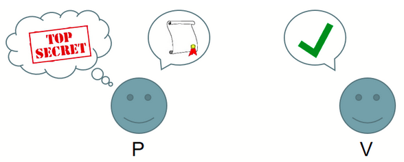
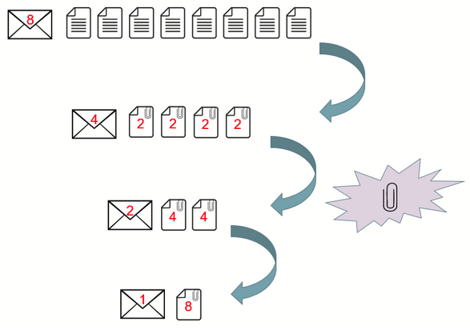
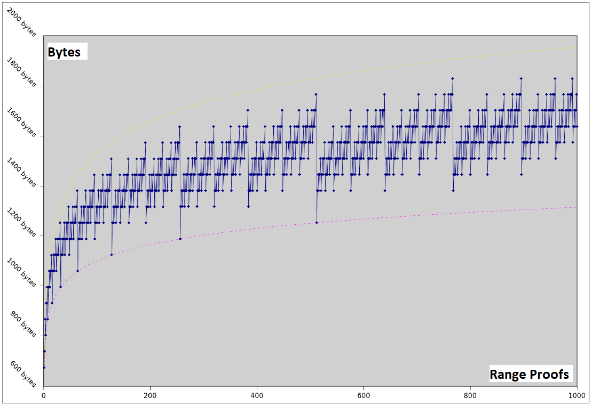

## Bulletproofs and Mimblewimble

"_Short like a bullet with bulletproof security assumptions_"

---

- Introduction
- Terminology Recap
- How do Bulletproofs work?
- Applications for Bulletproofs
- Comparison to other ZK Proof Systems
- Interesting Bulletproofs Implementation Snippets
  - Current & Past Efforts
  - Security Considerations
  - Wallet Reconstruction and Switch Commitment - Grin
- Conclusions

[See full report here](https://tlu.tarilabs.com/cryptography/bulletproofs-and-mimblewimble/MainReport.html)

---

## Introduction

- Bulletproofs form part of the family of distinct **Zero-knowledge (ZK)** proof systems, like zk-SNARK, STARK and ZKBoo.
- ZK proofs are designed that a _prover_ is able to indirectly verify a statement without providing any information beyond the verification of the statement, example to prove a number is found that solves a cryptographic puzzle and fits the hash value without having to reveal the **nonce**.
- Bulletproofs technology is a Non-interactive ZK (NIZK) proof protocol for general **Arithmetic Circuits** with very short proofs (arguments of knowledge) without a trusted setup. They rely on the **Discrete Logarithm (DLP)** assumption and are made non-interactive using the **Fiat-Shamir Heuristic**.
- The Bulletproofs Multi-party Computation (MPC) protocol provides aggregation of distributed proofs from multiple _provers_ with secret **committed values** into a single proof, before the Fiat-Shamir challenge is calculated and sent to the _verifier_, minimizing rounds of communication. Secret committed values stay secret.

---

- The essence of Bulletproofs is its inner-product algorithm, a proof for two independent _binding_ vector Pedersen Commitments (PC). Bulletproofs yield communication-efficient ZK proofs.
- [Mimblewimble](https://tlu.tarilabs.com/protocols/mimblewimble-1/sources/PITCHME.link.html) (MW) is a blockchain protocol designed for confidential transactions. The essence is that a PC to the number $0$ can be viewed as an Elliptic Curve (EC) Digital Signature Algorithm (ECDSA) public key, and for a valid confidential transaction the difference between outputs, inputs, and transaction fees must be $0$.
- In MW a _prover_ can sign transactions with the difference of outputs and inputs as the public key. Thus a greatly simplified blockchain in which all spent transactions are pruned, and new nodes efficiently validate the entire MW blockchain without downloading any old spent transactions.
- A MW blockchain consists only of block-headers, remaining UTXOs with range proofs and an unprunable transaction kernel per transaction. MW allows transactions to be aggregated before being committed to the blockchain.

---

## Terminology Recap

- Let $p​$ be a large prime number

- Let $\mathbb G​$ denote a cyclic group of prime order $p​$

- Let $\mathbb Z_p$ denote the ring of integers $modulo \mskip{6mu} p​$

- Let $\mathbb F_p$ be a group of elliptic curve points over a finite (prime) field

  Let $\mathbb G^n$ be the vector spaces of dimension $n$ over $\mathbb G$

- Let $\mathbf {a} \in \mathbb G^n$ be a vector with elements $a_1 \mskip{3mu} , \mskip{3mu} . . . \mskip{3mu} , \mskip{3mu} a_n \in \mathbb G$.

- Let $\langle \mathbf {a}, \mathbf {b} \rangle = \sum _{i=1}^n {a_i \cdot b_i}$ denote the inner-product between two vectors $\mathbf {a}, \mathbf {b} \in \mathbb G^n$

- If not otherwise specified, lower case $x,r,y​$ etc. are ordinary numbers (integers), upper case $H,G​$ are curve points

---

A **ZK proof/protocol** is a method by which the _prover_ can convince the _verifier_ that a statement $Y​$ is true without revealing any information. The proof system must be:

- **complete** (if statement true and _prover_ and _verifier_ follow protocol _verifier_ will accept),
- **sound** (if statement false and _verifier_ follows protocol _verifier_ will not accept) and
- **ZK** (if statement is true and _prover_ follows protocol, _verifier_ will not learn any confidential information except that statement $Y$ is true).

---

The **Discrete Logarithm Problem** (DLP) with $\log_ba = k$ such that $b^k=a$ for any integer $k$ where $a,b \in \mathbb G$ is hard to guess (no efficient solution) for carefully chosen $\mathbb F_p$.

---

A **commitment scheme** in a ZK proof is a cryptographic primitive that allows a _prover_ to commit to only a single chosen value/statement from a finite set without the ability to change it later (_binding_ property) while keeping it hidden from a verifier (_hiding_ property).

Both _binding_ and _hiding_ properties are classified in increasing levels of security to be _computational_, _statistical_ or _perfect_. No commitment scheme can at the same time be perfectly _binding_ and perfectly _hiding_.

Nonce is an abbreviation of "**n**umber used **once**". In cryptography, a nonce is an arbitrary number that can be used just once. It is often a random or pseudo-random number issued in an authentication protocol to ensure that old communications cannot be reused in replay attacks.

---

An **arithmetic circuit** $C$ over a field $F$ and $(x_1, ..., x_n)$ is a directed acyclic graph whose vertices are called gates. Linear consistency equations relate the inputs and outputs of the (addition and multiplication) gates.

The size is the number of gates in it, with the depth being the length of the longest directed path. _Upper bounding_ the complexity of a polynomial $f$ is to find any arithmetic circuit that can calculate $f$, whereas _lower bounding_ is to find the smallest arithmetic circuit that can calculate $f​$.

Arithmetic circuit example with size 6 and depth 2 that calculates a polynomial:

---

The **Fiat–Shamir Heuristic** is a cryptographic technique to convert an interactive public-coin protocol (Sigma protocol) between a _prover_ and a _verifier_ into a non-interactive protocol using a cryptographic hash function.

- _Prover_ uses a **Prove()** algorithm to calculate commitment $A$ with a statement $Y$ that is shared with the _verifier_ and a secret witness value $w$ as inputs. Commitment $A$ is hashed to obtain challenge $c$, then further processed with **Prove()** to calculate response $f$. Single message sent to _verifier_ contains challenge $c$ and response $f​$.
- _Verifier_ is able to compute commitment $A$ from shared statement $Y$, challenge $c$ and response $f$. _Verifier_ then uses a **Verify()** algorithm to verify combination of $Y$, $A$, $c$ and $f$.
- A weak Fiat–Shamir transformation can be turned into a strong Fiat–Shamir transformation if the hashing function is applied to $A$ and $Y$ to obtain $c$ as opposed to only $A$.

---

The **Elliptic Curve (EC) PC** to value $x \in \mathbb Z_p$ with $r \in \mathbb Z_p$ a random blinding factor is

$$
C(x,r) = xH + rG
$$

Here $G \in \mathbb F_p$ is a random generator point and $H \in \mathbb F_p$ specially chosen so that $x_H$ satisfying $H = x_H G$ cannot be found except if the EC DLP is solved. In secp256k1 $H$ is the SHA256 hash of simple encoded $x$-coordinate of generator point $G$. The number $H$ is known as a Nothing Up My Sleeve (NUMS) number.

---

EC PCs are also additionally homomorphic, such that for messages $x, x_0, x_1$, blinding factors $r, r_0, r_1$ and scalar $k$ the following relations hold:

$$
\begin{aligned}
C(x_0,r_0) + C(x_1,r_1) &= C(x_0+x_1,r_0+r_1) \\
C(k \cdot x, k \cdot r) &= k \cdot C(x, r)
\end{aligned}
$$

Implementation uses 3 algorithms: **`Setup()`** to set up the commitment parameters $G$ and $H$; **`Commit()`** to commit to the message $x$ using the commitment parameters $r$, $H$ and $G$ and **`Open()`** to open and verify the commitment.

---

An `ElGamal Commitment` is a PC with an additional commitment $g^r$ to the randomness used. The ElGamal encryption scheme is based on the Decisional Diffie-Hellman (DDH) assumption and the difficulty of the DLP for finite fields. The DDH assumption states that it is infeasible for a Probabilistic Polynomial-time (PPT) adversary to solve the DDH problem.

<!-- (_**Note:** Not the same as the ElGamal signature scheme._) -->

---

## How do Bulletproofs work?

The basis of confidential transactions is to replace input and output amounts with PCs. It is then publicly verifiable that the transactions balance and all outputs are positive, while keeping the specific committed amounts hidden. The transaction amounts are encoded as $[integers \mod q]​$, which can overflow, but is prevented by making use of range proofs. Enter Bulletproofs.

The basic idea is to hide all the bits of the amount $x$ to be committed to in a single vector PC, to prove that each bit satisfies $\omega(\omega-1) = 0$, that is each $\omega$ is either $0$ or $1$, and that they sum to $x$.

These conditions are then expressed as an efficient simple inner product of small size that can work with Pedersen Commitments.

The essence of Bulletproofs are their ability to calculate proofs, including range proofs, from inner-products.

---

The _prover_ $\mathcal{P}$ must convince _verifier_ $\mathcal{V}$ that commitment $C(x,r) = xH + rG$ contains a number such that $x \in [0,2^n - 1]$. If $\mathbf {a}_L = (a_1 \mskip{3mu} , \mskip{3mu} ... \mskip{3mu} , \mskip{3mu} a_n) \in \{0,1\}^n$` is the vector containing the bits of $x$ so then the following must be proven:

$$
\langle \mathbf {a}_L \mskip{3mu} , \mskip{3mu} \mathbf {2}^n \rangle = v \mskip{20mu} \mathrm{and} \mskip{20mu} \mathbf {a}_R = \mathbf {a}_L - \mathbf {1}^n \mskip{20mu} \mathrm{and} \mskip{20mu} \mathbf {a}_L \circ \mathbf {a}_R = \mathbf{0}^n \mskip{100mu} (1)
$$

If the _verifier_ $\mathcal{V}$ sends a random linear combination of the constraints $y \in \mathbb{Z*p} $ and $ z \in \mathbb{Z_p}$ to the \_prover\* $\mathcal{P}$ the following can be constructed for (1):

$$
\begin{aligned}
\langle \mathbf {a}_L - z \cdot \mathbf {1}^n \mskip{3mu} , \mskip{3mu} \mathbf {y}^n \circ (\mathbf {a}_R + z \cdot \mathbf {1}^n) +z^2 \cdot \mathbf {2}^n \rangle = z^2 \cdot v + \delta (y,z) &\mskip{30mu} (2) \\
\delta (y,z) = (z-z^2) \cdot \langle \mathbf {1}^n \mskip{3mu} , \mskip{3mu} \mathbf {y}^n\rangle -z^3 \cdot \langle \mathbf {1}^n \mskip{3mu} , \mskip{3mu} \mathbf {2}^n\rangle \in \mathbb{Z_p} &\mskip{30mu}
\end{aligned}
$$

Only important thing to note here is that (2) contains a single inner-product identity containing the bits of $x$ in 2 vectors. Introducing blinding vectors for $\mathbf {a}_L$ and $\mathbf {a}_R$, vector PCs can be constructed.

---

These vectors have size $n$ that would require many expensive exponentiations. However, they are reduced interactively (_with a logarithmic number of rounds_) by the _prover_ $\mathcal{P}$ and _verifier_ $\mathcal{V}$ into a single multi-exponentiation of size $2n + 2 \log_2(n) + 1$ (_can be calculated much faster than $n$ separate ones_).

**How this works:** The PC scheme allows us to cut a vector in half and compress the two halves together, each time calculating a new set of PC generators. Applying the same trick repeatedly $\log _2 n$ times produces a single value.

---

The logarithmic proof size enables the _prover_ $\mathcal{P}​$ to aggregate multiple range proofs into a single short proof, and to aggregate multiple range proofs from different parties into one proof.

---

Recent implementation of Bulletproofs in Monero on 2018/10/18 saw the average data size on the blockchain per payment reduce by ~73% and the average US$-based fees reduce by ~94.5% for the period 2018/08/30 to 2018/11/28.

---

## Applications for Bulletproofs

Bulletproofs were designed for range proofs but they also generalize to arbitrary arithmetic circuits, thus have wide application in practice.

- Range proofs
  - Proof that a secret committed value lies in a certain interval, say $x \in [0,2^{52} - 1]$), and prevents numbers coming near a large prime, say $2^{256}​$, to wrap around when adding a small number.
- Merkle proofs
  - Hash preimages in a Merkle tree can be leveraged to create zero-knowledge Merkle proofs using Bulletproofs, to create efficient proofs of inclusion in massive data sets.
- Proof of solvency
  - Coins can be added into a giant Merkle tree with confidential proof that some outputs are in the Merkle tree and that those outputs add up to some amount. A Bitcoin exchange needs ~18GB proof of solvency for $2,000,000$ customers; this could be reduced to ~62MB.

---

- Smart contracts and Crypto-derivatives

  - Traditionally, a new trusted setup is needed for each smart contract when verifying privacy-preserving smart contracts. The Refereed Delegation Model makes use of a specific verification circuit linked to a smart contract. A _challenger_ will input the proof to the verification circuit and get a binary response as to the validity of the proof. A Bulletproof can be calculated as a short proof for the arbitrary computation in the smart contract, thereby creating privacy-preserving smart contracts.

---

- Multi-signatures with deterministic nonces
  - With Bulletproofs every signatory can prove that their nonce was generated deterministically. This will still work if one signatory were to leave the conversation and re-join later, with no memory of interacting.
- Verifiable shuffles
  - Proof that one list of values $[x_1, ... , x_n]$ is a permutation of a 2nd list $[y_1, ... , y_n]$.
  - Alice has some computation and wants to prove to Bob that she has done it correctly and has some secret inputs to this computation. Possible to create a complex function that evaluates to 1 if all secret inputs are correct and to 0 otherwise. This can be encoded in an arithmetic circuit and can be implemented with Bulletproofs.
  - A potential use case is to verify that two nodes executed the same list of independent instructions $[x1,x4,x3,x2]$ and $[x1,x2,x3,x4 $, that may be in different order, to arrive at the same next state $N$. The nodes don't need to share the actual instructions with a _Verifier_, but the _Verifier_ can show that they executed the same set without knowing the instructions.

---

- Verifiable shuffles (_cont'd_)

  - Some other applications are voting, blind signatures for untraceable payments, and solvency proofs. Bulletproofs can be used efficiently to prove verifiable shuffles of size $O \log(n)$ - previously size $O \sqrt{n}​$.

- Scriptless Scripts
  - ZK Sigma protocols for Scriptless scripts exploiting the linear property of Schnorr signatures can be done with Bulletproofs.

---

## Comparison to other ZK Proof Systems

| System                           | Sigma        | zk-SNARK               | STARK                                         | ZKBoo                   | Bulletproofs |
| -------------------------------- | ------------ | ---------------------- | --------------------------------------------- | ----------------------- | ------------ |
| **Interactive**                  | yes          | **_no_**               | **_no_**                                      | **_no_**                | **_no_**     |
| **Proof Size**                   | long         | **_short_**            | shortish                                      | long                    | **_short_**  |
| **Prover Runtime Scalability**   | **_linear_** | quasilinear            | quasilinear (big memory requirement)          | **_linear_**            | **_linear_** |
| **Verifier Runtime Scalability** | linear       | _efficient_            | **_efficient_ (_poly-logarithmically_)**      | **_efficient_**         | linear       |
| **Trusted**                      | **_no_**     | required               | **_no_**                                      | **_no_**                | **_no_**     |
| **Practical**                    | **_yes_**    | **_yes_**              | not quite                                     | somewhat                | **_yes_**    |
| **Security Assumptions**         | **_DL_**     | non-falsifiable (< DL) | **_quantum secure one-way function (>> DL)_** | **_similar to STARKs_** | **_DL_**     |

---

## Interesting Bulletproofs Snippets

Bulletproofs development still evolving. Different implementations also offer different levels of efficiency, security and functionality.

### Current & Past Efforts

Initial work that provided cryptographic support for Mimblewimble mainly done at `ElementsProject/secp256k1-zkp`. Fork `apoelstra/secp256k1-mw` added Mimblewimble primitives and support for many of the Bulletproof protocols (e.g. zero knowledge proofs, range proofs and arithmetic circuits). Current effort also involves MuSig support.

The Grin project (Mimblewimble in Rust) forked `ElementsProject/secp256k1-zkp` as `mimblewimble/secp256k1-zkp` and added Rust wrappers as `mimblewimble/rust-secp256k1-zkp` for their blockchain. The Beam project (Mimblewimble in C++) link directly to `ElementsProject/secp256k1-zkp`.

---

Implementation for Bulletproof range proofs done for the Monero project (CryptoNote in C++) in Java as the pre-cursor and in C++ as the final implementation. Supports single and aggregate range proofs.

Adjoint, Inc. did an implementation of Bulletproofs in Haskell at `adjoint-io/bulletproofs`.

Chain/Interstellar did an implementation of Bulletproofs in Rust from the ground up at `dalek-cryptography/bulletproofs`. They implemented parallel Edwards formulas using Intel® Advanced Vector Extensions 2 (AVX2) to accelerate curve operations. Initial testing suggests approximately 50% speedup (twice as fast) over the original `libsecp256k1`-based Bulletproofs implementation.

---

### Security Considerations

Real world implementation of ECC largely based on official standards that try and make the ECDLP hard to solve. Many attacks break real-world ECC without solving ECDLP due to problems in ECC security, where implementations can produce incorrect results and also leak secret data. Some implementation considerations also favor efficiency over security.

Grin, Beam and Adjoint use ECC curve secp256k1 for their Bulletproofs, which fails 1 out of the 4 ECDLP security criteria and 3 out of the 4 ECC security criteria. Monero and Chain/Interstellar use the ECC curve Curve25519 for their Bulletproofs, which passes all ECDLP and ECC security criteria.

Chain/Interstellar use Ristretto, which allows an existing Curve25519 library to implement a prime-order group with only a thin abstraction layer. Makes it possible for systems using Ed25519 signatures to be safely extended with zero-knowledge protocols.

The Monero project had security audits done on their Bulletproofs' that resulted in a number of serious and critical bug fixes as well as some other code improvements.

---

### Wallet Reconstruction and Switch Commitment - Grin

Grin implemented a switch commitment as part of a Tx output to be ready for the age of quantum adversaries and to pose as defense mechanism. It uses Bulletproof range proof rewinding so that wallets can recognize their own transaction outputs.

It looks exactly like the original PC $vG + bH$ but the blinding factor $b$ is tweaked to be

$$
b = b^\prime + \mathrm{H_{B2}} ( vG + b^\prime H \mskip{3mu} , \mskip{3mu} b^\prime J )
$$

The PC then becomes

$$
vG + b^\prime H + \mathrm{H_{B2}} ( vG + b^\prime H \mskip{3mu} , \mskip{3mu} b^\prime J ) H
$$

After activation users can reveal $( vG + b^\prime H \mskip{3mu} , \mskip{3mu} b^\prime J )$ and _Verifiers_ can check if it's computed correctly and use it as if it were the ElGamal Commitment $( vG + b H \mskip{3mu} , \mskip{3mu} b J )$.

---

## Conclusions

- Bulletproofs are not Bulletproofs are not Bulletproofs. This is evident by comparing the functionality, security and performance of all the current different Bulletproof implementations as well as the evolving nature of Bulletproofs.

- The security audit instigated by the Monero project on their Bulletproofs implementation and the resulting findings and corrective actions prove that every implementation of Bulletproofs has potential risk. This risk is due to the nature of confidential transactions; transacted values and token owners are not public.

- The growing number of open source Bulletproof implementations should strengthen the development of a new confidential blockchain protocol like Tari.

---

- In the pure implementation of Bulletproof range proofs, a discrete-log attacker (_e.g. a bad actor employing a quantum computer_) would be able to exploit Bulletproofs to silently inflate any currency that used them. Bulletproofs are perfectly hiding (_i.e. confidential_), but only computationally _binding_ (_i.e. not quantum resistant_). Unconditional soundness is lost due to the data compression being employed.

- Bulletproofs are not only about range proofs. All the different Bulletproof use cases have a potential implementation in a new confidential blockchain protocol like Tari; in the base layer as well as in the probable 2nd layer.
