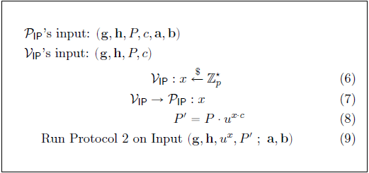
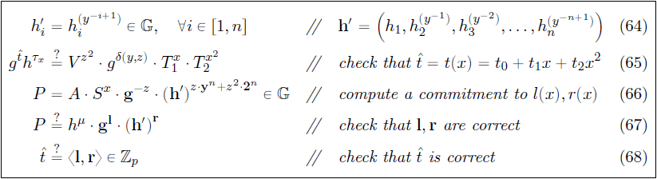

# The Bulletproof Protocols

- [Introduction](#introduction)
- [Preliminaries](#preliminaries)
  - [Notation Used](#notation-used)
  - [Pedersen Commitments and Elliptic Curve Pedersen Commitments](#pedersen-commitments-and-elliptic-curve-pedersen-commitments)
  - [Security Aspects of (Elliptic Curve) Pedersen Commitments](#security-aspects-of-elliptic-curve-pedersen-commitments)
- [Bulletproof Protocols](#bulletproof-protocols-1)
  - [Inner-product Argument (Protocol 1)](#inner-product-argument-protocol-1)
  - [How Proof System for Protocol 1 Works, Shrinking by Recursion](#how-proof-system-for-protocol-1-works-shrinking-by-recursion)
  - [Inner-product Verification through Multi-exponentiation (Protocol 2)](#inner-product-verification-through-multi-exponentiation-protocol-2)
  - [Range Proof Protocol with Logarithmic Size](#range-proof-protocol-with-logarithmic-size)
    - [Inner-product Range Proof](#inner-product-range-proof)
    - [Logarithmic Range Proof](#logarithmic-range-proof)
    - [Aggregating Logarithmic Proofs](#aggregating-logarithmic-proofs)
    - [Non-interactive Proof through Fiat-Shamir Heuristic](#non-interactive-proof-through-fiat-shamir-heuristic)
    - [MPC Protocol for Bulletproofs](#mpc-protocol-for-bulletproofs)
    - [MPC Protocol Security Discussion](#mpc-protocol-security-discussion)
  - [Zero-knowledge Proof for Arithmetic Circuits](#zero-knowledge-proof-for-arithmetic-circuits)
    - [Inner-product Proof for Arithmetic Circuits (Protocol 3)](#inner-product-proof-for-arithmetic-circuits-protocol-3)
    - [Logarithmic-sized Non-interactive Protocol for Arithmetic Circuits](#logarithmic-sized-non-interactive-protocol-for-arithmetic-circuits)
  - [Optimized Verifier using Multi-exponentiation and Batch Verification](#optimized-verifier-using-multi-exponentiation-and-batch-verification)
    - [Multi-exponentiation](#multi-exponentiation)
    - [Batch Verification](#batch-verification)
- [Evolving Bulletproof Protocols](#evolving-bulletproof-protocols)
- [Conclusions, Observations and Recommendations](#conclusions-observations-and-recommendations)
- [References](#references)
- [Appendices](#appendices)
  - [Appendix A: Definition of Terms](#appendix-a-definition-of-terms)
- [Contributors](#contributors)

## Introduction

The overview of Bulletproofs given in [Bulletproofs and Mimblewimble](../bulletproofs-and-mimblewimble/MainReport.md) 
was largely based on the original work done by Bünz et al. [[1]]. They documented a number of 
different Bulletproof protocols, but not all of them in an obvious manner. This report summarizes and explains the 
different Bulletproof protocols as simply as possible. It also simplifies the logic and explains the base 
mathematical concepts in more detail where prior knowledge was assumed. The report concludes with a discussion on an 
improved Bulletproof zero-knowledge proof protocol provided by some community members following an evolutionary approach.

## Preliminaries

### Notation Used

This section gives the general notation of mathematical expressions when specifically referenced, based on [[1]]. This
notation provides important pre-knowledge for the remainder of the report.

- Let $ p $ and $ q ​$ be large prime numbers.
- Let $ \mathbb G ​$ and $ \mathbb Q ​$ denote cyclic groups of prime order 
$ p ​$ and $ q ​$ respectively. 
- let $ \mathbb Z_p ​$ and $ \mathbb Z_q ​$ denote the ring of integers 
$ modulo \mspace{4mu} p ​$ and $ modulo \mspace{4mu} q ​$ respectively.
- Let generators of $ \mathbb G $ be denoted by $ g, h, v, u \in \mathbb G $, i.e. there exists a number 
$ g \in \mathbb G  $ such that $  \mathbb G  = \lbrace 1 \mspace{3mu} , \mspace{3mu} g \mspace{3mu} , 
\mspace{3mu} g^2 \mspace{3mu} , \mspace{3mu} g^3 \mspace{3mu} , \mspace{3mu} ... \mspace{3mu} , \mspace{3mu}  g^{p-1} 
\rbrace \equiv  \mathbb Z_p $. Note that not every element of $ \mathbb Z_p $ is a generator of $ \mathbb G $.
- Let $ \mathbb Z_p^* $ denote $ \mathbb Z_p \setminus \lbrace 0 \rbrace $ and $ \mathbb Z_q^* $ denote 
$ \mathbb Z_q \setminus \lbrace 0 \rbrace $, i.e. all invertible elements of $ \mathbb Z_p $ and $ \mathbb Z_q $ 
respectively. This excludes the element $ 0 ​$, which is not invertible.
- Let $ \mathbb G^n $ and $ \mathbb Z^n_p $ be vector spaces of dimension 
$ n $ over $ \mathbb G $ and $ \mathbb Z_p $ respectively.
- Let $ h^r \mathbf g^\mathbf x = h^r \prod_i g_i^{x_i} \in \mathbb G ​$ be the vector Pedersen 
Commitment[def][pc~] with 
$ \mathbf {g} = (g_1 \mspace{3mu} , \mspace{3mu} ... \mspace{3mu} , 
\mspace{3mu} g_n) \in \mathbb G^n ​$ and $ \mathbf {x} = (x_1 \mspace{3mu} , \mspace{3mu} ... \mspace{3mu} , 
\mspace{3mu} x_n) \in \mathbb G^n ​$. 
- Let $ \mathbf {a} \in \mathbb F^n ​$ be a vector with elements 
$ a_1 \mspace{3mu} , \mspace{3mu} . . . \mspace{3mu} , 
\mspace{3mu} a_n \in \mathbb F ​$. 
- Let $ \langle \mathbf {a}, \mathbf {b} \rangle = 
\sum _{i=1}^n {a_i \cdot b_i} ​$ denote the inner-product between two 
vectors $ \mathbf {a}, \mathbf {b} \in \mathbb F^n ​$. 
- Let $ \mathbf {a} \circ \mathbf {b} = 
(a_1 \cdot b_1 \mspace{3mu} , \mspace{3mu} . . . \mspace{3mu} , 
\mspace{3mu} a_n \cdot b_n) \in \mathbb F^n ​$ denote the entry wise multiplication of two vectors $ \mathbf {a}, 
\mathbf {b} \in \mathbb F^n ​$. 
- Let $ \mathbf {A} \circ \mathbf {B} = 
(a_{11} \cdot b_{11} \mspace{3mu} , \mspace{3mu} . . . \mspace{3mu} , 
\mspace{3mu} a_{1m} \cdot b_{1m} \mspace{6mu} ; \mspace{6mu} . . . \mspace{6mu} ; \mspace{6mu} a_{n1} \cdot b_{n1} 
\mspace{3mu} , \mspace{3mu} . . . \mspace{3mu} , \mspace{3mu} a_{nm} \cdot b_{nm} ) $ denote the entry wise 
multiplication of two matrixes, also known as the Hadamard 
Product[def][hdmp~]. 
- Let $ \mathbf {a} \parallel \mathbf {b} ​$ denote the concatenation of two vectors; if 
$ \mathbf {a} \in \mathbb Z_p^n ​$ 
and $ \mathbf {b} \in \mathbb Z_p^m ​$ then $ \mathbf {a} \parallel \mathbf {b} \in \mathbb Z_p^{n+m} ​$. 
- Let $ p(X) = \sum _{i=0}^d { \mathbf {p_i} \cdot X^i} \in \mathbb Z_p^n [X] $ be a vector polynomial where each 
coefficient $ \mathbf {p_i} $ is a vector in $ \mathbb Z_p^n $. 
- Let $ \langle l(X),r(X) \rangle = 
\sum _{i=0}^d { \sum _{j=0}^i { \langle l_i,r_i \rangle \cdot X^{i+j}}} \in 
\mathbb Z_p [X] $ denote the inner-product between two vector 
polynomials $ l(X),r(X) $. 
- Let $ t(X)=\langle l(X),r(X) \rangle $, then the inner-product is defined such that $ t(x)=\langle l(x),r(x) 
\rangle $ holds for all $ x \in \mathbb{Z_p} $. 
- Let $ C=g^a = \prod _{i=1}^n g_i^{a_i} \in \mathbb{G} $ be a binding (but not hiding) commitment to the vector 
$ \mathbf {a} \in \mathbb Z_p^n $ where $ \mathbf {g} = 
(g_1 \mspace{3mu} , \mspace{3mu} ... \mspace{3mu} , 
\mspace{3mu} g_n) \in \mathbb G^n $. Given vector $ \mathbf {b} \in \mathbb Z_p^n $ with non-zero entries, 
$ \mathbf {a} \circ \mathbf {b} $ is treated as a new commitment to $ C $. For this let 
$ g_i^\backprime =g_i^{(b_i^{-1})} $ such that 
$ C= \prod _{i=1}^n (g_i^\backprime)^{a_i \cdot b_i} $. The binding property of this new commitment is inherited from 
the old commitment.
- Let $ \mathbf a \_{[:l]} = ( a_1 \mspace{3mu} , \mspace{3mu} . . . \mspace{3mu} , \mspace{3mu} a_l ) \in \mathbb F ^ l$ 
and $  \mathbf a \_{[l:]} = ( a_{1+1} \mspace{3mu} , \mspace{3mu} . . . \mspace{3mu} , \mspace{3mu} a_n ) 
\in \mathbb F ^ {n-l} $ be slices of vectors for $ 0 \le l \le n $ (using Python notation). 
- Let $ \mathbf {k}^n $ denote the vector containing the first $ n $ powers of $ k \in \mathbb Z_p^* $ such that 
$ \mathbf {k}^n = (1,k,k^2, \mspace{3mu} ... \mspace{3mu} ,k^{n-1}) \in (\mathbb Z_p^*)^n $. 
- Let $ \mathcal{P} $ and $ \mathcal{V} $ denote the *prover* and *verifier* respectively.
- Let $ \mathcal{P_{IP}} $ and $ \mathcal{V_{IP}} ​$ denote the *prover* and *verifier* in relation to inner-product 
calculations respectively.

### Pedersen Commitments and Elliptic Curve Pedersen Commitments

The basis of confidential transactions is the Pedersen Commitment scheme defined in [[15]]. 

A commitment scheme in a Zero-knowledge Proof[def][zk~] is a cryptographic primitive that allows a *prover* $ \mathcal{P} $ to 
commit to only a single chosen value/statement from a finite set without the ability to change it later (*binding* 
property), while keeping it hidden from a *verifier* $ \mathcal{V} $ (*hiding* property). Both *binding* and *hiding* properties are then 
further classified in increasing levels of security to be *computational*, *statistical* or *perfect*:

- *Computational* means that no efficient algorithm running in a practical amount of time can reveal the commitment 
amount or produce fake commitments, except with a small probability.
- *Statistical* means that the probability of an adversary doing the same in a finite amount of time is negligible.
- *Perfect* means that a quantum adversary (an attacker with infinite computing power) cannot tell what amount 
  has been committed to, and is unable to produce fake commitments.

No commitment scheme can simultaneously be perfectly *binding* and perfectly *hiding* ([[12]], [[13]]).

Two variations of the Pedersen Commitment scheme share the same security attributes:

- **Pedersen Commitment:**The Pedersen Commitment is a system for making a blinded, 
  non-interactive commitment to a value ([[1]], [[3]], [[8]], [[14]], [[15]]).
  - The generalized Pedersen Commitment definition follows (refer to [Notation Used](#notation-used)):
    - Let $ q $ be a large prime and $ p $ be a large safe prime such that $ p = 2q + 1 $. 
    - Let $ h $ be a random generator of cyclic group $ \mathbb G $ such that $ h $ is an element of $ \mathbb Z_q^* $. 
    - Let $ a $ be a random value and element of $ \mathbb Z_q^* $ and calculate $ g $ such that $ g = h^a $. 
    - Let $ r $ (the blinding factor) be a random value and element of $ \mathbb Z_p^* $. 
    - The commitment to value $ x $ is then determined by calculating $ C(x,r) = h^r g^x $, which is called the Pedersen 
    Commitment.
    - The generator $ h $ and resulting number $ g $ are known as the commitment bases and should be shared along with
    $ C(x,r) $, with whomever wishes to open the value.

  - Pedersen Commitments are also additionally homomorphic, such that for messages $ x_0 $ and $ x_1 $ and blinding 
  factors $ r_0 $ and $ r_1 $, we have $ C(x_0,r_0) \cdot C(x_1,r_1) = C(x_0+x_1,r_0+r_1) $ 

[pc~]: #pc
"The Pedersen commitment is a system 
for making blinded non-interactive 
commitments to a value ..."

- **Elliptic Curve Pedersen Commitment:**An efficient implementation of the Pedersen 
  Commitment[def][pc~] will use secure Elliptic Curve Cryptography (ECC), which is based on the algebraic 
  structure of elliptic curves over finite (prime) fields. Elliptic curve points are used as basic mathematical objects, 
  instead of numbers. Note that traditionally in elliptic curve arithmetic, lower-case letters are used for ordinary 
  numbers (integers) and upper-case letters for curve points ([[26]], [[27]], [[28]]).
  - The generalized Elliptic Curve Pedersen Commitment definition follows (refer to [Notation Used](#notation-used*):
    - Let $ \mathbb F_p $ be the group of elliptic curve points, where $ p $ is a large prime.    
    - Let $ G \in  \mathbb F_p $ be a random generator point (base point) and let $ H \in  \mathbb F_p $ be specially 
    chosen so that the value $ x_H $ to satisfy $ H = x_H G $ cannot be found except if the Elliptic Curve DLP (ECDLP) 
    is solved.     
    - Let $ r $ (the blinding factor) be a random value and element of $ \mathbb Z_p $.    
    - The commitment to value $ x \in \mathbb Z_p $ is then determined by calculating $ C(x,r) = rH + xG ​$, which is 
    called the Elliptic Curve Pedersen Commitment.

  - Elliptic curve point addition is analogous to multiplication in the originally defined Pedersen 
  Commitment[def][pc~]. Thus $ g^x $, the number $ g $ multiplied by itself $ m $ times, is analogous 
  to $ xG $, the elliptic curve point $ G $ added to itself $ x $ times. In this context, $ xG $ is also a point 
  in $ \mathbb F_p $.

  - In the Elliptic Curve context, $ C(x,r) = rH + xG $ is then analogous to $ C(x,r) = h^r g^x $.

  - The number $ H $ is what is known as a Nothing Up My Sleeve (NUMS) number. With secp256k1, the value of $ H $ is the 
  SHA256 hash of a simple encoding of the prespecified generator point $ G $.

  - Similar to Pedersen Commitments, the Elliptic Curve Pedersen Commitments are also additionally homomorphic, such 
  that for messages $ x $, $ x_0 $ and $ x_1 $, blinding factors $ r $, $ r_0 $ and $ r_1 $ and scalar $ k $, the 
  following relation holds: $ C(x_0,r_0) + C(x_1,r_1) = C(x_0+x_1,r_0+r_1) $ and 
  $ C(k \cdot x, k \cdot r) = k \cdot C(x, r) $.

  - In secure implementations of ECC, it is as hard to guess $ x $ from $ xG $ as it is to guess $ x $ from $g^x $. 
  This is called the Elliptic Curve DLP (ECDLP).

  - Practical implementations usually consist of three algorithms: <code>Setup()</code> to set up the commitment 
  parameters; <code>Commit()</code> to commit to the message using the commitment parameters; and <code>Open()</code> to 
  open and verify the commitment.

[ecpc~]: #ecpc
"An efficient implementation of the 
Pedersen Commitment will use secure 
Elliptic Curve Cryptography, which is ..."

### Security Aspects of (Elliptic Curve) Pedersen Commitments

By virtue of their definition, Pedersen Commitments are only computationally *binding* but perfectly *hiding*. A 
simplified explanation follows.

If Alice wants to commit to a value $ x $ that will be sent to Bob, who will at a later stage want Alice to prove that 
the value $ x $ is the value that was used to generate the commitment $ C $, then Alice will select random blinding 
factor $ r $, calculate $ C(x,r) = h^r g^x $ and send that to Bob. Later, Alice can reveal $ x $ and $ r $, and Bob can 
do the calculation and see that the commitment $ C $ it produces is the same as the one Alice sent earlier.

Perhaps Alice or Bob has managed to build a computer that can solve the DLP and, given a public key, could find 
alternative solutions to $ C(x,r) = h^r g^x $ in a reasonable time, i.e. 
$  C(x,r) =  h^{r^\prime} g^{x^\prime} $. This means, even though Bob can find values for 
$ r^\prime $ and $ x^\prime $ that produce $ C $, he cannot know if those are the specific $ x $ and $ r $ that Alice 
chose, because there are so many that can produce the same $ C $. Pedersen Commitments are thus perfectly *hiding*.

Although the Pederson Commitment is perfectly *hiding*, it does rely on the fact that Alice has NOT cracked the DLP to be 
able to calculate other pairs of input values to open the commitment to another value when challenged. The Pederson 
Commitment is thus only computationally *binding*.

## Bulletproof Protocols

Bulletproof protocols have multiple applications, most of which are discussed in 
[Bulletproofs and Mimblewimble](../bulletproofs-and-mimblewimble/MainReport.md#applications-for-bulletproofs). 
The following list links these use cases to the different Bulletproof protocols:

- Bulletproofs provide short, non-interactive, zero-knowledge proofs without a trusted setup. The small size of 
  Bulletproofs reduces overall cost. This has applicability in distributed systems where proofs are transmitted over a 
  network or stored for a long time.
  
- [Range Proof Protocol with Logarithmic Size](#range-proof-protocol-with-logarithmic-size) provides short, single and 
  aggregatable range proofs, and can be used with multiple blockchain protocols including Mimblewimble. These can be 
  applied to normal transactions or to some smart contract, where committed values need to be proven to be in a specific 
  range without revealing the values.
  
- The protocol presented in [Aggregating Logarithmic Proofs](#aggregating-logarithmic-proofs) can be used for Merkle 
  proofs and proof of solvency without revealing any additional information.

- Range proofs can be compiled for a multi-party, single, joined confidential transaction for their known outputs using 
  [MPC Protocol for Bulletproofs](#mpc-protocol-for-bulletproofs). Users do not have to reveal their secret transaction 
  values.
  
- Verifiable shuffles and multi-signatures with deterministic nonces can be implemented with 
  [Protocol&nbsp;3](#inner-product-proof-for-arithmetic-circuits-protocol-3).

- Bulletproofs present an efficient and short zero-knowledge proof for arbitrary Arithmetic 
  Circuits[def][ac~] using [Zero-knowledge Proof for Arithmetic Circuits](#zero-knowledge-proof-for-arithmetic-circuits).

- Various Bulletproof protocols can be applied to scriptless scripts, to make them non-interactive and not have to use 
  Sigma protocols.

- Batch verifications can be done using 
[Optimized Verifier using Multi-exponentiation and Batch Verification](#optimized-verifier-using-multi-exponentiation-and-batch-verification), 
e.g. a blockchain full node receiving a block of transactions needs to verify all transactions as well as range proofs.

A detailed mathematical discussion of the different Bulletproof protocols follows. Protocols 1, 2 and 3 are numbered 
consistently with [[1]]. Refer to [Notation Used](#notation-used).

**Note:** Full mathematical definitions and terms not defined are available in [[1]].
 

### Inner-product Argument (Protocol 1)

The first and most important building block of the Bulletproofs is its efficient algorithm to calculate an inner-product 
argument for two independent (not related) binding vector Pedersen Commitments[def][pc~]. 
Protocol 1 is an argument of knowledge that the *prover* $ \mathcal{P} $ knows the openings of two binding Pedersen 
vector commitments that satisfy a given inner product relation. Let inputs to the inner-product argument be independent 
generators $ g,h \in \mathbb G^n $, a scalar $ c \in \mathbb Z_p $ and $ P \in \mathbb G $. The argument lets the 
*prover* $ \mathcal{P} $ convince a *verifier* $ \mathcal{V} $ that the *prover* $ \mathcal{P} $ knows two vectors 
$ \mathbf a, \mathbf b \in \mathbb Z^n_p ​$ such that
$$
P =\mathbf{g}^\mathbf{a}\mathbf{h}^\mathbf{b} \mspace{30mu} \mathrm{and} \mspace{30mu} c = 
\langle \mathbf {a} \mspace{3mu}, \mspace{3mu} \mathbf {b} \rangle
$$

$ P ​$ is referred to as the binding vector commitment to $ \mathbf a, \mathbf b ​$. The inner product argument is an 
efficient proof system for the following relation:

$$
\{ (\mathbf {g},\mathbf {h} \in \mathbb G^n , \mspace{12mu} P \in \mathbb G , \mspace{12mu} c \in \mathbb Z_p ; 
\mspace{12mu} \mathbf {a}, \mathbf {b} \in \mathbb Z^n_p ) \mspace{3mu} : \mspace{15mu} P = 
\mathbf{g}^\mathbf{a}\mathbf{h}^\mathbf{b} \mspace{3mu} \wedge \mspace{3mu} c = 
\langle \mathbf {a} \mspace{3mu}, \mspace{3mu} \mathbf {b} \rangle \} 
\tag{1}
$$

Relation (1) requires sending $ 2n $ elements to the *verifier* $ \mathcal{V} $. The inner product 
$ c = \langle \mathbf {a} \mspace{3mu}, \mspace{3mu} \mathbf {b} \rangle \ $ can be made part of the vector commitment 
$  P \in \mathbb G  $. This will enable sending only $ 2 \log 2 (n) $ elements to the *verifier* $ \mathcal{V} $ 
(explained in the next section). For a given $ P \in \mathbb G $, the *prover* $ \mathcal{P} $ proves that it has 
vectors $ \mathbf {a}, \mathbf {b} \in \mathbb Z^n_p $ for which 
$ P =\mathbf{g}^\mathbf{a}\mathbf{h}^\mathbf{b} \cdot u^{ \langle \mathbf {a}, \mathbf {b} \rangle } $. 
Here $ u \in \mathbb G $ is a fixed group element with an unknown discrete-log relative to 
$ \mathbf {g},\mathbf {h} \in \mathbb G^n ​$. 

$$
\{ (\mathbf {g},\mathbf {h} \in \mathbb G^n , \mspace{12mu} u,P \in \mathbb G ; 
\mspace{12mu} \mathbf {a}, \mathbf {b} \in \mathbb Z^n_p ) : \mspace{15mu} P = 
\mathbf{g}^\mathbf{a}\mathbf{h}^\mathbf{b} \cdot u^{ \langle \mathbf {a}, \mathbf {b} \rangle } \} 
\tag{2}
$$

A proof system for relation (2) gives a proof system for (1) with the same complexity, thus only a proof system for 
relation (2) is required. 

Protocol 1 is then defined as the proof system for relation (2) as shown in Figure&nbsp;1. The element $ u $ is raised 
to a random power $ x $ (the challenge) chosen by the *verifier* $ \mathcal{V} $ to ensure that the extracted vectors 
$ \mathbf {a}, \mathbf {b} $ from [Protocol&nbsp;2](#inner-product-verification-through-multi-exponentiation-protocol-2) 
satisfy $ c = \langle \mathbf {a} , \mathbf {b} \rangle $.

<b>Figure&nbsp;1: Bulletproofs Protocol 1 
[<a href="http://web.stanford.edu/%7Ebuenz/pubs/bulletproofs.pdf" title="Bulletproofs: Short Proofs for Confidential 
Transactions 
and More, Blockchain Protocol Analysis and Security 
Engineering 2018, 
Bünz B. et al.">1</a>]</b>

The argument presented in Protocol 1 has the following Commitment Scheme properties:

- **Perfect completeness (hiding):** Every validity/truth is provable. Also refer to Definition&nbsp;9 in [[1]].
- **Statistical witness extended emulation (binding):** Robust against either extracting a non-trivial discrete 
logarithm relation between $ \mathbf {g} , \mathbf {h} , u $ or extracting a valid witness $ \mathbf {a}, \mathbf {b} $.

### How Proof System for Protocol 1 Works, Shrinking by Recursion

Protocol 1 uses an inner product argument of two vectors $ \mathbf a, \mathbf b \in \mathbb Z^n_p $ of size $ n $. 
The Pedersen Commitment scheme allows a vector to be cut in half and the two halves to then be compressed together. 
Let $ \mathrm H : \mathbb Z^{2n+1}\_p \to \mathbb G $ be a hash function for commitment $ P $, with 
$ P = \mathrm H(\mathbf a , \mathbf b, \langle \mathbf a, \mathbf b \rangle) $. Note that commitment $ P $ and thus 
$ \mathrm H $ is additively homomorphic, therefore sliced vectors of $  \mathbf a, \mathbf b \in \mathbb Z^n_p  $ can be 
hashed together with inner product $ c = \langle \mathbf a , \mathbf b \rangle \in \mathbb Z_p$. If $ n ^\prime = n/2 ​$, 
starting with relation (2), then

$$
\begin{aligned} 
\mathrm H(\mathbf a \mspace{3mu} , \mspace{3mu} \mathbf b \mspace{3mu} , \mspace{3mu} \langle \mathbf a , 
\mathbf b \rangle) &= 
\mathbf{g} ^\mathbf{a} \mathbf{h} ^\mathbf{b} \cdot u^{ \langle \mathbf a, \mathbf b \rangle}
\mspace{20mu} \in \mathbb G
\\\\
\mathrm H(\mathbf a_{[: n ^\prime]} \mspace{3mu} , \mspace{3mu} \mathbf a_{[n ^\prime :]} \mspace{3mu} , 
\mspace{3mu} \mathbf b_{[: n ^\prime]} \mspace{3mu} , \mspace{3mu} \mathbf b_{[n ^\prime :]} \mspace{3mu} , 
\mspace{3mu} \langle \mathbf {a}, \mathbf {b} \rangle) &= 
\mathbf g ^ {\mathbf a_{[: n ^\prime]}} \_{[: n ^\prime]} \cdot \mathbf g ^ {\mathbf a^\prime_{[n ^\prime :]}} 
\_{[n ^\prime :]} \cdot 
\mathbf h ^ {\mathbf b_{[: n ^\prime]}} \_{[: n ^\prime]} \cdot \mathbf h ^ {\mathbf b^\prime_{[n ^\prime :]}} 
\_{[n ^\prime :]} \cdot 
u^{\langle \mathbf {a}, \mathbf {b} \rangle} 
\mspace{20mu} \in \mathbb G
\end{aligned}
$$

 

Commitment $ P $ can then further be sliced into $ L $ and $ R $ as follows:

$$
\begin{aligned} 
P &= \mathrm H(\mspace{3mu} \mathbf a_{[: n ^\prime]} \mspace{6mu} , \mspace{6mu} \mathbf a_{[n ^\prime :]} \mspace{6mu} , 
\mspace{6mu} \mathbf b_{[: n ^\prime]} \mspace{6mu} , \mspace{6mu} \mathbf b_{[n ^\prime :]} \mspace{6mu} , \mspace{6mu}
\langle \mathbf {a}, \mathbf {b} \rangle \mspace{49mu}) \mspace{20mu} \in \mathbb G 
\\\\
L &= \mathrm H(\mspace{3mu} 0 ^ {n ^\prime} \mspace{18mu} , \mspace{6mu} \mathbf a_{[: n ^\prime]} \mspace{6mu} , 
\mspace{6mu} \mathbf b_{[n ^\prime :]} \mspace{6mu} , \mspace{6mu} 0 ^ {n ^\prime} \mspace{18mu} , \mspace{6mu}
\langle \mathbf {a_{[: n ^\prime]}} , \mathbf {b_{[n ^\prime :]}} \rangle \mspace{3mu}) \mspace{20mu} \in \mathbb G 
\\\\
R &= \mathrm H(\mspace{3mu} \mathbf a_{[n ^\prime :]} \mspace{6mu} , \mspace{6mu} 0 ^ {n ^\prime} \mspace{18mu} , 
\mspace{6mu} 0 ^ {n ^\prime} \mspace{18mu} , \mspace{6mu} \mathbf b_{[: n ^\prime]} \mspace{6mu} , \mspace{6mu}
\langle \mathbf {a_{[n ^\prime :]}} , \mathbf {b_{[: n ^\prime]}} \rangle \mspace{3mu}) \mspace{20mu} \in \mathbb G
\end{aligned}
$$

 

The first reduction step is as follows:

- The *prover* $ \mathcal{P} $ calculates $ L,R \in \mathbb G $ and sends it to the *verifier* $ \mathcal{V} $.
- The *verifier* $ \mathcal{V} $ chooses a random $ x  \overset{\$}{\gets} \mathbb Z _p $ and sends it to the 
*prover* $ \mathcal{P} $.
- The *prover* $ \mathcal{P} ​$ calculates $ \mathbf a^\prime , \mathbf b^\prime \in \mathbb Z^{n^\prime}_p ​$ and sends 
it to the *verifier* $ \mathcal{V} ​$:

$$
\begin{aligned} 
\mathbf a ^\prime &= x\mathbf a \_{[: n ^\prime]} + x^{-1} \mathbf a \_{[n ^\prime :]} \in \mathbb Z^{n^\prime}_p \\\\
\mathbf b ^\prime &= x^{-1}\mathbf b \_{[: n ^\prime]} + x \mathbf b \_{[n ^\prime :]} \in \mathbb Z^{n^\prime}_p
\end{aligned}
$$

- The *verifier* $ \mathcal{V} ​$ calculates $ P^\prime = L^{x^2} \cdot P \cdot R^{x^{-2}} ​$ and accepts (verify true) if

$$
P^\prime = \mathrm H ( x^{-1} \mathbf a^\prime \mspace{3mu} , \mspace{3mu} x \mathbf a^\prime \mspace{6mu} , 
\mspace{6mu} x \mathbf b^\prime \mspace{3mu} , \mspace{3mu} x^{-1} \mathbf b^\prime \mspace{3mu} , 
\mspace{3mu} \langle \mathbf a^\prime , \mathbf b^\prime \rangle ) 
\tag{3}
$$

 

So far, the *prover* $ \mathcal{P} $ only sent $ n + 2 $ elements to the *verifier* $ \mathcal{V} $, i.e. the four 
tuple $ ( L , R , \mathbf a^\prime , \mathbf b^\prime ) $, approximately half the length compared to sending the complete 
$   \mathbf a, \mathbf b \in \mathbb Z^n_p   $. The test in relation (3) is the same as testing that
$$
P^\prime = 
(\mathbf g ^ {x^{-1}} \_{[: n ^\prime]} \circ \mathbf g ^ x \_{[n ^\prime :]})^{\mathbf a^\prime} \cdot 
(\mathbf h ^ x \_{[: n ^\prime]} \circ \mathbf h ^ {x^{-1}} \_{[n ^\prime :]})^{\mathbf b^\prime} \cdot 
u^{\langle \mathbf a^\prime , \mathbf b^\prime \rangle} 
\tag{4}
$$

Thus, the *prover* $ \mathcal{P} ​$ and *verifier* $ \mathcal{V} ​$ can recursively engage in an inner-product argument 
for $ P^\prime ​$ with respect to generators 

$$
(\mathbf g ^ {x^{-1}} \_{[: n ^\prime]} \circ \mathbf g ^ x \_{[n ^\prime :]} \mspace{6mu} , \mspace{6mu} 
\mathbf h ^ x \_{[: n ^\prime]} \circ \mathbf h ^ {x^{-1}} \_{[n ^\prime :]} \mspace{6mu} , \mspace{6mu} 
u )
$$

which will result in a $ \log _2 n $ round protocol with $ 2 \log _2 n $ elements in $ \mathbb G $ and $ 2 $ elements in 
$ \mathbb Z _p $. The *prover* $ \mathcal{P} $ ends up sending the following terms to the *verifier* $ \mathcal{V} ​$:
$$
(L_1 , R_1) \mspace{3mu} , \mspace{3mu} . . . \mspace{3mu} , \mspace{3mu} (L\_{\log _2 n} , 
R \_{\log _2 n}) \mspace{3mu} , \mspace{3mu} (a , b)
$$

where $ a,b \in \mathbb Z _p ​$ are only sent right at the end. This protocol can be made non-interactive using the 
Fiat-Shamir[def](#fsh) heuristic.

### Inner-product Verification through Multi-exponentiation (Protocol 2)

The inner product argument to be calculated is that of two vectors $ \mathbf a, \mathbf b \in \mathbb Z^n_p $ of size 
$ n $. Protocol 2 has a logarithmic number of rounds. In each round, the *prover* $ \mathcal{P} $ and 
*verifier* $ \mathcal{V} $ calculate a new set of generators $ ( \mathbf g ^\prime , \mathbf h ^\prime ) $, which would 
require a total of $ 4n $ computationally expensive exponentiations. Multi-exponentiation is a technique to reduce the 
number of exponentiations for a given calculation. In Protocol 2, the number of exponentiations is reduced to a single 
multi-exponentiation by delaying all the exponentiations until the last round. It can also be made non-interactive using 
the Fiat-Shamir[def](#fsh) heuristic, providing a further speedup.

Let $ g $ and $ h $ be the generators used in the final round of the protocol and $ x_j $ be the challenge from the 
$ j _{th} $ round. In the last round, the *verifier* $ \mathcal{V} $ checks that $ g^a h^b u ^{a \cdot b} = P $, where 
$ a,b \in \mathbb Z_p $ are given by the *prover* $ \mathcal{P} $. The final $ g $ and $ h $ can be expressed in terms 
of the input generators $ \mathbf {g},\mathbf {h} \in \mathbb G^n $ as:

$$
g = \prod _{i=1}^n g_i^{s_i} \in \mathbb{G}, \mspace{21mu} h=\prod _{i=1}^n h_i^{1/s_i} \in \mathbb{G}
$$

where $ \mathbf {s} = (s_1 \mspace{3mu} , \mspace{3mu} ... \mspace{3mu} , \mspace{3mu} s_n) \in \mathbb Z_p^n $ only 
depends on the challenges $ (x_1 \mspace{3mu} , \mspace{3mu} ... \mspace{3mu} , 
\mspace{3mu} x_{\log_2(n)}) \in \mathbb Z_p^n $. &nbsp;The scalars of $ \mathbf {s} $ are calculated as follows:

$$
s_i = \prod ^{\log _2 (n)} _{j=1} x ^{b(i,j)} _j 
\mspace{15mu} \mathrm {for} \mspace{15mu} 
i = 1 \mspace{3mu} , \mspace{3mu} ... \mspace{3mu} , \mspace{3mu} n
$$

where

$$
b(i,j) = 
  \begin{cases}
    \mspace{12mu} 1 \mspace{18mu} \text{if the} \mspace{4mu} j \text{th bit of} \mspace{4mu} i-1 \mspace{4mu} \text{is} 
    \mspace{4mu} 1 \\\\
    -1 \mspace{15mu} \text{otherwise}
  \end{cases}
$$

The entire verification check in the protocol reduces to a single multi-exponentiation of size $ 2n + 2 \log_2(n) + 1 ​$:

$$
\mathbf g^{a \cdot \mathbf{s}} \cdot \mathbf h^{b \cdot\mathbf{s^{-1}}} \cdot u^{a \cdot b} \mspace{12mu} \overset{?}{=} 
\mspace{12mu} P \cdot \prod _{j=1}^{\log_2(n)} L_j^{x_j^2} \cdot R_j^{x_j^{-2}} 
\tag{5}
$$

Figure&nbsp;2 shows Protocol 2: 

<b>Figure&nbsp;2: Bulletproofs Protocol 2 
[<a href="http://web.stanford.edu/%7Ebuenz/pubs/bulletproofs.pdf" title="Bulletproofs: Short Proofs for Confidential 
Transactions 
and More, Blockchain Protocol Analysis and Security 
Engineering 2018, 
Bünz B. et al.">1</a>]</b>

### Range Proof Protocol with Logarithmic Size

This protocol provides short and aggregatable range proofs, using the improved inner product argument from Protocol 1. 
It is built up in five parts: 

- how to construct a range proof that requires the *verifier* $ \mathcal{V} $ to check an inner product between two 
vectors;
- how to replace the inner product argument with an efficient inner-product argument;
- how to efficiently aggregate $ m $ range proofs into one short proof;
- how to make interactive public coin protocols non-interactive by using the Fiat-Shamir[def](#fsh) heuristic; 
and 
- how to allow multiple parties to construct a single aggregate range proof. 

Figure&nbsp;3 gives a diagrammatic overview of a range proof protocol implementation using Elliptic Curve Pedersen 
Commitments[def][ecpc~]:

<b>Figure&nbsp;3: Range Proof Protocol Implementation 
Example [<a href="https://doc.dalek.rs/bulletproofs/index.html" title="Dalek Cryptography - 
Crate Bulletproofs">22</a>]</b>

#### Inner-product Range Proof

This protocol provides the ability to construct a range proof that requires the *verifier* $ \mathcal{V} ​$ to check an 
inner product between two vectors. The range proof is constructed by exploiting the fact that a Pedersen 
Commitment $ V ​$ is an element in the same group $ \mathbb G ​$ that is used to perform the inner product argument. 
Let $ v \in \mathbb Z_p ​$ and let $ V \in \mathbb G ​$ be a Pedersen Commitment to $ v ​$ using randomness $ \gamma ​$. 
The proof system will convince the *verifier* $ \mathcal{V} ​$ that commitment $ V ​$ contains a number 
$ v \in [0,2^n - 1] ​$ such that

$$
\{ (g,h \in \mathbb{G}) , V , n \mspace{3mu} ; \mspace{12mu} v, \gamma \in \mathbb{Z_p} ) \mspace{3mu} : 
\mspace{3mu} V =h^\gamma g^v \mspace{5mu} \wedge \mspace{5mu} v \in [0,2^n - 1] \}
$$

without revealing $ v ​$. Let $ \mathbf {a}_L = (a_1 \mspace{3mu} , \mspace{3mu} ... \mspace{3mu} , 
\mspace{3mu} a_n) \in \{0,1\}^n ​$ be the vector containing the bits of $ v, ​$ so that $ \langle \mathbf {a}_L, 
\mathbf {2}^n \rangle = v ​$. The *prover* $ \mathcal{P} ​$ commits to $ \mathbf {a}_L ​$ using a constant size vector 
commitment $ A \in \mathbb{G} ​$. It will convince the *verifier* $ \mathcal{V} ​$ that $ v ​$ is in $ [0,2^n - 1] ​$ by 
proving that it knows an opening $ \mathbf {a}_L \in \mathbb Z_p^n ​$ of $ A ​$ and $ v, \gamma \in \mathbb{Z_p} ​$ such 
that $ V =h^\gamma g^v ​$ and

$$
\langle \mathbf {a}_L \mspace{3mu} , \mspace{3mu} \mathbf {2}^n \rangle = v \mspace{20mu} \mathrm{and} \mspace{20mu} 
\mathbf {a}_R = \mathbf {a}_L - \mathbf {1}^n \mspace{20mu} \mathrm{and} \mspace{20mu} \mathbf {a}_L \circ \mathbf {a}_R 
= \mathbf{0}^n \mspace{20mu} 
\tag{6}
$$

This proves that $ a_1 \mspace{3mu} , \mspace{3mu} ... \mspace{3mu} , \mspace{3mu} a_n $ are all in $ \{0,1\} $ and that 
$ \mathbf {a}_L $ is composed of the bits of $ v $. However, the $ 2n + 1 $ constraints need to be expressed as a 
single inner-product constant so that [Protocol&nbsp;1](#inner-product-argument-protocol-1) can be used, by letting 
the *verifier* $ \mathcal{V} $ choose a random linear combination of the constraints. To prove that a committed vector 
$ \mathbf {b} \in \mathbb Z_p^n $ satisfies $ \mathbf {b} = \mathbf{0}^n $, it suffices for the 
*verifier* $ \mathcal{V} $ to send a random $ y \in \mathbb{Z_p} $ to the *prover* $ \mathcal{P} $ and for the 
*prover* $ \mathcal{P} $ to prove that $ \langle \mathbf {b}, \mathbf {y}^n \rangle = 0 $, which will convince the 
*verifier* $ \mathcal{V} $ that $ \mathbf {b} = \mathbf{0}^n $. The *prover* $ \mathcal{P} $ can thus prove relation 
(6) by proving that
$$
\langle \mathbf {a}_L \mspace{3mu} , \mspace{3mu} \mathbf {2}^n \rangle = v \mspace{20mu} \mathrm{and} \mspace{20mu} 
\langle \mathbf {a}_L - 1 - \mathbf {a}_R \mspace{3mu} , \mspace{3mu} \mathbf {y}^n \rangle=0 \mspace{20mu} \mathrm{and} 
\mspace{20mu} \langle \mathbf {a}_L \mspace{3mu} , \mspace{3mu} \mathbf {a}_R \circ \mathbf {y}^n \rangle = 
\mathbf{0}^n \mspace{20mu}
$$

Building on this, the *verifier* $ \mathcal{V} $ chooses a random $ z \in \mathbb{Z_p} $ and lets the 
*prover* $ \mathcal{P} $ prove that

$$
z^2 \cdot \langle \mathbf {a}_L \mspace{3mu} , 
\mspace{3mu} \mathbf {2}^n \rangle + z \cdot \langle \mathbf {a}_L - 1 - \mathbf {a}_R \mspace{3mu} , 
\mspace{3mu} \mathbf {y}^n \rangle + \langle \mathbf {a}_L \mspace{3mu} , 
\mspace{3mu} \mathbf {a}_R \circ \mathbf {y}^n \rangle = z^2 \cdot v \mspace{20mu} 
\tag{7}
$$

Relation (7) can be rewritten as

$$
\langle \mathbf {a}_L - z \cdot \mathbf {1}^n \mspace{3mu} , 
\mspace{3mu} \mathbf {y}^n \circ (\mathbf {a}_R + z \cdot \mathbf {1}^n) +z^2 \cdot \mathbf {2}^n \rangle = 
z^2 \cdot v + \delta (y,z) 
\tag{8}
$$

where

$$
\delta (y,z) = (z-z^2) \cdot \langle \mathbf {1}^n \mspace{3mu} , 
\mspace{3mu} \mathbf {y}^n\rangle -z^3 \cdot \langle \mathbf {1}^n \mspace{3mu} , 
\mspace{3mu} \mathbf {2}^n\rangle \in \mathbb{Z_p}
$$

can be easily calculated by the *verifier* $ \mathcal{V} ​$. The proof that relation (6) holds was thus reduced to a 
single inner-product identity.

Relation (8) cannot be used in its current form without revealing information about $ \mathbf {a}_L $. Two additional 
blinding vectors $ \mathbf {s}_L , \mathbf {s}_R \in \mathbb Z_p^n $ are introduced with the *prover* $ \mathcal{P} $ 
and *verifier* $ \mathcal{V} $ engaging in the zero-knowledge protocol shown in Figure&nbsp;4:

<b>Figure&nbsp;4: Bulletproofs Inner-product Range Proof 
Part A [<a href="http://web.stanford.edu/%7Ebuenz/pubs/bulletproofs.pdf" title="Bulletproofs: Short Proofs for 
Confidential Transactions 
and More, Blockchain Protocol Analysis and Security 
Engineering 2018, 
Bünz B. et al.">1</a>]</b>

Two linear vector polynomials $ l(X), r(X) \in \mathbb Z^n_p[X] $ are defined as the inner-product terms for relation 
(8), also containing the blinding vectors $ \mathbf {s}_L $ and $ \mathbf {s}_R $. A quadratic polynomial 
$ t(X) \in \mathbb Z_p[X] $ is then defined as the inner product between the two vector polynomials $ l(X), r(X) $ 
such that

$$
t(X) = \langle l(X) \mspace{3mu} , \mspace{3mu} r(X) \rangle = 
t_0 + t_1 \cdot X + t_2 \cdot X^2 \mspace{10mu} \in \mathbb {Z}_p[X]
$$

The blinding vectors $ \mathbf {s}_L ​$ and $ \mathbf {s}_R ​$ ensure that the *prover* $ \mathcal{P} ​$ can publish 
$ l(x) ​$ and $ r(x) ​$ for one $ x \in \mathbb Z_p^* ​$ without revealing any information about $ \mathbf {a}_L ​$ and 
$ \mathbf {a}_R ​$. The constant term $ t_0 ​$ of the quadratic polynomial $ t(X) ​$ is then the result of the inner 
product in relation (8), and the *prover* $ \mathcal{P} ​$ needs to convince the *verifier* $ \mathcal{V} ​$ that 

$$
t_0 = z^2 \cdot v + \delta (y,z)
$$

In order to do so, the *prover* $ \mathcal{P} $ convinces the *verifier* $ \mathcal{V} $ that it has a commitment to the 
remaining coefficients of $ t(X) $, namely $ t_1,t_2 \in \mathbb Z_p $, by checking the value of $ t(X) $ at a random 
point $ x \in \mathbb Z_p^* $. This is illustrated in Figure&nbsp;5:

<b>Figure&nbsp;5: Bulletproofs Inner-product Range Proof 
Part B [<a href="http://web.stanford.edu/%7Ebuenz/pubs/bulletproofs.pdf" title="Bulletproofs: Short Proofs for 
Confidential Transactions 
and More, Blockchain Protocol Analysis and Security 
Engineering 2018, 
Bünz B. et al.">1</a>]</b>

The *verifier* $ \mathcal{V} $ now needs to check that $ l $ and $ r $ are in fact $ l(x) $ and $ r(x) $, and that 
$ t(x) = \langle l \mspace{3mu} , \mspace{3mu} r \rangle $. A commitment for $ \mathbf {a}_R \circ \mathbf {y}^n $ is 
needed and to do so, the commitment generators are switched from $ h \in \mathbb G^n $ to $ h ^\backprime = 
h^{(\mathbf {y}^{-1})}$. Thus $ A $ and $ S $ now become vector commitments to 
$ ( \mathbf {a}_L \mspace{3mu} , \mspace{3mu} \mathbf {a}_R \circ \mathbf {y}^n ) $ and $ ( \mathbf {s}_L \mspace{3mu} , 
\mspace{3mu} \mathbf {s}_R \circ \mathbf {y}^n ) $ respectively, with respect to the new generators 
$ (g, h ^\backprime, h) ​$. This is illustrated in Figure&nbsp;6.

<b>Figure&nbsp;6: Bulletproofs Inner-product Range Proof 
Part C [<a href="http://web.stanford.edu/%7Ebuenz/pubs/bulletproofs.pdf" title="Bulletproofs: Short Proofs for 
Confidential Transactions 
and More, Blockchain Protocol Analysis and Security 
Engineering 2018, 
Bünz B. et al.">1</a>]</b>

The range proof presented here has the following Commitment Scheme properties:

- **Perfect completeness (hiding).** Every validity/truth is provable. Also refer to Definition&nbsp;9 in [[1]].
- **Perfect special Honest Verifier Zero-knowledge (HVZK).** The *verifier* $ \mathcal{V} $ behaves according to the protocol. 
Also refer to Definition&nbsp;12 in [[1]].
- **Computational witness extended emulation (binding).** A witness can be computed in time closely related to time 
  spent by the *prover* $ \mathcal{P} $. Also refer to Definition&nbsp;10 in [[1]].

#### Logarithmic Range Proof

This protocol replaces the inner product argument with an efficient inner-product argument. In step&nbsp;(63) in 
Figure&nbsp;5, the *prover* $ \mathcal{P} $ transmits $ \mathbf {l} $ and $ \mathbf {r} $ to the *verifier* 
$ \mathcal{V} $, but their size is linear in $ n $. To make this efficient, a proof size that is logarithmic 
in $ n $ is needed. The transfer of $ \mathbf {l} $ and $ \mathbf {r} $ can be eliminated with an inner-product 
argument. Checking correctness of $ \mathbf {l} $ and $ \mathbf {r} $ (step&nbsp;67 in Figure&nbsp;6) and 
$ \hat {t} $ (step&nbsp;68 in Figure&nbsp;6) is the same as verifying that the witness $ \mathbf {l} , \mathbf {r} $ 
satisfies the inner product of relation (2) on public input 
$ (\mathbf {g} , \mathbf {h} ^ \backprime , P \cdot h^{-\mu}, \hat t) $. Transmission of vectors $ \mathbf {l} $ and 
$ \mathbf {r} $ to the *verifier* $ \mathcal{V} $ (step&nbsp;63 in Figure&nbsp;5) can then be eliminated and transfer 
of information limited to the scalar properties $ ( \tau _x , \mu , \hat t ) $ alone, thereby archiving a proof size 
that is logarithmic in $ n $.

#### Aggregating Logarithmic Proofs

This protocol efficiently aggregates $ m $ range proofs into one short proof with a slight modification to the protocol 
presented in [Inner-product Range Proof](#inner-product-range-proof). For aggregate range proofs, the inputs of one 
range proof do not affect the output of another range proof. Aggregating logarithmic range proofs is especially helpful 
if a single *prover* $ \mathcal{P} $ needs to perform multiple range proofs at the same time.

A proof system must be presented for the following relation:

$$
\{ (g,h \in \mathbb{G}) , \mspace{9mu} \mathbf {V} \in \mathbb{G}^m \mspace{3mu} ; 
\mspace{9mu} \mathbf {v}, \gamma \in \mathbb Z_p^m ) \mspace{6mu} : \mspace{6mu} V_j =
h^{\gamma_j} g^{v_j} \mspace{6mu} \wedge \mspace{6mu} v_j \in [0,2^n - 1] \mspace{15mu} \forall \mspace{15mu} j \in 
[1,m] \} 
\tag{9}
$$

The *prover* $ \mathcal{P} $ should now compute $ \mspace{3mu} \mathbf a_L \in \mathbb Z_p^{n \cdot m} $ as the 
concatenation of all of the bits for every $ v_j $ such that

$$
\langle \mathbf{2}^n \mspace{3mu} , \mspace{3mu} \mathbf a_L[(j-1) \cdot n : j \cdot n-1] \rangle = 
v_j \mspace{9mu} \forall \mspace{9mu} j \in [1,m] \mspace{3mu}
$$

The quantity $ \delta (y,z) $ is adjusted to incorporate more cross-terms $ n \cdot m $ , the linear vector polynomials 
$ l(X), r(X) $ are adjusted to be in $ \mathbb Z^{n \cdot m}_p[X] $ and the blinding factor $ \tau_x $ for the inner 
product $ \hat{t} $ (step&nbsp;61 in Figure&nbsp;5) is adjusted for the randomness of each commitment $ V_j $. The 
verification check (step&nbsp;65 in Figure&nbsp;6) is updated to include all $ V_j $ commitments and the definition of 
$ P $ (step&nbsp;66 in Figure&nbsp;6) is changed to be a commitment to the new $ r $.

This aggregated range proof that makes use of the inner product argument only uses 
$ 2 \cdot [ \log _2 (n \cdot m)] + 4 $ group elements and $ 5 $ elements in $ \mathbb Z_p $. The growth in size is 
limited to an additive term $ 2 \cdot [ \log _2 (m)] $ as opposed to a multiplicative factor $ m $ for 
$ m $ independent range proofs.

The aggregate range proof presented here has the following Commitment Scheme properties:

- **Perfect completeness (hiding):** Every validity/truth is provable. Also refer to Definition&nbsp;9 in [[1]].
- **Perfect special HVZK:** The *verifier* $ \mathcal{V} $ behaves according to the 
protocol. Also refer to Definition&nbsp;12 in [[1]].
- **Computational witness extended emulation (binding):** A witness can be computed in time closely related to time 
spent by the *prover* $ \mathcal{P} $. Also refer to Definition&nbsp;10 in [[1]].

#### Non-interactive Proof through Fiat-Shamir Heuristic

So far, the *verifier* $ \mathcal{V} ​$ behaves as an honest verifier and all messages are random elements from 
$ \mathbb Z_p^* ​$. These are the prerequisites needed to convert the protocol presented so far into a non-interactive 
protocol that is secure and has full zero-knowledge in the random oracle model (thus without a trusted setup) using the 
Fiat-Shamir Heuristic[def][fsh~]. 

#### MPC Protocol for Bulletproofs

The Multi-party Computation (MPC) protocol for Bulletproofs allows multiple parties to construct a single, simple, 
efficient, aggregate range proof designed for Bulletproofs. This is valuable when multiple parties want to create a 
single joined confidential transaction, where each party knows some of the inputs and outputs, and needs to create range 
proofs for their known outputs. In Bulletproofs, $ m $ parties, each having a Pedersen Commitment $ (V_k)_{k=1}^m $, can 
generate a single Bulletproof to which each $ V_k $ commits in some fixed range.

Let $ k $ denote the $ k $th party's message, thus $ A^{(k)} $ is generated using only inputs of party $ k $. A set of 
distinct generators $ (g^{(k)}, h^{(k)})^m_{k=1} $ is assigned to each party, and $ \mathbf g,\mathbf h $ is defined as 
the interleaved concatenation of all $ g^{(k)} , h^{(k)} ​$ such that 

$$
g_i=g_{[{i \over{m}}]}^{((i-1) \mod m+1)} \mspace{15mu} \mathrm{and} \mspace{15mu} h_i=h_{[{i \over{m}}]}^{((i-1) \mod m+1)}
$$

The protocol either uses three rounds with linear communication in both $ m $ and the binary encoding of the range, or 
it uses a logarithmic number of rounds and communication that is only linear in $ m $. For the linear communication case, 
the protocol in [Inner-product Range Proof](#inner-product-range-proof) is followed with the difference that each party 
generates its part of the proof using its own inputs and generators, i.e.

$$
A^{(k)} , S^{(k)}; \mspace{15mu} T_1^{(k)} , T_2^{(k)}; \mspace{15mu} \tau_x^{(k)} , \mu^{(k)} , \hat{t}^{(k)} , 
\mathbf{l}^{(k)} , \mathbf{r}^{(k)}
$$

These shares are sent to a dealer (this could be anyone, even one of the parties) who adds them homomorphically to 
generate the respective proof components, e.g.

$$
A = \prod^m_{k=1} A^{(k)} \mspace{15mu} \mathrm{and} \mspace{15mu} \tau_x = \prod^m_{k=1} \tau_x^{(k)}
$$

In each round, the dealer generates the challenges using the Fiat-Shamir[def](#fsh) heuristic and the 
combined proof components, and sends them to each party. In the end, each party sends $ \mathbf{l}^{(k)},\mathbf{r}^{(k)} $ 
to the dealer, who computes $ \mathbf{l},\mathbf{r} $ as the interleaved concatenation of all shares. The dealer runs the 
inner product argument ([Protocol&nbsp;1](#inner-product-argument-protocol-1)) to generate the final proof. Each proof 
component is the (homomorphic) sum of each party's proof components and each share constitutes part of a separate 
zero-knowledge proof. Figure&nbsp;7 shows an example of the MPC protocol implementation using three rounds with linear 
communication [[29]]: 

<b>Figure&nbsp;7: MPC Implementation Example 
[<a href="https://doc-internal.dalek.rs/bulletproofs/range_proof_mpc/index.html" title="Dalek Cryptography - 
Module bulletproofs::range_proof_mpc">29</a>]</b>

The communication can be reduced by running a second MPC protocol for the inner product argument, reducing the rounds 
to $ \log_2(l) $. Up to the last $ \log_2(l) $ round, each party's witnesses are independent, and the overall witness is 
the interleaved concatenation of the parties' witnesses. The parties compute $ L^{(k)}, R^{(k)} $ in each round and the 
dealer computes $ L, R $ as the homomorphic sum of the shares. In the final round, the dealer generates the final 
challenge and sends it to each party, who in turn send their witness to the dealer, who completes 
[Protocol&nbsp;2](#inner-product-verification-through-multi-exponentiation-protocol-2). 

#### MPC Protocol Security Discussion

With the standard MPC protocol implementation as depicted in Figure&nbsp;7, there's no guarantee that the dealer behaves 
honestly according to the specified protocol and generates challenges honestly. Since the Bulletproofs protocol is 
special HVZK ([[30]], [[31]]) only, a secure MPC protocol requires all parties to receive 
partial proof elements and independently compute aggregated challenges, in order to avoid the alternative case where a 
single dealer maliciously generates them. A single dealer can, however, assign index positions to all parties at the 
start of the protocol, and may complete the inner product compression, since it does not rely on partial proof data.

HVZK implies witness-indistinguishability [[32]], but it isn't clear what the implications of this 
would be on the MPC protocol in practice. It could be that there are no practical attacks possible from a malicious 
dealer and that witness-indistinguishability is sufficient.

### Zero-knowledge Proof for Arithmetic Circuits

Bulletproofs present an efficient zero-knowledge argument for arbitrary Arithmetic Circuits[def][ac~] with a 
proof size of $ 2 \cdot [ \log _2 (n)+13] $ elements with $ n $ denoting the multiplicative complexity (number of 
multiplication gates) of the circuit. 

Bootle et al. [[2]] showed how an arbitrary arithmetic circuit with $ n $ multiplication gates can be converted into a 
relation containing a Hadamard Product[def][hdmp~] relation with additional linear consistency constraints. 
The communication cost of the addition gates in the argument was removed by providing a technique that can directly 
handle a set of Hadamard products and linear relations together. For a two-input multiplication gate, let $ \mathbf a_L , 
\mathbf a_R $ be the left and right input vectors respectively, then $ \mathbf a_O = \mathbf a_L \circ \mathbf a_R $ is the 
vector of outputs. Let $ Q \leqslant 2 \cdot n $ be the number of linear consistency constraints, 
$ \mathbf W_{L,q} \mspace{3mu} , \mathbf W_{R,q} \mspace{3mu}, \mathbf W_{O,q} \in \mathbb Z_p^n $ be the gate weights 
and $ c_q \in \mathbb Z_p $ for all $ q \in [1,Q] $, then the linear consistency constraints have the form
$$
\langle \mathbf W_{L,q}, \mathbf a_L \rangle + \langle \mathbf W_{R,q}, \mathbf a_R \rangle +\langle \mathbf W_{O,q}, 
\mathbf a_O \rangle = c_q
$$

The high-level idea of this protocol is to convert the Hadamard Product relation along with the linear consistency 
constraints into a single inner product relation. Pedersen Commitments $ V_j $ are also included as input wires to the 
arithmetic circuit, which is an important refinement, otherwise the arithmetic circuit would need to implement a 
commitment algorithm. The linear constraints also include openings $ v_j $ of $ V_j $. 

#### Inner-product Proof for Arithmetic Circuits (Protocol 3)

Similar to [Inner-product Range Proof](#inner-product-range-proof), the *prover* $ \mathcal{P} $ produces a random linear 
combination of the Hadamard Product[def][hdmp~] and linear constraints to form a single inner product 
constraint. If the combination is chosen randomly by the *verifier* $ \mathcal{V} $, then with overwhelming probability, 
the inner-product constraint implies the other constraints. A proof system must be presented for relation (10) below:

$$
\begin{aligned} 
\mspace{3mu} (g,h \in \mathbb{G} \mspace{3mu} ; \mspace{3mu} \mathbf g,\mathbf h \in \mathbb{G}^n \mspace{3mu} ; 
\mspace{3mu} \mathbf V \in \mathbb{G}^m \mspace{3mu} ; \mspace{3mu} \mathbf W_{L} , \mathbf W_{R} , 
\mathbf W_{O} \in \mathbb Z_p^{Q \times n} \mspace{3mu} ; \\\ 
\mathbf W_{V} \in \mathbb Z_p^{Q \times m} \mspace{3mu} ; \mspace{3mu} \mathbb{c} \in \mathbb Z_p^{Q} \mspace{3mu} ; 
\mspace{3mu} \mathbf a_L , \mathbf a_R , \mathbf a_O \in \mathbb Z_p^{n} \mspace{3mu} ; \mspace{3mu} \mathbf v , 
\mathbf \gamma \in \mathbb Z_p^{m}) \mspace{3mu} : \mspace{15mu} \\\ 
V_j =h^{\gamma_j} g^{v_j} \mspace{6mu} \forall \mspace{6mu} j \in [1,m] \mspace{6mu} \wedge \mspace{6mu} \mathbf a_L + 
\mathbf a_R = \mathbf a_O \mspace{6mu} \wedge \mspace{50mu} \\\ 
\mathbf W_L \cdot \mathbf a_L + \mathbf W_R \cdot \mathbf a_R + \mathbf W_O \cdot \mathbf a_O = 
\mathbf W_V \cdot \mathbf v + \mathbf c \mspace{50mu}
\end{aligned}
\tag{10}
$$

Let $ \mathbf W_V \in \mathbb Z_p^{Q \times m} $ be the weights for a commitment $ V_j $. Relation (10) only holds when 
$ \mathbf W_{V} $ is of rank $ m $, i.e. if the columns of the matrix are 
all linearly independent. 

Figure&nbsp;8 presents Part 1 of the protocol, where the *prover* $ \mathcal{P} $ commits to $ l(X),r(X),t(X) $:

<b>Figure&nbsp;8: Bulletproofs' Protocol 3 (Part 1) 
[<a href="http://web.stanford.edu/%7Ebuenz/pubs/bulletproofs.pdf" title="Bulletproofs: Short Proofs for Confidential 
Transactions 
and More, Blockchain Protocol Analysis and Security 
Engineering 2018, 
Bünz B. et al.">1</a>]</b>

Figure&nbsp;9 presents Part 2 of the protocol, where the *prover* 
$ \mathcal{P} ​$ convinces the *verifier* 
$ \mathcal{V} ​$ that the polynomials are well formed and that $ \langle l(X),r(X) \rangle = t(X) ​$:

<b>Figure&nbsp;9: Bulletproofs' Protocol 3 (Part 2) 
[<a href="http://web.stanford.edu/%7Ebuenz/pubs/bulletproofs.pdf" title="Bulletproofs: Short Proofs for Confidential 
Transactions 
and More, Blockchain Protocol Analysis and Security 
Engineering 2018, 
Bünz B. et al.">1</a>]</b>

The proof system presented here has the following Commitment Scheme properties:

- **Perfect completeness (hiding):** Every validity/truth is provable. Also refer to Definition&nbsp;9 in [[1]].
- **Perfect HVZK:** The *verifier*  $ \mathcal{V} ​$ behaves according to the protocol. Also 
  refer to Definition&nbsp;12 in [[1]].
- **Computational witness extended emulation (binding):** A witness can be computed in time closely related to time 
  spent by the *prover* $ \mathcal{P} $. Also refer to Definition&nbsp;10 in [[1]].

#### Logarithmic-sized Non-interactive Protocol for Arithmetic Circuits

Similar to [Logarithmic Range Proof](#logarithmic-range-proof), the communication cost of 
[Protocol&nbsp;3](#inner-product-proof-for-arithmetic-circuits-protocol-3) can be reduced by using the efficient inner 
product argument. Transmission of vectors $ \mathbf {l} ​$ and $ \mathbf {r} ​$ to the *verifier* $ \mathcal{V} ​$ 
(step&nbsp;82 in Figure&nbsp;9) can be eliminated, and transfer of information limited to the scalar properties 
$ ( \tau _x , \mu , \hat t ) ​$ alone. The *prover* $ \mathcal{P} ​$ and *verifier* $ \mathcal{V} ​$ engage in an inner 
product argument on public input $ (\mathbf {g} , \mathbf {h} ^ \backprime , P \cdot h^{-\mu}, \hat t) ​$ to check 
correctness of $ \mathbf {l} ​$ and $ \mathbf {r} ​$ (step&nbsp;92 in Figure&nbsp;9) and $ \hat {t} ​$ (step&nbsp;88 in 
Figure&nbsp;9); this is the same as verifying that the witness $ \mathbf {l} , \mathbf {r} ​$ satisfies the inner product 
of relation. Communication is now reduced to $ 2 \cdot [ \log_22(n)] + 8 ​$ group elements and $ 5 ​$ elements in 
$ \mathbb Z ​$ instead of $ 2 \cdot n ​$ elements, thereby achieving a proof size that is logarithmic in $ n ​$.

Similar to [Non-interactive Proof through Fiat-Shamir-Heuristic](#non-interactive-proof-through-fiat-shamir-heuristic), 
the protocol presented so far can be turned into an efficient, non-interactive proof that is secure and full 
zero-knowledge in the random oracle model (thus without a trusted setup) using the Fiat-Shamir Heuristic[def][fsh~].

The proof system presented here has the following Commitment Scheme properties:

- **Perfect completeness (hiding):** Every validity/truth is provable. Also refer to Definition&nbsp;9 in [[1]].
- **Statistical zero-knowledge:** The *verifier* $ \mathcal{V} $ behaves according to the protocol and 
  $ \mathbf {l} , \mathbf {r} $ can be efficiently simulated.
- **Computational soundness (binding):** if the generators $ \mathbf {g} , \mathbf {h} , g , h ​$ are independently 
  generated, then finding a discrete logarithm relation between them is as hard as breaking the Discrete Log Problem.

### Optimized Verifier using Multi-exponentiation and Batch Verification

In many of the Bulletproofs' [Use Cases](../bulletproofs-and-mimblewimble/MainReport.md#applications-for-bulletproofs), 
the *verifier's* runtime is of particular interest. This protocol presents optimizations for a single range proof that 
is also extendable to [aggregate range proofs](#aggregating-logarithmic-proofs) and the 
[arithmetic circuit protocol](#zero-knowledge-proof-for-arithmetic-circuits).

#### Multi-exponentiation

In [Protocol&nbsp;2](#inner-product-verification-through-multi-exponentiation-protocol-2), verification of the inner-product 
is reduced to a single multi-exponentiation. This can be extended to verify the whole range proof using a single 
multi-exponentiation of size $ 2n + \log_2(n) + 7 $. In 
[Protocol&nbsp;2](#inner-product-verification-through-multi-exponentiation-protocol-2), the Bulletproof 
*verifier* $ \mathcal{V} $ only performs two checks: step&nbsp;68 in Figure&nbsp;6 and 
step&nbsp;16 in Figure&nbsp;2.

In the protocol presented in Figure&nbsp;10, which is processed by the *verifier* $ \mathcal{V} $, $ x_u $ is the 
challenge from [Protocol&nbsp;1](#inner-product-argument-protocol-1), $ x_j $ the challenge from round $ j $ of 
[Protocol&nbsp;2](#inner-product-verification-through-multi-exponentiation-protocol-2), and $ L_j , R_j $ the $ L , 
R $ values from round $ j $ of [Protocol&nbsp;2](#inner-product-verification-through-multi-exponentiation-protocol-2). 

<b>Figure&nbsp;10: Bulletproofs Optimized Verifier using Multi-exponentiation and Batch 
Verification [<a href="http://web.stanford.edu/%7Ebuenz/pubs/bulletproofs.pdf" title="Bulletproofs: Short Proofs for 
Confidential Transactions 
and More, Blockchain Protocol Analysis and Security 
Engineering 2018, 
Bünz B. et al.">1</a>]</b>

A further idea is that multi-exponentiation (steps 98 and 105 in Figure&nbsp;10) be delayed until those checks are 
performed, and that they are also combined into a single check using a random value $ c \xleftarrow[]{$} \mathbf Z_p ​$. 
This follows from the fact that if $ A^cB = 1 ​$ for a random $ c ​$, then with high probability, 
$ A = 1 \mspace 3mu \wedge \mspace 3mu B = 1 ​$. Various algorithms are known to compute the multi-exponentiations and 
scalar quantities (steps 101 and 102 in Figure&nbsp;10) efficiently (sub-linearly), thereby further improving the 
speed and efficiency of the protocol.

#### Batch Verification

A further important optimization concerns the verification of multiple proofs. The essence of the verification is to 
calculate a large multi-exponentiation. Batch verification is applied in order to reduce the number of expensive 
exponentiations. This is based on the observation that checking 
$ g^x = 1 \mspace 3mu \wedge \mspace 3mu g^y = 1 ​$ can 
be checked by drawing a random scalar $ \alpha ​$ from a large enough domain and checking that $ g^{\alpha x + y} = 1 ​$. 
With high probability, the latter equation implies the first. When applied to multi-exponentiations, 
$ 2n ​$ exponentiations can be saved per additional proof. Verifying $ m ​$ distinct range proofs of size $ n ​$ only 
requires a single multi-exponentiation of size $ 2n+2+m \cdot (2 \cdot \log (n) + 5 ) ​$ along with 
$ O ( m \cdot n ) ​$ scalar operations.

## Evolving Bulletproof Protocols

Interstellar [[24]] recently introduced the Programmable Constraint Systems for Bulletproofs [[23]], an evolution of 
[Zero-knowledge Proof for Arithmetic Circuits](#zero-knowledge-proof-for-arithmetic-circuits), extending it to support 
proving arbitrary statements in zero-knowledge using a constraint system, bypassing arithmetic circuits altogether. 
They provide an Application Programmers Interface (API) for building a constraint system directly, without the need to 
construct arithmetic expressions and then transform them into constraints. The Bulletproof constraint system proofs are 
then used as building blocks for a confidential assets protocol called Cloak.

The constraint system has three kinds of variables: 

- High-level witness variables
  - known only to the *prover* $ \mathcal{P} $, as external inputs to the constraint system;
  - represented as individual Pedersen Commitments to the external variables in Bulletproofs.
- Low-level witness variables
  - known only to the *prover* $ \mathcal{P} $, as internal to the constraint system;
  - representing the inputs and outputs of the multiplication gates.
- Instance variables
  - known to both the *prover* $ \mathcal{P} $ and the *verifier*; 
  - $ \mathcal{V} $, as public parameters;
  - represented as a family of constraint systems parameterized by public inputs (compatible with Bulletproofs);
  - folding all instance variables into a single constant parameter internally.

Instance variables can select the constraint system out of a family for each proof. The constraint system becomes a 
challenge from a *verifier* $ \mathcal{V} ​$ to a *prover* $ \mathcal{P} ​$, where some constraints are generated randomly 
in response to the *prover*'s $ \mathcal{P} ​$ commitments. Challenges to parametrize constraint systems make the 
resulting proof smaller, requiring only $ O(n) ​$ multiplications instead of 
$ O(n^2) ​$ in the case of verifiable 
shuffles when compared to a static constraint system.

Merlin transcripts [[25]] employing the Fiat-Shamir Heuristic[def][fsh~] are used to generate the challenges. 
The challenges are bound to the high-level witness variables (the external inputs to the constraint system), which are 
added to the transcript before any of the constraints are created. The *prover* $ \mathcal{P} $ and 
*verifier* $ \mathcal{V} $ can then compute weights for some constraints with the use of the challenges.

Because the challenges are not bound to low-level witness variables, the resulting construction can be unsafe. 
Interstellar are working on an improvement to the protocol that would allow challenges to be bound to a subset of the 
low-level witness variables, and have a safer API using features of Rust’s type system.

The resulting API provides a single code path used by both the *prover* 
$ \mathcal{P} ​$ and 
*verifier* $ \mathcal{V} ​$ to allocate variables and define constraints. This is organized into a hierarchy of 
task-specific gadgets, which manages allocation, assignment and constraints on the variables, ensuring that all 
variables are constrained. Gadgets interact with mutable constraint system objects, which are specific to the 
*prover* $ \mathcal{P} ​$ and *verifier* $ \mathcal{V} ​$. They also receive secret variables and public parameters and 
generate challenges.

The Bulletproofs library [[22]] does not provide any standard gadgets, but only an API for the constraint system. 
Each protocol built on top of the Bulletproofs library must create its own collection of gadgets to enable building a 
complete constraint system out of them. Figure&nbsp;11 shows the Interstellar Bulletproof zero-knowledge proof protocol 
built with their programmable constraint system:

<b>Figure&nbsp;11: Interstellar Bulletproof Zero-knowledge Proof Protocol 
[<a href="https://medium.com/interstellar/programmable-constraint-systems-for-bulletproofs-365b9feb92f7" 
title="Programmable Constraint Systems for Bulletproofs,
Interstellar,
Cathie Yun">23</a>]</b>

## Conclusions, Observations and Recommendations

- Bulletproofs have many potential use cases or 
  [applications](../bulletproofs-and-mimblewimble/MainReport.md#applications-for-bulletproofs), 
  but are still under [development](../bulletproofs-and-mimblewimble/MainReport.md#current-and-past-efforts). A new 
  confidential blockchain protocol such as Tari should carefully consider expanded use of Bulletproofs to maximally leverage 
  functionality of the code base.

- Bulletproofs are not done yet, as illustrated in [Evolving Bulletproof Protocols](#evolving-bulletproof-protocols), 
  and their further development and efficient implementation have a lot of traction in the community.

- Bünz et al. [[1]] proposed that the switch commitment scheme defined by Ruffing et al. [[10]] can be used for 
  Bulletproofs if doubts in the underlying cryptographic hardness (discrete log) assumption arise in future. The switch 
  commitment scheme allows for a blockchain with proofs that are currently only computationally binding to later switch 
  to a proof system that is perfectly binding and secure against quantum adversaries; this will weaken the perfectly 
  hiding property as a drawback and slow down all proof calculations. In the Bünz et al. [[1]] proposal, all Pedersen 
  Commitments will be replaced with ElGamal Commitments[def][egc~] to move from computationally binding to 
  perfectly binding. They also gave further ideas about how the ElGamal commitments can possibly be enhanced to improve 
  the hiding property to be statistical or perfect. 
  (Refer to the Grin projects' implementation 
  [here](../bulletproofs-and-mimblewimble/MainReport.md#wallet-reconstruction-and-switch-commitment---grin).)

- It is important that developers understand more about the fundamental underlying mathematics when implementing 
  something like Bulletproofs, even if they just reuse libraries developed by someone else.

- With the standard [MPC protocol](#mpc-protocol-for-bulletproofs) implementation, there is no guarantee that the dealer 
  behaves honestly according to the protocol and generates challenges honestly. The protocol can be extended to be more 
  secure if all parties receive partial proof elements and independently compute aggregated challenges.

## References

[[1]] B. Bünz, J. Bootle, D. Boneh, A. Poelstra, P. Wuille and G. Maxwell, "Bulletproofs: Short Proofs for Confidential 
Transactions and More", *Blockchain Protocol Analysis and Security Engineering 2018* [online]. 
Available: <http://web.stanford.edu/~buenz/pubs/bulletproofs.pdf>. Date accessed: 2018&#8209;09&#8209;18.

[1]: http://web.stanford.edu/~buenz/pubs/bulletproofs.pdf
"Bulletproofs: Short Proofs for Confidential Transactions 
and More, Blockchain Protocol Analysis and Security 
Engineering 2018" 

[[2]] J. Bootle, A. Cerulli, P. Chaidos, J. Groth and C. Petit, "Efficient Zero-knowledge Arguments for Arithmetic 
Circuits in the Discrete Log Setting", *Annual International Conference on the Theory and Applications of Cryptographic* 
*Techniques*, pp. 327&#8209;357. Springer, 2016 [online]. Available: <https://eprint.iacr.org/2016/263.pdf>. Date accessed: 
2018&#8209;09&#8209;21.

[2]: https://eprint.iacr.org/2016/263.pdf
"Efficient Zero-knowledge Arguments for Arithmetic 
Circuits in the Discrete Log Setting, J. Bootle et al."

[[3]] A. Poelstra, A. Back, M. Friedenbach, G. Maxwell G. and P. Wuille, "Confidential Assets", Blockstream [online]. 
Available: 
<https://blockstream.com/bitcoin17-final41.pdf>. Date accessed: 2018&#8209;09&#8209;25.

[3]: https://blockstream.com/bitcoin17-final41.pdf
"Confidential Assets,
A. Poelstra et al.,
Blockstream"

[[4]] Wikipedia: "Zero-knowledge Proof" [online]. Available: <https://en.wikipedia.org/wiki/Zero-knowledge_proof>. 
Date accessed: 2018&#8209;09&#8209;18. 

[4]: https://en.wikipedia.org/wiki/Zero-knowledge_proof
"Wikipedia - Zero-knowledge Proof"

[[5]] Wikipedia: "Discrete Logarithm" [online]. Available: <https://en.wikipedia.org/wiki/Discrete_logarithm>. 
Date accessed: 2018&#8209;09&#8209;20.

[5]: https://en.wikipedia.org/wiki/Discrete_logarithm
"Wikipedia: Discrete Logarithm"

[[6]] A. Fiat and A. Shamir, "How to Prove Yourself: Practical Solutions to Identification and Signature Problems", 
CRYPTO 1986: pp. 186&#8209;194 [online]. Available: <https://link.springer.com/content/pdf/10.1007%2F3-540-47721-7_12.pdf>. 
Date accessed: 2018&#8209;09&#8209;20.

[6]: https://link.springer.com/content/pdf/10.1007%2F3-540-47721-7_12.pdf
"How to Prove Yourself: Practical Solutions to 
Identification and Signature Problems, 
A. Fiat et al."

[[7]] D. Bernhard, O. Pereira and B. Warinschi, "How not to Prove Yourself: Pitfalls of the Fiat-Shamir Heuristic and 
Applications to Helios" [online]. Available: <https://link.springer.com/content/pdf/10.1007%2F978-3-642-34961-4_38.pdf>. 
Date accessed: 2018&#8209;09&#8209;20.

[7]: https://link.springer.com/content/pdf/10.1007%2F978-3-642-34961-4_38.pdf
"How not to Prove Yourself: Pitfalls of the 
Fiat-Shamir Heuristic and Applications to Helios, 
D. Bernhard et al."

[[8]] "Pedersen-commitment: An Implementation of Pedersen Commitment Schemes" [online]. Available: 
<https://hackage.haskell.org/package/pedersen-commitment>. Date accessed: 2018&#8209;09&#8209;25.

[8]: https://hackage.haskell.org/package/pedersen-commitment
"Pedersen-commitment: An Implementation
of Pedersen Commitment Schemes"

[[9]] "Zero Knowledge Proof Standardization - An Open Industry/Academic Initiative" [online]. Available: 
<https://zkproof.org/documents.html>. Date accessed: 2018&#8209;09&#8209;26.

[9]: https://zkproof.org/documents.html
"Zero Knowledge Proof Standardization - 
An Open Industry/Academic Initiative"

[[10]] T. Ruffing and G. Malavolta, "Switch Commitments: A Safety Switch for Confidential Transactions" [online]. 
Available: <https://eprint.iacr.org/2017/237.pdf>. Date accessed: 2018&#8209;09&#8209;26.

[10]: https://eprint.iacr.org/2017/237.pdf
"Switch Commitments: A Safety Switch 
for Confidential Transactions, 
T. Ruffing et al."

[[11]] GitHub: "adjoint-io/Bulletproofs, Bulletproofs are Short Non-interactive Zero-knowledge Proofs that Require no 
Trusted Setup" [online]. Available: <https://github.com/adjoint-io/Bulletproofs>. Date accessed: 2018&#8209;09&#8209;10.

[11]: https://github.com/adjoint-io/bulletproofs
"GitHub: adjoint-io/Bulletproofs, Bulletproofs are Short
Non-interactive Zero-knowledge Proofs that Require 
no Trusted Setup"

[[12]] Wikipedia: "Commitment Scheme" [online]. Available: <https://en.wikipedia.org/wiki/Commitment_scheme>. 
Date accessed: 2018&#8209;09&#8209;26.

[12]: https://en.wikipedia.org/wiki/Commitment_scheme
"Wikipedia: Commitment Scheme"

[[13]] Cryptography Wikia: "Commitment Scheme" [online]. Available: <http://cryptography.wikia.com/wiki/Commitment_scheme>. 
Date accessed: 2018&#8209;09&#8209;26.

[13]: http://cryptography.wikia.com/wiki/Commitment_scheme
"Cryptography Wikia: Commitment Scheme"

[[14]] Adjoint Inc. Documentation: "Pedersen Commitment Scheme" [online]. Available:
<https://www.adjoint.io/docs/cryptography.html#pedersen-commitment-scheme>. Date accessed: 2018&#8209;09&#8209;27.

[14]: https://www.adjoint.io/docs/cryptography.html#pedersen-commitment-scheme
"Adjoint Inc. Documentation: 
Pedersen Commitment Scheme"

[[15]] T. Pedersen. "Non-interactive and Information-theoretic Secure Verifiable Secret Sharing" [online].
Available: <https://www.cs.cornell.edu/courses/cs754/2001fa/129.pdf>. Date accessed: 2018&#8209;09&#8209;27.

[15]: https://www.cs.cornell.edu/courses/cs754/2001fa/129.pdf
"Non-interactive and Information-theoretic
Secure Verifiable Secret Sharing, 
T. Pedersen"

[[16]] A. Sadeghi and M. Steiner, "Assumptions Related to Discrete Logarithms: Why Subtleties Make a Real Difference" 
[online]. Available: <http://www.semper.org/sirene/publ/SaSt_01.dh-et-al.long.pdf>. Date accessed: 2018&#8209;09&#8209;24.

[16]: http://www.semper.org/sirene/publ/SaSt_01.dh-et-al.long.pdf
"Assumptions Related to Discrete Logarithms: 
Why Subtleties Make a Real Difference, 
A. Sadeghi et al." 

[[17]] P. Sharma P, A. Gupta and S. Sharma, "Intensified ElGamal Cryptosystem (IEC)", *International Journal of Advances 
in Engineering & Technology*, January 2012 [online].* Available: <http://www.e-ijaet.org/media/58I6-IJAET0612695.pdf>. 
Date accessed: 2018&#8209;10&#8209;09.

[17]: http://www.e-ijaet.org/media/58I6-IJAET0612695.pdf
"Intensified ElGamal Cryptosystem (IEC), P. Sharma et al.
International Journal of Advances in Engineering & Technology,
Jan 2012"

[[18]] Y. Tsiounis and M. Yung M, "On the Security of ElGamal Based Encryption" [online]. 
Available: <https://drive.google.com/file/d/16XGAByoXse5NQl57v_GldJwzmvaQlS94/view>. Date accessed: 2018&#8209;10&#8209;09.

[18]: https://drive.google.com/file/d/16XGAByoXse5NQl57v_GldJwzmvaQlS94/view
"On the Security of ElGamal Based Encryption,
Y. Tsiounis et al."

[[19]] Wikipedia: "Decisional Diffie–Hellman Assumption" [online].
Available: <https://en.wikipedia.org/wiki/Decisional_Diffie%E2%80%93Hellman_assumption>. Date accessed: 2018&#8209;10&#8209;09.

[19]: https://en.wikipedia.org/wiki/Decisional_Diffie%E2%80%93Hellman_assumption
"Wikipedia: Decisional Diffie–Hellman Assumption"

[[20]] Wikipedia: "Arithmetic Circuit Complexity" [online]. Available: <https://en.wikipedia.org/wiki/Arithmetic_circuit_complexity>. 
Date accessed: 2018&#8209;11&#8209;08.

[20]: https://en.wikipedia.org/wiki/Arithmetic_circuit_complexity
"Wikipedia: Arithmetic Circuit Complexity"

[[21]] Wikipedia: "Hadamard Product (Matrices)" [online]. Available: <https://en.wikipedia.org/wiki/Hadamard_product_(matrices)>. 
Date accessed: 2018&#8209;11&#8209;12.

[21]: https://en.wikipedia.org/wiki/Hadamard_product_(matrices)
"Wikipedia: Hadamard Product (Matrices)"

[[22]] Dalek Cryptography - Crate Bulletproofs [online]. Available: <https://doc.dalek.rs/bulletproofs/index.html>. 
Date accessed: 2018&#8209;11&#8209;12.

[22]: https://doc.dalek.rs/bulletproofs/index.html
"Dalek Cryptography - 
Crate Bulletproofs"

[[23]] "Programmable Constraint Systems for Bulletproofs" [online].
Available: <https://medium.com/interstellar/programmable-constraint-systems-for-bulletproofs-365b9feb92f7>. 
Date accessed: 2018&#8209;11&#8209;22.

[23]: https://medium.com/interstellar/programmable-constraint-systems-for-bulletproofs-365b9feb92f7
"Programmable Constraint Systems for Bulletproofs,
Interstellar,
C. Yun"

[[24]] Inter/stellar website [online]. Available: <https://interstellar.com>. Date accessed: 
2018&#8209;11&#8209;22.

[24]: https://interstellar.com
"Inter/stellar Website"

[[25]] "Dalek Cryptography - Crate Merlin" [online]. Available: <https://doc.dalek.rs/merlin/index.html>. Date accessed: 
2018&#8209;11&#8209;22.

[25]: https://doc.dalek.rs/merlin/index.html
"Dalek Cryptography - 
Crate Merlin"

[[26]] B. Franca, "Homomorphic Mini-blockchain Scheme", April 2015 [online]. Available: <http://cryptonite.info/files/HMBC.pdf>. 
Date accessed: 2018&#8209;11&#8209;22.

[26]: http://cryptonite.info/files/HMBC.pdf
"Homomorphic Mini-blockchain Scheme, 
B. Franca, 
April 2015"

[[27]] C. Franck and J. Großschädl, "Efficient Implementation of Pedersen Commitments Using Twisted Edwards Curves", 
University of Luxembourg [online]. Available: <http://orbilu.uni.lu/bitstream/10993/33705/1/MSPN2017.pdf>. Date accessed: 
2018&#8209;11&#8209;22.

[27]: http://orbilu.uni.lu/bitstream/10993/33705/1/MSPN2017.pdf
"Efficient Implementation of Pedersen 
Commitments Using Twisted Edwards Curves, 
C. Franck and J. Großschädl, 
University of Luxembourg"

[[28]] A. Gibson, "An Investigation into Confidential Transactions", July 2018 
[online]. Available: <https://github.com/AdamISZ/ConfidentialTransactionsDoc/blob/master/essayonCT.pdf>. Date accessed: 
2018&#8209;11&#8209;22.

[28]: https://github.com/AdamISZ/ConfidentialTransactionsDoc/blob/master/essayonCT.pdf
"An Investigation into Confidential Transactions, 
A. Gibson, 
July 2018"

[[29]] "Dalek Cryptography - Module bulletproofs::range_proof_mpc" [online]. Available: <https://doc-internal.dalek.rs/bulletproofs/range_proof_mpc/index.html>. Date accessed: 
2019&#8209;07&#8209;10.

[29]: https://doc-internal.dalek.rs/bulletproofs/range_proof_mpc/index.html
"Dalek Cryptography - 
Module bulletproofs::range_proof_mpc"

[[30]] "What is the difference between honest verifier zero knowledge and zero knowledge?" [Online]. Available: 
<https://crypto.stackexchange.com/questions/40436/what-is-the-difference-between-honest-verifier-zero-knowledge-and-zero-knowledge>. 
Date accessed: 2019&#8209;11&#8209;12.

[30]: https://crypto.stackexchange.com/questions/40436/what-is-the-difference-between-honest-verifier-zero-knowledge-and-zero-knowledge
"Difference between honest 
verifier ZK and ZK"

[[31]] "600.641 Special Topics in Theoretical Cryptography - Lecture 11: Honest Verifier ZK and Fiat-Shamir" [online]. 
Available: <https://www.cs.jhu.edu/~susan/600.641/scribes/lecture11.pdf>. Date accessed: 2019&#8209;11&#8209;12.

[31]: https://www.cs.jhu.edu/~susan/600.641/scribes/lecture11.pdf
"Honest Verifier ZK and Fiat-Shamir"

[[32]] Wikipedia: "Witness-indistinguishable proof" [online]. Available: 
<https://en.wikipedia.org/wiki/Witness-indistinguishable_proof>. Date accessed: 2019&#8209;11&#8209;12.

[32]: https://en.wikipedia.org/wiki/Witness-indistinguishable_proof
"Wikipedia: Witness-indistinguishable proof"

## Appendices

### Appendix A: Definition of Terms

Definitions of terms presented here are high level and general in nature. Full mathematical definitions are available 
in the cited references. 

- **Arithmetic Circuits:**An arithmetic circuit $ C $ over a field $ F $ and variables 
  $ (x_1, ..., x_n) $ is a directed acyclic graph whose vertices are called gates. Arithmetic circuits can alternatively 
  be described as a list of addition and multiplication gates with a collection of linear consistency equations relating 
  the inputs and outputs of the gates. The size of an arithmetic circuit is the number of gates in it, with the depth 
  being the length of the longest directed path. *Upper bounding* the complexity of a polynomial $ f $ is to find any 
  arithmetic circuit that can calculate $ f $, whereas *lower bounding* is to find the smallest arithmetic circuit that 
  can calculate $ f $. An example of a simple arithmetic circuit with size six and depth two that calculates a polynomial 
  is shown here ([[11]], [[20]]):

 

[ac~]: #ac
"An arithmetic circuit C over a 
field F and variables (x_1, ..., x_n) 
is a directed acyclic graph ..."

- **Discrete Logarithm/Discrete Logarithm Problem (DLP):**In the mathematics of real 
numbers, the logarithm $ \log_b^a $ is a number $ x $ such that 
$ b^x=a $​, for given numbers $ a $ and $ b ​$. 
Analogously, in any group $ G $ , powers $ b^k $ can be defined for all integers $ k $, and the discrete logarithm 
$ \log\_ba $ is an integer $ k $ such that $ b^k=a $​. Algorithms in public-key cryptography base their security on the 
assumption that the discrete logarithm problem over carefully chosen cyclic finite groups and cyclic subgroups of 
elliptic curves over finite fields has no efficient solution ([[5]], [[16]]).

[dlp~]: #dlp
"In the mathematics of real 
numbers, the logarithm log_b(a) 
is a number x such that ..."

- **ElGamal Commitment/Encryption:**An ElGamal commitment is a Pedersen 
Commitmentdef with an additional commitment $ g^r $ to the randomness used. The ElGamal encryption 
scheme is based on the Decisional Diffe-Hellman (DDH) assumption and the difficulty of the DLP for finite fields. The 
DDH assumption states that it is infeasible for a Probabilistic Polynomial-time (PPT) adversary to solve the DDH 
problem ([[1]], [[17]], [[18]], [[19]]). 
**Note:** The ElGamal encryption scheme should not be confused with the ElGamal signature 
scheme. 

[egc~]: #egc
"An ElGamal Commitment is a 
Pedersen Commitment with
additional commitment ..."

- **Fiat–Shamir Heuristic/Transformation:**The Fiat–Shamir heuristic is a technique in 
cryptography to convert an interactive public-coin protocol (Sigma protocol) between a *prover* $ \mathcal{P} $ and a 
*verifier* $ \mathcal{V} $ into a one-message (non-interactive) protocol using a cryptographic hash function ([[6]], [[7]]).
  - The *prover* $ \mathcal{P} $ will use a <code>Prove()</code> algorithm to calculate a commitment $ A $ with a statement $ Y $ that 
  is shared with the *verifier* $ \mathcal{V} $ and a secret witness value $ w $ as inputs. The commitment $ A $ is then hashed to 
  obtain the challenge $ c $, which is further processed with the <code>Prove()</code> algorithm to calculate the 
  response $ f $. The single message sent to the *verifier* $ \mathcal{V} $ then contains the challenge $ c $ and response $ f $.

  - The *verifier* $ \mathcal{V} $ is then able to compute the commitment $ A $ from the shared statement $ Y $, challenge $ c $ and 
  response $ f $. The *verifier* $ \mathcal{V} $ will then use a <code>Verify()</code> algorithm to verify the combination of shared 
  statement $ Y $, commitment $ A $, challenge $ c $ and response $ f $.

  - A weak Fiat–Shamir transformation can be turned into a strong Fiat–Shamir transformation if the hashing function is 
  applied to the commitment $ A $ and shared statement $ Y $ to obtain the challenge $ c $ as opposed to only the 
  commitment $ A $.

[fsh~]: #fsh
"The Fiat–Shamir heuristic is a 
technique in cryptography to 
convert an interactive ..."

- **Hadamard Product:**In mathematics, the Hadamard product is a binary operation that takes 
two matrices $ \mathbf {A} , \mathbf {B} $ of the same dimensions, and produces another matrix of the same dimensions 
where each element $ i,j $ is the product of elements $ i,j $ of the original two matrices. The Hadamard product 
$ \mathbf {A} \circ \mathbf {B} $ is different from normal matrix multiplication, most notably because it is also 
commutative $ [ \mathbf {A} \circ \mathbf {B} = \mathbf {B} \circ \mathbf {A} ] $ ​along with being associative 
$ [ \mathbf {A} \circ ( \mathbf {B} \circ \mathbf {C} ) = ( \mathbf {A} \circ \mathbf {B} ) \circ \mathbf {C} ] $ and 
distributive over addition $ [ \mathbf {A} \circ ( \mathbf {B} + \mathbf {C} ) = \mathbf {A} \circ \mathbf {B} + 
\mathbf {A} \circ \mathbf {C} ] $ ([[21]]).

$$
\mathbf {A} \circ \mathbf {B} = \mathbf {C} = (a_{11} \cdot b_{11} \mspace{3mu} , \mspace{3mu} . . . \mspace{3mu} , 
\mspace{3mu} a_{1m} \cdot b_{1m} \mspace{6mu} ; \mspace{6mu} . . . \mspace{6mu} ; 
\mspace{6mu} a_{n1} \cdot b_{n1} \mspace{3mu} , \mspace{3mu} . . . \mspace{3mu} , \mspace{3mu} a_{nm} \cdot b_{nm} )
$$

[hdmp~]: #hdmp
"In mathematics, the Hadamard product 
is a binary operation that takes two 
matrices A,B of the same dimensions ..."

- **Zero-knowledge Proof/Protocol:**In cryptography, a zero-knowledge proof/protocol is a 
method by which one party (the *prover* $ \mathcal{P} $) can convince another party (the *verifier* $ \mathcal{V} $) that a statement $ Y $ is true, without 
conveying any information apart from the fact that the *prover* $ \mathcal{P} $ knows the value of $ Y $. The proof system must be 
complete, sound and zero-knowledge ([[4]], [[9]]).
  - Complete: If the statement is true, and both the *prover* $ \mathcal{P} $ and *verifier* $ \mathcal{V} $ follow the protocol, the verifier will accept.
  
  - Sound: If the statement is false, and the *verifier* $ \mathcal{V} $ follows the protocol, the *verifier* $ \mathcal{P} $ will not be convinced.

  - Zero-knowledge: If the statement is true, and the *prover* $ \mathcal{P} $ follows the protocol, the *verifier* $ \mathcal{V} $ will not learn any 
  confidential information from the interaction with the *prover* $ \mathcal{P} $ apart from the fact that the statement is true.

[zk~]: #zk
"In cryptography, a zero-knowledge 
proof/protocol is a method by which 
one party (the prover) can convince ..."

## Contributors

- <https://github.com/hansieodendaal>
- <https://github.com/neonknight64>
- <https://github.com/CjS77>
- <https://github.com/philipr-za>
- <https://github.com/SarangNoether>
- <https://github.com/anselld>
