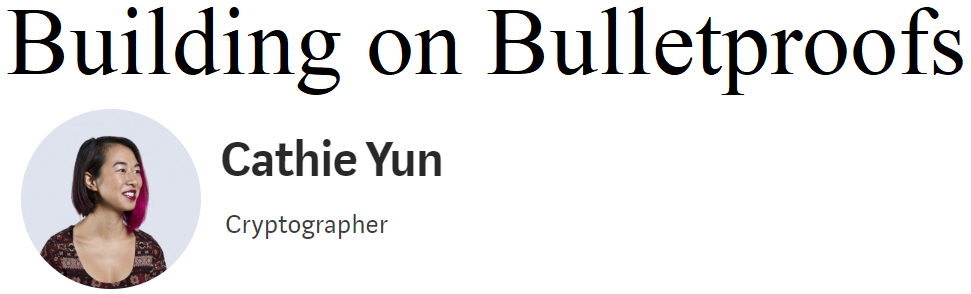
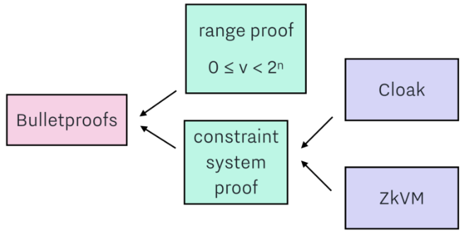

<a href="https://medium.com/@cathieyun/building-on-bulletproofs-2faa58af0ba8">

</a>

## Summary

In [this post](https://medium.com/@cathieyun/building-on-bulletproofs-2faa58af0ba8) Cathie explains the basics of the Bulletproofs zero knowledge proof protocol. She then goes further to explain specific applications built on top of Bulletproofs. These include range proofs and a constraint system proof, which include a confidential asset protocol called Cloak and a confidential smart contract language called ZkVM.

