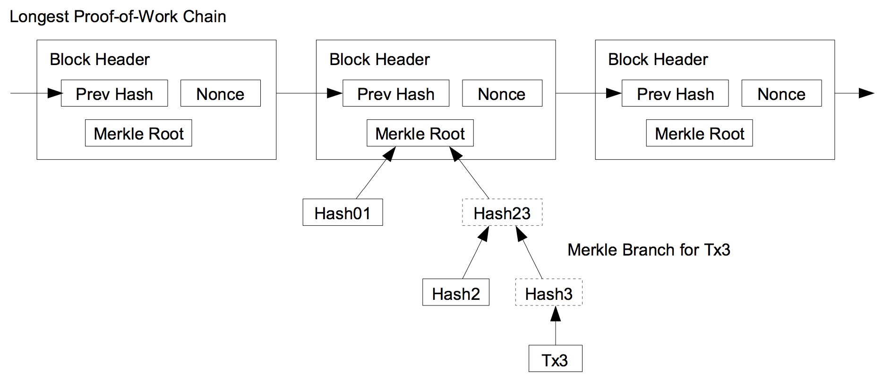

# Fraud Proofs and SPV (Lightweight) Clients - Easier Said than Done?

- [Background](#background)

- [Introduction](#introduction)

- [Full Node vs SPV Client](#full-node-vs-spv-client)

- [What are Fraud Proofs?](#what-are-fraud-proofs)

- [Fraud Proofs Possible within Existing Bitcoin Protocol](#fraud-proofs-possible-within-existing-bitcoin-protocol)
  - [Invalid Transaction due to Stateless Criteria Violation](#invalid-transaction-due-to-stateless-criteria-violation-correct-syntax-input-scripts-conditions-satisfied-etc)
  - [Invalid Transaction due to Input Already Spent](#invalid-transaction-due-to-input-already-spent)
  - [Invalid Transaction due to Incorrect Generation Output Value](#invalid-transaction-due-to-incorrect-generation-output-value)
  - [Invalid Transaction if Input does not Exist](#invalid-transaction-if-input-does-not-exist)
- [Fraud Proofs Requiring Changes to Bitcoin Protocol](#fraud-proofs-requiring-changes-to-bitcoin-protocol)
  - [Invalid Transaction if Input does not Exist in Old Blocks](#invalid-transaction-if-input-does-not-exist-in-old-blocks)
  - [Missing Proof Tree Item](#missing-proof-tree-item)
- [Universal Fraud Proofs (Suggested Improvement)](#universal-fraud-proofs-suggested-improvement)
- [How SPV Clients Work](#how-spv-clients-work)
- [Security and Privacy Issues with SPV Clients](#security-and-privacy-issues-with-spv-clients)
  - [Weak Bloom Filters and Merkle Tree Designs](#weak-bloom-filters-and-merkle-tree-designs)
  - [Improvements](#improvements)
- [Examples of SPV Implementations](#examples-of-spv-implementations)
- [Other Suggested Fraud-proof Improvements](#other-suggested-fraud-proof-improvements)
  - [Erasure Codes](#erasure-codes)
  - [Merklix Trees](#merklix-trees)
  - [Payment Channels](#payment-channels)
- [Conclusions, Observations and Recommendations](#conclusions-observations-and-recommendations)
- [References](#references)
- [Contributors](#contributors)

## Background
The bitcoin blockchain was, as of June 2018, approximately 173 Gigabytes in size [[1]]. This makes it nearly impossible 
for everyone to run a full bitcoin node. Lightweight/Simplified Payment Verification (SPV) clients will have to be used 
by users, since not everyone can run full nodes due to the computational power, bandwidth and cost needed to run a full 
bitcoin node. 

SPV clients will believe everything miners or nodes tell them, as evidenced by Peter Todd in the following screenshot 
of an Android client showing millions of bitcoins. The wallet was sent a transaction of 2.1 million BTC outputs [[17]]. 
Peter Todd modified the code for his node in order to deceive the bitcoin wallet, since the wallets cannot verify coin 
amounts [[27]] (code can be found in the "Quick-n-dirty hack to lie to SPV wallets" branch on his GitHub repository).

<i>Courtesy: MIT Bitcoin Expo 2016 Day 1</i>

## Introduction

In the original bitcoin whitepaper [[2]], Satoshi recognized the limitations described in [Background](#background),
and introduced the concept of a Simplified Payment Verification (SPV). This concept allows verification of payments 
using a lightweight client that does not need to download the entire bitcoin blockchain. It only downloads block 
headers with the longest proof-of-work chain, which are achieved by obtaining the Merkle branch linking a transaction 
to a block&nbsp;[[3]]. The existence of the Merkle root in the chain, along with blocks added after the block containing 
the Merkle root, provides confirmation of the legitimacy of that chain.

<i>Courtesy: Bitcoin: A Peer-to-Peer Electronic Cash System</i>

In this system, the full nodes would need to provide an alert (known as a fraud proof) to SPV clients when an invalid 
block is detected. The SPV clients would then be prompted to download the full block and alerted transactions to 
confirm the inconsistency [[2]]. An invalid block need not be of malicious intent, but could be as a result of other 
accounting errors (whether by accident or by malicious intent).

## Full Node vs SPV Client

A full bitcoin node contains the following details:
  * every block;
  * every transaction that has ever been sent;
  * all the unspent transaction outputs (UTXOs) [[4]].

An SPV client, however, contains:
  * a block header with transaction data relative to the client, including other transactions required to compute the 
  Merkle root; or
  * just a block header with no transactions.

## What are Fraud Proofs?

Fraud proofs are a way to improve the security of SPV clients [[5]] by providing a mechanism for full nodes to prove 
that a chain is invalid, irrespective of the amount of proof of work it has [[5]]. Fraud proofs could also help with 
the bitcoin scaling debate, as SPV clients are easier to run and could thus help with bitcoin scalability issues.
([[6]],[[18]])

## Fraud Proofs Possible within Existing Bitcoin Protocol
At the time of writing (February 2019), various proofs are needed to prove fraud in the bitcoin blockchain based on 
various actions. The following are the types of proofs needed to prove fraud based on specific fraud cases within the 
existing bitcoin protocol [[5]]:

### Invalid Transaction due to Stateless Criteria Violation (Correct Syntax, Input Scripts Conditions Satisfied, etc.)
In the case of an invalid transaction, the fraud proofs consist of:

* the header of invalid block;
* the invalid transaction;
* an invalid block's Merkle tree containing the minimum number of nodes needed to prove the existence of the invalid 
transaction in the tree.

### Invalid Transaction due to Input Already Spent
In this case, the fraud proof would consist of the following:
* the header of the invalid block;
* the invalid transaction;
* proof that the invalid transaction is within the invalid block;
* the header of the block containing the original spend transaction;
* the original spending transaction;
* proof showing that the spend transaction is within the header block of the spend transaction.

### Invalid Transaction due to Incorrect Generation Output Value
In this case, the fraud proof consists of the block itself.
### Invalid Transaction if Input does not Exist
In this case, the fraud proof consists of the entire blockchain.

## Fraud Proofs Requiring Changes to Bitcoin Protocol

The following fraud proofs would require changes to the bitcoin protocol itself [[5]]:

### Invalid Transaction if Input does not Exist in Old Blocks
In this case, the fraud proof consists of:
* the header of the invalid block;
* the invalid transaction;
* proof that the header of the invalid block contains the invalid transaction;
* proof that the header of the invalid block contains the leaf node corresponding to the non-existent input;
* the block referenced by the leaf node, if it exists.

### Missing Proof Tree Item
In this case, the fraud proof consists of:
* the header of the invalid block;
* the transaction of the missing proof tree node;
* an indication as to which input from the transaction of the missing proof tree node is missing;
* proof that the header of the invalid block contains the transition of the missing proof tree node;
* proof that the proof tree contains two adjacent leaf nodes.

## Universal Fraud Proofs (Suggested Improvement)

As can be seen, requiring different fraud proof constructions for different fraud proofs can get cumbersome.
Al-Bassam, et al. [[26]] proposed a general, universal fraud-proof construction for most cases. Their proposition is to
generalize the entire blockchain as a state transition system and represent the entire state as a Merkle root using a
Sparse Merkle tree, with each transaction changing the state root of the blockchain. This can be simplified by this 
function: 

* `transaction(state,tx) = State or Error`

<i>Courtesy: Fraud Proofs: Maximising Light Client Security and Scaling Blockchains with 
Dishonest Majorities</i>

In the case of the bitcoin blockchain, representing the entire blockchain as a key-value store Sparse Merkle tree would
mean:

* `Key = UTXO ID`
* `Value = 1 if unspent or 0 if spent`

Each transaction will change the state root of the blockchain and can be represented with this function: 

* `TransitionRoot(stateRoot,tx,Witnesses) = stateRoot or Error`

In this proposition, a valid fraud proof construction will consist of:
* the transaction;
* the pre-state root;
* the post-state root;
* witnesses (Merkle proofs of all the parts of the state the transaction accesses/modifies).

Also expressed as this function:
* `rootTransition(stateRoot, tx, witnesses) != stateRoot`

So a full node would send a light client/SPV this data to prove a valid fraud proof. The SPV would compute this
function and, if the transition root of the state root is different to the state root in the block, then the block
is rejected.

<i>Courtesy: Fraud Proofs: Maximising Light Client Security and Scaling Blockchains with 
Dishonest Majorities</i>

The post-state root can be excluded in order to save block space. However, this does increase the fraud proof size.
This works with the assumption that the SPV client is connected to a minimum of one honest node.

## How SPV Clients Work
SPV clients make use of Bloom filters to receive transactions that are relevant to the user [[7]]. Bloom filters are
probabilistic data structures used to check the existence of an element in a set quicker by responding with a Boolean
answer. [[9]]

<i>Courtesy: On the Privacy Provisions of Bloom Filters in Lightweight Bitcoin Clients</i>

In addition to Bloom filters, SPV clients rely on Merkle trees [[26]] - binary structures that have a list of all the
hashes between the block (apex) and the transaction (leaf). With Merkle trees, one only needs to check a small part of
the block, called a Merkle root, to prove that the transaction has been accepted in the network. [[8]]

Fraud proofs are integral to the security of SPV clients. However, the other components in SPV clients are not without
issues. 

## Security and Privacy Issues with SPV Clients
### Weak Bloom Filters and Merkle Tree Designs

In August 2017, a weakness in the bitcoin Merkle tree design was found to reduce the security of SPV clients. This
weakness could allow an attacker to simulate a payment of an arbitrary amount to a victim using an SPV wallet, and
trick the victim into accepting it as valid [[10]]. The bitcoin Merkle tree makes no distinction between inner and leaf
nodes, and could thus be manipulated by an attack that could reinterpret transactions as nodes and nodes as
transactions [[11]]. This weakness is due to inner nodes having no format and only requiring the length to be 64 bytes.

A brute-force attack particularly affects systems that automatically accept SPV proofs and could be carried out with an
investment of approximately USD3&nbsp;million. One proposed solution is to ensure that no internal, 64-bit node is ever
accepted as a valid transaction by SPV wallets/clients. [[11]]

The BIP37 SPV [[13]] Bloom filters do not have relevant privacy features [[7]]. They leak information such as IP
addresses of the user, and whether multiple addresses belong to a single owner [[12]] (if Tor or Virtual Private
Networks (VPNs) are not used).

Furthermore, SPV clients face the risk of a denial of service attack against full nodes due to processing load
(80&nbsp;GB disk reads) when SPV clients sync and full nodes themselves can cause a denial of service for SPV clients
by returning NULL filter responses to requests [[14]]. Peter Todd [[15]] aptly demonstrates the risk of SPV denial of
service.

### Improvements

To address these issues, a new concept called committed Bloom filters was introduced to improve the performance and
security of SPV clients. In this concept, which can be used in lieu of BIP37 [[16]], a Bloom filter digest (BFD) of
every block's inputs, outputs and transactions is created with a filter that consists of a small size of the overall
block size [[14]].

A second Bloom filter is created with all transactions and a binary comparison is made to determine matching
transactions. This BFD allows the caching of filters by SPV clients without the need to recompute [[16]]. It also
introduces semi-trusted oracles to improve the security and privacy of SPV clients by allowing SPV clients to download
block data via any out of band method. [[14]]

## Examples of SPV Implementations
There are two well-known SPV implementations for bitcoin: bitcoinj and electrum. The latter does SPV-level validation,
comparing multiple electrum servers against each other. It has very similar security to bitcoinj, but potentially better privacy [[25]] due to bitcoinj's implementation of Bloom filters [[7]].

## Other Suggested Fraud-proof Improvements

### Erasure Codes
Along with the proposed universal fraud-proof solution, another data availability issue with fraud proofs is erasure
coding. Erasure coding allows a piece of data M chunks long to be expanded into a piece of data N chunks long (“chunks”
can be of arbitrary size), such that any M of the N chunks can be used to recover the original data. Blocks are then
required to commit the Merkle root of this extended data and have light clients probabilistically check that the
majority of the extended data is available. [[21]]

According to the proposed solution,
one of three conditions will be true for the SPV client when using erasure codes [[20]]:

1. The entire extended data is available, the erasure code is constructed correctly and the block is valid.
2. The entire extended data is available, the erasure code is constructed correctly, but the block is invalid.
3. The entire extended data is available, but the erasure code is constructed incorrectly.

In case (1), the block is valid and the light client can accept it. In case (2), it is expected that some other node
will quickly construct and relay a fraud proof. In case (3), it is also expected that some other node will quickly
construct and relay a specialized kind of fraud proof that shows that the erasure code is constructed incorrectly.

### Merklix Trees
Another suggested fraud proof improvement for the bitcoin blockchain is by means of block sharding and validation using
Merklix trees. Merklix trees are essentially Merkle trees that use unordered set [[22]]. This also assumes that there
is at least one honest node per shard. Using Merklix proofs, the following can be proven [[23]]:

1. A transaction is in the block.
2. The transaction's inputs and outputs are or are not in the UTXO set.

In this scenario, SPV clients can be made aware of any invalidity in blocks and cannot be lied to about the UTXO set.

### Payment Channels
Bitcoin is made to be resilient to denial of service (DoS) attacks. However, the same cannot be said for SPV clients.
This could be an issue if malicious alerting nodes spam with false fraud proofs. A proposed solution to this is payment
channels [[6]], due to them:

1. operating at near instant speeds, thus allowing quick alerting of fraud proofs;
2. facilitating micro-transactions;
3. being robust to temporary mining failures (as they use long “custodial periods”).

In this way, the use of payment channels can help with incentivizing full nodes to issue fraud proofs.

## Conclusions, Observations and Recommendations

Fraud proofs can be complex [[6]] and hard to implement. However, they appear to be necessary for scalability of
blockchains and the security and privacy for SPV clients, since not everyone can or should want to run a full node to
participate in the network. The current SPV implementations are working on improving the security and privacy of these
SPV clients. Furthermore, for current blockchains, a hard or soft fork would need to be done in order to accommodate
the data in the block headers.

Based on the [payment channels](#payment-channels) fraud proof proposal that suggests some sort of incentive for nodes
that issue alert/fraud proofs, it seems likely that some sort of fraud proof provider and consumer marketplace will
have to emerge.

Where Tari is concerned, it would appear that the universal fraud proof proposals or something similar would need to be
looked into, as undoubtedly end-users of the protocol/network will mostly be using light clients. However, since these
fraud proofs work on the assumption of a minimum of one honest node, in the case of a digital issuer (which may be one
or more), a fraud proof will not be viable on this assumption, as the digital issuer could be the sole node.

## References

[[1]] "Size of the Bitcoin Blockchain from 2010 to 2018, by Quarter (in Megabytes)" [online].  
Available:  https://www.statista.com/statistics/647523/worldwide-bitcoin-blockchain-size/. Date accessed: 2018-09-10.

[1]:  https://www.statista.com/statistics/647523/worldwide-bitcoin-blockchain-size/
"Size of the Bitcoin Blockchain from 2010 to 2018, by Quarter (in Megabytes)"

[[2]] Satoshi Nakamoto, "Bitcoin: A Peer-to-Peer Electronic Cash System" [online]. Available: https://www.bitcoin.com/bitcoin.pdf.  
Date accessed: 2018-09-10.

[2]: https://www.bitcoin.com/bitcoin.pdf
"Bitcoin: A Peer-to-Peer Electronic Cash System"

[[3]] "Simple Payment Verification" [online]. Available: http://docs.electrum.org/en/latest/spv.html. Date accessed: 2018-09-10.

[3]: http://docs.electrum.org/en/latest/spv.html "Simple Payment Verification"

[[4]] "SPV, Bloom Filters and Checkpoints" [online]. Available: https://multibit.org/hd0.4/how-spv-works.html. Date accessed: 2018-09-10.

[4]: https://multibit.org/hd0.4/how-spv-works.html "SPV, Bloom Filters and Checkpoints"

[[5]] "Improving the Ability of SPV Clients to Detect Invalid Chains" [online].  
Available: https://gist.github.com/justusranvier/451616fa4697b5f25f60. Date accessed: 2018-09-10.

[5]: https://gist.github.com/justusranvier/451616fa4697b5f25f60 "Improving the ability of SPV clients to detect invalid chains"

[[6]] "Meditations on Fraud Proofs" [online]. Available: http://www.truthcoin.info/blog/fraud-proofs/. Dated accessed: 2018-09-10.

[6]: http://www.truthcoin.info/blog/fraud-proofs/ "Meditations on Fraud Proofs"

[[7]] Arthur Gervais, Ghassan O. Karame, Damian Gruber and Srdjan Capkun, "On the Privacy Provisions of Bloom Filters in Lightweight Bitcoin Clients" [online]. Available: https://eprint.iacr.org/2014/763.pdf. Date accessed: 2018-09-10.

[7]: https://eprint.iacr.org/2014/763.pdf "On the Privacy Provisions of Bloom Filters in Lightweight Bitcoin Clients"

[[8]] "SPV, Bloom Filters and Checkpoints" [online]. Available: https://multibit.org/hd0.4/how-spv-works.html. Date accessed: 2018-09-10.

[8]: https://multibit.org/hd0.4/how-spv-works.html "SPV, Bloom Filters and Checkpoints"

[[9]] "A Case of False Positives in Bloom Filters" [online].  
Available: https://medium.com/blockchain-musings/a-case-of-false-positives-in-bloom-filters-da09ec487ff0. Date accessed: 2018-09-11.

[9]: https://medium.com/blockchain-musings/a-case-of-false-positives-in-bloom-filters-da09ec487ff0 "A Case of False Positives in Bloom Filters,"

[[10]] "The Design of Bitcoin Merkle Trees Reduces the Security of SPV Clients" [online].  
Available: https://media.rsk.co/the-design-of-bitcoin-merkle-trees-reduces-the-security-of-spv-clients/. Date accessed: 2018-09-11.

[10]: https://media.rsk.co/the-design-of-bitcoin-merkle-trees-reduces-the-security-of-spv-clients/ "The Design of Bitcoin Merkle Trees Reduces the Security of SPV Clients"

[[11]] "Leaf-node Weakness in Bitcoin Merkle Tree Design" [online].  
Available: https://bitslog.wordpress.com/2018/06/09/leaf-node-weakness-in-bitcoin-merkle-tree-design/. Date accessed: 2018-09-11.

[11]: https://bitslog.wordpress.com/2018/06/09/leaf-node-weakness-in-bitcoin-merkle-tree-design/ "Leaf-node Weakness in Bitcoin Merkle Tree Design"

[[12]] "Privacy in Bitsquare" [online]. Available: https://bisq.network/blog/privacy-in-bitsquare/. Date accessed: 2018-09-11.

[12]: https://bisq.network/blog/privacy-in-bitsquare/ "Privacy in Bitsquare"

[[13]] "bip-0037.mediawiki" [online]. Available: https://github.com/bitcoin/bips/blob/master/bip-0037.mediawiki. Date accessed: 2018-09-11.

[13]: https://github.com/bitcoin/bips/blob/master/bip-0037.mediawiki "bip-0037.mediawiki"

[[14]] "Committed Bloom Filters for Improved Wallet Performance and SPV Security" [online].  
Available: https://lists.linuxfoundation.org/pipermail/bitcoin-dev/2016-May/012636.html. Date accessed: 2018-09-11.

[14]: https://lists.linuxfoundation.org/pipermail/bitcoin-dev/2016-May/012636.html "Committed Bloom Filters for Improved Wallet Performance and SPV Security"

[[15]] "Bloom-io-attack" [online]. Available: https://github.com/petertodd/bloom-io-attack. Date accessed: 2018-09-11.

[15]: https://github.com/petertodd/bloom-io-attack "Bloom-io-attack"

[[16]] "Committed Bloom Filters versus BIP37 SPV" [online].  
Available: https://www.newsbtc.com/2016/05/10/developers-introduce-bloom-filters-improve-bitcoin-wallet-security/ Date accessed: 2018-09-12.

[16]: https://www.newsbtc.com/2016/05/10/developers-introduce-bloom-filters-improve-bitcoin-wallet-security/ "Committed Bloom Filters versus BIP37 SPV"

[[17]] "Fraud Proofs" [online]. Available: https://www.linkedin.com/pulse/peter-todds-fraud-proofs-talk-mit-bitcoin-expo-2016-mark-morris/.  
Date accessed: 2018-09-12.

[17]: https://www.linkedin.com/pulse/peter-todds-fraud-proofs-talk-mit-bitcoin-expo-2016-mark-morris/ "Fraud Proofs"

[[18]] "New Satoshi Nakamoto E-mails Revealed" [online]. Available: https://www.trustnodes.com/2017/08/12/new-satoshi-nakamoto-e-mails-revealed. Date accessed: 2018-09-12.

[18]: https://www.trustnodes.com/2017/08/12/new-satoshi-nakamoto-e-mails-revealed "New Satoshi Nakamoto E-mails Revealed"

[[19]] Joseph Poon and Vitalik Buterin, "Plasma: Scalable Autonomous Smart Contracts" [online]. Available: https://plasma.io/plasma.pdf.  
Date accessed: 2018-09-13.

[19]: https://plasma.io/plasma.pdf "Plasma: Scalable Autonomous Smart Contracts"

[[20]] "A Note on Data Availability and Erasure Coding" [online].  
Available: https://github.com/ethereum/research/wiki/A-note-on-data-availability-and-erasure-coding. Date accessed: 2018-09-13.

[20]: https://github.com/ethereum/research/wiki/A-note-on-data-availability-and-erasure-coding "A Note on Data Availability and Erasure Coding"

[[21]] "Vitalik Buterin and Peter Todd Go Head to Head in the Crypto Culture Wars" [online].  
Available: https://www.trustnodes.com/2017/08/14/vitalik-buterin-peter-todd-go-head-head-crypto-culture-wars. Date accessed: 2018-09-14.

[21]: https://www.trustnodes.com/2017/08/14/vitalik-buterin-peter-todd-go-head-head-crypto-culture-wars "Vitalik Buterin and Peter Todd Go Head to Head in the Crypto Culture Wars"

[[22]] "Introducing Merklix Tree as an Unordered Merkle Tree on Steroid" [online].  
Available: https://www.deadalnix.me/2016/09/24/introducing-merklix-tree-as-an-unordered-merkle-tree-on-steroid/. Date accessed 2018-09-14.

[22]: https://www.deadalnix.me/2016/09/24/introducing-merklix-tree-as-an-unordered-merkle-tree-on-steroid/ "Introducing Merklix Tree as an Unordered Merkle Tree on Steroid"

[[23]] "Using Merklix Tree to Shard Block Validation" [online].  
Available: https://www.deadalnix.me/2016/11/06/using-merklix-tree-to-shard-block-validation/. Date accessed: 2018-09-14.

[23]: https://www.deadalnix.me/2016/11/06/using-merklix-tree-to-shard-block-validation/ "Using Merklix Tree to Shard Block Validation"

[[24]] "Fraud Proofs" [online]. Available: https://bitco.in/forum/threads/fraud-proofs.1617/. Date accessed: 2018-09-18.

[24]: https://bitco.in/forum/threads/fraud-proofs.1617/ "Fraud Proofs"

[[25]] "Whats the Difference between an API Wallet and a SPV Wallet?" [Online.]  
Available: https://www.reddit.com/r/Bitcoin/comments/3c3zn4/whats_the_difference_between_an_api_wallet_and_a/. Date accessed: 2018-09-21.

[25]: https://www.reddit.com/r/Bitcoin/comments/3c3zn4/whats_the_difference_between_an_api_wallet_and_a/ "Whats the Difference between an API Wallet and a SPV Wallet?"

[[26]] Mustafa Al-Bassam, Alberto Sinnino and Vitalik Butterin, "Fraud Proofs: Maximising Light Client Security and Scaling Blockchains with Dishonest Majorities" [online]. Available: https://arxiv.org/pdf/1809.09044.pdf. Date accessed: 2018-10-08.

[26]: https://arxiv.org/pdf/1809.09044.pdf "Fraud Proofs: Maximising Light Client Security and Scaling Blockchains with Dishonest Majorities"

[[27]] "Bitcoin Integration/Staging Tree" [online]. Available: https://github.com/petertodd/bitcoin/tree/2016-02-lie-to-spv.  
Date accessed: 2018-10-12.

[27]: https://github.com/petertodd/bitcoin/tree/2016-02-lie-to-spv "Bitcoin Integration/Staging Tree"

## Contributors

- [https://github.com/ksloven](https://github.com/ksloven)
- [https://github.com/CjS77](https://github.com/CjS77)
- [https://github.com/hansieodendaal](https://github.com/hansieodendaal)
- [https://github.com/anselld](https://github.com/anselld)
