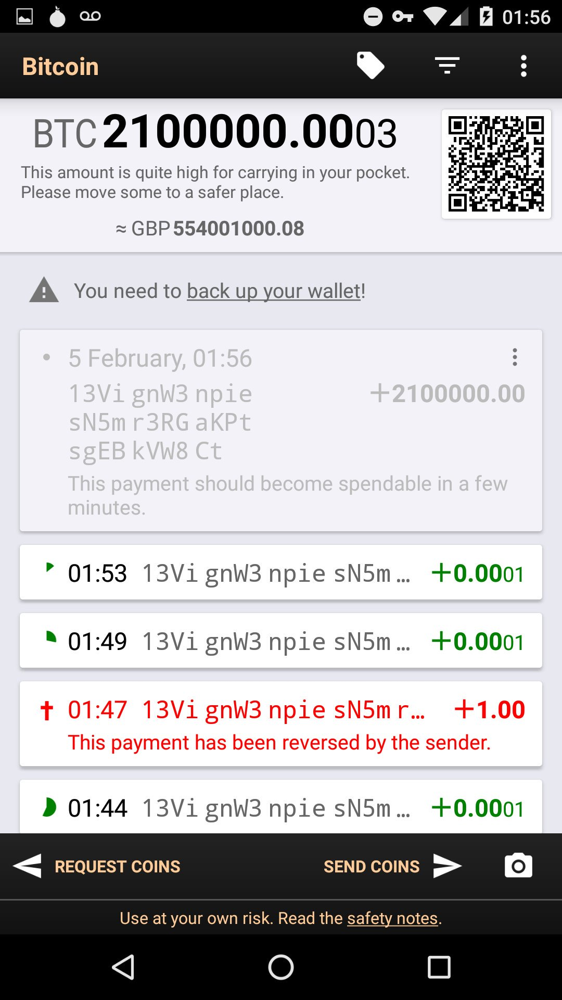
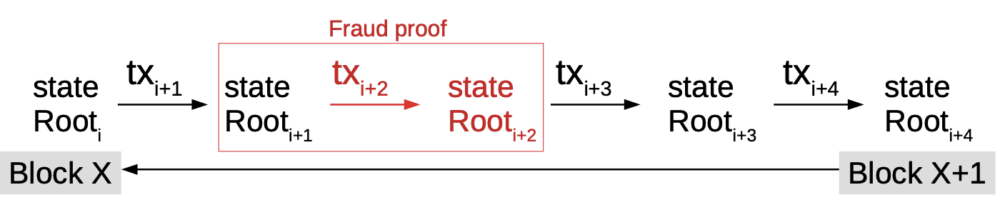

# Fraud Proofs and SPV (lightweight) clients - easier said than done?

## Background
The Bitcoin blockchain is, as of June 2018, approximately 173 Gigabytes in size [[1]]. This makes it nearly impossible for everyone to run a full Bitcoin node. Lightweight/Simplified Payment Verification (SPV) clients will have to be used by users since not everyone can run full nodes due to the computational power, bandwidth and cost needed to run a full Bitcoin node. 

SPV clients will believe everything miners or nodes tell them, as evidenced by Peter Todd in the screenshot above showing an Android client showing millions of bitcoin. The wallet was sent a transaction 2.1 million BTC outputs [[17]]. 
Peter modified the code for his node in order to decieve the Bitcoin wallet since the wallets can't verify coin amounts [[27]] (code can be found in the "Quick-n-dirty hack to lie to SPV wallets" branch on his github).

Courtesy:MIT Bitcoin Expo 2016 Day 1

## Contents
- [Fraud Proofs and SPV clients - easier said than done?](#Fraud-Proofs---easier-said-than-done?)
   - [Background](#background)
   - [Introduction](#Introduction)
   - [Full node vs SPV client](#full-node-vs-spv-client)
   - [What are fraud proofs](#what-are-fraud-proofs)
   - [Fraud proof data structure](#fraud-proof-data-structure)
   - [How SPV clients work](#how-spv-clients-work)
   - [Security and privacy issues with SPV clients](#security-and-privacy-issues-with-spv-clients)
   - [Examples of SPV implementations](#examples-of-spv-implementations)
   - [Other suggested fraud proof improvements](#other-suggested-fraud-proof-improvements)
   - [Conclusions, Observations, Recommendations](#conclusions-observations-recommendations)
   - [References](#references)

## Introduction

In the original Bitcoin whitepaper, Satoshi recognised this and introduced the concept of a Simplified Payment Verification (SPV) [[2]], in which he describes a technique that allows verification of payments using a lightweight client that doesn't need to download the entire Bitcoin blockchain, but rather by only downloading block headers with the longest proof-of-work chain , which are achieved by obtaining the Merkle branch linking a transaction to a block [[3]]. The existence of [Merkle root](#blob/master/merkle-trees-and-spv-1/PITCHME.md#merkle-trees-and-more-importantly-branches) in the chain, along with blocks added after the block containing the Merkle root, provides confirmation of the legitimacy of that chain.

Courtesy: Bitcoin: A Peer-to-Peer Electronic Cash System

In this system, the full nodes would need to provide an alert (known as a fraud proof) to SPV clients when an invalid block is detected. The SPV clients would then be prompted to download the full block and alerted transactions to
confirm the inconsistency [[2]].

An invalid block need not be of malicious intent, but could be as a result of other accounting errors (whether by accident or malicious)

## Full node vs SPV client

A full Bitcoin node contains the following details:
  * every block
  * every transaction that has ever been sent
  * all the unspent transaction outputs (UTXOs) [[4]]

An SPV client, however, contains :
* a block header with transaction data relative to the client including other transactiosn required to compute the Merkle root
or 
* just a block header with no transactions.

## What are fraud proofs?

Fraud proofs are a way to improve the security of SPV clients [[5]] by providing a mechanism for full nodes to prove that a chain is invalid irrespective of the amount of proof of work it has [[5]]. Fraud proofs could also help with the Bitcoin scaling debate as SPV clients are easier to run and could thus help with Bitcoin scalability issues [[6]] [[18]].
  
## Fraud proof data structure
There are currently different proofs that are needed to prove fraud in the Bitcon blockchain based on various actions.
Below are the various types of proofs that are needed to prove fraud based on specific fraud cases [[5]]:

### Invalid transaction due to stateless criteria violation (correct syntax, input scripts conditions satisfied,etc)
For an invalid transaction, the fraud proofs consists of:
* the header of invalid block
* the invalid transaction
* An invalid block's Merkle tree containing the minimum number of nodes needed to proof the existance of the invalid transaction in the tree

### Invalid transaction due to input already been spent
For this case, the fraud proof would consist of the following:
* the header of the invalid block
* the invalid transaction
* proof that the invalid transaction is within the invalid block
* the header of the block containing original spend transaction
* the original spending transaction
* proof showing that the spend transaction is within the header block of the spend transaction

### Invalid transaction due to incorrect generation output value
For this case, the fraud proof consists of:
* the block itself

### Invalid transaction if input does not exist
For this case, the fraud proof consists of:
* the entire blockchain

The following fraud proofs would require changes to the Bitcoin protocol itself [[5]]

### Invalid transaction if input does not exist in old blocks
For this case, the fraud proof consists of:
* the header of the invalid block
* the invaild transaction
* proof that the header of the invalid block contains the invalid transaction
* proof that the header of the invalid block contains the leaf node corresponding to the non-existant input
* the block referenced by the leaf node if it exists

### Missing proof tree item
For this case, the fraud proof consists of:
* the header of the invalid block
* the transaction of the missing proof tree node
* An indication of which input from the transaction of the missing proof tree node is missing from it
* proof that the header of the invalid block contains the transtion of the missing proof tree node
* proof that the proof tree contains two adjacent leaf nodes

## Universal fraud proofs (suggested improvement)

As can be seen, requiring different fraud proof constructions for different different fraud proofs can get combersome. In a recent paper, Al-Bassam, et al [[26]] proposed a general, universal fraud proof construction for most cases.
Their proposition is to generalize the entire blockchain as a state transition system and represent the entire state as a Merkle root using a Sparse Merkle tree, with each transaction changing the state root of the blockchain. This can be simplified by this function : 
* `transaction(state,tx) = State or Error`

courtesy: Fraud Proofs: Maximising Light Client Security and Scaling Blockchains with Dishonest Majorities

In the case of the Bitcoin blockchain, representing the entire blockchain as a key-value store Sparse Merkle tree would mean:
* `Key = UTXO ID`
* `Value = 1 if unspent or 0 if spent`

Each transaction will change the state root of the blockchain and can be represented with this function:
* `TransitionRoot(stateRoot,tx,Witnesses) = stateRoot or Error`

In this proposition, a valid fraud proof construction will consist of:
* the transaction
* the pre-state root
* the post-state root
* Witnesses (Merkle proofs of all the parts of the state the transactions accesses/modifies)

Also expressed as this function:
* `rootTransition(stateRoot, tx, witnesses) != stateRoot`

So a full node would send a lightclient/SPV this data to proof a valid fraud proof. The SPV would compute this function and if the transition root of the state root is different from the state root in the block then the block is rejected.

courtesy: Fraud Proofs: Maximising Light Client Security and Scaling Blockchains with Dishonest Majorities

The post-state root can be excluded in order to save block space but that does, however, increase the fraud proof size. This works with the assumption that the SPV client is connected to a minimum of one honest node.

## How SPV clients work
SPV clients make use of [Bloom filters](#blob/master/merkle-trees-and-spv-1/PITCHME.md#bloom-filters) to receive transactions that are relevant to the user [[7]]. Bloom filters are probalistic data structures used to check the existence of an element in a set quicker by responding with a boolean answer [[9]]

Courtesy: On the Privacy Provisions of Bloom Filters in Lightweight
Bitcoin Clients [[7]]

In addition to Bloom filters, SPV clients rely on Merkle trees [[26]] - binary structures that have a list of all the hashes between the block (apex) and the transaction (leaf). With Merkle trees, one only needs to check a small part of the block, called a Merkle root, to prove that the transaction has been accepted in the network [[8]].

Fraud proofs are integral to the security of SPV clients, however, the other components in SPV clients are not without issues. 

## Security and privacy issues with SPV clients
* **weak bloom filters and merkle tree designs**

In August 2017, a weakness in the Bitcoin Merkle tree design was found to reduce the security of SPV clients which could allow an attacker to simulate a payment of arbitrary amount to a victim using a SPV wallet, and trick the victim into accepting it as valid [[10]]. The bitcoin Merkle tree makes no distinction between inner and leaf nodes and could thus be manipulated by an attack that could re-interpret transactions as nodes and nodes as transactions [[11]]. This weakness is due to inner nodes having no format and only requiring the length to be 64 bytes.

This brute force attack particularly affects systems that automatically accept SPV proofs and could be carried out with an investment of approximately $3 million. One proposed solution is to ensure that no internal, 64-bit node is ever accepted as a valid transaction by SPV wallets/clients [[11]].

The BIP37 SPV [[13]] Bloom filters don't have relevant privacy features [[7]] and leak information such as determining if multiple address belong to a single owner, as well as leaking of IP addresses of the user [[12]] (if TOR or VPNs aren't used).

Furthermore, SPV clients pose the risk of a denial of service attack against full nodes due to processing load (80Gig disk reads) when SPV clients sync and full nodes themselves can cause a denial of service against SPV clients by returning NULL filter responses to requests [[14]]. Peter Todd's Bloom-io-attack aptly demonstrates the risk of SPV denial of service [[15]].

To address this, a new concept called committed bloom filters was introduced to improve the performance and security of SPV clients. In this concept, which can be used in lieu of BIP37 [[16]], a Bloom filter digest (BFD) of every blocks inputs, outputs and transactions is created with a filter that consists of a small size of the overall block size [[14]].

A second Bloom filter is created with all transactions and a binary comparison is made to determine matching transactions. This BFD allows the caching of filters by SPV clients without the need to re-compute [[16]] and also introduces semi-trusted oracles to improve the security and privacy of SPV clients by allowing SPV clients to download block data via any out of band method. [[14]]

## Examples of SPV implementations
There are two well-known SPV implementations for Bitcoin - Bitcoinj and Electrum. The latter does SPV level validation, comparing multiple electrum servers against each other. It's got very similar security to bitcoinj, but potentially better privacy [[25]] due to Bitcoinj's Bloom filters implimentation [[7]].

## Other suggested fraud proof improvements

### Erasure codes
Along with the proposed universal fraud proof solution, another data availability issue with fraud proofs is erasure coding. Erasure coding allows a piece of data M chunks long to be expanded into a piece of data N chunks long (“chunks” can be of arbitrary size), such that any M of the N chunks can be used to recover the original data. Blocks are then required to commit the Merkle root of this extended data and have light clients probabilistically check that the majority of the extended data is available [[21]].

According to the proposed solution, one of three conditions will be true to the SPV client when using erasure codes [[20]]:

1) The entire extended data is available, the erasure code is constructed correctly, and the block is valid.

2) The entire extended data is available, the erasure code is constructed correctly, but the block is invalid.

3) The entire extended data is available, but the erasure code is constructed incorrectly.

In case (1), the block is valid and the light client can accept it. In case (2), it is expected that some other node will quickly construct and relay a fraud proof. In case (3), it is also expected that some other node will quickly construct and relay a specialized kind of fraud proof that shows that the erasure code is constructed incorrectly.

### Merklix trees
Another suggested fraud proof improvement for the Bitcoin blockchain is by means of block sharding and validation using Merklix trees. Merklix trees are essentially Merkle trees that use unordered set [[22]].
This also assumes that there is atleast one honest node per shard. Using Merklix proofs, the following can be proven [[23]]:

1) a transactrion is in the block
2) it's inputs and outputs are or aren't in the UTXO set

In this scenario, SPV clients can be made aware of any invalidity in blocks and can’t be lied to about the UTXO set.

### Payment channels
Bitcoin is made to be reselient to denial of service (Dos) attacks, however, the same cannot be said for SPV clients. This could be an issue if malicious alerting nodes spam with false fraud proofs.
A proposed solution to this is payment channels [[6]] due to them:
1) operating at near instant speeds thus allowing quick alerting of fraud proofs
2) facilitate micro-transactions
3) Are robust to temporary mining failures (as they use long “custodial periods”)

In this way, the use of payment channels can help with incentivising full nodes to issue fraud proofs.

## Conclusions, Observations, Recommendations

Fraud proofs can be complex [[6]] and hard to implement, but appear to be necessary for scalabity of blockchains and the security and privacy for SPV clients, since not everyone can nor should want to run a full node to participate in the network. The current SPV implementations are working on improving the security and privacy of these SPV clients. Furthermore, for current blockchains, a hard or soft fork would need to be done in order to accomodate the data in the blockheaders.

Based on [3 different fraud proof proposals](#suggested-fraud-proof-improvements) that suggest some sort of incentive for nodes that issue alert/fraud proofs, it seems likely that some sort of fraud proof providers and consumers market place will have to emerge.

Where Tari is concerned, it would appear that the universal fraud proof proposals or something similar would need to be looked into as undoubtedly end users of the protocol/network will mostly be using lightclients. However, since these fraud proofs work on the assumption of a minimum of one honest node, in the case of a digital issuer (which may be one or more), a fraud proof won't be viable on this assumption as the digital issuer could be the sole node.

## References

[[1]] Size of the Bitcoin blockchain from 2010 to 2018, by quarter (in megabytes),  https://www.statista.com/statistics/647523/worldwide-bitcoin-blockchain-size/, Date accessed: 2018-09-10.

[1]: https://www.statista.com/statistics/647523/worldwide-bitcoin-blockchain-size/ 
"Size of the Bitcoin blockchain from 
2010 to 2018, by quarter (in megabytes)"

[[2]] Bitcoin: A Peer-to-Peer Electronic Cash System, Satoshi Nakamoto, https://www.bitcoin.com/bitcoin.pdf, Date accessed: 2018-09-10.

[2]: https://www.bitcoin.com/bitcoin.pdf "Bitcoin: A Peer-to-Peer Electronic Cash System, Satoshi Nakamoto" 

[[3]] Simple Payment Verification, http://docs.electrum.org/en/latest/spv.html , Date accessed: 2018-09-10.

[3]: http://docs.electrum.org/en/latest/spv.html "Simple Payment Verification"

[[4]] SPV, Bloom filters and checkpoints, https://multibit.org/hd0.4/how-spv-works.html, Date accessed: 2018-09-10.

[4]: https://multibit.org/hd0.4/how-spv-works.html "SPV, Bloom filters and checkpoints"

[[5]] Improving the ability of SPV clients to detect invalid chains
, https://gist.github.com/justusranvier/451616fa4697b5f25f60, Date accessed: 2018-09-10.

[5]: https://gist.github.com/justusranvier/451616fa4697b5f25f60 "Improving the ability of SPV clients to detect invalid chains"

[[6]] Meditations on Fraud Proofs, http://www.truthcoin.info/blog/fraud-proofs/, Dated accessed: 2018-09-10.

[6]: http://www.truthcoin.info/blog/fraud-proofs/ "Meditations on Fraud Proofs"

[[7]] On the Privacy Provisions of Bloom Filters in Lightweight Bitcoin Clients, Arthur Gervais, et al, https://eprint.iacr.org/2014/763.pdf, Date accessed: 2018-09-10.

[7]: https://eprint.iacr.org/2014/763.pdf "On the Privacy Provisions of Bloom Filters in Lightweight Bitcoin Clients"

[[8]] SPV, Bloom filters and checkpoints, https://multibit.org/hd0.4/how-spv-works.html, Date accessed: 2018-09-10.

[8]: https://multibit.org/hd0.4/how-spv-works.html "SPV, Bloom filters and checkpoints"

[[9]] A Case of False Positives in Bloom Filters, https://medium.com/blockchain-musings/a-case-of-false-positives-in-bloom-filters-da09ec487ff0, Date accessed: 2018-09-11.

[9]: https://medium.com/blockchain-musings/a-case-of-false-positives-in-bloom-filters-da09ec487ff0 "A Case of False Positives in Bloom Filters,"

[[10]] The Design Of Bitcoin Merkle Trees Reduces The Security Of SPV Clients, https://media.rsk.co/the-design-of-bitcoin-merkle-trees-reduces-the-security-of-spv-clients/, Date accessed: 2018-09-11.

[10]: s-reduces-the-security-of-spv-clients/ "The Design Of Bitcoin Merkle Trees Reduces The Security Of SPV Clients"

[[11]] Leaf-Node weakness in Bitcoin Merkle Tree Design,https://bitslog.wordpress.com/2018/06/09/leaf-node-weakness-in-bitcoin-merkle-tree-design/, Date accessed: 2018-09-11.

[11]: https://bitslog.wordpress.com/2018/06/09/leaf-node-weakness-in-bitcoin-merkle-tree-design/ "Leaf-Node weakness in Bitcoin Merkle Tree Design"

[[12]] Privacy in bitsquare, https://bisq.network/blog/privacy-in-bitsquare/, Date accessed: 2018-09-11.

[12]: https://bisq.network/blog/privacy-in-bitsquare/ "rivacy in bitsquare"

[[13]] bip-0037.mediawiki, https://github.com/bitcoin/bips/blob/master/bip-0037.mediawiki, Date accessed: 2018-09-11.

[13]: https://github.com/bitcoin/bips/blob/master/bip-0037.mediawiki "bip-0037.mediawiki"

[[14]] Committed bloom filters for improved wallet performance and SPV security, https://lists.linuxfoundation.org/pipermail/bitcoin-dev/2016-May/012636.html, Date accessed: 2018-09-11.

[14]: https://lists.linuxfoundation.org/pipermail/bitcoin-dev/2016-May/012636.html "Committed bloom filters for improved wallet performance and SPV security"

[[15]] Bloom-io-attack, https://github.com/petertodd/bloom-io-attack, Date accessed: 2018-09-11.

[15]: https://github.com/petertodd/bloom-io-attack "Bloom-io-attack"

[[16]] Committed Bloom Filters Versus BIP37 SPV, https://www.newsbtc.com/2016/05/10/developers-introduce-bloom-filters-improve-bitcoin-wallet-security/, Date accessed: 2018-09-12.

[16]: https://www.newsbtc.com/2016/05/10/developers-introduce-bloom-filters-improve-bitcoin-wallet-security/ "Committed Bloom Filters Versus BIP37 SPV"

[[17]] Fraud Proofs, https://www.linkedin.com/pulse/peter-todds-fraud-proofs-talk-mit-bitcoin-expo-2016-mark-morris/, Date accessed: 2018-09-12.

[17]: https://www.linkedin.com/pulse/peter-todds-fraud-proofs-talk-mit-bitcoin-expo-2016-mark-morris/ "Fraud Proofs"

[[18]] New Satoshi Nakamoto E-mails Revealed
, https://www.trustnodes.com/2017/08/12/new-satoshi-nakamoto-e-mails-revealed, Date accessed: 2018-09-12.

[18]: https://www.trustnodes.com/2017/08/12/new-satoshi-nakamoto-e-mails-revealed "ew Satoshi Nakamoto E-mails Revealed"

[[19]] Plasma: Scalable Autonomous Smart Contracts, Joseph Poon & Vitalik Buterin, https://plasma.io/plasma.pdf, Date accessed: 2018-09-13.

[19]: https://plasma.io/plasma.pdf "Plasma: Scalable Autonomous Smart Contracts"

[[20]] A note on data availability and erasure coding
, https://github.com/ethereum/research/wiki/A-note-on-data-availability-and-erasure-coding, Date accessed: 2018-09-13.

[20]: https://github.com/ethereum/research/wiki/A-note-on-data-availability-and-erasure-coding "A note on data availability and erasure coding"

[[21]] Vitalik Buterin and Peter Todd Go Head to Head in the Crypto Culture Wars, https://www.trustnodes.com/2017/08/14/vitalik-buterin-peter-todd-go-head-head-crypto-culture-wars, Date accessed: 2018-09-14.

[21]: https://www.trustnodes.com/2017/08/14/vitalik-buterin-peter-todd-go-head-head-crypto-culture-wars "Vitalik Buterin and Peter Todd Go Head to Head in the Crypto Culture Wars"

[[22]] Introducing Merklix tree as an unordered Merkle tree on steroid, https://www.deadalnix.me/2016/09/24/introducing-merklix-tree-as-an-unordered-merkle-tree-on-steroid/, Date accessed 2018-09-14.

[22]: https://www.deadalnix.me/2016/09/24/introducing-merklix-tree-as-an-unordered-merkle-tree-on-steroid/ "Introducing Merklix tree as an unordered Merkle tree on steroid"

[[23]] Using Merklix tree to shard block validation, https://www.deadalnix.me/2016/11/06/using-merklix-tree-to-shard-block-validation/, Date accessed: 2018-09-14.

[23]: https://www.deadalnix.me/2016/11/06/using-merklix-tree-to-shard-block-validation/ "Using Merklix tree to shard block validation"

[[24]] fraud proofs, https://bitco.in/forum/threads/fraud-proofs.1617/, Date accessed: 2018-09-18.

[24]: https://bitco.in/forum/threads/fraud-proofs.1617/ "fraud proofs"

[[25]] Whats the difference between an API wallet and a SPV wallet?, https://www.reddit.com/r/Bitcoin/comments/3c3zn4/whats_the_difference_between_an_api_wallet_and_a/, Date accessed: 2018-09-21.

[25]: https://www.reddit.com/r/Bitcoin/comments/3c3zn4/whats_the_difference_between_an_api_wallet_and_a/ "Whats the difference between an API wallet and a SPV wallet?"

[[26]] Fraud Proofs: Maximising Light Client Security and Scaling Blockchains with Dishonest Majorities, Mustafa Al-Bassam, Alberto Sinnino, Vitalik Butterin, https://arxiv.org/pdf/1809.09044.pdf, Date accessed: 2018-10-08

[26]: https://arxiv.org/pdf/1809.09044.pdf "Fraud Proofs: Maximising Light Client Security and Scaling Blockchains with Dishonest Majorities"

[[27]] Bitcoin intergration/staging tree, https://github.com/petertodd/bitcoin/tree/2016-02-lie-to-spv , Date accessed: 2018-10-12.

[27]: https://github.com/petertodd/bitcoin/tree/2016-02-lie-to-spv "Bitcoin intergration/staging tree"
## Contributors

- [https://github.com/ksloven](https://github.com/ksloven)
