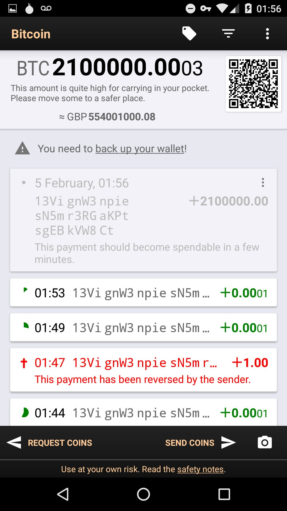
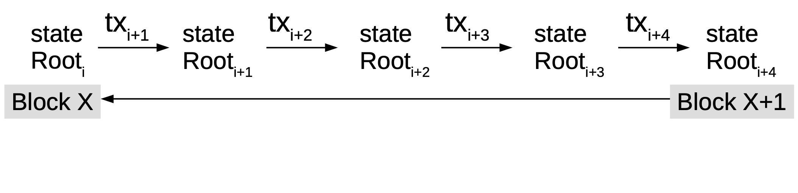

## Fraud proofs and SPV clients - easier said than done?

- Background
- What are fraud proofs?
- How do they relate to SPV/lightweight clients?
- proposals and improvements of fraud proofs
- Security & Privacy of SPV clients
- Observations and Conclusions

---

## Background

SPV clients will believe everything miners or nodes tell them:

- Node code modified
- Lightweight clients don't verify coin amounts

---

## Full node vs SPV client

A full Bitcoin node contains the following details:

- every block
- every transaction that has ever been sent
- all the unspent transaction outputs (UTXOs)

An SPV client, however, contains :

- a block header with transaction data relative to the client including other transactions required to compute the Merkle root
  or
- just a block header with no transactions

---

## What are fraud proofs

- Satoshi recognised this and introduced the concept of a Simplified Payment Verification (SPV)

- full nodes would need to provide an alert (known as a fraud proof) to SPV clients when an invalid block is detected irrespective of the amount of proof of work it has

- An invalid block need not be of malicious intent, but could be as a result of other accounting errors

- assumes a minimum of one honest node

- Could help with scalability of blockchains and security of SPV

- Satoshi didn't go into the details of how it could be done

---

## Fraud proof data structures

Invalid transaction if input does not exist

- the entire blockchain

Invalid transaction due to incorrect generation output value

- the block itself

Invalid transaction due to input already been spent

- header of the invalid block
- invalid transaction
- proof that the invalid transaction is within the invalid block
- the header of the block containing original spend transaction
- the original spending transaction
- proof showing that the spend transaction is within the header block of the spend transaction

---

## Universal fraud proof proposal

Proposition:

- generalize the entire blockchain as a state transition system
- represent the entire state as a Merkle root using a Sparse Merkle tree
- each transaction changes the state root of the blockchain
  - `transaction(state,tx) = State or Error`

---

## Universal fraud proof (Cont'n)

**Bitcoin blockchain**

- represent the entire blockchain as a key-value store uisng Sparse Merkle tree
  - `Key = UTXO ID`
  - `Value = 1 if unspent or 0 if spent`
- Each transaction will change the state root of the blockchain

  - `rootTransition(stateRoot, tx, witnesses) != stateRoot`

- full node sends lightclient/SPV this data to proof a valid fraud proof
- SPV computes this function.

- post-state root can be excluded in order to save block space
- But this increases the fraud proof size

---

#### How SPV/Lightweight clients work

##### Strengths

- memory light
- user adoption

---

#### How SPV/Lightweight clients work (cont'd)

##### Weaknesses

- Bitcoin Merkle tree design reduces the security of SPV clients
  - allow an attacker to simulate a payment of arbitrary amount to a victim
- bitcoin Merkle tree makes no distinction between inner and leaf nodes
  - re-interpret transactions as nodes and nodes as transactions
  - inner nodes having no format and only requiring the length to be 64 bytes
- Bloom filters leak information such as determining if multiple addresses belongs to a single owner
- SPV clients pose the risk of a denial of service attack against full nodes when syncing
- nodes can cause a denial of service against SPV clients by returning NULL filter responses to requests

---

#### Other suggested fraud proof improvements

- Erasure codes
  - helps with data availability
  - allows a piece of data M chunks long to be expanded into a piece of data N chunks long
  - any M of the N chunks can be used to recover the original data

---

#### Other suggested fraud proof improvements (cont'd)

- Merklix trees
  - Merkle trees that use unordered set
  - block sharding and validation
- What can be proved?

  - a transaction is in the block
  - its inputs and outputs are or aren't in the UTXO set

- SPV clients can be made aware of any invalidity in blocks and can’t be lied to about the UTXO set

- Payment channels
  - malicious alerting nodes spam with false fraud proofs
  - operating at near instant speeds thus allowing quick alerting of fraud proofs
  - facilitate micro-transactions (incentives)
  - Are robust to temporary mining failures (as they use long “custodial periods”)

---

## Observations

- Fraud proofs can be complex and hard to implement
- There is continuous research and suggested improvements on this topic
- Universal fraud proofs seem to be the simpler solution to implement
