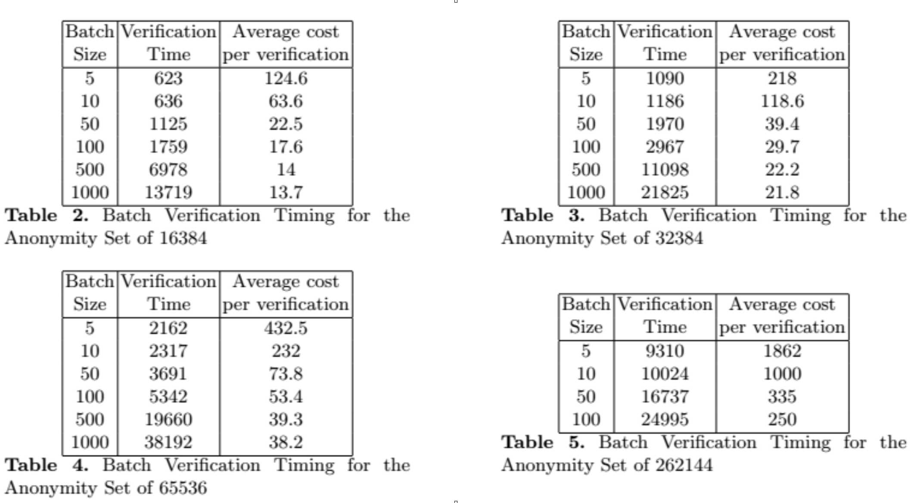

# Lelantus

- [Introduction](#introduction) 
- [Lelantus](#lelantus) 
  - [Minting](#minting)
  - [Spending](#spending)
  - [Verification](#verification)
  - [Lelantus video](#lelantus-video)
- [Firo](#firo)    
- [Beam](#beam) 
  - [Lelantus MW](#lelantus-mw)
  - [Beam Lelantus MW talk](#beam-lelantus-mw-talk)
- [References](#references)

## Introduction 

Lelantus [[[1]]] was designed as a transaction scheme based on cryptographic assumptions with strong anonymity support and confidentiality but at the same time to not require a trusted setup. This is to efficiently support strong anonymity and confidentiality properties for direct blockchain payments. Lelantus was designed to work with any UTXO based base layer cryptocurrency but was first Implemented with Zcoin and Beam. 

## Lelantus

Lelantus at its core is double-blinded Pedersen commitments. These values consist of a unique serial number, value, and blinding factor.

$$
    C_1 = v_1 \cdot{H} + k_1 \cdot{G} + s_1 \cdot{J}
$$

Lelantus can be seen almost as a layer 1.5 or even a sidechain. Technically Lelantus is fully on the base layer and verified by the base layer. But its better seen as a bolt on technology as coins have to be transferred from the "base layer", aka the normal crypto coins used, to the "Lelantus layer" aka double blinded Pedersen committed in a shielded pool.

Lelantus can be summarized into 3 steps:

1. **Mint**: For minting a new coin, the user generates a unique coin serial number secret \( s \) then commits to \( s \) using the Pedersen commitment scheme with value \(v\) and a fresh blinding factor \( k \). 
2. **Spend:** The user reveals the serial number \(s\), and then generates a one-out-of-N proof [[[2]]] of knowledge for verification
3. **Verify**: All network participants can take the revealed serial number \( s \) and check that it does not appear in any previous spend transaction. Next they can homomorphically subtract this serial number from all coins in the pool and then check the validity of the  provided one-out-of-N proof against this new composed set of commitments.

### Minting

This is the first step in a Lelantus transaction. Here a user creates a new coin for transfer in the shielded pool. This results in a coin \(C_i =  Com(s,k,v) \) which is published to the blockchain and is added to the pool of all previously minted coins \( {C_0, C_1, ...C_{N−1} } \). The coin serial number \( s \) and the opening value \( v \) are used later to spend the coin \( C_i \). It is important to denote that \( C_i \) is accompanied with some zero-knowledge proof, it can be anyone, but both Zcoin and Beam use a bulletproof to prove that \( v\) is positive.

If the coin \( C_i\) is not tested for negative values, it is possible to create new value out of the Lelantus coins.  The new coin \( C_i\) is then stored in the Lelantus set of UTXO's.

### Spending

The spender parses the set of all previously minted coins \( {C_0, C_1, ...C_{N−1} } \) and homomorphically subtracts the serial number value \( s\)from all these coins.

$$
 {C_0, C_1, ...C_{N−1} } - Comm(S,0,0)
$$

This results in a new set of commitments where one will obviously be opening to 0. The spender generated one-out-of-N proof will prove knowledge this secret commitment opening to 0 without revealing its index in the referred set.

### Verification

Anyone can use the provided one-out-of-N proof to verify that the set \( {C_0, C_1, ...C_{N−1} } - Comm(S,0,0)\) contains some Pedersen commitment \(Comm(0,v,r)\). This proves that the value exists, and that the blinding factor \(r\) is known. Because users need to verify the one-out-of-N proof against the entire set, verification times can be slow. Where possible batch verification should be used with transactions using the same verification set. As can be seen from the below tables [[[3]]] verification time only increases logarithmically with size.  

### Lelantus video 

Here is a talk at CESC 2019 of Aram Jivanyan presenting Lelantus.

<iframe width="560" height="315" src="https://www.youtube.com/embed/eAOw_CjXLYE" title="YouTube video player" frameborder="0" allow="accelerometer; autoplay; clipboard-write; encrypted-media; gyroscope; picture-in-picture" allowfullscreen></iframe>

## Firo

Firo [[[4]]] is a privacy crypto currency. It was previously known by the name Zcoin, but was rebranded to Firo as of Oct 2020. Firo activated Lelantus on their main net in Jan 2021 [[[5]]], but had to deactivate it in Feb 2021 due to a security breach. As of writing this they are yet to activate it again.

Here is a nice short video by Grant Hawkins explaining Lelantus as implemented by Firo

<iframe width="560" height="315" src="https://www.youtube.com/embed/sV1zjhtTav8" title="YouTube video player" frameborder="0" allow="accelerometer; autoplay; clipboard-write; encrypted-media; gyroscope; picture-in-picture" allowfullscreen></iframe>

## Beam

Beam[[[7]]] is a MW based crypto currency. Beam activated a version of Lelantus called Lelantus-MW in June 2020 [[[8]]].

### Lelantus MW

While the implementation of Lelantus MW [[[9]]] as implemented by Beam is based on the original white paper by Jivanyan [[[1]]], there are a few differences exploiting some of the advantages that MW already provides. 

#### Minting

As with normal Lelantus, Beam uses a normal output as input to the same Pedersen commitments: \(C_i = v_i \cdot{H} + k_i \cdot{G} + s_i \cdot{J} \).
To ensure that the value \(v\) is positive, Beam modified their bulletproof implementation to allow for the additional generator \(J\).
When a Lelantus UTXO is added to the shielded pool the following values are added:

Shielded set:  \(C_i  + k_{excess} \cdot{G}\)
Kernel excess: \(s_i \cdot{J} + k_{excess} \cdot{G}\)

It is important to note that the \(excess\) that would have been added to the kernel if this was a normal MW transaction should be added to the commitment in the shielded set. 

#### Spending

When spending a Lelantus UTXO, the spender provides a spent proof and a new spending Pedersen commitment \(C_o = v_o\cdot{H} + k_o \cdot{G} \).
Assuming that the commitment \(C_i\) is spent, the public serial number \(s_i \cdot{J}\) is revealed, and \(C_o + s_i \cdot{G}\) is subtracted from all commitments in the pool(or set used). The Sigma-protocol provides a proof of knowledge in terms of \(G\), which is \(k \cdot{G} - k_o \cdot{G}\) where \(k \cdot{G}\) is public key for the transaction which is: \(k_i \cdot{G} + k_{excess} \cdot{G}\).
In essence, the following data is provided for spending:
\(C_o\), \(s_i \cdot{J}\), \(k \cdot{G}\)

In the shielded pool, there should exists some Lelantus UTXO  \(C_i = v_i \cdot{H} + k_i \cdot{G} + s_i \cdot{J} + k_{excess} \cdot(G)\). 
When spending, \(C_o + s_i \cdot{J}\) minus one of the inputs in the shielded pool (in this example \(C_i\)), minus the spend proof \(k_i \cdot{G} + k_{excess} \cdot{G} - k_o \cdot{G}\), should be 0 if it is a valid spend.

#### Verification

Verification happens as explained above, any participating user in the network should be able to verify it. But because you keep working with the entire set of shielded Lelantus UTXO's proofing for the entire 65536 UTXO's can take around a second for a single proof, and an addition 15ms for each additional proof, if they use the same anonymity set [[[10]]]. 

#### Video
Here is a nice short video by Grant Hawkins explaining Lelantus as implemented by Beam

<iframe width="560" height="315" src="https://www.youtube.com/embed/xHLreHrO-d8" title="YouTube video player" frameborder="0" allow="accelerometer; autoplay; clipboard-write; encrypted-media; gyroscope; picture-in-picture" allowfullscreen></iframe>

### Beam Lelantus MW talk 

Here is a talk Vladislav Gelfer, beam developer, made at ZKProof community event, Amsterdam 2019.

The slides from the talk can be found [here](https://docs.google.com/presentation/d/1t3RkaAyhsd_Y9NNheFzB8VAXzQ3hSq27dkBsm0M2i5w/present?slide=id.p1).  

<iframe width="560" height="315" src="https://www.youtube.com/embed/cQGQZ1OWPmc" title="YouTube video player" frameborder="0" allow="accelerometer; autoplay; clipboard-write; encrypted-media; gyroscope; picture-in-picture" allowfullscreen></iframe>

## References 

[[1]] A. Jivanyan, "Lelantus: A New Design for Anonymous and Confidential
Cryptocurrencies" [online]. Available: <https://eprint.iacr.org/2019/373.pdf>. Date accessed: 2021&#8209;04&#8209;13.

[[2]]  J. Groth, M. Kohlweiss: "One-out-of-Many Proofs:or How to Leak a Secret and Spend a Coin"[online]. Available: <https://eprint.iacr.org/2014/764.pdf>. Date accessed: 2021&#8209;04&#8209;13.

[[3]] A. Jivanyan, "Enabling Full Transactional Privacy with 1-out-of-N Proofs", [online]. Available: <https://lelantus.io/presentation.pptx>. Date accessed: 2021&#8209;04&#8209;13.

[[4]] Firo, [online]. Available: 
<https://firo.org/>. Date accessed: 2021&#8209;04&#8209;13.

[[5]] R. Yap, "Lelantus activating on Firo" [online]. Available: 
<https://firo.org/2021/01/06/lelantus-activating-on-firo.html>. Date accessed: 2021&#8209;04&#8209;13.

[[6]] B. Powers, "Privacy Coin Firo Temporarily Disables Protocol to Investigate ‘Suspicious Transactions’" [online]. Available: 
<https://www.coindesk.com/privacy-coin-firo-disables-protocol-investigate-suspicious-transactions>. Date accessed: 2021&#8209;04&#8209;13.

[[7]] Beam, [online]. Available: 
<https://beam.mw/>. Date accessed: 2021&#8209;04&#8209;13.

[[8]] a. Das, "Beam set to execute a second major hard fork", [online]. Available: 
<https://bravenewcoin.com/insights/beam-set-to-execute-a-second-major-hard-fork>. Date accessed: 2021&#8209;04&#8209;13.

[[9]] P. Chaidos,V. Gelfer, "Lelantus-MW" [online]. Available: 
<https://docs.beam.mw/Lelantus-MW.pdf>. Date accessed: 2021&#8209;04&#8209;13.

[[10]] V. Gelfer, "Lelantus-MW the <strike>hybrid </strike>symbiosis" [online]. Available: 
<https://docs.google.com/presentation/d/1t3RkaAyhsd_Y9NNheFzB8VAXzQ3hSq27dkBsm0M2i5w/present?slide=id.p1>. Date accessed: 2021&#8209;04&#8209;13.
