

## Rank-1 Constraint System with Application to Bulletproofs

- Introduction
- Arithmetic Circuits
- Rank-1 Constraint Systems
- From Arithmetic Circuits to Programmable Constraint Systems for Bulletproofs
- Interstellar's Bulletproof Constraint System
- Conclusion

---

## Introduction

- From the research that has gone into this topic, came out

 (a) A curated content on zkSNARKs,

 (b) R1CS with Applications to Bulletproofs

---

Bulletproofs on the other hand have been extensively covered.

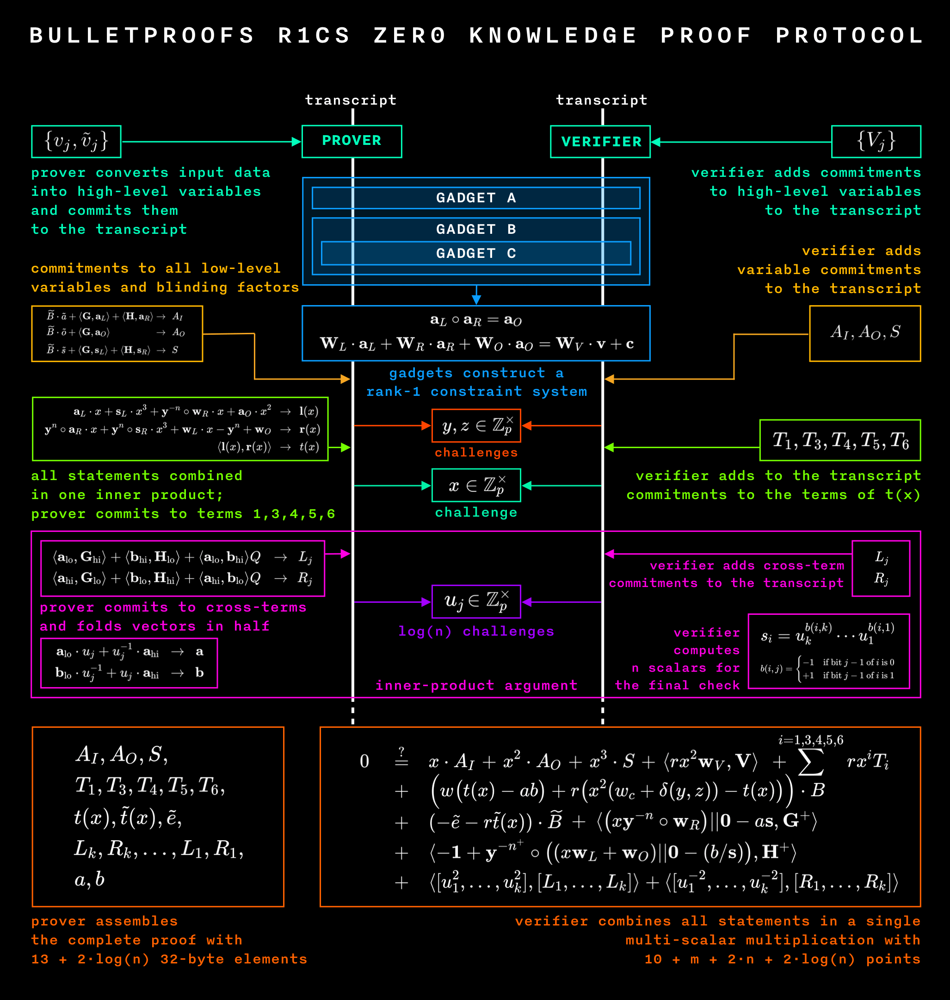

---

R1CS form a thin slice of the TLU reports on Bulletproofs.

The big challenge was to avoid rehearsing things already presented under Bulletproofs.

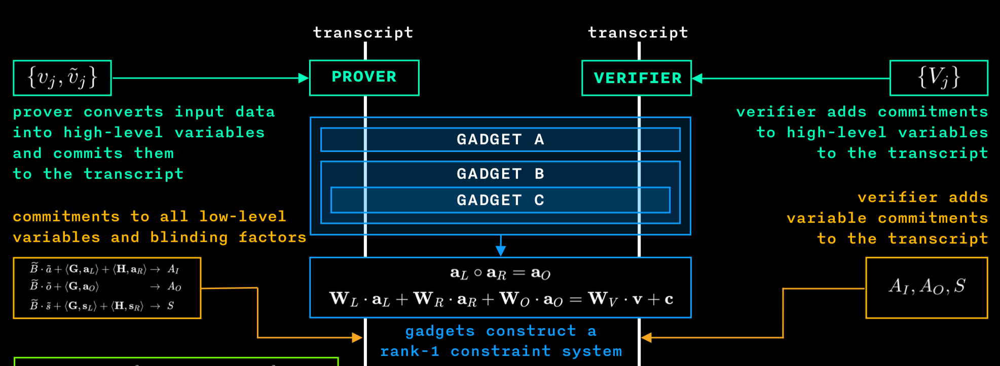

---

So this talk will focus specifically on;
- What an R1CS is
- The link between Arithmetic Circuits and R1CS
- Comparing ZK Proofs for Arithmetic Circuits (Bootle et al.) and Programmable Constraints Systems (Cathie Yun et al.)

---

- We are not worried too much about specific fields.
   - A field is a set of objects (numbers) on which one can define some “addition” and “multiplication”

   -  The idea of R1CS is not that sophisticated or complex.
   -  The main issue here is language. It’s about expressing computational problems in a way that enables fast computations.

---

## Arithmetic Circuits

-  Many problems in Cryptography are expressible as polynomials. Hence Arithmetic Circuits.
-  An arithmetic circuit is a directed acyclic graph.
- The vertices are called gates, while the edges are called wires.
- Every other gate in an Arithmetic Circuit is labeled with either  $\oplus$  or  $\otimes$  indicating an “addition gate” or “multiplication gate”, respectively.

---

- As an equation:  $a_L \circ a_R = a_O$
which is known as the Hadamard relation.

---

- Arithmetic Circuits are the most standard model for expressing computations in a low-level language.

 The output of the above Arithmetic Circuit is the polynomial:   $x^2_1 \cdot x_2 + x_1 + 1$.

---

- The above example of an Arithmetic Circuit can be described
with the following set of equations:

$
u = x_1 \cdot x_1 \quad \text{,} \quad v = u \cdot x_2 \quad \text{,} \quad y = x_1 + 1 \quad \text{and} \quad z = v + y
$

---

## Constraint Systems

- Bootle et al. expressed arithmetic circuit satisfiability in terms of the Hadamard relation and linear constraints.

$$
\mathbf{W_L\cdot { a_L} + W_R\cdot { a_R} + W_O\cdot { a_O } = c }
$$

- Bunz et al. incorporated a vector  $\mathbf{v}$  and vector of weights  $\mathbf{W_V}$ to the Bootle et al. definition:

$$
\mathbf{W_L\cdot { a_L} + W_R\cdot { a_R} + W_O\cdot { a_O } = W_V\cdot { v + c} }
$$

where. $\mathbf{v}$ is a secret vector of openings ${v_i}$ of the Pedersen Commitments  $V_i$  and
$\mathbf{W_V}$  is a vector of weights for all commitments  $V_i$.

---

## Rank-1 Constraint Systems

- An R1CS is a system that consists of two sets of constraints:

  - ${ n}$  multiplicative constraints,  $\mathbf{ a_L \circ a_R = a_O }$,  and
  - ${ q}$  linear constraints,  $\mathbf{W_L\cdot { a_L} + W_R\cdot { a_R} + W_O\cdot { a_O } = W_V\cdot { v + c} }$.

---

- The zkSNARK's corresponding definition of R1CS:

- A sequence of groups of three vectors ${ \bf{a_L}}, { \bf{a_R}}, { \bf{a_O}} ,$ and the
solution to an R1CS is a vector ${ \bf{s}}$ that satisfies the equation:

$$
 \langle \mathbf{a_L} , \mathbf{s} \rangle \cdot \langle \mathbf{a_R} , \mathbf{s} \rangle - \langle \mathbf{a_O} , \mathbf{s} \rangle = 0
$$

$$
\langle  \mathbf{a_L} , \mathbf{s}  \rangle  =  a_{L,1} \cdot s_1  +  a_{L,2} \cdot s_2  +  \cdots  +  a_{L,n} \cdot s_n
$$

which is the inner-product of the vectors  $\mathbf{a_{L}}$  and  ${\mathbf{s}}$

---

# R1CS Example

A solution vector to the equation ${x^2_1 x_2 + x_1 + 1 = 22}$. can be formatted as
${ { s = ( const , x_1 , x_2 , z , u , v , y )}}$, and in particular  ${ { s = ( 1 , 3 , 2 , 22 , 9 , 18 , 4 )}}$.

**Table 1: Equations and Rank-1 Constraint System Vectors**

|  Equation                       |  Rank-1 Constraint System Vectors                                                                                                                   |
|--------------------------------------------------------|----------------------------------------------------------------------------------------------------------------------------------------------------------------------------|
|  ${ u = x_1\cdot x_1}$          |  ${\bf{a_L}} = ( 0 , 1 , 0 , 0 , 0 , 0 , 0 ) , \ \ {\bf{a_R}} = ( 0 , 1 , 0 , 0 , 0 , 0 , 0  ) ,\ \ {\bf{a_O}} = ( 0 , 0 , 0 , 0 , 1 , 0 , 0  )$  |
|  ${ v = u\cdot x_2 }$          |  ${\bf{a_L}} = ( 0 , 0 , 0 , 0 , 1 , 0 , 0 ) ,\ \ {\bf{a_R}} = ( 0 , 0 , 1 , 0 , 0 , 0 , 0  ),\ \ {\bf{a_O}} = ( 0 , 0 , 0 , 0 , 0 , 1 , 0 )$    |
|  ${ y = 1\cdot( x_1 + 1 ) }$  |  ${\bf{a_L}} = ( 1 , 1 , 0 , 0 , 0 , 0 , 0 ),\ \ {\bf{a_R}} = ( 1 , 0 , 0 , 0 , 0 , 0 , 0 ),\ \ {\bf{a_O}} = ( 0 , 0 , 0 , 0 , 0 , 0 , 1 )$        |
|  ${ z = 1\cdot( v + y )}$     |  ${\bf{a_L}} = ( 0 , 0 , 0 , 0 , 0 , 1 , 1 ),\ \ {\bf{a_R}} = ( 1 , 0 , 0 , 0 , 0 , 0 , 0 ),\ \ {\bf{a_O}} = ( 0 , 0 , 0 , 1 , 0 , 0 , 0 )$         |

---

## Arithmetic Circuits to Programmable Constraint Systems

- "Zero-knowledge Proofs for Arithmetic Circuits" by Bootle et al.
- "Programmable Constraint Systems for Bulletproofs" by Cathie Yun, Interstellar.
- "Bulletproofs: Short Proofs for Confidential Transactions and More" by Bunz et al.

---

---

## Interstellar's Bulletproof Constraint System

- Dalek's constraint system, as defined earlier is
a collection of arithmetic constraints of two types,
   - multiplicative constraints and linear constraints, over a set of
high-level and low-level variables.

- A constraint system can be build in two steps:
  1. Committing to secret inputs and allocating high-level variables corresponding to the inputs.
  2. Selecting a suitable combination of multiplicative and linear constraints, also requesting a random scalar in response to committed high-level variables.

---

- Lovesh Harchandani outlines ZK proofs that use Bulletproofs is follows:

   - The prover commits to a value(s) that they want to prove knowledge of.
   - The prover generates the proof by enforcing the constraints over the committed values and any additional public
   values. The constraints might require the prover to commit to some additional variables.
   - The Prover sends to the verifier all the commitments made in step 1 and step 2 along with the proof from step 2.
   - The verifier now verifies the proof by enforcing the same constraints over the commitments plus any public values.

---

- Factors Example:

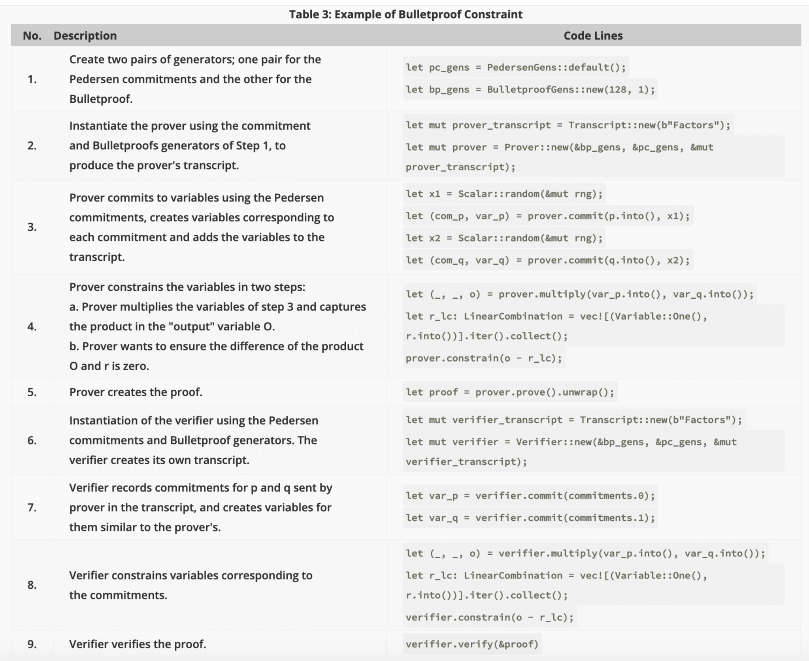

---

- Factors Example:

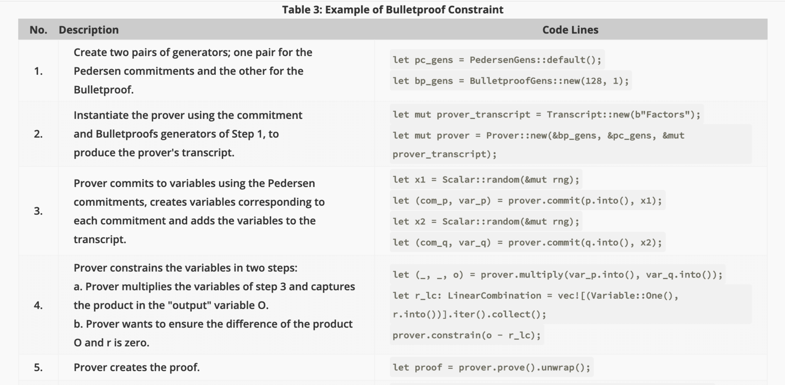

---

- Factors Example:

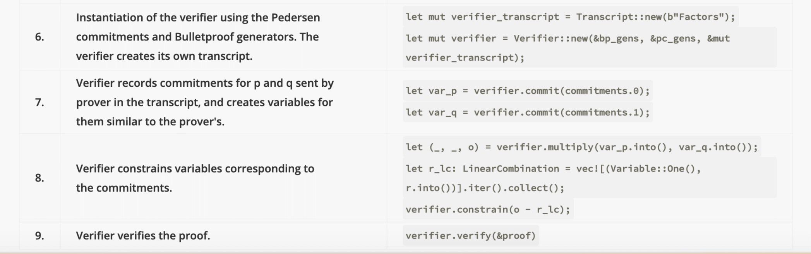

---

## Interstellar's Gadgets

- Gadgets are building blocks of constraint systems;
   - Examples are "shuffle", “merge”, “split” and a “range proof”.

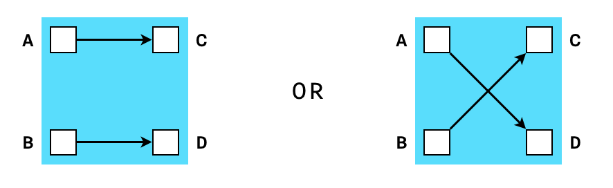

---

   - Gadgets are composable, thus forming a more complex gadget.

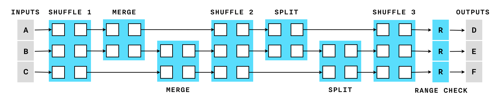

---

   - Gadgets are composable, thus forming a more complex gadget.

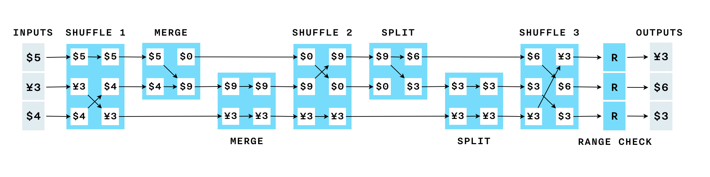

---

## Interstellar's Shuffle Example

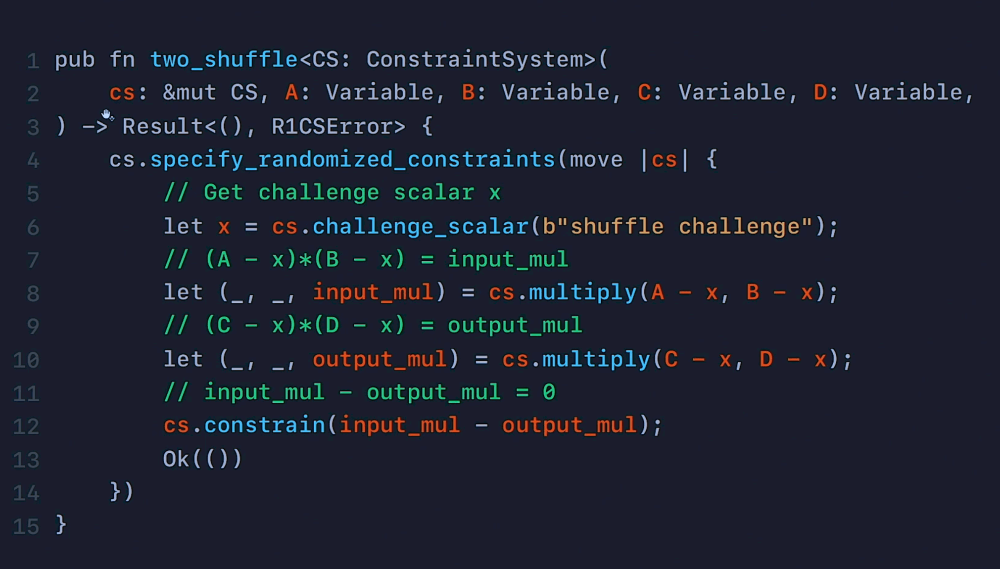

---

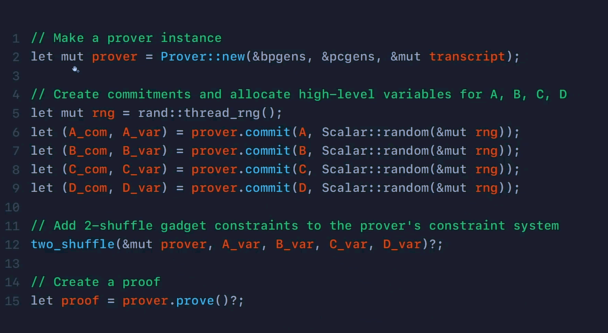

---

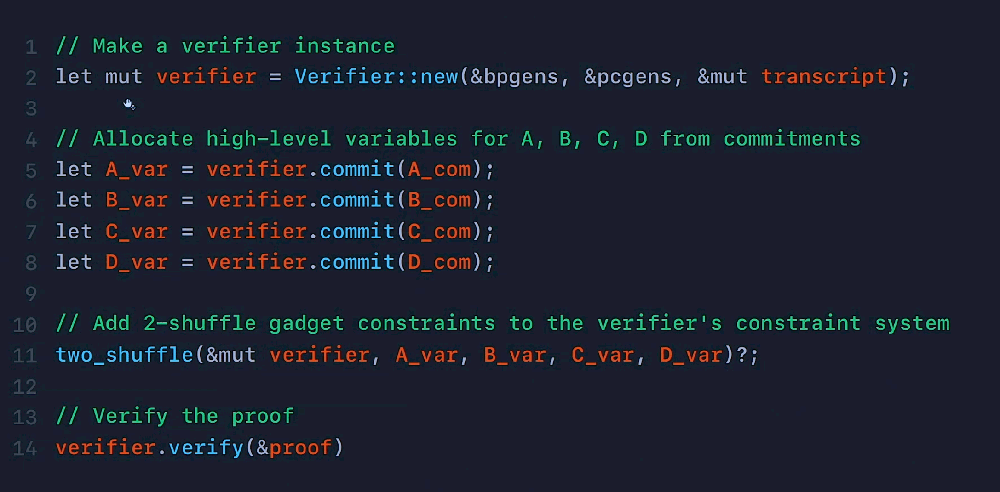

---

## Conclusion

 - Constraint systems - natural language for most computational problems expressed as arithmetic circuits.

 - Constraint systems have found ample application in both zk&#8209;SNARKs and Bulletproofs.

 - The leverage for developers: Choosing gadgets they wish to implement, leaves enough room to build proof systems that have some degree of modularity.

- Possibilities: This Bulletproofs framework provides greater opportunities;  e.g., Building blockchain-enabled confidential digital asset schemes.

