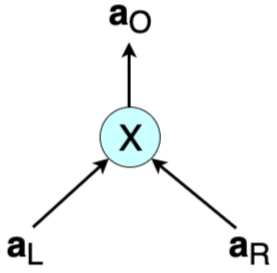
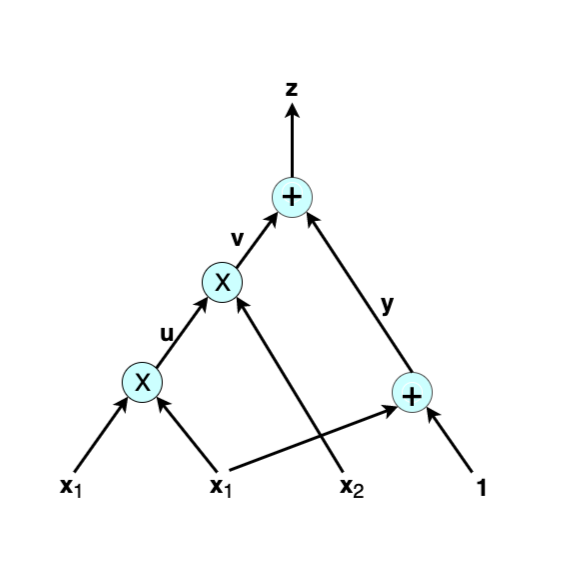
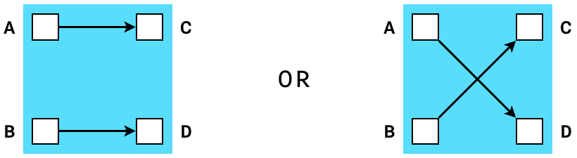

# **Rank-1 Constraint System with Application to Bulletproofs**

- [Introduction](#introduction) 
- [Arithmetic Circuits](#arithmetic-circuits)
  - [Overview](#overview)
  - [Definition of Arithmetic Circuit](#definition-of-arithmetic-circuit)
  - [Example of Arithmetic Circuit](#example-of-arithmetic-circuit) 
- [Rank-1 Constraint Systems](#rank-1-constraint-systems)
  - [Overview](#overview-1)
  - [Definition of Constraint System](#definition-of-constraint-system)
  - [R1CS Definition for zk&#8209;SNARKs](#r1cs-definition-for-zk&#8209;SNARKs)
  - [Example of Rank-1 Constraint System](#example-of-rank-1-constraint-system) 
- [From Arithmetic Circuits to Programmable Constraint Systems for Bulletproofs ](#from-arithmetic-circuits-to-programmable-constraint-systems-for-bulletproofs) 
- [Interstellar's Bulletproof Constraint System](#interstellars-bulletproof-constraint-system)
  - [Overview](#overview-2) 
  - [Easy to Build Constraint Systems](#easy-to-build-constraint-systems) 
  - [About Gadgets](#about-gadgets) 
  - [Interstellar's Concluding Remarks](#interstellars-concluding-remarks) 
  - [R1CS Factorization Example for Bulletproofs ](#r1cs-factorization-example-for-bulletproofs)
- [Conclusions, Observations and Recommendations](#conclusions-observations-and-recommendations)
- [References](#references) 
- [Appendix](#appendices)
  - [Appendix A: Definition of Terms](#appendix-a-definition-of-terms) 
  - [Appendix B: Notation Used](#appendix-b-notation-used)
- [Contributors](#contributors) 

## Introduction 

This report explains the technical underpinnings of Rank-1 Constraint Systems (R1CSs) as applied 
to Bulletproofs. 

The literature on the use of R1CSs in zero-knowledge (ZK) proofs, for example in zero-knowledge Succinct Non-interactive ARguments of Knowledge (zk&#8209;SNARKs), shows that this mathematical tool is used simply as one part of many in 
a complex process towards achieving the proof [[1]]. Not much attention is given to it, not even in explaining 
what "rank-1" actually means. Although the terminology is similar to the traditional _rank of a matrix_ in 
linear algebra, examples on the Internet do not yield a _reduced matrix with only one non-zero row or column_. 

R1CSs became more prominent for Bulletproofs due to research work done by Cathie Yun and her colleagues at Interstellar. The constraint 
system, in particular R1CS, is used as an add-on to Bulletproof protocols. The title of 
Yun's article, "Building on Bulletproofs" 
[[2]] suggests this is true. One of the Interstellar team's goals is to use the constraint system in their 
Confidential Asset Protocol called the Cloak and in their envisaged Spacesuit. 
Despite their work on using R1CS being research in progress, their detailed notes on constraint systems and their 
implementation in RUST are available in [[3]]. 

The aim of this report is to: 

- highlight the connection between arithmetic circuits and R1CSs; 
- clarify the difference R1CSs make in Bulletproofs and in range proofs; 
- compare ZK Proofs for arithmetic circuits and Programmable Constraint System.  

## Arithmetic Circuits

### Overview 

Many problems in _Symbolic Computation_[def][sc~] and cryptography can be expressed as the task of computing some polynomials; and arithmetic circuits form the most standard model for studying the complexity of such computations. ZK proofs form a core building block of many cryptographic protocols. Of special interest are ZK proof systems capable of proving the correct computation of arbitrary arithmetic circuits ([[6]], [[7]]).

### Definition of Arithmetic Circuit 

An **arithmetic circuit** $\mathcal{A}$ over the field $\mathcal{F}$ and the set of variables 
$X = \lbrace  {x_1,\dots,x_n} \rbrace$ is a directed acyclic graph such that the vertices of $\mathcal{A}$ are called 
_gates_, while the edges are called _wires_ [[7]]: 

- A gate is of in-degree  $l$  if it has  $l$  incoming wires, and similarly, of out-degree  $k$  if 
  it has  $k$  outgoing wires. 
- Every gate in  $\mathcal{A}$  of in-degree 0 is labeled by either a variable  ${x_i}$  or some field 
  element from  $\mathcal{F}$.  Such a gate is called an  input gate. Every gate of out-degree  0  is called an 
  output gate or the root. 
- Every other gate in  $\mathcal{A}$  is labeled by either  $\otimes$  or  $\oplus$ , and called a 
  multiplication gate or addition gate, respectively. 
- An arithmetic circuit is called a formula if it is a directed tree whose edges are directed from the leaves 
  to the root. 
- The depth of a node is the number of edges in the longest directed path between the node and the root.
- The size of  $\mathcal{A}$ , denoted  $|\mathcal{A}|$ , is the number of wires, i.e. edges, in  $\mathcal{A}$. 

Arithmetic circuits of interest and most applicable to this report are those with gates of in-degree 2 and out-degree 1. 
A typical multiplication gate has a left input  $a_L$ , a right input  $a_R$  and 
an output  $a_O$ (Figure&nbsp;1). Also, note that  $ a_L \cdot a_R - a_O = 0 $.

<b>Figure 1: Typical Multiplication Gate</b>
 

In cases where the inputs and outputs are all vectors of size 
$n$ , i.e. 
$\mathbf{a\_L} = ( a\_{L, 1}, a\_{L, 2} , \dots , a\_{L, n})$,
$\mathbf{a\_R} = ( a\_{R, 1}, a\_{R, 2} , \dots , a\_{R, n})$ 
and 
$\mathbf{a_O} = ( a\_{O, 1}, a\_{O, 2} , \dots , a\_{O, n})$, 
then multiplication of 
$ \mathbf{a\_L} $ 
and
$ \mathbf{a\_R} $ 
is defined as an entry-wise 
product called the **Hadamard product**; 
$$
\mathbf{a_L}\circ \mathbf{a_R} = \big(( a_{L, 1} \cdot a_{R, 1} ) , ( a_{L, 2} \cdot a_{R, 2} ) , \dots , ( a_{L, n} \cdot 
a_{R, n} ) \big) =  \mathbf{a_O}
$$

The equation ${ \mathbf{a\_L}\circ \mathbf{a\_R} = \mathbf{a\_O} }$ 
is referred to as a multiplicative constraint, 
but is also known as the Hadamard relation [[4]]. 

### Example of Arithmetic Circuit 

An arithmetic circuit computes a polynomial in a natural way, as shown in this example. Consider the following 
arithmetic circuit  $\mathcal{A}$  with inputs  $\lbrace x_1 , x_2 , 1 \rbrace$  over some field  $\mathcal{F}$ : 

<b>Figure 2: Arithmetic Circuit</b>
 

The output of $\mathcal{A}$ above is the polynomial $x^2\_1 \cdot x\_2 + x\_1 + 1 $ of total degree three. A typical 
computational problem would involve finding the solution to, let's say,  $x^2\_1 \cdot x\_2 + x\_1 + 1 = 22$. Or, in a 
proof of knowledge scenario, the prover has to prove to the verifier that they have the correct solution to such an 
equation. Following the wires in the example shows that an arithmetic circuit actually breaks down the given computation 
into smaller equations corresponding to each gate: 

$$
u = x_1 \cdot x_1 \quad \text{,} \quad v = u \cdot x_2 \quad \text{,} \quad y = x_1 + 1 \quad \text{and} \quad z = v + y
$$

The variables $u, v$ and $ y $ are called auxiliary variables or low-level variables, while 
${ z }$  is the output of  $ \mathcal{A} $ . Thus, in addition to computing polynomials naturally, an 
arithmetic circuit helps in reducing a computation to a low-level language involving only two variables, 
one operation and an output. 

ZK proofs in general require that statements to be proved are expressed in their 
simplest terms for efficiency. A ZK proof's end-to-end journey is to create a _function_ 
to write proofs about, yet such a function needs to work with specific constructs.
In making ZK proofs more efficient: "these functions have to be specified as sequences of very simple terms, 
namely, additions and multiplications of only two terms in a particular field" [[8]]. This is where arithmetic circuits come in. 

In verifying a ZK proof, the verifier needs to carry out a step-by-step check of the computations. When these computations are expressed in terms of arithmetic circuits, the process translates to checking
whether the output  $ a_O $  of each gate is correct with respect to the given inputs  
$ a_L $  and  $ a_R $. That is, testing if  $ a_L \cdot a_R - a_O = 0 $  for each multiplication 
gate. 

## Rank-1 Constraint Systems 

### Overview

Although a computational problem is typically expressed in terms of a high-level programming language, a ZK proof requires 
it to be expressed in terms of a set of quadratic constraints, which are closely related to circuits of logical gates. 

Other than in Bulletproof constructions, R1CS types of constraint systems have been featured in several 
constructions of zk&#8209;SNARKs. At times they were simply referred to as quadratic constraints or quadratic equations; refer to 
[[6]], [[9]] and [[10]]. 

### Definition of Constraint System 

A constraint system was originally defined by Bootle et al. in [[5]], who first expressed arithmetic circuit satisfiability in terms of the Hadamard relation and linear constraints.

$$
\mathbf{W_L\cdot { a_L} + W_R\cdot { a_R} + W_O\cdot { a_O } = c }
$$

where $\mathbf{c}$ is a vector of constant terms used in linear constraints, and $\mathbf{W_L, W_R, W_O}$ and $\mathbf{W_V}$ 
are weights applied to respective input vectors and output vectors. Bunz et al. added a vector  $\mathbf{v}$  and weight  $\mathbf{W_V}$ to the Bootle et al. definition [[4]]: 

$$
\mathbf{W_L\cdot { a_L} + W_R\cdot { a_R} + W_O\cdot { a_O } = W_V\cdot { v + c} }
$$

where $\mathbf{v} = {(v_1, v_2, \dots , v_m )}$ is a secret vector of openings ${ v_i}$ of the 
[Pedersen Commitments](../bulletproofs-protocols/MainReport.md#pedersen-commitments-and-elliptic-curve-pedersen-commitments) $V_i, i \in (1,2, \cdots,m) $, and $\mathbf{W_V}$ is a vector of weights for all commitments $V_i$. 

!!Fix!!They included these additional $V_i$ as part of the statement, and provide a protocol for a more general relation, where 
the linear consistency constraints include the openings ${ v_i}$ [[4], page 24]. 

Note that Bulletproofs use the Pedersen 
commitment scheme.

The Dalek team give a more general definition of a constraint system [[3]]. A **constraint system** is a collection of arithmetic constraints over a set of variables. There are two kinds of 
variables in the constraint system:

- ${m}$  **high-level** variables, the input secrets  ${ \mathbf{v}}$; 
- $ n$  **low-level** variables, the internal input vectors  ${ \mathbf{a}_L}$  and 
  ${ \mathbf{a}_R},$  and output vectors  ${ \mathbf{a}_O } $  of the multiplication gates.

Specifically, an R1CS is a system that consists of two sets of constraints [[3]]: 

- ${ n}$  multiplicative constraints,  $ \mathbf{ a_L \circ a_R = a_O } $,  and
- ${ q}$  linear constraints,  $\mathbf{W_L\cdot { a_L} + W_R\cdot { a_R} + W_O\cdot { a_O } = W_V\cdot { v + c} } $. 

### R1CS Definition for zk&#8209;SNARKs 

The use of arithmetic circuits and R1CS are more naturally applied to zk&#8209;SNARKs, and these are  implemented in cryptocurrencies such as Zerocoin and Zcash, see [[1]]. 
In order to illustrate the simplicity of this concept, a definition of an R1CS as it applies to zk&#8209;SNARKs is provided in this paragraph, taken from [[11]]. 

An R1CS is a sequence of groups of three vectors ${ \bf{a_L}}, { \bf{a_R}}, { \bf{a_O}} ,$ and the 
solution to an R1CS is a vector ${ \bf{s}}$ that satisfies the equation:
$$
{ \langle {\mathbf{a_L} , \mathbf{s}} \rangle \cdot \langle {\mathbf{a_R} , \mathbf{s}} \rangle - \langle {\mathbf{a_O} , \mathbf{s}} \rangle = 0 }
$$
where
$$\langle {\mathbf{a_L} , \mathbf{s}} \rangle = a_{L, 1} \cdot s_1 + a_{L, 2} \cdot s_2 + \cdots + a_{L, n} \cdot s_n $$
which is the innerproduct of the vectors 
$ \mathbf{a\_{L}}  =  (a\_{L,1}, a\_{L,2}, ... , a\_{L,n} )$
and
$ {\mathbf{s}} = (s\_1, s\_2, ... , s\_n) $.

### Example of Rank-1 Constraint System 

One solution to the equation ${x^2_1 x_2 + x_1 + 1 = 22}$, from the preceding example of an arithmetic circuit, is ${ x_1 = 3}$ 
and ${ { x_2 = 2 }}$ belonging to the appropriate field ${ \mathcal{F}}$. Thus the solution vector 
${ { s = ( const , x_1 , x_2 , z , u , v , y )}}$ becomes ${ { s = ( 1 , 3 , 2 , 22 , 9 , 18 , 4 )}}$. 

It is easy to check that the R1CS for the computation problem in the preceding example is as follows (one need only test 
if ${ \langle {\mathbf{a_L} , \mathbf{s}} \rangle  \cdot  \langle {\mathbf{a_R} , \mathbf{s}} \rangle - \langle {\mathbf{a_O} , \mathbf{s}} \rangle = 0}$ 
for each equation). 

<b>Table 1: Equations and Rank-1 Constraint System Vectors</b>
  

| Equation                        | Rank-1 Constraint System Vectors                             |
| ------------------------------- | ------------------------------------------------------------ |
| ${ u = x_1\cdot x_1}$          | $ {\bf{a_L}} = ( 0 , 1 , 0 , 0 , 0 , 0 , 0 ) , \ \ {\bf{a_R}} = ( 0 , 1 , 0 , 0 , 0 , 0 , 0  ) ,\ \ {\bf{a_O}} = ( 0 , 0 , 0 , 0 , 1 , 0 , 0  ) $ |
| $ { v = u\cdot x_2 }$          | $ {\bf{a_L}} = ( 0 , 0 , 0 , 0 , 1 , 0 , 0 ) ,\ \ {\bf{a_R}} = ( 0 , 0 , 1 , 0 , 0 , 0 , 0  ),\ \ {\bf{a_O}} = ( 0 , 0 , 0 , 0 , 0 , 1 , 0 )  $ |
| $ { y = 1\cdot( x_1 + 1 ) } $ | ${\bf{a_L}} = ( 1 , 1 , 0 , 0 , 0 , 0 , 0 ),\ \ {\bf{a_R}} = ( 1 , 0 , 0 , 0 , 0 , 0 , 0 ),\ \ {\bf{a_O}} = ( 0 , 0 , 0 , 0 , 0 , 0 , 1 ) $ |
| $ { z = 1\cdot( v + y )} $    | ${\bf{a_L}} = ( 0 , 0 , 0 , 0 , 0 , 1 , 1 ),\ \ {\bf{a_R}} = ( 1 , 0 , 0 , 0 , 0 , 0 , 0 ),\ \ {\bf{a_O}} = ( 0 , 0 , 0 , 1 , 0 , 0 , 0 )$ |

In a more formal definition, an **R1CS** is a set of three matrices  ${\bf{ A_L , A_R }}$  and  ${\bf A_O}$, 
where the rows of each matrix are formed by the corresponding vectors  $ {\bf{a_L }}$,  ${ \bf{a_R }}$  and 
${ \bf{a_O}} $, respectively, as shown in Table 1: 

$$
\bf{A_L} = \bf{\begin{bmatrix} 0&1&0&0&0&0&0 \\\\ 0&0&0&0&1&0&0 \\\\ 1&1&0&0&0&0&0 \\\\ 0&0&0&0&0&1&1 \end{bmatrix}} \text{,} \quad 
\bf{A_R} = \bf{\begin{bmatrix} 0&1&0&0&0&0&0 \\\\ 0&0&1&0&0&0&0 \\\\ 1&0&0&0&0&0&0 \\\\ 1&0&0&0&0&0&0 \end{bmatrix}} \text{,} \quad 
\bf{A_O} = \bf{\begin{bmatrix} 0&0&0&0&1&0&0 \\\\ 0&0&0&0&0&1&0 \\\\ 0&0&0&0&0&0&1 \\\\ 0&0&0&1&0&0&0 \end{bmatrix}}
$$

Observe that ${ \bf{ (A_L  *  s^T) \cdot (A_R  *  s^T ) - (A_O  *  s^T)} = 0 }$, where "$ * $" is 
_matrix multiplication_ and ${ \bf s^T}$ is the transpose of the solution vector ${ \bf{s}}$, [[8]]. 

  

## From Arithmetic Circuits to Programmable Constraint Systems for Bulletproofs 

Interstellar's Programmable Constraint Systems for Bulletproofs [[12]]
is an extension of "Zero-knowledge Proofs for Arithmetic Circuits" by Bootle et al. [[5]], enabling protocols that 
support proving of arbitrary statements in ZK using constraint systems. Although the focus here is on the 
two works of research [[5]] and [[12]], the _Bulletproofs paper_ by Bunz et al. [[4]] is here recognized as a bridge 
between the two. The comparison among these **three** works of research is shown in Table 2 below.

All these are ZK proofs are based on the difficulty of the discrete logarithm problem. 

<b>Table 2: Comparison of three Research Works on ZK Proofs</b>
  

| No.  | Efficient Zero-knowledge Arguments for Arithmetic Circuits in the Discrete Log Setting [[5]] (2016) | Bulletproofs: Short Proofs for Confidential Transactions and More [[4]] (2017) | Programmable Constraint Systems  [[12]] (2018)               |
| ---- | ------------------------------------------------------------ | ------------------------------------------------------------ | ------------------------------------------------------------ |
| 1.   | Introduces the Hadamard relation and linear constraints.     | Turns the Hadamard relation and linear constraints into a single linear constraint, and these are in fact the R1CS. | Generalizes constraint systems and uses what is called gadgets as building blocks for constraint systems. |
| 2.   | Improves on Groth's work [[13]] on ZK proofs. Reducing a $\sqrt{N}$  complexity to  $6log_2(N) + 13$, where $N$  is the circuit size. | Improves on Bootle et al.'s work [[5]]. Reducing a $2log_2(N) + 13$ complexity to  $6log_2(N) + 13$, where $N$ is the circuit size. | Adds constraint systems to Bunz et al.'s work on Bulletproofs, which are short proofs, and the complexity advantage is seen in proving several statements at once. |
| 3.   | Introduces logarithm-sized inner-product ZK proofs.          | Introduces Bulletproofs, extending proofs to proofs of arbitrary statements. The halving method is used on the inner-products, resulting in the above reduction in complexity. | Introduces gadgets that are actually add-ons to an ordinary ZK proof. A range proof is an example of a gadget. |
| 4.   | Uses Fiat-Shamir heuristics in order to achieve non-interactive ZK proofs. | Bulletproofs also use the Fiat Shamir heuristics to achieve non-interaction. | Merlin transcripts are specifically used for a Fiat-Shamir transformation to achieve non-interaction. |
| 5.   | The Pedersen commitments are used in order to achieve ZK property. | Eliminates the need for a commitment algorithm by including Pedersen commitments among the inputs to the verification proof. | Low-level variables, representing inputs and outputs to multiplication gates, are computed per proof and committed using a single vector Pedersen commitment. |
| 6.   | The ZK proof involves conversion of the arithmetic circuit into an R1CS. | The mathematical expression of a Hadamard relation is closely related to an arithmetic circuit. The use of this relation plus linear constraints as a single constraint amounts to using a constraint system. | Although arithmetic circuits are not explicitly used here, the Hadamard relation remains the same as first seen in Bulletproofs, more so in the inner-product proof. |

Interstellar is building an Application Programming Interface (API) that allows developers to choose their own collection of gadgets suitable for the protocol they wish to develop, as discussed in the [next section](#interstellars-bulletproof-constraint-system). 

## Interstellar's Bulletproof Constraint System

### Overview 

The Interstellar team paved the way towards the implementation of several cryptographic primitives in the RUST language, 
including _Ristretto_ [[14]], a construction 
of a prime-order group using a cofactor-8 curve known as Curve25519. They reported on how they implemented Bulletproofs 
in Henry de Valence's article entitled "Bulletproofs pre-release" [[15]]. 
An update on their progress in extending the Bulletproofs implementation [[16]] 
to a constraint system API, which enables ZK proofs of arbitrary statements, was given in Cathie Yun's 
article, "Programmable Constraint Systems for Bulletproofs"
[[12]]. The Hadamard relation and linear constraints together 
form the constraint system as formalized by the Interstellar team. Most of the mathematical background of these 
constraints and bulletproofs is contained in Bunz et al.'s paper [[4]].

Dalek's constraint system, as defined earlier in [Definition of Constraint System](#definition-of-constraint-system), is 
a collection of arithmetic constraints of two types, multiplicative constraints and linear constraints, over a set of 
high-level and low-level variables. 

 

### Easy-to-build Constraint Systems 

In this bulletproofs framework, a prover can build a constraint system in two steps:

1. Committing to secret inputs and allocating high-level variables corresponding to the inputs.
1. Selecting a suitable combination of multiplicative constraints and linear constraints, as well as requesting a random 
   scalar in response to the high-level variables already committed [[3]]. 

In [[17]] an excellent outline of ZK proofs that use Bulletproofs is given: 

1. The prover commits to a value(s) that they want to prove knowledge of. 
1. The prover generates the proof by enforcing the constraints over the committed values and any additional public 
   values. The constraints might require the prover to commit to some additional variables. 
1. The Prover sends the verifier all the commitments made in step 1 and step 2 along with the proof from step 2. 
1. The verifier now verifies the proof by enforcing the same constraints over the commitments plus any public values.

### About Gadgets 

Consider a verifiable shuffle: given two lists of committed values  ${ x_1, x_2, . . . , x_n}$  and 
${ y_1, y_2, . . . , y_n} ,$ prove that the second list is a permutation of the first. Bunz et al. ([[4], page 5]) mention that 
the use of bulletproofs improves the complexity of such a verifiable shuffle to size $\mathcal{O}(log(n))$ compared to 
previous implementation results. Although not referred to as a _gadget_ in the paper, this is in 
fact a shuffle gadget. The term gadget was used and popularized by the Interstellar team, who introduced gadgets 
as building blocks of constraint systems; refer to [[2]]. 

A _shuffle gadget_ (Figure&nbsp;3) is any function whose outputs are but a permutation of its inputs. By definition of a permutation, the 
number of inputs to a shuffle gadget is always the same as the number of outputs. 

<b>Figure 3: Simple Shuffle Gadgets with Two Inputs 
[<a href="https://medium.com/@cathieyun/building-on-bulletproofs-2faa58af0ba8" title="Building on Bulletproofs">2</a>]
</b>

The Interstellar team mentions other gadgets: “merge”, “split” and a “range proof”, that are implemented in their 
Confidential Assets scheme called the Cloak. 
Just as a shuffle gadget creates constraints which prove that 
two sets of variables are equal up to a permutation, a range proof gadget checks that a given value is in the 
$ [ 0, 2^n ] $ 
where 
$ n $ 
is size of the input vector
[[3]]. 

Gadgets in their simplest form merely receive some variables as inputs and produce corresponding output values. However, they 
may allocate more variables for internal use, sometimes called auxiliary variables, and produce constraints involving all these variables. The main advantage of gadgets is that they are composable, thus a more complex 
gadget can always be created from a number of single gadgets. Interstellar's Bulletproofs API allows developers to 
 choose their own collection of gadgets suitable for the protocol they wish to develop. 

### Interstellar's Concluding Remarks 

Cathie Yun reports in [[12]] that their "work on Cloak and Spacesuit is far from complete" and mentions that they 
still have two more goals to achieve: 

- Firstly, in order to "ensure that challenge-based variables cannot be inspected" and prevent the user from 
  accidentally breaking soundness of their gadgets, the Bulletproofs protocol needs to be slightly extended, enabling it 
  to commit "to a portion of low-level variables using a single vector Pedersen commitment without an overhead of 
  additional individual high-level Pedersen commitments" [[12]]. 
- Secondly, to "improve privacy in Cloak" by enabling "multi-party proving of a single constraint system". That is, 
  "building a joint proof of a single constraint system by multiple parties, without sharing their secret inputs with 
  each other".

All-in-all, Yun regards constraint systems as "very powerful because they can represent any efficiently 
verifiable program" [[2]]. 

### R1CS Factorization Example for Bulletproofs 

In [[17]], Harchandani explores the Dalek Bulletproofs API with various examples. Of interest
is the factorization problem, which is one out of the six R1CS Bulletproof examples 
discussed in the article. 
The computational challenge is to "_prove knowledge of factors_ p 
_and_ q _of a given number_ r _without revealing the factors_". 

Table 3 gives an outline of the description and the code lines of the example. Harchandani's complete 
code of this example can be found in [[18]]. Important to note is that the verifier must have an exact copy of the R1CS 
circuit used by the prover.

<b>Table 3: Example of Bulletproof Constraint</b>
  

| No.  | Description                                                  | Code Lines                                                   |
| ---- | :----------------------------------------------------------- | ------------------------------------------------------------ |
| 1.   | Create two pairs of generators; one pair for the  Pedersen commitments and the other for the  Bulletproof. | `let pc_gens = PedersenGens::default();` `let bp_gens = BulletproofGens::new(128, 1);` |
| 2.   | Instantiate the prover using the commitment  and Bulletproofs generators of Step 1, to  produce the prover's transcript. | `let mut prover_transcript = Transcript::new(b"Factors");` `let mut prover = Prover::new(&bp_gens, &pc_gens, &mut prover_transcript);` |
| 3.   | Prover commits to variables using the Pedersen  commitments, creates variables corresponding to  each commitment and adds the variables to the  transcript. | `let x1 = Scalar::random(&mut rng);` `let (com_p, var_p) = prover.commit(p.into(), x1);` `let x2 = Scalar::random(&mut rng);` `let (com_q, var_q) = prover.commit(q.into(), x2);` |
| 4.   | Prover constrains the variables in two steps:  a) Prover multiplies the variables of step 3 and captures  the product in the "output" variable O.  b) Prover wants to ensure the difference of the product O and r is zero. | `let (_, _, o) =  prover.multiply(var_p.into(), var_q.into());` `let r_lc: LinearCombination = vec![(Variable::One(),      r.into())].iter().collect();` `prover.constrain(o -  r_lc);` |
| 5.   | Prover creates the proof.                                    | `let proof = prover.prove().unwrap();`                       |
| 6.   | Instantiation of the Verifier using the Pedersen  commitments and Bulletproof generators, and  creates its own transcript. | `let mut verifier_transcript = Transcript::new(b"Factors");` `let mut verifier = Verifier::new(&bp_gens, &pc_gens, &mut verifier_transcript);` |
| 7.   | Verifier records commitments for p and q sent by  prover in the transcript, and creates variables for  them similar to the prover's. | `let var_p = verifier.commit(commitments.0);` `let var_q = verifier.commit(commitments.1);` |
| 8.   | Verifier constrains variables corresponding to  the commitments. | `let (_, _, o) =  verifier.multiply(var_p.into(), var_q.into());` `let r_lc: LinearCombination = vec![(Variable::One(), r.into())].iter().collect();` `verifier.constrain(o -  r_lc);` |
| 9.   | Verifier verifies the proof.                                 | `verifier.verify(&proof)`                                    |

## Conclusions, Observations and Recommendations 

Constraint systems form a natural language for most computational problems expressed as arithmetic circuits, and have 
found ample application in both zk&#8209;SNARKs and Bulletproofs. Although much work still needs to be done, Bulletproofs with 
constraint systems built on them promise to be powerful tools for efficient handling of verifiable programs. The 
leverage that developers have, in choosing whatever gadgets they wish to implement, leaves enough room to build proof 
systems that have some degree of modularity. Proof system examples by both Dalek and Harchandani are valuable examples of what can be achieved with Bulletproofs and  R1CSs. The possibility of using this Bulletproofs framework in building 
blockchain-enabled confidential digital asset schemes provides greater opportunities. 

## References 

[[1]] A. Gabizon, "Explaining SNARKs Part V: From Computations to Polynomials", [online]. Available:
<https://electriccoin.co/blog/snark-explain5/>. Date accessed: 2020&#8209;01&#8209;03.

[1]:  https://electriccoin.co/blog/snark-explain5/ "Explaining SNARKs Part V: From Computations to Polynomials"

[[2]] C. Yun, "Building on Bulletproofs", [online]. Available: <https://medium.com/@cathieyun/building-on-bulletproofs-2faa58af0ba8>. 
Date accessed: 2020&#8209;01&#8209;03.

[2]: https://medium.com/@cathieyun/building-on-bulletproofs-2faa58af0ba8 "Building on Bulletproofs"

[[3]] Dalek's R1CS documents, "Module Bulletproofs::r1cs_proof", [online]. Available: 
<https://doc-internal.dalek.rs/bulletproofs/notes/r1cs_proof/index.html>. Date accessed: 2020&#8209;01&#8209;07. 

[3]: https://doc-internal.dalek.rs/bulletproofs/notes/r1cs_proof/index.html "Module Bulletproofs::Notes::r1cs_proof"

[[4]] B. Bünz, J. Bootle, D. Boneh, A. Poelstra, P. Wuille and G. Maxwell, "Bulletproofs: Short Proofs for Confidential 
Transactions and More", Blockchain Protocol Analysis and Security Engineering 2018 [online]. 
Available: <http://web.stanford.edu/~buenz/pubs/bulletproofs.pdf>. Date accessed: 2019&#8209;11&#8209;21.

[4]: http://web.stanford.edu/~buenz/pubs/bulletproofs.pdf "Bulletproofs: Short Proofs for Confidential Transactions and More"

[[5]]  J. Bootle, A. Cerulli, P. Chaidos, J. Groth and C. Petit, "Efficient Zero-knowledge Arguments for Arithmetic Circuits in the Discrete Log Setting", Annual International Conference on the Theory and Applications of Cryptographic Techniques, pp. 327‑357. Springer, 2016 [online]. Available: <https://eprint.iacr.org/2016/263.pdf> Date accessed: 2019&#8209;12&#8209;21.

[5]: https://eprint.iacr.org/2016/263.pdf "Efficient Zero-knowledge Arguments for Arithmetic Circuits in the Discrete Log Setting"

[[6]] A. Szepieniec and B. Preneel, "Generic Zero-knowledge and Multivariate Quadratic Systems" [online]. Available: 
<https://pdfs.semanticscholar.org/06c8/ea507b2c4aaf7b421bd0c93e6145e3ff7517.pdf?_ga=2.124585865.240482160.1578465071-151955209.1571053591>. 
Date accessed: 2019&#8209;12&#8209;31.

[6]: https://pdfs.semanticscholar.org/06c8/ea507b2c4aaf7b421bd0c93e6145e3ff7517.pdf?_ga=2.124585865.240482160.1578465071-151955209.1571053591 "Generic Zero-knowledge and MultiQuadratic Systems"

[[7]] A. Shpilka and A. Yehudayoff, "Arithmetic Circuits: A Survey of Recent Results and Open Questions", 
Technion-Israel Institute of Technology, Haifa, Israel, 2010 [online]. Available: <http://www.cs.tau.ac.il/~shpilka/publications/SY10.pdf>. Date accessed: 2019&#8209;12&#8209;21. 

[7]: http://www.cs.tau.ac.il/~shpilka/publications/SY10.pdf "Arithmetic Circuits: A Survey of Recent Results and Open Questions"

[[8]] A. Pinto, "Constraint Systems for ZK SNARKs", [online]. Available: 
<http://coders-errand.com/constraint-systems-for-zk&#8209;SNARKs/>. Date accessed: 2019&#8209;12&#8209;23.

[8]: http://coders-errand.com/constraint-systems-for-zk&#8209;SNARKs/ "Constraint Systems for ZK SNARKs"

[[9]] H. Wu, W. Zheng, A. Chiesa, R. Ada Popa, and I. Stoica, "DIZK: A Distributed Zero Knowledge 
Proof System", Proceedings of the 27th USENIX Security Symposium, August 15–17, 2018 [online]. Available: 
<https://www.usenix.org/system/files/conference/usenixsecurity18/sec18-wu.pdf>. Date accessed: 2019&#8209;12&#8209;14. 

[9]: https://www.usenix.org/system/files/conference/usenixsecurity18/sec18-wu.pdf
"DIZK: A Distributed Zero 
Knowledge Proof System" 

[[10]] E. Ben-Sasson, A. Chiesa, D. Genkin, E. Tromer and M. Virza, "SNARKs for C: Verifying Program 
Executions Succinctly and in Zero Knowledge (extended version)," October 2013 [online]. Available: 
<https://eprint.iacr.org/2013/507.pdf>. Date accessed: 2019&#8209;12&#8209;17. 

[10]: https://eprint.iacr.org/2013/507.pdf "SNARKs for C: Verifying Program Executions Succinctly and in Zero Knowledge (extended version)"

[[11]] V. Buterin, "Quadratic Arithmetic Programs: from Zero to Hero," 12 December 2016 [online]. Available: 
<https://medium.com/@VitalikButerin/quadratic-arithmetic-programs-from-zero-to-hero-f6d558cea649>. Date accessed: 2019&#8209;12&#8209;19.

[11]: https://medium.com/@VitalikButerin/quadratic-arithmetic-programs-from-zero-to-hero-f6d558cea649 "Quadratic Arithmetic Programs: from Zero to Hero"

[[12]] C. Yun, "Programmable Constraint Systems for Bulletproofs" [online]. Available: 
<https://medium.com/interstellar/programmable-constraint-systems-for-bulletproofs-365b9feb92f7>. Date accessed: 2019&#8209;12&#8209;04.

[12]: https://medium.com/interstellar/programmable-constraint-systems-for-bulletproofs-365b9feb92f7 "Programmable Constraint Systems for Bulletproofs"

[[13]]  J. Groth, "Linear Algebra with Sub-linear Zero-knowledge Arguments", Advances in Cryptology – CRYPTO 2009, 
pages 192–208, 2009 [online]. Available: <https://iacr.org/archive/crypto2009/56770190/56770190.pdf>. Date accessed: 2019&#8209;12&#8209;04.

[13]: https://iacr.org/archive/crypto2009/56770190/56770190.pdf "Linear Algebra with Sub-linear Zero-knowledge Arguments"

[[14]]  Dalek, "Ristretto", [online]. Available: <https://docs.rs/curve25519-dalek/0.15.1/curve25519_dalek/ristretto/index.html> Date accessed: 2019&#8209;10&#8209;17

[14]: https://docs.rs/curve25519-dalek/0.15.1/curve25519_dalek/ristretto/index.html "Ristretto"

[[15]] H. Valence, "Bulletproofs pre-release", [online]. Available: <https://medium.com/interstellar/bulletproofs-pre-release-fcb1feb36d4b> Date accessed: 2019&#8209;11&#8209;21.

[15]: https://medium.com/interstellar/bulletproofs-pre-release-fcb1feb36d4b "Bulletproofs pre-release"

[[16]] Dalek, "Bulletproofs Implementation", [online]. Available:
<http://github.com/dalek-cryptography/bulletproofs/> Date accessed: 2019&#8209;10&#8209;02.

[16]: http://github.com/dalek-cryptography/bulletproofs/ "Dalek&#39;s Bulletproofs Implementation"

[[17]] L. Harchandani, "Zero Knowledge Proofs using Bulletproofs" [online]. Available: 
<https://medium.com/coinmonks/zero-knowledge-proofs-using-bulletproofs-4a8e2579fc82>. Date accessed: 2020&#8209;01&#8209;03.

[17]: https://medium.com/coinmonks/zero-knowledge-proofs-using-bulletproofs-4a8e2579fc82
"Zero Knowledge Proofs 
using Bulletproofs"

[[18]] L. Harchandani, "Factors R1CS Bulletproofs Example", [online]. Available: <https://github.com/lovesh/bulletproofs/blob/e477511a20bdb8de8f4fa82cb789ba71cc66afd8/tests/basic_r1cs.rs#L17>. Date accessed: 2019&#8209;10&#8209;02. 

[18]: https://github.com/lovesh/bulletproofs/blob/e477511a20bdb8de8f4fa82cb789ba71cc66afd8/tests/basic_r1cs.rs#L17 "Factors R1CS Bulletproofs Example"

[[19]] "Computer Algebra", [online]. Available: <https://en.wikipedia.org/wiki/Computer_algebra>. Date accessed: 2020&#8209;02&#8209;05. 

[19]: https://en.wikipedia.org/wiki/Computer_algebra "Computer Algebra - Wikipedia"

[[20]]  Wikipedia: "NP (complexity)", [online]. Available:  <https://en.wikipedia.org/wiki/NP_(complexity)> . Date accessed: 2020&#8209;02&#8209;06. 

[20]: https://en.wikipedia.org/wiki/NP_(complexity) "NP (complexity) - Wikipedia"

[[21]] Wikipedia: "Binary Operation", [online]. Available: <https://en.wikipedia.org/wiki/Binary_operation >. Date accessed: 2020&#8209;02&#8209;06. 

[21]: https://en.wikipedia.org/wiki/Binary_operation "Field Theory - WolframMathWorld"

[[22]] WolframMathWorld, "Field Theory", [online]. Available: <http://mathworld.wolfram.com/FieldAxioms.html>. Date accessed: 2020&#8209;02&#8209;06. 

[22]: http://mathworld.wolfram.com/FieldAxioms.html "Field Theory - WolframMathWorld"

[[23]] Wikipedia: "Finite Theory", [online]. Available: <https://en.wikipedia.org/wiki/Finite_field>. Date accessed: 2020&#8209;02&#8209;06. 

[23]: https://en.wikipedia.org/wiki/Finite_field "Field Theory - Wikipedia"

## Appendices

### Appendix A: Definition of Terms

Definitions of terms presented here are high level and general in nature. Full mathematical definitions are available in the cited references. 

- **Symbolic Computation**:The study and development of algorithms and software for manipulating mathematical expressions and other mathematical objects [[19]]. 

[sc~]: #sc
"The study and development of algorithms 
and software for manipulating ..."

- **NP statements**: A statement that is non-deterministically provable in polynomial time [[20]]. 

- **Binary Operation**: An operation  $ * $  or a calculation that combines two elements  $ \mathcal{a} $  and  $ \mathcal{b} $ , called operands, to produce another element  $ \mathcal{a} * \mathcal{b} $ , [[21]].

- **Field**: Any set  $ \mathcal{F} $  of elements together with binary operations $ + $ and  $ \cdot $  , called addition and multiplication, respectively, is a **field** if for any three elements $ \mathcal{a}, \mathcal{b} $ and $ \mathcal{c} $ in $ \mathcal{F} $  satisfy the field axioms given in the table below. A **Finite field** is any field  $ \mathcal{F} $  that contains a finite number of elements ([[22]], [[23]]).

 

<b>Table A1: Axioms of a Field </b>
 

| name           | addition                                                     | multiplication                                               |
| -------------- | ------------------------------------------------------------ | ------------------------------------------------------------ |
| associativity  |  |  |
| commutativity  |  |  |
| distributivity |  |  |
| identity       |  |  |
| inverses       |  |  |

### Appendix B: Notation Used 

- Let  $ \mathbf{a} = (a_1 , a_2 , ... , a_n ) $  be a vector with  $n$  components  $ a_1 , a_2 , ... , a_n $,  which are elements of some field $ \mathcal{F} $.  

- Let $\mathbf{s}^T$ be the transpose of a vector  $ \mathbf{s} = ( s_1 , s_2 , \dots , s_n )$  of size  $ n $ such that 
  $ \mathbf{s}^T = \begin{bmatrix} s_1 \\\\ s_2 \\\\ \cdot \\\\ \cdot \\\\ \cdot \\\\ s_n \end{bmatrix} $ 

## Contributors 

- <https://github.com/Empiech007>
- <https://github.com/hansieodendaal> 
- <https://github.com/anselld> 
