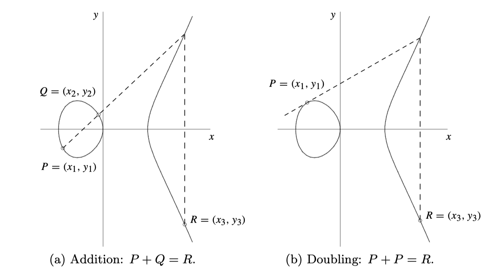
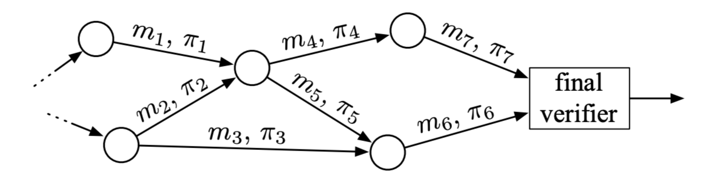
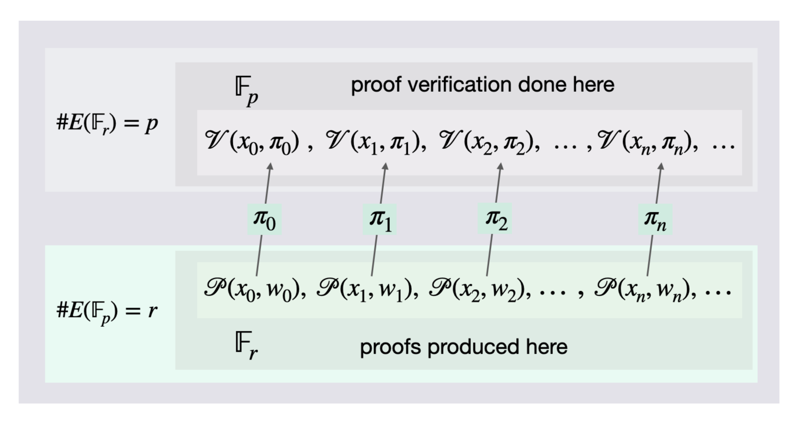
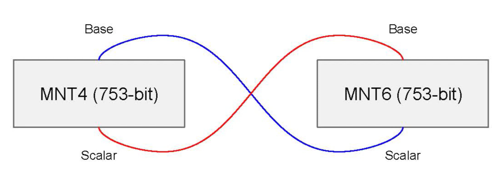
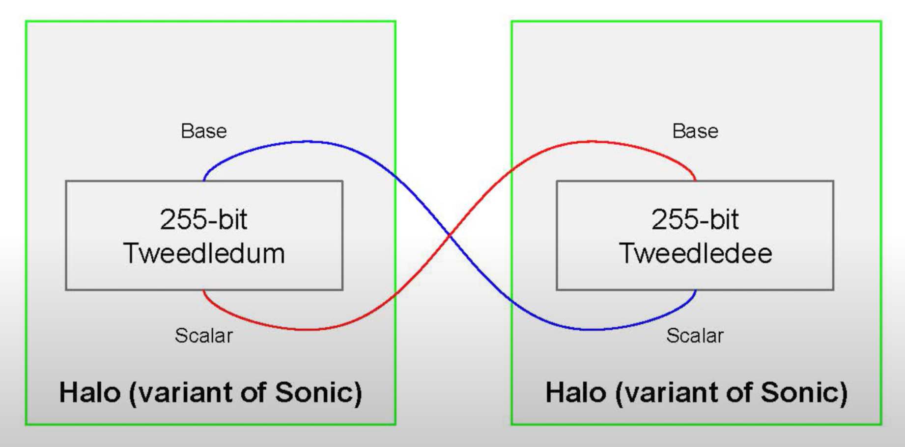
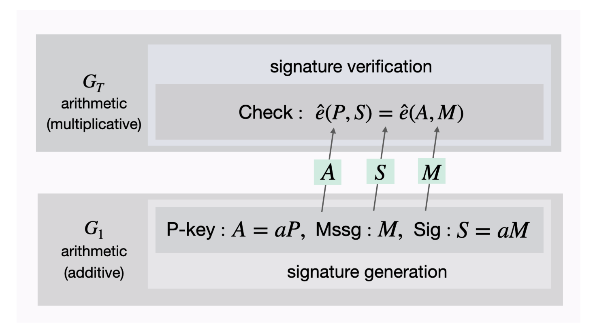

# Trustless Recursive Zero-Knowledge Proofs

- [Introduction](#introduction) 
- [Notation and Preliminaries](#notation-and-preliminaries)
  - [Fields and Elliptic Curves](#fields-and-elliptic-curves)
     - [Example 1](#example-1)
  - [Arithmetic Circuits and R1CS](#arithmetic-circuits-and-r1cs) 
- [Recursive Proofs Composition Overview](#recursive-proofs-composition-overview) 
  - [Verification Amortization Strategies](#verification-amortization-strategies)
- [Proof-Carrying Data](#proof-carrying-data) 
  - [What is a PCD?](#what-is-a-pcd) 
  - [Trustlessness via PCDs](#trustlessness-via-pcds)
- [Cycles of Elliptic Curves](#cycles-of-elliptic-curves) 
  - [Why Cycle of Elliptic Curves?](#why-cycle-of-elliptic-curves)
    - [The Native Field Arithmetic](#the-native-field-arithmetic)
    - [Example 2](#example-2)
    - [The Order of the Scalar Field](#the-order-of-the-scalar-field) 
    - [No Prover-Verifier Dichotomy](#no-prover-verifier-dichotomy)
  - [Pairing-friendly Elliptic Curves](#pairing-friendly-elliptic-curves) 
  - [Amicable Pairs of Elliptic Curves](#amicable-pairs-of-elliptic-curves) 
- [Brief Survey: Recursive Proofs Protocols](#brief-survey-recursive-proofs-protocols) 
  - [Coda Protocol](#coda-protocol) 
  - [Sonic Protocol](#sonic-protocol)
  - [Halo Protocol](#halo-protocol) 
- [Conclusion](#conclusion) 
- [References](#references)
- [Appendix A: Pairing Cryptography](#appendix-a-pairing-cryptography) 
- [Contributors](#contributors)

## Introduction 

In pursuit of blockchain scalability investigation in this report focuses on 
the second leg of recursive proofs composition: 
"proofs that verify other proofs". 

Recursive proofs composition is like a huge machinery with many moving parts. 
For the sake of brevity, the aim here is to present only the most crucial 
cryptographic tools and techniques required to achieve recursive proofs composition. 

Amortization strategies that recursive proofs use to accomplish reduced 
verification costs are enabled by a powerful tool called a 
[Proof-Carrying Data](#proof-carrying-data) or PCD, first introduced by Alessandro Chiesa in his PhD thesis [[4]]. 
The resulting proof system is made efficient and more practical by the use of a technique 
that utilises [cycles of elliptic curves](#cycles-of-elliptic-curves), first realised by Eli Ben-Sasson et al [[2]]. 
These two are what the report hinges around.  

The details of recursive proofs composition are in the mathematics. So effort is taken 
to simplify concepts, while keeping technical reader's interests in mind. 
At the end the reader will appreciate the power of recursive proofs composition, how 
it uses PCDs and cycles of elliptic curves, as well as why it needs the two to achieve 
significant blockchain scalability. 

## Notation and Preliminaries 

Notation and terminology in this report is standard. But in order to achieve a clear understanding of
the concept of [cycles of elliptic curves](#cycles-of-elliptic-curves), a few basic facts about elliptic curves are herein ironed 
out. 

### Fields and Elliptic Curves

A **field** is any set 
$\mathbb{F}$ 
of objects upon which addition '$+$' and multiplication '$*$' 
are defined in a specific way, and such that 
$( \mathbb{F}, + )$ 
forms an abelian group and 
$( \mathbb{F} \backslash \\{ 0 \\} , * )$ 
also forms 
an abelian group of non-zero elements with an identity $1_{\mathbb{F}}$.  The most common notation for 
$ \mathbb{F} \backslash \\{ 0 \\} $ is $ \mathbb{F}^{\times}.$ 
A more elaborate definition of a field can be found [here](http://localhost:3000/cryptography/r1cs-bulletproofs/mainreport.html#appendix-a-definition-of-terms). 

Note that in blockchain research papers an elliptic curve refers to what is actually an elliptic curve group. 
This can cause confusion especially when talking about the **scalar field** as opposed to the **base field**. 

- In Mathematics an **elliptic curve** $E$ over a field 
$\mathbb{F}$ 
generally refers to a locus, 
that is 
the curve formed by all the points satisfying a given equation. 
For example, an equation of the form 
$y^2 = x^3 - ax + b$ 
where $a$ and $b$ 
are elements of some field $\mathbb{F}$, 
say the rationals $\mathbb{Q}$, the reals $\mathbb{R}$ or 
the complex numbers $\mathbb{C}.$ 
Such a field $\mathbb{F}$ is referred to as the **base field** for $E$. 

- The fields; $\mathbb{Q}$, $\mathbb{R}$ and $\mathbb{C}$; are infinite sets and are thus not 
useful for cryptographic purposes. 
In cryptography, base fields that are of practical purposes are preferably finite and 
of a large prime order. 
This ensures that the discrete log problem is sufficiently difficult, making the cryptosystem 
secure against common cryptanalytic attacks. 

- Note that all finite fields are either of prime order or power of a prime. 
So then any finite field $\mathbb{F}$ is either $\mathbb{F}\_p$ 
or $\mathbb{F}\_{p^n}$ for some prime number $p$. 
See [[6], Lemma 3.19] for the proof of this fact. 
Actually, it can be shown that the orders of 
their respective multiplicative groups $\mathbb{F}\_p^{\times}$ and $\mathbb{F}\_{p^n}^{\times}$ are 
$p-1$ and $p^n-1$, [[6], Proposition 6.1]. 

- An **elliptic curve group** $E(\mathbb{F})$ is formed by first defining 'addition' of elliptic curve points, 
 picking a point $(x,y)$ on the curve $E$ and using it to generate a cyclic group by 
 doubling it, $2 \cdot (x,y)$, and forming all possible scalar multiples $\alpha \cdot (x,y)$. 
 The group 'addition' of points and doubling are illustrated in [Figure 1](#fig_gpa) below.
 All these points generated by $(x,y)$ together with the *point at infinity*, $ \mathcal{O}$, form an algebraic group 
 under the defined 'addition' of points. 
 
 

<b>Figure 1: Points Addition and Doubling [[17]] </b>
  
 
 
- Once an elliptic curve group $E(\mathbb{F})$ is defined, the scalar field can be described. 
The **scalar field** is the field that is isomorphic to 
(i.e., has the same order as) the largest cyclic subgroup of the elliptic curve group $E(\mathbb{F})$. 
So then, if the order of the elliptic curve group is a prime $p$, then the scalar field is $\mathbb{F}_p$. 
The order of the elliptic curve group $E(\mathbb{F})$ is denoted by $\\# E(\mathbb{F})$.

Ultimately, unlike an elliptic curve $E$ over a general field $\mathbb{F}$, an elliptic curve group $E(\mathbb{F})$ is discrete, 
consisting of only a finite number of points. The sizes of these groups are bounded by what is known as 
the Hasse bound [[12]]. Algorithms used to compute these sizes are also known, see [[13]].  
 
 #### Example 1 
 
 Consider the curve $E$ of points satisfying this equation 
 $$y^2 = x^3 - 43x + 166$$ 
 Pick the point 
 $$(x,y) = (3,8)$$ 
 which is on the curve $E$ because 
 $$y^2 = 8^2 = 64$$ 
 and 
 $$3^3 - 43(3) + 166 = 64$$ 
Doubling yields 
$$2 \cdot (3,8) = (-5, -16)$$ 
and the rest of the scalar multiples are 
$$3\cdot (3,8) =(11, -32) $$ 
$$4\cdot (3,8) = (11, 32) $$ 
$$5\cdot (3,8) = (-5, 16) $$ 
$$6\cdot (3,8) = (3, -8) $$ 
and 
$$7\cdot (3,8) = \mathcal{O} $$ 
Note that the entire elliptic curve group is 
$$E(\mathbb{Q}) = \\{  \mathcal{O},  (3,8),  (-5, -16),  (11, -32),  (11, 32),  (-5, 16),  (3, -8)  \\} $$ 
which is a cyclic group of order $7$ generated by the point $(3,8)$. 
Since $7$ is a prime number, the largest subgroup of $E(\mathbb{Q})$ is of order $7$. 
It follows that the scalar field of $E$ is $ \mathbb{F}_7 = \mathbb{Z}_7$ while 
$\mathbb{Q}$ is the base field. 
See [[10]] for full details on this example. 

In accordance with literature, an elliptic curve group $E(\mathbb{F})$ will henceforth be 
referred to as an **elliptic curve**. 
And unless otherwise stated, 
the base field will be a field of a large prime order $p$, denoted by $\mathbb{F}_p$.  

### Arithmetic Circuits and R1CS 

A zero-knowledge proof typically involves two parties, 
the prover $\mathcal{P}$ and the verifier $\mathcal{V}$. 
The prover $\mathcal{P}$ has to convince the verifier $\mathcal{V}$ that he knows the correct solution to a 
set computational problem without disclosing the exact solution. 
So the prover has to produce a proof $\pi$ that attests to his knowledge of the correct solution, and 
the verifier must be able to check its veracity without accepting false 
proofs. 

Arithmetic circuits are computational models commonly used when solving NP statements.
The general process for a zero-knowledge proof system is to convert 
the set computation or statement being proved into an arithmetic circuit $\mathcal{C}$ and 
further encode the circuit into an equivalent constraint system. 
These three are all equivalent in the sense that; the proof $\pi$ satisfies the constraint system 
*if and only if* 
it satisfies 
$\mathcal{C}$, and the circuit
$\mathcal{C}$ is satisfied
*if and only if* 
the prover has the correct solution to the original computational problem. 

## Recursive Proofs Composition Overview 

In their recent paper [[1]], Benedikt Buenz et al. report that,
"Recursive proofs composition has been shown to lead to powerful primitives 
such as incrementally-verifiable computation (IVC) and proof-carrying data (PCD)." 
Thus recognising the two main components of recursive proofs composition, IVC and PCD. 
The former was adequately investigated in [[9]], and the latter is now the focus of this report.  
 
### Verification Amortization Strategies

These strategies are briefly mentioned here but their detailed descriptions can be found in [[9]]. 

**Verifiable Computation** 
allows a verifier to delegate expensive computations to untrusted third parties and be able 
to check correctness of the proofs these third parties submit.  

**Inductive proofs** 
take advantage of whatever recursion there may be in a computational problem. 
And due to the Principle of Mathematical Induction, 
a verifier need only check correctness of the "base step" and the 
"inductive step". 
Making this a powerful tool when it comes to saving verification costs.  

**Incrementally Verifiable Computation** 
is the strategy where, in addition to delegating computations to several untrusted parties, the verifier does not execute 
verification as often as he receives proofs from third parties but rather collects these proofs and 
only executes a single proof at the end.  

**Nested Amortization**, 
the strategy here is to reduce the cost of an expensive computation to a sub-linear 
cost (logarithmic relative to the cost of the original computation) by collapsing the cost of two 
computations to a cost of one.  

## Proof-Carrying Data 

Recursive proofs composition uses an abstraction called *proof-carrying data* (PCD) when dealing with 
distributed computations. These PCDs are powerful tools that enable practical implementation 
of the above verification amortization strategies. 

### What is a PCD? 

**Proof-Carrying Data**, or PCD, is a cryptographic mechanism that allows 
proof strings $\pi_i$ to be carried along with messages $m_i$ in a distributed computation [[15]]. 

<b>Figure 2: Distributed Computation [[3]] </b>
 

Such proofs $\pi_i$ attest to the fact that their corresponding messages $m_i$ as well as the 
history leading to the messages comply with a specified predicate. 
The assumption here is that there are specific invariant properties that all propagated
messages need to maintain. 

An obvious example of a distributed computation in PoW blockchains is mining. And of course, 
the integrity of any PoW blockchains relies on the possibility for proper validation of the PoW. 

### Trustlessness via PCDs

A PCD achieves trustlessness in the sense that untrusted parties carry out 
distributed computations, and a protocol compiler $\mathbf{\Pi}$ is used to enforce 
compliance to a predicate specified by the proof system designer. 
Such a compiler is typically defined as a function 
$$\mathbf{\Pi}(m\_i, m\_{loc,i}, \mathbf{m}\_{inc} ) \in \\{ 0, 1 \\}$$
taking as inputs a newly formed message $m_i$ at node $i$, local data $m\_{loc,i}$ only known to 
node $i$, and a vector $\mathbf{m}\_{inc}$ of all incoming messages received by node $i$.  

Since a PCD is equipped with a protocol compiler $\mathbf{\Pi}$ that ensures that every 
message is predicate-compliant, then it enables trustless cryptographic proof systems 
for two reasons: 
- mutually distrustful parties can perform distributed computations 
that run indefinitely, and
- due to proof strings attached to all previous messages, any node $j$ can verify any intermediate state of the computation and propagate a 
new message $m_j$ with its proof string $\pi_j$ attached to it.  

It now becomes clear how recursive proofs composition accomplishes blockchain scalability. 
Any new node can take advantage of IVC and a PCD to succinctly verify the current state of 
the blockchain without concern about the chain's historical integrity.  

The PCD abstraction is no doubt the very secret to achieving blockchain scaling 
especially via recursive proofs composition. 

## Cycles of Elliptic Curves 

Given the above discussion on PCDs, note that the cryptographic technique of using 
a *cycle of elliptic curves* is not much about scalability but rather about efficiency of 
arithmetic circuits. The main trick is to exploit the proof system's field structure. 

### Why Cycle of Elliptic Curves?

Why then the need for a second elliptic curve that warrants the use of a cycle of elliptic curves? 

The reason a second elliptic curve is needed is due to the inherent field structure of 
elliptic curves. There are two practical aspects to carefully consider when 
choosing fields for the underlying Elliptic Curve Cryptosystem of a blockchain; 

- firstly, the best field arithmetic for arithmetic circuits that are instantiated with $E(\mathbb{F}_q)$, and 
- secondly, the possible or mathematically permissible orders of the scalar field of $E(\mathbb{F}_q)$. 

#### The Native Field Arithmetic 

When instantiating a proof system's arithmetic circuit using an elliptic curve 
$E(\mathbb{F}\_q)$, it is 
important to take cognizance of the two types of field arithmetic involved: 
the *base field* arithmetic and the *scalar field* arithmetic. 

For an elliptic curve $E(\mathbb{F}_p)$ where $p$ is a prime for simplicity, 
- the base field is $\mathbb{F}\_p$ and so its arithmetic consists of addition modulo $p$ 
and multiplication modulo $p$, 
- the scalar field is $\mathbb{F}\_r$, where $r$ is the prime order of the largest 
subgroup of $E(\mathbb{F}\_p)$, so in this case the arithmetic consists of addition modulo $r$ 
and multiplication modulo $r$. 

The question now is which arithmetic is better to use in a circuit instantiated with $E(\mathbb{F}_p)$? 
The next example makes the choice obvious. 

#### Example 2 

Consider the elliptic curve $E(\mathbb{Q})$ from [Example 1](#example-1). 
Since $E(\mathbb{Q})$ is isomorphic to $\mathbb{F}_7$, group addition of two elements 
in $E(\mathbb{Q})$ amounts to 
adding their scalars modulo $7$. 
That is, 
$$\ \ \alpha \cdot (3,8) + \beta \cdot (3,8) = ((\alpha + \beta) \text{ mod } 7) \cdot (3,8)$$ 
For example, if $\alpha = 5$ and $\beta = 6$, group addition of two points is carried out as follows
$$\ \ 5 \cdot (3,8) + 6 \cdot (3,8) = ( 11 \text{ mod } 7) \cdot (3,8) = 4 \cdot (3,8)$$ 
It follows then that when instantiating any circuit using $E(\mathbb{Q})$, the arithmetic of the scalar field
$ \mathbb{F}_7 $ is more natural to use than the base field's. 

**Remark:** For practical purposes the order of the base field is always a large prime, and 
thus the infinite field of rationals $\mathbb{Q}$ is never used. 
Yet, even in cases where the base field is finite and of prime order, 
a more native arithmetic is that of the scalar field. 

#### The Order of the Scalar Field 

For any finite field $\mathbb{F}\_q$, 
as noted earlier [here](#fields-and-elliptic-curves), 
either $q = p$ or $q = p^n$ for some $p$ a prime. 
Also, either 
$$\\# (\mathbb{F}\_q^{\times}) = p - 1\ \  \text{ or }\ \ \\# (\mathbb{F}_q^{\times}) = p^n -1$$ 
Now, what about the order of the scalar field, $\\# (\mathbb{F}\_r)$? 

By definition, the scalar field $\mathbb{F}\_r$ is isomorphic to the largest cyclic subgroup of 
the elliptic curve group $E(\mathbb{F}_q)$. 
Also, according to a well-known result, called Lagrange's Theorem, 
$$\\# (\mathbb{F}\_r) \ \ \text{ divides }\ \ \\# E(\mathbb{F}_q) $$ 
In [pairing-based cryptography](#appendix-a-pairing-cryptography), and for security reasons,
$\mathbb{F}\_r$ is chosen such that $\\# (\mathbb{F}\_r) = p^k - 1$ 
where $k > 1$ is the smallest integer such that $r$ divides $p^k - 1$. The value $k$ is referred 
to as the **embbeding degree** 
of $\\# E(\mathbb{F}_q)$, 
a concept discussed later [here](#pairing-friendly-elliptic-curves). 

It is thus mathematically impossible for the scalar field $\mathbb{F}\_r$ of 
the elliptic curve $E(\mathbb{F}_q)$ 
to have the same order as the base field $\mathbb{F}_q$. 

#### No Prover-Verifier Dichotomy

In the envisaged proof-of-proofs system using recursive proofs composition, the tremendous 
accomplishment is to allow every participant to simultaneously be a prover and a verifier. 
However, this presents a serious practical problem. 

Note the following common practices when implementing proof systems (gleaning information from [[15]]); 
- The proof system is instantiated with an elliptic curve $E$ over a base field $\mathbb{F}_q$ 
- The most natural field arithmetic for the arithmetic circuit is the scalar field's, 
$\mathbb{F}_r$-arithmetic 
- When computing operations on elliptic curve points inside the proof system verifier, the 
base field arithmetic is used. i.e., verifier uses $\mathbb{F}_q$-arithmetic.  

Normally, when there is a clear dichotomy between a prover and a verifier, the use of two 
distinct field arithmetics would not be an issue. 

"But here we are encoding our verifier inside of our arithmetic circuit; thus, 
we will need to simulate $\mathbb{F}_q$ arithmetic inside of $\mathbb{F}_r$ arithmetic," as Straka clarifies in [[15]].

Basically, the problem is that there is no efficient way to use both field arithmetics when 
there is no prover-verifier dichotomy. 

The ideal solution would be choosing the elliptic curve $E(\mathbb{F}_q)$ such that $q = r$. 
However, as observed above [here](#the-order-of-the-scalar-field), it is 
mathematically impossible for $\\# (\mathbb{F}_r)$ to equal $\\# (\mathbb{F}_q)$. 

The adopted solution is to find a second elliptic curve, say $E(\mathbb{F}_r)$, with a 
scalar field $\mathbb{F}_q$ if possible. 
This is the reason why pairing-friendly curves, and recently Amicable pairs of elliptic curves, have 
come to be deployed in zero-knowledge proof systems such as zkSNARKs. 

The proof system aimed at is illustrated in [Figure 3](#fig_app) below.
 

<b>Figure 3: Amicable Pair-based Proof System </b>
  

### Pairing-friendly Elliptic Curves 

It was Groth in [[18]] who first constructed "a pairing-based 
(preprocessing) SNARK for arithmetic circuit satisfiability, which is an NP-complete language". 
But when it comes to a scalable zero-knowledge proof system, it was Ben-Sasson et al in [[2]] 
who first presented a practical recursive proofs composition that uses a cycle of elliptic curves. 

**Definition 1:** 
Given an elliptic curve $E$ over a field $\mathbb{F}$, the **embedding degree** of an elliptic curve 
$E(\mathbb{F}_q)$ is the smallest positive integer $k$ such that $r\$  divides $p^k - 1$, where $r$ is the order 
of the largest cyclic subgroup of the elliptic curve $E(\mathbb{F}_q)$.  

**Definition 2:** 
For secure implementation of pairing-based cryptographic systems, elliptic curves with small embedding degree $k$ 
and large prime-order subgroups are used. Such elliptic curves are called **pairing-friendly**.  

According to Freeman et al [[14]], "pairing-friendly curves are rare and thus require specific constructions." 
In the same paper, the authors furnish what they call a "single coherent framework" of constructions of pairing-friendly 
elliptic curves. 

The Coda blockchain [[19]] is an example of a deployed protocol using the Ben-Sasson approach in [[2]]. 
It uses pairing-friendly MNT curves of embedding degrees 4 and 6. 

### Amicable Pairs of Elliptic Curves 

According to Bowe et al in [[8]], pairing-based curves of small embedding degree like 
MNT constructions used in Coda require curves of size 
approaching 800 bits for 128-bit security level. 

Previously, constructions of pairing-friendly curves were mostly restricted to embedding degrees 
$k \leq 6$, until Barreto and Naehrig constructed curves of prime order and 
embedding degree $k = 12$ in [[20]].  

Some researchers, such as Chiesa et al [[21]], do not make much distinction between 
a cycle of pairing-friendly elliptic curves and Aliquot cycle of elliptic curves (to be defined below). 
It is perhaps due the fact that, unlike pairing-friendly curves, Aliquot cycles are more concerned 
with elliptic curves of prime orders. 

Minimum required properties for a second elliptic curve that forms an Amicable Pair with the 
elliptic curve group $E(\mathbb{F}_q)$ are, 
- the second curve must also be of a large prime order, 
- it must be compatible with the first curve in the sense that the verifier operations can be 
efficiently carried out in it, and
- its Discrete Log Problem must be comparably as difficult as in the first curve $E(\mathbb{F}_q)$.  

An elliptic curve $E$ over a field $\mathbb{F}$ has a **good reduction** at a prime $p$ if 
the elliptic curve group $E(\mathbb{F}_p)$ has all the above mentioned properties. 

**Definition 3:** [[16]] 
An **Aliquot Cycle** of an elliptic curve $E$ over $\mathbb{Q}$ refers to a sequence of 
distinct primes $(p_1, p_2, \dots , p_l)$ such that $E$ has good reduction at each 
$p_i$ and
$$  \\# E(\mathbb{F}\_{p\_{1}}) = p_2 ,\ \ \\# E(\mathbb{F}\_{p\_{2}}) = p_3 ,\ \ \dots\ \ , 
\\# E(\mathbb{F}\_{p\_{l-1}}) = p\_l ,\ \ \\# E(\mathbb{F}\_{p\_{l}}) = p\_1 $$

An Aliquot cycle as defined above has length $l$. 

**Definition 4:** [[16]] 
An **Amicable Pair** of an elliptic curve $E$ over $\mathbb{Q}$ is any pair of primes $(p, q)$ such that $E$ has good reduction at $p$ and $q$ such that
 $$\\# E(\mathbb{F}\_p) = q \text{  }  \text{  and  }  \text{  } \\# E(\mathbb{F}\_q) = p $$

Thus an Amicable pair is basically an Aliquot cycle of length $l = 2$. That is, an Aliquot cycle of only two elliptic curves.

Depending on the curve at hand, and unlike pairing-friendly curves, some curves have a large number of amicable pairs. 
For instance, in [[16]], Silverman and Stange report that the curve of $y^2 = x^3 + 2$ has 
more than $800$ amicable pairs using prime numbers that are less than $10^6$. 

See [Figure 3](#fig_apps) above for a simplified depiction of a recursive proofs system using 
an Amicable pair of elliptic curves. 

## Brief Survey: Recursive Proofs Protocols 

There are two recursive proofs protocols using amicable pairs of elliptic curves 
that are of keen interest; Coda and Halo. The Sonic protocol is mentioned here 
because it is a close predecessor of Halo, and it utilises a few Bulletproofs techniques. 

### Coda Protocol 

The Coda Protocol seems to be more successful at scalability than Halo, though the two have 
fundamental differences. It is claimed in [[19]] that Coda can handle a
throughput of thousands of transactions per second. And this could perhaps be attributed to its 
architecture, a **decentralized ledger** instead of a typical blockchain. 

Coda follows Ben-Sasson et al's approach to cycle of curves by constructing two SNARKs, 
Tic and Toc, that verify each other. Note that this means the recursive proofs composition circuit, as seen in 
[Figure 3](#fig_apps), is actually a two-way circuit.  

The main disadvantage of Coda is that it uses a trusted setup. But also, 
to achieve 128-bit security at low embedding degrees it requires 750-bit-sized curves. 

<b>Figure 4: MNT4/MNT6: Coda Protocol's Pair of Elliptic Curves [[22]] </b>
  

### Sonic Protocol 

The Sonic protocol aims at providing zero-knowledge arguments of knowledge for 
the satisfiability of constraint systems representing NP-hard languages [[23]]. Its 
constraint system is defined with respect to a two-variate polynomial used in Bulletproofs, 
originally designed by Bootle et al [[24]]. 

It is basically a zk-SNARK that uses an updatable Structured Reference String (SRS). 
It achieves non-interaction via the Fiat-Shamir transformation. 
The SRS is made updatable not only for continual strengthening, but also to allow reusability. 
Unlike the SRS used in Groth's scheme [[18]] which grows quadratically with the size 
of its arithmetic circuit, Sonic's only grows linearly. 

Sonic is built from a polynomial commitment scheme and 
a *signature of correct computation*. 
The latter primitive seems to achieve what a PCD 
does, allowing a third party helper to provide solutions to a computation as well as proof that 
the computation was correctly carried out. 

Lastly, Sonic makes use of an elliptic curve construction known as BLS12-381 in order to achieve 
128-bit security at the minimum [[23]].  

### Halo Protocol 

Although Halo is a variant of Sonic, the two differ mainly in that Halo uses no trusted setup. 
It however inherits all Bulletproofs techniques that Sonic employs, including the polynomial 
commitment scheme and the constraint system. 

Halo has been adjusted to leverage the nested amortization technique. 
It also uses a modified version of the Bulletproofs inner-product proof, 
which is appropriately adopted to suit its polynomial commitment scheme and the 
constraint system [[11]]. 

An Amicable pair of 255-bit sized curves, named Tweedledee and Tweedledum, are 
employed in Halo, see [[11], Section 6.1]. Again, the target security level is 128-bit. 

<b>Figure 5: Tweedledee and Tweedledum: Halo Protocol's Pair of Elliptic Curves [[22]] </b>
 

In [[1]] the authors purportedly present a collection of results that establish the theoretical foundations for 
a generalization of the approach used in Halo. 

Halo is no doubt the closest recursive proofs protocol to Bulletproofs, and hence 
of keen interest to Tari for possibly developing a recursive proofs system that achieves scaling of
the Tari Blockchain. 

## Conclusion 

Recursive proofs composition is not only fascinating but also powerful, even as 
evidenced by real life applications such as the Coda Protocol and the Halo Protocol. 

This report completes the necessary theory needed to understand what is 
recursive proofs composition, what it entails, how its various components work, and 
why the technique of cycles of curves is necessary. 

Thus it still remains to consider the feasibility of designing and implementing a 
recursive proofs composition that can achieve significant scalability for the Tari Blockchain 
or Tari DAN. 

Since Curve25519 has enormous embedding degree, which is in the order of $10^{75}$, 
it is not known whether the technique of using Amicable pairs could directly apply to 
the Bulletproofs setting. 
Discussions have already begun on using 'half-pairing-friendly' curves. That is, requiring 
only one curve in a cycle of curves to be pairing-friendly [[11], Section 7]. 

The big take away from this research work is the PCD and what it is capable of. 
Buenz et al say, 
"PCD supports computations defined on (possibly infinite) directed acyclic graphs, 
with messages passed along directed edges" [[1]]. 
This together with the Coda example imply that an ingenious combination of 
a DLT and a PCD for Layer 2 could achieve immense blockchain scalability. 

## References 

[[1]] B. Buenz, P. Mishra, A. Chiesa and N. Spooner, "Proof-Carrying Data from Accumulation Schemes", May 25, 2020
[online]. Available: <https://eprint.iacr.org/2020/499.pdf>. 
Date accessed: 2020&#8209;07&#8209;01. 

[1]: https://eprint.iacr.org/2020/499.pdf "Proof-Carrying Data from Accumulation Schemes" 

[[2]] E. Ben-Sasson, A. Chiesa, E. Tromer, and M. Virza, "Scalable Zero Knowledge via Cycles of Elliptic Curves", September 18, 2016 [online]. Available: <https://eprint.iacr.org/2014/595.pdf>. 
Date accessed: 2020&#8209;07&#8209;01.    

[2]: https://eprint.iacr.org/2014/595.pdf "Scalable Zero Knowledge via Cycles of Elliptic Curves" 

[[3]] A. Chiesa and E. Tromer, "Proof-Carrying Data and Hearsay Arguments from Signature Cards", ICS 2010 [online]. Available: <https://people.eecs.berkeley.edu/~alexch/docs/CT10.pdf>. Date accessed: 2020&#8209;07&#8209;01. 

[3]: https://people.eecs.berkeley.edu/~alexch/docs/CT10.pdf "Proof-Carrying Data and Hearsay Arguments from Signature Cards"

[[4]] A. Chiesa, "Proof-Carrying Data," PhD Thesis, MIT, June 2010. [online]. Available: 
<https://pdfs.semanticscholar.org/6c6b/bf89c608c74be501a6c6406c976b1cf1e3b4.pdf>.  Date accessed: 2020&#8209;07&#8209;01.  
 
[4]: https://pdfs.semanticscholar.org/6c6b/bf89c608c74be501a6c6406c976b1cf1e3b4.pdf "Proof-Carrying Data"

[[5]] E. Ben-Sasson, A. Chiesa, P. Mishra and N. Spooner, "Proof-Carrying Data from Accumulation Schemes",  May 25, 2020 [online]. Available: <https://eprint.iacr.org/2020/499.pdf>. Date accessed: 2020&#8209;07&#8209;06.
 
[5]: https://eprint.iacr.org/2020/499.pdf "Proof-Carrying Data from Accumulation Schemes" 

[[6]] A. Landesman, "NOTES ON FINITE FIELDS", [online]. Available: <https://web.stanford.edu/~aaronlan/assets/finite-fields.pdf>. Date accessed: 2020&#8209;07&#8209;06. 
 
[6]: https://web.stanford.edu/~aaronlan/assets/finite-fields.pdf "NOTES ON FINITE FIELDS" 

[[7]] E. Ben-Sasson, "The ZKP Cambrian Explosion and STARKs" November 2019 
[online]. Available: <https://starkware.co/decks/cambrian_explosion_nov19.pdf>. 
Date accessed: 2020&#8209;07&#8209;05. 

[7]: https://starkware.co/decks/cambrian_explosion_nov19.pdf "The ZKP Cambrian Explosion and STARKs"

[[8]] S. Bowe, J. Grigg and D. Hopwood, "Halo: Recursive Proof Composition without a
Trusted Setup" [online]. Available: <https://pdfs.semanticscholar.org/83ac/e8f26e6c57c6c2b4e66e5e81aafaadd7ca38.pdf>. Date accessed: 2020&#8209;07&#8209;05.

[8]: https://pdfs.semanticscholar.org/83ac/e8f26e6c57c6c2b4e66e5e81aafaadd7ca38.pdf "Halo: Recursive Proof Composition without a Trusted Setup"

[[9]] Tari Labs University, "Amortization of Bulletproofs Inner-product Proof", May 2020 [online]. Available: 
<https://tlu.tarilabs.com/cryptography/amortization-bp-ipp/mainreport.html#amortization-of-bulletproofs-inner-product-proof>. Date accessed: 2020&#8209;07&#8209;06. 

[9]: https://tlu.tarilabs.com/cryptography/amortization-bp-ipp/mainreport.html#amortization-of-bulletproofs-inner-product-proof "Amortization of Bulletproofs Inner-product Proof" 

[[10]] P. Bartlett, "Lecture 9: Elliptic Curves, CCS Discrete Math I", 2014 [online]. Available: 
<http://web.math.ucsb.edu/~padraic/ucsb_2014_15/ccs_discrete_f2014/ccs_discrete_f2014_lecture9.pdf>. Date accessed: 2020&#8209;07&#8209;06. 

[10]: http://web.math.ucsb.edu/~padraic/ucsb_2014_15/ccs_discrete_f2014/ccs_discrete_f2014_lecture9.pdf "Lecture 9: Elliptic Curves, CCS Discrete Math I"

[[11]]  S. Bowe, J. Grigg and D. Hopwood, "Halo: Recursive Proof Composition without a
Trusted Setup", Electric Coin Company, 2019 [online]. Available: <https://pdfs.semanticscholar.org/83ac/e8f26e6c57c6c2b4e66e5e81aafaadd7ca38.pdf>. Date accessed: 2020&#8209;07&#8209;06.

[11]: https://pdfs.semanticscholar.org/83ac/e8f26e6c57c6c2b4e66e5e81aafaadd7ca38.pdf "Halo: Recursive Proof Composition without a Trusted Setup"

[[12]] M.C. Welsh, "ELLIPTIC CURVE CRYPTOGRAPHY" REUpapers, 2017, [online]. Available: 
<http://math.uchicago.edu/~may/REU2017/REUPapers/CoatesWelsh.pdf>. Date accessed: 2020&#8209;07&#8209;07.

[12]: http://math.uchicago.edu/~may/REU2017/REUPapers/CoatesWelsh.pdf "ELLIPTIC CURVE CRYPTOGRAPHY" 

[[13]]  A.V. Sutherland, "Elliptic Curves, Lecture 9 Schoof's Algorithm", Spring 2015, [online]. Available: 
<https://math.mit.edu/classes/18.783/2015/LectureNotes9.pdf>. Date accessed: 2020&#8209;07&#8209;07.    

[13]: https://math.mit.edu/classes/18.783/2015/LectureNotes9.pdf "Elliptic Curves, Lecture 9 Schoof's Algorithm" 

[[14]] D. Freeman, M. Scott and E. Teske, "A TAXONOMY OF PAIRING-FRIENDLY ELLIPTIC CURVES", [online]. 
Available: <https://eprint.iacr.org/2006/372.pdf>. Date accessed: 2020&#8209;07&#8209;07. 

[14]: https://eprint.iacr.org/2006/372.pdf "A TAXONOMY OF PAIRING-FRIENDLY ELLIPTIC CURVES"

[[15]] M. Straka, "Recursive Zero-knowledge Proofs: A Comprehensive Primer" [online], 2019‑12‑08. 
Available: <https://www.michaelstraka.com/posts/recursivesnarks/>. Date accessed: 2020&#8209;07&#8209;07. 

[15]: https://www.michaelstraka.com/posts/recursivesnarks "Recursive Zero-knowledge Proofs: A Comprehensive Primer" 

[[16]] J.H. Silverman and K.E. Stange, "Amicable pairs and aliquot cycles for elliptic curves" [online], 2019‑12‑08. 
Available: <https://arxiv.org/pdf/0912.1831.pdf>. Date accessed: 2020&#8209;07&#8209;08. 

[16]: https://arxiv.org/pdf/0912.1831.pdf "Amicable pairs and aliquot cycles for elliptic curves" 

[[17]] A. Menezes, "An Introduction to Pairing-Based Cryptography" [online]. 
Available: <https://www.math.uwaterloo.ca/~ajmeneze/publications/pairings.pdf>. Date accessed: 2020&#8209;07&#8209;11.

[17]: https://www.math.uwaterloo.ca/~ajmeneze/publications/pairings.pdf "An Introduction to Pairing-Based Cryptography" 

 
[[18]] E. Groth, "On the Size of Pairing-based Non-interactive Arguments" [online]. Available: 
<https://eprint.iacr.org/2016/260.pdf>. Date accessed: 2020&#8209;07&#8209;12.

[18]: https://eprint.iacr.org/2016/260.pdf "On the Size of Pairing-based Non-interactive Arguments"

[[19]] I. Meckler and E. Shapiro, "Coda: Decentralized cryptocurrency at scale" O(1) Labs whitepaper. May 10, 2018. [online]. Available: <https://cdn.codaprotocol.com/v2/static/coda-whitepaper-05-10-2018-0.pdf>. Date accessed: 2020&#8209;07&#8209;12.

[19]: https://cdn.codaprotocol.com/v2/static/coda-whitepaper-05-10-2018-0.pdf "Coda: Decentralized cryptocurrency at scale"

[[20]] P.L.M.N. Barreto, M. Naehrig, "Pairing-Friendly Elliptic Curves of Prime Order" [online]. Available: <https://eprint.iacr.org/2005/133.pdf>. Date accessed: 2020&#8209;07&#8209;12.

[20]: https://eprint.iacr.org/2005/133.pdf "Pairing-Friendly Elliptic Curves of Prime Order"

[[21]] A. Chiesa, L. Chua and M. Weidner, "On cycles of pairing-friendly elliptic curves" [online]. Available: <https://arxiv.org/pdf/1803.02067.pdf>. Date accessed: 2020&#8209;07&#8209;12.

[21]: https://arxiv.org/pdf/1803.02067.pdf "On cycles of pairing-friendly elliptic curves" 

[[22]] S. Bowe, "Halo: Recursive Proofs without Trusted Setups (video)", Zero Knowledge Presentations Nov 15, 2019 [online]. 
Available: <https://www.youtube.com/watch?v=OhkHDw54C04>. Date accessed: 2020&#8209;07&#8209;13.

[22]: https://www.youtube.com/watch?v=OhkHDw54C04 "Halo: Recursive Proofs without Trusted Setups (video)"

[[23]] M. Maller, S. Bowe, M. Kohlweiss and S. Meiklejohn, "Sonic: Zero-Knowledge SNARKs 
from Linear-Size Universal and Updateable Structured Reference Strings," 
Cryptology ePrint Archive: Report 2019/099. Last revised July 8, 2019. [online]. 
Available: <https://eprint.iacr.org/2019/099>

[23]: https://eprint.iacr.org/2019/099 "Sonic: Zero-Knowledge SNARKs 
from Linear-Size Universal and Updateable Structured Reference Strings" 

[[24]] J. Bootle, A. Cerulli, P. Chaidos, J. Groth and C. Petit, "Efficient Zero-knowledge Arguments for Arithmetic Circuits in the Discrete Log Setting" [online]. Annual International Conference on the Theory and Applications of Cryptographic Techniques, pp. 327‑357. Springer, 2016. Available: <https://eprint.iacr.org/2016/263.pdf>. Date accessed: 2019‑12‑21. 

[24]: https://eprint.iacr.org/2016/263.pdf "Efficient Zero-knowledge Arguments for Arithmetic Circuits in the Discrete Log Setting" 

## Appendix A: Pairing Cryptography 

Pairing-based cryptographic systems are defined on pairings like the Weil pairing and the Tate pairing all 
characterised by a bilinear mapping defined on a pair of groups; an additively group including 
a special element $\mathcal{O}$, and a multiplicative group. 

Although applications of pairing-based cryptography were known for a long time in the form of 
one-round three-party key agreements, they became more popular with the emergence of 
identity-based encryption. 

Let $n$ be a prime number, $P$ a generator of an additively-written group  $G_1 = ⟨P⟩$ with identity $\mathcal{O}$, 
and $G_T$ a multiplicatively-written group of order $n$ with identity $1$.

**Definition A1:** [[17]] 
A **bilinear pairing** on $(G_1, G_T)$  is a map 
$$ \hat{e} : G_1 \times G_1  \to G_T$$ 
satisfying the following properties,  
(a) (*bilinear*) For all $R$, $S$, $T \in G_1$, $\ \ \hat{e} (R + S,T) = \hat{e} (R,T) \hat{e}(S,T)\ \ $ and 
$\ \ \hat{e} ( R , S + T ) = \hat{e} ( R , S ) \hat{e} ( R , T )$   
(b) (*non-degeneracy*) $\hat{e} (P, P ) \not= 1$  
(c) (*computability*)  The map $ \hat{e}$ can be efficiently computed. 

One of the most important properties of the bilinear map $\hat{e}$ is that, for all $a$,$b$ $\in \mathbb{Z}$, 
$$ \hat{e}(aS,bT) = \hat{e}(S,T)^{ab}\ \$$

Take the Boneh-Lynn-Shacham short signature, or BLS-signature, as an example of a 
pairing-based cryptographic primitive. 
  
**Example A1** 
The **BLS-signature** uses a bilinear map $\hat{e}$ on $(G_1, G_T)$ for which the Diffie-Hellman Problem 
is intractable. 
Say, Alice wants to send a message to Bob with an attached signature.  
- Alice randomly selects an integer $a \in \[ 1, n-1 \]$ and creates a public key $A = aP$ where $P$ 
is generator of the group $G_1$. 
- Alice's BLS-signature on a message $m \in \\{ 0, 1 \\}^n$ is $S = aM$ where $M = H(m)$ and $H$ a 
hash function $H : \\{ 0, 1 \\}^n \to G_1 \backslash \mathcal{O}$.  

How can Bob or any party verify Alice's signature?
- By first computing $M = H(m)$ and then check if $\hat{e}(P,S) = \hat{e}(A,M)$ 

This is why the verification works, 
$$\hat{e}(P,S) = \hat{e}(P, aM) = \hat{e}(P,M)^a$$ 
$$\hat{e}(A,M) = \hat{e}(aP,M) = \hat{e}(P,M)^a $$ 

See the diagram below that illustrates the verification. 

<b>Figure A1: BLS Signature Verification </b>
 

## Contributors 

- <https://github.com/empiech007>   

