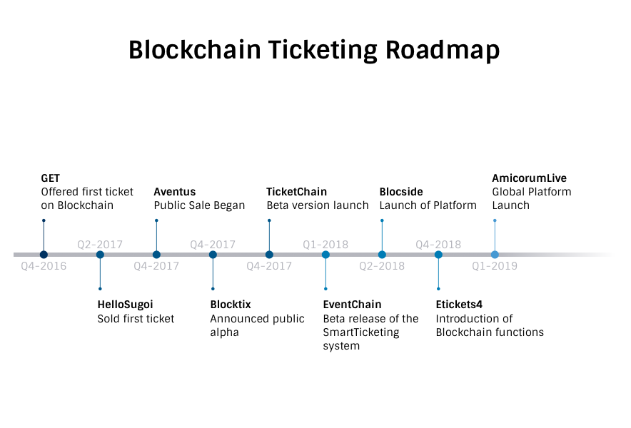

# Non-Fungible Tokens

---

# Definitions

## Fungible Tokens

*Fungibility is, essentially, a characteristic of an asset, or token, that determines whether items or quantities of the same or similar type can be completely interchangeable during exchange or utility. It has value and can be used to purchase items with the same or less value*

---

When a token is fungible it usually means two things:
1. Only the quantity matters
2. Any amount of it can be merged into a larger amount - making it indistinguishable from the rest

---

## Non- Fungible Tokens

*Non-fungible tokens (NFTs), are unique in nature and can be distinguished from each other. It is the characteristics of a non-fungible item itself that make it desirable and differentiated, rather than it being a placeholder or representation.*

---

## Function of NFTs

Non-fungible tokens create digital scarcity that can be verified without the need for a centralised organisation to confirm authenticity.

*Blockchain technology is significant because it enables a decentralised way to maintain distinct, digitally scarce items*

---
## Uses for NFTs

1. Collectibles
2. Gaming
3. Property
5. Ticketing

---

## Popular Implementation of Collectible NFTs

Example of NFT | Mode of Implementation
-------------- | ---------------
Rare Pepe | Counterparty
CryptoKitties |  ERC721
Decentraland | ERC721
CrytoPunks | ERC721 with partial ERC20 compatability
CryptoCelebrities | ERC721

---

## Rare Pepe
* Rare Pepe is based on an internet meme called Pepe The Frog that has been around since 2005 and became popular on 4chan
* Rare pepes are digital trading cards that are traded as counterparty (XCP) assets on the Bitcoin blockchain.
* The UX for the first-generation of digital collectibles was poor
* A bitcoin user that wants to buy a Rare Pepe must buy a new cryptocurrency on a different platform designed specifically for one type of non-fungible asset.

<https://thecontrol.co/digital-collectibles-a-new-category-of-tokens-emerging-fb991c1dff6a>

---

## CryptoKitties

* CryptoKitties is an Ethereum based digital collectible game based around cats that are breakable and tradable
* Each cat is unique and individually owned; it cannot be replicated, taken away or destroyed
* CryptoKitties, uses the lesser known ERC721 standard, for non-fungible tokens
* Under this standard, you ensure that each token has its unique attributes and values and that it cannot be substituted for another, making it perfect for solutions that depends on tracking individual units or entities of any kind

<https://venturebeat.com/2017/12/04/cryptokitties-shows-everything-can-and-will-be-tokenized/>

---

## Decentraland

* Land in Decentraland is permanently owned by the community, giving them full control over their creations- creating an immutable record of ownership
* Decentraland uses an Ethereum smart contract to maintain a ledger of ownership for land parcels in the virtual world
* Decentraland clients will connect to the Ethereum network to fetch updates to the state of the LAND smart contract
* LAND is bought by burning MANA (MANA can also be used to make in-world purchases of digital goods and services), a fungible ERC20 token of fixed supply (burn function-creates a new entry)

[WhitePaper](https://decentraland.org/whitepaper.pdf)

---

## CryptoPunks

* The CyptoPunks are 24x24 pixel art images, generated algorithmically
* There are 10 000 unique collectible charaters with proof of owership stored on the Ethereum blockchain
* Cryptopunks uses a similar system to ERC20 tokens-  the official website descibes them as "almost an ERC20 token"
* Cryptopunks are ERC721 tokens that have partial ERC20 compatability.

<https://github.com/ethereum/EIPs/blob/master/EIPS/eip-721.md#backwards-compatibility>
<https://www.larvalabs.com/cryptopunks>

---

## CryptoCelebrities

* CryptoCelebrities is the blockchain based game where you can buy, sell, or trade and breed your favourite celebrities that are made and generated over Ethereum blockchain
* It is a fully transparent game/system because of being on the Ethereum network.

<https://www.linkedin.com/pulse/ethereum-based-cryptoassetsnon-fungible-token-platform-rabadia>

---

## The Development of Non Fungibe Token Standards

* ERC20
* ERC721
* ERC875
* Neo
* EOS

---

## ERC

* ERC stands for Ethereum Request for Comment
* Authored by Ethereum community developers in the form of a memorandum (methods, behaviours, research, or innovations)
* It is submitted either for peer review or simply to convey new concepts or information
* After core developers and community approval, the proposal becomes a standard.

---
## ERC20

* It is a fungible token
* Allows for the implementation of a standard API for tokens within smart contracts
* Provides the basic functionality to transfer tokens
* Allowed tokens to be approved so they can be spent by another on chain third party

*ERC20 is insufficient for tracking NFTs because each asset is distinct (non-fungible), whereas each of a quantity of tokens is identical (fungible)*

http://www.nexthoughts.com/nonfungibletoken/

[GitHub](https://github.com/ethereum/EIPs/blob/master/EIPS/eip-20.md)

---

## ERC721

* Was built in order to create non-fungible assets on the blockchain
* This standard provides basic functionality to track and transfer NFTs
* It has allowed smart contracts to operate as tradable tokens , similar to ERC20

*ERC721 is expensive to transfer, as it has to be done one by one, and it lacks a cohesive strategy for efficiently trading each token (strain-->congestion)*

<https://hackernoon.com/an-overview-of-non-fungible-tokens-5f140c32a70a>

[GitHub](https://github.com/ethereum/EIPs/blob/master/EIPS/eip-721.md)

---

## ERC875

* It is a new draft standard which allows transferring non-fungible tokens in lots and contains methods to settle orders in a cheap yet equally safe and decentralised manner
* Tokens are stored in arrays and can be transferred in multiples by specfying each token index
* This results in savings and a lower transaction burden on the network as you can move many tokens in one transaction bundle on the network

<https://medium.com/bitfwd/erc875-a-new-standard-for-non-fungible-tokens-and-cheap-atomic-swaps-93ab85b9e7f9>

---

## Neo

* Trinity is aiming to develop an NFT standard for the NEO blockchain, NEP-10
* NEO Enhancement Proposal for an NFT standard has yet to be submitted for review, and other developers within the ecosystem are also believed to be working on a similar standard

<https://neonewstoday.com/development/trinity-developing-non-fungible-tokens-nft-standard/>

---

## EOS

* EOSIO has a proposed NFT standard for the EOSIO blockchain - eosio.nft

<https://github.com/unicoeos/eosio.nft>

---
## **Ticketing**

The main objective of using non-fungible tokens in the event ticketing industry is to decentralise the industry, allowing ticketing applications and promoters to automatically sell tickets for other events and gain commission for doing so. This enables event organisers to reach a wider audience.

---

* Thirty percent of all tickets are resold with mark-ups between 30% and 700%
* The event ticket market is known to be non-transparent, inexplicable transaction costs added to tickets are a common practice among ticketing services.
* The solution is a blockchain based event ticketing protocol used by ticketing and booking companies that will make secondary market ticket prices and ticket fraud occurrences redundant

---

# Aventus

* The Aventus Protocol is based on blockchain technology- used in cryptocurrencies such as bitcoin- which would allow event organisers to give ticket a unique identity that is tied to its owner
* Because the tickets are based on blockchain- a linked list of records where each new one contains an encrypted version of the previous one
* The core Aventus Protocol is a global, open-source blockchain ticketing smart contract backbone, built on the Ethereum network

---

* The software also allows event promoters to keep an easy record of who owns the ticket, which means they can control the prices
* Public sale began in the 4th quater of 2017
* For the 2018 FIFA Word Cup, Aventus will join forces with another company, Blocside, and expects to work with football clubs next year on season tickets.
* Aventus has announced Rob Edwards (previously of Select Tochnologies and Ticket.com) as their new COO

[WhitePaper](https://aventus.io/doc/whitepaper.pdf)

---

# Blocside

* BlocSide Sports is creating a digital platform that leverages frictionless payments, mobile ticketing, augmented reality, and Blockchain technology to improve fan engagement within professional football
* It will be powered by the Aventus Procotol
* BlocSide will issue MVP Token, which is an ERC-20 compliant token that operates on the Ethereum blockchain

---

* Blocside currently has partnerships with 25 football clubs worldwide- and is fuelled by a series of events during the 2018 FIFA World Cup across the US, UK and Europe (totalling over 10 000 tickets)
* Blocside launched in Q2 of 2018

[WhitePaper](https://blocside.io/assets/BlocSide_White_Paper.pdf)

---

# GET

* GET offered first tickets on the blockchain in Q4 2016 for an ASR Blockchain Meetup
* It is predicted that Q4 2018 the GET Protocol will be used to register value flows and ownership
of 50 000 tickets for more than 75 events
* GET introduces a smart-ticketing protocol built upon the Ethereum blockchain that will facilitate as a back-end backbone to the sale and trade of event tickets by issuing smart tickets to wallet addresses

---

* The owner of such a smart ticket is free to anonymously sell a ticket but can only do so within the decentralised and issuance price restricting infrastructure/rule-structure of the GET protocol
* This ensures that ticket trades are done safely and within a set price margin
* Over the counter trade or additional off-chain fee surcharges are not possible as trade is anonymous and the tickets QR code non-static

[WhitePaper](https://guts.tickets/files/GET-Whitepaper-GUTS-Tickets-latest.pdf)

---

# AmicorumLive

* Q1 2019 Global Platform Launch
* Amicorum is a crowdsourced blockchain-based marketplace and peer-peer ecosystem for ticket resale of music festivals and concerts
* The ERC20 compatible token will be the only utility tokens that will be used on the platform for sale and purchase of tickets in the secondary re-sale market

---

* The tokenisation model focuses on real time conversion of ticket price into AMI Tokens (value from exchange) and usage by both buyers and sellers
* The AMI token will be listed on exchanges and will be transferable to other cryptocurrencies and fiat currencies
* The AMI token will be the only means of transaction on the AmicorumLive platform

[WhitePaper](https://amicorum.live/english.pdf)

---

# Eticket4

* Eticket4 is an international secondary ticketing platform developed by Israeli entrepreneurs in 2015
* Being an intermediary between various entities involved in the ticket re-selling process, the platform serves as a guarantor of transaction security, tickets’ validity, timely payment and delivery
* Eticket4 ticketing platform exists and its functionality is already available to ticket brokers and ticker buyers

---

* In Q4 2018 Eticket4 plans to introduce the blockchain-based functionality and new loyalty reward system based on ET4 crypto tokens
* The token conforms to ERC20
* The token will be prepared in cooperation with Phenom (Crypto payment system) using a smart contract written on Solidity

[WhitePaper](https://et4.io/ET4_WP_ENG.pdf)

---

# Blocktix

* Blocktix announced a public available alpha in Q4 of 2017
* Blocktic will be built on Ethereum blockchain
* It will serve as the default payment gateway of the application- tickets have to be purchased with the ETH cryptocurrency

---

* Other payment gateways such as credit cards and bank transfers will be later integrated through third parties
* Advisors include, Randy Jackson and Everette Harp

[WhitePaper](https://blocktix.io/public/doc/blocktix-wp-draft.pdf)

---

# HelloSugoi

* Their protocol can be leveraged by existing event ticketing platforms, event organisers, promoters, and artists to provide greater transparency’s scrutiny, and efficiency in the event life-cycle
* They have began selling tickets to the State of Digital Money on the Ethereum Blockchain- Sold first ticket in Q2 2017 (Crypto COnference)

---

* Their primary business is selling event tickets. They implement blockchain to enable them to provide the best value for customers

<https://www.hellosugoi.com>

---

# Blockets

* They employ transaction caching since the Ethereum Blockchain is not realtime (it may take up to 10 minutes to have a transaction confirmed)- The caching system is to avoid accidental oversale
* As it is perceived, Blockchain can be difficult to deal with directly, so users are provided with a friendly wrapper around the technology- thus one can work with it, without any blockchain knowledge required.
* Blockets SplitPayments API- is an interface that a ticket-selling service can dispatch to, to handle the actual payments of the tickets

---

* When a payment has been completed, the monetary amounts of tickets, that were sold will be divided as indicated in the request over the different parties
* Paying these parties will happen as soon as either a set threshold is reached or multiple days of inactivity have passed.
This means that parties will have their money a lot earlier, instead of waiting for an event to occur

<https://blockets.nl>

---

# EsPass

* The first iteration will use the Ethereum Blockchain exclusively
* For connecting the passes with other contracts will follow the ERC20 standard

<https://espass.it>

---

# TicketChain

* Each ticket on TicketChain cannot be printed or copied as a screenshot because the QR code changes every few seconds
* Q4 2017 beta version launch

<http://www.launchbox.ie/stories/ticketchain>

---

# Eventchain

* Uses the Ethereum blockchain as a foundation
* Since ticketing platforms receive heavy traffic on the ticket release date- EVC will be distributed on an unlimited number of websites through a plugin
* Beta release of the SmartTicketing system is available- Q1 2018
* News, emotions, photos, event maps, storage of autographed tickets form part of the application’s offering

<https://eventchain.io>

---

# Upgraded Inc.
* It is Blockchain underpinning allows event owners to know exactly who has ownership over the life of the ticket, who ultimately was the fan who attended the events and provides valuable opportunities to reach the fan.
* Resides on the Ethereum Blockchain

<https://www.upgraded-inc.com>

---

# Crypto.Tickets

* Tickets Wallet is a revolutionary app for storing smart tickets and  experiences
* It is based on Ethereum blockchain technology
* The app generates a dynamically changing code, which is impossible to copy or pass on

---

* Each ticket has its own unique identifier, which is generated using a special encryption algorithm developed and thus is guarantees that the ticket cannot be counterfeited

<https://crypto.tickets/forticketbuyers>

---

---

## Value-Adds

* Anonymously sell a ticket
* Dynamic QR code
* Distributed on an unlimited number of websites through a plugin
* Employ transaction caching to avoid accidental oversale
* Friendly wrapper
* News, emotions, photos, event maps, storage of autographed tickets form part of the application’s offering

---

## Notable

* Decentralised governance - TIX and AVT have instilled the reliance on the constant involvement of their tokens holders in the maintaining of the protocol
* Transaction and processing costs? (The value of GET is guaranteed by covering for these transition and trading costs, with a minimum price of ETH 0.50 per smart ticket)
* Token Velocity - the incentive for holding the token

