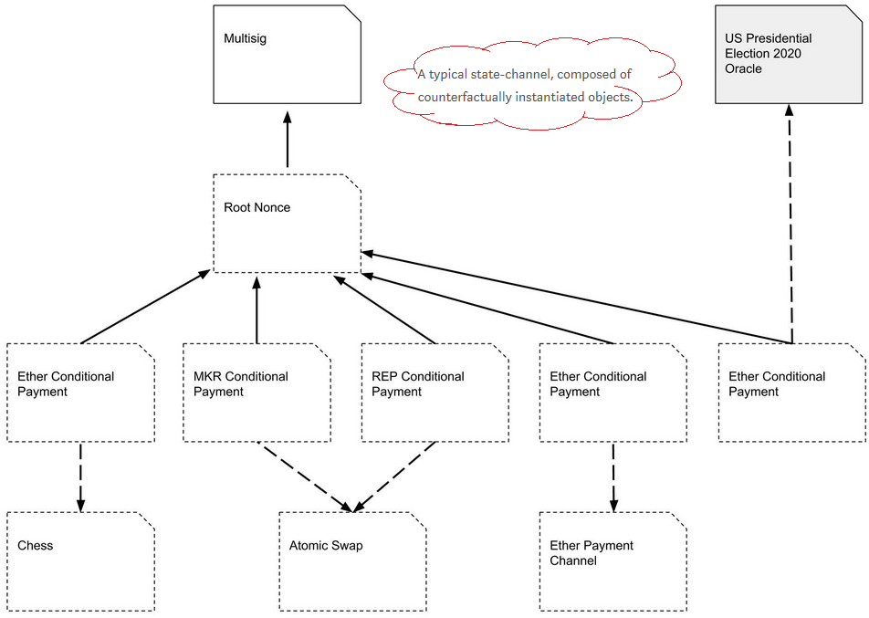
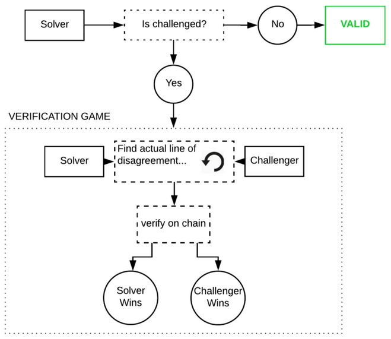

# Layer 2 Scaling Survey

- [What is Layer 2 Scaling?](#what-is-layer-2-scaling)

- [How will this be Applicable to Tari?](#how-will-this-be-applicable-to-tari)

- [Layer 2 Scaling Current Initiatives](#layer-2-scaling-current-initiatives)
  - [Micropayment Channels](#micropayment-channels)
    - [What are they?](#what-are-they)
    - [Who uses them?](#who-uses-them)
    - [Strengths](#strengths)
    - [Weaknesses](#weaknesses)
    - [Opportunities](#opportunities)
  - [State Channels](#state-channels)
    - [What are they?](#what-are-they-1)
    - [Who uses them?](#who-uses-them-1)
    - [Strengths](#strengths-1)
    - [Weaknesses](#weaknesses-1)
    - [Opportunities](#opportunities-1)
  - [Off-chain Matching Engines](#off-chain-matching-engines)
    - [What are they?](#what-are-they-2)
    - [Who uses them?](#who-uses-them-2)
    - [Strengths](#strengths-2)
    - [Weaknesses](#weaknesses-2)
    - [Opportunities](#opportunities-2)
  - [Masternodes](#masternodes)
    - [What are they?](#what-are-they-3)
    - [Who uses them?](#who-uses-them-3)
    - [Strengths](#strengths-3)
    - [Weaknesses](#weaknesses-3)
    - [Opportunities](#opportunities-3)
  - [Plasma](#plasma)
    - [What is it?](#what-is-it)
    - [Who uses it?](#who-uses-it)
    - [Strengths](#strengths-4)
    - [Weaknesses](#weaknesses-4)
    - [Opportunities](#opportunities-4)
  - [TrueBit](#truebit)
    - [What is it?](#what-is-it-1)
    - [Who uses it?](#who-uses-it-1)
    - [Strengths](#strengths-5)
    - [Weaknesses](#weaknesses-5)
    - [Opportunities](#opportunities-5)
- [Observations](#observations)
- [References](#references)
- [Contributors](#contributors)

## What is Layer 2 Scaling?

In the blockchain and cryptocurrency world, transaction processing scaling is a tough problem to solve. This is limited 
by the average block creation time, the block size limit, and the number of newer blocks needed to confirm a transaction 
(confirmation time). These factors make '*over the counter*' type transactions similar to Master Card or Visa nearly 
impossible if done on the main blockchain (on-chain).

Let's postulate that blockchain and cryptocurrency "take over the world" and are responsible for all global non-cash 
transactions performed, i.e. 433.1 billion in 2014 to 2015 [[24]]. This means 13,734 transactions per second (tx/s) on 
average! *(To put this into perspective, VisaNet currently processes 160 billion transactions per year [[25]] and is 
capable of handling more than 65,000 transaction messages per second [[26]].)* This means that if all of those were 
simple single-input-single-output non-cash transactions and performed on:

- SegWit-enabled Bitcoin 'like' blockchains that can theoretically handle ~21.31tx/s, we would need ~644 parallel 
versions, and with a SegWit transaction size of 190 bytes [[27]], the combined blockchain growth would be *~210GB per 
day*! 

- Ethereum 'like' blockchains, and taking current gas prices into account, Ethereum can theoretically process ~25.4tx/s, 
then ~541 parallel versions would be needed and, with a transaction size of 109 bytes ([[28]], [[29]]), the combined 
blockchain growth would be *~120GB per day*!

This is why we need a proper scaling solution that would not bloat the blockchain.

The Open Systems Interconnection (OSI) model defines seven layers for communication functions of a computing system. 
Layer 1 refers to the physical layer and Layer 2 to the data link layer. Layer 1 is never concerned with functions of 
Layer 2 and up; it just delivers transmission and reception of raw data. In turn, Layer 2 only knows about Layer 1 and 
defines the protocols that deliver node-to-node data transfer. [[1]]

Analogous to the OSI layers for communication, in blockchain technology, decentralized Layer 2 protocols, also commonly 
referred to as Layer 2 scaling, refers to transaction throughput scaling solutions. Decentralized Layer 2 protocols run 
on top of the main blockchain (off-chain), while preserving the attributes of the main blockchain (e.g. crypto economic 
consensus). Instead of each transaction, only the result of a number of transactions is embedded on-chain. [[2]]

Also:

- Does every transaction need every parent blockchain node in the world to verify it?
- Would I be willing to have (temporary) lower security guarantees for most of my day-to-day transactions if I could get 
them validated (whatever we take that to mean) near-instantly?

If you can answer 'no' and 'yes', then you're looking for a Layer 2 scaling solution.

## How will this be Applicable to Tari?

Tari is a high-throughput protocol that will need to handle real-world transaction volumes. For example, Big Neon, the 
initial business application to be built on top of the Tari blockchain, requires high-volume transactions in a short 
time, especially when tickets sales open and when tickets will be redeemed at an event. Imagine filling an 85,000 seat 
stadium with 72 entrance queues on match days. Serialized real-world scanning boils down to ~500 tickets in four minutes, 
or ~2 spectators allowed access per second per queue.

This would be impossible to do with parent blockchain scaling solutions.

## Layer 2 Scaling Current Initiatives
### Micropayment Channels 
#### What are they?

A micropayment channel is a class of techniques designed to allow users to make multiple Bitcoin transactions without 
committing all of the transactions to the Bitcoin blockchain. In a typical payment channel, only two transactions are 
added to the blockchain, but an unlimited or nearly unlimited number of payments can be made between the participants. [[10]]

Several channel designs have been proposed or implemented over the years, including:
- Nakamoto high-frequency transactions; 
- Spillman-style payment channels; 
- CLTV-style payment channels;
- Poon-Dryja payment channels; 
- Decker-Wattenhofer duplex payment channels; 
- Decker-Russell-Osuntokun eltoo channels; 
- Hashed Time-Locked Contracts (HTLCs).

With specific focus on Hashed Time-Locked Contracts:
This technique can allow payments to be securely routed across multiple payment channels. HTLCs are integral to the 
design of more advanced payment channels such as those used by the [Lightning Network](https://gitpitch.com/tari-labs/tari-university/master?p=src/protocols/lightning-network-for-dummies#/). 

The Lightning Network is a second-layer payment protocol that operates on top of a blockchain. It enables instant 
transactions between participating nodes. The Lightning Network features a peer-to-peer system for making micropayments 
of digital cryptocurrency through a network of bidirectional payment channels without delegating custody of funds and 
minimizing the trust of third parties. [[11]] 

Normal use of the Lightning Network consists of opening a payment channel by committing a funding transaction to the 
relevant blockchain. This is followed by making any number of Lightning transactions that update the tentative 
distribution of the channel's funds without broadcasting to the blockchain; and optionally followed by closing the 
payment channel by broadcasting the final version of the transaction to distribute the channel's funds. 

#### Who uses them?
The Lightning Network is spreading across the cryptocurrency landscape. It was originally designed for Bitcoin. However, 
Litecoin, Zcash, Ethereum, and Ripple are just a few of the many cryptocurrencies planning to implement or test some 
form of the network. [[12]]

#### Strengths

- Micropayment channels are one of the leading solutions that has been presented to scale Bitcoin, which does not require 
a change to the underlying protocol.
- Transactions are processed instantly, the account balances of the nodes are updated, and the money is immediately 
accessible to the new owner.
- Transaction fees are a fraction of the transaction cost. [[13]] 

#### Weaknesses

- Micropayment channels are not suitable for making bulk payment, as the intermediate nodes in the multichannel payment 
network may not be loaded with money to move the funds along. 
- Recipients cannot receive money unless their node is connected and online at the time of the transaction.
-At the time of writing (July 2018), channels were only bilateral. 

#### Opportunities

Opportunities are fewer than expected, as Tari's ticketing use case requires many fast transactions with many parties, 
and not many fast transactions with a single party. Non-fungible assets must be "broadcasted", but state channels are 
private between two parties.

### State Channels

#### What are they?

State channels are the more general form of micropayment channels. They can be used not only for payments, but for any 
arbitrary "state update" on a blockchain, such as changes inside a smart contract. [[16]]

State channels allow multiple transactions to be made within off-chain agreements with very fast processing, and the 
final settlement on-chain. They keep the operation mode of blockchain protocol, but change the way it is used so as to deal with the challenge of scalability.

Any change of state within a state channel requires explicit cryptographic consent from all parties designated as 
"interested" in that part of the state. [[19]

#### Who uses them?

*On Ethereum:*

- Raiden Network ([[16]], [[21]])
  - Uses state channels to research state channel technology, define protocols and develop reference implementations.

  - State channels work with any ERC20-compatible token.

  - State updates between two parties are done via digitally signed and hash-locked transfers as the consensus 
  mechanism, called balance proofs, which are also secured by a time-out. These can be settled on the Ethereum 
  blockchain at any time. Raiden Network uses HTLCs in exactly the same manner as the Lightning Network. 

  - 

- Counterfactual ([[16]], [[19]], [[31]])
  - Uses state channels as a generalized framework for the integration of native state channels into Ethereum-based 
  decentralized applications.
  - A generalized state channel generalized framework is one where state is deposited once, and is then used afterwards 
  by any application or set of applications.
  - Counterfactual instantiation means to instantiate a contract without actually deploying it on-chain. It is achieved 
  by making users sign and share commitments to the multisig wallet.
  - When a contract is counterfactually instantiated, all parties in the channel act as though it has been deployed, 
  even though it has not.
  - A global registry is introduced. This is an on-chain contract that maps unique deterministic addresses for any 
  Counterfactual contract to actual on-chain deployed addresses. The hashing function used to produce the deterministic 
  address can be any function that takes into account the bytecode, its owner (i.e. the multisig wallet address), and a 
  unique identifier.
  - A typical Counterfactual state channel is composed of counterfactually instantiated objects.

- Funfair ([[16]], [[23]], [[32]])
  - Uses state channels as a decentralized slot machine gambling platform, but still using centralized server-based 
  random number generation.
  - Instantiates a normal "Raiden-like" state channel (called *fate channel*) between the player and the casino. Final 
  states are submitted to blockchain after the betting game is concluded.
  - Investigating the use of threshold cryptography such as Boneh-Lynn-Shacham (BLS) signature schemes to enable truly 
  secure random number generation by a group of participants.

*On NEO:*

- Trinity ([[3]], [[17]], [[18]])
  - Trinity is an open-source network protocol based on NEP-5 smart contracts.
  - Trinity for NEO is the same as the Raiden Network for Ethereum.
  - Trinity uses the same consensus mechanism as the Raiden network.
  - A new token, TNC, has been introduced to fund the Trinity network, but NEO, NEP-5 and TNC tokens are supported.

#### Strengths

- Allows payments and changes to smart contracts.
- State channels have strong privacy properties. Everything is happening "inside" a channel between participants.
- State channels have instant finality. As soon as both parties sign a state update, it can be considered final.

#### Weaknesses

- State channels rely on availability; both parties must be online.

#### Opportunities

Opportunities are fewer than expected, as Tari's ticketing use case requires many fast transactions with many parties, 
and not many fast transactions with a single party. Non-fungible assets must be "broadcasted", but state channels are 
private between two parties.

### Off-chain Matching Engines

#### What are they?

Orders are matched off-chain in a matching engine and fulfilled on-chain. This allows complex orders, supports 
cross-chain transfers, and maintains a public record of orders as well as a deterministic specification of behavior. 
Off-chain matching engines make use of a token representation smart contract that converts global assets into smart 
contract tokens and vice versa. [[5]]

#### Who uses them?

- Neon Exchange (NEX) ( [[5]], [[35]])
  - NEX uses a NEO decentralized application (dApp) with tokens.
  - Initial support is planned for NEO, ETH, NEP5, and ERC20 tokens.
  - Cross-chain support is planned for trading BTC, LTC, and RPX on NEX.
  - The NEX off-chain matching engine will be scalable, distributed, fault-tolerant, and function continuously without 
  downtime.
  - Consensus is achieved using cryptographically signed requests; publicly specified deterministic off-chain matching 
  engine algorithms; and public ledgers of transactions and reward for foul play. The trade method of the exchange smart 
  contract will only accept orders signed by a private key held by the matching engine.
  - The matching engine matches the orders and submits them to the respective blockchain smart contract for execution.
  - A single invocation transaction on NEO can contain many smart contract calls. Batch commit of matched orders in one 
  on-chain transaction is possible.

  

  

- 0x ([[33]], [[34]])
  - An Ethereum ERC20-based smart contract token (ZRX).
  - Provides an open-source protocol to exchange ERC20-compliant tokens on the Ethereum blockchain using off-chain 
  matching engines in the form of dApps (*Relayers*) that facilitate transactions between *Makers* and *Takers*.
  - Off-chain order relay + on-chain settlement.
  - *Maker* chooses *Relayer*, specifies token exchange rate, expiration time, fees to satisfy *Relayer's* fee schedule, 
  and signs order with private key.
  - Consensus is governed with the publicly available DEX smart contract: addresses, token balances, token exchange, 
  fees, signatures, order status, and final transfer.

  

  

#### Strengths

- Performance {*NEX*, *0x*}:
  - off-chain request/order;
  - off-chain matching.
- NEX-specific:
  - batched on-chain commits;
  - cross-chain transfers;
  - support of national currencies;
  - public JavaScript Object Notation (JSON) Application Programmers Interface (API) and web extension API for 
  third-party applications to trade tokens;
  - development environment - ***Elixir on top of Erlang*** to enable scalable, distributed, and fault-tolerant matching 
  engine;
  - Cure53 full security audit on web extension, NEX tokens will be regulated as registered European securities.
- 0x-specific:
  - open-source protocol to enable creation of independent off-chain dApp matching engines (*Relayers*);
  - totally transparent matching of orders with no single point of control;
    - maker's order only enters a Relayer's order book if fee schedule is adhered to,
    - exchange can only happen if a Taker is willing to accept.
  - consensus and settlement governed by the publicly available DEX smart contract.

#### Weaknesses

- At the time of writing (July 2018), both NEX and 0x were still in development.
- NEX-specific:
  - a certain level of trust is required, similar to a traditional exchange;
  - closed liquidity pool.
- 0x-specific:
  - a trusted Token Registry will be required to verify ERC20 token addresses and exchange rates;
  - front-running transactions and transaction collisions possible, more development needed; ([[36]], [[37]])
  - batch processing ability unknown.

#### Opportunities

- Matching engines in general have opportunities for Tari; the specific scheme is to be investigated further.

### Masternodes
#### What are they?

A masternode is a server on a decentralized network. It is utilized to complete unique functions in ways ordinary mining 
nodes cannot, e.g. features such as direct send, instant transactions and private transactions. Because of their 
increased capabilities, masternodes typically require an investment in order to run. Masternode operators are 
incentivized and are rewarded by earning portions of block rewards in the cryptocurrency they are facilitating. 
Masternodes will get the standard return on their stakes, but will also be entitled to a portion of the transaction fees, 
allowing for a greater return on investment (ROI). ([[7]], [[9]])

*Dash Example* [[30]]

Dash was the first cryptocurrency to implement the masternode model into its protocol. Under what Dash calls its proof 
of service algorithm, a second-tier network of masternodes exists alongside a first-tier network of miners to achieve 
distributed consensus on the blockchain. This two-tiered system ensures that proof of service and proof of work perform symbiotic maintenance of Dash's network. Dash masternodes also enable a decentralized governance system that allows node operators to vote on important developments within the blockchain. A masternode for Dash requires a stake of 1,000&nbsp;DASH. Dash and the miners each have 45% of the block rewards. The other 10% goes to the blockchain's treasury fund. Operators are in charge of voting on proposals for how these funds will be allocated to improve the network.

*Dash Deterministic Ordering*

A special deterministic algorithm is used to create a pseudo-random ordering of the masternodes. By using the hash from 
the proof-of-work for each block, security of this functionality is provided by the mining network. 

*Dash Trustless Quorums*

The Dash masternode network is trustless where no single entity can control the outcome. N pseudo random masternodes 
(Quorum A) are selected from the total pool to act as an oracle for N pseudo random masternodes (Quorum B) that are 
selected to perform the actual task. Quorum A are the closest nodes mathematically to the current block hash, while 
Quorum B are the furthest. This process is repeated for each new block in the blockchain.

*Dash Proof of Service*

Bad actors could also run masternodes. To reduce the possibility of bad acting, nodes must ping the rest of the network 
to ensure they remain active. All masternode verification is done randomly via the Quorum system by the masternode 
network itself. Approximately 1% of the network is verified each block. This results in the entire masternode network 
being verified approximately six times per day. Six consecutive violations result in the deactivation of a masternode.

#### Who uses them?

- Block, Bata, Crown, Chaincoin, Dash, Diamond, ION, Monetary Unit, Neutron, PIVX, Vcash, and XtraBytes. [[8]]

#### Strengths

- Masternodes help to sustain and take care of the ecosystem and can protect blockchains from network attacks.
- Masternodes can perform decentralized governance of miners by having the power to reject or orphan blocks if 
required. ([[22]], [[30]])
- Masternodes can support decentralized exchanges by overseeing transactions and offering fiat currency gateways.
- Masternodes can be used to facilitate smart contracts such as instant transactions, anonymous transactions, and 
decentralized payment processor.
- Masternodes can facilitate a decentralized marketplace such as the blockchain equivalent of peer-run commerce sites 
such as eBay. [[22]]   

- Masternodes compensate for Proof of Work's limitations; they avoid mining centralization and consume less energy. [[22]]
- Masternodes promise enhanced stability and network loyalty, as larger dividends and high initial investment costs 
make it less likely that operators will abandon their position in the network. [[22]]

#### Weaknesses

- Maintaining masternodes can be a long and arduous process.
- ROI is not guaranteed and is inconsistent. In some applications, Masternodes only get rewarded if they mine a block 
and if they are randomly chosen to get paid.
- In general, a masternode's IP address is publicized and thus open to attacks.

#### Opportunities

- Masternodes do not have a specific standard or protocol; many different implementations exist. If the Tari protocol 
employs Masternodes, they can be used to facilitate smart contracts off-chain and to enhance the security of the primary 
blockchain.

- Masternodes increase the incentives for people to be involved with Tari.

### Plasma
#### What is it?

Plasma blockchains are a chain within a blockchain, with state transitions enforced by bonded (time to exit) fraud 
proofs (block header hashes) submitted on the root chain. It enables management of a tiered blockchain without a full 
persistent record of the ledger on the root blockchain, and without giving custodial trust to any third party. The fraud 
proofs enforce an interactive protocol of rapid fund withdrawals in case of foul play such as block withholding, and in 
cases where bad actors in a lower-level tier want to commit blocks to the root chain without broadcasting this to the 
higher-level tiers. [[4]]

Plasma is a framework for incentivized and enforced execution of smart contracts, scalable to a significant amount of 
state updates per second, enabling the root blockchain to be able to represent a significant amount of dApps, each 
employing its own blockchain in a tree format. [[4]]

Plasma relies on two key parts, namely reframing all blockchain computations into a set of MapReduce functions, and an 
optional method to do Proof of Stake (PoS) token bonding on top of existing blockchains (enforced in an on-chain smart 
contract). Nakamoto Consensus incentives discourage block withholding or other Byzantine behavior. If a chain is 
Byzantine, it has the option of going to any of its parents (including the root blockchain) to continue operation or 
exit with the current committed state. [[4]]

MapReduce is a programming model and an associated implementation for processing and generating large data sets. Users 
specify a map function that processes a key/value pair to generate a set of intermediate key/value pairs, and a reduce 
function that merges all intermediate values associated with the same intermediate key [[38]]. The Plasma MapReduce 
includes commitments on data to computation as input in the map phase, and includes a merkleized proof-of-state 
transition in the reduce step when returning the result. [[4]]

#### Who uses it?

- Loom Network, using Delegated Proof of Stake (DPoS) consensus and validation, enabling scalable Application Specific 
Side Chains (DAppChains), running on top of Ethereum. ([[4]], [[15]])

- OMG Network (OmiseGO), using PoS consensus and validation, a Plasma blockchain scaling solution for finance running on 
top of Ethereum. ([[6]], [[14]])

#### Strengths

- Not all participants need to be online to update state.
- Participants do not need a record of entry on the parent blockchain to enable their participation in a Plasma 
blockchain.
- Minimal data is needed on the parent blockchain to confirm transactions when constructing Plasma blockchains in a tree 
format.
- Private blockchain networks can be constructed, enforced by the root blockchain. Transactions may occur on a local 
private blockchain and have financial activity bonded by a public parent blockchain.
- Rapid exit strategies in case of foul play.

#### Weaknesses

At the time of writing (July 2018), Plasma still needed to be proven on other networks apart from Ethereum.

#### Opportunities

- Has opportunities for Tari as an L2 scaling solution.

- *Possibility to create a Tari ticketing Plasma dAppChain running of Monero without creating a Tari-specific root 
blockchain?* 

  **Note:** This will make the Tari blockchain dependent on another blockchain.

- The Loom Network's Software Development Kit (SDK) makes it extremely easy for anyone to create a new Plasma blockchain. 
In less than a year, a number of successful and diverse dAppChains have launched. *The next one could easily be for ticket sales...*

### TrueBit

#### What is it?

TrueBit is a protocol that provides security and scalability by enabling trustless smart contracts to perform and 
offload complex computations. This makes it different from state channels and Plasma, which are more useful for 
increasing the total transaction throughput of the Ethereum blockchain. TrueBit relies on solvers (akin to miners), who 
have to stake their deposits in a smart contract, solve computation and, if correct, get their deposit back. If the 
computation is incorrect, the solver loses their deposit. TrueBit uses an economic mechanism called the "verification 
game," where an incentive is created for other parties, called *challengers,* to check the solvers' work. ([[16]], 
[[40]], [[43]])

#### Who uses it?

Golem cites TrueBit as a verification mechanism for its forthcoming outsourced computation network LivePeer, a video 
streaming platform. ([[39]], [[41]], [[42]])

#### Strengths

- Outsourced computation - anyone in the world can post a computational task, and anyone else can receive a reward for 
completing it. [[40]]
- Scalable - by decoupling verification for miners into a separate protocol, TrueBit can achieve high transaction 
throughput without facing a Verifier's Dilemma. [[40]]

#### Weaknesses

At the time of writing (July 2018), TrueBit had not yet been fully tested. 

#### Opportunities

Nothing at the moment as, Tari wouldn't be doing heavy/complex computation, at least not in the short term.

## Observations

- Further investigation into the more promising layer 2 scaling solutions and technologies is required to verify 
alignment, applicability, and usability.
- An overview of Counterparty, Rootstock, Drivechains, and Scriptless scripts must still be added.

## References

[[1]] "OSI Mode" [online]. Available: https://en.wikipedia.org/wiki/OSI_model. Date accessed: 2018-06-07.

[1]: https://en.wikipedia.org/wiki/OSI_model
"OSI Mode"

[[2]] "Decentralized Digital Identities and Block Chain - The Future as We See It" [online]. Available: https://www.microsoft.com/en-us/microsoft-365/blog/2018/02/12/decentralized-digital-identities-and-blockchain-the-future-as-we-see-it/. 
Date accessed: 2018-06-07.

[2]: https://www.microsoft.com/en-us/microsoft-365/blog/2018/02/12/decentralized-digital-identities-and-blockchain-the-future-as-we-see-it/
"Decentralized Digital Identities and Block Chain - The Future as We See It"

[[3]] "Trinity Protocol: The Scaling Solution of the Future?" [Online.] Available: https://www.investinblockchain.com/trinity-protocol. 
Date accessed: 2018-06-08.

[3]: https://www.investinblockchain.com/trinity-protocol
"Trinity Protocol: The Scaling Solution of the Future?"

[[4]] J. Poon and V. Buterin, "Plasma: Scalable Autonomous Smart Contracts" [online]. Available: http://plasma.io/plasma.pdf. 
Date accessed: 2018-06-14.

[4]: http://plasma.io/plasma.pdf
"Plasma: Scalable Autonomous Smart Contracts"

[[5]] "NEX: A High Performance Decentralized Trade and Payment Platform" [online]. Available: https://nash.io/pdfs/whitepaper_v2.pdf. 
Date accessed: 2018-06-11.

[5]: https://nash.io/pdfs/whitepaper_v2.pdf
"NEX: A High Performance Decentralized Trade and Payment Platform"

[[6]] J. Poon and OmiseGO Team, "OmiseGO: Decentralized Exchange and Payments Platform" [online]. 
Available: https://cdn.omise.co/omg/whitepaper.pdf. Date accessed: 2018-06-14.

[6]: https://cdn.omise.co/omg/whitepaper.pdf
"OmiseGO: Decentralized Exchange and Payments Platform"

[[7]] "The Rise of Masternodes Might Soon be Followed by the Creation of Servicenodes" [online]. Available: https://cointelegraph.com/news/the-rise-of-masternodes-might-soon-be-followed-by-the-creation-of-servicenodes. Date 
accessed: 2018-06-13.

[7]: https://cointelegraph.com/news/the-rise-of-masternodes-might-soon-be-followed-by-the-creation-of-servicenodes
"The Rise of Masternodes Might Soon be Followed by the Creation of Servicenodes"

[[8]] "What are Masternodes?- Beginner's Guide" [online]. Available: https://blockonomi.com/masternode-guide/. Date 
accessed: 2018-06-14.

[8]: https://blockonomi.com/masternode-guide/
"What are Masternodes?- Beginner's Guide"

[[9]] "What the Heck is a DASH Masternode and How Do I get One" [online]. Available: https://medium.com/dash-for-newbies/what-the-heck-is-a-dash-masternode-and-how-do-i-get-one-56e24121417e. Date 
accessed: 2018-06-14.

[9]: https://medium.com/dash-for-newbies/what-the-heck-is-a-dash-masternode-and-how-do-i-get-one-56e24121417e
"What the Heck is a DASH Masternode and How Do I get One"

[[10]] "Payment Channels" (online). Available: https://en.bitcoin.it/wiki/Payment_channels. Date accessed: 2018-06-14.

[10]: https://en.bitcoin.it/wiki/Payment_channels
"Payment Channels"

[[11]] "Lightning Network" (online). Available: https://en.wikipedia.org/wiki/Lightning_Network. Date accessed: 2018-06-14.

[11]: https://en.wikipedia.org/wiki/Lightning_Network
"Lightning Network" 

[[12]] "Bitcoin Isn't the Only Crypto Adding Lightning Tech Now" [online]. 
Available: https://www.coindesk.com/bitcoin-isnt-crypto-adding-lightning-tech-now/. Date accessed: 2018-06-14.

[12]: https://www.coindesk.com/bitcoin-isnt-crypto-adding-lightning-tech-now/
"Bitcoin Isn't the Only Crypto Adding Lightning Tech Now" 

[[13]] "What is Bitcoin Lightning Network? And How Does it Work?" [Online.] 
Available: https://cryptoverze.com/what-is-bitcoin-lightning-network/. Date accessed: 2018-06-14.

[13]: https://cryptoverze.com/what-is-bitcoin-lightning-network/
"What is Bitcoin Lightning Network? And How Does it Work?" 

[[14]] "OmiseGO" [online]. Available: https://omisego.network/. Date accessed: 2018-06-14.

[14]: https://omisego.network/
"OmiseGO"

[[15]] "Everything You Need to Know About Loom Network, All In One Place (Updated Regularly)" [online]. Available: https://medium.com/loom-network/everything-you-need-to-know-about-loom-network-all-in-one-place-updated-regularly-64742bd839fe. 
Date accessed: 2018-06-14.

[15]: https://medium.com/loom-network/everything-you-need-to-know-about-loom-network-all-in-one-place-updated-regularly-64742bd839fe
"Everything You Need to Know About Loom Network, All In One Place (Updated Regularly)"

[[16]] "Making Sense of Ethereum's Layer 2 Scaling Solutions: State Channels, Plasma, and Truebit" [online]. Available: https://medium.com/l4-media/making-sense-of-ethereums-layer-2-scaling-solutions-state-channels-plasma-and-truebit-22cb40dcc2f4. 
Date accessed: 2018-06-14.

[16]: https://medium.com/l4-media/making-sense-of-ethereums-layer-2-scaling-solutions-state-channels-plasma-and-truebit-22cb40dcc2f4
"Making Sense of Ethereum's Layer 2 Scaling Solutions: State Channels, Plasma, and Truebit"

[[17]] "Trinity: Universal Off-chain Scaling Solution" [online]. Available: https://trinity.tech. Date accessed: 
2018-06-14.

[17]: https://trinity.tech
"Trinity: Universal Off-chain Scaling Solution"

[[18]] "Trinity White Paper: Universal Off-chain Scaling Solution" [online]. Available: https://trinity.tech/#/writepaper. 
Date accessed: 2018-06-14.

[18]: https://trinity.tech/#/writepaper
"Trinity White Paper: Universal Off-chain Scaling Solution"

[[19]] Jeff Coleman, Liam Horne, and Li Xuanji, "Counterfactual: Generalized State Channels" [online]. 
Available at: https://counterfactual.com/statechannels & https://l4.ventures/papers/statechannels.pdf. Date accessed: 2018-06-15.

[19]: https://counterfactual.com/statechannels
"Counterfactual: Generalized State Channels"

[[20]] "The Raiden Network" [online]. Available at:, https://raiden.network/. Date accessed: 2018-06-15.

[20]: https://raiden.network/
"The Raiden Network"

[[21]] "What is the Raiden Network?" [Online.] Available: https://raiden.network/101.html. Date accessed: 2018-06-15.

[21]: https://raiden.network/101.html
"What is the Raiden Network?"

[[22]] "What are Masternodes? An Introduction and Guide" [online]. Available: https://coincentral.com/what-are-masternodes-an-introduction-and-guide/. 
Date accessed: 2018-06-15.

[22]: https://coincentral.com/what-are-masternodes-an-introduction-and-guide/
"What are Masternodes? An Introduction and Guide" 

[[23]] "State Channels in Disguise?" [Online.] Available: https://funfair.io/state-channels-in-disguise. Date 
accessed: 2018-06-15.

[23]: https://funfair.io/state-channels-in-disguise
"State Channels in Disguise?"

[[24]] "World Payments Report 2017, © 2017 Capgemini and BNP Paribas" [online]. Available: https://www.worldpaymentsreport.com. 
Date accessed+: 2018-06-20.

[24]: https://worldpaymentsreport.com/
"World Payments Report 2017, © 2017 Capgemini and BNP Paribas" 

[[25]] "VISA" [online]. Available: https://usa.visa.com/visa-everywhere/innovation/contactless-payments-around-the-globe.html. 
Date accessed: 2018-06-20.

[25]: https://usa.visa.com/visa-everywhere/innovation/contactless-payments-around-the-globe.html
"VISA"

[[26]] "VisaNet Fact Sheet 2017 Q4" [online]. Available: https://usa.visa.com/dam/VCOM/download/corporate/media/visanet-technology/visa-net-fact-sheet.pdf. 
Date accessed: 2018-06-20.

[26]: https://usa.visa.com/dam/VCOM/download/corporate/media/visanet-technology/visa-net-fact-sheet.pdf
"VisaNet Fact Sheet 2017 Q4"

[[27]] "With 100% segwit transactions, what would be the max number of transaction confirmation possible on a block?" [Online.] 
Available: https://bitcoin.stackexchange.com/questions/59408/with-100-segwit-transactions-what-would-be-the-max-number-of-transaction-confi. 
Date accessed: 2018-06-21.

[27]: https://bitcoin.stackexchange.com/questions/59408/with-100-segwit-transactions-what-would-be-the-max-number-of-transaction-confi
"With 100% segwit transactions, what would be the max number of transaction confirmation possible on a block?"

[[28]]: "A Gentle Introduction to Ethereum" [online]. Available: https://bitsonblocks.net/2016/10/02/a-gentle-introduction-to-ethereum/. 
Date accessed: 2018-06-21.

[28]: https://bitsonblocks.net/2016/10/02/a-gentle-introduction-to-ethereum/
"A Gentle Introduction to Ethereum"

[[29]] "What is the size (bytes) of a simple Ethereum transaction versus a Bitcoin transaction?" [Online.] Available: https://ethereum.stackexchange.com/questions/30175/what-is-the-size-bytes-of-a-simple-ethereum-transaction-versus-a-bitcoin-trans?rq=1. 
Date accessed: 2018-06-21.

[29]: https://ethereum.stackexchange.com/questions/30175/what-is-the-size-bytes-of-a-simple-ethereum-transaction-versus-a-bitcoin-trans?rq=1
"What is the size (bytes) of a simple Ethereum transaction versus a Bitcoin transaction?"

[[30]] "What is a Masternode?" [Online.] Available at: http://dashmasternode.org/what-is-a-masternode. Date accessed: 2018-06-14.

[30]: http://dashmasternode.org/what-is-a-masternode
"What is a Masternode?"

[[31]] "Counterfactual: Generalized State Channels on Ethereum" [online]. Available: 
https://medium.com/statechannels/counterfactual-generalized-state-channels-on-ethereum-d38a36d25fc6. Date accessed: 2018-06-26.

[31]: https://medium.com/statechannels/counterfactual-generalized-state-channels-on-ethereum-d38a36d25fc6
"Counterfactual: Generalized State Channels on Ethereum"

[[32]] Jeremy Longley and Oliver Hopton, "FunFair Technology Roadmap and Discussion" [online]. 
Available: https://funfair.io/wp-content/uploads/FunFair-Technical-White-Paper.pdf. Date accessed: 2018-06-27.

[32]: https://funfair.io/wp-content/uploads/FunFair-Technical-White-Paper.pdf
"FunFair Technology Roadmap and Discussion"

[[33]] "0x Protocol Website" [online]. Available: https://0xproject.com/. Date accessed: 2018-06-28.

[33]: https://0xproject.com/
"0x Protocol Website"

[[34]] "0x: An open protocol for decentralized exchange on the Ethereum blockchain" [online]. 
Available: https://0xproject.com/pdfs/0x_white_paper.pdf. Date accessed: 2018-06-28.

[34]: https://0xproject.com/pdfs/0x_white_paper.pdf
"0x: An open protocol for decentralized exchange on the Ethereum blockchain"

[[35]] "NEX/Nash website" [online]. Available: https://nash.io. Date accessed: 2018-06-28.

[35]: https://nash.io
"NEX/Nash website"

[[36]] "Front-running, Griefing and the Perils of Virtual Settlement (Part 1)" [online]. Available: https://blog.0xproject.com/front-running-griefing-and-the-perils-of-virtual-settlement-part-1-8554ab283e97. Date 
accessed: 2018-06-29.

[36]: https://blog.0xproject.com/front-running-griefing-and-the-perils-of-virtual-settlement-part-1-8554ab283e97
"Front-running, Griefing and the Perils of Virtual Settlement (Part&nbsp;1)"

[[37]] "Front-running, Griefing and the Perils of Virtual Settlement (Part 2)" [online]. Available: https://blog.0xproject.com/front-running-griefing-and-the-perils-of-virtual-settlement-part-2-921b00109e21. Date 
accessed: 2018-06-29.

[37]: https://blog.0xproject.com/front-running-griefing-and-the-perils-of-virtual-settlement-part-2-921b00109e21
"Front-running, Griefing and the Perils of Virtual Settlement (Part 2)"

[[38]] "MapReduce: Simplified Data Processing on Large Clusters" [online]. Available: https://storage.googleapis.com/pub-tools-public-publication-data/pdf/16cb30b4b92fd4989b8619a61752a2387c6dd474.pdf. Date 
accessed: 2018-07-02.

[38]: https://storage.googleapis.com/pub-tools-public-publication-data/pdf/16cb30b4b92fd4989b8619a61752a2387c6dd474.pdf
"MapReduce: Simplified Data Processing on Large Clusters"

[[39]] "The Golem WhitePaper (Future Integrations)" [online]. Available: https://golem.network/crowdfunding/Golemwhitepaper.pdf. 
Date accessed: 2018-06-22.

[39]: https://golem.network/crowdfunding/Golemwhitepaper.pdf
"The Golem WhitePaper (Future Integrations)"

[[40]] Jason Teutsch, and Christian Reitwiessner, "A Scalable Verification Solution for Block Chains" [online]. 
Available: http://people.cs.uchicago.edu/~teutsch/papers/truebit.pdf. Date accessed: 2018-06-22.

[40]: http://people.cs.uchicago.edu/~teutsch/papers/truebit.pdf
"A Scalable Verification Solution for Block Chains"

[[41]] "Livepeer's Path to Decentralization" [online]. Available: https://medium.com/livepeer-blog/livepeers-path-to-decentralization-a9267fd16532. 
Date accessed: 2018-06-22.

[41]: https://medium.com/livepeer-blog/livepeers-path-to-decentralization-a9267fd16532
"Livepeer's Path to Decentralization"

[[42]] "Golem Website" [online]. Available: https://golem.network. Date accessed: 2018-06-22.

[42]: https://golem.network
"Golem Website"

[[43]] "TruBit Website" [online]. Available: https://truebit.io. Date accessed: 2018-06-22.

[43]: https://truebit.io
"TruBit Website"

## Contributors

- [https://github.com/hansieodendaal](https://github.com/hansieodendaal)
- [https://github.com/Kevoulee](https://github.com/Kevoulee)
- [https://github.com/ksloven](https://github.com/ksloven)
- [https://github.com/anselld](https://github.com/anselld)

