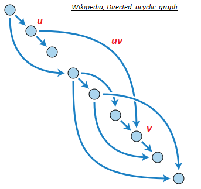

# Layer 2 Scaling Survey (Part 2)

- [Introduction](#introduction)

- [Layer 2 Scaling Current Initiatives (Updated)](#layer-2-scaling-current-initiatives-updated)
  - [TumbleBit](#tumblebit)
  - [What is it?](#what-is-it)
  - [Who does it?](#who-does-it)
  - [Strengths](#strengths)
  - [Weaknesses](#weaknesses)
  - [Opportunities](#opportunities)

- [Counterparty](#counterparty)
  - [What is it?](#what-is-it-1)
  - [Who uses it?](#who-uses-it-1)
  - [Strengths](#strengths-1)
  - [Weaknesses](#weaknesses-1)
  - [Opportunities](#opportunities-1)

- [2-Way Pegged Secondary Blockchains](#2-way-pegged-secondary-block-chains)
  - [What are they?](#what-are-they)
  - [Who does them?](#who-does-them)
  - [Strengths](#strengths-2)
  - [Weaknesses](#weaknesses-2)
  - [Opportunities](#opportunities-2)

- [Lumino](#lumino)
  - [What is it?](#what-is-it-2)
  - [Who does it?](#who-does-it-2)
  - [Strengths](#strengths-3)
  - [Weaknesses](#weaknesses-3)
  - [Opportunities](#opportunities-3)

- [Scriptless Scripts](#scriptless-scripts)
  - [What is it?](#what-is-it-3)
  - [Who does it?](#who-does-it-2)
  - [Strengths](#strengths-4)
  - [Weaknesses](#weaknesses-4)
  - [Opportunities](#opportunities-4)

- [Directed Acyclic Graph (DAG) Derivative Protocols](#directed-acyclic-graph-dag-derivative-protocols)
  - [What is it?](#what-is-it-4)
  - [Who does it?](#who-does-it-3)
  - [Strengths](#strengths-5)
  - [Weaknesses](#weaknesses-5)
  - [Opportunities](#opportunities-5)

- [Observations](#observations)
- [References](#references)
- [Contributors](#contributors)

## Introduction

This report provides a survey of TumbleBit , Counterparty, 2-Way Pegged Secondary Blockchains, Lumino, Scriptless Scripts and Directed Acyclic Graph (DAG) Derivative Protocols as layer 2 scaling alternatives, building on [Layer 2 Scaling Survey (Part 1)](../layer2scaling-landscape/layer2scaling-survey.md).

## Layer 2 Scaling Current Initiatives (Updated)

### TumbleBit

#### What is it?

The TumbleBit protocol was invented at the Boston University. It is a unidirectional, unlinkable payment hub that is fully compatible with the Bitcoin protocol. TumbleBit allows parties to make fast, anonymous, off-chain payments through an untrusted intermediary called the Tumbler. No-one, not even the Tumbler, can tell which payer paid which payee during a TumbleBit epoch, i.e. time period of significance.

Two modes of operation are supported:

- a classic mixing/tumbling/washing mode; and
- a fully-fledged payment hub mode.

TumbleBit consists of two interleaved fair-exchange protocols that rely on the  Rivest–Shamir–Adleman (RSA) cryptosystem's blinding properties to prevent bad acting from either users or Tumblers, and to ensure anonymity:

- RSA-Puzzle-Solver Protocol; and
- Puzzle-Promise Protocol.

TumbleBit also supports anonymizing through Tor to ensure that the Tumbler server can operate as a hidden service. ([[1]], [[2]], [[8]], [[9]], [[10]])

TumbleBit combines off-chain cryptographic computations with standard on-chain Bitcoin scripting functionalities to realize smart contracts [[11]] that are not dependent on Segwit. The most important Bitcoin functionality used here includes hashing conditions, signing conditions, conditional execution, 2-of-2 multi-signatures and timelocking. [[2]]

#### Who does it?

The Boston University provided a proof-of-concept and reference implementation alongside the white paper [[4]]. NTumbleBit [[5]] is being developed as a C# production implementation of the TumbleBit protocol that at the time of writing (July 2018) was being deployed by Stratis with its Breeze implementation [[6]], at alpha/experimental release level in testnet.

*"NTumbleBit will be a cross-platform framework, server and client for the TumbleBit payment scheme. TumbleBit is separated into two modes, tumbler mode and payment hub mode. The tumbler mode improves transaction fungibility and offers risk free unlinkable transactions. Payment hub mode is a way of making off-chain payments possible without requiring implementations like Segwit or the lightning network."* [[3]]

#### Strengths

- Anonymity properties. TumbleBit provides unlinkability without the need to trust the Tumbler service, i.e. untrusted intermediary. [[2]]
- Denial of Service (DoS) and Sybil protection. "TumbleBit uses transaction fees to resist DoS and Sybil attacks." [[2]]

- Balance. "The system should not be exploited to print new money or steal money, even when parties collude." [[2]]

- As a classic tumbler. TumbleBit can also be used as a classic Bitcoin tumbler. [[2]]

- Bitcoin compatibility. TumbleBit is fully compatible with the Bitcoin protocol. [[2]]

- Scalability. Each TumbleBit user only needs to interact with the Tumbler and the corresponding transaction party; this lack of coordination between all TumbleBit users makes scalability possible for the tumbler mode. [[2]]

- Batch processing. TumbleBit  supports one-to-one, many-to-one, one-to-many and many-to-many transactions in payment hub mode. [[2]]

- Masternode compatibility. The TumbleBit protocol can be fully implemented as a service in a Masternode. "The Breeze Wallet is now fully capable of providing enhanced privacy to bitcoin transactions through a secure connection. Utilizing Breeze Servers that are preregistered on the network using a secure, trustless registration mechanism that is resistant to manipulation and censorship." ([[6]], [[7]], [[12]])

- Nearly production ready. The NTumbleBit and Breeze implementations have gained testnet status.

#### Weaknesses

- Privacy is not 100% proven. Payees have better privacy than the payers, and theoretically collusion involving payees and the Tumbler can exist to discover the identity of the payer. [[13]]
- The Tumbler service is not distributed. More work needs to be done to ensure a persistent transaction state in case a Tumbler server goes down.
- Equal denominations are required. The TumbleBit protocol can only support a common denominator unit value. [[2]]

#### Opportunities

TumbleBit has benefits for Tari as a trustless Masternode matching/batch processing engine with strong privacy features.

### Counterparty

#### What is it?

Counterparty is NOT a blockchain. Counterparty is a token protocol released in January 2014 that operates on Bitcoin. It has a fully functional Decentralized Exchange (DEX), as well as several hardcoded smart contracts defined that include contracts for difference and binary options ("bets"). To operate, Counterparty utilizes "embedded consensus", which means that a Counterparty transaction is created and embedded into a Bitcoin transaction, using encoding such as 1-of-3 multi-signature (multisig), Pay to Script Hash (P2SH) or Pay To Public Key Hash (P2PKH). Counterparty nodes, i.e. nodes that run both `bitcoind` and the `counterparty-server` applications, will receive Bitcoin transactions as normal (from `bitcoind`). The `counterparty-server` will then scan each, and decode and parse any embedded Counterparty transactions it finds. In effect, Counterparty is a ledger within the larger Bitcoin ledger, and the functioning of embedded consensus can be thought of as similar to the fitting of one Russian stacking doll inside another. ([[30]], [[31]], [[32]])

Embedded consensus also means that the nodes maintain identical ledgers without using a separate peer-to-peer network, solely using the Bitcoin blockchain for all communication (i.e. timestamping, transaction ordering and transaction propagation). Unlike Bitcoin, which has the concept of both a soft fork and a hard fork, a change to the protocol or "consensus" code of Counterparty always has the potential to create a hard fork. In practice, this means that each Counterparty node must run the same version of `counterparty-server` (or at least the same minor version, e.g. the "3" in 2.3.0) so that the protocol code matches up across all nodes. ([[56]], [[57]])

Unlike Bitcoin's UTXO model, the Counterparty token protocol utilizes an accounts system where each Bitcoin address is an account, and Counterparty credit and debit transactions for a specific token type affect account balances of that token for that given address. The decentralized exchange allows for low-friction exchanging of different tokens between addresses, utilizing the concept of "orders", which are individual transactions made by Counterparty clients, and "order matches", which the Counterparty protocol itself will generate as it parses new orders that overlap existing active orders in the system. It is the Counterparty protocol code itself that manages the escrow of tokens when an order is created, the exchange of tokens between two addresses that have overlapping orders, and the release of those assets from escrow post-exchange.

Counterparty uses its own token, XCP, which was created through a "proof of burn" process during January 2014 [[58]]. In that month, over 2,000 bitcoins were destroyed by various individuals sending them to an unspendable address on the Bitcoin network (`1CounterpartyXXXXXXXXXXXXXXXUWLpVr`), which caused the Counterparty protocol to award the sending address with a corresponding amount of XCP. XCP is used for payment of asset creation fees, collateral for contracts for difference/binary options, and often as a base token in decentralized exchange transactions (largely due to the complexities of using Bitcoin (BTC) in such trades).

Support for the Ethereum Virtual Machine (EVM) was implemented, but never included on the mainnet version [[30]]. With the Counterparty EVM implementation, all published Counterparty smart contracts “live” at Bitcoin addresses that start with a `C`. Counterparty is used to broadcast an `execute` transaction to call a specific function or method in the smart contract code. Once an execution transaction is confirmed by a Bitcoin miner, the Counterparty federated nodes will receive the request and execute that method. The contract state is modified as the smart contract code executes and stored in the Counterparty database. [[56]]

General consensus is that a *federated network* is a *distributed network of centralized networks*. The Ripple blockchain implements a Federated Byzantine Agreement (FBA) consensus mechanism. Federated sidechains implements a security protocol using a trusted federation of mutually distrusting functionaries/notaries. Counterparty utilizes a "full stack" packaging system for its components and all dependencies, called the "federated node" system. However,  this meaning refers to federated in the general definition, i.e. "set up as a single centralized unit within which each state or division keeps some internal autonomy". ([[54]], [[55]], [[28]])

#### Who uses it?

The most notable projects built on top of Counterparty are [Age of Chains](https://www.ageofchains.com), [Age of Rust](http://spacepirate.io), [Augmentors](https://www.augmentorsgame.com/), [Authparty](http://authparty.io/), [Bitcorns](https://bitcorns.com/), [Blockfreight™](http://blockfreight.com/), 
[Blocksafe](http://www.blocksafefoundation.com), [BTCpaymarket.com](http://btcpaymarket.com), [CoinDaddy](http://coindaddy.io), [COVAL](https://coval.readme.io), [FoldingCoin](http://foldingcoin.net/), [FootballCoin](https://www.footballcoin.io/), [GetGems](http://getgems.org/#/), 
[IndieBoard](https://indiesquare.me/), [LTBCoin - Letstalkbitcoin.com](https://letstalkbitcoin.com/), [Mafia Wars](https://mafiawars.io/), [NVO](https://nvo.io/), [Proof of Visit](https://proofofvisit.com/), [Rarepepe.party](http://rarepepe.party), [SaruTobi Island](http://mandelduck.com/sarutobiisland/), 
[Spells of Genesis](http://www.spellsofgenesis.com), [Takara](https://mandelduck.com/#portfolio), [The Scarab Experiment](https://www.thescarabexperiment.org/), [Token.FM](https://token.fm/), [Tokenly](http://tokenly.com/), [TopCoin](https://topcoin.com/) and [XCP DEX](https://XCPDEX.COM). [[32]]

In the past, projects such as [Storj](https://storj.io/) and [SWARM](https://counterparty.io/news/swarm-crowdfunding/) also built on Counterparty. 

COVAL is being developed with the primary purpose of moving value using “off-chain” methods. It uses its own set of node runners to manage various "off-chain" distributed ledgers and ledger assigned wallets to implement an extended transaction value system, whereby tokens as well as containers of tokens can be securely transacted. Scaling within the COVAL ecosystem is thus achievable, because it is not only reliant on the Counterparty federated nodes to execute smart contracts. [[33]]

#### Strengths

- Counterparty provides a simple way to add "layer 2" functionality, i.e. hard-coded smart contracts, to an already existing blockchain implementation that supports basic data embedding.
- Counterparty's embedded consensus model utilizes "permissionless innovation", meaning that even the Bitcoin core developers could not stop the use of the protocol layer without seriously crippling the network.

#### Weaknesses

- Embedded consensus requires lockstep upgrades from network nodes to avoid forks.
- Embedded consensus imposes limitations on the ability of the secondary layer to interact with the primary layer's token. Counterparty was not able to manipulate BTC balances or otherwise directly utilize BTC.
- With embedded consensus, nodes maintain identical ledgers without using a peer-to-peer network. One could claim that this hampers the flexibility of the protocol. It also limits the speed of the protocol to the speed of the underlying blockchain.

#### Opportunities

- Nodes can implement improved consensus models such as Federated Byzantine Agreement. [[55]]
- Refer to [Scriptless Scripts](#scriptless-scripts).

### 2-way Pegged Secondary Blockchains

#### What are they?

A 2-way peg (2WP) allows the "transfer" of BTC from the main Bitcoin blockchain to a secondary blockchain and vice versa at a fixed rate by making use of an appropriate security protocol. The "transfer" actually involves BTC being locked on the main Bitcoin blockchain and unlocked/made available on the secondary blockchain. The 2WP promise is concluded when an equivalent number of tokens on the secondary blockchain are locked (in the secondary blockchain) so that the original bitcoins can be unlocked. ([[22]], [[28]])
- Sidechain: When the security protocol is implemented using Simplified Payment Verification (SPV) proofs - blockchain transaction verification without downloading the entire blockchain - the secondary blockchain is referred to as a Sidechain. [[22]]
- Drivechain: When the security protocol is implemented by giving custody of the BTC to miners - where miners vote when to unlock BTC and where to send them - the secondary blockchain is referred to as a Drivechain. In this scheme, the miners will sign the block header using a Dynamic Membership Multiparty Signature (DMMS). ([[22]], [[28]])
- Federated Peg/Sidechain: When the security protocol is implemented by having a trusted federation of mutually distrusting functionaries/notaries, the secondary blockchain is referred to as a Federated Peg/Sidechain. In this scheme, the DMMS is replaced with a traditional multi-signature scheme. ([[22]], [[28]])
- Hybrid Sidechain-Drivechain-Federated Peg: When the security protocol is implemented by SPV proofs going to the secondary blockchain and dynamic mixture of miner DMMS and functionaries/notaries multi-signatures going back to the main Bitcoin blockchain, the secondary blockchain is referred to as a Hybrid Sidechain-Drivechain-Federated Peg. ([[22]], [[28]], [[29]])

The following figure shows an example of a 2WP Bitcoin secondary blockchain using a Hybrid Sidechain-Drivechain-Federated Peg security protocol [[22]]: 

BTC on the main Bitcoin blockchain are locked by using a P2SH transaction, where BTC can be sent to a script hash instead of a public key hash. To unlock the BTC in the P2SH transaction, the recipient must provide a script matching the script hash and data, which makes the script evaluate to true. [[23]]

#### Who does them?

- RSK (formerly Rootstock) is a 2WP Bitcoin secondary blockchain using a hybrid sidechain-drivechain security protocol. RSK is scalable up to 100&nbsp;transactions per second (Tx/s) and provides a second-layer scaling solution for Bitcoin, as it can relieve on-chain Bitcoin transactions. ([[14]], [[15]], [[16]])

- Hivemind (formerly Truthcoin) is implementing a Peer-to-Peer Oracle Protocol that absorbs accurate data into a blockchain so that Bitcoin users can speculate in Prediction Markets. [[24]]

- Blockstream is implementing a Federated Sidechain called Liquid, with the functionaries/notaries being made up of participating exchanges and Bitcoin businesses. [[29]]

#### Strengths

- Permissionless innovation: Anyone can create a new blockchain project that uses the underlying strengths of the main Bitcoin blockchain using real BTC as the currency. [[20]]
- New features: Sidechains/Drivechains can be used to test or implement new features without risk to the main Bitcoin blockchain or without having to change its protocol, such as Schnorr signatures and zero-knowledge proofs. ([[20]], [[25]])
- Chains-as-a-Service (CaaS) : It is possible to create a CaaS with data storage 2WP secondary blockchains. [[25]]
- Smart Contracts: 2WP secondary blockchains make it easier to implement smart contracts. [[25]]
- Scalability: 2WP secondary blockchains can support larger block sizes and more transactions per second, thus scaling the Bitcoin main blockchain. [[25]]

#### Weaknesses

- Security: Transferring BTC back into the main Bitcoin blockchain is not secure enough and can be manipulated because Bitcoin does not support SPV from 2WP secondary blockchains. [[21]]
- 51% attacks: 2WP secondary blockchains are hugely dependent on merged mining. Mining power centralization and 51% attacks are thus a real threat, as demonstrated for Namecoin and Huntercoin (refer to [Merged Mining Introduction](../../merged-mining/merged-mining-scene/MergedMiningIntroduction.md)).
- The DMMS provided by mining is not very secure for small systems, while the trust of the federation/notaries is riskier for large systems. [[28]]

#### Opportunities

There will be no opportunities if enough functionality is built into the main Tari blockchain.

### Lumino

#### What is it?

Lumino Transaction Compression Protocol (LTCP) is a technique for transaction compression that allows the processing of a higher volume of transactions, but the storing of much less information. The Lumino network is a Lightning-like extension of the RSK platform that uses LTCP. Delta (difference) compression of selected fields of transactions from the same owner is done by using aggregate signing of previous transactions so that previous signatures can be disposed of. [[17]]

Each transaction contains a set of persistent fields called the Persistent Transaction Information (PTI) and a compound record of user transaction data called the SigRec. A Lumino block stores two Merkle trees: one containing all PTIs; and the other containing all transaction IDs (hash of the signed SigRec). This second Merkle tree is conceptually similar to the Segwit witness tree, thus forming the witness part. Docking is the process where SicRec and signature data can be pruned from the blockchain if valid linked PTI information exists. [[17]]

#### Who does it?

RSK, which was newly launched on main net in January 2018. The Lumino Network must still be launched in test net. ([[18]], [[19]])

#### Strengths

The Lumino Network promises high efficiency in pruning the RSK blockchain.

#### Weaknesses

- The Lumino Network has not yet been released. 
- Details about how the Lumino Network will handle payment channels were not decisive in the white paper. [[17]]

#### Opportunities

LTCP pruning may be beneficial to Tari.

### Scriptless Scripts

#### What is it?

*Scriptless Scripts* was coined and invented by mathematician Andrew Poelstra. It entails offering scripting functionality without actual scripts on the blockchain to implement smart contracts. At the time of writing (February 2019) it can only work on the Mimblewimble blockchain and makes use of a specific Schnorr signature scheme [[38]] that allows for signature aggregation, mathematically combining several signatures into a single signature, without having to prove Knowledge of Secret Keys (KOSK). This is known as the *plain public-key model*, where the only requirement is that each potential signer has a public key. The KOSK scheme requires that users prove knowledge (or possession) of the secret key during public key registration with a certification authority, and is one way to generically prevent rogue-key attacks. ([[35]], [[36]])

Signature aggregation properties sought here are ([[35]], [[36]]):

- must be provably secure in the *plain public-key model*;
- must satisfy the normal Schnorr equation, whereby the resulting signature can be written as a function of a combination of the public keys; 
- must allow for Interactive Aggregate Signatures (IAS), where the signers are required to cooperate;
- must allow for Non-interactive Aggregate Signatures (NAS), where the aggregation can be done by anyone;
- must allow each signer to sign the same message;
- must allow each signer to sign their own message.

This is different to a normal multi-signature scheme where one message is signed by all.

Let's say Alice and Bob each needs to provide half a Schnorr signature for a transaction, whereby Alice promises to reveal a secret to Bob in exchange for one crypto coin. Alice can calculate the difference between her half Schnorr signature and the Schnorr signature of the secret (adaptor signature) and hand it over to Bob. Bob then has the ability to verify the correctness of the adaptor signature without knowing the original signatures. Bob can then provide his half Schnorr signature to Alice so she can broadcast the full Schnorr signature to claim the crypto coin. By broadcasting the full Schnorr signature, Bob has access to Alice's half Schnorr signature and he can then calculate the Schnorr signature of the secret because he already knows the adaptor signature, thereby claiming his prize. This is also known as Zero-Knowledge Contingent payments. ([[34]], [[37]])

#### Who does it?

[grin-tech.org](https://grin-tech.org/)

Mimblewimble is being cited by Andrew Poelstra as being the ultimate *Scriptless Script*. [[37]]

#### Strengths

- Data savings: Signature aggregation provides data compression on the blockchain.
- Privacy: Nothing about the Scriptless Script smart contract, other than the settlement transaction, is ever recorded on the blockchain. No one will ever know that an underlying smart contract was executed.
- Multiplicity: Multiple digital assets can be transferred between two parties in a single settlement transaction.
- Implicit scalability: Scalability on the blockchain is achieved by virtue of compressing multiple transactions into a single settlement transaction. Transactions are only broadcast to the blockchain once all preconditions are met.

#### Weaknesses

Recent work by Maxwell et al. ([[35]], [[36]]) showed that a naive implementation of Schnorr multi-signatures that satisfies key aggregation is not secure, and that the Bellare and Neven (BN) Schnorr signature scheme loses the key aggregation property in order to gain security in the plain public-key model. They proposed a new Schnorr-based multi-signature scheme with key aggregation called MuSig, which is provably secure in the *plain public-key model*. It has the same key and signature size as standard Schnorr signatures. The joint signature can be verified in exactly the same way as a standard Schnorr signature with respect to a single “aggregated” public-key, which can be computed from the individual public keys of the signers. Note that the case of interactive signature aggregation where each signer signs their own message must still be proven by a complete security analysis.

#### Opportunities

Tari plans to implement the Mimblewimble blockchain and should implement the *Scriptless Script*s together with the MuSig Schnorr signature scheme. 

However, this in itself will not provide the Layer 2 scaling performance that will be required. Big Neon, the initial business application to be built on top of the Tari blockchain, requires to "facilitate 500 tickets in 4 minutes", i.e. approximately two spectators allowed access every second, with negligible latency. 

The Mimblewimble *Scriptless Script*s could be combined with a federated node (or specialized masternode), similar to that being developed by Counterparty. The secrets that are revealed by virtue of the MuSig Schnorr signatures can instantiate normal smart contracts inside the federated node, with the final consolidated state update being written back to the blockchain after the event.

### Directed Acyclic Graph (DAG) Derivative Protocols

#### What is it?

In mathematics and computer science, a Directed Acyclic Graph (DAG) is a finite directed graph with no directed cycles. A directed graph is acyclic if and only if it has a topological ordering, i.e. for every directed edge *uv* from vertex *u* to vertex *v*, *u* comes before *v* in the ordering (age). [[42]] 

DAGs in blockchain were first proposed as the GHOST protocol ([[44]], [[45]]), a version of which is implemented in Ethereum as the Ethash PoW algorithm (based on Dagger-Hashimoto ([[59]], [[60]])). Then Braiding ([[40]], [[41]]), Jute [[43]], SPECTRE [[46]], and PHANTOM [[52]] were presented. The principle of DAG in blockchain is to present a way to include traditional off-chain blocks into the ledger, which is governed by mathematical rules. A parent that is simultaneously an ancestor of another parent is disallowed:

The main problems to be solved by the DAG derivative protocols are:

1. inclusion of orphaned blocks (decrease the negative effect of slow propagation); and
2. mitigation against selfish mining attacks.

The underlying concept is still in the research and exploration phase. [[39]]

In most DAG derivative protocols, blocks containing conflicting transactions, i.e. conflicting blocks, are not orphaned. A subsequent block is built on top of both of the conflicting blocks, but the conflicting transactions themselves are thrown out while processing the chain. SPECTRE, for one, provides a scheme whereby blocks vote to decide which transactions are robustly accepted, robustly rejected or stay in an indefinite “pending” state in case of conflicts. Both conflicting blocks become part of the shared history, and both conflicting blocks earn their respective miners a block reward. ([[39]], [[50]], [[51]])

**Note:** Braiding requires that parents and siblings may not contain conflicting transactions.

Inclusive (DAG derivative) protocols that integrate the contents of traditional off-chain blocks into the ledger result in incentives for behavior changes by the nodes, which leads to an increased throughput, and a better payoff for weak miners. [[45]]

DAG derivative protocols are not Layer 2 Scaling solutions, but they offer significant scaling of the primary blockchain.

#### Who does it?

- The School of Engineering and Computer Science, The Hebrew University of Jerusalem ([[44]], [[45]], [[46]], [[50]], [[51]])
  - GHOST, SPECTRE, PHANTOM
- DAGlabs [[53]] (**Note:** This is the commercial development chapter.)
  - SPECTRE, PHANTOM
    - SPECTRE provides high throughput and fast confirmation times. Its DAG structure represents an abstract vote regarding the order between each pair of blocks, but this pairwise ordering may not be extendable to a full linear ordering due to possible Condorcet cycles.
    - PHANTOM provides a linear ordering over the blocks of the DAG and can support consensus regarding any general computation (smart contracts), which SPECTRE cannot. In order for a computation or contract to be processed correctly and consistently, the full order of events in the ledger is required, particularly the order of inputs to the contract. However, PHANTOM’s confirmation times are mush slower than those in SPECTRE.
- Ethereum as the Ethash PoW algorithm that has been adapted from GHOST
- [Dr. Bob McElrath] ([[40]], [[41]])
  - Brading
- David Vorick [[43]]
  - Jute
- Crypto currencies:
  - IOTA [[47]] 
  - Nano [[48]]
  - Byteball [[49]]

#### Strengths

- Layer 1 scaling: Increased transaction throughput on the main blockchain.
- Fairness: Better payoff for weak miners.
- Decentralization mitigation: Weaker miners also get profits.
- Transaction confirmation times: Confirmation times of several seconds (SPECTRE).
- Smart contracts: Support smart contracts (PHANTOM).

#### Weaknesses

- Still not proven 100%, development continuing.

- The DAG derivative protocols differ on important aspects such as miner payment schemes, security models, support for smart contracts, and confirmation times. Thus, all DAG derivative protocols are not created equal - beware!

#### Opportunities

Opportunities exist for Tari in applying the basic DAG principles to make a 51% attack harder by virtue of fairness and miner decentralization resistance. Choosing the correct DAG derivative protocol can also significantly improve Layer 1 scaling.

## Observations

Although not all technologies covered here are Layer 2 Scaling solutions, the strengths should be considered as building blocks for the Tari protocol.

## References

[[1]] "TumbleBit: An Untrusted Bitcoin-compatible Anonymous Payment Hub" [online].
Available: http://cs-people.bu.edu/heilman/tumblebit. Date accessed: 2018-07-12.

[1]: http://cs-people.bu.edu/heilman/tumblebit
"TumbleBit: An Untrusted Bitcoin-compatible Anonymous Payment Hub"

[[2]] Ethan Heilman, Leen AlShenibr, Foteini Baldimtsi, Alessandra Scafuro, and Sharon Goldberg, "TumbleBit: An Untrusted Bitcoin-compatible Anonymous Payment Hub" [online].
Available: https://eprint.iacr.org/2016/575.pdf. Date accessed: 2018-07-08.

[2]: https://eprint.iacr.org/2016/575.pdf
"TumbleBit: An Untrusted Bitcoin-compatible Anonymous Payment Hub"

[[3]] "Anonymous Transactions Coming to Stratis" [online].
Available: https://medium.com/@Stratisplatform/anonymous-transactions-coming-to-stratis-fced3f5abc2e. Date accessed: 2018-07-08.

[3]: https://medium.com/@Stratisplatform/anonymous-transactions-coming-to-stratis-fced3f5abc2e
"Anonymous Transactions Coming to Stratis"

[[4]] TumbleBit Proof of Concept GitHub Repository [online].
Available: https://github.com/BUSEC/TumbleBit. Date accessed: 2018-07-08.

[4]: https://github.com/BUSEC/TumbleBit
"TumbleBit Proof of Concept GitHub Repository"

[[5]] NTumbleBit GitHub Repository [online].
Available: https://github.com/nTumbleBit/nTumbleBit. Date accessed: 2018-07-12.

[5]: https://github.com/nTumbleBit/nTumbleBit
"NTumbleBit GitHub Repository"

[[6]] "Breeze Tumblebit Server Experimental Release" [online].
Available: https://stratisplatform.com/2017/07/17/breeze-tumblebit-server-experimental-release. Date accessed: 2018-07-12.

[6]: https://stratisplatform.com/2017/07/17/breeze-tumblebit-server-experimental-release
"Breeze Tumblebit Server Experimental Release"

[[7]] "Breeze Wallet with Breeze Privacy Protocol (Dev. Update)" [online].
Available: https://stratisplatform.com/2017/09/20/breeze-wallet-with-breeze-privacy-protocol-dev-update. Date accessed: 2018-07-12.

[7]: https://stratisplatform.com/2017/09/20/breeze-wallet-with-breeze-privacy-protocol-dev-update
"Breeze Wallet with Breeze Privacy Protocol"

[[8]] Ethan Heilman,  Foteini Baldimtsi and Sharon Goldberg, "Blindly Signed Contracts - Anonymous On-chain and Off-chain Bitcoin Transactions" [online].
Available: https://eprint.iacr.org/2016/056.pdf. Date accessed: 2018-07-12.

[8]: https://eprint.iacr.org/2016/056.pdf
"Blindly Signed Contracts - Anonymous On-chain and Off-chain Bitcoin Transactions"

[[9]] Ethan Heilman and Leen AlShenibr, "TumbleBit: An Untrusted Bitcoin-compatible Anonymous Payment Hub - 08 October 2016", in Conference: *Scaling Bitcoin 2016 Milan*.
Available: https://www.youtube.com/watch?v=8BLWUUPfh2Q&feature=youtu.be&t=1h3m10s. Date accessed: 2018-07-13.

[9]: https://www.youtube.com/watch?v=8BLWUUPfh2Q&feature=youtu.be&t=1h3m10s
"TumbleBit: An Untrusted Bitcoin-compatible Anonymous Payment Hub"

[[10]] "Better Bitcoin Privacy, Scalability: Developers Making TumbleBit a Reality" [online].
Available: https://bitcoinmagazine.com/articles/better-bitcoin-privacy-scalability-developers-are-making-tumblebit-reality. Date accessed: 2018-07-13.

[10]: https://bitcoinmagazine.com/articles/better-bitcoin-privacy-scalability-developers-are-making-tumblebit-reality
"Better Bitcoin Privacy, Scalability: Developers Making TumbleBit a Reality"

[[11]] Bitcoinwiki: Contract [online].
Available: https://en.bitcoin.it/wiki/Contract. Date accessed: 2018-07-13.

[11]: https://en.bitcoin.it/wiki/Contract
"Bitcoinwiki: Contract"

[[12]] "Bitcoin Privacy is a Breeze: TumbleBit Successfully Integrated Into Breeze" [online].
Available: https://stratisplatform.com/2017/08/10/bitcoin-privacy-tumblebit-integrated-into-breeze. Date accessed: 2018-07-13.

[12]: https://stratisplatform.com/2017/08/10/bitcoin-privacy-tumblebit-integrated-into-breeze
"Bitcoin Privacy is a Breeze: TumbleBit Successfully Integrated Into Breeze"

[[13]] "TumbleBit Wallet Reaches One Step Forward" [online].
Available: https://www.bitcoinmarketinsider.com/tumblebit-wallet-reaches-one-step-forward. Date accessed: 2018-07-13.

[13]: https://www.bitcoinmarketinsider.com/tumblebit-wallet-reaches-one-step-forward
"TumbleBit Wallet Reaches One Step Forward"

[[14]] "A Survey of Second Layer Solutions for Blockchain Scaling Part 1" [online].
Available: https://www.ethnews.com/a-survey-of-second-layer-solutions-for-blockchain-scaling-part-1. Date accessed: 2018-07-16.

[14]: https://www.ethnews.com/a-survey-of-second-layer-solutions-for-blockchain-scaling-part-1
"A Survey Of Second Layer Solutions for Blockchain Scaling Part 1"

[[15]] "Second-layer Scaling" [online].
Available: https://lunyr.com/article/Second-Layer_Scaling. Date accessed: 2018-07-16.

[15]: https://lunyr.com/article/Second-Layer_Scaling
"Second-layer Scaling"

[[16]] RSK Website [online].
Available: https://www.rsk.co. Date accessed: 2018-07-16.

[16]: https://www.rsk.co
"RSK Website"

[[17]] S. D. Lerner, "Lumino Transaction Compression Protocol (LTCP)" [online].
Available: https://uploads.strikinglycdn.com/files/ec5278f8-218c-407a-af3c-ab71a910246d/LuminoTransactionCompressionProtocolLTCP.pdf. Date accessed: 2018-07-16.

[17]: https://uploads.strikinglycdn.com/files/ec5278f8-218c-407a-af3c-ab71a910246d/LuminoTransactionCompressionProtocolLTCP.pdf
"Lumino Transaction Compression Protocol (LTCP)"

[[18]] "Bitcoin-based Ethereum Rival RSK Set to Launch Next Month" [online].
Available:  https://cryptonewsmonitor.com/2017/11/11/bitcoin-based-ethereum-rival-rsk-set-to-launch-next-month. Date accessed: 2018-07-16.

[18]: https://cryptonewsmonitor.com/2017/11/11/bitcoin-based-ethereum-rival-rsk-set-to-launch-next-month
"Bitcoin-based Ethereum Rival RSK Set to Launch Next Month"

[[19]] RSK Blog Website [online].
Available:  https://media.rsk.co/. Date accessed: 2018-07-16.

[19]: https://media.rsk.co/
"RSK Blog Website"

[[20]] "Drivechain: Enabling Bitcoin Sidechain" [online].
Available:  http://www.drivechain.info. Date accessed: 2018-07-17.

[20]: http://www.drivechain.info
"Drivechain: Enabling Bitcoin Sidechain"

[[21]] "Drivechain - The Simple Two Way Peg" [online].
Available:  http://www.truthcoin.info/blog/drivechain. Date accessed: 2018-07-17.

[21]: http://www.truthcoin.info/blog/drivechain
"Drivechain - The Simple Two Way Peg"

[[22]] "Sidechains, Drivechains, and RSK 2-Way Peg Design" [online].
Available:  https://www.rsk.co/blog/sidechains-drivechains-and-rsk-2-way-peg-design or https://uploads.strikinglycdn.com/files/27311e59-0832-49b5-ab0e-2b0a73899561/Drivechains_Sidechains_and_Hybrid_2-way_peg_Designs_R9.pdf. Date accessed: 2018-07-18.

[22]: https://www.rsk.co/blog/sidechains-drivechains-and-rsk-2-way-peg-design
"Sidechains, Drivechains, and RSK 2-Way Peg Design"

[[23]] "Pay to Script Hash"[online].
Available:  https://en.bitcoin.it/wiki/Pay_to_script_hash. Date accessed: 2018-07-18.

[23]:  https://en.bitcoin.it/wiki/Pay_to_script_hash
"Pay to Script Hash"

[[24]] Hivemind Website [online].
Available: http://bitcoinhivemind.com. Date accessed: 2018-07-18.

[24]: http://bitcoinhivemind.com
"Hivemind website"

[[25]] "Drivechains: What do they Enable? Cloud 3.0 Services Smart Contracts and Scalability" [online].
Available:  http://drivechains.org/what-are-drivechains/what-does-it-enable. Date accessed: 2018-07-19.

[25]: http://drivechains.org/what-are-drivechains/what-does-it-enable
"Drivechains: What do they Enable? Cloud 3.0 Services Smart Contracts and Scalability"

[[26]] "Bloq’s Paul Sztorc on the 4 Main Benefits of Sidechains" [online]. Available:  https://bitcoinmagazine.com/articles/bloq-s-paul-sztorc-on-the-main-benefits-of-sidechains-1463417446. Date accessed: 2018-07-19.

[26]:https://bitcoinmagazine.com/articles/bloq-s-paul-sztorc-on-the-main-benefits-of-sidechains-1463417446
"Bloq’s Paul Sztorc on the 4 Main Benefits of Sidechains"

[[27]] Blockstream Website [online].
Available:  https://blockstream.com/technology. Date accessed: 2018-07-19.

[27]:  https://blockstream.com/technology
"Blockstream Website [online]"

[[28]] Adam Back, Matt Corallo, Luke Dashjr, Mark Friedenbach, Gregory Maxwell, Andrew Miller, Andrew Poelstra,
Jorge Timón and Pieter Wuille, 2014-10-22. "Enabling Blockchain Innovations with Pegged Sidechains" [online].
Available: https://blockstream.com/sidechains.pdf. Date accessed: 2018-07-19.

[28]: https://blockstream.com/sidechains.pdf
"Enabling Blockchain Innovations with Pegged Sidechains"

[[29]] Johnny Dilley,  Andrew Poelstra, Jonathan Wilkins, Marta Piekarska, Ben Gorlick and Mark Friedenbachet, "Strong Federations: An Interoperable Blockchain Solution to Centralized Third Party Risks" [online].
Available: https://blockstream.com/strong-federations.pdf. Date accessed: 2018-07-19.

[29]: https://blockstream.com/strong-federations.pdf
"Strong Federations: An Interoperable Blockchain Solution to Centralized Third Party Risks"

[[30]] CounterpartyXCP/Documentation/Smart Contracts/EVM FAQ [online]. Available: https://github.com/CounterpartyXCP/Documentation/blob/master/Basics/FAQ-SmartContracts.md. Date accessed: 2018-07-23.

[30]: https://github.com/CounterpartyXCP/Documentation/blob/master/Basics/FAQ-SmartContracts.md
"CounterpartyXCP/Documentation/Smart Contracts/EVM FAQ"

[[31]] Counterparty Development 101 [online].
Available: https://medium.com/@droplister/counterparty-development-101-2f4d9b0c8df3. Date accessed: 2018-07-23.

[31]: https://medium.com/@droplister/counterparty-development-101-2f4d9b0c8df3
"Counterparty Development 101"

[[32]]  Counterparty Website [online].
Available: https://counterparty.io. Date accessed: 2018-07-24.

[32]: https://counterparty.io
" Counterparty Website"

[[33]] COVAL Website [online].
Available: https://coval.readme.io/docs. Date accessed: 2018-07-24.

[33]: https://coval.readme.io/docs
"COVAL Website"

[[34]] "Scriptless Scripts: How Bitcoin Can Support Smart Contracts Without Smart Contracts" [online].
Available: https://bitcoinmagazine.com/articles/scriptless-scripts-how-bitcoin-can-support-smart-contracts-without-smart-contracts. Date accessed: 2018-07-24.

[34]: https://bitcoinmagazine.com/articles/scriptless-scripts-how-bitcoin-can-support-smart-contracts-without-smart-contracts
"Scriptless Scripts: How Bitcoin Can Support Smart Contracts Without Smart Contracts"

[[35]] "Key Aggregation for Schnorr Signatures" [online].
Available: https://blockstream.com/2018/01/23/musig-key-aggregation-schnorr-signatures.html. Date accessed: 2018-07-24.

[35]: https://blockstream.com/2018/01/23/musig-key-aggregation-schnorr-signatures.html
"Key Aggregation for Schnorr Signatures"

[[36]] Gregory Maxwell, Andrew Poelstra, Yannick Seurin and Pieter Wuille, "Simple Schnorr Multi-signatures with Applications to Bitcoin" [online].
Available: 20 May 2018, https://eprint.iacr.org/2018/068.pdf. Date accessed: 2018-07-24.

[36]: https://eprint.iacr.org/2018/068.pdf
"Simple Schnorr Multi-signatures with Applications to Bitcoin"

[[37]] A. Poelstra, 4 March 2017, "Scriptless Scripts" [online].
Available:  https://download.wpsoftware.net/bitcoin/wizardry/mw-slides/2017-03-mit-bitcoin-expo/slides.pdf. Date accessed: 2018-07-24.

[37]: https://download.wpsoftware.net/bitcoin/wizardry/mw-slides/2017-03-mit-bitcoin-expo/slides.pdf
"Scriptless Scripts"

[[38]] bip-schnorr.mediawiki [online].
Available: https://github.com/sipa/bips/blob/bip-schnorr/bip-schnorr.mediawiki. Date accessed: 2018-07-26.

[38]: https://github.com/sipa/bips/blob/bip-schnorr/bip-schnorr.mediawiki
"bip-schnorr.mediawiki"

[[39]] "If There is an Answer to Selfish Mining, Braiding could be It" [online].
Available: https://bitcoinmagazine.com/articles/if-there-is-an-answer-to-selfish-mining-braiding-could-be-it-1482876153. Date accessed: 2018-07-27.

[39]: https://bitcoinmagazine.com/articles/if-there-is-an-answer-to-selfish-mining-braiding-could-be-it-1482876153
"If There is an Answer to Selfish Mining, Braiding could be It"

[[40]] B. McElrath, "Braiding the Blockchain", in Conference: *Scaling Bitcoin, Hong Kong, 7 Dec 2015* [online].
Available: https://scalingbitcoin.org/hongkong2015/presentations/DAY2/2_breaking_the_chain_1_mcelrath.pdf. Date accessed: 2018-07-27.

[40]: https://scalingbitcoin.org/hongkong2015/presentations/DAY2/2_breaking_the_chain_1_mcelrath.pdf
"Braiding the Blockchain"

[[41]] "Braid Examples" [online].
Available: https://rawgit.com/mcelrath/braidcoin/master/Braid%2BExamples.html. Date accessed: 2018-07-27.

[41]: https://rawgit.com/mcelrath/braidcoin/master/Braid%2BExamples.html
"Braid Examples"

[[42]] "Directed Acyclic Graph" [online].
Available: https://en.wikipedia.org/wiki/Directed_acyclic_graph. Date accessed: 2018-07-30.

[42]: https://en.wikipedia.org/wiki/Directed_acyclic_graph
"Directed Acyclic Graph"

[[43]] "Braiding Techniques to Improve Security and Scaling" [online]. Available: https://scalingbitcoin.org/milan2016/presentations/D2%20-%209%20-%20David%20Vorick.pdf. Date accessed: 2018-07-30.

[43]: https://scalingbitcoin.org/milan2016/presentations/D2%20-%209%20-%20David%20Vorick.pdf
"Braiding Techniques to Improve Security and Scaling"

[[44]] Yonatan Sompolinsky and Aviv Zohar, "GHOST: Secure High-rate Transaction Processing in Bitcoin" [online].
Available:  https://eprint.iacr.org/2013/881.pdf. Date accessed: 2018-07-30.

[44]: https://eprint.iacr.org/2013/881.pdf
"GHOST: Secure High-rate Transaction Processing in Bitcoin"

[[45]] Yoad Lewenberg, Yonatan Sompolinsky and Aviv Zohar, "Inclusive Blockchain Protocols" [online]. Available: http://fc15.ifca.ai/preproceedings/paper_101.pdf. Date accessed: 2018-07-30.

[45]: http://fc15.ifca.ai/preproceedings/paper_101.pdf
"Inclusive Blockchain Protocols"

[[46]] Yonatan Sompolinsky, Yoad Lewenberg and Aviv Zohar, "SPECTRE: A Fast and Scalable Cryptocurrency Protocol" [online].
Available: http://www.cs.huji.ac.il/~yoni_sompo/pubs/16/SPECTRE_complete.pdf. Date accessed: 2018-07-30.

[46]: http://www.cs.huji.ac.il/~yoni_sompo/pubs/16/SPECTRE_complete.pdf
"SPECTRE: A Fast and Scalable Cryptocurrency Protocol"

[[47]] IOTA Website [online].
Available: https://www.iota.org/. Date accessed: 2018-07-30.

[47]: https://www.iota.org/
"IOTA Website"

[[48]] NANO: "Digital Currency for the Real World – the fast and free way to pay for everything in life" [online].
Available: https://nano.org/en. Date accessed: 2018-07-30.

[48]: https://nano.org/en
"Digital Currency for the Real World – the fast and free way to pay for everything in life"

[[49]] Byteball [online].
Available: https://byteball.org/. Date accessed: 2018-07-30.

[49]: https://byteball.org/
"Byteball"

[[50]] "SPECTRE: Serialization of Proof-of-work Events, Confirming Transactions via Recursive Elections" [online].
Available: https://medium.com/@avivzohar/the-spectre-protocol-7dbbebb707b. Date accessed: 2018-07-30.

[50]: https://medium.com/@avivzohar/the-spectre-protocol-7dbbebb707b
"SPECTRE: Serialization of Proof-of-work Events, Confirming Transactions via Recursive Elections"

[[51]] Yonatan Sompolinsky, Yoad Lewenberg and Aviv Zohar, "SPECTRE: Serialization of Proof-of-work Events: Confirming Transactions via Recursive Elections" [online].
Available: https://eprint.iacr.org/2016/1159.pdf. Date accessed: 2018-07-30.

[51]: https://eprint.iacr.org/2016/1159.pdf
"SPECTRE: Serialization of Proof-of-work Events: Confirming Transactions via Recursive Elections"

[[52]] Yonatan Sompolinsky and Aviv Zohar, "PHANTOM: A Scalable BlockDAG Protocol" [online].
Available: https://docs.wixstatic.com/ugd/242600_92372943016c47ecb2e94b2fc07876d6.pdf. Date accessed: 2018-07-30.

[52]: https://docs.wixstatic.com/ugd/242600_92372943016c47ecb2e94b2fc07876d6.pdf
"PHANTOM: A Scalable BlockDAG Protocol"

[[53]] DAGLabs Website [online].
Available: https://www.daglabs.com. Date accessed: 2018-07-30.

[53]: https://www.daglabs.com
"DAGLabs Website"

[[54]] "Beyond Distributed and Decentralized: what is a federated network?" [Online.]
Available: http://networkcultures.org/unlikeus/resources/articles/what-is-a-federated-network. Date accessed: 2018-08-13.

[54]: http://networkcultures.org/unlikeus/resources/articles/what-is-a-federated-network
"Beyond Distributed and Decentralized: what is a federated network?"

[[55]] "Federated Byzantine Agreement" [online].
Available: https://towardsdatascience.com/federated-byzantine-agreement-24ec57bf36e0. Date accessed: 2018-08-13.

[55]: https://towardsdatascience.com/federated-byzantine-agreement-24ec57bf36e0
"Federated Byzantine Agreement"

[[56]] "Counterparty Documentation: Frequently Asked Questions" [online].
Available: https://counterparty.io/docs/faq. Date accessed: 2018-09-14.

[56]: https://counterparty.io/docs/faq
"Counterparty Documentation: Frequently Asked Questions"

[[57]] "Counterparty Documentation: Protocol Specification" [online].
Available: https://counterparty.io/docs/protocol_specification. Date accessed: 2018-09-14.

[57]: https://counterparty.io/docs/protocol_specification
"Counterparty Documentation: Protocol Specification"

[[58]] "Counterparty News: Why Proof-of-Burn, March 23, 2014" [online].
Available: https://counterparty.io/news/why-proof-of-burn.
Date accessed: 2018-09-14.

[58]: https://counterparty.io/news/why-proof-of-burn
"Counterparty News: Why Proof-of-Burn"

[[59]] Vitalik Buterin, "Dagger: A Memory-Hard to Compute, Memory-Easy to Verify Scrypt Alternative" [online].
Available: http://www.hashcash.org/papers/dagger.html. Date #nbsp; accessed: 2019-02-12.

[59]: http://www.hashcash.org/papers/dagger.html
"Dagger: A Memory-Hard to Compute, Memory-Easy to Verify Scrypt Alternative"

[[60]] Thaddeus Dryja, "Hashimoto: I/O Bound Proof of Work" [online].
Available: https://web.archive.org/web/20170810043640/https://pdfs.semanticscholar.org/3b23/7cc60c1b9650e260318d33bec471b8202d5e.pdf. Date accessed: 2019-02-12.

[60]: https://web.archive.org/web/20170810043640/https://pdfs.semanticscholar.org/3b23/7cc60c1b9650e260318d33bec471b8202d5e.pdf
"Hashimoto: I/O Bound Proof of Work,
Thaddeus Dryja"

## Contributors

- [https://github.com/hansieodendaal](https://github.com/hansieodendaal)
- [https://github.com/ksloven](https://github.com/ksloven)
- [https://github.com/robby-dermody](https://github.com/robby-dermody)
- [https://github.com/anselld](https://github.com/anselld)
