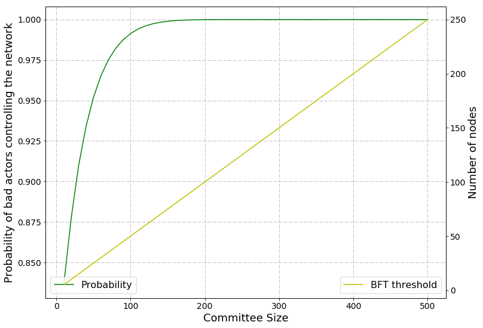
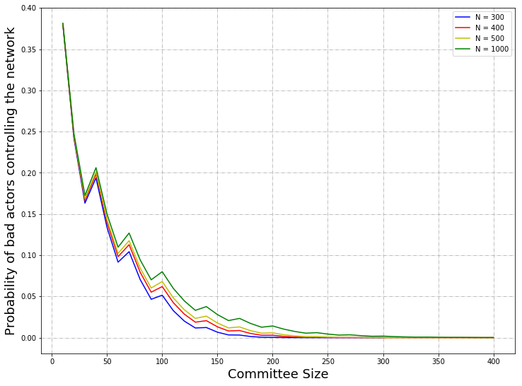
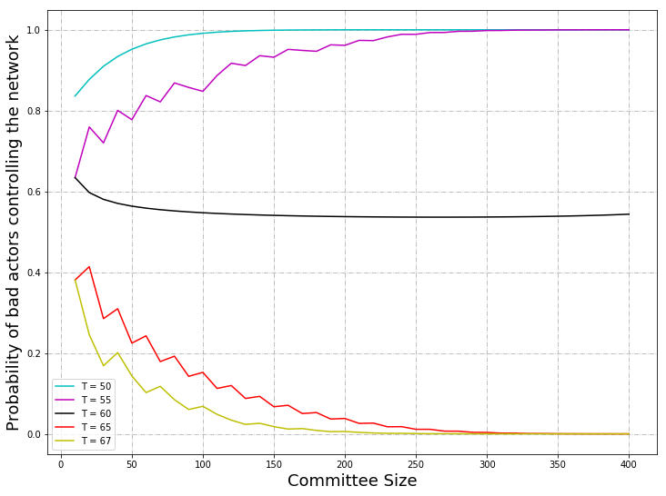

# Probabilistic Attack Vector Analysis Building Blocks

- [Introduction](#introduction)
	- [Question](#question) 
	- [Aim](#aim)
- [Literature Review](#literature-review)
  - [The Tari Digital Assets Network](#the-tari-digital-assets-network) 
  - [XOR Metric](#xor-metric)
  - [Data Modelling](#data-modelling)
  - [Types of Distribution](#types-of-distribution)
    - [Continuous Distribution](#continuous-distribution)
    - [Discrete Distribution](#discrete-distribution)
      - [Hypergeometric Distribution](#hypergeometric-distribution)
      - [Binomial Distribution](#binomial-distribution)
  - [Monte Carlo Simulations](#monte-carlo-simulations)
- [Monte Carlo Fallacy](#monte-carlo-fallacy) 
    - [Illustration of the Gambler's Falacity](#illustration-of-the-gamblers-falacity)
  - [The Crude Monte Carlo](#the-crude-monte-carlo)
  - [The Law of Large Numbers](#the-law-of-large-numbers)
- [Methodology](#methodology)
	
	- [Notation Used](#notation-used)
	- [Statistical Calculation](#statistical-calculation)
	  - [Formulae](#formulae)
	    - [Hypergeometric Distribution](#hypergeometric-distribution)
	    - [Binomial Distribution](#binomial-distribution)
	    - [Summation](#summation)
	  - [Explanation of Hypergeometric Distribution ](#explanation-of-hypergeometric-distribution)
	  - [Implemention with Excel](#implementation-with-excel)
	- [Crude Monte Carlo Simulation](curde-monte-carlo-simulation)
	  - [Use of Random Numbers](#use-of-random-numbers)
	  - [Drawing and Distribution of Random Numbers](#drawing-and-distribution-of-random-numbers)
	  - [Drawing Integers](#drawing-integers)
	  - [Clustered Random Numbers](#clustered-random-numbers)
	  - [Histogram of Gaussian Numbers](#histogram-of-gaussian-numbers)
	  - [Computing Statistics](#computing-statistics)
	  - [Example: Drawing Balls from a Hat](#example:-drawing-balls-from-a-hat)
- [Implementation](#implementation)
	- [The Use of Python](#the-use-of-python)
	- [Demonstration](#demonstration) 
	- [Results](#results)
	  - [Statistical Calculation](#statistical-calculation)
	    - [Probabilistic Attack Graphs](#probabilistic-attack-graphs) 
	  - [Crude Monte Carlo Simulation](#crude-monte-carlo-simulation)
	    - [Individual Probabilities](#individual-probabilities)
	    - [A Histogram and Visualization of Distribution](#a-histogram-and-visualization-of-distribution)
	    - [Proving the Law of Large Numbers](#proving-the-law-of-large-numbers)
	    - [Summary of Probability and Statistics Computations](#summary-of-probability-and-statistics-computations)
	- [Discussion](#discussion) 
		- [Function](#function)
- [Conclusion and Recommendations](#conclusions-and-recommendations)
- [References](#references)
- [Appendices](#appendices)
- [Contributions](#contributors) 

## Introduction

### Aim 

This research aims to provide answers to questions posed about the workings of the  Tari Digital Assets Network environment: Probabilistic attack vector with regards to the total nodes, compromised nodes, committee size and byzsntine fault tolerance threshold. 

### Question

This investigation attempts to answer the following question: *What is the % chance of controlling majority of nodes in a random sample of with varying quantities of the total number of nodes, committee size, bad nodes and byzantine fault tolerance threshold?*

This research paper has made an attempt to explore the possibility of quantifying various probabilities through variations in the total number of nodes, the committee selected from the total, and the threshold which governs whether a committee can be deemed corrupt. 

## Literature Review 

### The Tari Digital Assets Network 

The Tari Digital Assets Network (DAN) forms part of the Tari second layer, and is where all digital asset interactions are managed. 

These interactions are processed and validated by  committees of special nodes, validator nodes. Management of digital assets involves state changes and ensures that the rules that govern assets contractes are enforced. 

The validator nodes are registered on the base layer and in order to prevent Sybil attacks, commit collateral. 

The Digital Asset (DA) would be issued by an AI and a contract drawn. It is the AI that will dictate the size of committee of validator nodes for a particular DA. The AI will also have the ability to nominate a trusted node to form part of the valiator node committee for the DA. If there are any remaining vacancies in the committee they would be filled with 

An AI will issue a DA by constructing a contract from one of the supported set of [DigitalAssetTemplate](https://rfc.tari.com/Glossary.html#digitalassettemplate)s. The AI will choose how large the committee of VNs will be for this DA, and have the option to nominate [Trusted Node](https://rfc.tari.com/Glossary.html#trusted-node)s to be part of the VN committee for the DA. Any remaining spots on the committee will be filled by permissionless VNs that are selected according to a [CommitteeSelectionStrategy](https://rfc.tari.com/Glossary.html#committeeselectionstrategy). This is a strategy that an AI will use to select from the set of potential candidate VNs that nominated themselves for a position on the committee when the AI broadcast a public call for VNs during the asset creation process. For the VNs to accept the appointment to the committee, they will need to put up the specified collateral.


Validator nodes (VNs) make up the Tari second layer, or [Digital Asset Network](https://rfc.tari.com/Glossary.html#digital-asset-network). VNs are responsible for creating and updating [digital asset](https://rfc.tari.com/Glossary.html#digital-asset)s living on the Tari network.


[Validator Node](https://rfc.tari.com/Glossary.html#validator-node)s form the basis of the second-layer DAN. All actions on this network take place by interacting with VNs. Some examples of actions that VNs will facilitate are:

- issuing a [Digital Asset](https://rfc.tari.com/Glossary.html#digital-asset) (DA);
- querying the state of a DA and its constituent [tokens](https://rfc.tari.com/Glossary.html#digital-asset-tokens); and
- issuing an instruction to change the state of a DA or tokens.

VNs will also perform archival functions for the assets they manage. The lifetime of these archives and the fee structure for this function are still being discussed.


VNs are expected to manage the state of DAs on behalf of DA issuers. They receive fees as reward for doing this.

- DAs consist of an initial state plus a set of state transition rules. These rules are set by the Tari protocol, but will usually provide parameters that must be specified by the [Asset Issuer](https://rfc.tari.com/Glossary.html#asset-issuer).
- The set of VNs that participate in managing state of a specific DA is called a [Committee](https://rfc.tari.com/Glossary.html#committee). A committee is selected during the asset issuance process and membership of the committee can be updated at [Checkpoint](https://rfc.tari.com/Glossary.html#checkpoint)s.
- The VN is responsible for ensuring that every state change in a DA conforms to the contract's rules.
- VNs accept DA [Instructions](https://rfc.tari.com/Glossary.html#instructions) from clients and peers. Instructions allow for creating, updating, expiring and archiving DAs on the DAN.
- VNs provide additional collateral, called [AssetCollateral](https://rfc.tari.com/Glossary.html#assetcollateral), when accepting an offer to manage an asset, which is stored in a multi-signature (multi-sig) Unspent Transaction Output (UTXO) on the base layer. This collateral can be taken from the VN if it is proven that the VN engaged in malicious behaviour.
- VNs participate in fraud-proof validations in the event of consensus disputes (which could result in the malicious VN's collateral being slashed).
- DA metadata (e.g. large images) is managed by VNs. The large data itself will not be stored on the VNs, but in an external location, and a hash of the data can be stored. Whether the data is considered part of the state (and thus checkpointed) or out of state depends on the type of DA contract employed.

### [Nomination](https://rfc.tari.com/RFC-0304_VNCommittees.html#nomination)

The first step in assembling a committee is to nominate candidate VNs. As described in [RFC-0311](https://rfc.tari.com/RFC-0311_AssetTemplates.html), an asset can be created with two possible `committee_modes` - `CREATOR_NOMINATION` or `PUBLIC_NOMINATION`:

- In `CREATOR_NOMINATION` mode, the AI nominates candidate committee members directly. The AI will have a list of permissioned [Trusted Node](https://rfc.tari.com/Glossary.html#trusted-node)s that they want to act as the committee. The AI will contact the candidate VNs directly to inform them of their nomination.
- In `PUBLIC_NOMINATION` mode, the AI does not have a list of [Trusted Node](https://rfc.tari.com/Glossary.html#trusted-node)s and wants to source unknown VNs from the network. In this case, the AI broadcasts a public call for nomination to the Tari network using the peer-to-peer messaging protocol described in [RFC-0172](https://rfc.tari.com/RFC-0172_PeerToPeerMessagingProtocol.html). This call for nomination contains all the details of the asset. VNs that want to participate will then nominate themselves by contacting the AI.

### [Selection](https://rfc.tari.com/RFC-0304_VNCommittees.html#selection)

Once the AI has received a list of nominated VNs, it must make a selection, assuming enough VNs were nominated to populate the committee. The AI will employ some [CommitteeSelectionStrategy](https://rfc.tari.com/Glossary.html#committeeselectionstrategy) in order to select the committee from the candidate VNs that have been nominated. This strategy might aim for a perfectly random selection, or perhaps it will consider some metrics about the candidate VNs, such as the length of their VN registrations. These metrics might indicate that they are reliable and have not been blacklisted for poor or malicious performance.

A consideration when selecting a committee in `PUBLIC_NOMINATION` mode will be the size of the pool of nominated VNs. The size of this pool relative to the size of the committee to be selected will be linked to a risk profile. If the pool contains very few candidates, then it will be much easier for an attacker to have nominated their own nodes in order to obtain a majority membership of the committee. For example, if the AI is selecting a committee of 10 members using a uniformly random selection strategy and only 12 public nominations are received, an attacker only requires control of six VNs to achieve a majority position in the committee. In contrast, if 100 nominations are received and the AI performs a uniformly random selection, an attacker would need to control more than 50 of the nominated nodes in order to achieve a majority position in the committee.

### [Offer Acceptance](https://rfc.tari.com/RFC-0304_VNCommittees.html#offer-acceptance)

Once the selection has been made by the AI, the selected VNs will be informed and they will be made an offer of membership. If the VNs are still inclined to join the committee, they will accept the offer by posting the [AssetCollateral](https://rfc.tari.com/Glossary.html#assetcollateral) required by the asset to the [base layer](https://rfc.tari.com/Glossary.html#base-layer) during the initial [Checkpoint](https://rfc.tari.com/Glossary.html#checkpoint)transaction built to commence the operation of the asset.


### [ Overview](https://rfc.tari.com/RFC-0340_VNConsensusOverview.html#overview)

The primary problem under consideration here is for multiple machines running the same program (in the form of a Tari smart contract) to maintain agreement on what the state of the program is, often under adverse conditions, including unreliable network communication, malicious third parties, or even malicious peers running the smart contract.

In computer science terms, the problem is referred to as [State Machine Replication](https://en.wikipedia.org/wiki/State_machine_replication), or SMR. If we want our honest machines (referred to as *replicas* in SMR parlance) to reach agreement in the face of arbitrary failures, then we talk about our system being [Byzantine Fault Tolerant](https://tlu.tarilabs.com/consensus-mechanisms/BFT-consensusmechanisms/sources/PITCHME.link.html).

Tari Asset [committees](https://rfc.tari.com/Glossary.html#committee) are chosen by the asset issuer according to [RFC-0304](https://rfc.tari.com/RFC-0304_VNCommittees.html). The committees form a fixed set of replicas, at the very least from checkpoint to checkpoint, and will typically be limited in size, usually less than ten, and almost always under 100. *Note*: These numbers are highly speculative based on an intuitive guess about the main use cases for Tari DAs, where we have

- many 1-3-sized committees where the asset issuer and the VN committee are the same entity,
- semi-decentralised assets of ±4-10 where speed trumps censorship-resistance,
- a small number of 50-100 VNs where censorship-resistance trumps speed.

Because nodes cannot join and leave the committees at will, robust yet slow and expensive consensus approaches such as Nakamoto consensus can be dropped in favour of something more performant.

There is a good survey of consensus mechanisms on [Tari Labs University](https://tlu.tarilabs.com/consensus-mechanisms/consensus-mechanisms.html).

From the point of view of a DAN committee, the ideal consensus algorithm is one that

1. Allows a high number of transactions per second, and doesn't have unnecessary pauses (i.e. a partially synchronous or asynchronous model).
2. Is Byzantine Fault tolerant.
3. Is relatively efficient from a network communication point of view (number of messages passed per state agreement).
4. Is relatively simple to implement (to reduce the bug and vulnerability surface in implementations).

A summary of some of the most well-known BFT algorithms is presented in [this table](https://tlu.tarilabs.com/consensus-mechanisms/BFT-consensus-mechanisms-applications/MainReport.html#summary-of-findings).

A close reading of the algorithms presented suggest that [LinBFT](https://arxiv.org/pdf/1807.01829.pdf), which is based on [HotStuff](https://arxiv.org/pdf/1803.05069) BFT provide the best trade-offs for the goals that a DAN committee is trying to achieve:

1. The algorithm is optimistic, i.e. as soon as quorum is reached on a particular state, the committee can move onto the next one. There is no need to wait for the "timeout" period as we do in e.g. Tendermint. This allows instructions to be executed almost as quickly as they are received.
2. The algorithm is efficient in communication, requiring O(n) messages per state agreement in most practical cases. This is compared to e.g. PBFT which requires O(n4) messages.
3. The algorithm is modular and relatively simple to implement.

Potential drawbacks to using HotStuff include:

1. Each round required the election of a *leader*. Having a leader dramatically simplifies the consensus algorithm; it allows a linear number of messages to be sent between the leader and the other replicas in order to agree on the current state; and it allows a strict ordering to be established on instructions without having to resort to e.g. proof of work. However, if the choice of leader is deterministic, attackers can identify and potentially DDOS the leader for a given round, causing the algorithm to time out. There are ways to mitigate this attack for a *specific round*, as suggested in the LinBFT paper, such as using Verifiable Random Functions, but DDOSing a single replica means that, on average, the algorithm will time out every 1/n rounds.
2. The attack described above only pauses progress in Hotstuff for the timeout period. In similar protocols, e.g. Tendermint it can be shown to [delay progress indefinitely](https://arxiv.org/pdf/1803.05069).

Given these trade-offs, there is strong evidence to suggest that [HotStuff](https://arxiv.org/pdf/1803.05069) BFT, when implemented on the Tari DAN will provide BFT security guarantees with liveness performance in the sub-second scale and throughput on the order of thousands of instructions per second, if the benchmarks presented in the [HotStuff](https://arxiv.org/pdf/1803.05069) paper are representative.


A Quorum certificate, or QC is proof that a super-majority of replicas have agreed on a given state. In particular, a QC consists of

- The type of QC (depending on the phase in which the HotStuff pipeline the QC was signed),
- The *view number* for the QC
- A reference to the node in the state tree being ratified,
- A signature from a super-majority of replicas.


### [Tari-specific considerations](https://rfc.tari.com/RFC-0340_VNConsensusOverview.html#tari-specific-considerations)

As soon as a state is finalised, replicas can inform clients as to the result of instructions they have submitted (in the affirmative or negative). Given that HotStuff proceeds optimistically, and finalisation happens after 4 rounds of communication, it's anticipated that clients can receive a final response from the validator committee in under 500 ms for reasonably-sized committees (this value is speculation at present and will be updated once exploratory experiments have been carried out).

The Tari communication platform was designed to handle peer-to-peer messaging of the type described in [HotStuff](https://arxiv.org/pdf/1803.05069), and therefore the protocol implementation should be relatively straightforward.

The "state" agreed upon by the VN committee will not only include the smart-contract state, but instruction fee allocations and periodic checkpoints onto the base layer.

Checkpoints onto the base layer achieve several goals:

- Offers a proof-of-work backstop against "evil committees". Without proof of work, there's nothing stopping an evil committee (one that controls a super-majority of replicas) from rewriting history. Proof-of-work is the only reliable and practical method that currently exists to make it expensive to change the history of a chain of records. Tari gives us a "best of both worlds" scenario wherein an evil committee would have to rewrite the base layer history (which *does* use proof-of-work) before they could rewrite the digital asset history (which does not).
- They allow the asset issuer to authorise changes in the VN committee replica set.
- It allows asset owners to have an immutable proof of asset ownership long after the VN committee has dissolved after the useful end-of-life of a smart contract.
- Provides a means for an asset issuer to resurrect a smart contract long after the original contract has terminated.

When Validator Nodes run smart contracts, they should be run in a separate thread so that if a smart contract crashes, it does not bring the consensus algorithm down with it.

Furthermore, VNs should be able to quickly revert state to at least four views back in order to handle temporary forks. Nodes should also be able to initialise/resume a smart contract (e.g. from a crash) given a state, view number, and view history.

This implies that VNs, in addition to passing around HotStuff BFT messages, will expose additional APIs in order to

- allow lagging replicas to catch up in the execution state.
- Provide information to (authorised) clients regarding the most recent finalised state of the smart contract via a read-only API.
- Accept smart-contract instructions from clients and forward these onto the other replicas in the VN committee.

### XOR Metric

### Kademlia

Kademlia is designed to be an efficient means for storing and finding content in a distributed peer-to-peer (P2P) network.
It has a number of core features that are not simultaneously offered by other DHTs [[2]], such as:

- The number of messages necessary for nodes to learn about each other, is minimized.
- Nodes have enough information to route traffic through low-latency paths.
- Parallel and asynchronous queries are made to avoid timeout delays from failed nodes.
- The node existence algorithm resists certain basic distributed denial-of-service (DDoS) attacks.

#### Node ID

A node selects an $n$-bit ID, which is given to other nodes on the network. The network design relies on node IDs being 
uniformly distributed by some random procedure. A node's position is determined by the shortest unique prefix of its 
ID, which forms a tree structure with node IDs as leaves [[2]]. This ID should be reused when the node rejoins the 
network.

The bit length of the node ID should be sufficiently large to make collisions extremely unlikely when using a uniformly
distributed random number generator [[2]].

#### Bootstrapping a Node

A node wishing to join the network for the first time has no known contacts. In order for the node to establish
itself on the network, it must contact one, or more than one, bootstrap node. These nodes are not special in any way 
other than being listed in some predefined list. They simply serve as a first point of contact for the requesting node 
to become known to more of the network and to find its closest peers.

There are a number of ways that bootstrap nodes can be obtained, including adding addresses to a configuration and using 
[DNS seeds](https://bitcoin.org/en/glossary/dns-seed). The joining process is described as follows [[2]]:

1. A joining node generates a random ID.
2. It contacts a few nodes it knows about.
3. It sends a `FIND_NODE` lookup request of its newly generated node ID.
4. The contacted nodes return the closest nodes they know about. The newly discovered nodes are added to the joining 
node's routing table.
5. The joining node then contacts some of the new nodes it knows about. The process then continues iteratively until 
the joining node is unable to locate any closer nodes.

This _self-lookup_ has two effects: it allows the node to learn about nodes closer to itself; and it populates other 
nodes' routing tables with the node's ID [[1]].

#### XOR Metric

The Kademlia paper published in 2002 [[2]] offered the novel idea of using the XOR ($\oplus​$) operator to determine the 
distance and therefore the arrangement of peers within the network. Defined as:

$$ distance(a, b) = a \oplus b$$

This works, because XOR exhibits the same mathematical properties as any distance function.

Specifically, [[1]]

- Identity: $a \oplus a = 0$
- Non-negativity: $a \oplus b > 0$ for $a \neq b$
- Symmetry: $a \oplus b = b \oplus a$
- Triangle inequality: $a \oplus b + b \oplus c \geq a \oplus c$

The XOR metric implicitly captures a notion of distance in the preceding tree structure [[2]].

The lookup procedure allows nodes to locate other nodes, given a node ID. The procedure begins by the initiator 
concurrently querying the closest $\alpha$ (concurrency parameter) nodes to the target node ID it knows about. The 
queried node returns the $k​$ closest nodes it knows about. The querying node then proceeds in rounds, querying closer 
and closer nodes until it has found the node. In the process, both the querying node and the intermediate nodes have 
learnt about each other.

### Data Modelling

### Types of Distribution 

When considering solving the probability of the of an attacker controlling the majority of nodes in the network, the various types of probability distributions need to be analysed with regards to the specific circumstances and variables of the problem. Types of probability distribution can be split into finite and infinite support [[1]]; where support is defined as a real-valued function *f*, which is the subset of the domain containing those elemets which are not mapped to zero. If the domain of *f* is a topological space, the support of *f* is instead defined as the smallest closed set containing all points not mapped to zero. [[2]] 

#### Continuous Distribution 

In order to understand continuous distribution, a continuous random variable needs to be defined. A continuous random variaible is a random variable with a set of possible values, a range, that is inifinite and as such, uncountable. [[11]]

Probabilities of continuous random variables (X) are defined as the area under the curve of its PDF, probability density function. <sup>[def][zk~]</sup> Therefore the only ranges of values can have a nonzero probability. The probability that a continuous random variable equals some value is always zero. [[11]]

<p align="center"></p>
The continuous normal distribution can describe the distribution of weight of adult males. For example, you can calculate the probability that a man weighs between 160 and 170 pounds.

Distribution plot of the weight of adult males
The shaded region under the curve in this example represents the range from 160 and 170 pounds. The area of this range is 0.136; therefore, the probability that a randomly selected man weighs between 160 and 170 pounds is 13.6%. The entire area under the curve equals 1.0.

However, the probability that X is exactly equal to some value is always zero because the area under the curve at a single point, which has no width, is zero. For example, the probability that a man weighs exactly 190 pounds to infinite precision is zero. You could calculate a nonzero probability that a man weighs more than 190 pounds, or less than 190 pounds, or between 189.9 and 190.1 pounds, but the probability that he weighs exactly 190 pounds is zero.

#### Discrete Distributions 

Likewise, in order to understand discrete distribution, a discrete random variable requires definition. A discrete random variable is a random variable that has countable values, such as a list of non-negative integers. A discrete distribution, thus describes the probability of occurrence of each value of a discrete random variable. [[11]]

With a discrete probability distribution, each possible value of the discrete random variable can be associated with a non-zero probability. Thus, a discrete probability distribution is often presented in tabular form. [[11]]

<p align="center"></p>
With a discrete distribution, unlike with a continuous distribution, you can calculate the probability that X is exactly equal to some value. For example, you can use the discrete Poisson distribution to describe the number of customer complaints within a day. Suppose the average number of complaints per day is 10 and you want to know the probability of receiving 5, 10, and 15 customer complaints in a day.

| x    | P(X=x)   |
| ---- | -------- |
| 5    | 0.037833 |
| 10   | 0.125110 |
| 15   | 0.034718 |

The shaded bars in this example represents the number of occurrences when the daily customer complaints is 15 or more. The height of the bars sums to 0.08346; therefore, the probability that the number of calls per day is 15 or more is 8.35%.

Examples of discrete distribution with **finite** support include the following: 

| Type of finite discrete distribution              | Description                                                  |
| ------------------------------------------------- | ------------------------------------------------------------ |
| Bernouli Distribution                             | Takes value 1 with probability $p$ and value 0 with probability $q=1-p$ |
| Rademacher Distribution                           | Takes value 1 with probability $\frac{1}{2}$ and value $-1$ with probability $\frac{1}{2}$ |
| Binomial Distribution                             | The number of successes in a series of independent Yes/No experiments all with the same probability of success |
| Beta-Binomial Distribution                        | The number of successes in a series of independent Yes/No experiments with heterogeneity in the success probability |
| Degenate Distribution                             | at x0, where $X$ is certain to take the value x0. This does not look random, but it satisfies the definition of random variable. This is useful because it puts deterministic variables and random variables in the same formalism. |
| Discrete Uniform Distribution                     | where all elements of a finite set are equally likely. This is the theoretical distribution model for a balances coin, an unbiased die, a casino roulette, or the first card of a well-shuffled deck |
| Hypergeometric Distribution                       | The number of successes in the first $m$ of a series of $n$ consective Yes/No experiments, if the total numebr of successes is known. This distribution arises where there is no replacement |
| Poisson Biomial  Distribution                     | The number of successes in a series of independent Yes/No experiments with different success probabilities |

Examples of discrete distribution with **infinite** support include the following: 

| Type of infinite discrete distribution | Description                                                  |
| -------------------------------------- | ------------------------------------------------------------ |
| Boltzmann Distribution                 | A discrete distribution important in statistical physics which describes the probabilities of the various discrete energy levels of a system in thermal equilibrium. It has a continuous analogue. |
| Geometric Distribution                 | A discrete disctribution which describes the number of attempts needed to get the first success in a series of independent Bernoulli trials, or alternatively only the number of losses before the first success (i.e. one less) |
| Negative Binomial Distribution         | Pascal distribution, a generalization of the geometric distribution of the nth success |
| Poisson Distribution                   | A very large number of individually unlikely events that happen in a certain time interval. Relateed to this distribution are a number of other distributions: the displaced Poisson, the hyper-Poisson, teh general Poissin binomial and the Poissan type distributions. |
| Skellam Distribution                   | The distribution of the difference between two independent Poisson-distributed random variables. |
| Zeta Distribution                      | Has uses in applied statistics and statistical mechanics, and perhaps may be of interst to number theorists. It is the Zipf distribution for an infinite number of elements. |
| Zipf's Law                             | A discrete power-law distribution, the most famous example of which is the description of the frequency of words in the English language. |
| Zipf-Mandelbrot Law                    | A discrete power law distribution whcih is a generalization of the Zipf distribution. |

#### Hypergeometric Distribution

Hypergeometric distribution is a disrete probability distribution that describes the probability $T$ successes (random draws for which the object drawn has a specified feature) in $n$ draws, *without* replacement, from a finite population of size $N$ that contains exactly $m$ objects with that feature, wherein each draw is either a success or a failure. [[3]]

- A sample of size $n$ is randomly selected without replacement from a population of $N$ items
- In the population, $T$ items can be classified as successes, and $N-T$ items can be classified as failures 

Given $x, N, n$ and $k$ the hypergeometric probability can be computed based on the following formula 

Example: Suppose a population consists of $N$ items, $k$ of which are successes. And a random sample drawn from that population consists of $n$ items, $x$ of which are successes. Then the hypergeometric probability is:[[10]]
$$
h(m; N, n, T)= {{T}\choose{m}}{{N-T}\choose{n-m}}{{N}\choose{n}}
$$
The hypergeometric distribution has the following properties:

- The mean of the distribution is equal to $n\cdot\frac{T}{N}$
- The variance is $ n\cdot T \cdot(N-T)\cdot\frac{N-n}{N^2\cdot(N-1)}$

#### Binomial Distribution

The binomial distribution with parameters $n$ and $p$ is the discrete probability distribution of the number of successes in a sequence of $n$ independent experiments, each asking a yes-no question, and each with its own boolean-valued outcome: success/yes/true/one (with probability $p$) or failure/no/false/zero (with probability $q=1- p$). A single success/failure experiment is also called a Bernoulli trial or Bernoullu experiment and a sequence of outcomes is called a Bernoulli process; for a single trial, 1.e., $n=1$, the binomial distribution is a Bernoulli distribution. The binomial distribution is the basis for the popular binomial test of statiscial signifance. 

The binomial distribution is frequently used to model the number of successes in a sample of size $n$ drawn with replacement from a population of size $N$. If the sampling is carried out without replacement, the draws are not independent and so the resulting distribution is hypergeometric, not a binomial one. However, for $n$ much larger than $n$, the binomial distribution remainds a good approximation, and is widely used. 

Thus, in bionial distribution an object is selected with replacement [[4]].  A bionomial experiment requires that the probability of success be constant on every trial. 

Example: You have an urn of $10$ marbles $-5$ red and $5$ green, You randomly select $2$ marbles with replacement, the probability of siccess would not change. It would be $\frac{5}{10}$ on every trial.[[10]] 

### Monte Carlo Simulations 

Monte Carlo (MC) approch is a computer based analytical method and was developed in the 1940s. It employs statistical sampling techniques for obtaining a probabilistic approximation to the solution of a mathematical equation or model by utilising sequences of random numbers as inputs into a model which yields results that are indicationd of the performance of the developed model. 

It was developed as part of the atomic program, by a scientist at the Los Alamos National Laboratory, who used it to model the random diffusion of neurtrons. The name was given after the city in Monaco and its many casions. Monte Carlo simulstion are used in a wide array of applications, including physics, finance and system reliability. 

Monte Carlo analysis utlizes statical tools to mathematically model a real life system or process and tehn it estimates the probability of obtaining a successful outcome. The statistical distribution of the process to be modeled must be determined first before Monte Carlo simulation can be applied. 

Monte Carlo methods are idely used heuristic techniques which can solce a variety of common problems including optimization and numerical intergration problems. These algorithms work by cleverly sampling from a distribution to simulate the workings of a system. Applications range from solving problems in theoretical physics to predicting trends in financial investments. [[6]] 

#### Monte Carlo Fallacy 

The Monte Carlo Fallacy, or gambler's fallacy is the inaccurate belief that if something happens more frequently than normal during a given period it will happen less fequently in the future. In situations where the outcome being observed is truly random and consists of independent trials of a random process, this belief is false. The fallacy can arise in many situations, but is most stringly associated with gambling, where it is common among players. [[13]] 

##### Illustratration of the Gambler's Falacity 

The gambler's fallacy can be illustrated by considering the repeated toss of a fair coin. The outcomes in different tosses are statistically independent and teh probability of getting heads on a single toss is $\frac{1}{2}$. The probaility of getting two heads in two tosses is $\frac{1}{4}$ abd tge probability of getthing three heads in three tosses is $\frac{1}{8}$. If after tossing four heads in a row, teh next coin toss also came up heads, it would complete a run of five successive heads. Since the probability of a run of five successive heads is $\frac{1}{32}$, a person might believe that the next flip would be more likely to come up tails rather than heads again. Thsi si incorrect and is an example of the gambler's fallacy. The event 'five heads in a row and the event 'first 4 heads, then a tails' are equally likely, each having probability $\frac{1}{32}$. Since the first four tosses turn up heads, the probability that the next toss is a head is $\frac{1}{2}$ . While a run of five heads has a probability of $\frac{1}{32} = 0.03125$, the misunderstanding lies in not realising that htis is the case only before the first coin is tossed. After the first four tosses, the results are no longer unknown, so therei probabilityes are at that point equal to 1. The reasoning that it is more likely that a fifth toss is more likely to be tails because the previous four tosses were heads, with a run of luck in the past influencing the odds in the future, forms the basis of the fallacy. [[13]]

#### The Crude Monte Carlo

The Monte Carlo technique is built upon this principle: instead of evaluating an indefinite integral, which can sometimes be impossible, the average of the integrand is estimated and that is used to approximate the integral. If one needs to be more precise, the number of samples can be increased. 

It is widely used heursitic technique which can solve a vaiety of common problems including optimization and numerical integration problems. These algorithms work by cleverly sampling from a distribution oto simulate the workings of a system.  Applciations range from solving problems in theoretical physics to predicting trends in financial investments. 

#### The Law of Large Numbers 

The law of large numbers (LLN), in probability and statistics, states that as a sample size grows, its mean gets closer to the average of the whole population. In statistical analysis, the law of large numbers can be applied to a variety of subjects. It may not be feasible to poll every individual within a given population to collect the required amount of data, but every additional data point gathered has the potential to increase the likelihood that the outcome is a true measure of the mean. [[7]] 

The LLN is important beacuse it guatantees stable long-term results from the [[8]] 

<p align="center"></p>
The above figure illustrates the law of large numbers using a particular run of rolls of a single dice. As can be seen in the figure, as the number of rolls in this run increases, the average of the values of all the results approaches 3.5. While different runs would show a different shape over a small number of throws (at the left), over a large number of rolls (to the right) they would be extremely similar. 

By Pred - Own work, CC0, [[9]]

## Methodology 
Based on the understanding of the problem, statisical analysis using hypergeometric distribution was conducted.  

### Notation Used  

This section conmtains the general notation of statistical expressions when specifically referenced. This information serves as important pre-knolwedge for the remainder of the report. 

- Let $N$ be the total number of nodes in the network *set size* 
- Let $n$ be the committee size *sample_size*
- Let $m$ be the number of bad actors *no_of_type_in_set*
- Let $T$ be the BFT threshold *type threshold*

There would be a pool with *N* nodes, the pool contains *m* malicious nodes or bad actors,  within the pool a random selection of nodes are drawn *n*, from that selection the probablity of drawning a threshold of bad actors *T* needs to be calculated.  

### Statistical Calculation

#### Formulae

As a means to derive the formulae, a single probability from the overarching question was used to distill the  formula. 

**Example 1**

What is the probability of selecting a majority of bad nodes from a total of 5 nodes if the committee size is $3$. There are $3$ bad nodes $(B1, B2, B3)$ and $2$ good nodes $(G1, G2)$.

The first step is to calculate the number of combinations where bad and good nodes can be chosen. 

$(B1, B2, B3)$
$(B1, B2, G1)$
$(B1, B2, G2)$
$(B1, B3, G1)$
$(B1, B3, G2)$
$(B1, G1, G2)$
$(B2, B3, G1)$
$(B2, B3, G2)$
$(B2, G1, G2)$
$(B3, G1, G2)$

From this list, the number of combinations where 'B' is the majority can then be tallied. In this case there are $7$ combinations where 'B' is the majority. Thus, from the $10$ combinations, there are $7$ combinations where there is a majority of bad nodes. Therefore, the quoient of $7$ and $10$, is the probability, $0.7$. 

This method is limited in calculating the probability where the variables are large e.g. if the same question was posed, but the one had to now calculate the probability of selecting a majority of bad nodes from a total of 100 nodes, with a committee size is $60$, $60$ bade nodes and $40$ good nodes, the number of combinations where bad and good nodes can be chosen is $1,27E+28$

##### Hypergeometric Distribution

With regards to hypergeometric distribution, a committee of nodes were drawn from the total nodesn without replacement; i.e. nodes are drawn simultatenously, the intention of the node is distinguished and not returned to the total nodes. 

Using the same example from above, 

What is the probability of drawing 3 red cards from a standard deck of 52 cards if you draw 5 cards from the deck? There are 26 red cards. 

- $N$ = 52

- $n$ = 5

- $T$ = 3

- $m$ = 26

Derivation: 

Of the $3$ bad nodes, the threshold is $2$ ${{3}\choose{2}} \therefore {{m}\choose{T}} $

Of the $2$ good nodes, the threshold is $1$ ${{5-3}\choose{3-2}} \therefore {{N-m}\choose{n-T}}$

Of the $5$ nodes in total, the committee size is $3$ ${{5}\choose{3}} \therefore {{N}\choose{n}}$ 

Therefore, 
$$
P = \frac{{{m}\choose{T}}\cdot{{N-m}\choose{n-T}}}{{N}\choose{n}}
$$

##### Binomial Distribution  

With regards to bionomial distribution, a committee of nodes were drawn from the total nodes with replacement; i.e. nodes are drawn, the intention of the node is distinguished and   then the node is returned to the total nodes. 


$$
P = {{n}\choose{T}}\cdot\biggl(\frac{m}{n}\biggr)^{T}\cdot\biggl(\frac{N-m}{n}\biggr)^{n-T}
$$

##### Summation 

$$
P_{tot} = \sum_{i=T}^{n} P(N,m,n,i)
$$

show a hypergeometric distribution graph

#### Explanation of hypergeometric distribution (combinations)

Once the formula was mapped out, preliminary calculations could be solved using Excel. If the total number of nodes $N$ is fixed.

- The number of bad nodes (m) is set to sixty percent of N
- The committee size (n) increases by a factor of 10 from 0 to $N$
- The BFT threshold (T) is set to sixty-seven percent of $n$

As a recap to the question, What is the probability of selecting a majority of bad nodes from a total of 300 nodes if the committee size is $10$. This problem considers solving for the probability where there is a **majority** of bad nodes in the committee. This entails calculating the probabilities from the BFT threshold to the committee size. Thus, there needs to be a summation of individual probabilities in order to calcuate the probability for selecting the majority of bad nodes. 

In order to understand this, the table below provides some visual insight. (insert hotlink)

| Committee Size | Bad Actors | BFT Threshold | No of Steps |
| -------------- | ---------- | ------------- | ----------- |
| 10             | 180        | 7             | 3           |

The number of steps is counted by considering the BFT thresfold and the committee size. What is actually being said here is that when 10 nodes are selected without replacement from a total of 300 nodes, what is the probability that out the the 10 nodes there will be 7 nodes or more that are bad. Thus, probabilities need to be calculated for when there are 7 bad nodes, 8 bad nodes, 9 bad nodes and 10 bad nodes. 

#### Implementation with Excel 

### Crude Monte Carlo Simulation

#### Use of Random Numbers  

Some problems in science and technology are described by 'exact' mathematics, leading to 'precise' results, i.e. throwing a ball or oscillating system. Some problems appear physcially uncertain, i.e. rolling a die, molecular motion. Random numbers can be used to mimic the uncertainity of the experiment. 

Random numbers make it possible to simulate physical systems with uncertainity, in input data or the process. 

#### Drawing and distribution for Random Numbers 

Python has a random module for drawing random numbers. The sequence of random numbers is produced by a deterministic algorithm. `random.random()` generates random nyumbers that are *unifromly distributed* in the interval `[0,1)` `random.uniform(a,b)`generates random numbers uniformly distributed in `[a,b)`. *Uniformly distributed* means that if a large set of numbers is generated, no part of `[a,b)` get more numbers than others.

#### Drawing integars 

Python's `random`module and `numpy.random` have functions for drawing uniformly distributed integers:

#### Clustered random numbers 

- Uniform distribution is not also needed, i.e. it is more likely to have norm (mean) blood pressure than large deviation from the mean

#### Histogram of Gaussian/normal numbers 

`from scitools.std import compute_histogram, plot`

`x, y = compute_histogram(array_of_numbers, 50, piecewise_constant = True)`

`plot(x,y)`

#### Computing statistics: mean and standard deviation 

<p align="center"></p>

To describe a set of random numebrs $xi$ we are often interested in two things:

- the mean value 

$$
x_{m} = \frac{1}{n}\displaystyle\sum_{j=1}^{n-1}x_j  ​
$$

- the 'mean deviation' from the mean value (standard deviation)

$$
x_{s} =\sqrt{\frac{1}{n}\displaystyle\sum_{j=1}^{n-1}(x_j-x_m)^2}
$$

#### Example: Drawing balls from a hat 

When considering the problem of drawing balls from a hatSuppose there are 12 balls in a hat: four black, four red, and four blue. We want to make a program that draws three balls at random from the hat. It is natural to represent the collection of balls as a list. Each list element can be an integer 1, 2, or 3, since we have three different types of balls, but it would be easier to work with the program if the balls could have a color instead of an integer number. This is easily accomplished by defining color names:

```
colors = 'black', 'red', 'blue'   # (tuple of strings)
hat = []
for color in colors:
    for i in range(4):
        hat.append(color)
```

Drawing a ball at random is performed by

```
import random
color = random.choice(hat)
print color
```

Drawing nn balls without replacing the drawn balls requires us to remove an element from the hat when it is drawn. There are three ways to implement the procedure: (i) we perform a `hat.remove(color)`, (ii) we draw a random index with `randint` from the set of legal indices in the `hat` list, and then we do a `del hat[index]` to remove the element, or (iii) we can compress the code in (ii) to `hat.pop(index)`.

```
def draw_ball(hat):
    color = random.choice(hat)
    hat.remove(color)
    return color, hat

def draw_ball(hat):
    index = random.randint(0, len(hat)-1)
    color = hat[index]
    del hat[index]
    return color, hat

def draw_ball(hat):
    index = random.randint(0, len(hat)-1)
    color = hat.pop(index)
    return color, hat

# Draw n balls from the hat
balls = []
for i in range(n):
    color, hat = draw_ball(hat)
    balls.append(color)
print 'Got the balls', balls
```

We can extend the experiment above and ask the question: what is the probability of drawing two or more black balls from a hat with 12 balls, four black, four red, and four blue? To this end, we perform NNexperiments, count how many times MM we get two or more black balls, and estimate the probability as M/NM/N. Each experiment consists of making the `hat` list, drawing a number of balls, and counting how many black balls we got. The latter task is easy with the `count` method in list objects:`hat.count('black')` counts how many elements with value `'black'` we have in the list `hat`. A complete program for this task is listed below. The program appears in the file [`balls_in_hat.py`](http://tinyurl.com/pwyasaa/random/balls_in_hat.py).

```
import random

def draw_ball(hat):
    """Draw a ball using list index."""
    index = random.randint(0, len(hat)-1)
    color = hat.pop(index)
    return color, hat

def draw_ball(hat):
    """Draw a ball using list index."""
    index = random.randint(0, len(hat)-1)
    color = hat[index]
    del hat[index]
    return color, hat

def draw_ball(hat):
    """Draw a ball using list element."""
    color = random.choice(hat)
    hat.remove(color)
    return color, hat

def new_hat():
    colors = 'black', 'red', 'blue'   # (tuple of strings)
    hat = []
    for color in colors:
        for i in range(4):
            hat.append(color)
    return hat

n = int(raw_input('How many balls are to be drawn? '))
N = int(raw_input('How many experiments? '))

# Run experiments
M = 0  # no of successes
for e in range(N):
    hat = new_hat()
    balls = []           # the n balls we draw
    for i in range(n):
        color, hat = draw_ball(hat)
        balls.append(color)
    if balls.count('black') >= 2:  # at least two black balls?
        M += 1
print 'Probability:', float(M)/N
```

Running the program with n=5n=5 (drawing 5 balls each time) and N=4000N=4000 gives a probability of 0.57. Drawing only 2 balls at a time reduces the probability to about 0.09.

One can with the aid of probability theory derive theoretical expressions for such probabilities, but it is much simpler to let the computer perform a large number of experiments to estimate an approximate probability.

A class version of the code in this section is better than the code presented, because we avoid shuffling the `hat` variable in and out of functions. [Exercise 21: Make a class for drawing balls from a hat](http://hplgit.github.io/primer.html/doc/pub/random/._random-readable008.html#sec:random:ex9) asks you to design and implement a class `Hat`.

## Implementation

### The Use of Python 

Python is a multi-paradigm programming language. It supports object-oriented programming, structural programming, and functional programming patterns, among others. 

### Demonstration 

Insert hotlink with python link for the static.py 

### Results 

#### Statistical Calculation

- Certain variables that remain constant 
  - Total nodes, *N* = 100 
  - Bad nodes, *m* = 60
- Committee size and Threshold increases as the array increases 
- As the commitee size increases, the threshold increases  

| Total Nodes | Bad Nodes | Committee Size | Threshold | Probability        |
| ----------- | --------- | -------------- | --------- | ------------------ |
| 500         | 300       | 10             | 5         | 0.8361286749106096 |
| 500         | 300       | 20             | 10        | 0.8772521971682634 |
| 500         | 300       | 30             | 12        | 0.9097445045868039 |
| 500         | 300       | 40             | 20        | 0.9339389992360666 |
| 500         | 300       | 50             | 25        | 0.9518836452982837 |
| 500         | 300       | 60             | 30        | 0.9651848964241138 |
| 500         | 300       | 70             | 35        | 0.9750201140493069 |
| 500         | 300       | 80             | 40        | 0.98225732828804   |
| 500         | 300       | 90             | 45        | 0.9875451264650159 |
| 500         | 300       | 100            | 50        | 0.9913733032263443 |
| 500         | 300       | 110            | 55        | 0.9941140693110859 |
| 500         | 300       | 120            | 60        | 0.9960508726509922 |
| 500         | 300       | 130            | 65        | 0.9973992086727235 |
| 500         | 300       | 140            | 70        | 0.9983220920579189 |
| 500         | 300       | 150            | 75        | 0.9989418454891916 |

##### Probabilistic Attack Graphs 

From a plot of committee size versus probability of bad actors controlling the network it can be seen that:

- As the commitee size increases, the probability increases 
- Thus, the greater the sample size the greater the chance of there being bad nodes in the set drawn 

<p align="center"></p>
The variables

- Total nodes = N
- Committee size = n 
- Bft threshold = T
- Bad actors = m

**Vary the total nodes**

From a plot of committee size versus probability with a change in $N$, the total number of nodes, it can be seen that:

<p align="center"></p>
**Vary the BFT threshold**

<p align="center"></p>
From a plot of committee size versus probability where the number of nodes remains at 500 with a change in $T$, the BFT threshold, ranging from 50% to 67%, it can be seen that: 

- When the BFT threshold is 50% the probability is lower when the committee size is small, the probabiltiy increases when the committee size increases, and eventually tends to one.
- When the BFT threshold is 55% the probability is lower when the committe size is small, the probability increases when the committee size increases, and eventually tends to one. 
- A similar trend is followed for the cases where the BFT threshold is 50% and 55%
- The probability is higher for the case where the BFT threshold is 50% than when the probability is 55% 
- When the BFT threshold is 60% the probability decreases from 0.63 to approxiamtely 0.53 where it remains constant 
- When the BFT threshold is 65% the probability decreases from 0.38 and tends to zero 
- When the BFT threshold is 67% the probability decreases from 0.38 and tends to zero 
- A similar trend is followed for the cases where the BFT threshold is 65% and 67% 
- It is interesting to note that in the case were there is 

**Vary the total number of nodes, with committee size of 10**

<p align="center"></p>
**Vary the total number of nodes, with committee size of 100**

<p align="center"></p>
#### Crude Monte Carlo Simulation

<u>Example data</u> 

Total nodes= 100       

Bad nodes= 60

Committee Size= 3

Threshold= 2

P_tot= 0.649474335188621  

Therefore y= 0.649474335188621  

```Text
What is the total amount of nodes? 100

What is the amount of bad nodes? 60

How many nodes are to be drawn? 3

What is the BFT threshold within the committee? 2

What is the no of draws within an experiment? 1000

How many experiments? 1000

Do you know theoratical mean? Y|N: Y

What is the theoretical mean?0.649474335188621
```

##### Individual Probabilities 

<p align="center"></p>

##### A histogram and visualization of distribution 

Histogram: divide `[0,1)` into $n_{i}$ small subintervals, generate $N$ numbers, count how many numbers that fall in each subinterval (and divide the counts  by $N$) - plot the count variation and see if the curve is flat  

<p align="center"></p>

| **Statistical Information ** |                   |
| ---------------------------- | ----------------- |
| Mean                         | 120000.0          |
| Median                       | 119991.0          |
| Mode                         | -                 |
| Standard Deviation           | 346.4313595341606 |

##### Proving the Law of Large Numbers

<p align="center"></p>

##### Summary of probability and statistics computations 

- Probability: perform $N$ experiments, count $M$ successes, then success had probability $\frac{M}{N}$($N$ must be large)
- Monte Carlo simulation: let a program do $N$ experiments and count $M$ (simple method for probability problems) 

#### Uniform Distribution 

| Statistical Information |                       | Comparison with theoretical mean |
| ----------------------- | --------------------- | -------------------------------- |
| Slope                   | -1.87686187686188e-07 |                                  |
| Intercept               | 0.6497887492507493    | 0.649474335188621                |
| Standard Deviation      | 0.015438728229013219  |                                  |

#### Hypergeometric Distribution 

| Statisical Information |                      | Comparison with theoretical mean |
| ---------------------- | -------------------- | -------------------------------- |
| Slope                  | -8.279948279948292e-07 |                                  |
| Intercept              | 0.6495665834165834 | 0.649474335188621                |
| Standard Deviation     | 0.014812123075035204 |                                  |

#### Poisson

| Statisical Information |                      | Comparison with theoretical mean |
| ---------------------- | -------------------- | -------------------------------- |
| Slope                  | -1.411267411267412e-06 |                                  |
| Intercept              | 0.6501259280719281 | 0.649474335188621                |
| Standard Deviation     | 0.015233575444419514 |                                  |

#### Normal 

| Statisical Information |                      | Comparison with theoretical mean |
| ---------------------- | -------------------- | -------------------------------- |
| Slope                  | 1.5411855411855414e-06 |                                  |
| Intercept              | 0.6482901778221778 | 0.649474335188621                |
| Standard Deviation     | 0.01507612979811762 |                                  |

### Discussion 


#### Function 

## Conclusion and Recommendations

It has come to light, that in addition to further analysis within the Python environment, research into using the Monte Carlo simulations must be considered. 

## References

[[1]] Wikipedia:, “List of probability distributions” [online]. Available: <https://en.wikipedia.org/wiki/List_of_probability_distributions>. 
Date accessed: 2019&#8209;05&#8209;13.

[1]: https://en.wikipedia.org/wiki/List_of_probability_distributions
"List of probability distributions"

[[2]] Wikipedia, “Support (mathematics)" [online]. Available: <https://en.wikipedia.org/wiki/Support_(mathematics)>. 
Date accessed: 2019&#8209;05&#8209;13.

[2]: https://en.wikipedia.org/wiki/Support_(mathematics)
"Support (mathematics)"

[[3]] Wikipedia, “Hypergeometric distribution” [online]. Available: <https://en.wikipedia.org/wiki/Hypergeometric_distribution>. 
Date accessed: 2019&#8209;05&#8209;13.

[3]: https://en.wikipedia.org/wiki/Hypergeometric_distribution
"Hypergeometric distribution"

[[4]] Wikipedia, “Binomial distribution" [online]. Available: <https://en.wikipedia.org/wiki/Binomial_distribution>. 
Date accessed: 2019&#8209;05&#8209;13.

[4]: https://en.wikipedia.org/wiki/Binomial_distribution
"Binomial Distribution"

[[5]] POA Network Team, "POA Network: HoneyBadger BFT and Threshold Cryptography" [online]. Availiable:<https://medium.com/poa-network/poa-network-honey-badger-bft-and-threshold-cryptography-c43e10fadd87>. Date accessed: 2019&#8209;06&#8209;28.

[5]: https://medium.com/poa-network/poa-network-honey-badger-bft-and-threshold-cryptography-c43e10fadd87
"POA Network: HoneyBadger BFT and Threshold Cryptography"

[[6]]P. Hanbury, "Monte Carlo Simulations with Python (Part 1)" [online]. Available: <https://towardsdatascience.com/monte-carlo-simulations-with-python-part-1-f5627b7d60b0>. Date accessed: 2019&#8209;06&#8209;28.

[6]:  https://towardsdatascience.com/monte-carlo-simulations-with-python-part-1-f5627b7d60b0
"Monte Carlo Simulations with Python (Part 1)"

[[7]] W. Kenton, "Law of Large Numbers" [online]. Available: <https://www.investopedia.com/terms/l/lawoflargenumbers.asp>. Date accessed: 2019&#8209;06&#8209;28.

[7]: https://www.investopedia.com/terms/l/lawoflargenumbers.asp
"Investopia: Law of Large Numbers"

[[8]]Wikipedia, "Law of Large Numbers" [online]. Available: <https://en.wikipedia.org/wiki/Law_of_large_numbers>. Date accessed: 2019&#8209;06&#8209;28.

[8]: https://en.wikipedia.org/wiki/Law_of_large_numbers
"Law of Large Numbers"

[[9]]Wikipedia, "Law of Large Numbers- Average dice roll by number of rolls" [online]. Available: <https://commons.wikimedia.org/w/index.php?curid=58536069>. Date accessed: 2019&#8209;06&#8209;28.

[9]: https://commons.wikimedia.org/w/index.php?curid=58536069
"Law of Large Numbers- Average dice roll by number of rolls"

[[10]]"Hypergeometric Distribution" [online]. Available: <https://stattrek.com/probability-distributions/hypergeometric.aspx>. Date accessed: 2019&#8209;06&#8209;28.

[10]: https://stattrek.com/probability-distributions/hypergeometric.aspx
"Hypergeometric Distribution" 

[[11]]"Continuous and Discrete Probability Distributions" [online]. Available:<https://support.minitab.com/en-us/minitab-express/1/help-and-how-to/basic-statistics/probability-distributions/supporting-topics/basics/continuous-and-discrete-probability-distributions/>. Date accessed: 2019&#8209;07&#8209;18.

[11]: https://support.minitab.com/en-us/minitab-express/1/help-and-how-to/basic-statistics/probability-distributions/supporting-topics/basics/continuous-and-discrete-probability-distributions/
"Continuous and Discrete Probability Distributions" 

[[12]]Wikipedia, "Probability Density Function" [online]. Available: <https://en.wikipedia.org/wiki/Probability_density_function>. Date accessed: 2019&#8209;07&#8209;18.

[12]: https://en.wikipedia.org/wiki/Probability_density_function
"Probability Density Function" 

[[13]]Wikipedia, "Gambler's Fallacy" [online]. Available: <https://en.wikipedia.org/wiki/Gambler%27s_fallacy>. Date accessed: 2019&#8209;07&#8209;18.

[13]: https://en.wikipedia.org/wiki/Gambler%27s_fallacy
"Gambler's Fallacy" 


## Appendices

Appendix A: Definitions of Terms 

Definitions of terms peresentated here are high level and general in nature. Fill statistical definitions are available in the cited references. 

- **Probability Density Function:**<a name="pdf"> </a> A statistical expression that defines a probability distribution for a continuous random variable instead of a. discrete random variable. [[11]][[12]]

[pdf~]: #pdf
" A statistical expression that 
defines a..." 


## Contributions

- <https://github.com/kevoulee>
