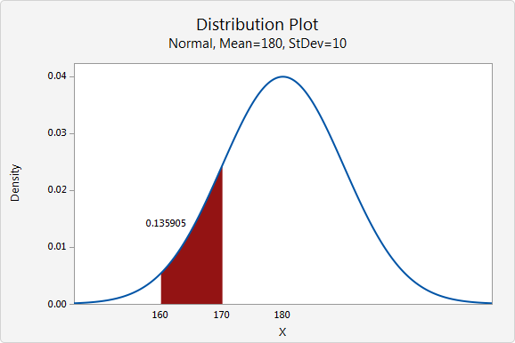
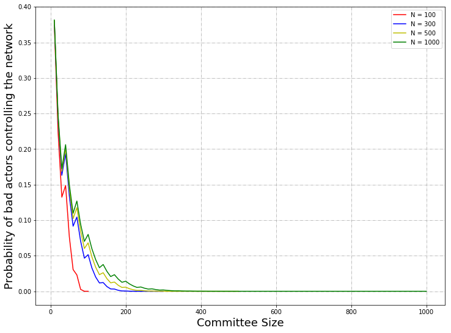

# Probabilistic Attack Vector Analysis Building Blocks

- [Introduction](#introduction)
  - [Aim](#aim)
  - [Question](#question) 
- [Literature Review](#literature-review)
  - [Tari Digital Assets Network](#tari-digital-assets-network) 
    - [Kademlia](#kademlia)
    - [Node ID](#node-id)
      - [Bootstrapping a Node](#bootstrapping-a-node)
      - [XOR Metric](#xor-metric)
  - [Types of Distribution](#types-of-distribution)
    - [Continuous Distribution](#continuous-distribution)
    - [Discrete Distribution](#discrete-distribution)
      - [Hypergeometric Distribution](#hypergeometric-distribution)
      - [Binomial Distribution](#binomial-distribution)
  - [Monte Carlo Simulations](#monte-carlo-simulations)
    - [Monte Carlo Fallacy](#monte-carlo-fallacy) 
    - [Crude Monte Carlo](#crude-monte-carlo)
    - [Law of Large Numbers](#law-of-large-numbers)
- [Methodology](#methodology)
   - [Notation Used](#notation-used)
   - [Crude Monte Carlo Simulation](#crude-monte-carlo-simulation)
     - [Programming the Simulation](#programming-the-simulation)
     - [Use of Random Numbers](#use-of-random-numbers)
     - [Computing Statistics](#computing-statistics)
   - [Statistical Calculation](#statistical-calculation)
     - [Formulae](#formulae)
     - [Distribution](#distribution)
       - [Hypergeometric Distribution](#hypergeometric-distribution)
       - [Binomial Distribution](#binomial-distribution)
       - [Summation](#summation)
     - [Explanation of Hypergeometric Distribution ](#explanation-of-hypergeometric-distribution)
- [Implementation](#implementation)
  - [Crude Monte Carlo Simulation](#crude-monte-carlo-simulation-1)
    - [Example Data](#example-data)
    - [Individual Probabilities](#individual-probabilities)
    - [Histogram and Visualization of Distribution](#histogram-and-visualization-of-distribution)
    - [Proving the Law of Large Numbers](#proving-the-law-of-large-numbers)
  - [Summary of Distribution Data](#summary-of-distribution-data)
     - [Uniform Distribution](#uniform-distribution)
     - [Hypergeometric Distribution](#hypergeometric-distribution)
     - [Poisson Distribution](#poisson-distribution)
     - [Normal Distribution](#normal-distribution)
  - [Statistical Calculation](#statistical-calculation)
  - [Probabilistic Attack Graphs](#probabilistic-attack-graphs) 
    - [Graph Variables](#graph-variables)
    - [Variation of Total Nodes](#variation-of-total-nodes)
    - [Variation of Byzantine Fault-tolerance Threshold](#variation-of-byzantine-fault-tolerance-threshold)
    - [Variation of Total Number of Nodes with Committee Size 10](#variation-of-total-number-of-nodes-with-committee-size-10)
    - [Variation of Total Number of Nodes with Committee Size 100](#variation-of-total-number-of-nodes-with-committee-size-100)
    - [Variation of Bad Nodes with Committee Size 100](#variation-of-bad-nodes-with-committee-size-100)
    - [Variation of Percentage of Bad Nodes with Committee Size 10 and 100](#variation-of-percentage-of-bad-nodes-with-committee-size-10-and-100)
- [References](#references)
- [Appendices](#appendices)
   - [Appendix A: Definitions of Terms](#appendix-a-definitions-of-terms)
- [Contributors](#contributors) 

## **Introduction**

### **Aim** 

This research aims to provide answers to questions posed about the workings of the Tari Digital Assets Network (DAN) 
environment: probabilistic attack vector with regard to the total nodes, compromised nodes, committee size and 
Byzantine Fault-tolerance (BFT) threshold. 

### **Question**

This investigation attempts to answer the following question:

*What is the percentage chance of controlling the majority of nodes in a random sample with varying quantities of the total 
number of nodes, committee size, bad nodes and BFT threshold?*

## Literature Review 

### Tari Digital Assets Network 

The Tari Digital Assets Network (DAN) forms part of the Tari second layer, where the management of all digital 
asset interactions takes place. 

These interactions are processed and validated by committees of special nodes, called Validator Nodes (VNs). Management 
of Digital Assets (DAs) involves state changes and ensures enforcement of the rules that govern assets contracts. 
Thus, all actions on this network are due to the interactions of the VNs. 
The registration of VNs occurs on the base layer. To prevent Sybil attacks, they commit collateral. If 
proved that the VN engaged in malicious behavior, the VN will lose its collateral. 

An Asset Issuer (AI) would then issue DAs and draw up a contract. The AI will dictate the size of 
the committee of VNs for a particular DA. The AI will also have the ability to nominate a trusted node to 
form part of the VN committee for the DA [[14]].

#### Kademlia

Kademlia was designed by Petar Maymounkov and David Mazières in 2002 [[16]]. It is a distributed hash table, used for 
decentralized, peer-to-peer computer networks. 

#### Node ID

A node selects an n-bit ID, given to nodes on the network. Node IDs have uniformly distributed numbers. 
A node's position is determined by a unique prefix of its ID, which forms a tree structure, with node IDs as leaves. 

The bit length of the node ID should be sufficiently large to make collisions unlikely when using a uniformly 
distributed random number generator [[15]].

##### Bootstrapping a Node

A bootstrap node is a node listed on a predetermined list, and serves as the first point of contact for a new node. The node bootstrapping process is as follows:

- To establish itself on the network without any known contacts, a node needs to contact at least one bootstrap node, 
  requesting an introduction to the network.
- A node ID is generated for the joining node.
- The new node contacts other nodes it is aware of.
- The new node sends a lookup request with its newly generated node ID.
- The contacted nodes return the nodes they know about that are closest.
- The new nodes are added to the routing table, and contacting begins.
- The process continues until the joining node is unable to locate any closer nodes.

This 
*self-lookup* has two effects:

- it allows the node to learn about nodes closer to itself; and
- it populates other nodes' 
  routing tables with the node's ID [[15]].

##### XOR Metric

The Kademlia paper, published in 2002 [[16]], contained the novel idea of using the XOR operator to determine the 
distance and therefore the arrangement of peers within the network. 

Through the XOR metric, a distance is captured. The lookup procedure allows nodes to locate other nodes, 
given a node ID [[15]].

### Types of Distribution 

When considering solving the probability of an attacker controlling the majority of nodes in the network, the various 
types of probability distributions of the specific circumstances and variables of the 
problem need to be analyzed. There are two categories of probability distribution: finite and infinite support [[1]]. Here support is 
defined as a real-valued function *f*, which is the subset of the domain containing those elements that are not mapped 
to zero. If the domain of *f* is a topological space, the support of *f* is instead defined as the smallest closed set 
containing all points not mapped to zero [[2]]. 

#### Continuous Distribution 

A continuous random variable is a random variable with an infinite and uncountable set and range of possible values [[11]].

Probabilities of continuous random variables (X) are defined as the area under the curve of its Probability Density 
Function (PDF). <sup>[def][pdf~]</sup> Therefore only ranges of values can have a nonzero probability. The probability that 
a continuous random variable equals some value is always zero [[11]].

<p align="center"></p>
The continuous normal distribution can describe the distribution of the weight of adult males. For example, you can 
calculate the probability that a man weighs between 160 pounds and 170 pounds.

#### Discrete Distribution 

Likewise, to understand the discrete distribution, a discrete random variable requires definition. A discrete random 
variable is a random variable that has countable values, such as a list of non-negative integers. A discrete distribution thus describes the probability of occurrence of each value of a discrete random variable [[11]].

With a discrete probability distribution, each possible value of the discrete random variable can be associated with a 
nonzero probability. Thus, the presentation of a discrete probability distribution is often in tabular form [[11]].

<p align="center"></p>


Examples of discrete distribution with **finite** support include the following: 

| Type of Finite Discrete Distribution | Description                                                  |
| ------------------------------------ | ------------------------------------------------------------ |
| Bernoulli Distribution               | Takes value 1 with probability $p$ and value 0 with probability $q=1-p$. |
| Rademacher Distribution              | Takes value 1 with probability $\frac{1}{2}$ and value $-1$ with probability $\frac{1}{2}$. |
| Binomial Distribution                | The number of successes in a series of independent Yes/No experiments, all with the same probability of success. |
| Beta-Binomial Distribution           | The number of successes in a series of independent Yes/No experiments with heterogeneity in the success probability. |
| Degenate Distribution                | At x0, where $X$ is certain to take the value x0. This does not look random, but it satisfies the definition of a random variable. This is useful because it puts deterministic variables and random variables in the same formalism. |
| Discrete Uniform Distribution        | Where all elements of a finite set are equally likely. This is the theoretical distribution model for a balances coin, an unbiased die, a casino roulette, or the first card of a well-shuffled deck. |
| Hypergeometric Distribution          | The number of successes in the first $m$ of a series of $n$ consecutive Yes/No experiments, if the total number of successes is known. This distribution arises where there is no replacement. |
| Poisson Binomial  Distribution       | The number of successes in a series of independent Yes/No experiments with different success probabilities. |

Examples of discrete distribution with **infinite** support include the following: 

| Type of Infinite Discrete Distribution | Description                                                  |
| -------------------------------------- | ------------------------------------------------------------ |
| Boltzmann Distribution                 | A discrete distribution important in statistical physics, which describes the probabilities of the various discrete energy levels of a system in thermal equilibrium. It has a continuous analog. |
| Geometric Distribution                 | A discrete distribution that describes the number of attempts needed to get the first success in a series of independent Bernoulli trials or, alternatively, only the number of losses before the first success (i.e. one less). |
| Negative Binomial Distribution         | Pascal distribution, a generalization of the geometric distribution of the nth success. |
| Poisson Distribution                   | A very large number of individually unlikely events that happen at a specific time interval. Related to this distribution are several other distributions: the displaced Poisson, the hyper-Poisson, the general Poisson binomial and the Poisson-type distributions. |
| Skellam Distribution                   | The distribution of the difference between two independent Poisson-distributed random variables. |
| Zeta Distribution                      | Has uses in applied statistics and statistical mechanics, and perhaps may be of interest to number theorists. It is the Zipf distribution for an infinite number of elements. |
| Zipf's Law                             | A discrete power-law distribution, the most famous example of which is the description of the frequency of words in the English language. |
| Zipf-Mandelbrot Law                    | A discrete power-law distribution, which is a generalization of the Zipf distribution. |

##### Hypergeometric Distribution

Hypergeometric distribution is a discrete probability distribution that describes the probability $T$ successes (random 
draws for which the object drawn has a specified feature) in $n$ draws, *without* replacement, from a finite population 
of size $N$ that contains exactly $m$ objects with that feature, wherein each draw is either a success or a failure [[3]]:

- A sample of size $n$ is randomly selected without replacement from a population of $N$ items.
- In the population, $T$ items can be classified as successes and $N-T$ items can be classified as failures.

Given $x, N, n​$ and $k​$, the hypergeometric probability can be computed based on the following example: 

**Example:** Suppose a population consists of $N$ items, $k$ of which are successes; and a random sample drawn from that 
population consists of $n$ items, $x$ of which are successes. Then the hypergeometric probability is [[10]]:
$$
h(m; N, n, T)= {{T}\choose{m}}{{N-T}\choose{n-m}}{{N}\choose{n}}
$$
The hypergeometric distribution has the following properties:

- The mean of the distribution is equal to $n\cdot\frac{T}{N}$
- The variance is $ n\cdot T \cdot(N-T)\cdot\frac{N-n}{N^2\cdot(N-1)}$

##### Binomial Distribution

The binomial distribution with parameters $n$ and $p$ is the discrete probability distribution of the number of 
successes in a sequence of $n$ independent experiments, each asking a yes-no question, and each with its own 
Boolean-valued outcome: success/yes/true/one (with probability $p$) or failure/no/false/zero (with probability $q=1- p$). 
A single success/failure experiment is also called a Bernoulli trial or Bernoulli experiment, and a sequence of outcomes 
is called a Bernoulli process. For a single trial, i.e. $n=1$, the binomial distribution is a Bernoulli distribution. 
The binomial distribution is the basis for the popular binomial test of statistical significance. 

The binomial distribution is frequently used to model the number of successes in a sample of size $n$ drawn with 
replacement from a population of size $N$. If the sampling is carried out without replacement, the draws are not 
independent, and so the resulting distribution is hypergeometric, not binomial. However, for $n$ much larger than 
$n$, the binomial distribution remains a good approximation and is widely used. 

Thus, in a binomial distribution, an object is selected with replacement [[4]].  A binomial experiment requires that the 
probability of success be constant on every trial. 

**Example:** You have an urn containing $10$ marbles - $5$ red and $5$ green. You randomly select $2$ marbles with replacement, and the 
probability of success would not change. It would be $\frac{5}{10}$ on every trial [[10]]. 

### Monte Carlo Simulations 

The Monte Carlo approach is a computer-based analytical method that was developed in the 1940s as part of the atomic program, by a scientist at the Los Alamos National Laboratory, who used it to 
model the random diffusion of neutrons.It was named after the city in Monaco and its many casinos. 

Monte Carlo analysis uses statistical tools to model a real-life system or process mathematically, and then estimates the probability of obtaining a successful outcome. The statistical distribution of the process to be modeled 
must be determined before the Monte Carlo simulation can be applied. 

Monte Carlo methods are widely used heuristic techniques that can solve a variety of common problems, including 
optimization and numerical integration problems. These algorithms work by cleverly sampling from distribution to 
simulate the workings of a system. Applications range from solving problems in theoretical physics to predicting trends 
in financial investments [[6]]. 

#### Monte Carlo Fallacy 

The Monte Carlo Fallacy or gambler's fallacy is the inaccurate belief that if something happens more frequently than 
normal during a given period, it will happen less often in the future. In situations where the outcome being observed is 
truly random and consists of independent trials of a random process, this belief is false. The fallacy can arise in many 
situations but is most strongly associated with gambling, where it is common among players [[13]]. 

The gambler's fallacy can be illustrated by considering the repeated toss of a fair coin. The outcomes in different 
tosses are statistically independent, and the probability of getting heads on a single toss is $\frac{1}{2}$. The 
probability of getting two heads in two tosses is $\frac{1}{4}$, and the probability of getting three heads in three 
tosses is $\frac{1}{8}$. If, after tossing four heads in a row, the next coin toss also came up heads, it would complete 
a run of five successive heads. Since the probability of a sequence of five consecutive heads is $\frac{1}{32}$, a 
person might believe that the next flip would more likely come up tails rather than heads again. This is incorrect 
and is an example of the gambler's fallacy. The events "five heads in a row" and "first four heads, then a tails" 
are equally likely, each having a probability of $\frac{1}{32}$. Since the first four tosses turn up heads, the probability 
that the next toss is a head is $\frac{1}{2}$ . While a run of five heads has a probability of $\frac{1}{32} = 0.03125$, 
the misunderstanding lies in not realizing that this is the case only before the first coin is tossed. After the first 
four tosses, the results are no longer unknown, so the probability at that point is equal to 1. The reasoning that 
it is more likely that a fifth toss is more likely to be tails because the previous four tosses were heads, with a run 
of luck in the past influencing the odds in the future, forms the basis of the fallacy [[13]].

#### Crude Monte Carlo

The Monte Carlo technique is built upon this principle: instead of evaluating an indefinite integral, which can 
sometimes be impossible, the average of the integrand is estimated, and that is used to approximate the integral. If one 
needs to be more precise, the number of samples can be increased. 

It is a widely used heuristic technique that can solve a variety of common problems including optimization and numerical 
integration problems. These algorithms work by cleverly sampling from distribution to simulate the workings of a system.  
Applications range from solving problems in theoretical physics to predicting trends in financial investments. 

#### Law of Large Numbers 

The Law of Large Numbers (LLN), in probability and statistics, states that as a sample size grows, its mean gets closer 
to the average of the whole population. In statistical analysis, the LLN can be applied to a variety of 
subjects. It may not be feasible to poll every individual within a given population to collect the required amount of 
data. However, every additional data point gathered has the potential to increase the likelihood that the outcome is an 
accurate measure of the mean [[7]]. 

The LLN is crucial because it guarantees stable, long-term results for the averages of some random event [[8]]. 

<p align="center"></p>


The preceding figure illustrates the LLN using a particular run of rolls of a single dice. As can be seen in the figure, as the number of rolls in this run increases, the average of the values of all the results approaches 3.5. While different runs would show a different shape over a small number of throws (at the left), over a large number of rolls (to the right), they would be extremely similar [[9]].


## Methodology 
Based on the understanding of the problem, statistical analysis using hypergeometric distribution was conducted.  

### Notation Used  

This section gives the general notation of statistical expressions when specifically referenced. This information 
is important pre-knowledge for the remainder of the report. 

- Let $N$ be the total number of nodes in the network *set size*. 
- Let $n$ be the committee size *sample_size*.
- Let $m$ be the number of bad actors *no_of_type_in_set*.
- Let $T​$ be the BFT threshold *type threshold*.

There is a pool with *N* nodes. The pool contains *m* malicious nodes or bad actors. From within the pool, a random 
selection of nodes, *n* is drawn. From this selection, the probability of drawing a threshold of bad actors, *T*, needs to 
be calculated.  

### Crude Monte Carlo Simulation

#### Programming the Simulation

It was initially thought that selecting a committee (n) from the total nodes (N) without replacing the selected nodes 
requires the removal of an element from the pool of total nodes when it is drawn. However, as this the program is 
calling for many selections within many experiments, this logic could not be used. 

The experiment is extended to ask the overarching question: *"What is the probability of selecting the threshold worth of* 
*bad nodes or more from a pool of total nodes?"* To this end, we perform a variable number of experiments (no_of_draws) and 
count how many times the threshold is met, in order to estimate the probability as M/n_of_draws. 

#### Use of Random Numbers  

Some problems in science and technology are described by "exact" mathematics, leading to "precise" results, e.g. 
throwing a ball and oscillating a system. Some problems appear physically uncertain, e.g. rolling a die and molecular motion. 
Random numbers can be used to mimic the uncertainty of the experiment. 

Random numbers make it possible to simulate physical systems with uncertainty, in input data or the process. 

#### Computing Statistics 

<p align="center"></p>

To describe a set of random numbers $xi$, we are often interested in two things:

- Mean value 

$$
x_{m} = \frac{1}{n}\displaystyle\sum_{j=1}^{n-1}x_j  ​
$$

- "Mean deviation" from the mean value (standard deviation)

$$
x_{s} =\sqrt{\frac{1}{n}\displaystyle\sum_{j=1}^{n-1}(x_j-x_m)^2}
$$

### Statistical Calculation

#### Formulae

As a means to derive the formulae, a single probability from the overarching question was used to distill the formula, as shown in the following example. 

**Example**: What is the probability of selecting a majority of bad nodes from a total of $5​$ nodes if the committee size is $3​$? There 
are $3​$ bad nodes $(B1, B2, B3)​$ and $2​$ good nodes $(G1, G2)​$.

The first step is to calculate the number of combinations where bad and good nodes can be chosen: 

- $(B1, B2, B3)$
- $(B1, B2, G1)$
- $(B1, B2, G2)$
- $(B1, B3, G1)$
- $(B1, B3, G2)$
- $(B1, G1, G2)$
- $(B2, B3, G1)$
- $(B2, B3, G2)$
- $(B2, G1, G2)$
- $(B3, G1, G2)$

From this list, the number of combinations where "B" is the majority can then be tallied. In this case, there are $7$
combinations where "B" is the majority. Thus, from the $10$ combinations, there are $7$ combinations where there is a 
majority of bad nodes. Therefore, the quotient of $7$ and $10$ is the probability $0.7​$. 

This method is limited in calculating the probability where the variables are large. For example if the same question was posed, 
but one had to calculate the probability of selecting a majority of bad nodes from a total of $100$ nodes, with a 
committee size of $60$, $60$ bad nodes and $40$ good nodes, the number of combinations where bad and good nodes can be 
chosen is $1.27E+28$.

#### Distribution

##### Hypergeometric Distribution

With regard to hypergeometric distribution, a committee of nodes was drawn from the total nodes without replacement, 
i.e. nodes are drawn simultaneously, the intention of the node is distinguished and not returned to the total nodes. 

Using the same example from above: 

What is the probability of drawing $3$ red cards from a standard deck of $52$ cards if you draw $5$ cards from the 
deck? There are $26$ red cards. 

- $N$ = $52​$
- $n$ = $5$
- $T$ = $3$
- $m$ = $26$

Derivation: 

- Of the $3$ bad nodes, the threshold is $2$ ${{3}\choose{2}} \therefore {{m}\choose{T}} $
- Of the $2$ good nodes, the threshold is $1$ ${{5-3}\choose{3-2}} \therefore {{N-m}\choose{n-T}}$
- Of the $5$ nodes in total, the committee size is $3$ ${{5}\choose{3}} \therefore {{N}\choose{n}}$ 

Therefore, 
$$
P = \frac{{{m}\choose{T}}\cdot{{N-m}\choose{n-T}}}{{N}\choose{n}}
$$


##### Binomial Distribution  

With regard to binomial distribution, a committee of nodes were drawn from the total nodes with replacement, i.e. nodes 
are drawn, the intention of the node is distinguished and the node is returned to the total nodes. 
$$
P = {{n}\choose{T}}\cdot\biggl(\frac{m}{n}\biggr)^{T}\cdot\biggl(\frac{N-m}{n}\biggr)^{n-T}
$$

##### Summation 

$$
P_{tot} = \sum_{i=T}^{n} P(N,m,n,i)
$$

This shows a hypergeometric distribution graph.

#### Explanation of Hypergeometric Distribution

Once the formula was mapped out, preliminary calculations could be solved using Excel. If the total number of nodes $N$ 
is fixed:

- The number of bad nodes (m) is set to 60% of N.
- The committee size (n) increases by a factor of 10 from 0 to $N$.
- The BFT threshold (T) is set to 67% of $n$.

As a recap of the question, *"What is the probability of selecting a majority of bad nodes from a total of 300 nodes if* 
*the committee size is $10​$?"* This problem considers solving for the probability where there is a **majority** of bad 
nodes in the committee. This entails calculating the probabilities from the BFT threshold to the committee size. Thus, 
there needs to be a summation of individual probabilities in order to calculate the probability for selecting the 
majority of bad nodes. 

The following table provides some insight into understanding this.

| Committee Size        | Bad Actors   | BFT Threshold   | No. of Steps   |
| :--------------:      | :----------: | :-------------: | :------------: |
| 10                    | 180          | 7               | 3              |

The number of steps is counted by considering the BFT threshold and the committee size. What is actually being asked here 
is that when $10$ nodes are selected without replacement from a total of $300$ nodes, what is the probability that out the 
$10$ nodes there will be $7$ nodes or more that are bad? Thus, probabilities need to be calculated for when there are 
$7$ bad nodes, $8$ bad nodes, $9$ bad nodes and $10$ bad nodes. 


## Implementation

### Crude Monte Carlo Simulation

#### **Example Data** 

- Total nodes = 100 
- Bad nodes = 60
- Committee size = 3
- Threshold = 2
- P_tot = 0.649474335188621  
- Therefore y = 0.649474335188621  

```Text
What is the total amount of nodes? 100
What is the amount of bad nodes? 60
How many nodes are to be drawn? 3
What is the BFT threshold within the committee? 2
What is the number of draws within an experiment? 1,000
How many experiments? 1,000
Do you know the theoretical mean? Y|N: Y
What is the theoretical mean? 0.649474335188621
```

#### Individual Probabilities 

<p align="center"></p>


#### Histogram and Visualization of Distribution 

Histogram: Divide `[0,1)` into $n_{i}$ small subintervals, generate $N$ numbers, count how many numbers fall into 
each subinterval (and divide the counts  by $N$). Plot the count variation and see if the curve is flat.  

<p align="center"></p>


| **Statistical Information ** |                   |
| ---------------------------- | ----------------- |
| Mean                         | 120,000.0         |
| Median                       | 119,991.0         |
| Mode                         | -                 |
| Standard Deviation           | 346.4313595341606 |

#### Proving the Law of Large Numbers

<p align="center"></p>
Show two graphs, one with a small number of experiments and one with a large number of experiments. 

### Summary of Distribution Data 

#### **Uniform Distribution** 

| Statistical Information |                       | Comparison with Theoretical Mean |
| ----------------------- | --------------------- | -------------------------------- |
| Slope                   | -1.87686187686188e-07 |                                  |
| Intercept               | 0.6497887492507493    | 0.649474335188621                |
| Standard Deviation      | 0.015438728229013219  |                                  |

#### **Hypergeometric Distribution** 

| Statistical Information |                      | Comparison with Theoretical Mean |
| ---------------------- | -------------------- | -------------------------------- |
| Slope                  | -8.279948279948292e-07 |                                  |
| Intercept              | 0.6495665834165834 | 0.649474335188621                |
| Standard Deviation     | 0.014812123075035204 |                                  |

#### **Poisson** Distribution

| Statistical Information |                      | Comparison with Theoretical Mean |
| ---------------------- | -------------------- | -------------------------------- |
| Slope                  | -1.411267411267412e-06 |                                  |
| Intercept              | 0.6501259280719281 | 0.649474335188621                |
| Standard Deviation     | 0.015233575444419514 |                                  |

#### **Normal Distribution**

| Statistical Information |                      | Comparison with Theoretical Mean |
| ---------------------- | -------------------- | -------------------------------- |
| Slope                  | 1.5411855411855414e-06 |                                  |
| Intercept              | 0.6482901778221778 | 0.649474335188621                |
| Standard Deviation     | 0.01507612979811762 |                                  |

### Statistical Calculation

- Certain variables that remain constant 
  - Total nodes, *N* = 100; 
  - Bad nodes, *m* = 60.
- Committee size and threshold increase as the array increases. 
- As the committee size increases, the threshold increases.  

| Total Nodes | Bad Nodes | Committee Size | Threshold | Probability        |
| ----------- | --------- | -------------- | --------- | ------------------ |
| 500         | 300       | 10             | 5         | 0.8361286749106096 |
| 500         | 300       | 20             | 10        | 0.8772521971682634 |
| 500         | 300       | 30             | 12        | 0.9097445045868039 |
| 500         | 300       | 40             | 20        | 0.9339389992360666 |
| 500         | 300       | 50             | 25        | 0.9518836452982837 |
| 500         | 300       | 60             | 30        | 0.9651848964241138 |
| 500         | 300       | 70             | 35        | 0.9750201140493069 |
| 500         | 300       | 80             | 40        | 0.98225732828804   |
| 500         | 300       | 90             | 45        | 0.9875451264650159 |
| 500         | 300       | 100            | 50        | 0.9913733032263443 |
| 500         | 300       | 110            | 55        | 0.9941140693110859 |
| 500         | 300       | 120            | 60        | 0.9960508726509922 |
| 500         | 300       | 130            | 65        | 0.9973992086727235 |
| 500         | 300       | 140            | 70        | 0.9983220920579189 |
| 500         | 300       | 150            | 75        | 0.9989418454891916 |

### Probabilistic Attack Graphs 

#### Graph Variables

- N = 500
- m = 50% of N
- T = 50% of N
- n = increases from 10 to 500 

From a plot of committee size versus the probability of bad actors controlling the network, it can be seen that:

- As the committee size increases, the probability increases. 
- Thus, the greater the sample size, the greater the chance of bad nodes in the set being drawn. 

<p align="center"></p>


#### **Variation of Total Nodes**

From a plot of committee size versus probability with a change in $N​$, the total number of nodes, it can be seen that:

<p align="center"></p>


#### **Variation of Byzantine Fault-tolerance Threshold**

<p align="center"></p>
From a plot of committee size versus probability where the number of nodes remains at 500 with a change in $T​$, the BFT 
threshold, ranging from 50% to 67%, it can be seen that: 

- When the BFT threshold is 50%, the probability is lower when the committee size is small; the probability increases 
when the committee size increases, and eventually tends to one.
- When the BFT threshold is 55%, the probability is lower when the committee size is small; the probability increases 
when the committee size increases, and eventually tends to one. 
- A similar trend is followed for the cases where the BFT threshold is 50% and 55%.
- The probability is higher for the case where the BFT threshold is 50% than when the probability is 55%. 
- When the BFT threshold is 60%, the probability decreases from 0.63 to approximately 0.53, where it remains constant. 
- When the BFT threshold is 65%, the probability decreases from 0.38 and tends to zero. 
- When the BFT threshold is 67%, the probability decreases from 0.38 and tends to zero. 
- A similar trend is followed for the cases where the BFT threshold is 65% and 67%. 

#### **Variation of Total Number of Nodes with Committee Size 10**

<p align="center"></p>


#### **Variation of Total Number of Nodes with Committee Size 100**

<p align="center"></p>


#### **Variation of Bad Nodes with Committee Size 100**


<p align="center"></p>


#### **Variation of Percentage of Bad Nodes with Committee Size 10 and 100**

<p align="center"></p>


## References

[[1]] Wikipedia, “List of Probability Distributions” [online]. Available: <https://en.wikipedia.org/wiki/List_of_probability_distributions>. 
Date accessed: 2019&#8209;05&#8209;13.

[1]: https://en.wikipedia.org/wiki/List_of_probability_distributions
"List of Probability Distributions"

[[2]] Wikipedia, “Support (Mathematics)" [online]. Available: <https://en.wikipedia.org/wiki/Support_(mathematics)>. 
Date accessed: 2019&#8209;05&#8209;13.

[2]: https://en.wikipedia.org/wiki/Support_(mathematics)
"Support (Mathematics)"

[[3]] Wikipedia, “Hypergeometric Distribution” [online]. Available: <https://en.wikipedia.org/wiki/Hypergeometric_distribution>. 
Date accessed: 2019&#8209;05&#8209;13.

[3]: https://en.wikipedia.org/wiki/Hypergeometric_distribution
"Hypergeometric Distribution"

[[4]] Wikipedia, “Binomial Distribution" [online]. Available: <https://en.wikipedia.org/wiki/Binomial_distribution>. 
Date accessed: 2019&#8209;05&#8209;13.

[4]: https://en.wikipedia.org/wiki/Binomial_distribution
"Binomial Distribution"

[[5]] POA Network Team, "POA Network: Honey Badger BFT and Threshold Cryptography" [online]. Available: 
<https://medium.com/poa-network/poa-network-honey-badger-bft-and-threshold-cryptography-c43e10fadd87>. 
Date accessed: 2019&#8209;06&#8209;28.

[5]: https://medium.com/poa-network/poa-network-honey-badger-bft-and-threshold-cryptography-c43e10fadd87
"POA Network: HoneyBadger BFT and Threshold Cryptography"

[[6]] P. Hanbury, "Monte Carlo Simulations with Python (Part 1)" [online]. Available: 
<https://towardsdatascience.com/monte-carlo-simulations-with-python-part-1-f5627b7d60b0>. Date accessed: 2019&#8209;06&#8209;28.

[6]:  https://towardsdatascience.com/monte-carlo-simulations-with-python-part-1-f5627b7d60b0
"Monte Carlo Simulations with Python (Part 1)"

[[7]] W. Kenton, "Law of Large Numbers" [online]. Available: <https://www.investopedia.com/terms/l/lawoflargenumbers.asp>. 
Date accessed: 2019&#8209;06&#8209;28.

[7]: https://www.investopedia.com/terms/l/lawoflargenumbers.asp
"Investopedia: Law of Large Numbers"

[[8]] Wikipedia, "Law of Large Numbers" [online]. Available: <https://en.wikipedia.org/wiki/Law_of_large_numbers>. 
Date accessed: 2019&#8209;06&#8209;28.

[8]: https://en.wikipedia.org/wiki/Law_of_large_numbers
"Law of Large Numbers"

[[9]] Wikipedia, "Law of Large Numbers - Average Dice Roll by Number of Rolls" [online]. 
Available: <https://commons.wikimedia.org/w/index.php?curid=58536069>. Date accessed: 2019&#8209;06&#8209;28.

[9]: https://commons.wikimedia.org/w/index.php?curid=58536069
"Law of Large Numbers - Average Dice Roll by Number of Rolls"

[[10]] Stat Trek, "Hypergeometric Distribution" [online]. Available: <https://stattrek.com/probability-distributions/hypergeometric.aspx>. 
Date accessed: 2019&#8209;06&#8209;28.

[10]: https://stattrek.com/probability-distributions/hypergeometric.aspx
"Hypergeometric Distribution" 

[[11]] Minitab Express Support, "Continuous and Discrete Probability Distributions" [online]. Available: 
<https://support.minitab.com/en-us/minitab-express/1/help-and-how-to/basic-statistics/probability-distributions/supporting-topics/basics/continuous-and-discrete-probability-distributions/>. 
Date accessed: 2019&#8209;07&#8209;18.

[11]: https://support.minitab.com/en-us/minitab-express/1/help-and-how-to/basic-statistics/probability-distributions/supporting-topics/basics/continuous-and-discrete-probability-distributions/
"Continuous and Discrete Probability Distributions" 

[[12]] Wikipedia, "Probability Density Function" [online]. Available: <https://en.wikipedia.org/wiki/Probability_density_function>. 
Date accessed: 2019&#8209;07&#8209;18.

[12]: https://en.wikipedia.org/wiki/Probability_density_function
"Probability Density Function" 

[[13]] Wikipedia, "Gambler's Fallacy" [online]. Available: <https://en.wikipedia.org/wiki/Gambler%27s_fallacy>. Date 
accessed: 2019&#8209;07&#8209;18.

[13]: https://en.wikipedia.org/wiki/Gambler%27s_fallacy
"Gambler's Fallacy" 

[[14]] C. Sharrock and P. Robinson, "Digital Assets Network" [online]. Available: <https://rfc.tari.com/RFC-0300_DAN.html>. 
Date accessed: 2019&#8209;07&#8209;18.

[14]: https://rfc.tari.com/RFC-0300_DAN.html
"Tari RFC - Digital Assets Network" 

[[15]] S. Bondi, "Distributed Hash Tables" [online]. Available: <https://tlu.tarilabs.com/protocols/dht/MainReport.html>. 
Date accessed: 2019&#8209;07&#8209;18.

[15]: https://tlu.tarilabs.com/protocols/dht/MainReport.html
"Distributed Hash Tables" 

[[16]] P. Maymounkov and D. Mazières, "Kademlia: A Peer-to-peer Information System Based on the XOR Metric" [online]. 
Available: <https://pdos.csail.mit.edu/~petar/papers/maymounkov-kademlia-lncs.pdf>. Date accessed: 2019‑07‑18.

[16]: "Kademlia'

## Appendices

### Appendix A: Definitions of Terms 

Definitions of terms presented here are high level and general in nature. Full statistical definitions are available 
in the cited references. 

- **Probability Density Function (PDF):**<a name="pdf"> </a> A statistical expression that defines a probability distribution 
for a continuous random variable instead of a discrete random variable ([[11]], [[12]]).

[pdf~]: #pdf
" A statistical expression that 
defines a..." 


## Contributors

- <https://github.com/kevoulee>
- <https://github.com/anselld>
