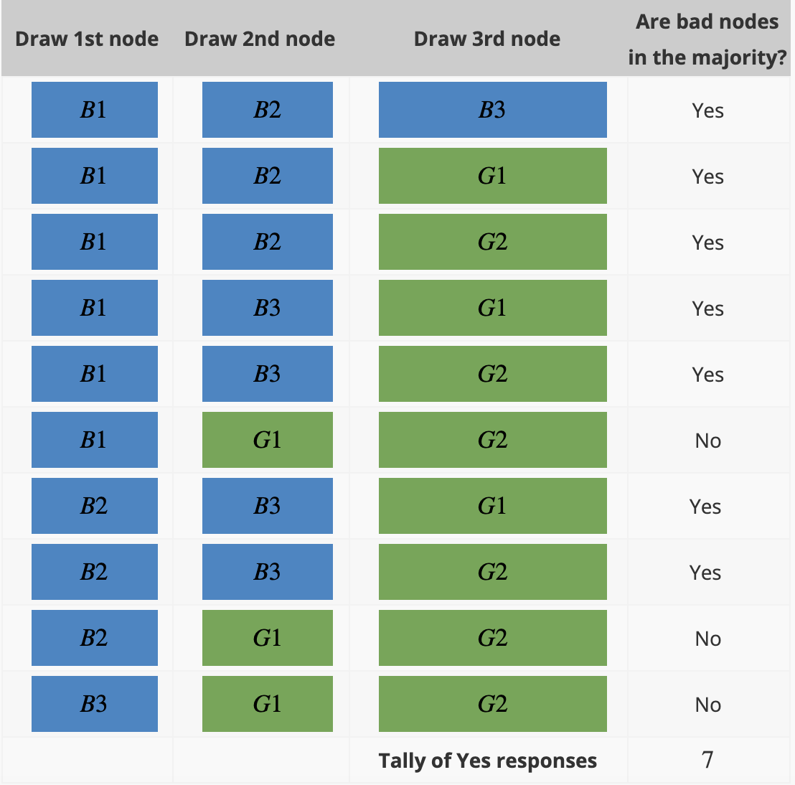
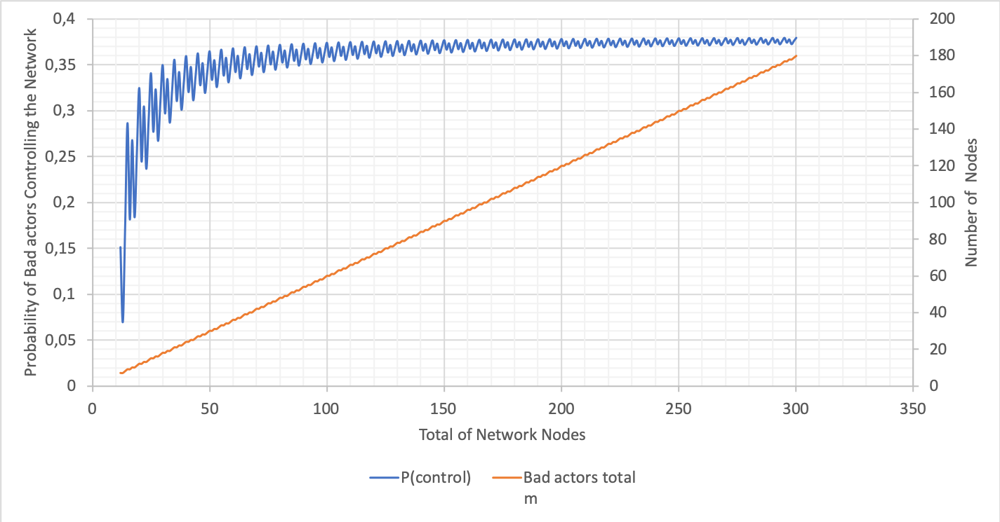

# Probability of a Byzantine Takeover of the Digital Assets Network

- Introduction
- Notation Used
- Statistical Calculations
- Calculations and Analysis
- Conclusions and Remarks

[See full report here](./byzantine_takeover_of_the_DAN.html).

---

## Introduction

The investigation attempts to answer the following question:

*What is the percentage chance of controlling the majority of nodes in a random sample with varying quantities of the total number of nodes, committee size, bad nodes and BFT threshold?*

<!-- Note:

This investigation aims to provide answers to questions posed about the workings of the Tari Digital Assets Network (DAN)
environment. It covers probabilistic attack vector with regard to the total nodes, compromised nodes, committee size and
Byzantine Fault-tolerance (BFT) threshold. -->

---

## Notation Used

General notation of statistical expressions.

- Let $N$ be the total number of nodes in the network.
- Let $n$ be the committee size.
- Let $m$ be the number of bad actors.
- Let $T$ be the Byzantine Fault Tolerance (BFT) threshold.

<!-- Note:

There is a pool with $N$ nodes. The pool contains $m$ malicious nodes or bad actors. From within the pool, a random
selection of nodes, $n$ is drawn. From this selection, the probability of drawing a threshold of bad actors, $T$, needs to
be calculated. -->

---

## Statistical Calculation

A single probability from the overarching question was used as a means to derive the formulae, as shown in the following example.

**Example**: What is the probability of selecting a majority of bad nodes from a total of $5$ nodes if the committee size is $3$? There are $3$ bad nodes $(B1, B2, B3)$ and $2$ good nodes $(G1, G2)$.

The first step is to calculate the number of combinations where bad and good nodes can be chosen:

---

<!-- Note:

From this list:
- The number of combinations where $B$ is the majority can then be tallied.
- There are $7$ combinations where $B$ is the majority.
- Thus, from the $10$ combinations, there are $7$ combinations where there is a
majority of bad nodes.
- Therefore, the quotient of $7$ and $10$ is the probability $0.7$.

This method is limited in calculating the probability where the variables are large. For example, if the same question
was posed, but one had to calculate the probability of selecting a majority of bad nodes from a total of $100$ nodes, with a
committee size of $60$, $60$ bad nodes and $40$ good nodes, the number of combinations where bad and good nodes can be
chosen is $1.27E+28$. -->

---

### Binomial Distribution Formula

With regard to binomial distribution, a committee of nodes is drawn from the total nodes with replacement, i.e. nodes
are drawn, the intention of the node is distinguished and the node is returned to the total nodes.

$$
P = {{n}\choose{T}}\cdot\biggl(\frac{m}{n}\biggr)^{T}\cdot\biggl(\frac{N-m}{n}\biggr)^{n-T}
$$

---

### Hypergeometric Distribution Formula

With regard to hypergeometric distribution, a committee of nodes is drawn from the total nodes without replacement,
i.e. nodes are drawn simultaneously, the intention of the node is distinguished and not returned to the total nodes.
This closely mimics the events that would take place within the network.

$$
P = \frac{{{m}\choose{T}}\cdot{{N-m}\choose{n-T}}}{{N}\choose{n}}
$$

---

### Summation Formula

Referring to Example earlier, the **tally** is the sum of all the combinations where the bad nodes are in a majority.

$$
P_{tot} = \sum_{i=T}^{n} P(N,m,n,i)
$$

<!-- Note:

As a recap to the question, *what is the probability of selecting a majority of bad nodes from a total of $100$ nodes
if the committee size is $10$*? This problem considers solving for the probability where there is a **majority** of bad
nodes in the committee. This entails calculating the probabilities from the BFT threshold to the committee size. Thus,
there needs to be a summation of individual probabilities in order to calculate the probability of selecting the
majority of bad nodes. -->

---

The following table provides some visual insight into understanding this:

| Committee Size | BFT Threshold | No. of Steps |
| :------------------------------------: | :-----------------------------------: | :----------------------------------: |
|                   10                   |                   7                   |                  3                   |

---

# Calculations and Analysis

Literature about BFT threshold advises the number of good nodes to be at least $\frac{2}{3} \cdot n+1$, where $n$ is the number of nodes. In the calculations that follow, BFT threshold of, for example, $67$% of N, is implemented with rounding up to ensure that at least that fraction is obtained. In this sense, $67$% of N simulates $\frac{2}{3} \cdot n+1$.

---

#### Variation of Total Nodes

The variables:

- N (total number of nodes in the network) = $100, 300, 500, 1000$
- m (number of bad actors) = $60$% of N
- T (BFT threshold) = $67$% of N
- n (committee size) = ranging from $1$ to $1,000$

---

| Total Nodes | Bad Nodes | Committee Size | BFT Threshold | Probability            |
| :---------------------------------: | :-------------------------------: | :------------------------------------: | :-----------------------------------: | ---------------------------------------------- |
|                 100                 |                60                 |                   2                    |                   2                   | 0.3575757575757576                             |
|                 100                 |                60                 |                   4                    |                   3                   | 0.47343240951488375                            |
|                 100                 |                60                 |                   6                    |                   4                   | 0.5443381851334722                             |
|                 100                 |                60                 |                   8                    |                   6                   | 0.30661160770090995                            |
|                 100                 |                60                 |                   10                   |                   7                   | 0.37423758246308586                            |
|                 100                 |                60                 |                   12                   |                   8                   | 0.4320215340178938                             |
|                 100                 |                60                 |                   14                   |                  10                   | 0.2623321970180976                             |

---

<!-- Note:

From a plot of committee size versus probability with a change in $N$, the total number of nodes, it can be seen that
the probability is lower with respect to the committee size when $N$ is smaller. -->

---

#### Variation of Byzantine Fault-tolerance Threshold

The variables:

  - N (total number of nodes in the network) = $100$
  - m (number of bad actors) = $60$% of N
  - T (BFT threshold) = $50$%, $55$%, $60$%, $67$% of N
  - n (committee size) = ranging from $1$ to $100$

---

<!-- Note:

From a plot
of committee size versus probability where the number of nodes remains at 100 with a change in T, the BFT
threshold, ranging from 50% to 67%, it can be seen that when the BFT threshold is 50% and 55%, the probability
is low when the committee size is small; as the committee size increases, the probability increases, and tends to 1.
The probability is intitially higher for the case where the BFT threshold is $50% than when the probability is 55%.

When the BFT threshold is $60$%, the probability decreases from $0.63$ to approximately $0.59$, where it remains constant and then dramatically increases.

When the BFT threshold is $65$% and $67$%, the probability decreases from $0.38$ and tends to zero. This confirms the
BFT threshold of $\frac{2}{3} \cdot n+1$ as per literature. -->

---

#### Variation of Total Number of Nodes with Committee Size 10

The variables:

- N (total number of nodes in the network) = ranging from $10$ to $350$
- m (number of bad actors) = $60$% of N
- T (BFT threshold) = $67$% of N
- n (committee size) = $10$

---

<!-- Note:

For the
graph showing varying probabilities with respect to the total number of network nodes, where the committee size is $10$,
the probability dramatically increases when the total nodes is $3$ times more than the committee size and onwards. The
probability plateaus at $0.35$. -->

---

#### Variation of Total Number of Nodes with Committee Size 100

The variables:

- N (total number of nodes in the network) = ranging from $100$ to $1,300$
- m (number of bad actors) = $60$% of N
- T (BFT threshold) = $67$% of N
- n (committee size) = $100$

---

<!-- Note:

From this and the previous graph, it can be seen that probabilities are significantly lower when the committee size is
$100$ compared to when it is $10$. There is an increase in probability up to a network size of $700$, albeit, not as steep as the
change when the committee size is $10$. The probability plateaus at $0.08$. The larger the committee size, the fewer dramatic changes there are in the probability. -->

---

#### Variation of Bad Nodes with Committee Size 10 and 100

The variables:

- N (total number of nodes in the network) = ranging from $10$ and $100$ to $50,000$
- m (number of bad actors) = $10$%, $20$%, $30$%, $40$%, $50$%, $60$%, $70$%, $80$% and $90$% of N
- T (BFT threshold) = $67$% of N
- n (committee size) = $10$ and $100$

---

---

---

---

<!-- Note:

These
graphs show varying probabilities when the percentage of bad nodes is $20$, $40$, $60$ and $90$. The value when the
probability plateaus is used to construct the following graph for both committee sizes $10$ and $100$. -->

---

<!-- Note:

The
graph shows changes in the probability due to changes in percentage of bad nodes when the committee size is $10$ and $100$.  When
the committee size is $10$, there is a change in probability when the bad node percentage is between $30$ and $80$.
When the committee size is $100$, there is a steep increase in the probability when the bad node percentage is between
$50$ and $80$. When the committee size is $100$, the probability remains lower as the bad node percentage increases and
has a steeper gradient when the change in probability occurs. Whereas, when the committee size is $10$, the probability
begins to increase at a lower percentage of bad nodes. -->

---

## Conclusions and Remarks

- Total nodes in the network: The smaller the pool of total nodes in the network, the lower the probability of bad actors controlling the network. However, the probability difference is near negligible if the committee size is large.  This parameter will also be difficult to control, and the network will be ever-increasing. This can be seen in the graph in [Variation of Total Nodes](#11).
- BFT threshold: This threshold should be at least  $\frac{2}{3} \cdot n+1$ as per literature. This can be seen in the graph in [Variation of Byzantine Fault-tolerance Threshold](#15).
- Committee size: The larger the committee size, the lower the probability of bad actors controlling the network. This can be seen in the graph in [Variation of Total Number of Nodes with Committee Size 10](#17) and [Variation of Total Number of Nodes with Committee Size 100](#19).
- Bad nodes: While this variable cannot be controlled, the probability of bad actors controlling the network can remain low, as the percentage of bad nodes increases if the committee size is approximately $100$ or larger. This can be seen in the graphs in [Variation of Bad Nodes with Committee Size 10 and 100](#19).

