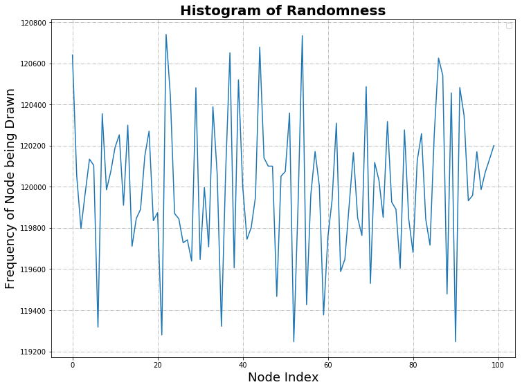
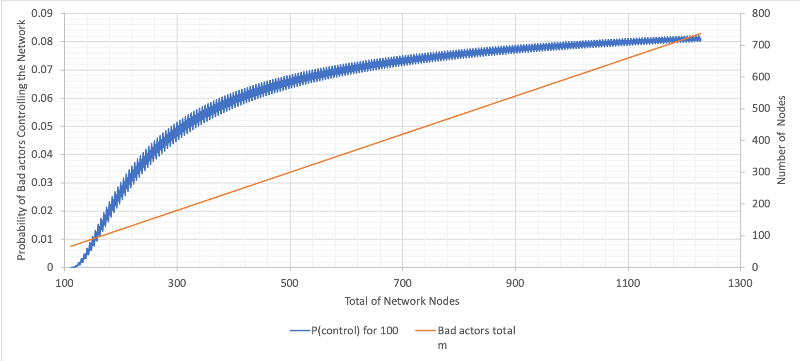

<style>
        div.highlight {
            width: 95%; 
            word-wrap: break-word;
            background: #EA9999;
            font-size: 1.0em;
            padding: 0.5em;
            color: #000000;
            }
        </style>

# Probability of a Byzantine Takeover of the DAN

- [Introduction](#introduction)
- [Tari Digital Assets Network](#tari-digital-assets-network) 
  - [Kademlia](#kademlia)
  - [Node ID](#node-id)
    - [Bootstrapping a Node](#bootstrapping-a-node)
    - [XOR Metric](#xor-metric)
- [Implementation](#implementation)
  - [Crude Monte Carlo Simulation](#crude-monte-carlo-simulation)
    - [Proving the Law of Large Numbers](#proving-the-law-of-large-numbers)
    - [Individual Probabilities](#individual-probabilities)
    - [Histogram and Visualization of Distribution](#histogram-and-visualization-of-distribution)
  - [Statistical Calculation](#statistical-calculation)
     - [Variation of Total Nodes](#variation-of-total-nodes)
     - [Variation of Byzantine Fault Tolerance Threshold](#variation-of-byzantine-fault-tolerance-threshold)
     - [Variation of Total Number of Nodes with Committee Size 10](#variation-of-total-number-of-nodes-with-committee-size-10)
     - [Variation of Total Number of Nodes with Committee Size 100](#variation-of-total-number-of-nodes-with-committee-size-100)
     - [Variation of Bad Nodes with Committee Size 10 and 100](#variation-of-bad-nodes-with-committee-size-10-and-100)
- [Conclusions and Remarks](#conclusions-and-remarks)
- [References](#references)
- [Appendices](#appendices)
  -  [Appendix A: Definitions of Terms](#appendix-a-definitions-of-terms)
- [Contributors](#contributors) 

## Introduction 

This research aims to provide answers to questions posed about the workings of the Tari Digital Assets Network (DAN) 
environment: probabilistic attack vector with regard to the total nodes, compromised nodes, committee size and 
Byzantine Fault-tolerance (BFT) threshold. 

This investigation attempts to answer the following question:
*What is the percentage chance of controlling the majority of nodes in a random sample with varying quantities of the total 
number of nodes, committee size, bad nodes and BFT threshold?*

## Tari Digital Assets Network

The Tari Digital Assets Network (DAN) forms part of the Tari second layer, where the management of all digital 
asset interactions takes place. 

These interactions are processed and validated by committees of special nodes, called Validator Nodes<sup>[def][vn~]</sup> (VNs). Management 
of Digital Assets (DAs) involves state changes and ensures enforcement of the rules that govern assets contracts. 
Thus, all actions on this network are due to the interactions of the VNs. 
The registration of VNs occurs on the base layer. To prevent Sybil attacks, they commit collateral. If 
proved that the VN engaged in malicious behavior, the VN will lose its collateral. 

An Asset Issuer <sup>[def][ai~]</sup> (AI) would then issue DAs and draw up a contract. The AI will dictate the size of 
the committee of VNs for a particular DA. The AI will also have the ability to nominate a trusted node to 
form part of the VN committee for the DA [[1]].

### Kademlia

Kademlia was designed by Petar Maymounkov and David Mazières in 2002 [[2]]. It is a distributed hash table, used for 
decentralized, peer-to-peer computer networks. 

### Node ID

A node selects an $n$-bit ID, given to nodes on the network. Node IDs have uniformly distributed numbers. 
A node's position is determined by a unique prefix of its ID, which forms a tree structure, with node IDs as leaves. 

The bit length of the node ID should be sufficiently large to make collisions unlikely when using a uniformly 
distributed random number generator [[3]].

#### Bootstrapping a Node 

A bootstrap node is a node listed on a predetermined list, and serves as the first point of contact for a new node. The 
node bootstrapping process is as follows:

- To establish itself on the network without any known contacts, a node needs to contact at least one bootstrap node, 
  requesting an introduction to the network.
- A node ID is generated for the joining node.
- The new node contacts other nodes it is aware of.
- The new node sends a lookup request with its newly generated node ID.
- The contacted nodes return the nodes they know about that are closest.
- The new nodes are added to the routing table, and contacting begins.
- The process continues until the joining node is unable to locate any closer nodes.

This 
*self-lookup* has two effects:

- it allows the node to learn about nodes closer to itself; and
- it populates other nodes' 
  routing tables with the node's ID [[3]].

#### XOR Metric

The Kademlia paper, published in 2002 [[2]], contained the novel idea of using the XOR operator to determine the 
distance and therefore the arrangement of peers within the network. 

Through the XOR metric, a distance is captured. The lookup procedure allows nodes to locate other nodes, 
given a node ID [[3]].

## Implementation

The following calculations were done using the [Tari Labs Modelling Repository]((https://github.com/tari-labs/modelling)). 

### Crude Monte Carlo Simulation

#### Proving the Law of Large Numbers

With the Crude Monte Carlo technique, to gain precision, the number of samples can be increased. Thus, before 
calculating the probability and drawing comparisons, the sample size, number of draws within an experiment, and the 
number of experiments can be varied to find an optimal amount. 

Below is the input data inserted into the [python programme](https://github.com/tari-labs/modelling/blob/master/scenarios/crude_monte_carlo_simulation.py) with dependencies [network setup](https://github.com/tari-labs/modelling/blob/master/utils/network_setup.py) and [random distribution](https://github.com/tari-labs/modelling/blob/master/utils/rand_dist.py), where the number of draws within an experiment is $10$, and the number of experiments is $10$ :

```Text
What is the total amount of nodes? 100
What is the amount of bad nodes? 60
How many nodes are to be drawn? 3
What is the BFT threshold within the committee? 2
What is the number of draws within an experiment? 10
How many experiments? 10
Do you know the theoretical mean? Y|N: Y
What is the theoretical mean? 0.649474335188621
```


<p align="center"></p>

Below is the input data inserted into the python programme, where the number of draws within an experiment is $1,000$, 
and the number of experiments is $1,000$ :

```Text
What is the total amount of nodes? 100
What is the amount of bad nodes? 60
How many nodes are to be drawn? 3
What is the BFT threshold within the committee? 2
What is the number of draws within an experiment? 1,000
How many experiments? 1,000
Do you know the theoretical mean? Y|N: Y
What is the theoretical mean? 0.649474335188621
```

<p align="center"></p>

In each graph, the cumulative probabilities calculated for normal, uniform, Poisson and hypergeometric distribution are 
plotted against the number of experiments. The bold blue line represents the mean calculated from theoretical data. 

From the graph where the experiments and draws are equal to $10$ there is weak convergence. While the graph where the 
experiments and draws are equal to $1,000$ the  Law of Large Numbers is proved, as the sample size grows, convergence 
with the statistical mean is achieved. 

#### Individual Probabilities 

The graph below highlights the varying probabilities of each experiment conducted for the hypergeometric distribution. 
The mean of which provides us with the average of the probabilities, which can then be compared to the calculated 
theoretical mean. 

From a comparison of the mean probability of each distribution with the theoretical mean, it can be seen that the 
distribution type that closely mimics the theoretical result is hypergeometric. 

Hypergeometric distribution is where there is no replacement, i.e., nodes are drawn simultaneously, distinguished and 
not returned to the total nodes pool. 

<p align="center"></p>

##### Uniform Distribution

| Statistical Information |                      | Comparison with <br />Theoretical Mean | &nbsp;&nbsp;Difference  Calculated |
| ----------------------- | -------------------- | -------------------------------------- | ---------------------------------- |
| Intercept               | 0.6497887492507493   | 0.649474335188621                      | 3.14414E-4                         |
| Standard Deviation      | 0.015438728229013219 |                                        |                                    |

##### Hypergeometric Distribution

| Statistical Information |                      | Comparison with <br />Theoretical Mean | &nbsp;&nbsp;Difference Calculated |
| ----------------------- | -------------------- | -------------------------------------- | --------------------------------- |
| Intercept               | 0.6495665834165834   | 0.649474335188621                      | 9.22482E-5                        |
| Standard Deviation      | 0.014812123075035204 |                                        |                                   |

##### Poisson Distribution

| Statistical Information |                      | Comparison with <br />Theoretical Mean | &nbsp;&nbsp;Difference Calculated |
| ----------------------- | -------------------- | -------------------------------------- | --------------------------------- |
| Intercept               | 0.6501259280719281   | 0.649474335188621                      | 6.51592E-4                        |
| Standard Deviation      | 0.015233575444419514 |                                        |                                   |

##### Normal Distribution

| Statistical Information |                     | Comparison with <br />Theoretical Mean | &nbsp;&nbsp;Difference Calculated |
| ----------------------- | ------------------- | -------------------------------------- | --------------------------------- |
| Intercept               | 0.6482901778221778  | 0.649474335188621                      | 1.18416E-3                        |
| Standard Deviation      | 0.01507612979811762 |                                        |                                   |

#### Histogram and Visualization of Distribution 

The histogram of randomness highlights the distribution of good and bad nodes selected in each experiment, highlighting 
the random nature of the experiment. 

<p align="center"></p>

| Statistical Information |                   |
| ----------------------- | ----------------- |
| Mean                    | 120,000.0         |
| Median                  | 119,991.0         |
| Mode                    | -                 |
| Standard Deviation      | 346.4313595341606 |

### Statistical Calculation

Literature about [BFT threshold](../../consensus-mechanisms/BFT-consensus-mechanisms-applications/MainReport.md) advises 
the number of good nodes to be at least $\frac{2}{3} \cdot n+1$, where $n$ is the number of nodes. In the calculations 
that follow, BFT threshold of for example $67$% of N, is implemented with rounding up to ensure that at least that 
fraction is obtained. I this sense $67$% of N simulates $\frac{2}{3} \cdot n+1$.

#### Variation of Total Nodes

##### Variables

- N (total number of nodes in the network) = $100, 300, 500, 1000$
- m (number of bad actors) = $60$% of N
- T (BFT threshold) = $67$% of N
- n (committee size) = ranging from $1$ to $1000$ 

The above graph was calculated using Python ([variations of N](https://github.com/tari-labs/modelling/blob/master/scenarios/N_variations.py) with dependencies [hypergeometric distribution](https://github.com/tari-labs/modelling/blob/master/utils/hyper_dist_prob.py)). Below is a sample of the data where the total nodes are $100$. The highlighted data was previously used in the Crude Monte Carlo Simulation when supplying the theoretical mean.

| &nbsp;&nbsp;Total Nodes&nbsp;&nbsp; | &nbsp;&nbsp;Bad Nodes&nbsp;&nbsp; | &nbsp;&nbsp;Committee Size&nbsp;&nbsp; | &nbsp;&nbsp;BFT Threshold&nbsp;&nbsp; | &nbsp;&nbsp;Probability&nbsp;&nbsp;            |
| :---------------------------------: | :-------------------------------: | :------------------------------------: | :-----------------------------------: | ---------------------------------------------- |
|                 100                 |                60                 |                   1                    |                   1                   | 0.6                                            |
|                 100                 |                60                 |                   2                    |                   2                   | 0.3575757575757576                             |
|  <div class="highlight">100</div>   |  <div class="highlight">60</div>  |     <div class="highlight">3</div>     |    <div class="highlight">2</div>     | <div class="highlight">0.649474335188621</div> |
|                 100                 |                60                 |                   4                    |                   3                   | 0.47343240951488375                            |
|                 100                 |                60                 |                   5                    |                   4                   | 0.33162085827770661                            |
|                 100                 |                60                 |                   6                    |                   4                   | 0.5443381851334722                             |
|                 100                 |                60                 |                   7                    |                   5                   | 0.4153500188485931                             |
|                 100                 |                60                 |                   8                    |                   6                   | 0.30661160770090995                            |
|                 100                 |                60                 |                   9                    |                   6                   | 0.47996269793634677                            |
|                 100                 |                60                 |                   10                   |                   7                   | 0.37423758246308586                            |
|                 100                 |                60                 |                   11                   |                   8                   | 0.28361605491457653                            |
|                 100                 |                60                 |                   12                   |                   8                   | 0.4320215340178938                             |
|                 100                 |                60                 |                   13                   |                   9                   | 0.3409545354772218                             |
|                 100                 |                60                 |                   14                   |                  10                   | 0.2623321970180976                             |
|                 100                 |                60                 |                   15                   |                  10                   | 0.39288184738975973                            |


<p align="center"></p>

From a plot of committee size versus probability with a change in $N$, the total number of nodes, it can be seen that 
the probability is lower with respect to the committee size when $N$ is smaller. 

#### Variation of Byzantine Fault-Tolerance Threshold

##### Variables

  - N (total number of nodes in the network) = $100$
  - m (number of bad actors) = $60$% of N
  - T (BFT threshold) = $50$%, $55$%, $60$%, $67$% of N
  - n (committee size) = ranging from $1$ to $100$ 

<p align="center"></p>

The above graph was calculated using Python 
([variations of BFT](https://github.com/tari-labs/modelling/blob/master/scenarios/T_variations.py) with dependencies 
[hypergeometric distribution](https://github.com/tari-labs/modelling/blob/master/utils/hyper_dist_prob.py)). From a plot 
of committee size versus probability where the number of nodes remains at $100$ with a change in $T$, the BFT 
threshold, ranging from $50$% to $67$%, it can be seen that: When the BFT threshold is $50$% and $55$% the probability 
is low when the committee size is small; as the committee size increases, the probability increases, and tends to one. 
The probability is higher for the case where the BFT threshold is $50$% than when the probability is $55$%. 

When the BFT threshold is $60$%, the probability decreases from $0.63$ to approximately $0.59$, where it remains constant. 

When the BFT threshold is $65$% and $67$%, the probability decreases from $0.38$ and tends to zero. This confirms the 
BFT threshold of $\frac{2}{3} \cdot n+1$ as per literature.

#### Variation of Total Number of Nodes with Committee Size 10

##### Variables

- N (total number of nodes in the network) = ranging from $10$ to $350$
- m (number of bad actors) = $60$% of N
- T (BFT threshold) = $67$% of N
- n (committee size) = $10$

<p align="center"></p>

The above graph was calculated using Excel 
([variations of N with n fixed](https://github.com/tari-labs/modelling/blob/master/scenarios/variation_of_N_n_fixed.xlsx)). For the 
graph showing varying probabilities with respect to the total number of network nodes, where the committee size is $10$, 
the probability dramatically increases when the total nodes is three times more than the committee size and onwards. The 
probability plateaus at $0.35$. 

#### Variation of Total Number of Nodes with Committee Size 100

##### Variables

- N (total number of nodes in the network) = ranging from $100$ to $1300$
- m (number of bad actors) = $60$% of N
- T (BFT threshold) = $67$% of N
- n (committee size) = $100$

<p align="center"></p>

The above graph was calculated using Excel 
([variations of N with n fixed](https://github.com/tari-labs/modelling/blob/master/scenarios/variation_of_N_n_fixed.xlsx)). 
From this and the previous graph, it can be seen that probabilities are significantly lower when the committee size is 
$100$ compared to $10$. There is an increase in probability up to a network size of $700$, albeit, not as steep as the 
change when the committee size is $10$.  The probability plateaus at $0.08$.

The larger the committee size, the less dramatic changes there are in the probability. 

#### Variation of Bad Nodes with Committee Size 10 and 100

##### Variables

- N (total number of nodes in the network) = ranging from $10$ and $100$ to $50,000$
- m (number of bad actors) = $10$%, $20$%, $30$%, $40$%, $50$%, $60$%, $70$%, $80$% and $90$% of N
- T (BFT threshold) = $67$% of N
- n (committee size) = $10$ and $100$

<p align="center"></p>

<p align="center"></p>

<p align="center"></p>

<p align="center"></p>

The above graphs were calculated using Excel 
([bad node variation where n is 100](https://github.com/tari-labs/modelling/blob/master/scenarios/bad_node_variation_10_10.xlsx)). These 
graphs show varying probabilities when the percentage of bad nodes is $20$, $40$, $60$ and $90$. The value when the 
probability plateaus is used to construct the graph below for both committee sizes $10$ and $100$. 

<p align="center"></p>

The above graph was calculated using Excel 
([bad node percentage at 10 and 100](https://github.com/tari-labs/modelling/blob/master/scenarios/bad_node_percentage_10_100.xlsx)). The 
graph shows changes in the probability due to changes in % of bad nodes when the committee size is $10$ and $100$.  When 
the committee size is $10$, there is a change in probability when the bad node percentage is between $30$ and $80$.  
When the committee size is $100$, there is a steep increase in the probability when the bad node percentage is between 
$50$ and $80$.  When the committee size is $100$, the probability remains lower as the bad node percentage increases and 
has a steeper gradient when the change in probability occurs. Whereas, when the committee size is $10$, the probability 
begins to increase at a lower percentage of bad nodes. 

## Conclusions and Remarks 

With regards to the Crude Monte Carlo Simulation, at this building block stage, probabilities were calculated and distributions of nodes within the network illustrated.

With regards to the statistical calculation, comments can be made for each of the varied parameters. 

- Total nodes in the network: the smaller the pool of total nodes in the network, the lower the probability of bad 
actors controlling the network; however, the probability difference is near negligible if the committee size is large. 
Also, this parameter will be difficult to control, and the network will be ever-increasing. This can be seen from the 
graph in [Variations of Total Nodes](#variation-of-total-nodes). 
- BFT threshold: this threshold should be at least  $\frac{2}{3} \cdot n+1$ as per literature. This can be seen from the 
graph in [Variation of Byzantine Fault-Tolerance Threshold](#variation-of-byzantine-fault-tolerance-threshold)
- Committee size: the larger the committee size, the lower the probability bad actors controlling the network. This can 
be seen from the graph in 
[Variation of Total Number of Nodes with Committee Size 10](#variation-of-total-number-of-nodes-with-committee-size-10) 
and [Variation of Total Number of Nodes with Committee Size 100](#variation-of-total-number-of-nodes-with-committee-size-100).
- Bad nodes: while this variable cannot be controlled, the probability of bad actors controlling the network can remain 
low as the percentage of bad nodes increase if the committee size approx $100$ or larger. This can be seen from the 
graphs in [Variation of Bad Nodes with Committee Size 10 and 100](#variation-of-bad-nodes-with-committee-size-10-and-100)


## References

[[1]] C. Sharrock [online]. Available:<https://rfc.tari.com/RFC-0300_DAN.html>. 
Date accessed: 2019&#8209;07&#8209;18.

[1]: https://rfc.tari.com/RFC-0300_DAN.html
"Tari RFC" 

[[2]] P. Maymounkov and D. Mazières, "Kademlia: A Peer-to-peer Information System Based on the XOR Metric" [online]. 
Available: <https://pdos.csail.mit.edu/~petar/papers/maymounkov-kademlia-lncs.pdf>. Date accessed: 2019‑07‑18.

[2]: https://pdos.csail.mit.edu/~petar/papers/maymounkov-kademlia-lncs.pdf "Kademlia"

[[3]] S. Bondi, "Distributed Hash Tables" [online]. Available: <https://tlu.tarilabs.com/protocols/dht/MainReport.html>. 
Date accessed: 2019&#8209;07&#8209;18.

[3]: https://tlu.tarilabs.com/protocols/dht/MainReport.html
"Distributed Hash Tables" 

## Appendices

### Appendix A: Definitions of Terms 

Definitions of terms presented here are high level and general in nature. 

- **Asset Issuer (AI):**<a name="ai"> </a> An entity that creates digital assets on the Tari DAN. The Asset Issuer will 
specify the parameters of the contract template that defines the rules that govern the asset and the number and nature 
of its constituent tokens on issuance. The Asset Issuer will, generally, be the initial owner of the tokens. [[1]]

[ai~]: #ai
" An entity that creates
digital assets..." 

- **Validator Node (VN):**<a name="vn"> </a>Validator nodes make up the Tari second layer, or Digital Asset Network. VNs 
are responsible for creating and updating digital asset living on the Tari network. [[1]]

[vn~]: #vn
" Validator nodes make up 
the Tari second layer..." 

## Contributors

- <https://github.com/kevoulee>
- <https://github.com/anselld> 
- <https://github.com/neonknight64> 
- <https://github.com/hansieodendaal> 