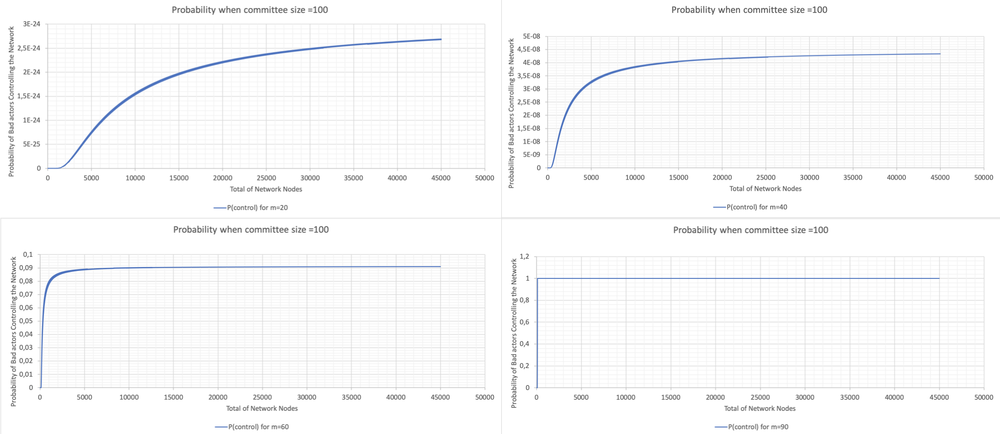
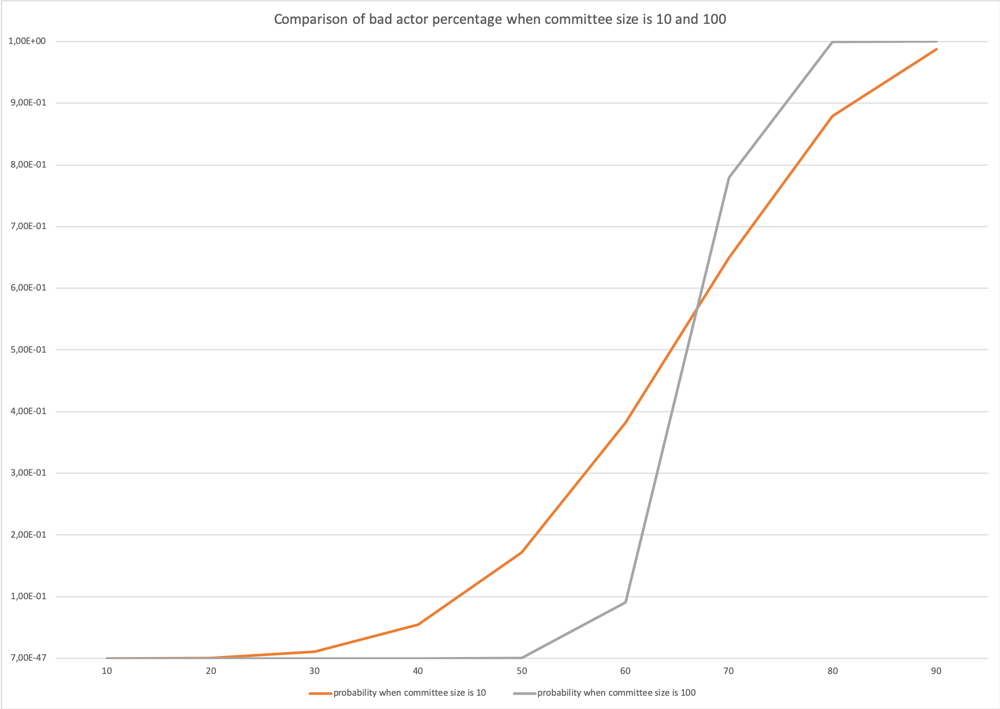

<style>
        div.highlight {
            width: 95%; 
            word-wrap: break-word;
            background: #EA9999;
            font-size: 1.0em;
            padding: 0.5em;
            color: #000000;
            }
        </style>

# Probability of a Byzantine Takeover of the DAN

- [Implementation](#implementation)
  - [Crude Monte Carlo Simulation](#crude-monte-carlo-simulation-1)
    - [Proving the Law of Large Numbers](#proving-the-law-of-large-numbers)
    - [Individual Probabilities](#individual-probabilities)
    - [Histogram and Visualization of Distribution](#histogram-and-visualization-of-distribution)
  - [Statistical Calculation](#statistical-calculation)
     - [Variation of Total Nodes](#variation-of-total-nodes)
     - [Variation of Byzantine Fault Tolerance Threshold](#variation-of-byzantine-fault-tolerance-threshold)
     - [Variation of Total Number of Nodes with Committee Size 10](#variation-of-total-number-of-nodes-with-committee-size-10)
     - [Variation of Total Number of Nodes with Committee Size 100](#variation-of-total-number-of-nodes-with-committee-size-100)
     - [Variation of Bad Nodes with Committee Size 10 and 100](#variation-of-bad-nodes-with-committee-size-10-and-100)
- [Conclusions and Remarks](#conclusions-and-remarks)
- [References](#references)

## Implementation

### Crude Monte Carlo Simulation

#### Proving the Law of Large Numbers

With the Crude Monte Carlo technique, to gain precision, the number of samples can be increased. Thus, before calculating the probability and drawing comparisons, the sample size, number of draws within an experiment, and the number of experiments can be varied to find an optimal amount. 

Below is the input data inserted into the python programme, where the number of draws within an experiment is $10$, and the number of experiments is $10$ :

```Text
What is the total amount of nodes? 100
What is the amount of bad nodes? 60
How many nodes are to be drawn? 3
What is the BFT threshold within the committee? 2
What is the number of draws within an experiment? 10
How many experiments? 10
Do you know the theoretical mean? Y|N: Y
What is the theoretical mean? 0.649474335188621
```
<br />
<p align="center"></p>
<br />

Below is the input data inserted into the python programme, where the number of draws within an experiment is $1,000$, and the number of experiments is $1,000$ :

```Text
What is the total amount of nodes? 100
What is the amount of bad nodes? 60
How many nodes are to be drawn? 3
What is the BFT threshold within the committee? 2
What is the number of draws within an experiment? 1,000
How many experiments? 1,000
Do you know the theoretical mean? Y|N: Y
What is the theoretical mean? 0.649474335188621
```

<p align="center"></p>
In each graph, the cumulative probabilities calculated for normal, uniform, Poisson and hypergeometric distribution are plotted against the number of experiments. The bold blue line represents the mean calculated from theoretical data. 

From the graph where the experiments and draws are equal to $10$ there is weak convergence. While the graph where the experiments and draws are equal to $1,000$ the  Law of Large Numbers is proved, as the sample size grows, convergence with the statistical mean is achieved. 

#### Individual Probabilities 

The graph below highlights the varying probabilities of each experiment conducted for the hypergeometric distribution. The mean of which provides us with the average of the probabilities, which can then be compared to the calculated theoretical mean. 

From a comparison of the mean probability of each distribution with the theoretical mean, it can be seen that the distribution type that closely mimics the theoretical result is hypergeometric. 

As discussed in [Section: Types of Distribution](#types-of-distribution) hypergeometric distribution is where there is no replacement, i.e., nodes are drawn simultaneously, distinguished and not returned to the total nodes pool. 

<br />
<p align="center"></p>
<br />

#### Uniform Distribution

| Statistical Information |                      | Comparison with <br />Theoretical Mean | &nbsp;&nbsp;Difference  Calculated |
| ----------------------- | -------------------- | -------------------------------------- | ---------------------------------- |
| Intercept               | 0.6497887492507493   | 0.649474335188621                      | 3.14414E-4                         |
| Standard Deviation      | 0.015438728229013219 |                                        |                                    |

#### Hypergeometric Distribution

| Statistical Information |                      | Comparison with <br />Theoretical Mean | &nbsp;&nbsp;Difference Calculated |
| ----------------------- | -------------------- | -------------------------------------- | --------------------------------- |
| Intercept               | 0.6495665834165834   | 0.649474335188621                      | 9.22482E-5                        |
| Standard Deviation      | 0.014812123075035204 |                                        |                                   |

#### Poisson Distribution

| Statistical Information |                      | Comparison with <br />Theoretical Mean | &nbsp;&nbsp;Difference Calculated |
| ----------------------- | -------------------- | -------------------------------------- | --------------------------------- |
| Intercept               | 0.6501259280719281   | 0.649474335188621                      | 6.51592E-4                        |
| Standard Deviation      | 0.015233575444419514 |                                        |                                   |

#### Normal Distribution

| Statistical Information |                     | Comparison with <br />Theoretical Mean | &nbsp;&nbsp;Difference Calculated |
| ----------------------- | ------------------- | -------------------------------------- | --------------------------------- |
| Intercept               | 0.6482901778221778  | 0.649474335188621                      | 1.18416E-3                        |
| Standard Deviation      | 0.01507612979811762 |                                        |                                   |

#### Histogram and Visualization of Distribution 

The histogram of randomness highlights the distribution of good and bad nodes selected in each experiment, highlighting the random nature of the experiment. 

<br />
<p align="center"></p>
<br />

| Statistical Information |                   |
| ----------------------- | ----------------- |
| Mean                    | 120,000.0         |
| Median                  | 119,991.0         |
| Mode                    | -                 |
| Standard Deviation      | 346.4313595341606 |

### Statistical Calculation

#### Variation of Total Nodes

##### Variables

- N (total number of nodes in the network) = $100, 300, 500, 1000$
- m (number of bad actors) = $60$% of N
- T (BFT threshold) = $67$% of N
- n (committee size) = ranging from $1$ to $1000$ 

Below is a sample of the data where the total nodes are $100$. The highlighted data was previously used in the Crude Monte Carlo Simulation when supplying the theoretical mean.

| &nbsp;&nbsp;Total Nodes&nbsp;&nbsp; | &nbsp;&nbsp;Bad Nodes&nbsp;&nbsp; | &nbsp;&nbsp;Committee Size&nbsp;&nbsp; | &nbsp;&nbsp;BFT Threshold&nbsp;&nbsp; | &nbsp;&nbsp;Probability&nbsp;&nbsp;            |
| :---------------------------------: | :-------------------------------: | :------------------------------------: | :-----------------------------------: | ---------------------------------------------- |
|                 100                 |                60                 |                   1                    |                   1                   | 0.6                                            |
|                 100                 |                60                 |                   2                    |                   2                   | 0.3575757575757576                             |
|  <div class="highlight">100</div>   |  <div class="highlight">60</div>  |     <div class="highlight">3</div>     |    <div class="highlight">2</div>     | <div class="highlight">0.649474335188621</div> |
|                 100                 |                60                 |                   4                    |                   3                   | 0.47343240951488375                            |
|                 100                 |                60                 |                   5                    |                   4                   | 0.33162085827770661                            |
|                 100                 |                60                 |                   6                    |                   4                   | 0.5443381851334722                             |
|                 100                 |                60                 |                   7                    |                   5                   | 0.4153500188485931                             |
|                 100                 |                60                 |                   8                    |                   6                   | 0.30661160770090995                            |
|                 100                 |                60                 |                   9                    |                   6                   | 0.47996269793634677                            |
|                 100                 |                60                 |                   10                   |                   7                   | 0.37423758246308586                            |
|                 100                 |                60                 |                   11                   |                   8                   | 0.28361605491457653                            |
|                 100                 |                60                 |                   12                   |                   8                   | 0.4320215340178938                             |
|                 100                 |                60                 |                   13                   |                   9                   | 0.3409545354772218                             |
|                 100                 |                60                 |                   14                   |                  10                   | 0.2623321970180976                             |
|                 100                 |                60                 |                   15                   |                  10                   | 0.39288184738975973                            |

<br />

<p align="center"></p>
<br />

From a plot of committee size versus probability with a change in $N$, the total number of nodes, it can be seen that the probability is lower with respect to the committee size when $N$ is smaller. 

#### Variation of Byzantine Fault-Tolerance Threshold

##### Variables

  - N (total number of nodes in the network) = $100$
  - m (number of bad actors) = $60$% of N
  - T (BFT threshold) = $50$%, $55$%, $60$%, $67$% of N
  - n (committee size) = ranging from $1$ to $100$ 

<br />
<p align="center"></p>
<br />

From a plot of committee size versus probability where the number of nodes remains at $100$ with a change in $T$, the BFT 
threshold, ranging from $50$% to $67$%, it can be seen that: When the BFT threshold is $50$% and $55$% the probability is low when the committee size is small; as the committee size increases, the probability increases, and tends to one. The probability is higher for the case where the BFT threshold is $50$% than when the probability is $55$%. 

When the BFT threshold is $60$%, the probability decreases from $0.63$ to approximately $0.59$, where it remains constant. 

When the BFT threshold is $65$% and $67$%, the probability decreases from $0.38$ and tends to zero. This confirms the BFT threshold of $67$% as per literature. 

#### **Variation of Total Number of Nodes with Committee Size 10**

##### Variables

- N (total number of nodes in the network) = ranging from $10$ to $350$
- m (number of bad actors) = $60$% of N
- T (BFT threshold) = $67$% of N
- n (committee size) = $10$

<br />
<p align="center"></p>
<br />

For the graph showing varying probabilities with respect to the total number of network nodes, where the committee size is $10$, the 
probability dramatically increases when the total nodes is three times more than the committee size and onwards. The probability plateaus at $0.35$. 

#### Variation of Total Number of Nodes with Committee Size 100

##### Variables

- N (total number of nodes in the network) = ranging from $100$ to $1300$
- m (number of bad actors) = $60$% of N
- T (BFT threshold) = $67$% of N
- n (committee size) = $100$

<br />
<p align="center"></p>
<br />

From this and the previous graph, it can be seen that probabilities are significantly lower when the committee size is $100$ compared to $10$. There is an increase in probability 
up to a network size of $700$, albeit, not as steep as the change when the committee size is $10$.  The probability plateaus at $0.08$.

The larger the committee size, the less dramatic changes there are in the probability. 

#### Variation of Bad Nodes with Committee Size 10 and 100

##### Variables

- N (total number of nodes in the network) = ranging from $10$ and $100$ to $50,000$
- m (number of bad actors) = $10$%, $20$%, $30$%, $40$%, $50$%, $60$%, $70$%, $80$% and $90$% of N
- T (BFT threshold) = $67$% of N
- n (committee size) = $10$ and $100$

<br />
<p align="center"></p>
<br />

These graphs show varying probabilities when the percentage of bad nodes is $20$, $40$, $60$ and $90$. The value when the probability plateaus is used to construct the graph below for both committee sizes $10$ and $100$. 

<br />
<p align="center"></p>
<br />

The graph shows changes in the probability due to changes in % of bad nodes when the committee size is $10$ and $100$.  When the committee size is $10$, there is a change in probability when the bad node percentage is between $30$ and $80$.  When the committee size is $100$, there is a steep increase in the probability when the bad node percentage is between $50$ and $80$.  When the committee size is $100$, the probability remains lower as the bad node percentage increases and has a steeper gradient when the change in probability occurs. Whereas, when the committee size is $10$, the probability begins to increase at a lower percentage of bad nodes. 

## Conclusions and Remarks 

With regards to the Crude Monte Carlo Simulation, at this building block stage, probabilities were calculated and distributions of nodes within the network illustrated.

With regards to the statisical calculation, comments can be made for each of the varied parameters. 

- Total nodes in the network: the smaller the pool of total nodes in the network, the lower the probability; however, the probability difference is near negligible if the committee size is large. Also, this parameter will be difficult to control, and the network will be ever-increasing 
- BFT threshold: this threshold should be higher than $67$% as per literature.
- Committee size: the larger the committee size, the lower the probability bad nodes controlling the network
- Bad nodes: while this variable cannot be controlled, the probability can remain low as the percentage of bad nodes increase if the committee size approx $100$ or larger. 