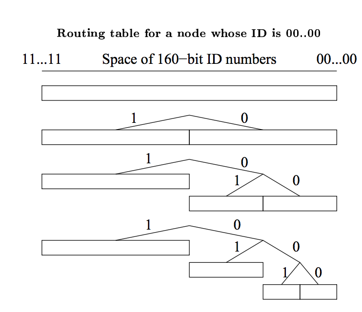

# Distributed Hash Tables

- [Introduction](#introduction)
- [Characterization of DHT Networks](#characterization-of-dht-networks)
  - [Peer Discovery](#peer-discovery)
  - [Scalability and Fault-tolerance](#scalability-and-fault-tolerance)
  - [Distributed Data Storage](#distributed-data-storage)
- [DHT Algorithms](#dht-algorithms)
  - [Overview](#overview)
  - [Kademlia](#kademlia)
    - [Node ID](#node-id)
    - [Bootstrapping a Node](#bootstrapping-a-node)
    - [XOR Metric](#xor-metric)
    - [Protocol](#protocol)
      - [Lookup Procedure](#lookup-procedure)
      - [Data Storage and Retrieval Procedure](#data-storage-and-retrieval-procedure)
      - [Routing Table](#routing-table)
      - [$k$-bucket Ordering](#k-bucket-ordering)
    - [Kademlia Attacks](#kademlia-attacks)
      - [Node Insertion Attack](#node-insertion-attack)
      - [Eclipse Attack](#eclipse-attack)
- [DHT Vulnerabilities and Attacks](#dht-vulnerabilities-and-attacks)
  - [Eclipse Attack](#eclipse-attack)
  - [Sybil Attack](#sybil-attack)
  - [Adaptive Join-Leave Attack](#adaptive-join-leave-attack)
- [Cuckoo Rule](#cuckoo-rule)
- [Conclusion](#conclusion)
- [References](#references)
- [Contributors](#contributors)

## Introduction

A hash table is a data structure that maps keys to values. A hashing function is used to compute keys that are inserted 
into a table from which values can later be retrieved. As the name suggests, a distributed hash table (DHT) is a hash 
table that is distributed across many linked nodes, which cooperate to form a single cohesive hash table service. Nodes 
are linked in what is called an [overlay network](https://en.wikipedia.org/wiki/Overlay_network).
An overlay network is simply a communication network built on top of another network. The Internet is an example, as it 
began as an overlay network on the public switched telephone network.

$\langle key, value \rangle$ pairs are stored on a subset of the network, usually by some notion of "closeness" to that 
key.

A DHT network design allows the network to tolerate nodes coming and going without failure, and allows the network size 
to increase indefinitely.

Image from [XKCD #350 - Network](https://xkcd.com/350/) - [License](https://xkcd.com/license.html)

The need for DHTs arose from early file-sharing networks such as Gnutella, Napster, FreeNet and BitTorrent, which were 
able to make use of distributed resources across
the Internet to provide a single cohesive service [[1]].

These systems employed different methods of locating resources on the network:

- Gnutella searches were inefficient, because queries would result in messages flooding the network.
- Napster used a central index server, which was a single point of failure and left it vulnerable to attacks.
- FreeNet used a key-based routing. However, it was less structured than a DHT and did not guarantee that data could be found.

In 2001, four DHT projects were introduced: CAN, Chord, Pastry and Tapestry. They aimed to have a lookup efficiency
($O(log(n))$) similar to that of a centralized index, while having the benefits of a decentralized network.

DHTs use varying techniques to achieve this, depending on the given algorithm. However, they have a number
of aspects in common:

- Each participant has some unique network identifier.
- They perform peer lookup, data storage and retrieval services.
- There is some implicit or explicit joining procedure.
- Communication need only occur between neighbors that are decided on by some algorithm.

In this report we'll go over some of the aspects common to all DHTs and dive deeper into a popular DHT implementation, 
called [Kademlia](#kademlia).

## Characterization of DHT Networks

### Peer Discovery

Peer discovery is the process of locating nodes in a distributed network for data communication.
This is facilitated by every node maintaining a list of peers and sharing that list with other nodes
on the network. A new participant would seek to find their peers on the network by first contacting a
set of predefined bootstrap nodes. These nodes are normal network participants who happen to be part of
some dynamic or static list. It is the job of every node on the network to facilitate peer discovery.

As peers come and go, these lists are repeatedly updated to ensure network integrity.

### Scalability and Fault-tolerance

A DHT network efficiently distributes responsibility for the replicated storage and retrieval of routing information
and data. This distribution allows nodes to join and leave with minimal or no disruption. The network can
have a massive number of nodes (in the case of BitTorrent, millions of nodes) without each node having to
know about every other participant in the network.

In this way, DHTs are inherently more resilient against hostile attackers than a typical centralized system [[1]].

Bittorrent is one of the largest decentralized networks in existence, containing in the order of tens of millions
of concurrent users and hundreds of millions of active users. It is estimated that there are a quarter of a billion
distinct monthly users of the BitTorrent network [[10]]. As of 2019, Tor has approximately 9,000 relay servers and
over 2 million users [[11]].

### Distributed Data Storage

Arbitrary data may be stored and replicated by a subset of nodes for later retrieval. Data is hashed using a
consistent hashing function (such as SHA256) to produce a key for the data. That data is propagated and
eventually stored on the node or nodes whose node IDs are "closer" to the key for that data for some distance
function.

Partitioned data storage has limited usefulness to a typical blockchain, as each full node is required to keep a copy
of all transactions and blocks for verification.

## DHT Algorithms

### Overview

The following graph is replicated and simplified from [[8]]. Degree is the number of neighbors with which a node must 
maintain contact.

| Parameter                              | CAN                                     | CHORD                   | Kademlia                                                  | Koord                                    | Pastry                             | Tapestry                  | Viceroy                         |
| -------------------------------------- | --------------------------------------- | ----------------------- | --------------------------------------------------------- | ---------------------------------------- | ---------------------------------- | ------------------------- | ------------------------------- |
| Foundation                             | d-dimensional torus                     | Circular space          | XOR metric                                                | de Bruijn graph                          | Plaxton-style mesh                 | Plaxton-style mesh        | Butterfly network               |
| Routing function                       | Map key-value pairs to coordinate space | Matching key to node ID | Matching key to node ID                                   | Matching key to node ID                  | Matching key and prefix in node ID | Suffix matching           | Levels of tree, vicinity search |
| Routing performance (network size $n$) | $O(dn^{(2/d)})$                         | $O(log(n))$             | $O(log(n)) + c$ $c$ is small                              | Between $O(log(log(n)))$ and $O(log(n))$ | $O(log(n))$                        | $O(log(n))$               | $O(log(n))$                     |
| Degree                                 | $2d$                                    | $O(log(n))$             | $O(log(n))$                                               | Between constant to $log(n)$             | $O(2log(n))$                       | $O(log(n))$               | Constant                        |
| Join/Leaves                            | $2d$                                    | $log(n)^2$              | $O(log(n)) + c$ $c$ is small                              | $O(log(n))$                              | $O(log(n))$                        | $O(log(n))$               | $O(log(n))$                     |
| Implementations                        | \-\-                                    | OpenChord, OverSIM      | Ethereum [[3]], Mainline DHT (BitTorrent), I2P, Kad Network | \-\-                                     | FreePastry                         | OceanStore, Mnemosyne [[4]] | \-\-                            |

The popularity of Kademlia over other DHTs is likely due to its relative simplicity and performance. The rest of this 
section dives deeper into Kademlia.

### Kademlia

Kademlia is designed to be an efficient means for storing and finding content in a distributed peer-to-peer (P2P) network.
It has a number of core features that are not simultaneously offered by other DHTs [[2]], such as:

- The number of messages necessary for nodes to learn about each other, is minimized.
- Nodes have enough information to route traffic through low-latency paths.
- Parallel and asynchronous queries are made to avoid timeout delays from failed nodes.
- The node existence algorithm resists certain basic distributed denial-of-service (DDoS) attacks.

#### Node ID

A node selects an $n$-bit ID, which is given to other nodes on the network. The network design relies on node IDs being 
uniformly distributed by some random procedure. A node's position is determined by the shortest unique prefix of its 
ID, which forms a tree structure with node IDs as leaves [[2]]. This ID should be reused when the node rejoins the 
network. The following figure shows a binary tree structure in a three-bit key space:

graph TD
AR[ ] --- |0| A0( )
AR --- |1| A1[ ]
A0 --- |0| A00[ ]
A0 --- |1| A01[ ]
A00 --- |0| N000[Node 000]
A00 --- |1| N001[Node 001]
A01 --- |0| N010[Node 010]
A01 --- |1| N011[Node 011]
A1 --- |0| A10[ ]
A1 --- |1| A11[ ]
A10 --- |0| A100[Node 100]
A10 --- |1| A101[Node 101]
A11 --- |0| A110[Node 110]
A11 --- |1| A111[Node 111]

The bit length of the node ID should be sufficiently large to make collisions extremely unlikely when using a uniformly
distributed random number generator [[2]].

#### Bootstrapping a Node

A node wishing to join the network for the first time has no known contacts. In order for the node to establish
itself on the network, it must contact one, or more than one, bootstrap node. These nodes are not special in any way 
other than being listed in some predefined list. They simply serve as a first point of contact for the requesting node 
to become known to more of the network and to find their closest peers.

There are a number of ways that bootstrap nodes can be obtained, including adding addresses to a configuration and using 
[DNS seeds](https://bitcoin.org/en/glossary/dns-seed).

The joining process is described as follows [[2]]:

1. A joining node generates a random ID.
2. It contacts a few nodes it knows about.
3. It sends a `FIND_NODE` lookup request of its newly generated node ID.
4. The contacted nodes return the closest nodes they know about. The newly discovered nodes are added to the joining 
node's routing table.
5. The joining node then contacts some of the new nodes it knows about. The process then continues iteratively until 
the joining node is unable to locate any closer nodes.

This _self-lookup_ has two effects: it allows the node to learn about nodes closer to itself; and it populates other 
nodes' routing tables with the node's ID [[1]].

#### XOR Metric

The Kademlia paper published in 2002 [[2]] offered the novel idea of using the XOR ($\oplus​$) operator to determine the 
distance and therefore the arrangement of peers within the network. Defined as:

$$ distance(a, b) = a \oplus b$$

This works, because XOR exhibits the same mathematical properties as any distance function.

Specifically, [[1]]

- Identity: $a \oplus a = 0$
- Non-negativity: $a \oplus b > 0$ for $a \neq b$
- Symmetry: $a \oplus b = b \oplus a$
- Triangle inequality: $a \oplus b + b \oplus c \geq a \oplus c$

The XOR metric implicitly captures a notion of distance in the preceding tree structure [[2]].

#### Protocol

Kademlia is a relatively simple protocol consisting of only four remote procedure call (RPC) messages that facilitate 
two independent concerns: peer discovery and data storage/retrieval.

The following RPC messages are part of the Kademlia protocol:

- Peer discovery
  - `PING`/`PONG` - used to determine liveness of a peer.
  - `FIND_NODE` - returns a number of nodes which are closer to a given query value.

- Data storage and retrieval
  - `STORE` - request to store a $\langle key, value \rangle$ pair.
  - `FIND_VALUE` - behaves the same as `FIND_NODE` by returning closer nodes. If a node has the requested 
  $\langle key, value \rangle​$ pair, it will instead return the stored value.

Notably, there is no `JOIN` message. This is because there is no explicit join in Kademlia. Each peer has a chance of 
being added to a routing table of another node whenever an RPC message is sent/received between them [[2]]. In this 
way, the node becomes known to the network.

##### Lookup Procedure

The lookup procedure allows nodes to locate other nodes, given a node ID. The procedure begins by the initiator 
concurrently querying the closest $\alpha$ (concurrency parameter) nodes to the target node ID it knows about. The 
queried node returns the $k​$ closest nodes it knows about. The querying node then proceeds in rounds, querying closer 
and closer nodes until it has found the node. In the process, both the querying node and the intermediate nodes have 
learnt about each other.

##### Data Storage and Retrieval Procedure

The storage and retrieval procedure ensures that $\langle key, value \rangle$ pairs are reliably stored and able to be
retrieved by participants in the network.

The storage procedure uses the [lookup procedure](#lookup-procedure) to locate the closest nodes to the key, at which
point it issues a `STORE` RPC message to those nodes. Each node republishes the $\langle key, value \rangle$ pairs to
increase the availability of the data. Depending on the implementation, the data may eventually expire (say 
24&nbsp;hours). Therefore, the original publisher may be required to republish the data before that period expires.

The retrieval procedure follows the same logic as storage, except a `FIND_VALUE` RPC is issued and the data received.

##### Routing Table

Each node organizes contacts into a list called a routing table. A routing table is a binary tree where the leaves are 
"buckets" that contain a maximum of $k​$ nodes. $k​$ is a network-wide parameter that should be large enough to ensure 
that lookups and data will be available with high probability. These buckets are aptly named $k​$-buckets, and contain 
nodes with some common node ID prefix.

It should be noted that this is captured by the [XOR metric](#xor-metric).

For instance, given node $A(1100)$ with peers $B(1110)$, $C(1101)$, $D(0111)$ and $E(0101)$, the distances from 
node $A$ would be:

- $A \oplus B = 0010 (2)$
- $A \oplus C = 0001 (1)$
- $A \oplus D = 1011 (11)$
- $A \oplus E = 1001 (9)$

$A$, $B$ and $C$ share the same prefix up to the first two most significant bits (MSBs). However, $A$, $C$ and $D$ share
no prefixed bits and are therefore further apart. In this example, $A$, $B$ and $C$ would be in the same bucket, and
$D$ and $E$ in their own bucket.

Initially, a node's routing table is not populated with $k​$-buckets, but may contain a single node in a single 
$k​$-bucket. As more nodes become known, they are added to the $k​$-bucket until it is full. At this point, the node 
splits the bucket in two: one for nodes that share the same prefix as itself and one for all the others.

This guarantees that for bucket $j$, where $0 <= j < k$, there is at least one node $N$ in node $A$'s routing table for 
which $$ 2^j <= distance(A, N) < 2^{(j+1)} $$

##### $k$-bucket Ordering

Peers within $k$-buckets are sorted from least to most recently seen. Once a node receives a request or reply from a 
peer, it checks to see if the peer is contained in the appropriate $k$-bucket. Depending on whether or not the peer 
already exists, the entry is either moved or appended to the tail of the list (most recently seen). If a particular 
bucket is already size $k$, the node tries to `PING` the first peer in the list (least recently seen). If the peer does 
not respond, it is evicted and the new peer is appended to the bucket, otherwise the new peer is discarded. In this 
way, the algorithm is biased towards peers that are long-lived and highly available.

#### Kademlia Attacks

Some notable attacks in the Kademlia scheme:

##### Node Insertion Attack

Since there is no verification of a node's ID, an attacker can select their ID to occupy a particular keyspace in the 
network. Once an attacker has inserted themselves in this way, they may censor or manipulate content in that keyspace, 
or eclipse nodes [[9]].

##### Eclipse Attack

Kademlia is vulnerable to eclipse attacks. This is discussed in the following section.

## DHT Vulnerabilities and Attacks

### Eclipse Attack

An eclipse attack is an attack that allows adversarial nodes to isolate the victim from the rest of its peers and 
filter its view of the rest of the network. If the attacker is able to occupy all peer connections, the victim is 
eclipsed.

An attacker takes advantage of the fact that in practice, there are relatively few nodes in most parts of a 160-bit 
keyspace. An attacker injects themselves closer to the target than other peers and eventually could achieve a 
dominating position. This can be done cheaply if the network rules allow many peers to come from the same IP address.

The cost of executing an eclipse attack is highly dependent on the architecture of the network and can range from a 
small number of machines (e.g. with hundreds of node instances on a single machine) to requiring a full-fledged botnet. 
Reference [[6]] shows that an eclipse attack on Ethereum's Kademlia-based DHT can be executed using as few as two nodes.

Mitigations include:

- Identities must be obtained independently from some random oracle.
- Nodes maintain contact with nodes outside of their current network placement.

### Sybil Attack

Sybil attacks are an attempt by colluding nodes to gain disproportionate control of a network and are often used as a 
vector for other attacks. Many, if not all, DHTs have been designed under the assumption that a low fraction of nodes 
are malicious. A sybil attack attempts to break this assumption by increasing the number of malicious nodes.

Mitigations include [[12]]:

- Associating a cost with adding new identifiers to the network.
- Reliably joining real-world identifiers (IP address, MAC address, etc.) to the node identifier, and rejecting a 
threshold of duplicates.
- Having a trusted central authority or secure decentralized scheme that issues identities.
- Using social information and trust relationships.

### Adaptive Join-Leave Attack

An adversary wants to populate a particular keyspace interval $I$ with bad nodes in order to prevent a particular file
from being shared. Let's suppose that we have a network with node IDs chosen completely at random through some random 
oracle. An adversary starts by executing join/leaves until it has nodes in that keyspace. After that they proceed in 
rounds, keeping the nodes that are in $I$ and rejoining the nodes that aren't, until control is gained over the 
interval ([[5]], [[7]]).

It should be noted that if there is a large enough cost for rejoining the network, there is a disincentive for this 
attack. In the absence of this disincentive, the [cuckoo rule](#cuckoo-rule) [[5]] is proposed as a defence.

## Cuckoo Rule

Given a network that is partitioned into groups or intervals, and in which nodes are positioned uniformly and randomly.
Adversaries may proceed in rounds, continuously rejoin nodes from the least faulty group until control is gained over
one or more groups as described in [Adaptive Join-Leave Attack](#adaptive-join-leave-attack).

The cuckoo rule is a join rule that moves (cuckoos) nodes in the same group as the joining node to random locations
outside of the group. It is shown that this can prevent adaptive join-leave attacks with high probability,
i.e. a probability $1 - 1/N$, where $N$ is the size of the network.

Given:

- $I$ - keyspace group in $[0,1)$;
- $n$ - number of honest nodes;
- $ \epsilon n$ - number adversarial nodes for constant $\epsilon < 1$;

therefore, the network size $N$ is $n + \epsilon n$. Put another way, as $\epsilon$ approaches 1, bad nodes occupy less 
than half of the total network.

- $k$-region is a region in $[0,1)$ of size $k/n$;
- $R_k(x)$ is a unique $k$-region containing $x$.

And with the following two conditions:

- Balancing Condition - the interval $I​$ contains at least $O(log(n))​$ nodes.
- Majority Condition - honest nodes are in the majority in $I$.

The cuckoo rule states:

> If a new node $v​$ wants to join the system, pick a random $x \in [0, 1)​$. Place $v​$ into $x​$ and move
> all nodes in $R_k(x)​$ to points in $[0, 1)​$ chosen uniformly and independently at random (without replacing any
> further nodes) [[5]].

It is concluded that for a constant fraction of adversarial peers, where $\epsilon < 1 - 1/k$ for any constant, $k > 1$
is sufficient to prevent adaptive join-leave attacks with high probability.

Sen, Freedman [[7]] modelled and analysed the Cuckoo Rule and found that, in practice, it tolerates very few 
adversarial nodes.

|                                                                                                                                                                                        |     |                                                                                                                                                                                                                                                     |
| :------------------------------------------------------------------------------------------------------------------------------------------------------------------------------------: | :-: | :-------------------------------------------------------------------------------------------------------------------------------------------------------------------------------------------------------------------------------------------------: |
|                                                                                                                      |     |                                                                                                                                                                                   |
| (Cuckoo rule) Minimum group size  needed to tolerate different $\epsilon$ for 100,000 rounds. Groups must be large (i.e. 100s to 1,000s of nodes) to guarantee correctness [[7]] |     | (Cuckoo rule) Number of rounds the system maintained correctness with an average group  size of 64 nodes, varied. Simulation was halted  after 100,000 rounds. Failure rates drop dramatically past a certain threshold for different N [[7]] |

Notably, they show that rounds to failure (i.e. more than one-third of nodes in a given group are adversarial) decreases 
dramatically with an increasing but small global fraction of adversarial nodes. An amendment rule is proposed, which 
allows smaller group sizes while maintaining Byzantine correctness. Reference [[7]] warrants more investigation, but is 
out of the scope of this report.

## Conclusion

DHTs are a proven solution to distributed storage and discovery. Kademlia, in particular, has been successfully 
implemented and sustained in file-sharing and blockchain networks with participants in the millions. As with every 
network, it is not without its flaws, and careful network design is required to mitigate attacks.

Novel research exists, which proposes schemes for protecting networks against control from adversaries. This research 
becomes especially important when control of a network may mean monetary losses, loss of privacy or denial of service.

## References

[[1]] Wikipedia: "Distributed Hash Table" [online]. Available: <https://en.wikipedia.org/wiki/Distributed_hash_table>. 
Date accessed: 2019&#8209;03&#8209;08.

[1]: https://en.wikipedia.org/wiki/Distributed_hash_table. "Wikipedia: Distributed Hash Table"

[[2]] Kademlia: A Peer-to-Peer Information System" [online]. Available: <https://pdos.csail.mit.edu/~petar/papers/maymounkov-kademlia-lncs.pdf>. Date accessed: 2019&#8209;03&#8209;08.

[2]: https://pdos.csail.mit.edu/~petar/papers/maymounkov-kademlia-lncs.pdf "Original Kademlia paper"

[[3]] Ethereum Wiki [online]. Available: <https://github.com/ethereum/wiki/wiki/Kademlia-Peer-Selection#lookup>. Date accessed: 2019&#8209;03&#8209;12.

[3]: https://github.com/ethereum/wiki/wiki/Kademlia-Peer-Selection "Kademlia Peer Selection"

[[4]] Wikipedia: "Tapestry (DHT)" [online]. Available: <https://www.wikiwand.com/en/Tapestry_(DHT)>. Date accessed: 2019&#8209;03&#8209;12.

[4]: https://www.wikiwand.com/en/Tapestry_(DHT) "Tapestry (DHT)"

[[5]] Towards a Scalable and Robust DHT [online]. Available: <http://www.cs.jhu.edu/~baruch/RESEARCH/Research_areas/Peer-to-Peer/2006_SPAA/virtual5.pdf>. Date accessed: 2019&#8209;03&#8209;12.

[5]: http://www.cs.jhu.edu/~baruch/RESEARCH/Research_areas/Peer-to-Peer/2006_SPAA/virtual5.pdf "Towards a Scalable and Robust DHT"

[[6]] Low-resource Eclipse Attacks on Ethereum’s Peer-to-Peer Network [online]. Available: <https://www.cs.bu.edu/~goldbe/projects/eclipseEth.pdf>. Date accessed: 2019&#8209;03&#8209;15.

[6]: https://www.cs.bu.edu/~goldbe/projects/eclipseEth.pdf "Low-Resource Eclipse Attacks on Ethereum’s Peer-to-Peer Network"

[[7]]: Commensal Cuckoo: Secure Group Partitioning for Large-scale Services [online]. Available: <http://sns.cs.princeton.edu/docs/ccuckoo-ladis11.pdf>. Date accessed: 2019&#8209;03&#8209;15.

[7]: https://web.archive.org/web/20180729064433/http://sns.cs.princeton.edu/docs/ccuckoo-ladis11.pdf "Commensal Cuckoo: Secure Group Partitioning for Large-Scale Services"

[[8]]: Overlay and P2P Networks [online]. Available: <https://www.cs.Nhelsinki.fi/webfm_send/1339>. Date accessed: 2019&#8209;04&#8209;04.

[8]: https://www.cs.helsinki.fi/webfm_send/1339 "Overlay and P2P networks"

[[9]]: Poisoning the Kad Network [online]. Available: <https://www.net.t-labs.tu-berlin.de/~stefan/icdcn10.pdf>. Date accessed: 2019&#8209;04&#8209;04.

[9]: https://www.net.t-labs.tu-berlin.de/~stefan/icdcn10.pdf "Poisoning the Kad Network"

[[10]]: BitTorrent [online]. <https://en.wikipedia.org/wiki/BitTorrent>. Date accessed: 2019&#8209;04&#8209;04.

[10]: https://en.wikipedia.org/wiki/BitTorrent "BitTorrent"

[[11]]: Servers - Tor Metrics [online]. <https://metrics.torproject.org/networksize.html>. Date accessed: 2019&#8209;04&#8209;29.

[11]: https://en.wikipedia.org/wiki/BitTorrent "Servers - Tor Metrics"

[[12]]: A Survey of DHT Security Techniques [online]. <https://www.researchgate.net/publication/220566526_A_survey_of_DHT_security_techniques>. Date accessed: 2019&#8209;04&#8209;29.

[12]: https://www.researchgate.net/publication/220566526_A_survey_of_DHT_security_techniques "A Survey of DHT Security Techniques"

## Contributors

- <https://github.com/sdbondi>
- <https://github.com/neonknight64>
- <https://github.com/philipr-za>
- <https://github.com/anselld>
