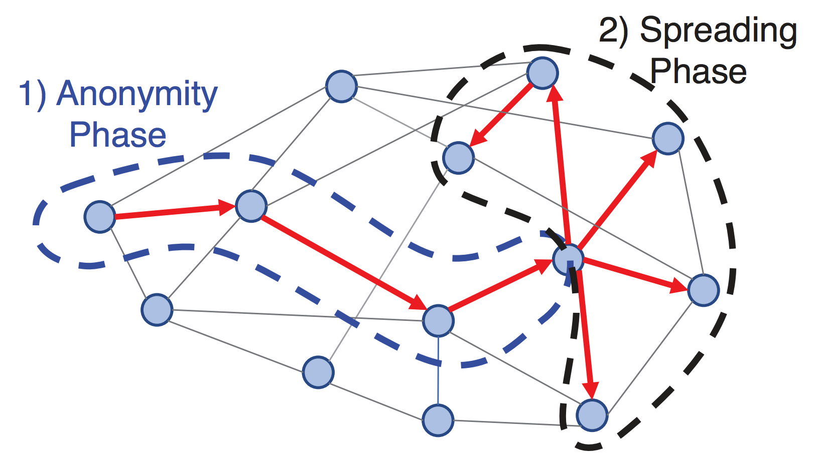

# Grin vs. BEAM, a Comparison

## Introduction

Grin and BEAM are two open-source cryptocurrency projects based on the Mimblewimble protocol. The Mimblewimble protocol was first proposed by a anonymous user using the pseudonym Tom Elvis Jedusor (the french translation of Voldemort's name from the Harry Potter series of books). This user logged onto a bitcoin research IRC channel and posted a link to a text article hosted on a Tor hidden service [[1]]. This article provided the basis for a new way to construct block chain style transactions that provided inherent privacy and the ability to dramatically reduce the size of the block chain by compressing the transaction history of the chain. This initial article presented the main ideas of the protocol but it left out a number of critical elements required for a practical implementation and even contained a mistake in the cryptographic formulation. Andrew Poelstra published a follow-up paper that addresses many of these issues and refines the core concepts of Mimblewimble [[2]] which have been applied to the practical implementations of this protocol in both the Grin [[3]] and BEAM [[4]] projects.

The Mimblewimble protocol describes how transacting parties will interactively work to build a valid transaction using their public/private key pairs, used to prove ownership of transaction outputs, and interactively chosen blinding factors. These blinding factors are used to obfuscate the participant's public keys from everyone, including each other, and to hide the value of the transaction from everyone except the counterparty in that specific transaction. The protocol also performs a process called cut-through which condenses transactions by eliminating intermediary transactions. This improves privacy and compresses the amount of data that is maintained on the block chain [[3]]. This cut-through process precludes general purpose scripting systems like those found in Bitcoin. However, Andrew Poelstra proposed the concept of Scriptless scripts, which make use of Schnorr signatures, to build adaptor signatures that allow for encoding of many of the behaviors that scripts are traditionally used to achieve. Scriptless scripts enable functionality like Atomic swaps and Lightning network like payment channels [[5]].

Grin and BEAM both implement the Mimblewimble protocol but each has been built from scratch. Grin is written in RUST and BEAM in C++. The remainder of this report will focus on describing some of the aspects of each project that sets them apart. Both projects are still early in their development cycle and many of these details are changing on a daily basis. Furthermore, the BEAM project documentation is still mostly available only in Russian so as of the writing of this report not all the technical details are available for English readers. As such the discussion in this report will most likely become out of date as the respective project evolve.

The remainder of this report will be structured as follows: Firstly, some implementation details and unique features of the project will be discussed. Secondly, we will examine the difference in the proof-of-work algorithms employed and finally we will discuss the different governance models the projects are using.

## Contents

- [Grin vs. BEAM, a Comparison](#grin-vs-beam-a-comparison)
  - [Introduction](#introduction)
  - [Contents](#contents)
  - [Comparison of Features and Implementation in Grin vs BEAM](#comparison-of-features-and-implementation-in-grin-vs-beam)
    - [Grin unique features](#grin-unique-features)
    - [BEAM unique features](#beam-unique-features)
  - [Proof of Work Mining Algorithm](#proof-of-work-mining-algorithm)
  - [Governance Models and Monetary Policy](#governance-models-and-monetary-policy)
  - [Conclusions, Observations, Recommendations](#conclusions-observations-recommendations)
  - [References](#references)
  - [Contributors](#contributors)
  - [Appendices](#appendices)
    - [Appendix A: Cuckoo/Cuckatoo Cycle PoW algorithm](#appendix-a-cuckoocuckatoo-cycle-pow-algorithm)

## Comparison of Features and Implementation in Grin vs BEAM

The two projects are being independently built from scratch by different teams in different languages (Rust [[6]] and C++ [[7]]), so there will be many differences in the raw implementations. For example, Grin uses LMDB for its embedded SQL database and BEAM use SQLite which have performance differences but are functionally similar. Grin uses a Directed Acyclic Graph (DAG) to represent their mempool to avoid transaction reference loops [[8]] while BEAM uses a multiset key-value data structure with logic to enable some of their extended features [[7]].

From the perspective of features the two projects exhibit all the features inherent to Mimblewimble. Grin's stated goal is to produce a simple and easy to maintain implementation of the Mimblewimble protocol [[3]]. BEAM's implementation however contains a number of modifications to the Mimblewimble approach with the aim to provide some unique features for their implementation. Before we get into the features and design elements that set the two project apart let's discuss an interesting feature that both projects have implemented.

Both Grin and BEAM have incorporated a version of the Dandelion relay protocol that supports transaction aggregation. One of the major outstanding challenges for privacy that cryptocurrencies face is that it is possible to track transactions as they are added to the mempool and propagate across the network and to link those transactions to their originating IP addresses. This information can be used to deanonymize users even on networks with strong transaction privacy. To improve privacy during the propagation of transactions to the network the Dandelion network propagation scheme was proposed [[9]]. In this scheme transactions are propagated in two phases, the Anonymity phase (or "stem" phase) and the Spreading phase (or "fluff" phase) as illustrated in the Figure 1. In the stem phase a transaction is propagated to only a single randomly selected peer from the current nodes peer list. After a random number of hops along the network, each hop propagating to only a single random peer, the propagation process enters the second phase. During the fluff phase the transaction is then propagated using a full flood/diffusion method as found in most networks. This approach means that the transaction has first propagated to a random point in the network before flooding the network so it becomes much more difficult to track its origin.

<strong>Figure 1: Two Phases of Dandelion P2P Transaction Propagation. [<a href="https://arxiv.org/abs/1701.04439" title="Dandelion: Redesigning the Bitcoin Network for Anonymity.">9</a>]</strong>

Both projects have adapted this approach to work with Mimblewimble transactions. Grin's implementation allows for transaction aggregation and cut-through in the stem phase of propagation which provides even greater anonymity to the transactions before they spread during the fluff phase [[10]]. In addition to transaction aggregation and cut-through, Beam introduces “dummy” transactions that are added in the stem phase to compensate for situations when real transactions are not available [[33]].

### Grin unique features

Grin is aiming to be a simple and minimal reference implementation of a Mimblewimble block chain so they are not aiming to include many features extending the core Mimblewimble functionality as discussed. However, the Grin implementation does include some interesting implementation choices which they have documented in depth on their growing Github repository's wiki.

Grin has implemented a method for a node to sync the block chain very quickly by only downloading a partial history [[11]]. A new node entering the network will query the current head block of the chain and then requests the block header at a horizon, in the example the horizon is initially set at 5000 blocks before the current head. The node then checks if there is enough data to confirm consensus and if there isn't it will increase its horizon until consensus is reached. At that point it will download the full UTXO set of the horizon block. This approach does introduce a few security risks but mitigations are provided and the result is that a node can sync to the network with an order of magnitude less data.

**Update 24-12-2018**: Since the initial writing of this article BEAM has published their solution for fast node synchronization using macroblocks. A macroblock is a complete state of all UTXOs, periodically created by Beam nodes [[12]].

### BEAM unique features

BEAM has set out to extend the feature set of Mimblewimble in a number of ways. BEAM supports setting an explicit incubation period on a UTXO which limits its ability to be spent to a specific number of blocks after its creation [[13]]. This is different to a timelock which prevents a transaction from being added to a block before a certain time. BEAM also supports the traditional timelock feature but includes the ability to also specify an upper time limit after which the transaction can no longer be included in a block [[13]]. This feature means that a party can be sure that if a transaction is not included in a block on the main block chain after a certain time that it will never appear.

Another unique feature of BEAM is an implementation of an auditable wallet. For a business to operate in a given regulatory environment it will need to demonstrate its compliance to the relevant authorities. BEAM has proposed a wallet designed for compliant businesses which generates additional public/private key pairs specifically for audit purposes. These signatures are used to tag transactions so that only the auditing authority who are given the public key can identify those transactions on the block chain but cannot create transactions with this tag themselves. This allows a business to provide visibility of their transactions to a given authority without compromising their privacy to the public [[14]].

BEAM has also proposed another feature aimed at keeping the block chain as compact as possible. In Mimblewimble as transactions are added cut-through is performed which eliminates all intermediary transaction commitments [[3]]. However, the transaction kernels for every transaction are never removed. BEAM has proposed a scheme to reuse these transaction kernels to validate subsequent transactions [[13]]. In order to consume the existing kernels without compromising the transaction irreversibility principle BEAM proposes using a multiplier to be applied to an old kernel, by the same user who has visibility of the old kernel, to be used in a new transaction. In order to incentivize transactions to be built in this way BEAM includes a fee refund model for these types of transactions. This feature will not be part of the initial release. 

When constructing a valid Mimblewimble transaction the parties involved need to collaborate in order to choose blinding factors that balance. This interactive negotiation requires a number of steps and it implies that the parties need to be in communication to finalize the transaction. Grin facilitates this process by the two parties connecting directly to one another using a socket based channel for a "real-time" session. This means that both parties need to be online simultaneously. BEAM has implemented a secure Bulletin Board System (SBBS) system that is run on BEAM full-nodes to allow for asynchronous negotiation of transactions [[30]], [[31]].

Requiring the interactive participation of both parties in constructing a transaction can be a point of friction in using a Mimblewimble block chain. In addition to the secure BBS communication channel BEAM also plans to supports one-sided transactions where the payee in a transaction who expects to be paid a certain amount can construct their half of the transaction and send this half constructed transaction to the payer. The payer can then finish constructing the transaction and publish it to the block chain. Under the normal Mimblewimble system this is not possible because it would involve revealing your blinding factor to the counterparty. BEAM solves this problem by using a process they call *kernel fusion* whereby a kernel can include a reference to another kernel so that it is only valid if both kernels are present in the transaction. In this way the payee can build their half of the transaction with a secret blinding factor and a kernel that compensates for their blinding factor that **must** be included when the payer completes the transaction [[13]]. BEAM has indicated that this feature will be part of the initial release.

Both projects make use of a number of Merkle tree structures to keep tract of various aspects of the respective block chains. The exact trees and what they record is documented for both projects [[16]], [[17]]. Beam however makes use of a Radix-Hash tree structure for some of their trees which is a modified Merkle tree that is also a binary search tree. This provides a number of features that the standard Merkle trees do not have which they exploit in their implementation [[17]].

The features discussed here can all be seen in the code at the time of writing, though that is not a guarantee that they are working. There are a couple of features that have been mentioned in the literature as planned for the future, which have not yet been implemented. These include embedding signed textual content into transactions that can be used to record contract text [[13]] and also the issuing of confidential assets [[18]].

## Proof of Work Mining Algorithm

BEAM has announced that it will employ the Equihash Proof of Work (PoW) mining algorithm with the parameters set to n=150, k=5 [[32]]. Equihash was proposed in 2016 as a memory-hard PoW algorithm which relied heavily on memory-usage to achieve Application Specific Integrated Circuit (ASIC) resistance [[19]]. The goal was to produce an algorithm that would be more efficient to run on consumer GPUs as opposed to the growing field of ASIC miners, mainly produced by Bitmain at the time. It was hoped this would aid in decentralising the mining power for cryptocurrencies that used this algorithm. The idea behind Equihash's ASIC resistance was that at the time implementing memory in an ASIC was expensive and so GPUs were more efficient at calculating the Equihash PoW. This ASIC resistance did last for a while but in early 2018 Bitmain released an ASIC for Equihash which were significantly more efficient than GPUs for the Equihash configurations used by Zcash, Bitcoin Gold and Zencash to name a few. It is possible to tweak the parameters of the Equihash algorithm to make it more memory intensive and thus make current ASICs and the older GPU mining farms obsolete but it remains to be seen if BEAM will do this. No block time has been published as of the writing of this report.

Grin initially opted to use the new Cuckoo Cycle PoW algorithm, also purported to be ASIC resistant due to being memory latency bound [[20]]. This means that the algorithm is bound by memory bandwidth rather than raw processor speed with the hope that it will make mining possible on commodity hardware.

In August 2018 the Grin team made an announcement that they have become aware that it was likely that an ASIC would be available for the Cuckoo cycle algorithm at launch of their mainnet [[21]]. While they acknowledge that ASIC mining is inevitable they are concerned that the current ASIC market is very centralized (i.e. Bitmain) and that they want to foster a grassroots GPU mining community in the early days of Grin. Grin wants to aim to foster this community for 2 years by which time they hope that ASICs have become more of a commodity and thus decentralized.

To address this it was proposed to use two PoW algorithms initially. One that is ASIC Friendly (AF) and one that is ASIC Resistant (AR) and then select which PoW is used per block to balance the mining rewards over a 24h period between the two algorithms. The Governance committee resolved on 25 September to go ahead with this approach using a modified version of the Cuckoo cycle algorithm called Cuckatoo Cycle. The AF algorithm at launch will be Cuckatoo32+ which will gradually increase its memory requirements to make older single-chip ASICs obsolete over time. The AR algorithm is still not defined [[23]].

## Governance Models and Monetary Policy

Both the Grin and BEAM projects are open-source and available on Github [[6]], [[7]]. The Grin project has 75 contributors of which 8 have contributed the vast majority of the code. BEAM has 10 contributors of which 4 have contributed the vast majority of the code (at the time of writing). The two projects have opted for different models of governance. BEAM has opted to setup a foundation to manage the project and which the core developers are members of. This is the route taken by the majority of cryptocurrency projects in this space. The Grin community has decided against setting up a central foundation and has compiled an interesting discussion of the pro's and con's of a centralized foundation [[22]]. This document contains a very in depth discussion weighing up the various governance functions that a foundation might serve and evaluating each use-case in depth. The Grin community came to the conclusion that while foundations are useful that they do not represent the only solution to governance problems and have opted to remain a completely decentralized community driven project. Currently decisions are made by periodic governance meetings that are convened on Gitter with community members where an agenda is discussed and decisions are ratified. These meeting agendas and minutes can be found in the Grin Forums governance section and an example of the outcomes of such a meeting can be seen in [[23]].

Neither project will engage in an ICO or pre-mine but the two project also have different funding models. BEAM set up a LLC and has attracted investors to it for its initial round of funding and for sustainability will put 20% of each mining block rewards into a treasury to be used to fund further development and promotion of BEAM, as well as to fund a non-profit Beam Foundation that will take over the management of the protocol during the first year after launch [[24]]. The goal of the Foundation will be to support maintenance and further development of Beam, promote relevant cryptographic research, support awareness and education in the areas of financial privacy, and support academic work in adjacent areas. In the industry this treasury mechanism is called a *dev tax*. Grin will not levy a *dev tax* on the mining rewards and will rely on community participation and community funding. The Grin project does accept financial support but these funding campaigns are conducted according to their "Community Funding Principles" [[25]] which will be conducted on a "need-by-need" basis. A campaign will specify a specific need it is aimed at fulfilling (e.g. "Hosting fees for X for the next year") and the funding will be received by the community member who ran the campaign. This will provide 100% visibility on who is responsible for the received funds. An example of a funding campaign is the Developer Funding Campaign run by Yeastplume to fund his full-time involvement in the project from Oct 2018 to February 2019 can be seen in [[26]].

In terms of the monetary policy of the two projects BEAM has stated that they will be using a deflationary model with periodic halving of their mining reward and a maximum supply of BEAM of ~262 million coins. Beam will start with 100 coins emitted per block. The first halving will occur after one year, and then halving will happen every 4 years [[32]]. Grin has opted for an inflationary model where the block reward will remain constant, they make their arguments for this approach in [[27]]. This approach will asymptotically tend towards a zero percent dilution as the supply increases instead of enforcing a set supply [[28]]. Grin has not specified their mining reward or fees structure as yet but based on their current documentation Grin is planning on a 60 Grin per block reward. Neither project has made a final decision of how to structure fees but the Grin project has started to explore how to set a fee baseline by using a metric of "fees per reward per minute" [[28]].

## Conclusions, Observations, Recommendations

In summary, Grin and BEAM are two open-source projects that are implementing the Mimblewimble block chain scheme. Both projects are building from scratch. Grin is using Rust while BEAM is using C++ and as such there are many technical differences in their design and implementations. However, from a functional perspective both projects will support all the core Mimblewimble functionality. Each project does contain some unique functionality but as Grin's goal is produce a minimalistic implementation of Mimblewimble the majority of the unique features that extend Mimblewimble lie in the BEAM project. The list below summarizes the functional similarities and differences between the two projects.

- Similarities:
  - Core Mimblewimble feature set
  - Dandelion relay protocol
- Grin unique features:
  - Partial history syncing
  - DAG representation of Mempool to prevent duplicate UTXO's and cyclic transaction references
- BEAM unique features:
  - Both confidential and non-confidential transactions
  - Explicit UTXO incubation period
  - Timelocks with a minimum and maximum threshold
  - Auditable transactions
  - Secure BBS system hosted on the nodes for non-interactive transaction negotiation
  - One-sided transaction construction
  - Incentives to consume old UTXO's in order to keep the block chain compact
  - Use of Radix-Hash trees
 These projects are still very young, as of the writing of this report both are still in the testnet phase, and many of their core design choices have not been built or tested yet. Much of the BEAM wiki is still in Russian so it is likely there are details contained there that we are not privy to yet. It will be interesting to keep an eye on these projects to see how their various decisions play out both technically and in terms of their monetary policy and governance models.

## References

[[1]] T.E. Jedusor, "MIMBLEWIMBLE", https://download.wpsoftware.net/bitcoin/wizardry/mimblewimble.txt, Date access: 2018-09-30

[1]: https://download.wpsoftware.net/bitcoin/wizardry/mimblewimble.txt
"MIMBLEWIMBLE" 

[[2]] A. Poelstra, "Mimblewimble", https://download.wpsoftware.net/bitcoin/wizardry/mimblewimble.pdf, Date accessed: 2018-09-30

[2]: https://download.wpsoftware.net/bitcoin/wizardry/mimblewimble.pdf
"Mimblewimble" 

[[3]] Introduction to Mimblewimble and Grin, https://github.com/mimblewimble/grin/blob/master/doc/intro.md, Date accessed: 2018-09-30.

[3]: https://github.com/mimblewimble/grin/blob/master/doc/intro.md
"Introduction to Mimblewimble and Grin"

[[4]] BEAM: The Scalable Confidential Cryptocurrency, https://docs.wixstatic.com/ugd/87affd_3b032677d12b43ceb53fa38d5948cb08.pdf, Date accessed: 2018-09-28

[4]: https://docs.wixstatic.com/ugd/87affd_3b032677d12b43ceb53fa38d5948cb08.pdf
"BEAM: The Scalable Confidential Cryptocurrency"

[[5]] A. Gibson, "Flipping the scriptless script on Schnorr", https://joinmarket.me/blog/blog/flipping-the-scriptless-script-on-schnorr/, Date accessed: 2018-09-30

[5]: https://joinmarket.me/blog/blog/flipping-the-scriptless-script-on-schnorr/
"Flipping the scriptless script on Schnorr by A. Gibson"

[[6]] Grin Github Repository, https://github.com/mimblewimble/grin, Date accessed: 2018-09-30

[6]: https://github.com/mimblewimble/grin
"Grin Github Repository"

[[7]] BEAM Github Repository, https://github.com/beam-mw/beam, Date accessed: 2018-09-30

[7]: https://github.com/beam-mw/beam
"BEAM Github Repository"

[[8]] Grin - Transaction Pool, https://github.com/mimblewimble/grin/blob/master/doc/internal/pool.md, Date accessed: 2018-10-22

[8]: https://github.com/mimblewimble/grin/blob/master/doc/internal/pool.md
"Grin - Transaction Pool"

[[9]] Shaileshh Bojja Venkatakrishnan, Giulia Fanti, and Pramod Viswanath, "Dandelion: Redesigning the Bitcoin Network for Anonymity.", Proc. ACM Meas. Anal. Comput. Syst. 1, 1, 2017

[9]: https://arxiv.org/abs/1701.04439
"Dandelion: Redesigning the Bitcoin Network for Anonymity."

[[10]] Dandelion in Grin: Privacy-Preserving Transaction Aggregation and Propogation, https://github.com/mimblewimble/grin/blob/master/doc/dandelion/dandelion.md, Date accessed: 2018-09-30

[10]: https://github.com/mimblewimble/grin/blob/master/doc/dandelion/dandelion.md
"Dandelion in Grin: Privacy-Preserving Transaction Aggregation and Propogation"

[[11]] Grin - Blockchain Syncing, https://github.com/mimblewimble/grin/blob/master/doc/chain/chain_sync.md, Date accessed: 2018-10-22

[11]: https://github.com/mimblewimble/grin/blob/master/doc/chain/chain_sync.md
"Grin - Blockchain Syncing"

[[12]] BEAM- Node initalization synchronization, https://github.com/beam-mw/beam/wiki/Node-initial-synchronization, Date accessed: 2018-12-24

[12]: https://github.com/beam-mw/beam/wiki/Node-initial-synchronization
"BEAM- Node initalization synchronization"

[[13]] BEAM description. Comparison with classical MW, https://www.scribd.com/document/385080303/BEAM-Description-Comparison-With-Classical-MW, Date accessed: 2018-10-18

[13]: https://www.scribd.com/document/385080303/BEAM-Description-Comparison-With-Classical-MW
"BEAM description. Comparison with classical MW"

[[14]] BEAM - Wallet Audit, https://github.com/beam-mw/beam/wiki/Wallet-audit, Date accessed: 2018-09-30

[14]: https://github.com/beam-mw/beam/wiki/Wallet-audit
"BEAM - Wallet Audit"

[[15]] Beam's offline transaction using Secure BBS system, https://www.reddit.com/r/beamprivacy/comments/9fqbfg/beams_offline_transactions_using_secure_bbs_system/, Date accessed: 2018-10-22

[15]: https://www.reddit.com/r/beamprivacy/comments/9fqbfg/beams_offline_transactions_using_secure_bbs_system/
"Beam's offline transaction using Secure BBS system"

[[16]] GRIN - Merkle structures, https://github.com/mimblewimble/grin/blob/master/doc/merkle.md, Date accessed: 2018-10-22

[16]: https://github.com/mimblewimble/grin/blob/master/doc/merkle.md
"GRIN - Merkle structures"

[[17]] BEAM - Merkle trees, https://github.com/beam-mw/beam/wiki/Merkle-trees, Date accessed: 2018-10-22

[17]: https://github.com/beam-mw/beam/wiki/Merkle-trees
"BEAM - Merkle trees"

[[18]] BEAM - Confidential assets, https://github.com/beam-mw/beam/wiki/Confidential-assets, Date accessed: 2018-10-22

[18]: https://github.com/beam-mw/beam/wiki/Confidential-assets
"BEAM - Confidential assets"

[[19]] Alex Biryukov, Dmitry Khovratovich, "Equihash: asymmetric proof-of-work based on the Generalized Birthday problem", Proceedings of NDSS, 2016

[19]: https://www.cryptolux.org/images/b/b9/Equihash.pdf
"Equihash: asymmetric proof-of-work based on the Generalized Birthday problem"

[[20]] Cuckoo Cycle, https://github.com/tromp/cuckoo, Date accessed: 2018-09-30

[20]: https://github.com/tromp/cuckoo
"Cuckoo Cycle"

[[21]] I. Peverell, "Proof of work update", https://www.grin-forum.org/t/proof-of-work-update/713

[21]: https://www.grin-forum.org/t/proof-of-work-update/713
"Proof of work update"

[[22]] Regarding Foundation, https://github.com/mimblewimble/docs/wiki/Regarding-Foundations, Date accessed: 2018-09-30

[22]: https://github.com/mimblewimble/docs/wiki/Regarding-Foundations
"Regarding Foundation"

[[23]] Meeting Notes: Governance, Sep 25 2018, https://www.grin-forum.org/t/meeting-notes-governance-sep-25-2018/874, Date accessed: 2018-09-30

[23]: https://www.grin-forum.org/t/meeting-notes-governance-sep-25-2018/874
"Meeting Notes: Governance, Sep 25 2018"

[[24]] BEAM Features, https://www.beam-mw.com/features, Date accessed: 2018-09-30

[24]: https://www.beam-mw.com/features
"BEAM Features"

[[25]] Grin's Community Funding Principles, https://grin-tech.org/funding.html, Date accessed: 2018-09-28

[25]: https://grin-tech.org/funding.html
"Grin's Community Funding Principles"

[[26]] Oct 2018 - Feb 2019 Developer Funding - Yeastplume, https://grin-tech.org/yeastplume.html, Date accessed: 2018-09-30

[26]: https://grin-tech.org/yeastplume.html
"Oct 2018 - Feb 2019 Developer Funding - Yeastplume"

[[27]] Monetary Policy, https://github.com/mimblewimble/docs/wiki/Monetary-Policy, Date accessed: 2018-09-30

[27]: https://github.com/mimblewimble/docs/wiki/Monetary-Policy
"Monetary Policy"

[[28]] Economic Policy: Fees and Mining Reward, https://github.com/mimblewimble/grin/wiki/fees-mining, Date accessed: 2018-09-30

[28]: https://github.com/mimblewimble/grin/wiki/fees-mining
"Economic Policy: Fees and Mining Reward"

[[29]] Grin's Proof-of-Work, https://github.com/mimblewimble/grin/blob/master/doc/pow/pow.md, Date accessed 2018-09-30

[29]: https://github.com/mimblewimble/grin/blob/master/doc/pow/pow.md
"Grin's Proof-of-Work"

[[30]]: R Lahat, "The Secure Bulletin Board System (SBBS) implementation in Beam", https://medium.com/beam-mw/the-secure-bulletin-board-system-sbbs-implementation-in-beam-a01b91c0e919, Date accessed: 2-18-12-24.

[30]: https://medium.com/beam-mw/the-secure-bulletin-board-system-sbbs-implementation-in-beam-a01b91c0e919
"The Secure Bulletin Board System (SBBS) implementation in Beam"

[[31]]: Secure bulletin board system (SBBS), https://github.com/BeamMW/beam/wiki/Secure-bulletin-board-system-(SBBS), Date accessed: 2018-12-24.

[31]: https://github.com/BeamMW/beam/wiki/Secure-bulletin-board-system-(SBBS)
"Beam's SBBS specification"

[[32]]: Beam’s mining specification, https://github.com/BeamMW/beam/wiki/BEAM-Mining, Date accessed: 2018-12-24.

[32]: https://github.com/BeamMW/beam/wiki/BEAM-Mining
"Beam's mining specification"

[[33]]: Beam’s transaction graph obfuscation, https://github.com/BeamMW/beam/wiki/Transaction-graph-obfuscation, Date accessed: 2018-12-24.

[33]: https://github.com/BeamMW/beam/wiki/Transaction-graph-obfuscation
"Beam's transaction graph obfuscation"

## Contributors

- https://github.com/philipr-za
- https://github.com/hansieodendaal
- https://github.com/SWvheerden
- Some clarifications by BEAM CEO Alexander Zaidelson (https://github.com/azaidelson)

## Appendices

This section contains some details on topics discussed above but whose details are not directly relevant to the Grin vs BEAM discussion.

### Appendix A: Cuckoo/Cuckatoo Cycle PoW algorithm

 The Cuckoo Cycle algorithm is based on finding cycles of a certain length of edges in a bipartite graph of N nodes and M edges. The graph is bipartite because it consists of two separate groups of nodes with edges that connect nodes from one set to the other. As an example let's consider nodes with even indices to be in one group and nodes with odd indices in a second group. Figure 2 shows 8 nodes with 4 randomly placed edges, N = 8 and M = 4. So if we are looking for cycles of length 4 we can easily confirm that none exist in Figure 2. By adjusting the number of edges present in the graph vs the number of nodes we can control the probability that a cycle of a certain length exists in the graph. When looking for cycles of length 4 the difficulty illustrated in Figure 2 a 4/8 (M/N) graph would mean that the 4 edges would need to be randomly chosen in an exact cycle for one to exist [[29]].

<strong>Figure 2: 8 Nodes with 4 Edges, no Solution [<a href="https://github.com/mimblewimble/grin/blob/master/doc/pow/pow.md" title="Grin's Proof-of-Work">29</a>]
</strong>

If we increase the number of edges in the graph relative to the number of nodes we adjust the probability of a cycle occurring in the randomly chosen set of edges. Figure 3 shows an example of M = 7 and N = 8 case and it can be seen that a 4 edge cycle appeared. Thus, we can control the probability of a cycle of a certain length occurring by adjusting the ratio of M/N [[29]].

<strong>Figure 3: Cycle Found from 0-5-4-1-0 [<a href="https://github.com/mimblewimble/grin/blob/master/doc/pow/pow.md" title="Grin's Proof-of-Work">29</a>]
</strong>

Detecting that a cycle of a certain length has occurred in a graph with randomly selected edges becomes significantly more difficult as the number as the graphs get larger. Figure 4 shows a 22 node graph with 14 random edges in it. Can you determine if a cycle of 8 edges is present? [[29]]

<strong>Figure 4: 22 Nodes with 14 Edges, can you find a Cycle 8 Edges Long? [<a href="https://github.com/mimblewimble/grin/blob/master/doc/pow/pow.md" title="Grin's Proof-of-Work">29</a>]
</strong>

The Cuckoo cycle PoW algorithm is built to solve this problem. The bipartite graph that is analyzed is called a "Cuckoo Hashtable" where a key is inserted into two arrays, each with their own hash function, into a location based on the hash of the key. Each key inserted in this way produces an edge between the locations generated by the two hashing functions. Nonces are enumerated for the hashing functions until a cycle is detected of the desired length. This algorithm has two main parameters that control it's difficult which is the M/N ratio and the number of nodes in the graph. There are a number of variants of this algorithm that make speed/memory tradeoffs [[20]]. In Grin a third difficulty parameter was introduced to more finely tune the difficulty of the PoW algorithm to ensure a 1 minute block time in the face of changing network hash rates. This was to take a Blake2b hash of the set of nonces and ensure that the result is above a difficulty threshold [[29]].

