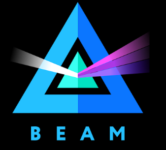
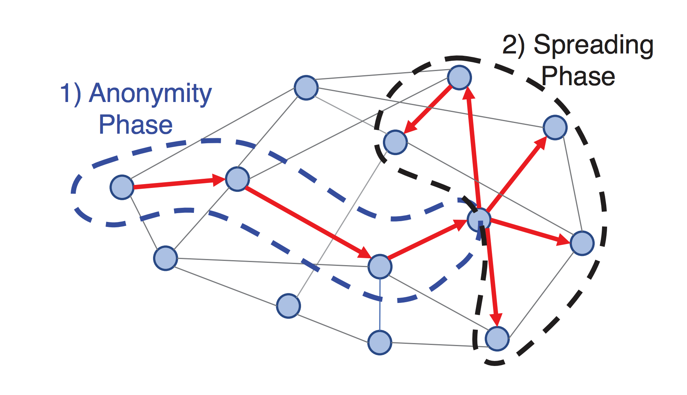

----
theme: default
paginate: true
footer: © Tari Labs, 2018-2021. (License : CC BY-NC-SA 4.0)
_class: lead
backgroundColor: #fff
----

# Grin vs. BEAM
## a comparison

 &nbsp;&nbsp;&nbsp;&nbsp;&nbsp;&nbsp; 

----

## Introduction

- Mimblewimble is a newly proposed blockchain architecture based on Pederson commitments.
    - Offers built-in privacy
    - Very compact blockchain   
- Some raw implementation differences:

|                            | ***\*Grin\****        | ***\*Beam\****            |
| -------------------------- | --------------------- | ------------------------- |
| **Language**               | Rust                  | C++                       |
| **Database**               | LMDB                  | SQLite                    |
| **Mempool data structure** | DAG                   | Multiset key-value store  |
| **Tree  Proofs**           | Merkel  trees and MMR | Radix-Hash  trees and MMR |

----

## Dandelion Relay

One piece of functionality that both projects implement outside of Mimblewimble is the Dandelion relay mechanism.

**Two phases:**
  - *Stem phase (Anonymity phase)*: Randomly forwards the transaction one peer at a time for a random distance
  - *Fluff phase (Spreading phase)*: Broadcast the transactions to the whole network

----

## Grin unique features

Grin has implemented **Partial History** syncing. This feature lets a new node to sync to the blockchain very quickly.

1. A new node queries the current head block of the chain and requests the data up to a horizon (e.g. 5000 previous blocks)
2. The node checks the embedded proofs to see if there is enough data to confirm consensus.
3. If not it will increase the horizon depth and repeat the consensus check.
4. Once a horizon is found that provides enough data for consensus the full UTXO set is downloaded at the horizon.

----

## BEAM unique features

Grin's goal is to build a minimalistic implementation of Mimblewimble.
BEAM has proposed quite a number of extensions to Mimblewimble to implement new features. Most are discussed in whitepapers and announcements but the features listed here were found in the code on Github so appear to be implemented.

----

## BEAM Transactions

- Both confidential and non-confidential UXTOs
    - Confidential UTXOs are signed by Bulletproofs 
    - Non-confidential UTXOs are signed using a custom non-confidential signature
- BEAM supports an explicit incubation period on UTXO's
- BEAM supports timelocked transactions that specify a minimum and maximum time threshold.

----

## Auditable transactions

Mimblewimble transactions are inherently private which is a desirable default. However, a business might need to demonstrate compliance to an authority.

To enable this BEAM implements auditable transactions.
- A second private/public key pair is generated by the wallet
- This key pair is used to tag the transaction
- The public key can be given to an auditing authority and used to reveal the transactions to them.
- The authority cannot use this key to tag other transactions.

----

## Reusing transaction kernels

Mimblewimble performs a cut-through process that clears out intermediate transactions from the blockchain. However, transaction kernels for every transaction are retained.

Beam supports the reuse of previous transactions kernels.
- A multiplier is applied to the prior kernel to produce a new one.
- Incentivised through lower fees.

----

## Secure BBS system for building transactions

Mimblewimble transactions need to be interactively built by the participants.
- Grin achieves through a direct socket connection.
- BEAM implements a secure BBS system that is hosted on each node.
    - Supports non-real-time transaction negotiation.

----

## One-sided transactions

BEAM supports constructing a one-sided transaction which is signed by the payee and sent to the payer to be completed and published to the blockchain at their leisure.

This is not possible in standard Mimblewimble as it would reveal the payee's blinding factor.

BEAM implements a process called **kernel fusion** which means a kernel can reference a previous kernel.
- The payee constructs the transaction with a kernel that compensates for their secret blinding factor.
- The payer completes the transaction
    - Payer chooses their blinding factor
    - Payer includes a kernel that is fused with the payee's kernel.
    - The payees kernel must appear in the final transaction.
    
----

## Planned features in BEAM

There are some features that have been mentioned in BEAM but do not seem to be implemented as yet
- Embedding plain text contracts (hash of text content) into transactions.
- Assets and confidential assets on the base layer.

----

## Proof of Work algorithms

**Grin**
- Was Cuckoo Cycle now opting for two PoW algorithms. 
    - ASIC Friendly (AF)
    - ASIC Resistant (AR)
- Now implementing Cuckatoo32+ for AR
- Still deciding on AR PoW algorithm

**BEAM**
- Equihash
- Not chasing ASIC resistance

----

## Governance models and monetary policy

Both projects are Open-Source.

|                      | ***\*Grin\****                             | ***\*Beam\****                                               |
| -------------------- | ------------------------------------------ | ------------------------------------------------------------ |
| **Governance Model** | Community Driven with Technocratic Council | Foundation                                                   |
| **Funding**          | Ad-Hoc  community funding                  | Dev tax  and VC                                              |
| **Monetary Policy**  | Inflationary with constant emission        | Deflationary set maximum supply and periodic  halving of emission |

