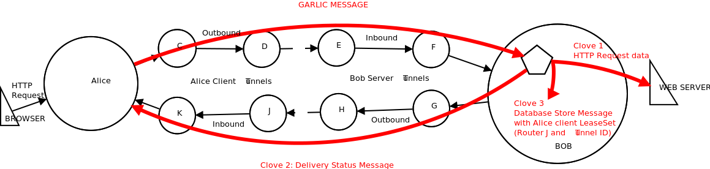

# The I2P Network - An introduction and Comparison to Tor and VPNs.

- [Introduction](#introduction)
- [What is I2P](#what-is-i2p)
- [How Does It Work](#how-does-it-work)
    + [The Infrastructure](#the-infrastructure)
- [Garlic Routing](#garlic-routing)
- [Threat Model, Security and Vulnerability Attacks](#threat-model--security-and-vulnerability-attacks)
  * [Sybil Attacks](#sybil-attacks)
  * [Eclipse Attacks](#eclipse-attacks)
  * [Brute force attacks](#brute-force-attacks)
  * [Intersection attacks](#intersection-attacks)
  * [Denial of Service Attacks](#denial-of-service-attacks)
    + [Greedy User Attacks](#greedy-user-attacks)
    + [Starvation attack](#starvation-attack)
    + [Flooding attack](#flooding-attack)
- [Comparisons to Tor](#comparisons-to-tor)
- [Conclusion](#conclusion)

## Introduction

I2P (Invisible Internet Project), Tor and VPNs (Virtual Private Networks) are well known anonymity networks used by millions of people across the world. Most people use them as a way to securely and privately browse the internet. These networks have very similar characteristics but also very big differences and hence work in very specific ways.

In this report we'll examine what the I2P network is, the paradigms of how it works, its security infrastructure and its usefulness in the blockchain domain.

## What is I2P
I2P (known as the Invisible Internet Project and founded in 2003) is a network layer that runs on a distributed network of computers on a global network infrastructure. This network layer provides a set of functions that runs on each computer and provides encrypted, one-way connections to and from other computers within the network. These functions are wrapped in a *"router"* that is installed during setup and configuration of the network.

## How Does It Work
The first concept to understand about I2P is that its primarily an enclosed network that runs within the Internet infrastructure (reffered to as the Clearnet in this paradigm). Unlike VPN's and the Tor network, which are built to communicate with the Internet anonymously, I2P works as a decentralised network of that operates within the Internet - i.e. an Internet within the internet. Interaction is done on a peer to peer level and there is no centralised authority that handles the network or keeps track of the active peers. Tor and VPNs, on the other hand have centralised authorities where the messages/data and network is managed. Since I2P works within it's own network, it is primarily made up of anonymous and hidden sites (called eepsites) that exist only within this network and are only accessible to people using I2P. These sites can be easily created using an **I2PTunnel** service that uses a standard web server. Another concept of note is I2P, by design, is not inherently an "outproxy" network i.e. it's not intended for accessing the internet. This is because the client you send a message to is the cryptographic identifier, not some IP address, so the message must be addressed to someone running I2P. Browsing the internet is however possible through opening an outproxy that allows creating an anonymous internet connection [[1]]

## The Infrastructure
1. **Routing Infrastructure & Anonymity:** I2P works by installing an I2P routing service within a user's device. This router creates temporary, encrypted, one way connections with other I2P routers on other devices. Connections are refered to as one way because they are made up of an *Outbound Tunnel* and an *Inbound Tunnel*. When communication is occurring, data leaves the user's devices via the outbound tunnels and is received on other devices through their inbound tunnels. Messages do not travel two ways within the same tunnel. Therefore, a single round-trip request message and its response between two parties needs four tunnels. [[3]].
Messages that leave one device do not travel directly to the inbound tunnel of the destination devices's intended. Instead, the outbound router queries a distributed network database by travelling through exploratory channels to get the address of the inbound router. This database is comprised of a custom Kademlia style distributed hash table (DHT), and it contains the router information and destination information.
For each application/client, the I2P router keeps a pool of tunnel pairs. Exploratory tunnels for interactions with the netDB are shared among all users of
a router. If a tunnel in the pool is about to expire or the tunnel is no longer useable the router creates a new tunnel and adds it to the pool. It is important to recall later that tunnels periodically expire every ten minutes, and hence, need to be refreshed frequently. This is a security measure, done to prevent long-lived tunnels from becoming a threat to anonymity. [[3]]

<b>Figure&nbsp;1: An Empirical Study of the I2P Anonymity Network and its
Censorship Resistance [<a href="https://censorbib.nymity.ch/pdf/Hoang2018a.pdf" title="An Empirical Study of the I2P Anonymity Network and its
Censorship Resistance">4</a>]</b>

2. **Networking & Network Database:** The Distributed Database in I2P (called netDb) contains two types of data - the router information and destination information. When a message is leaving one router, it needs to know some key pieces of data (known as *RouterInfo*) about the the other router.
This RouterInfo is stored in the Network Database with the router's identity as the Key. These keys indexing the routers and hidden services are calculated by a SHA256 hash function of a 32-byte binary search key which is concatenated with a UTC date string. The date string is added because these hash values change every day at UTC 00:00.

To request a resource (or router info), a client requests the desired key from the server node considered closest to the key. If the piece of data is located at the server node, it is returned to the client. Otherwise, the server uses its local knowledge of participating nodes and returns the server it
considers nearest to the key. If the returned server is closer to the key than the one currently tried, the client continues the search at this server. [[5]]

The Router structure comprises of: (ref: https://censorbib.nymity.ch/pdf/Hoang2018a.pdf)
- The router's identity (an encryption key, a signing key, and a certificate)
- The contact addresses at which it can be reached
- When this was created/published
- A set of arbitrary text options (related to the state/properties of the router)
- The signature of the above, generated by the identity's signing key

The Arbitrary text options are used by other routers for basic decisions. i.e. Should we connect to this router? Should we attempt to route a tunnel through this router? Does the router meet a minimum threshold for routing tunnels.

## Garlic Routing
Garlic Routing is a way of building paths/tunnels through which messages/data in the I2P network travels. When a message leaves the application/client it encrypted to the recipient's public key, then that encrypted message is encrypted with instructions specifying the next hop. This message travels this way through the each hop until it reaches the recipient.
During the transportation of the message, it is furthermore bundled with other messages. This means that any messsage travelling in the network could contain a number of other messages bundled with it. In essence, garlic routing does two things:
1. Layered Encryption
2. Bundles multiple messages together

The following image represents the end to end message bundling.

<b>Figure&nbsp;2: Elements Confidential Assets Transfer Demonstration [<a href="https://github.com/ElementsProject/confidential-assets-demo" title="ElementsProject/confidential-assets-demo">17</a>]</b>

## Threat Model, Security and Vulnerability Attacks
One of the disadvantages and limitations of the of the Tor network is it's in ability to scale and vulnerability to attacks. By design, it works by routing information through a number of intermediate nodes that eventually connect to exit nodes that work as trusted authority servers. Each of these servers keeps track of all the nodes in the network and their performance. These exit nodes also act as proxies, allowing Tor users to access the clearnet without revealing their identity.
As there are only few trusted authority servers, the integrity of these nodes is essential for the entire network, making them a valuable target for attacks. reference: https://sites.cs.ucsb.edu/~chris/research/doc/raid13_i2p.pdf

Instead of storing the network's metadata in a group of trusted authority servers, I2P keeps this data in the Distributed Hash Table. This approach makes it harder to attack the network since it runs on normal I2P nodes and provides a small group of authority servers (about 3% of the network)

In general, the I2P network has no explicit threat model specified but there are common attacks and existing defences against it.

### Sybil Attacks
The Sybil attack is a well known anonymity system attack in which the malicious user creates multiple identities as an effort to increase control over the network. Running this over the I2P network is rather difficult. This is because participants/clients in the network evaluate the performance of peers when selecting peers to interact with instead of using a random sample. Because running multiple identities on the same host impacts the performance of each of those instances, the number of additional identities running in parallel is effectively limited by the need to provide each of them with enough resources for being considered as peers. The hence means the malicious user will need a substantial amount of resources to create the multiple identities.

### Eclipse Attacks
This is an attack that compromises a node within the netDB. All requests that are requested on the netDB are answered by the node nearest to the searched key. If this node is malicious and claims not to know the key and not to know any other database server nearer to the key, the lookup will fail. I2P, however, stores the key on the eight nodes closest to the key and a requesting node will continue asking nodes further away from the key if they no longer know any candidate nearer to the searched key. Hence this attack is also ineffective against the network.

### Brute force attacks
Brute force attacks on the i2P network can be mounted by actively watching the network's messages pass between all of the nodes and attempting to correlate which message follows which path. Since all peers in the network are frequently sending messages, this attack is trivial. The attacker can send out large data (+2GB), observe all the nodes and narrow down those that routed the message. The large chunk of data is necessary because inter-router communication is encrypted and streamed i.e. 1024byte data is indistinguishable from 2048bytes. Mounting this attack is however very difficult and would need one to be an ISP in order to observe a large chunk of the network.

### Intersection attacks
These involve observing the network and node churns over time, and intersecting which peers are online when a message goes through to narrow down to a target. It is theoretically possible to mount this attack if the network is small, but impractical with a larger network.

### Denial of Service Attacks
There are a couple of these types of attacks available:

#### Greedy User Attacks
This is when a user is consuming significantly more resources than they are willing to contribute. I2P has strong defences against these as users within the network are routers by default and hence contribute to the network by design.

#### Starvation attack
A user/node may try to create a starvation attack by creating a number of bad nodes that do not provide any resources/services to the network, causing existing peers to search through a larger network database or request more tunnels than should be necessary. An attempt to find nodes can be difficult as they are not different from failing or loaded nodes. However, I2P, by design maintains a profile on all peers and attempts to identify and ignore bad performing nodes, making this attack difficult.

#### Flooding attack
In this attack the malicious user sends a large number of messages to the target's inbound tunnels or to the network at large. The targetted user can however detect this both by the contents of the message and because the tunnel's tests will fail. The user can hence identify the unresponsive tunnels, ignore them and build new ones. They can also choose to throttle the number of messages a tunnel can receive.
However, I2P has no defences for a network flooding attack but flooding the network is an incredibly difficult attack.

## Comparisons to Tor
The primary differences between Tor and I2P lie in the design/intent of the service and consequentially the threat model. The primary difference is Tor takes a directory/ central authority approach in its design i.e. clients in its network route their messages via central servers. These authority servers act as monitors of the network as well and traffic routers. I2P on the other had uses a decentralised server approach (netDB to store information about each router in the network. There are more finer differences between the two. The following table draws a comparison between the two networks.

### TABLE OF DIFFERENCES

## Conclusion

The I2P Network is a proven network for the movement of messages/data in an anonymous and secure approach. As much as it's possible to browse the internet with it, it is primarily and limited to communication within its networks Tor is, however, perfect for anonymous internet browsing and provides the tools and service for this.

Extensive research exists and continues to find ways to improve the security of these networks. This research becomes
especially important when control of a network may mean monetary losses, loss of privacy or denial of service.

## References

[[1]] What Is I2P & How Does It Compare vs. Tor Browser? [online]. Available: https://blokt.com/guides/what-is-i2p-vs-tor-browser#How_does_I2P_work. Date accessed: 2019-06-18.

[[2]]: "An overview of the I2P network". https://geti2p.net/en/docs/api/i2ptunnel  Date accessed: 2019-06-18.

[[3]]: "Practical Attacks Against The I2P Network" [Paper] https://sites.cs.ucsb.edu/~chris/research/doc/raid13_i2p.pdf. Date accessed: 2019-06-18

[[4]] An Empirical Study of the I2P Anonymity Network and its
Censorship Resistance" [online]. Available: https://censorbib.nymity.ch/pdf/Hoang2018a.pdf. Date accessed: 2019-06-18.

[[5]] https://sites.cs.ucsb.edu/~chris/research/doc/raid13_i2p.pdf Date accessed: 2019-06-18.

## Contributors

- https://github.com/mhlangagc
- https://github.com/hansieodendaal
- <https://github.com/anselld>
