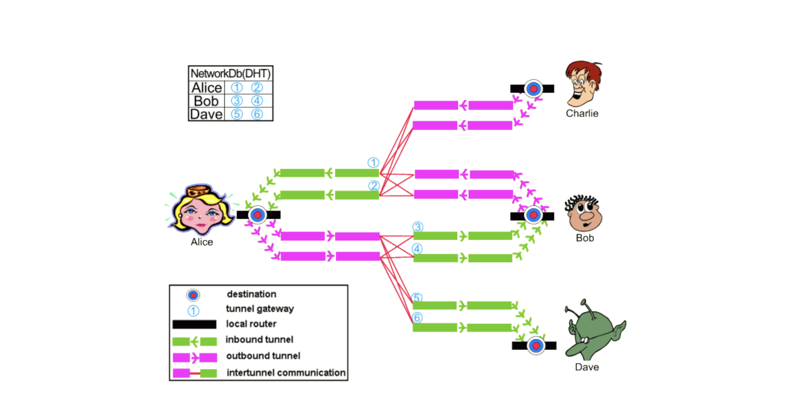

# Introduction to I2P Network and Comparison with Tor

- [Background](#background)
- [Introduction to I2P Network](#introduction-to-i2p-network)
    - [What is I2P?](#what-is-i2p)
    - [How does it Work?](#how-does-it-work)
    - [Infrastructure](#infrastructure)
      - [Routing Infrastructure and Anonymity](#routing-infrastructure-and-anonymity)
      - [Networking and Network Database](#networking-and-network-database)
      - [Floodfill Routers](#floodfill-routers)
      - [Garlic Routing](#garlic-routing)
- [Threat Model, Security and Vulnerability Attacks](#threat-model-security-and-vulnerability-attacks)

    - [Sybil Attacks](#sybil-attacks)
    * [Eclipse Attacks](#eclipse-attacks)
    * [Brute Force Attacks](#brute-force-attacks)
    * [Intersection Attacks](#intersection-attacks)
    * [Denial of Service Attacks](#denial-of-service-attacks)
      + [Greedy User Attack](#greedy-user-attack)
      + [Starvation Attack](#starvation-attack)
      + [Flooding Attack](#flooding-attack)
- [Comparison with Tor](#comparison-with-tor)
- [Conclusion](#conclusion)
- [References](#references)
- [Contributors](#contributors)

## Background
Invisible Internet Project (I2P), Tor and Virtual Private Networks (VPNs) are well-known anonymity networks used by
millions of people across the world. Most people use them as a way to securely and privately browse the Internet. These
networks have very similar characteristics but also very big differences and hence work in very specific ways.

In this report we'll examine what the I2P network is, the paradigms of how it works, its security infrastructure and its
usefulness in the blockchain domain.

## Introduction to I2P Network

### What is I2P?
I2P (known as the Invisible Internet Project and founded in 2003) is a low-latency network layer that runs on a distributed 
network of computers on a global network infrastructure. It is primarily built into applications such as email, Internet Relay Chat (IRC) and file 
sharing [[6]]. This network layer provides a set of functions that runs on each
computer and provides encrypted, one-way connections to and from other computers within the network. These functions are
wrapped in a *"router"* that is installed during setup and configuration of the network.

### How does it Work?
Regarding I2P, the first concept to understand is that it is primarily an enclosed network that runs within the Internet
infrastructure (referred to as the clearnet in this paradigm). Unlike VPNs and the Tor network, which are built to
communicate with the Internet anonymously, I2P works as a decentralized network that operates within the Internet, i.e. an Internet within the Internet. Interaction is done on a peer-to-peer (node-to-node) level and there is no 
centralized authority that handles the network or keeps track of the active peers. A node in the network can either be a 
server that hosts a darknet service, or a client who accesses said servers to use their services [[6]]. Tor and VPNs, 
on the other hand, have centralized authorities where the messages/data and network are managed. Since I2P works within its 
own network, it is primarily made up of anonymous and hidden sites (called eepsites) that exist only within this network 
and are only accessible to people using I2P. These sites can easily be created using an **I2PTunnel** service that uses 
a standard web server.

Another concept of note regarding I2P is that by design, it is not inherently an "outproxy" network, i.e. it is not 
intended for accessing the Internet. This is because the client to whom you send a message is the cryptographic identifier, 
not some IP address. The message must therefore be addressed to someone running I2P. Browsing the Internet is, however, possible 
through opening an outproxy that allows an anonymous Internet connection to be created ([[1]], [[2]]).

### Infrastructure
#### Routing Infrastructure and Anonymity

I2P works by installing an I2P routing service within a user's device. This router creates temporary, encrypted, one-way 
connections with other I2P routers on other devices. Connections are referred to as one way because they are made up of 
an *Outbound Tunnel* and an *Inbound Tunnel*. When communication occurs, data leaves the user's devices via the 
outbound tunnels and is received on other devices through their inbound tunnels. Messages do not travel in two directions within 
the same tunnel. Therefore, a single round-trip request message and its response between two parties needs four tunnels [[4]], as shown in Figure 1.
Messages that leave one device do not travel directly to the inbound tunnel of the destination devices intended.
Instead, the outbound router queries a distributed network database by travelling through exploratory channels to get
the address of the inbound router. This database is comprised of a custom Kademlia style Distributed Hash Table (DHT)
that contains the router information and destination information.
For each application/client, the I2P router keeps a pool of tunnel pairs. Exploratory tunnels for interactions with the
network database are shared among all users of
a router. If a tunnel in the pool is about to expire or if the tunnel is no longer usable, the router creates a new tunnel
and adds it to the pool. It is important to recall later that tunnels periodically expire every ten minutes and, hence,
need to be refreshed frequently. This is a security measure, done to prevent long-lived tunnels from becoming a threat
to anonymity [[3]].

<b>Figure&nbsp;1: Network Topology [<a href="https://www.delaat.net/rp/2017-2018/p97/presentation.pdf" title="Network Topology">6</a>]</b>

#### Networking and Network Database

The distributed network database in I2P (called netDb) contains two types of data:

- router information; and
- LeaseSets.

**Router Information.** When a message is leaving one router, it needs to know some key pieces
of data (known as *RouterInfo*) about the other router.
This RouterInfo is stored in the netDb with the router's identity as the key. These keys indexing the routers
and hidden services are calculated by a Secure Hash Algorithm (SHA) hash function (SHA256) of a 32-byte binary search key, which is concatenated with a
Universal Coordinated Time (UTC) date string. The date string is added because these hash values change every day at UTC 00:00 - a key security measure.

To request a resource (or RouterInfo), a client requests the desired key from the server node considered to be closest to the
key. If the piece of data is located at the server node, it is returned to the client. Otherwise, the server uses its
local knowledge of participating nodes and returns the server it considers to be nearest to the key. If the returned server is
closer to the key than the one currently tried, the client continues the search at this server [[3]].

The router structure comprises ([[4]], [[6]]):

- The router's identity - an encryption key, a signing key and a certificate.
- The contact addresses at which it can be reached - protocol, Internet Protocol (IP), port.
- When this was created or published.
- Options - a set of arbitrary text options, e.g. bandwidth of router.
- The signature of the above, generated by the identity's signing key.

**LeaseSets.** The LeaseSet specifies tunnel entry point to reach an endpoint. This specifies the routers that can directly
contact the desired destination. It contains the following data:

- Tunnel gateway router - given by specifying its identity.
- Tunnel ID - tunnel used to send messages.
- Tunnel expiration - when the tunnel will expire.
- Destination itself - similar to router identity.
- Signature - used to verify the LeaseSet.

#### Floodfill Routers
Special routers, referred to as *floodfill routers*, are responsible for storing the netDb. Participation in the floodfill 
pool can either be automatic or manual. Automatic participation occurs whenever the number of floodfill routers drops 
below a certain threshold, which is currently 6% of all nodes in the network ([[6]], [[7]]). When this happens, a node is 
selected to participate as a floodfill router based on criteria such as uptime and bandwidth. It should be noted that 
approximately 95% of floodfill routers are automatic [[8]]. The netDb is stored in a DHT format within 
the floodfill routers. A resource is requested from the floodfill router considered to be closest to that key. To have a 
higher success rate on a lookup, the client is able to iteratively look up the key. This means that the lookup continues 
with the next-closest peer should the initial lookup request fail.

#### Garlic Routing
Garlic routing is a way of building paths/tunnels through which messages/data in the I2P network travels. When a message
leaves the application/client, it is encrypted to the recipient's public key. That encrypted message is then encrypted with
instructions specifying the next hop. This message travels in this way through each hop until it reaches the recipient.
During the transportation of the message, it is bundled with other messages. This means that any message
travelling in the network could contain a number of other messages bundled with it. In essence, garlic routing does two
things:

- Provides layered encryption.
- Bundles multiple messages together.

Figure&nbsp;2 illustrates the end-to-end message bundling:

<b>Figure&nbsp;2: Garlic Routing </b>

## Threat Model, Security and Vulnerability Attacks
The disadvantages or limitations of the Tor network include its inability to scale and its vulnerability to attacks. 
By design, it works by routing information through a number of intermediate nodes, which eventually connect to exit nodes 
that work as trusted authority servers. Each of these servers keeps track of all the nodes in the network and their 
performance. These exit nodes also act as proxies, allowing Tor users to access the clearnet without revealing their 
identity. As there are only few trusted authority servers, the integrity of these nodes is essential for the entire 
network, making them a valuable target for attacks [[3]].

Instead of storing the network's metadata in a group of trusted authority servers, I2P keeps this data in the DHT. This approach makes it harder to attack the network, since it runs on normal I2P nodes and provides a small 
group of authority servers (approximately 3% of the network).

In general, no explicit threat model is specified for the I2P network. However, there are common attacks and existing defences against these attacks, as described in the following sections.

### Sybil Attacks
The Sybil attack, illustrated in Figure&nbsp;3, is a well-known anonymity system attack in which the malicious user creates multiple identities in an 
effort to increase control over the network. Running this over the I2P network is rather difficult. This is because 
participants/clients in the network evaluate the performance of peers when selecting peers to interact with, instead of 
using a random sample. Because running multiple identities on the same host affects the performance of each of those 
instances, the number of additional identities running in parallel is effectively limited by the need to provide each of 
them with enough resources to be considered as peers. The means that the malicious user will need a substantial 
amount of resources to create the multiple identities.

<b>Figure&nbsp;3: Sybil Attack Illustration [<a href="https://www.delaat.net/rp/2017-2018/p97/presentation.pdf" title="Network Topology">5</a>]</b>

### Eclipse Attacks
In eclipse attacks, a set of malicious and colluding nodes arranges that a good node can 
peer only with malicious nodes. So the union of malicious nodes fools the good node into writing its
addresses into neighboring lists of good nodes. In a Sybil attack, a single malicious node possesses a large number of 
identities in the network to control some part of the network. If an attacker wants to continue a Sybil attack into an eclipse 
attack, the attacker will try to place the malicious nodes in the strategic routing path in such a way that all traffic 
will pass through the attacker's node. However, the eclipse attack is possible even if there is a defence, such as certified node identities, against the Sybil 
attack [[8]].

### Brute Force Attacks
Brute force attacks on the I2P network can be mounted by actively watching the network's messages pass between all of 
the nodes and attempting to correlate which message follows which path. Since all peers in the network are frequently 
sending messages, this attack is trivial. The attacker can send out large amounts of data (more than 2GB), observe all the nodes and narrow 
down those that routed the message. The large chunk of data is necessary because inter-router communication is encrypted 
and streamed, i.e. 1024&nbsp;byte data is indistinguishable from 2048&nbsp;byte data. Mounting this attack is, however, very difficult and 
one would need to be an Internet Service Provider (ISP) in order to observe a large chunk of the network.

### Intersection Attacks
Intersection attacks involve observing the network and node churns over time, and intersecting the peers that are online when a message 
goes through, in order to narrow down to a target. It is theoretically possible to mount this attack if the network is small, but 
impractical with a larger network.

### Denial of Service Attacks
Denial of service attacks include the following:

#### Greedy User Attack
A greedy user attack occurs when a user is consuming significantly more resources than they are willing to contribute. I2P has strong 
defences against these attacks, as users within the network are routers by default and hence contribute to the network by design.

#### Starvation Attack
A user/node may try to launch a starvation attack by creating a number of bad nodes that do not provide any resources or services to the network, causing existing peers to search through a larger network database or request more tunnels than 
should be necessary. An attempt to find nodes can be difficult, as they are not different to failing or loaded nodes. 
However, I2P, by design, maintains a profile of all peers and attempts to identify and ignore poorly performing nodes, making 
this attack difficult.

#### Flooding Attack
In a flooding attack, the malicious user sends a large number of messages to the target's inbound tunnels or to the network at 
large. The targeted user can, however, detect this by the contents of the message and because the tunnel's tests will 
fail. The user can hence identify the unresponsive tunnels, ignore them and build new ones. They can also choose to 
throttle the number of messages a tunnel can receive. Although I2P has no defences against a network flooding attack, it is incredibly difficult to flood the network.

## Comparison with Tor
The primary differences between Tor and I2P lie in the design/intent of the service and consequentially the threat model. 
Tor takes a directory/central authority approach in its design, i.e. clients in its network 
route their messages via central servers. These authority servers act as monitors of the network as well as traffic
routers. I2P, on the other hand, uses a decentralized server approach (netDb) to store information about each router in the 
network. Table&nbsp;1 compares the finer differences between the two networks:

<b>Table 1: Differences between I2P and Tor</b>

| I2P                                     | Tor                       |
| ---------------------------------       | --------------------------|
| Fully peer to peer and self-organizing | Server                         |
| Query netDb to find destination’s inbound tunnel gateway | Centralized authority/directory to relay data     |
| Limited to no exit nodes. Internal communication only | Designed and optimized for exit traffic, with a large number of exit nodes          |
| Designed primarily for file sharing    | Designed for anonymous Internet access |
| Garlic routing                          | Onion routing                       |
| Unidirectional tunnels                 | Rendezvous point                        |
| Significantly smaller user base      | Bigger user base        |
| Floodfill peers ("directory servers") are varying and untrusted | Hard-coded central authority |
| Tunnels in I2P are short-lived | Tor tunnels have a long-lived capacity.

**Source:** ([[9]], [[10]], [[11]]).

## Conclusion

The I2P network is a proven network for moving messages/data anonymously and securely. Regarding the possibility of using I2P to browse the Internet, it is primarily limited to communication within its networks. Tor, however, is perfect for anonymous Internet browsing, and provides the tools and service for doing this.

Extensive research exists and continues to find ways to improve the security of these networks. This research becomes
especially important when control of a network may mean monetary losses, loss of privacy or denial of service.

## References

[[1]] B. Mann, "What Is I2P & How Does It Compare vs. Tor Browser?" [Online.]
Available: <https://blokt.com/guides/what-is-i2p-vs-tor-browser#How_does_I2P_work>. Date accessed: 2019&#8209;06&#8209;18.

[1]: https://https://blokt.com/guides/what-is-i2p-vs-tor-browser#How_does_I2P_work
"What Is I2P & 
How Does It Compare vs. 
Tor Browser?"

[[2]]: I2P: "I2PTunnel" [online]. Available: <https://geti2p.net/en/docs/api/i2ptunnel>. Date accessed: 2019&#8209;06&#8209;18.

[2]: https://geti2p.net/en/docs/api/i2ptunnel
"I2PTunnel"

[[3]]: C. Egger, J. Schlumberger, C. Kruegel and G. Vigna, "Practical Attacks Against the I2P Network" - Paper [online]. 
Available: <https://sites.cs.ucsb.edu/~chris/research/doc/raid13_i2p.pdf>. Date accessed: 2019&#8209;06&#8209;18.

[3]: https://sites.cs.ucsb.edu/~chris/research/doc/raid13_i2p.pdf
"Practical Attacks Against
the I2P Network"

[[4]] N. P. Hoang, P. Kintis, M. Antonakakis and M. Polychronakis, "An Empirical Study of the I2P Anonymity Network and 
its Censorship Resistance" [online]. Available: <https://censorbib.nymity.ch/pdf/Hoang2018a.pdf>. Date accessed: 
2019&#8209;06&#8209;18.

[4]: https://censorbib.nymity.ch/pdf/Hoang2018a.pdf
"An Empirical Study 
of the I2P Anonymity 
Network and its
Censorship Resistance"

[[5]] K. Alachkar and D. Gaastra, "Mitigating Sybil Attacks on the I2P Network Using Blockchain" - Presentation [online]. 
Available: <https://www.delaat.net/rp/2017-2018/p97/presentation.pdf>. Date accessed: 2019&#8209;06&#8209;20.

[5]: https://www.delaat.net/rp/2017-2018/p97/presentation.pdf
"Mitigating Sybil Attacks 
on the I2P Network 
Using Blockchain"

[[6]] K. Alachkar and D. Gaastra, "Blockchain-based Sybil Attack Mitigation: A Case Study of the I2P Network" - Report 
[online]. Available: <https://delaat.net/rp/2017-2018/p97/report.pdf>. Date accessed: 2019&#8209;06&#8209;20.

[6]: https://delaat.net/rp/2017-2018/p97/report.pdf
"Blockchain-based Sybil 
Attack Mitigation: 
A Case Study of the 
I2P Network"

[[7]] I2P: "The Network Database" [online]. Available: <https://geti2p.net/en/docs/how/network-database>. Date accessed: 
2019&#8209;06&#8209;20.

[7]: https://geti2p.net/en/docs/how/network-database
"The Network Database"

[[8]] H. Vhora and G. Khilari, "Defending Eclipse Attack in I2P using Structured
Overlay Network" [online]. Available: <http://ijsetr.org/wp-content/uploads/2015/05/IJSETR-VOL-4-ISSUE-5-1515-1518.pdf>. 
Date accessed: 2019&#8209;06&#8209;20.

[8]: http://ijsetr.org/wp-content/uploads/2015/05/IJSETR-VOL-4-ISSUE-5-1515-1518.pdf
"Defending Eclipse Attack 
in I2P using Structured
Overlay Network"

[[9]] M. Ehlert, "I2P Usability vs. Tor Usability - A Bandwidth and Latency Comparison" [online]. 
Available: <https://pdfs.semanticscholar.org/aa81/79d3da24b643a4d004c44ebe543000295d51.pdf>. Date accessed: 2019&#8209;06&#8209;20.

[9]: https://pdfs.semanticscholar.org/aa81/79d3da24b643a4d004c44ebe543000295d51.pdf
"I2P Usability vs. 
Tor Usability - 
A Bandwidth and Latency 
Comparison"

[[10]] I2P: "I2P Compared to Tor" [online]. Available: <https://geti2p.net/en/comparison/tor>. Date accessed: 2019&#8209;06&#8209;20.

[10]: https://geti2p.net/en/comparison/tor
"I2P Compared to Tor"

[[11]] I2P: "I2P Compared to Tor and Freenet" [online]. Available: <http://www.geti2p.org/how_networkcomparisons.html>. 
Date accessed: 2019&#8209;06&#8209;20.

[11]: http://www.geti2p.org/how_networkcomparisons.html
"I2P Compared to Tor 
and Freenet"

## Contributors

- <https://github.com/mhlangagc>
- <https://github.com/hansieodendaal>
- <https://github.com/anselld>
