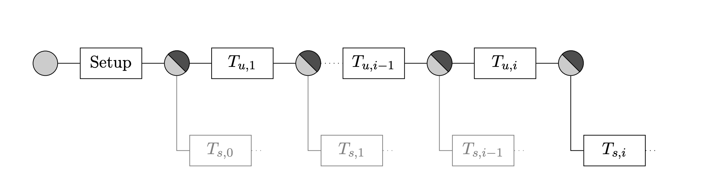
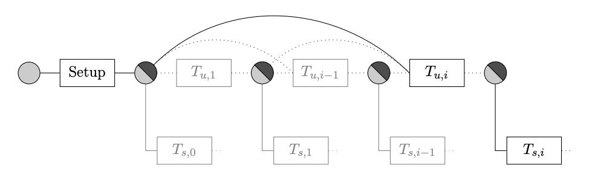

# Laser Beam

- [Laser Beam](#laser-beam)
  - [Introduction](#introduction)
  - [Eltoo](#eltoo)
  - [Graftroot](#graftroot)
  - [Statechain Detail](#statechain-detail)
  - [Conclusions, Observations and Recommendations](#conclusions-observations-and-recommendations)
  - [References](#references)
  - [Contributors](#contributors)


## Introduction

Statechains ([[1]]) is a layer-2 scaling technology for bitcoin. This makes use of a side-chain between a user and a statechain entity. 
Being layer-2 means that most of the transitioning takes place of the blockchain. But it inherits all of the security of layer-1, 
which is the code blockchain so that it still is secure. This was first discussed in a conference talk at "Scaling Bitcoin" in Tokyo ([[2]]). 

Statechains is built using Eltoo ([[3]]) and Graftroot ([[4]]). Eltoo is a  way to create and manage a list of ordered transactions that don’t have to be all published to the blockchain and only the last update transaction needs to be published. Graftroot is a new way to obtain threshold signature scripts. 

## Eltoo
Eltoo ([[5]]) was created by Decker et al. This is a layer 2 protocol that allows the user the create a string of transactions while only publishing the initial setup transaction and the final update transaction. 

One of the biggest problems in a blockchain is the sequence of transactions. This is usually solved by confirming the transaction in the blockchain first. This allows the order to be recorded in the ledger of the blockchain. If transactions are not yet recorded on the blockchain ordering is near impossible since the order is only decided by the miner, and they decide purely on fees and not on the actual order of transactions. Eltoo tries to bring in the ordering of transactions so that blockchain can know which one came first. 

Eltoo ([[6]]) has 3 phases: setup, negotiating, and settlement. The setup phase of Eltoo is made up of the parties creating the on-chain Eltoo UTXO. This utxo is created with a 2-of-2 multisig utxo with a settlement transaction contained in it. This UTXO contains what can be described as an if-else. The first part is the settlement and the latter is the spending of the utxo. An example of which can be seen below:

```
OP_IF
  10 OP_CSV
  2 As,i Bs,i 2 OP_CHECKMULTISIGVERIFY
OP_ELSE
  <Si + 1> OP_CHECKLOCKTIMEVERIFY
  2 Au Bu 2 OP_CHECKMULTISIGVERIFY
OP_ENDIF
```

The first branch of the if, contains the settlement transactions, which is a timelock transaction, in this case, 10 blocks. The latter part contains the update branch, this is only valid if both parties work together to sign the 2-of-2 multi-sig. The working of this UTXO is very similar to that of an HTLC UTXO, but crucially much simpler.

Phase 2 of Eltoo is the update phase. This transaction "double" spends the settlement part of the funding transaction. Every new "update" transaction will contain the same script as above. The one problem here is now, is that we need to order the update transactions to know which one is valid. If they spend each other and need to follow each other, and they all need to be on the blockchain. But Eltoo skips update transaction so that not everyone needs to be published. 

The problem with skipping transactions is that you need to specify the inputs before the transaction can be validated. Eltoo goes around this with a new script flag: `SIGHASH_NOINPUT`. This creates a new floating transaction. This is only matched to the previous transaction by matching the scripts. By using this flag, you can create new transactions in any order. But the transactions still need to be ordered. 

Eltoo does this by reusing the timelock fields in the transactions. The timestamps in transactions use a Unix timestamp. But the bitcoin protocol assumes if this number is below 500 million, the timestamp is a block height as this will be too low for the block to have been created in that timestamp in bitcoin. Eltoo takes this one step further and assumes timestamps between 500 million and 1.5 billion as not lock hights but rather tx counters. This does not break the current lock heights in bitcoin as these timestamps have all passed. By using these the Eltoo can order the transactions. 

This update step is repeated until the transaction either closes with the settlement phase or via both parties creating a new finalized state. This allows the parties to only publish some of the update transactions. All are valid. But only one needs to be published to the blockchain for them to finalize. An example can be seen below in figure 1 and figure 2. 

<p align="center"></p>
<div align="center"><b>Figure&nbsp;1: Eltoo transaction flow</b></div>


<p align="center"></p>
<div align="center"><b>Figure&nbsp;2: Eltoo update transaction flow</b></div>

Figure 1 shows the setup and how the transactions are created. Figure 2 shows how the update transactions are created and how they can be skipped. 

## Graftroot

Bitcoin has a proposal to expand its scripting to include Taproot ([[7]]). But the Taproot smart contract system can be very complex. Graftroot provides very similar benefits without the complexity ([[4]]).  Both of these proposals were written by Gregory Maxwell. With Graftroot participants only creates threshold signatures, in contrast with Taproot where participants need to tweak the threshold public key as well. 

In Graftroot participants create scripts that contain the alternative conditions under which the Bitcoin can be spent. These are then signed with the threshold signatures. The participants will only create a threshold signature for the script they participate in. All participants have to sign all the scripts thou. This requires that all the creation of a Graftroot signature script be interactive.  

## Statechain Detail

Statechains begin with signing a 2-of-2 multi-sig with a statechain entity. This entity s represented by a group of members, that is controlled by an n-of-m multi-sig similar to other sidechains. Users sign their UTXO's into an Eltoo transaction that is partly controlled by the statechain entity. 

When users want to transact with their UTXO they with the statechain entity create a new Eltoo update transaction that signs over the UTXO to a new user. The user gives his key over he is using in the transaction and signs an adaptor signature with the statechain entity. These signatures will allow someone to detect shenanigans. 

The statechain entity can only move the money in cooperation with users. It can move the money in cooperation with any of the users. But it promises to only do so with the last user of the utxo. The adaptor signatures are used to detect if this was not the case. But this will only be apparent if a user comes forward with a different adaptor signature. 

Because statechains are not on-chain, they can do atomic swaps. But one limitation of statechains is that users can only transfer single complete UTXO's over to another party. If smaller UTXO's are desired they need to be swapped for other users who have the correct amount or a lightning channel needs to be opened on the channel. Statechains allow users to use a lightning channel utxo as well. This allows users to change and swop to larger UTXO's for use in their lightning channel. The statechain entity does not even know it’s a lightning channel. 


## Conclusions, Observations and Recommendations

Statechains is a relatively intreating idea, but it does go against the scope of most of the blockchain space in that is not entirely trustless. Although coins in the statechain are relatively safe in that the statechain entity cannot steal the funds of users and users themselves cannot steal funds. It is still possible for the two to collide and steal the funds. All that stops this is the reputation of the statechain entity.

## References

[[1]] R. Somsen, "Statechains: Non-custodial Off-chain Bitcoin Transfer" \[online\]. Available: 
<https://medium.com/@RubenSomsen/statechains-non-custodial-off-chain-bitcoin-transfer-1ae4845a4a39>. Date accessed: 2020&#8209;11&#8209;09.

[1]: https://medium.com/@RubenSomsen/statechains-non-custodial-off-chain-bitcoin-transfer-1ae4845a4a39
"LStatechains: Non-custodial Off-chain Bitcoin Transfer"

[[2]] R. Somsen, "Tokyo - Scaling bitcoin" \[online\]." Available: 
<http://youtu.be/FI9cwksTrQs?t=47m36s>. Date accessed: 2020&#8209;11&#8209;09.

[2]: http://youtu.be/FI9cwksTrQs?t=47m36s
"Tokyo - Scaling bitcoin"

[[3]] C. Decker, "eltoo: A Simplified Update Mechanism for Lightning and Off-Chain Contracts" \[online\]. Available: 
<https://blockstream.com/2018/04/30/en-eltoo-next-lightning/>. Date accessed: 2020&#8209;11&#8209;09.

[3]: https://blockstream.com/2018/04/30/en-eltoo-next-lightning/
"eltoo: A Simplified Update Mechanism for Lightning and Off-Chain Contracts"

[[4]] A. van Wirdum, "Graftroot: How Delegating Signatures Allows For Near-Infinite Spending Variations" \[online\]. Available: 
<https://bitcoinmagazine.com/articles/graftroot-how-delegating-signatures-allows-near-infinite-spending-variations>. Date accessed: 2020&#8209;11&#8209;09.

[4]: https://bitcoinmagazine.com/articles/graftroot-how-delegating-signatures-allows-near-infinite-spending-variations
"Graftroot: How Delegating Signatures Allows For Near-Infinite Spending Variations"

[[5]] C. Decker, R. Russel, o. Osuntokun, "eltoo: A Simple Layer2 Protocol for Bitcoin" \[online\]. Available: 
<https://blockstream.com/eltoo.pdf>. Date accessed: 2020&#8209;11&#8209;09.

[5]: https://blockstream.com/eltoo.pdf
"eltoo: A Simple Layer2 Protocol for Bitcoin"

[[6]] S. Tikhomirov, "Eltoo" \[online\]. Available: 
<https://s-tikhomirov.github.io/eltoo/>.  Date accessed: 2020&#8209;11&#8209;09.

[6]: https://s-tikhomirov.github.io/eltoo/
"Eltoo"

[[7]] A. van Wirdum, "Taproot Is Coming: What It Is, And How It Will Benefit Bitcoin" \[online\]. Available: 
<https://bitcoinmagazine.com/articles/taproot-coming-what-it-and-how-it-will-benefit-bitcoin>. Date accessed: 2020&#8209;11&#8209;09.

[7]: https://bitcoinmagazine.com/articles/taproot-coming-what-it-and-how-it-will-benefit-bitcoin
"Taproot Is Coming: What It Is, And How It Will Benefit Bitcoin"


## Contributors

- <https://github.com/SWvheerden>
