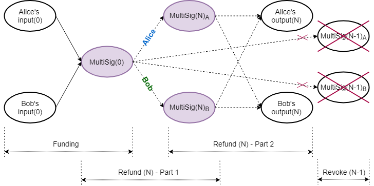
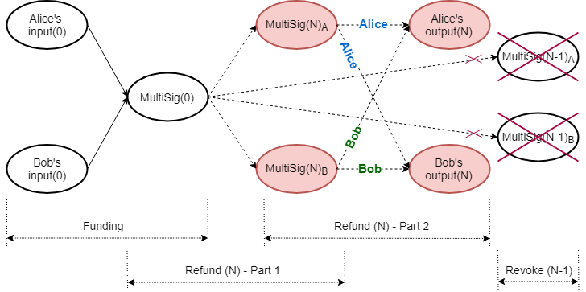
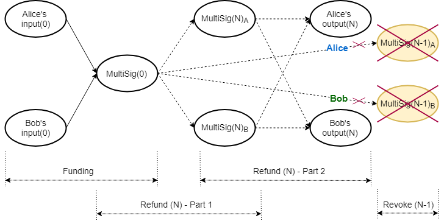

# Laser Beam

- [Introduction](#introduction)
- [Detail Scheme](#detail-scheme)
  - [Funding Transaction](#funding-transaction)
  - [Refund Procedure](#refund-procedure)
    - [Alice - Part 1](#alice---part-1)
    - [Bob - Part 1](#bob---part-1)
    - [Alice - Part 2](#alice---part-2)
    - [Bob - Part 2](#bob---part-2)
  - [Revoke Previous Refund](#revoke-previous-refund)
  - [Punishment Transaction](#punishment-transaction)
  - [Channel Closure](#channel-closure)
- [Conclusions, Observations and Recommendations](#conclusions-observations-and-recommendations)
- [Appendices](#appendices)
  - [Appendix A: Notation Used](#appendix-a-notation-used)
- [References](#references)
- [Contributors](#contributors)

## Introduction

Proof-of-Work (PoW) blockchains are notoriously slow, as transactions need to be a number of blocks in the past to be 
confirmed, and have poor scalability properties. A payment channel 
is a class of techniques designed to allow two or more parties to make multiple blockchain transactions, without 
committing all of the transactions to the blockchain. Resulting funds can be committed back to the blockchain. Payment 
channels allow multiple transactions to be made within off-chain agreements. They keep the operation mode of the 
blockchain protocol, but change the way in which it is used in order to deal with the challenge of scalability [[1]].

The [Lightning Network](../../protocols/lightning-network-for-dummies/sources/PITCHME.link.md) is a second-layer payment 
protocol that was originally designed for Bitcoin, and which enables instant transactions between participating nodes. 
It features a peer-to-peer system for making micropayments through a network of bidirectional payment channels. The 
Lightning Network's dispute mechanism requires all users to constantly watch the blockchain for fraud. Various mainnet 
implementations that support Bitcoin exist and, with small tweaks, some of them are also able to support Litecoin 
([[2]], [[3]], [[4]], [[10]]).

Laser Beam is an adaptation of the Lightning Network for the [Mimblewimble](../../protocols/mimblewimble-1/MainReport.md) 
protocol, to be implemented for Beam ([[5]], [[6]], [[7]]). At the time of writing of this report (November&nbsp;2019), 
the specifications were far advanced, but still work in progress. Beam has a working demonstration in its mainnet 
repository, which at this stage demonstrates off-chain transactions in a single channel between two parties [[8]]. 
According to the Request for Comment (RFC) documents, Beam plans to 
implement routing across different payment channels in the Lightning Network style.

## Detail Scheme

Beam's version of a multisignature (MultiSig) is actually a $2\text{-of-}2$ multiparty Unspent Transaction Output (UTXO), 
where each party keeps its share of the blinding factor of the Pedersen commitment, 
$C(v,k_{1}+k_{2})=\Big(vH+(k_{1}+k_{2})G\Big)$, secret. (Refer to [Appendix A](#appendix-a-notation-used) for notation 
used.) The multiparty commitment is accompanied by a single multiparty Bulletproof range proof, similar to that employed 
by [Grin](../../protocols/mimblewimble-mp-bp-utxo/MainReport.md#utilizing-grins-shared-bulletproof-computation), 
where the individual shares of the blinding factor are used to create the combined range proof [[9]].

In the equations that follow Alice's and Bob's contributions are denoted by subscripts $\_{a}$ and $\_{b}$ respectively; 
$f$ is the fee and $\mathcal{X}$ is the excess. Note that blinding factors denoted by $\hat{k}$, $k^{\prime}$ and 
$k^{\prime\prime}$, and values denoted by $v^{\prime}$ and $v^{\prime\prime}$, have a special purpose, discussed later, 
so that $\hat{k}\_{N\_{a}} \neq k\_{N\_{a}} \neq k^{\prime} \neq k^{\prime\prime}\_{N\_{a}}$ and $v\_{N\_{a}} 
\neq v^{\prime}\_{N\_{a}} \neq v^{\prime\prime}\_{N\_{a}}$. 

### Funding Transaction

The parties collaborate to create the multiparty UTXO (i.e. commitment and associated multiparty range proof), combined 
on‑chain funding transaction (Figure&nbsp;1) and an initial refund transaction for each party (off‑chain). All refund 
transactions have a relative time lock in their kernel, referencing the kernel of the original combined funding 
transaction, which has to be confirmed on the blockchain.

<b>Figure&nbsp;1: Laser Beam Funding for Round (N)</b>

The initial funding transaction between Alice and Bob is depicted in (1). The lock height in the signature challenge 
corresponds to the current blockchain height. Input commitment values and blinding factors are identified by superscript 
$^{\prime\prime}$.

$$
\begin{aligned}
  \begin{aligned}
    -\text{Inputs}(0)+\text{MultiSig}(0)+\text{fee}\end{aligned} &= \text{Excess}(0) \\\\
    -\Big((v^{\prime\prime}\_{0_{a}}H+k^{\prime\prime}\_{0_{a}}G)+(v^{\prime\prime}\_{0_{b}}H+k^{\prime\prime}\_{0_{b}}G)\Big)+\Big(v_{0}H+(k_{0_{a}}+k_{0_{b}})G\Big)+fH       &= \mathcal{X}_{0}
  \end{aligned}
\mspace{50mu} (1)
$$

Alice and Bob also need to set up their own respective refund transactions so they can be compensated should the channel 
never be used; this is performed via a refund procedure. A refund procedure (off‑chain) consists of four parts, whereby 
each user creates two transactions: one kept partially secret (discussed below) and the other shared. Each partially 
secret transaction creates a different intermediate multiparty UTXO, which is then used as input in two shared 
transactions, to spending the same set of outputs to each participant.

All consecutive refund procedures work in exactly the same way. In the equations that follow, double subscripts 
$\_{AA}$, $\_{AB}$, $\_{BA}$ and $\_{BB}$ have the following meaning: the first letter and the second letter indicate 
who controls the transaction and who created the value, respectively. Capitalized use of $R$ and $P$ denotes public 
nonce and public blinding factor respectively. The $N\_{\text{th}}$ refund procedure is as follows:

### Refund Procedure

#### Alice - Part 1

<b>Figure&nbsp;2: Laser Beam Refund Part 1 for Round (N)</b>

Alice and Bob set up Alice's intermediate MultiSig funding transaction (Figure&nbsp;2), spending the original funding 
MultiSig UTXO. The lock height $h\_{N}$ corresponds to the current blockchain height. 

$$
\begin{aligned}
  -\text{MultiSig}(0)+\text{MultiSig}(N)\_{A}+\text{fee} 
       & =\text{Excess}(N)\_{A1} \\\\
  -\Big(v\_{0}H+(k_{0\_{a}}+k\_{0\_{b}})G\Big) + \Big((v\_{0}-f)H+(\hat{k}\_{N\_{a}}+k\_{N\_{b}})G\Big) + fH 
       &= \mathcal{X}\_{N\_{A1}} 
\end{aligned}
\mspace{50mu} (2)
$$

They collaborate to create $\text{MultiSig}(N)\_{A}$, its Bulletproof range proof, the signature challenge and Bob's 
portion of the signature, $s\_{N\_{AB1}}$. Alice does not share the final kernel and thus keeps her part of the 
aggregated signature, $s\_{N\_{AA1}}$, hidden.

$$
\begin{aligned}
  \mathcal{X}\_{N\_{A1}} &= (-k_{0\_{a}}+\hat{k}\_{N\_{a}})G+(-k\_{0\_{b}}+k\_{N\_{b}})G \\\\ 
                         &= P\_{N\_{AA1}}+P\_{N\_{AB1}}
\end{aligned}
\mspace{50mu} (3)
$$

$$
\begin{aligned}
  \text{Challenge:}\quad\mathcal{H}(R_{N\_{AA1}}+R\_{N\_{AB1}}\parallel P\_{N\_{AA1}}+P\_{N\_{AB1}}\parallel 
    f\parallel h\_{N}) 
\end{aligned}
\mspace{50mu} (4)
$$

$$
\begin{aligned}
  \text{Final signature tuple, kept secret:}\quad(s\_{N\_{AA1}}+s\_{N\_{AB1}},R\_{N\_{AA1}}+R\_{N\_{AB1}}) 
\end{aligned}
\mspace{50mu} (5)
$$

$$
\begin{aligned}
  \text{Kernel of this transaction:}\quad\mathcal{K}\_{N\_{AA1}} 
\end{aligned}
\mspace{50mu} (6)
$$

#### Bob - Part 1

Alice and Bob set up Bob's intermediate MultiSig funding transaction (Figure&nbsp;2), also spending the original funding 
MultiSig UTXO. The lock height $h\_{N}$ again corresponds to the current blockchain height.

$$
\begin{aligned}
  -\text{MultiSig}(0)+\text{MultiSig}(N)\_{B}+\text{fee} 
       & =\text{Excess}(N)\_{B1} \\\\
  -\Big(v\_{0}H+(k_{0\_{a}}+k\_{0\_{b}})G\Big) + \Big((v\_{0}-f)H+(k\_{N\_{a}}+\hat{k}\_{N\_{b}})G\Big) + fH 
       &= \mathcal{X}\_{N\_{B1}}
\end{aligned}
\mspace{50mu} (7)
$$

They collaborate to create $\text{MultiSig}(N)\_{A}$, its Bulletproof range proof, the signature challenge and Alice's 
portion of the signature. Bob does not share the final kernel and thus keeps his part of the aggregated signature 
hidden.

$$
\begin{aligned}
  \mathcal{X}\_{N\_{B1}} &= (-k_{0\_{a}}+k\_{N\_{a}})G+(-k\_{0\_{b}}+\hat{k}\_{N\_{b}})G \\\\ 
                         &= P\_{N\_{BA1}}+P\_{N\_{BB1}}
\end{aligned}
\mspace{50mu} (8)
$$

$$
\begin{aligned}
  \text{Challenge:}\quad\mathcal{H}(R_{N\_{BA1}}+R\_{N\_{BB1}}\parallel P\_{N\_{BA1}}+P\_{N\_{BB1}}\parallel 
    f\parallel h\_{N}) 
\end{aligned}
\mspace{50mu} (9)
$$

$$
\begin{aligned}
  \text{Final signature tuple, kept secret:}\quad(s\_{N\_{BA1}}+s\_{N\_{BB1}},R\_{N\_{BA1}}+R\_{N\_{BB1}}) 
\end{aligned}
\mspace{50mu} (10)
$$

$$
\begin{aligned}
  \text{Kernel of this transaction:}\quad\mathcal{K}\_{N\_{BB1}} 
\end{aligned}
\mspace{50mu} (11)
$$

#### Alice - Part 2

<b>Figure&nbsp;3: Laser Beam Refund Part 2 for Round (N)</b>

Alice and Bob set up a refund transaction (Figure&nbsp;3), which Alice controls, with the same relative time lock 
$h_{rel}$ to the intermediate funding transaction's kernel, $\mathcal{K}\_{N\_{AA1}}$. Output commitment values and 
blinding factors are identified by superscript $^{\prime}$.

$$
\begin{aligned}
  -\text{MultiSig}(N)\_{A}+\text{Outputs}(N)+\text{fee}
    & =\text{Excess}(N)\_{A2} \\\\
  -\Big((v\_{0}-f)H+(\hat{k}\_{N_{a}}+k\_{N\_{b}})G\Big)+\Big((v\_{N\_{a}}^{\prime}H+k\_{N\_{a}}^{\prime}G)+(v\_{N\_{b}}^
    {\prime}H+k\_{N\_{b}}^{\prime}G)\Big)+fH
    &=\mathcal{X}\_{N\_{A2}}  \\\\
\end{aligned}
\mspace{50mu} (12)
$$

They collaborate to create the challenge and the aggregated signature. Because the final kernel 
$\mathcal{K}\_{N\_{AA1}}$ is kept secret, only its hash is shared. Alice shares this transaction's final kernel with 
Bob. The signature challenge is determined as follows:

$$
\begin{aligned}
  \mathcal{X}\_{N\_{A2}} &= (-\hat{k}\_{N_{a}}+k\_{N\_{a}}^{\prime})G + (-k\_{N\_{b}}+k\_{N\_{b}}^{\prime})G \\\\
                         &= P\_{N\_{AA2}}+P\_{N\_{AB2}} \\\\
\end{aligned}
\mspace{50mu} (13)
$$

$$
\begin{aligned}
  \text{Challenge:}\quad\mathcal{H}(R\_{N\_{AA2}}+R\_{N\_{AB2}}\parallel P\_{N\_{AA2}}+P\_{N\_{AB2}}\parallel f
    \parallel\mathcal{H}(\mathcal{K}\_{N\_{AA1}})\parallel h\_{rel})
\end{aligned}
\mspace{50mu} (14)
$$

#### Bob - Part 2

Alice and Bob set up a refund transaction (Figure&nbsp;3), which Bob controls, with a relative time lock $h_{rel}$ to 
the intermediate funding transaction's kernel, $\mathcal{K}\_{N\_{BB1}}$. Output commitment values and blinding factors 
are identified by superscript $^{\prime}$.

$$
\begin{aligned}
  -\text{MultiSig}(N)\_{B}+\text{Outputs}(N)+\text{fee}
    & =\text{Excess}(N)\_{B2} \\\\
  -\Big((v\_{0}-f)H+(k\_{N_{a}}+\hat{k}\_{N\_{b}})G\Big)+\Big((v\_{N\_{a}}^{\prime}H+k\_{N\_{a}}^{\prime}G)+(v\_{N\_{b}}^
  {\prime}H+k\_{N\_{b}}^{\prime}G)\Big)+fH
    &=\mathcal{X}\_{N\_{B2}} \\\\
\end{aligned}
\mspace{50mu} (15)
$$

They collaborate to create the challenge and the aggregated signature. Because the final kernel 
$\mathcal{K}\_{N\_{BB1}}$ is kept secret, only its hash is shared. Bob shares this transaction's final kernel with 
Alice. The signature challenge is determined as follows:

$$
\begin{aligned}
  \mathcal{X}\_{N\_{B2}} &= (-k\_{N_{a}}+k\_{N\_{a}}^{\prime})G + (-\hat{k}\_{N\_{b}}+k\_{N\_{b}}^{\prime})G \\\\
                         &= P\_{N\_{BA2}}+P\_{N\_{BB2}}
\end{aligned}
\mspace{50mu} (16)
$$

$$
\begin{aligned}
  \text{Challenge:}\quad\mathcal{H}(R\_{N\_{BA2}}+R\_{N\_{BB2}}\parallel P\_{N\_{BA2}}+P\_{N\_{BB2}}\parallel f
    \parallel\mathcal{H}(\mathcal{K}\_{N\_{BB1}})\parallel h\_{rel})
\end{aligned}
\mspace{50mu} (17)
$$

### Revoke Previous Refund

Whenever the individual balances in the channel change, a new refund procedure is negotiated, revoking previous 
agreements (Figure&nbsp;4). 

<b>Figure&nbsp;4: Laser Beam Revoke for Round (N)</b>

Revoking refund transactions involves revealing blinding factor shares for the intermediate multiparty UTXOs, thereby 
nullifying their further use. After the four parts of the refund procedure have been concluded successfully, the 
previous round's blinding factor shares $\hat{k}_{(N-1)}$  are revealed to each other, in order to revoke the previous 
agreement.

Alice:

$$
\begin{aligned}
  \text{MultiSig}(N-1)\_{A}:\quad\Big((v\_{0}-f)H+(\hat{k}\_{(N-1)\_{a}}+k\_{(N-1)\_{b}})G\Big) 
    & \quad & \lbrace\text{Alice's commitment}\rbrace \\\\
  \hat{k}\_{(N-1)\_{a}} 
    & \quad & \lbrace\text{Alice shares with Bob}\rbrace \\\\
\end{aligned}
\mspace{50mu} (18)
$$

Bob:

$$
\begin{aligned}
  \text{MultiSig}(N-1)\_{B}:\quad\Big((v\_{0}-f)H+(k\_{(N-1)\_{a}}+\hat{k}\_{(N-1)\_{b}})G\Big) 
    & \quad & \lbrace\text{Bob's commitment}\rbrace \\\\
  \hat{k}\_{(N-1)\_{b}} 
    & \quad & \lbrace\text{Bob shares with Alice}\rbrace 
\end{aligned}
\mspace{50mu} (19)
$$

Note that although the kernels for transactions (2) and (10) were kept secret, when the Bulletproof range proofs for 
$\text{MultiSig}(N-1)\_{A}$ and  $\text{MultiSig}(N-1)\_{B}$ were constructed, resultant values of those MultiSig 
Pedersen commitments were revealed to the counterparty. Each of them is thus able to verify the counterparty's blinding 
factor share by constructing the counterparty's MultiSig Pedersen commitment.

Alice verifies:

$$
\begin{aligned}  
  \Big((v\_{0}-f)H+(k\_{(N-1)\_{a}}+\hat{k}\_{(N-1)\_{b}})G\Big) \overset{?}{=} C(v\_{0}-f,\ k\_{(N-1)\_{a}}+
    \hat{k}\_{(N-1)\_{b}})
\end{aligned}
\mspace{50mu} (20)
$$

Bob verifies:

$$
\begin{aligned}
  \Big((v\_{0}-f)H+(\hat{k}\_{(N-1)\_{a}}+k\_{(N-1)\_{b}})G\Big) \overset{?}{=} C(v\_{0}-f,\ \hat{k}\_{(N-1)\_{a}}+
    k\_{(N-1)\_{b}})
\end{aligned}
\mspace{50mu} (21)
$$

Although each party will now have its counterparty's blinding factor share in the counterparty's intermediate multiparty 
UTXO, they will still not be able to spend it, because the corresponding transaction kernel is still kept secret by the 
counterparty. The previous round's corresponding transaction (2) or (10), with a fully signed transaction kernel, was 
never published on the blockchain.

### Punishment Transaction

If a counterparty decides to broadcast a revoked set of refund transactions, and if the honest party is actively 
monitoring the blockchain and able to detect the attempted foul play, a punishment transaction can immediately be 
constructed before the relative time lock $h_{rel}$ expires. Whenever any of the counterparty's intermediate multiparty 
UTXOs, $\text{MultiSig}(N-m)\ \text{for}\ 0<m<N$, becomes available in the blockchain, the honest party can spend all 
the funds to its own output, because it knows the total blinding factor and the counterparty does not.

### Channel Closure

Whenever the parties agree to a channel closure, the original on‑chain multiparty UTXO, $\text{MultiSig}(0)$, is spent 
to their respective outputs in a collaborative transaction. In the event of a single party deciding to close the channel 
unilaterally for whatever reason, its latest refund transaction is broadcast, effectively closing the channel. In either
case, the parties have to wait for the relative time lock $h_{rel}$ to expire before being able to claim their funds.

Opening a channel requires one collaborative funding transaction on the blockchain. Closing a channel involves each 
party broadcasting its respective portion of the refund transaction to the blockchain, or collaborating to broadcast a 
single settlement transaction. A round-trip open channel, multiple off‑chain spending and close channel thus involves, 
at most, three on‑chain transactions.

## Conclusions, Observations and Recommendations

1. MultiSig

   The Laser Beam MultiSig corresponds to a Mimblewimble $2-of-2$ Multiparty Bulletproof UTXO, as described 
   [here](../../protocols/mimblewimble-mp-bp-utxo/MainReport.md#mimblewimble--ntext-of-n--multiparty-bulletproof-utxo). 
   There is more than one method for creating the MultiSig's associated Bulletproof range proof, and utilizing the 
   [Bulletproofs MPC Protocol](../../protocols/mimblewimble-mp-bp-utxo/MainReport.md#creating-the-multiparty-bulletproof-range-proof) 
   will enable wallet reconstruction. It may also make information sharing, while constructing the Bulletproof range 
   proof, more secure.

1. Linked Transactions

   Part 2 of the refund procedure requires a kernel with a relative time lock to the kernel of its corresponding 
   part&nbsp;1 refund procedure, when those kernels are not yet available in the base layer, as well as a different, 
   non-similar, signature challenge. Metadata about the linked transaction kernel and non-similar signature challenge 
   creation must therefore be embedded within part&nbsp;2 refund transaction kernels.  

1. Refund Procedure

   In the event that for round $N$, Alice or Bob decides to stop negotiations after their respective part&nbsp;1 has 
   been concluded and that transaction has been broadcast, the result would be that funding UTXO, $\text{MultiSig}(0)$, 
   would be replaced by the respective $\text{MultiSig}(N)$. The channel will still be open. However, it also cannot be 
   spent unilaterally, as the blinding factor is shared. Any new updates of the channel will then need to be based on 
   $\text{MultiSig}(N)$ as the funding UTXO. Note that this cannot happen if the counterparties construct transactions 
   for part&nbsp;1 and part&nbsp;2, conclude part&nbsp;2 by signing it, and only then sign part&nbsp;1.
   
   In the event that for round $N$, Alice or Bob decides to stop negotiations after their respective part&nbsp;1 and 
   part&nbsp;2 have been concluded and those transactions have been broadcast, it will effectively be a channel closure.

1. Revoke Attack Vector

   When revoking the previous refund  $(N-1)$, Alice can get hold of Bob's blinding factor share $\hat{k}\_{(N-1)\_{b}}$ 
   (19), and after verifying that it is correct (20), refuse to give up her blinding factor share. This will leave 
   Alice with the ability to broadcast any of refund transactions $(N-1)$ and $N$, without fear of Bob broadcasting a 
   punishment transaction. Bob, on the other hand, will only be able to broadcast refund transaction $N$.

## Appendices

### Appendix A: Notation Used

- Let $p$ be a large prime number, $\mathbb{Z}\_{p}$ denote the ring of integers $\mathrm{mod} \text{ } p$, and 
  $\mathbb{F}\_{p}$ be the group of elliptic curve points.

- Let $G\in\mathbb{F}\_{p}$ be a random generator point (base point) and let $H\in\mathbb{F}\_{p}$ be specially chosen 
  so that the value $x\_{H}$ to satisfy $H=x\_{H}G$ cannot be found, except if the Elliptic Curve Discrete Logarithm 
  Problem (ECDLP) is solved.

- Let commitment to value $v\in\mathbb{Z}\_{p}$ be determined by calculating $C(v,k)=(vH+kG)$, which is called the 
  Elliptic Curve Pedersen Commitment (Pedersen Commitment), with $k\in\mathbb{Z}\_{p}$ (the blinding factor) a random 
  value.

- Let scalar multiplication be depicted by $\cdot$, e.g. $e\cdot(vH+kG)=e\cdot vH+e\cdot kG$.

## References

[[1]] J. A. Odendaal, "Layer 2 Scaling Survey - Tari Labs University" \[online\]. Available: 
<https://tlu.tarilabs.com/scaling/layer2scaling-landscape/layer2scaling-survey.html>. Date accessed: 2019&#8209;10&#8209;06.

[1]: https://tlu.tarilabs.com/scaling/layer2scaling-landscape/layer2scaling-survey.html
"Layer 2 Scaling Survey - 
Tari Labs University"

[[2]] J. Poon, T. Dryja (2016). "The Bitcoin Lightning Network: Scalable Off-Chain Instant Payments" \[online\]." Available: 
<http://lightning.network/lightning-network-paper.pdf>. Date accessed: 2019&#8209;07&#8209;04.

[2]: http://lightning.network/lightning-network-paper.pdf
"The Bitcoin Lightning Network: 
Scalable Off-Chain Instant Payments"

[[3]] "GitHub: lightningnetwork/lightning-rfc: Lightning Network Specifications" \[online\]. Available: 
<https://github.com/lightningnetwork/lightning-rfc>. Date accessed: 2019&#8209;07&#8209;04.

[3]: https://github.com/lightningnetwork/lightning-rfc
"GitHub: lightningnetwork/lightning-rfc: 
Lightning Network Specifications"

[[4]] X. Wang, "What is the situation of Litecoin's Lightning Network now?" \[online\]. Available: 
<https://coinut.com/blog/whats-the-situation-of-litecoins-lightning-network-now>. Date accessed: 2019&#8209;09&#8209;11.

[4]: https://coinut.com/blog/whats-the-situation-of-litecoins-lightning-network-now
"What is the situation of Litecoin's 
Lightning Network now?"

[[5]] The Beam Team, "GitHub: Lightning Network - BeamMW/beam Wiki" \[online\]. Available: 
<https://github.com/BeamMW/beam/wiki/Lightning-Network>. Date accessed: 2019&#8209;07&#8209;05.

[5]: https://github.com/BeamMW/beam/wiki/Lightning-Network
"GitHub: Lightning Network - 
BeamMW/beam Wiki"

[[6]] F. Jahr, "Beam - Lightning Network Position Paper. (v 1.0)" \[online\]. Available: 
<https://docs.beam.mw/Beam_lightning_network_position_paper.pdf>. Date accessed: 2019&#8209;07&#8209;04.

[6]: https://docs.beam.mw/Beam\_lightning\_network\_position\_paper.pdf
"Beam - Lightning network 
position paper. (v 1.0)"

[[7]] F. Jahr, "GitHub: fjahr/lightning-mw, Lightning Network Specifications" \[online\]. Available: 
<https://github.com/fjahr/lightning-mw>. Date accessed: 2019&#8209;07&#8209;04.

[7]: https://github.com/fjahr/lightning-mw
"GitHub: fjahr/lightning-mw, 
Lightning Network Specifications"

[[8]] The Beam Team, "GitHub: beam/node/laser\_beam\_demo at master - BeamMW/beam" \[online\]. Available: 
<https://github.com/BeamMW/beam/tree/master/node/laser_beam_demo>. Date accessed: 2019&#8209;07&#8209;05.

[8]: https://github.com/BeamMW/beam/tree/master/node/laser\_beam\_demo
"GitHub: beam/node/laser\_beam\_demo 
at master - BeamMW/beam"

[[9]] The Beam Team, "GitHub: beam/ecc\_bulletproof.cpp at mainnet - BeamMW/beam" \[online\]. Available: 
<https://github.com/BeamMW/beam/blob/mainnet/core/ecc_bulletproof.cpp>. Date accessed: 2019&#8209;07&#8209;05.

[9]: https://github.com/BeamMW/beam/blob/mainnet/core/ecc_bulletproof.cpp
"GitHub: beam/ecc\_bulletproof.cpp 
at mainnet - BeamMW/beam"

[[10]] D. Smith, N. Kohen, and C. Stewart, “Lightning 101 for Exchanges” \[online\]. Available: 
<https://suredbits.com/lightning-101-for-exchanges-overview>. Date accessed: 2019&#8209;11&#8209;06.

[10]: https://suredbits.com/lightning-101-for-exchanges-overview/
"Lightning 101 for Exchanges"

## Contributors

- <https://github.com/hansieodendaal>
- <https://github.com/anselld>
- <https://github.com/SWvheerden>
- <https://github.com/Empiech007>
- <https://github.com/mikethetike>

