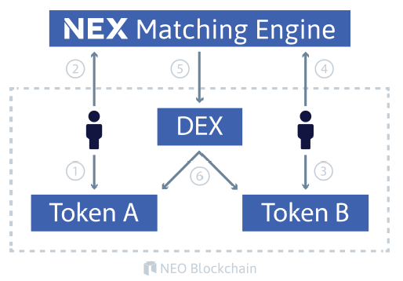
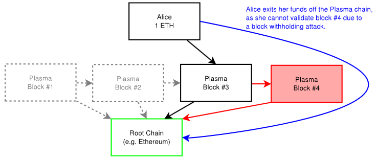
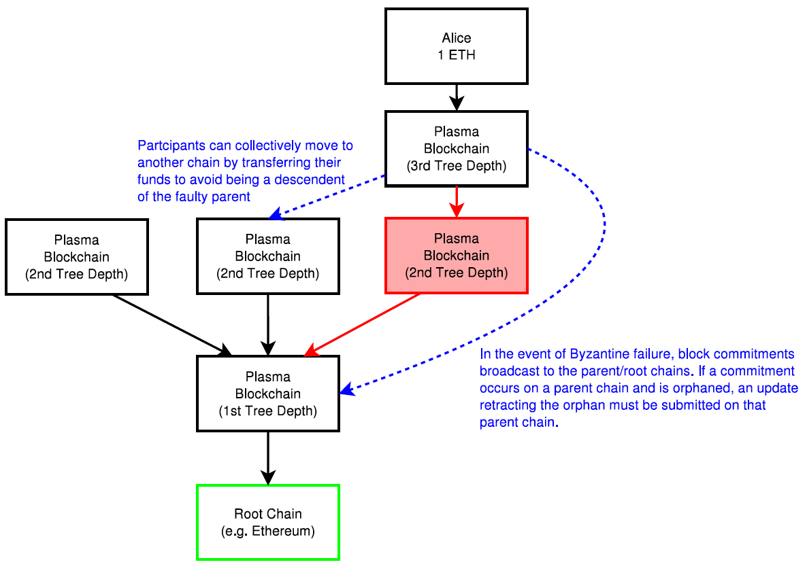
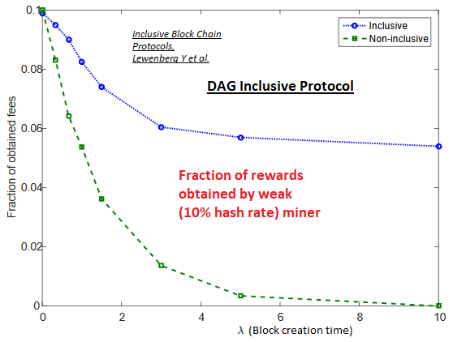

----
theme: default
paginate: true
footer: © Tari Labs, 2018-2021. (License : CC BY-NC-SA 4.0)
_class: lead
backgroundColor: #fff
----

# Layer 2 Scaling Survey

- What is Layer 2 scaling?

- How will this be applicable to Tari?

- Layer 2 scaling current initiatives
  - What is it and who does it?
  - What are its strengths and weaknesses?
  - Opportunities and Threats for Tari?

- Observations

----

# What is Layer 2 scaling?

**Block chain problem to solve:** 

- Average block creation time
- Block size limit
- Number of newer blocks needed to confirm a transaction 

-----

Let's postulate block chain and cryptocurrency "takes over the world", ~433.1 billion non-cash transactions per year...

- 13,734 transactions per second (tx/s) on average!

- Segwit enabled Bitcoin 'like' block chains, need ~644 parallel versions, combined growth ~210 GB per day! 
- Ethereum 'like' block chains, need ~541 parallel versions, combined growth  ~120 GB per day!

This is why we need a proper scaling solution

-----

**Open Systems Interconnection (OSI) model** 

This is where the term 'Layer 2' is borrowed from

-----

**Layer 2 scaling**

- In block chain, decentralized Layer 2 protocols (i.e. Layer 2 scaling) refers to transaction throughput scaling solutions
- Run on top of the main block chain (off-chain), while preserving the attributes of the main block chain (e.g. crypto economic consensus)

----

# How will this be applicable to Tari?

- Tari is a high-throughput protocol that will need to handle real world transaction volumes
- Big Neon, the initial business application to be built on top of the Tari block chain
  - High volume transactions when tickets sales open and when tickets will be redeemed
  - Imagine an 85,000 seat stadium with 72 entrance queues on match days... 
  - Serialized real world scanning: 500 tickets in 4 minutes, or ~2 spectators per second per queue
- This will be impossible to do with parent block chain scaling solutions

----

# Layer 2 scaling current initiatives

## Micropayment Channels

- Users can make multiple transactions without committing all to the block chain
- Hashed Time-Locked Contracts (HTLC) allow payments to be securely routed across multiple payment channels
- It is a second layer payment protocol that operates on top of a block chain

**Example:** The Lightning Network

-----

### Who ?

- Bitcoin, Litecoin, Zcash, Ripple
- Ethereum also interested

### Strengths

- A leading solution presented to scale Bitcoin and Litecoin
- Speed of confirmed transactions
- Low transaction fees

-----

### Weaknesses

- It is not suitable for making bulk payment
- Must be connected and online at the time of the transaction
- Currently channels are only bilateral

### Opportunities for Tari

Less than expected as Tari's ticketing use case requires many fast transactions with many parties, 
not many fast transactions with a single party

### Threats to Tari

None

----

## State Channels

State channels the more general form of micropayment channels (also used for any arbitrary 
“state update” on block chain) like changes inside smart contract.

**Consensus**: Change of state within channel needs explicit cryptographic consent. Use 
digitally signed and hash-locked transfers as consensus mechanism (balance proofs) secured by 
time-out (HTLC).

-----

### Who?

- Raiden (***On Ethereum***)
  - Research state channel technology, define protocols and develop reference implementations
  - Works with any ERC20 compatible token

- Counterfactual (***On Ethereum***)

  - Generalised framework for native state channels integration (Ethereum dApps)
  - State deposited once and then used by any set of dApps afterwards
  - Counterfactual instantiation means to instantiate a contract without actually deploying 
    it on-chain, users sign and share commitments to the multisig wallet 
  - All parties act as though it has been deployed, even though it hasn't 

-----

- - Makes use of global registry, an on-chain contract that maps unique deterministic addresses for any counterfactual 
contract to actual on-chain deployed addresses 
  - A typical Counterfactual state-channel is composed of counterfactually instantiated objects

-----

- Funfair (***On Ethereum***)
  - Decentralized gambling platform, centralized server based random number generation 
  - Investigating threshold cryptography like Boneh–Lynn–Shacham (BLS) signature schemes to enable secure random number 
  generation by a group of participants 

- Trinity  (***On NEO***)
  - Trinity is an open-source network protocol based on NEP-5 smart contracts
  - Trinity for NEO is the same as the Raiden Network for Ethereum
  - Trinity uses the same consensus mechanism as the Raiden network
  - New token (TNC) to fund the Trinity network; NEO, NEP-5 and TNC tokens are supported

-----

### Strengths

- Allows payments and changes to smart contracts
- Same as for Micropayment Channels

### Weaknesses, Opportunities for Tari, Threats for Tari

- Same as for Micropayment Channels

----

## Off-chain matching engines

- Orders are matched off-chain in matching engine and fulfilled on-chain
- Allows complex orders
- Support cross-chain transfers
- Maintains public record of orders and a deterministic specification of behaviour
- Makes use of token representation smart contract, that converts global assets into smart contract tokens and vice versa

-----

### Who?

**Neon Exchange (NEX)** a NEO dApp

- Initially focussed on NEO, GAS and NEP-5 token transactions  -  Exchange on Ethereum and other block chains planned
- Off-chain matching engine will be scalable, distributed, fault-tolerant, function continuously and without downtime
- Consensus is achieved using cryptographically signed requests, public ledgers of transactions 

**0x** An Ethereum ERC20 based smart contract token (ZRX)

- Open source protocol to exchange ERC20 compliant tokens, matching engines in the form of dApps (*Relayers*), facilitate 
transactions between *Makers* and *Takers* 
- Consensus are governed with the publically available DEX smart contract 

-----

----

-----

###  Strengths

- Performance {*NEX*, *0x*}
  - Off-chain request/order
  - Off-chain matching
- NEX specific
  - Batched on-chain commits
  - Cross-chain transfers
  - Support of national currencies
  - Public JavaScript Object Notation (JSON) Application Programmers Interface (API) & web extension API for third-party 
  applications to trade tokens
  - Development environment: ***Elixir on top of Erlang*** to enable scalable, distributed, and fault-tolerant matching 
  engine

-----

- - Cure53 full security audit on web extension, NEX tokens regulated as registered European securities
- 0x specific
  - Open source protocol enable creation of independent off-chain dApp matching engines (*Relayers*)
  - Totally transparent matching of orders with no single point of control
    - Maker's order only enters a Relayer's order book if fee schedule is adhered to
    - Exchange can only happen if a Taker is willing to accept
  - Consensus and settlement governed by the publically available DEX smart contract

### Weaknesses

- NEX and 0x still in development

-----

- NEX specific
  - Certain level of trust is required, similar to traditional exchange
  - Closed liquidity pool
- 0x specific
  - Trusted Token Registry will be required to verify ERC20 token addresses and exchange rates
  - Front running transactions and transaction collisions possible, more development needed
  - Batch processing ability unknown

### Opportunities for Tari

- Matching engines in general have opportunity for Tari; the specific scheme to be investigated further

### Threats for Tari

- None

----

## Masternodes

- A masternode is a server on a decentralized network, features like direct send/instant transactions 
  or private transactions
- Masternode operators rewarded by earning portions of block rewards, standard return on their stakes 
  & portion of the transaction fees - allowing for a greater ROI

- **Dash Example**

  - 2nd tier network masternodes exists alongside a 1st tier network miners to achieve distributed 
    consensus on the block chain
  - Special deterministic algorithm used to create pseudo-random ordering of Masternodes 
  - N pseudo random Masternodes perform the same task, act as an oracle 
  - Proof of service algorithm: Masternodes check rest of network to ensure they remain active, ~1% 
    checked each block, entire network checked ~6 times per day (trustless, randomly via the 
    Quorum system)

-----

### Who?

Block, Bata, Crown, Chaincoin, Dash, Diamond, ION, Monetary Unit, Neutron, PIVX, Vcash, XtraBytes 

### Strengths

- Can sustain and take care of the ecosystem, protect block chains from network attacks
- Can perform decentralized governance of miners by having the power to reject or orphan blocks
- Can support decentralized exchanges
- Can be used to facilitate smart contracts 
- Can facilitate a decentralized marketplace
- Can compensate PoW's limitations; avoids mining centralization and consumes less energy
- Masternodes promise enhanced stability and network loyalty 

-----

### Weaknesses

- Maintaining of masternodes can be long and arduous
- ROI is not guaranteed and inconsistent
- IP address is publicized and thus open to attacks

### Opportunities for Tari

- Masternodes can facilitate smart contracts off-chain & enhance security
- Increases incentives

### Threats to Tari

None

----

## Plasma

### What is it?

- Plasma is a framework for incentivized and enforced execution of smart contracts, scalable to a 
  significant amount of state updates per second, enabling the root block chain to be able to 
  represent a significant amount of dApps, each employing its own block chain in a tree format

- Plasma relies on two key parts: MapReduce functions, and an optional method to do Proof-of-Stake 
  token bonding on top of existing block chains

-----

- Nakamoto Consensus incentives discourage block withholding or other Byzantine behaviour

- MapReduce: commitments on block chain computations as input in map phase, merkleized 
  proof of state transition in reduce step when returning the result

-----

### Who?

- *Loom Network*, using Delegated Proof of Stake (DPoS) consensus and validation, enabling 
  scalable Application Specific Side Chains (DAppChains), running on top of Ethereum

- *OMG Network (OmiseGO)*, using Proof of Stake (PoS) consensus and validation, a Plasma block 
  chain scaling solution for finance running on top of Ethereum

-----

### Strengths

- Not all participants need to be online to update state
- Participants do not need record of entry on parent block chain to enable their participation in 
  a Plasma block chain
- Minimal data needed on parent block chain to confirm transactions when constructing Plasma 
  block chains in tree format
- Private block chain networks can be constructed, enforced by the root block chain (transactions 
  may occur on local private block chain and have financial activity bonded by a public parent 
  block chain)

### Weaknesses

Must still be proven on other networks apart from Ethereum

-----

### Opportunities for Tari

- Has opportunities for Tari as a L2 scaling solution
- *Possibility to create a Tari ticketing Plasma dAppChain running of Monero without creating a Tari 
  specific root block chain?* 
  [**Note:** This will make the Tari block chain dependent on another block chain.]

### Threats for Tari

The Loom Network's SDK makes it extremely easy for anyone to create a new Plasma block chain. In less 
than a year a number of successful and diverse dAppChains have launched. *The next one can easily be 
for ticket sales...*

----

## TumbleBit

- TumbleBit protocol was invented at the Boston University
- Unidirectional, unlinkable payment hub for Bitcoin
- Combines off-chain cryptographics with on-chain Bitcoin scripting to realize smart contracts 
  not dependent on Segwit

-----

- Bitcoin scripting used: Hashing conditions, signing conditions, conditional execution, 2-of-2 
  multi signatures and timelocking
- Fast, anonymous, off-chain payments through an **untrusted** intermediary called the Tumbler
- Classic mixing/tumbling/washing mode or as a fully fledged payment hub
- Two interleaved fair-exchange protocols - *RSA-Puzzle-Solver Protocol* and *Puzzle-Promise Protocol*, 
  relies on the RSA cryptosystem's blinding properties
- Anonymizing through Tor to ensure that the Tumbler server can operate as a hidden service

-----

- Boston University provided a proof-of-concept and reference implementation
- NTumbleBit - C# production implementation of the TumbleBit protocol by Stratis with their Breeze 
  implementation (Nearly production ready)

**Strengths**

- Anonymity properties
- DoS & Sybil protection
- Balance 
- 2x modes of operation: classic tumbler, payment hub
- Scale ability
- Batch processing 
- Masternode compatibility

-----

**Weaknesses**

- Payees have better privacy than the payers
- Tumbler service not distributed
- Equal denominations required 

**Opportunities for Tari**

Has benefits to Tari as a trustless Masternode matching/batch processing engine with strong privacy features.

----

## Counterparty

- Counterparty NOT a block chain, but token protocol that operates on Bitcoin
- Full DEX & hardcoded smart contracts, e.g. difference, binary options
- Embedded consensus (all comms via Bitcoin, identical ledgers, no P2P network)
- Tx meta data embedded into Bitcoin Txs on Bitcoin block chain (e.g. 1-of-3 multisig, P2SH or P2PKH)
- Read and validated by the federated nodes, executed by them

----

-----

- On testnet only, never included on the mainnet : **EVM** for smart contracts
  - Counterparty smart contracts “lives” at Bitcoin addresses that starts with a `C`
  - Broadcast an `execute` Tx to call a specific function in smart contract code
  - Tx confirmed by Bitcoin miner -> Counterparty federated nodes execute the function 
  - The contract state is modified as the smart contract code executes and stored in the Counterparty database

- Most notable projects built on top of Counterparty:
  - [Age of Chains](https://www.ageofchains.com), [Age of Rust](http://spacepirate.io), [Augmentors](https://www.augmentorsgame.com/), [Authparty](http://authparty.io/), [Bitcorns](https://bitcorns.com/), [Blockfreight™](http://blockfreight.com/), [Blocksafe](http://www.blocksafefoundation.com), [BTCpaymarket.com](http://btcpaymarket.com), [CoinDaddy](http://coindaddy.io), [COVAL](https://coval.readme.io), [FoldingCoin](http://foldingcoin.net/), [FootballCoin](https://www.footballcoin.io/), [GetGems](http://getgems.org/#/), [IndieBoard](https://indiesquare.me/), [LTBCoin - Letstalkbitcoin.com](https://letstalkbitcoin.com/), [Mafia Wars](https://mafiawars.io/), [NVO](https://nvo.io/), [Proof of Visit](https://proofofvisit.com/), [Rarepepe.party](http://rarepepe.party), [SaruTobi Island](http://mandelduck.com/sarutobiisland/), [Spells of Genesis](http://www.spellsofgenesis.com), [Takara](https://mandelduck.com/#portfolio), [The Scarab Experiment](https://www.thescarabexperiment.org/), [Token.FM](https://token.fm/), [Tokenly](http://tokenly.com/), [TopCoin](https://topcoin.com/) and [XCP DEX](https://XCPDEX.COM)

-----

**Strengths**

- Provides hard coded smart contract abilities rooted in Bitcoin block chain
- Embedded consensus - Txs created and embedded into Bitcoin Txs (permissionless innovation)

**Weaknesses**

- Embedded consensus requires lockstep upgrades from network nodes to avoid forks
- Embedded consensus imposes limitations on 2nd layer to interact with base layer's token
- Embedded consensus hampers protocol flexibility & limits speed to that of base layer

**Opportunities for Tari**

See **_Scriptless scripts_**

----

## 2-Way Pegged Secondary Block Chains

- 2WP allows "transfer" of BTC from main Bitcoin block chain to secondary block chain and 
  vice-versa at fixed rate, use appropriate security protocol.
- "Transfer" involves BTC be locked on main Bitcoin block chain, made available on secondary 
  block chain
- **Sidechain:** Security protocol implemented using Simplified Payment Verification (SPV) proofs 
- **Drivechain:** Custody of BTC to miners, vote when to unlock BTC and where to send them
- **Federated Peg/Sidechain:** Trusted federation of mutually distrusting functionaries/notaries
- **Hybrid Sidechain-Drivechain-Federated Peg:** SPV proofs one way and mix of miner 
  Dynamic Membership Multi-party Signature (DMMS) and functionaries/notaries multi-signatures going back

-----

- Locking of BTC on main block chain with P2SH Tx (BTC to script hash, not public key hash)

-----

- To unlock, provide a script matching the script hash and data to make script evaluate true
- 2WP promise concluded when equivalent amount tokens on secondary block chain locked so original 
  bitcoins can be unlocked

**Who**

- RSK (*formerly Rootstock*) using a hybrid sidechain-drivechain security protocol
- Hivemind (formerly Truthcoin) is implementing a Peer-to-Peer Oracle Protocol 
- Blockstream is implementing a Federated Sidechain called Liquid

-----

**Strengths**

- Permissionless Innovation
- can be used to test or implement new features without risk
- Chains-as-a-Service (CaaS), with data storage 2WP secondary block chains
- Make it easier to implement smart contracts
- Can support larger block sizes and more Txs per second

**Weaknesses**

- Transferring BTC back into the main Bitcoin block chain is not secure
- Hugely dependent on merged mining, thus 51% attacks are a real threat
- DMMS provided by mining not secure for small systems, while trust of federation/notaries riskier for large systems

**Opportunities for Tari**

None, if enough functionality will be built into the main Tari block chain

----

## Lumino

- Lumino Transaction Compression Protocol (LTCP) -> Tx compression
- It is a lightning-like extension of the RSK platform that uses LTCP
- Difference compression of data from same owner, aggregate signing of previous Txs
- RSK newly launched main net January 2018, Lumino Network to be launched test net

----

-----

**Strengths**

- Promises high efficiency in pruning the RSK block chain

**Weaknesses**

- Has not been released yet
- Details about payment channels not decisive in the white paper

**Opportunities for Tari**

LTCP pruning may be beneficial to Tari

----

## Scriptless scripts

- *Scriptless Scripts* was coined and invented by mathematician Andrew Poelstra 
- Scripting functionality is offered without actual scripts on the block chain to implement 
  smart contracts
- Currently only work on Mimblewimble and makes use of specific Schnorr signature scheme
- Signature aggregation, mathematically combining several signatures into a single signature, 
  without having to prove Knowledge of Secret Keys (KOSK)
- Known as the *plain public-key model* where only requirement is that each potential signer 
  has public key
- KOSK requires users prove possession of secret key during public key registration with certification 
  authority, one way to generically prevent rogue-key attacks

-----

- Signature aggregation properties sought here (different to normal multi-signature scheme):
  - Must be provably secure in the *plain public-key model*
  - Must satisfy normal Schnorr equation, resulting signature written as function of combination 
    of public keys
  - Must allow for Interactive Aggregate Signatures (IAS) where signers are required to cooperate
  - Must allow for Non-interactive Aggregate Signatures (NAS) where aggregation can be done by 
    anyone
  - Must allow each signer to sign the same message
  - Must allow each signer to sign their own message

-----

**User Story...**

Alice and Bob each needs to provide half a Schnorr signature for a Tx whereby Alice promises to reveal 
a secret to Bob in exchange for 1 crypto coin. 

Alice can calculate the difference between her half Schnorr signature and the Schnorr signature of the 
secret (adaptor signature) and hand it over to Bob. Bob then has the ability to verify the correctness 
of the adaptor signature without knowing the original signatures. Bob can then provide his half Schnorr 
signature to Alice so she can broadcast the full Schnorr signature to claim the crypto coin. 

By broadcasting the full Schnorr signature Bob has access to Alice's half Schnorr signature and he 
can then calculate the Schnorr signature of the secret because he already knows the adaptor signature, 
thereby claiming his prize. This is also known as *Zero-Knowledge Contingent Payments*.

-----

**Who does it?**

[grin-tech.org](https://grin-tech.org/)

Mimblewimble is being sited by Andrew Poelstra as being the ultimate *Scriptless Script*.

-----

**Strengths**

- **Data savings:** Signature aggregation provides data compression on block chain
- **Privacy:** Nothing about Scriptless Script smart contract, other than the settlement Tx, is ever 
  recorded on the block chain
- **Multiplicity:** Multiple digital assets can be transferred between two parties in a single 
  settlement Tx
- **Implicit scalability:** Scalability on the block chain is achieved by virtue of compressing multiple 
  Txs into a single settlement Tx

-----

**Weaknesses**

- Naive implementation of Schnorr multi-signatures that satisfies key aggregation is not secure
- Bellare and Neven (BN) Schnorr signature scheme loses the key aggregation property in order to gain 
  security in the plain public-key model
- New Schnorr-based multi-signature scheme MuSig, provably secure in the *plain public-key model*, 
  interactive signature aggregation where each signer signs their own message must still be proven 
  by complete security analysis

**Opportunities for Tari**

- Tari should implement Mimblewimble, *Scriptless Script*s and the MuSig Schnorr signature scheme
- Mimblewimble *Scriptless Script*s could be combined with a federated node (or masternode), similar 
  to that being developed by Counterparty, but with improved consensus

----

## DAG Derivative Protocols

- A Directed Acyclic Graph (DAG) is a finite directed graph with no directed cycles

- A directed graph is acyclic if it has a topological ordering: for every directed edge *uv* from vertex *u* to 
vertex *v*, *u* comes before *v* in the ordering

-----

- DAG derivative protocols: [GHOST](https://eprint.iacr.org/2013/881.pdf) (*as Ethash PoW algorithm in Ethereum, 
Dagger-Hashimoto*), [Braiding](https://scalingbitcoin.org/hongkong2015/presentations/DAY2/2_breaking_the_chain_1_mcelrath.pdf), [Jute](https://scalingbitcoin.org/milan2016/presentations/D2%20-%209%20-%20David%20Vorick.pdf), [SPECTRE](http://www.cs.huji.ac.il/~yoni_sompo/pubs/16/SPECTRE_complete.pdf) and [PHANTOM](https://docs.wixstatic.com/ugd/242600_92372943016c47ecb2e94b2fc07876d6.pdf) was presented
- DAG in block chain includes traditional off-chain blocks into the ledger, governed by 
  mathematical rules
- A parent that is simultaneously an ancestor of another parent is disallowed

-----

- Main problems solved by the DAG derivative protocols:
  - Inclusion of orphaned blocks (decrease the negative effect of slow propagation)
  - Mitigation against selfish mining attacks

-----

- Most DAG derivative protocols
  - Blocks containing conflicting Txs (*i.e. conflicting blocks*) are not orphaned *[not in Braiding]*
  - Conflicting Txs are thrown out while processing the chain
  - SPECTRE: blocks vote -> Tx robustly accepted, Tx robustly rejected, Tx indefinite “pending”
  - All conflicting blocks earn their respective miners a block reward *[not in Braiding]*

-----

- Inclusive (DAG derivative) protocols
  - Incentives for behavior changes by nodes lead to increased throughput
  - Better payoff for weak miners

- *Note: DAG derivative protocols not Layer 2 Scaling solution, offer scaling of primary block chain*

-----

- The Hebrew University of Jerusalem & [DAGlabs](https://www.daglabs.com/) (*the commercial development chapter*)
  - [GHOST](https://eprint.iacr.org/2013/881.pdf), [SPECTRE](http://www.cs.huji.ac.il/~yoni_sompo/pubs/16/SPECTRE_complete.pdf), [PHANTOM](https://docs.wixstatic.com/ugd/242600_92372943016c47ecb2e94b2fc07876d6.pdf)
- Ethereum as the Ethash PoW algorithm that has been adapted from GHOST
- [Dr. Bob McElrath](http://bob.mcelrath.org/resume/)
  - [Brading](https://scalingbitcoin.org/hongkong2015/presentations/DAY2/2_breaking_the_chain_1_mcelrath.pdf)
- David Vorick
  - [Jute](https://scalingbitcoin.org/milan2016/presentations/D2%20-%209%20-%20David%20Vorick.pdf)
- Crypto currencies:
  - [IOTA](https://www.iota.org/) 
  - [Nano](https://nano.org/en)
  - [Byteball](https://byteball.org/)

-----

**Strengths**

- **Layer 1 scaling:** Increased Tx throughput on the main block chain
- **Fairness:** Better payoff for weak miners
- **Decentralization mitigation:** Weaker miners also get profits
- **Tx confirmation times:** Confirmation times of several seconds (SPECTRE)
- **Smart contracts:** Support smart contracts (PHANTOM)

**Weaknesses**

- Still not proven 100%, development continuing
- DAG derivative protocols differ on important aspects like miner payment schemes, security 
  models, support for smart contracts, confirmation times, etc.
- All DAG derivative protocols are not created equal, beware!

-----

**Opportunities for Tari**

- Applying the basic DAG principles to make a 51% attack harder by virtue of fairness and 
  miner decentralization resistance.
- Choosing the correct DAG derivative protocol can also significantly improve Layer 1 scaling

----

## Observations

Further investigation into the more promising layer 2 scaling solutions and technologies is 
required to verify alignment, applicability and use-ability.

Although not all technologies covered here are Layer 2 Scaling solutions, the strengths should 
be considered as building blocks for the Tari protocol.
